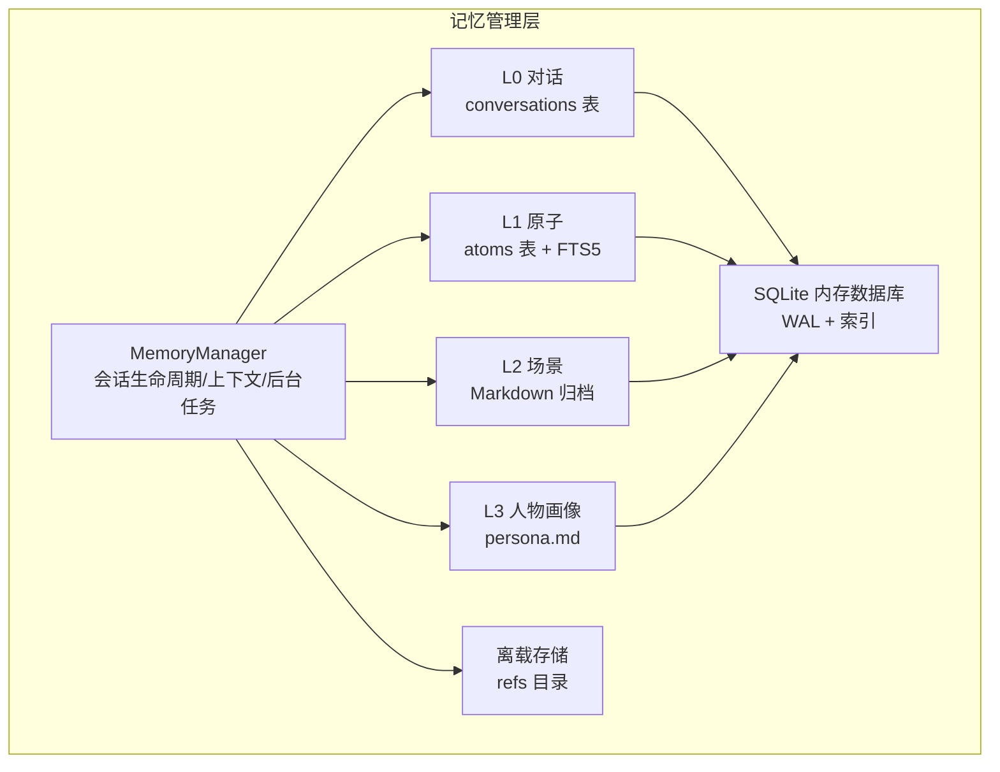
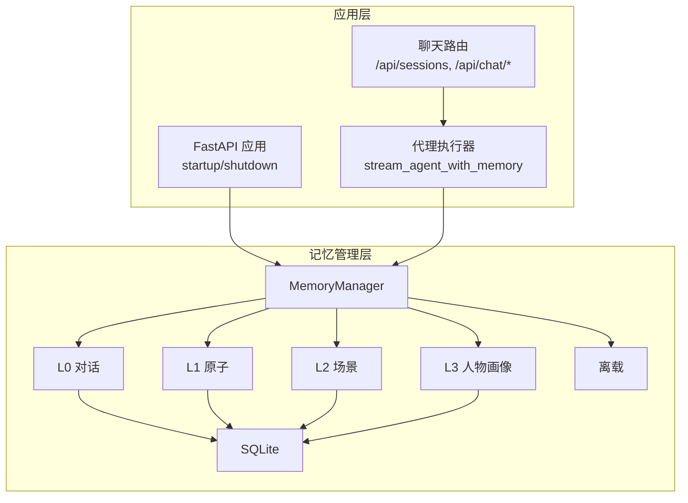
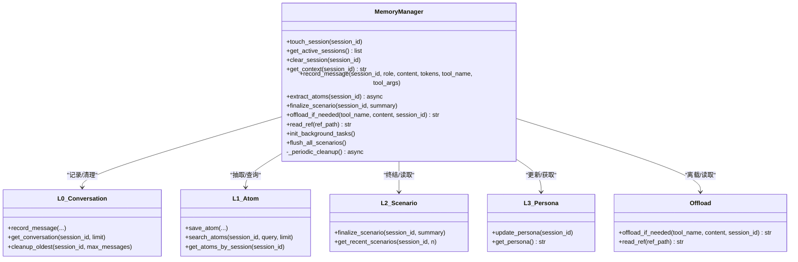
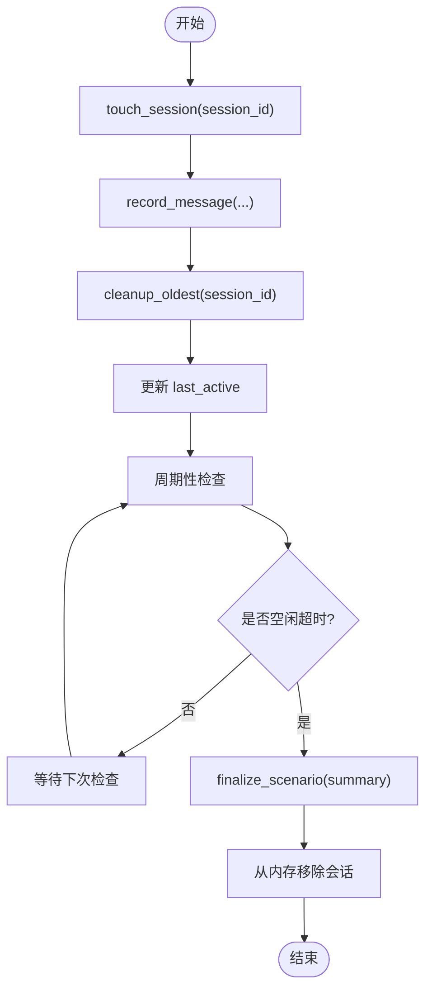
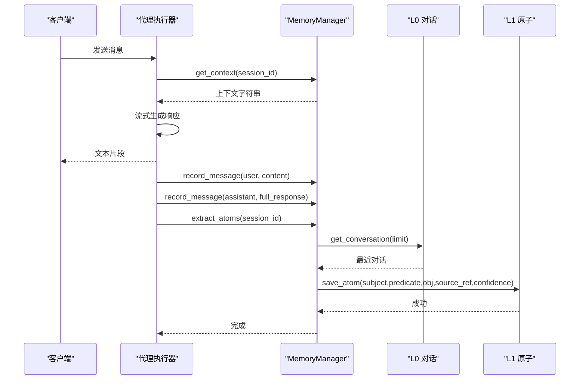
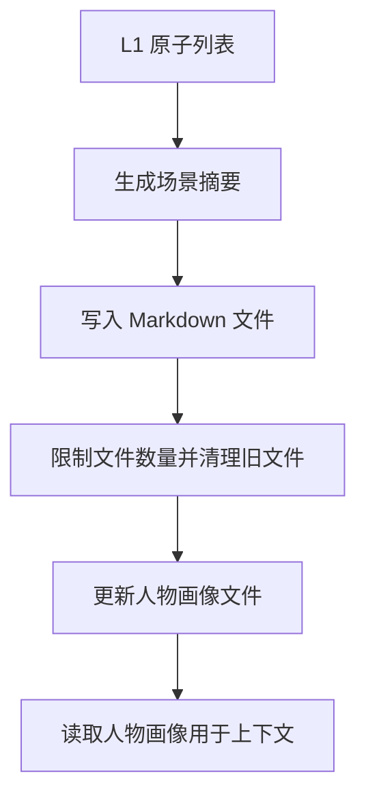
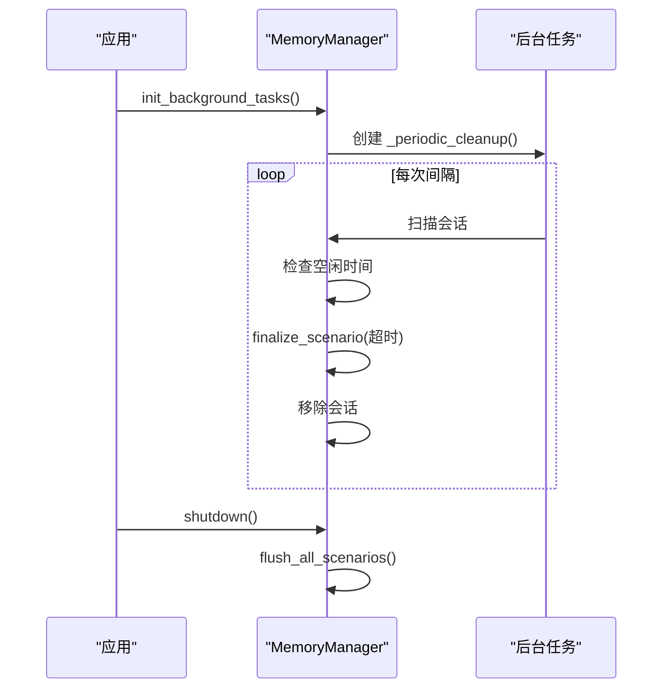
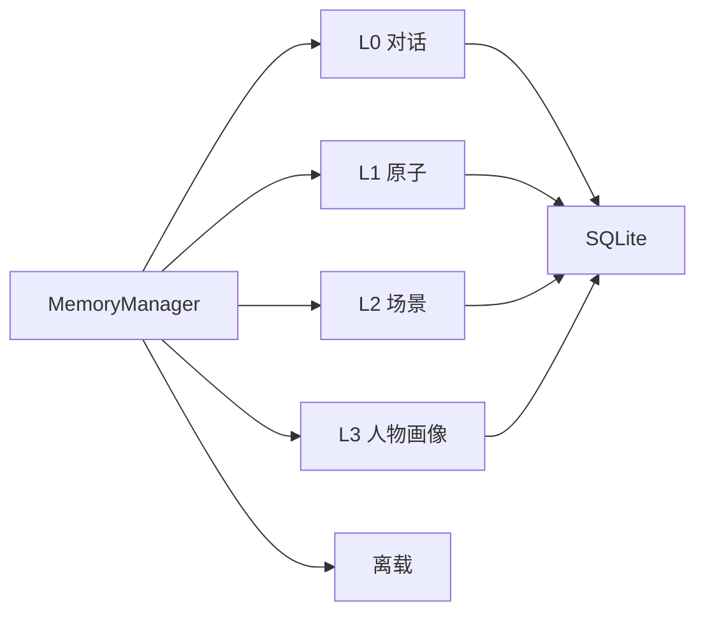

# 记忆管理核心

<cite>
**本文引用的文件**
- [backend/app/memory/manager.py](file://backend/app/memory/manager.py)
- [backend/app/memory/l0_conversation.py](file://backend/app/memory/l0_conversation.py)
- [backend/app/memory/l1_atom.py](file://backend/app/memory/l1_atom.py)
- [backend/app/memory/l2_scenario.py](file://backend/app/memory/l2_scenario.py)
- [backend/app/memory/l3_persona.py](file://backend/app/memory/l3_persona.py)
- [backend/app/memory/db.py](file://backend/app/memory/db.py)
- [backend/app/memory/offload.py](file://backend/app/memory/offload.py)
- [backend/app/config.py](file://backend/app/config.py)
- [backend/app/main.py](file://backend/app/main.py)
- [backend/app/routers/chat.py](file://backend/app/routers/chat.py)
- [backend/app/agent/executor.py](file://backend/app/agent/executor.py)
- [backend/tests/test_memory.py](file://backend/tests/test_memory.py)
- [backend/tests/test_memory_extended.py](file://backend/tests/test_memory_extended.py)
</cite>

## 目录
1. [引言](#引言)
2. [项目结构](#项目结构)
3. [核心组件](#核心组件)
4. [架构总览](#架构总览)
5. [详细组件分析](#详细组件分析)
6. [依赖分析](#依赖分析)
7. [性能考虑](#性能考虑)
8. [故障排查指南](#故障排查指南)
9. [结论](#结论)
10. [附录](#附录)

## 引言
本文件面向开发者与架构师，系统化阐述记忆管理核心组件的设计与实现，重点围绕 MemoryManager 类展开，覆盖会话生命周期管理、活动会话跟踪、会话清理机制；记忆提取流程、原子记忆生成与场景总结；后台任务管理、定时清理与自动终结；会话状态管理、内存优化与性能监控；以及错误处理策略、异常恢复与日志记录。同时给出与其他组件的集成方式与数据流转过程，帮助读者快速扩展与优化记忆管理功能。

## 项目结构
记忆管理模块位于后端应用的 app/memory 子目录，采用“分层存储 + 后台任务”的设计：
- 分层存储：L0 对话（短期）、L1 原子（事实抽取）、L2 场景（离线归档）、L3 人物画像（长期上下文）
- 后台任务：周期性清理与自动终结
- 数据库：SQLite（WAL 模式），线程本地连接，索引与 FTS 支持
- 配置：通过 Settings 控制离载阈值、会话消息上限等

图表来源
- [backend/app/memory/manager.py:20-129](file://backend/app/memory/manager.py#L20-L129)
- [backend/app/memory/l0_conversation.py:8-64](file://backend/app/memory/l0_conversation.py#L8-L64)
- [backend/app/memory/l1_atom.py:9-97](file://backend/app/memory/l1_atom.py#L9-L97)
- [backend/app/memory/l2_scenario.py:18-93](file://backend/app/memory/l2_scenario.py#L18-L93)
- [backend/app/memory/l3_persona.py:11-43](file://backend/app/memory/l3_persona.py#L11-L43)
- [backend/app/memory/db.py:15-62](file://backend/app/memory/db.py#L15-L62)
- [backend/app/memory/offload.py:11-52](file://backend/app/memory/offload.py#L11-L52)

章节来源
- [backend/app/memory/manager.py:1-130](file://backend/app/memory/manager.py#L1-L130)
- [backend/app/memory/db.py:1-63](file://backend/app/memory/db.py#L1-L63)
- [backend/app/config.py:48-49](file://backend/app/config.py#L48-L49)

## 核心组件
- MemoryManager：统一入口，负责会话生命周期、上下文拼装、消息记录、原子提取、场景终结与人物画像更新、离载调度、后台任务启动与清理。
- L0 对话：短期对话记录，支持上限清理。
- L1 原子：事实级记忆，支持 FTS5 全文检索与回退策略。
- L2 场景：按会话日期归档 Markdown 文件，保留摘要与关键事实。
- L3 人物画像：从近期场景提炼摘要，形成全局上下文。
- 离载模块：对超长内容进行落盘并返回引用摘要。
- 数据库：SQLite，WAL 模式，线程本地连接，索引优化。
- 配置：控制离载阈值、会话最大消息数等。

章节来源
- [backend/app/memory/manager.py:20-129](file://backend/app/memory/manager.py#L20-L129)
- [backend/app/memory/l0_conversation.py:8-64](file://backend/app/memory/l0_conversation.py#L8-L64)
- [backend/app/memory/l1_atom.py:9-97](file://backend/app/memory/l1_atom.py#L9-L97)
- [backend/app/memory/l2_scenario.py:18-93](file://backend/app/memory/l2_scenario.py#L18-L93)
- [backend/app/memory/l3_persona.py:11-43](file://backend/app/memory/l3_persona.py#L11-L43)
- [backend/app/memory/offload.py:11-52](file://backend/app/memory/offload.py#L11-L52)
- [backend/app/memory/db.py:15-62](file://backend/app/memory/db.py#L15-L62)
- [backend/app/config.py:48-49](file://backend/app/config.py#L48-L49)

## 架构总览
MemoryManager 作为中枢，串联各层记忆与后台任务，并在应用启动时初始化数据库与后台任务，在关闭时进行全量场景终结与资源释放。聊天路由与代理执行器在运行期通过 MemoryManager 注入上下文、记录消息并触发原子提取。

图表来源
- [backend/app/main.py:171-211](file://backend/app/main.py#L171-L211)
- [backend/app/routers/chat.py:46-106](file://backend/app/routers/chat.py#L46-L106)
- [backend/app/agent/executor.py:64-122](file://backend/app/agent/executor.py#L64-L122)
- [backend/app/memory/manager.py:20-129](file://backend/app/memory/manager.py#L20-L129)

## 详细组件分析

### MemoryManager 设计与实现
- 会话生命周期
  - touch_session：每次消息交互时调用，维护会话创建时间与最近活跃时间。
  - get_active_sessions：返回当前活动会话 ID 列表。
  - clear_session：从内存中移除指定会话。
- 上下文拼装
  - get_context：组合 L3 人物画像与 L2 最近场景摘要，作为系统提示注入。
- 消息记录与清理
  - record_message：写入 L0 对话并触发 L0 清理；同时更新会话活跃度。
- 原子记忆与场景
  - extract_atoms：从最近对话中抽取用户陈述为原子记忆（L1）。
  - finalize_scenario：生成 L2 场景 Markdown 并更新 L3 人物画像。
- 离载与读取
  - offload_if_needed：当内容超过阈值时离载至 refs 目录并返回摘要行。
  - read_ref：安全读取离载文件，防止路径穿越。
- 后台任务
  - init_background_tasks：启动周期性清理任务。
  - flush_all_scenarios：服务关闭时终结所有活动会话。
  - _periodic_cleanup：按间隔检查空闲会话并自动终结，避免内存泄漏。

图表来源
- [backend/app/memory/manager.py:20-129](file://backend/app/memory/manager.py#L20-L129)
- [backend/app/memory/l0_conversation.py:8-64](file://backend/app/memory/l0_conversation.py#L8-L64)
- [backend/app/memory/l1_atom.py:43-97](file://backend/app/memory/l1_atom.py#L43-L97)
- [backend/app/memory/l2_scenario.py:35-93](file://backend/app/memory/l2_scenario.py#L35-L93)
- [backend/app/memory/l3_persona.py:11-43](file://backend/app/memory/l3_persona.py#L11-L43)
- [backend/app/memory/offload.py:11-52](file://backend/app/memory/offload.py#L11-L52)

章节来源
- [backend/app/memory/manager.py:20-129](file://backend/app/memory/manager.py#L20-L129)

### 会话生命周期管理与活动会话跟踪
- 生命周期要点
  - 创建：首次 touch_session 即创建会话条目。
  - 活跃：每次消息交互都会更新 last_active。
  - 查询：get_active_sessions 返回当前内存中的会话集合。
  - 清理：clear_session 从内存移除，不删除历史数据。
- 自动终结与清理
  - _periodic_cleanup 每隔固定秒数扫描一次，若会话空闲超过阈值则自动终结并移除。
  - flush_all_scenarios 在 shutdown 时对所有活动会话执行终结，确保数据落盘。

图表来源
- [backend/app/memory/manager.py:27-127](file://backend/app/memory/manager.py#L27-L127)
- [backend/app/memory/l0_conversation.py:47-64](file://backend/app/memory/l0_conversation.py#L47-L64)

章节来源
- [backend/app/memory/manager.py:27-127](file://backend/app/memory/manager.py#L27-L127)

### 记忆提取流程与原子记忆生成
- 触发时机
  - 代理执行器在收到“完成”事件后，记录用户与助手消息，并异步触发 extract_atoms。
- 抽取逻辑
  - 从 L0 获取最近对话，筛选用户消息，截取内容前缀作为原子对象，写入 L1 原子表。
  - 使用 FTS5 虚拟表与触发器实现全文检索与回退策略。
- 查询与回退
  - search_atoms 优先使用 FTS5 匹配，失败时回退到 LIKE 查询。

图表来源
- [backend/app/agent/executor.py:64-122](file://backend/app/agent/executor.py#L64-L122)
- [backend/app/memory/manager.py:60-71](file://backend/app/memory/manager.py#L60-L71)
- [backend/app/memory/l0_conversation.py:27-35](file://backend/app/memory/l0_conversation.py#L27-L35)
- [backend/app/memory/l1_atom.py:43-60](file://backend/app/memory/l1_atom.py#L43-L60)

章节来源
- [backend/app/agent/executor.py:64-122](file://backend/app/agent/executor.py#L64-L122)
- [backend/app/memory/manager.py:60-71](file://backend/app/memory/manager.py#L60-L71)
- [backend/app/memory/l1_atom.py:9-97](file://backend/app/memory/l1_atom.py#L9-L97)

### 场景总结与人物画像
- 场景总结（L2）
  - finalize_scenario 将 L1 原子摘要写入 Markdown 文件，限制数量并清理旧文件。
  - get_recent_scenarios 读取最近 N 个场景内容，带缓存与 TTL。
- 人物画像（L3）
  - update_persona 从最近场景中提取摘要行，写入 persona.md，限制大小并做截断。
  - get_persona 提供全局上下文读取。

图表来源
- [backend/app/memory/l2_scenario.py:35-93](file://backend/app/memory/l2_scenario.py#L35-L93)
- [backend/app/memory/l3_persona.py:11-43](file://backend/app/memory/l3_persona.py#L11-L43)

章节来源
- [backend/app/memory/l2_scenario.py:18-93](file://backend/app/memory/l2_scenario.py#L18-L93)
- [backend/app/memory/l3_persona.py:11-43](file://backend/app/memory/l3_persona.py#L11-L43)

### 后台任务管理、定时清理与自动终结
- 启动与注册
  - 应用 startup 中调用 init_background_tasks，创建后台任务。
- 周期性清理
  - _periodic_cleanup 每隔固定秒数扫描会话，超时自动终结并移除。
- 关闭清理
  - shutdown 调用 flush_all_scenarios，确保所有活动会话落盘。

图表来源
- [backend/app/main.py:199-210](file://backend/app/main.py#L199-L210)
- [backend/app/memory/manager.py:88-127](file://backend/app/memory/manager.py#L88-L127)

章节来源
- [backend/app/main.py:199-210](file://backend/app/main.py#L199-L210)
- [backend/app/memory/manager.py:88-127](file://backend/app/memory/manager.py#L88-L127)

### 会话状态管理、内存优化与性能监控
- 会话状态
  - 内存中仅维护会话活跃度字典，键为 session_id，值含创建与最后活跃时间。
- 内存优化
  - L0 清理：超过阈值时删除最旧消息，阈值来自配置。
  - L2 清理：限制场景文件数量，定期删除最旧文件。
  - L3 截断：人物画像最大长度限制，避免膨胀。
- 性能监控
  - 应用内置 Prometheus 指标暴露端点，便于观测整体性能。
  - 日志采用结构化记录，便于追踪与排障。

章节来源
- [backend/app/memory/manager.py:27-77](file://backend/app/memory/manager.py#L27-L77)
- [backend/app/memory/l0_conversation.py:47-64](file://backend/app/memory/l0_conversation.py#L47-L64)
- [backend/app/memory/l2_scenario.py:80-93](file://backend/app/memory/l2_scenario.py#L80-L93)
- [backend/app/memory/l3_persona.py:28-30](file://backend/app/memory/l3_persona.py#L28-L30)
- [backend/app/main.py:80-81](file://backend/app/main.py#L80-L81)

### 错误处理策略、异常恢复与日志记录
- 错误处理
  - _periodic_cleanup 捕获取消与异常，记录错误并重启任务。
  - flush_all_scenarios 对每个会话单独 try/catch，避免单个失败影响整体。
  - 代理执行器在记录与抽取阶段捕获解析与字段缺失异常，记录警告并继续。
- 异常恢复
  - 后台任务在取消后自动重启，保证清理持续性。
  - FTS5 初始化失败时回退到 LIKE 查询，保证功能可用。
- 日志记录
  - 统一使用结构化日志，关键事件如“会话清理”、“场景保存”、“人物画像更新”均记录。

章节来源
- [backend/app/memory/manager.py:104-127](file://backend/app/memory/manager.py#L104-L127)
- [backend/app/agent/executor.py:113-118](file://backend/app/agent/executor.py#L113-L118)
- [backend/app/memory/l1_atom.py:39-40](file://backend/app/memory/l1_atom.py#L39-L40)

### 与其他组件的集成与数据流转
- 应用启动/关闭
  - startup：初始化数据库与后台任务。
  - shutdown：终结所有场景并关闭缓存。
- 路由集成
  - /api/sessions：列出活动会话。
  - /api/sessions/{session_id}：终结并清理指定会话。
  - /api/chat/stream 与 /api/chat/enhanced/stream：通过代理执行器注入 MemoryManager 上下文。
- 数据流
  - 请求进入路由 → 代理执行器 → MemoryManager.get_context → 记录消息 → 异步抽取原子 → 场景与人物画像更新。

章节来源
- [backend/app/main.py:171-211](file://backend/app/main.py#L171-L211)
- [backend/app/routers/chat.py:46-106](file://backend/app/routers/chat.py#L46-L106)
- [backend/app/agent/executor.py:64-122](file://backend/app/agent/executor.py#L64-L122)

## 依赖分析
- 组件耦合
  - MemoryManager 依赖 L0/L1/L2/L3/offload/db 模块，但对外仅暴露高层接口，内聚性高。
  - 各层模块职责清晰，L0/L1/L2/L3 之间通过文件与数据库间接耦合。
- 外部依赖
  - SQLite（WAL 模式）与 FTS5，线程本地连接避免跨线程竞争。
  - FastAPI 路由与代理执行器作为外部调用方。

图表来源
- [backend/app/memory/manager.py:6-11](file://backend/app/memory/manager.py#L6-L11)
- [backend/app/memory/db.py:15-62](file://backend/app/memory/db.py#L15-L62)

章节来源
- [backend/app/memory/manager.py:6-11](file://backend/app/memory/manager.py#L6-L11)
- [backend/app/memory/db.py:15-62](file://backend/app/memory/db.py#L15-L62)

## 性能考虑
- 数据库层面
  - WAL 模式提升并发读取能力；busy_timeout 缓解写入竞争。
  - 为 conversations 与 atoms 建立索引，加速查询。
- 记忆层优化
  - L0 消息上限清理，避免无限增长。
  - L2 场景文件数量限制，定期清理旧文件。
  - L3 人物画像大小限制，防止上下文膨胀。
- 搜索回退
  - FTS5 初始化失败时回退到 LIKE 查询，保证可用性。
- 运行期开销
  - 异步抽取原子，避免阻塞响应链路。
  - 后台任务周期性检查，避免频繁扫描带来的抖动。

章节来源
- [backend/app/memory/db.py:15-62](file://backend/app/memory/db.py#L15-L62)
- [backend/app/memory/l0_conversation.py:47-64](file://backend/app/memory/l0_conversation.py#L47-L64)
- [backend/app/memory/l2_scenario.py:80-93](file://backend/app/memory/l2_scenario.py#L80-L93)
- [backend/app/memory/l3_persona.py:28-30](file://backend/app/memory/l3_persona.py#L28-L30)
- [backend/app/memory/l1_atom.py:9-41](file://backend/app/memory/l1_atom.py#L9-L41)

## 故障排查指南
- 常见问题与定位
  - 场景文件未生成：检查 L2 目录权限、FTS5 初始化状态与缓存失效。
  - 人物画像为空：确认最近场景是否存在，或更新函数是否被调用。
  - 原子搜索无结果：确认 FTS5 是否初始化成功，必要时回退到 LIKE 查询。
  - 离载失败：检查 refs 目录权限与磁盘空间。
  - 后台任务停止：查看日志中“任务取消/重启”信息，确认循环是否继续。
- 排查步骤
  - 查看应用日志，定位具体报错位置。
  - 使用测试用例验证各层功能（L0/L1/L2/L3/offload）。
  - 在开发环境临时降低清理阈值，观察行为变化。

章节来源
- [backend/tests/test_memory.py:10-63](file://backend/tests/test_memory.py#L10-L63)
- [backend/tests/test_memory_extended.py:248-341](file://backend/tests/test_memory_extended.py#L248-L341)
- [backend/app/memory/l1_atom.py:39-40](file://backend/app/memory/l1_atom.py#L39-L40)
- [backend/app/memory/l2_scenario.py:80-93](file://backend/app/memory/l2_scenario.py#L80-L93)
- [backend/app/memory/offload.py:24-29](file://backend/app/memory/offload.py#L24-L29)

## 结论
MemoryManager 以“分层记忆 + 后台任务”的架构实现了从短期对话到长期上下文的完整闭环。通过严格的会话生命周期管理、原子记忆抽取与场景归档、人物画像提炼与离载机制，系统在可扩展性与稳定性之间取得平衡。配合结构化日志与 Prometheus 指标，开发者可以高效地扩展功能、定制清理策略并优化性能。

## 附录
- 配置项参考
  - offload_max_chars：离载阈值（字符数）
  - session_max_messages：会话最大消息数
- 关键路径
  - 记录消息与清理：[backend/app/memory/l0_conversation.py:8-64](file://backend/app/memory/l0_conversation.py#L8-L64)
  - 原子保存与检索：[backend/app/memory/l1_atom.py:43-97](file://backend/app/memory/l1_atom.py#L43-L97)
  - 场景归档与读取：[backend/app/memory/l2_scenario.py:35-93](file://backend/app/memory/l2_scenario.py#L35-L93)
  - 人物画像更新与读取：[backend/app/memory/l3_persona.py:11-43](file://backend/app/memory/l3_persona.py#L11-L43)
  - 离载与读取：[backend/app/memory/offload.py:11-52](file://backend/app/memory/offload.py#L11-L52)
  - 应用集成与生命周期：[backend/app/main.py:171-211](file://backend/app/main.py#L171-L211), [backend/app/routers/chat.py:46-106](file://backend/app/routers/chat.py#L46-L106), [backend/app/agent/executor.py:64-122](file://backend/app/agent/executor.py#L64-L122)