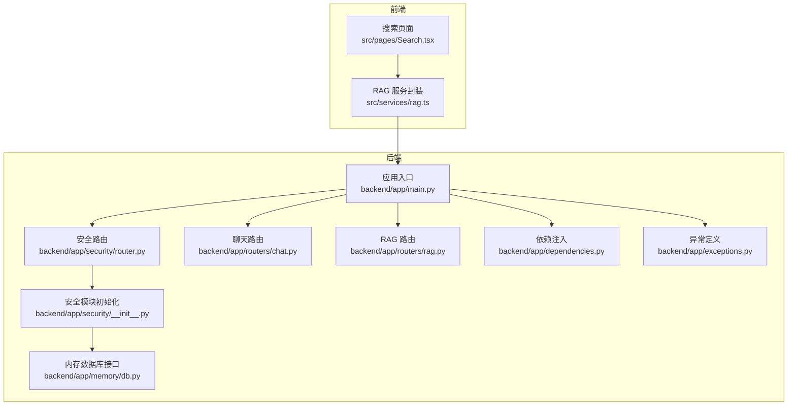
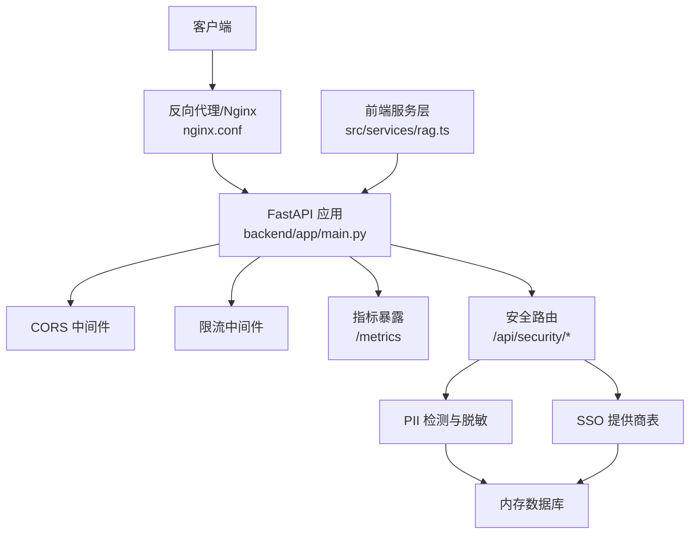
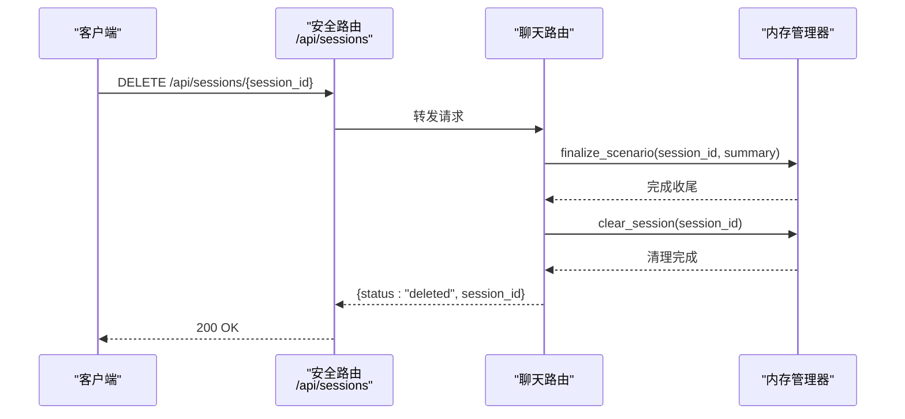
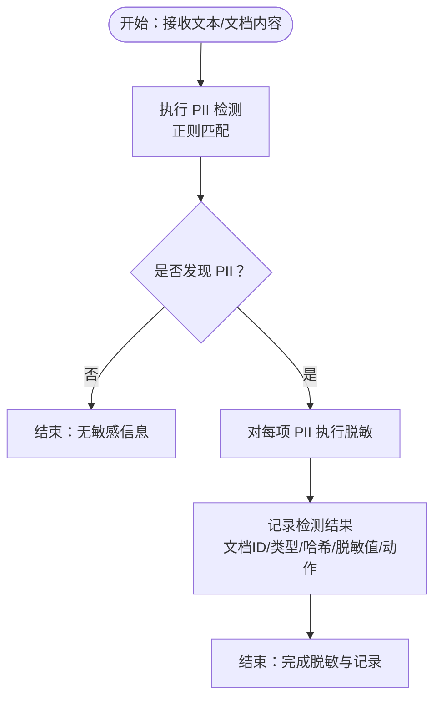
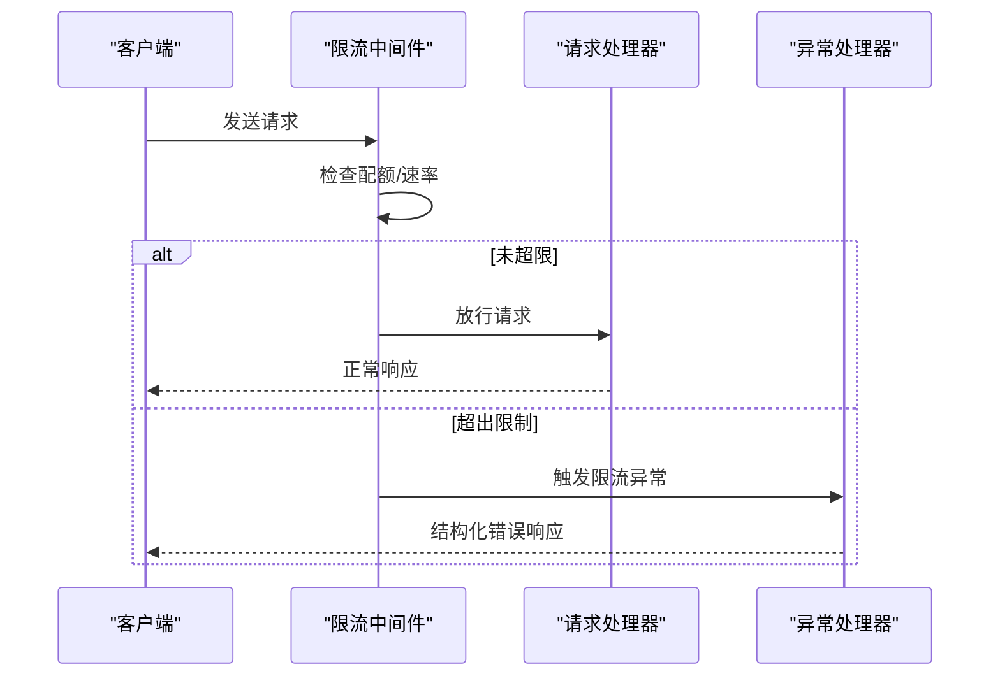
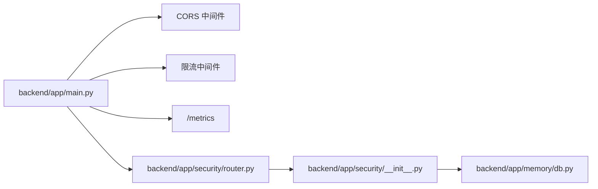

# 安全与合规

<cite>
**本文引用的文件**
- [backend/app/main.py](file://backend/app/main.py)
- [backend/app/security/__init__.py](file://backend/app/security/__init__.py)
- [backend/app/security/router.py](file://backend/app/security/router.py)
- [backend/tests/test_security.py](file://backend/tests/test_security.py)
- [nginx.conf](file://nginx.conf)
- [docker-compose.yml](file://docker-compose.yml)
- [Dockerfile](file://Dockerfile)
- [backend/app/memory/db.py](file://backend/app/memory/db.py)
- [backend/app/routers/chat.py](file://backend/app/routers/chat.py)
- [backend/app/routers/rag.py](file://backend/app/routers/rag.py)
- [backend/app/dependencies.py](file://backend/app/dependencies.py)
- [backend/app/exceptions.py](file://backend/app/exceptions.py)
- [backend/app/utils/lang_detect.py](file://backend/app/utils/lang_detect.py)
- [src/services/rag.ts](file://src/services/rag.ts)
- [src/pages/Search.test.tsx](file://src/pages/Search.test.tsx)
</cite>

## 目录
1. [引言](#引言)
2. [项目结构](#项目结构)
3. [核心组件](#核心组件)
4. [架构总览](#架构总览)
5. [详细组件分析](#详细组件分析)
6. [依赖关系分析](#依赖关系分析)
7. [性能考量](#性能考量)
8. [故障排查指南](#故障排查指南)
9. [结论](#结论)
10. [附录](#附录)

## 引言
本文件面向 Aureon 系统的安全与合规需求，系统化梳理并解释当前实现中的安全架构设计（身份认证、授权机制、会话管理）、数据保护措施（PII 检测、数据加密与隐私保护）、API 安全策略（速率限制、输入验证与防护攻击）、安全配置指南（CORS、安全头、HTTPS 部署）、审计日志与监控告警、安全事件响应流程、合规性与隐私保护、开发者安全编码实践、漏洞预防与安全测试方法，以及第三方集成的安全评估与风险控制建议。本文档同时提供可视化图示与可追溯的章节来源，便于不同背景读者快速定位实现细节。

## 项目结构
Aureon 后端基于 FastAPI 构建，前端采用 React/Vite。安全相关能力主要集中在后端模块 app/security 中，并通过中间件与路由进行全局接入；前端通过服务层与后端交互，具备基础的输入长度校验与错误处理。

**图表来源**
- [backend/app/main.py:69-111](file://backend/app/main.py#L69-L111)
- [backend/app/security/__init__.py:119-164](file://backend/app/security/__init__.py#L119-L164)
- [backend/app/security/router.py:1-53](file://backend/app/security/router.py#L1-L53)
- [backend/app/memory/db.py](file://backend/app/memory/db.py)
- [backend/app/routers/chat.py](file://backend/app/routers/chat.py)
- [backend/app/routers/rag.py](file://backend/app/routers/rag.py)
- [src/services/rag.ts:130-155](file://src/services/rag.ts#L130-L155)

**章节来源**
- [backend/app/main.py:69-111](file://backend/app/main.py#L69-L111)
- [backend/app/security/__init__.py:119-164](file://backend/app/security/__init__.py#L119-L164)
- [backend/app/security/router.py:1-53](file://backend/app/security/router.py#L1-L53)

## 核心组件
- 安全中间件与全局异常处理：在应用启动时注册 CORS 中间件、Prometheus 指标暴露、自定义异常处理器与 HTTP 日志中间件，统一输出结构化错误与请求追踪信息。
- PII 检测与脱敏：内置正则规则识别邮件、手机号、身份证号、银行卡号、IP 地址等敏感信息，支持对文本进行检测与脱敏，并将检测结果持久化到内存数据库。
- SSO 配置与提供商管理：提供 SSO 配置模型与数据库表结构，支持创建、查询与删除 SSO 提供商，为后续身份认证扩展奠定基础。
- 速率限制：通过限流中间件与异常处理器实现请求与令牌级限流，提供速率限制配置查询接口。
- 会话管理：通过聊天路由与内存管理器对接，支持会话列表查询与删除，删除时触发场景收尾与清理逻辑。
- 前端输入验证：在搜索页面对输入长度进行限制，避免超长输入导致的资源消耗与潜在风险。

**章节来源**
- [backend/app/main.py:69-111](file://backend/app/main.py#L69-L111)
- [backend/app/security/__init__.py:20-46](file://backend/app/security/__init__.py#L20-L46)
- [backend/app/security/__init__.py:119-164](file://backend/app/security/__init__.py#L119-L164)
- [backend/app/security/router.py:21-59](file://backend/app/security/router.py#L21-L59)
- [backend/app/routers/chat.py](file://backend/app/routers/chat.py)
- [src/pages/Search.test.tsx:73-110](file://src/pages/Search.test.tsx#L73-L110)

## 架构总览
下图展示安全相关组件在系统中的位置与交互关系，包括 CORS、限流、安全路由、数据库与前端服务层。

**图表来源**
- [backend/app/main.py:69-111](file://backend/app/main.py#L69-L111)
- [backend/app/security/router.py:1-53](file://backend/app/security/router.py#L1-L53)
- [backend/app/security/__init__.py:119-164](file://backend/app/security/__init__.py#L119-L164)
- [nginx.conf](file://nginx.conf)
- [src/services/rag.ts:130-155](file://src/services/rag.ts#L130-L155)

## 详细组件分析

### 身份认证与授权机制
- 当前实现要点
  - SSO 配置模型与数据库表已定义，支持创建/查询/删除 SSO 提供商，但未在路由中直接暴露登录/登出接口或访问令牌发放逻辑。
  - 会话管理通过聊天路由与内存管理器对接，支持会话删除与场景收尾，但未见细粒度的会话状态与权限控制。
- 建议
  - 明确登录/登出流程与令牌颁发策略（如 JWT），并在安全路由中增加鉴权中间件。
  - 对关键操作引入基于角色的访问控制（RBAC）或基于属性的访问控制（ABAC）。
  - 在会话生命周期内记录登录/登出事件，配合审计日志。

**章节来源**
- [backend/app/security/__init__.py:88-96](file://backend/app/security/__init__.py#L88-L96)
- [backend/app/security/__init__.py:169-186](file://backend/app/security/__init__.py#L169-L186)
- [backend/app/security/router.py:64-82](file://backend/app/security/router.py#L64-L82)
- [backend/app/routers/chat.py](file://backend/app/routers/chat.py)

### 会话管理
- 当前实现要点
  - 支持查询会话列表与删除指定会话，删除时调用内存管理器完成场景收尾与会话清理。
- 建议
  - 引入会话超时与自动清理策略，结合访问令牌刷新机制。
  - 记录会话创建/删除/过期事件，纳入审计日志。

**图表来源**
- [backend/app/routers/chat.py](file://backend/app/routers/chat.py)
- [backend/app/security/router.py:76-82](file://backend/app/security/router.py#L76-L82)

**章节来源**
- [backend/app/routers/chat.py](file://backend/app/routers/chat.py)
- [backend/app/security/router.py:76-82](file://backend/app/security/router.py#L76-L82)

### 数据保护：PII 检测、脱敏与隐私
- 当前实现要点
  - 内置正则规则覆盖常见 PII 类型，支持检测与脱敏；检测结果以哈希值与脱敏值记录至内存数据库表，包含文档 ID、类型、原始长度与动作。
  - 提供 /api/security/pii/detect、/api/security/pii/mask、/api/security/pii/scan-document 等接口。
- 建议
  - 对存储的 PII 原始值与令牌进行加密存储（如使用对称加密），仅在必要时解密。
  - 引入数据最小化原则：仅保留必要的脱敏信息与审计记录，定期清理过期数据。
  - 在日志中避免输出完整 PII，使用占位符或哈希替代。

**图表来源**
- [backend/app/security/__init__.py:20-46](file://backend/app/security/__init__.py#L20-L46)
- [backend/app/security/__init__.py:142-164](file://backend/app/security/__init__.py#L142-L164)
- [backend/app/security/router.py:21-59](file://backend/app/security/router.py#L21-L59)

**章节来源**
- [backend/app/security/__init__.py:20-46](file://backend/app/security/__init__.py#L20-L46)
- [backend/app/security/__init__.py:119-164](file://backend/app/security/__init__.py#L119-L164)
- [backend/app/security/router.py:21-59](file://backend/app/security/router.py#L21-L59)
- [backend/tests/test_security.py:19-77](file://backend/tests/test_security.py#L19-L77)

### API 安全策略：速率限制、输入验证与防护
- 速率限制
  - 通过限流中间件与自定义异常处理器实现请求与令牌级限流，提供 /api/security/rate-limits/config 查询配置。
- 输入验证
  - 前端对输入长度进行限制（例如超过一定字符数提示错误），减少超长输入带来的资源消耗与潜在风险。
- 防护攻击
  - CORS 中间件允许指定来源访问，限制方法与头部，降低跨域风险。
  - 自定义异常处理器返回结构化错误，避免泄露内部细节。
  - 日志中间件注入 request_id，便于追踪与审计。

**图表来源**
- [backend/app/main.py:69-111](file://backend/app/main.py#L69-L111)
- [backend/app/security/router.py:86-95](file://backend/app/security/router.py#L86-L95)

**章节来源**
- [backend/app/main.py:69-111](file://backend/app/main.py#L69-L111)
- [backend/app/security/router.py:86-95](file://backend/app/security/router.py#L86-L95)
- [src/pages/Search.test.tsx:73-110](file://src/pages/Search.test.tsx#L73-L110)

### 安全配置指南：CORS、安全头与 HTTPS 部署
- CORS 设置
  - 允许来源从环境变量读取，默认允许本地开发源；仅开放必要方法与头部。
- 安全头
  - 在日志中间件中设置安全相关响应头（如 X-Content-Type-Options、X-Frame-Options、Referrer-Policy 等），建议在反向代理层统一注入。
- HTTPS 部署
  - 使用 Nginx 反向代理与 TLS 终止，结合 Docker Compose 进行容器编排与证书挂载。
  - 建议启用 HSTS、OCSP Stapling 与现代密码套件。

**章节来源**
- [backend/app/main.py:73-78](file://backend/app/main.py#L73-L78)
- [nginx.conf](file://nginx.conf)
- [docker-compose.yml](file://docker-compose.yml)

### 审计日志、监控告警与安全事件响应
- 审计日志
  - 日志中间件注入 request_id 并记录请求耗时；建议扩展记录用户标识、操作类型、时间戳与结果状态。
  - PII 检测与 SSO 提供商变更应写入审计日志表。
- 监控告警
  - 暴露 /metrics 指标端点，结合 Prometheus/Grafana 监控请求量、错误率与延迟。
- 安全事件响应
  - 建立事件分级与处置流程：PII 泄露、账户异常登录、DDoS、API 滥用等；明确通知链路与恢复步骤。

**章节来源**
- [backend/app/main.py:100-111](file://backend/app/main.py#L100-L111)
- [backend/app/main.py:80-81](file://backend/app/main.py#L80-L81)
- [backend/app/security/__init__.py:119-164](file://backend/app/security/__init__.py#L119-L164)

### 合规性考虑、数据保留与隐私保护
- 合规性
  - 遵循数据最小化与目的限制原则；PII 处理需有合法依据与用户同意。
- 数据保留
  - 设定 PII 检测记录与审计日志的保留期限，到期自动清理。
- 隐私保护
  - 对日志与指标中的个人数据进行去标识化或匿名化处理；提供数据主体访问、更正与删除请求的通道。

**章节来源**
- [backend/app/security/__init__.py:119-164](file://backend/app/security/__init__.py#L119-L164)

### 开发者安全编码实践、漏洞预防与安全测试
- 编码实践
  - 输入校验与长度限制（前端与后端双保险）；避免在日志与错误中输出敏感信息。
  - 使用参数化查询与最小权限原则访问数据库。
- 漏洞预防
  - 定期更新依赖；启用依赖扫描与 SCA 工具。
  - 对外部 API 调用实施超时与重试策略，防止雪崩效应。
- 安全测试
  - 单元测试覆盖 PII 检测与 SSO 提供商管理；集成测试覆盖 CORS、限流与异常路径。

**章节来源**
- [backend/tests/test_security.py:19-77](file://backend/tests/test_security.py#L19-L77)
- [src/pages/Search.test.tsx:73-110](file://src/pages/Search.test.tsx#L73-L110)

### 第三方集成的安全评估与风险控制
- 评估维度
  - 供应商安全资质、数据处理协议、日志与可观测性能力、合规证明。
- 风险控制
  - 通过网关或代理限制访问范围与速率；对关键接口启用二次校验与审计。
  - 建立 SLA 与中断恢复预案，定期演练。

## 依赖关系分析
- 组件耦合
  - 安全路由依赖安全模块中的检测器与数据库接口；主应用通过中间件与异常处理器统一接入安全能力。
- 外部依赖
  - Nginx 作为反向代理与 TLS 终止；Docker 用于容器化部署；Prometheus 暴露指标端点。

**图表来源**
- [backend/app/main.py:69-111](file://backend/app/main.py#L69-L111)
- [backend/app/security/router.py](file://backend/app/security/router.py)
- [backend/app/security/__init__.py](file://backend/app/security/__init__.py)
- [backend/app/memory/db.py](file://backend/app/memory/db.py)

**章节来源**
- [backend/app/main.py:69-111](file://backend/app/main.py#L69-L111)
- [backend/app/security/router.py](file://backend/app/security/router.py)
- [backend/app/security/__init__.py](file://backend/app/security/__init__.py)
- [backend/app/memory/db.py](file://backend/app/memory/db.py)

## 性能考量
- 限流与指标
  - 合理设置请求与令牌配额，避免误伤正常流量；结合 /metrics 监控热点接口与异常峰值。
- 日志与数据库
  - PII 检测记录与审计日志应分表分区与索引优化；定期归档与清理。
- 前端输入
  - 控制输入长度与提交频率，减少无效请求对后端的压力。

**章节来源**
- [backend/app/main.py:80-81](file://backend/app/main.py#L80-L81)
- [backend/app/security/__init__.py:119-164](file://backend/app/security/__init__.py#L119-L164)
- [src/pages/Search.test.tsx:73-110](file://src/pages/Search.test.tsx#L73-L110)

## 故障排查指南
- CORS 问题
  - 检查 CORS_ORIGINS 环境变量与允许的方法/头部；确认 Nginx 是否正确转发。
- 限流触发
  - 查看限流异常处理器返回的结构化错误；核对 /api/security/rate-limits/config 的配置。
- PII 检测异常
  - 确认内存数据库表存在且可写；检查日志中间件是否注入 request_id。
- 前端错误
  - 搜索页面对超长输入进行拦截，确保错误提示与后端一致。

**章节来源**
- [backend/app/main.py:73-78](file://backend/app/main.py#L73-L78)
- [backend/app/main.py:88-97](file://backend/app/main.py#L88-L97)
- [backend/app/security/router.py:86-95](file://backend/app/security/router.py#L86-L95)
- [backend/tests/test_security.py:19-77](file://backend/tests/test_security.py#L19-L77)
- [src/pages/Search.test.tsx:73-110](file://src/pages/Search.test.tsx#L73-L110)

## 结论
Aureon 当前已具备较为完善的前端输入验证、CORS 与限流基础、PII 检测与脱敏能力，以及可扩展的 SSO 提供商管理框架。建议下一步完善身份认证与授权、会话生命周期管理、安全头与 HTTPS 部署、审计日志与监控告警体系，并建立第三方集成的安全评估与风险控制流程，以满足更严格的合规与安全要求。

## 附录
- 部署参考
  - 使用 Nginx 作为反向代理与 TLS 终止，结合 Docker Compose 进行容器编排。
- 开发工具
  - 前端使用 Vite 与 React，后端使用 FastAPI；建议在 CI 中加入安全扫描与自动化测试。

**章节来源**
- [nginx.conf](file://nginx.conf)
- [docker-compose.yml](file://docker-compose.yml)
- [Dockerfile](file://Dockerfile)