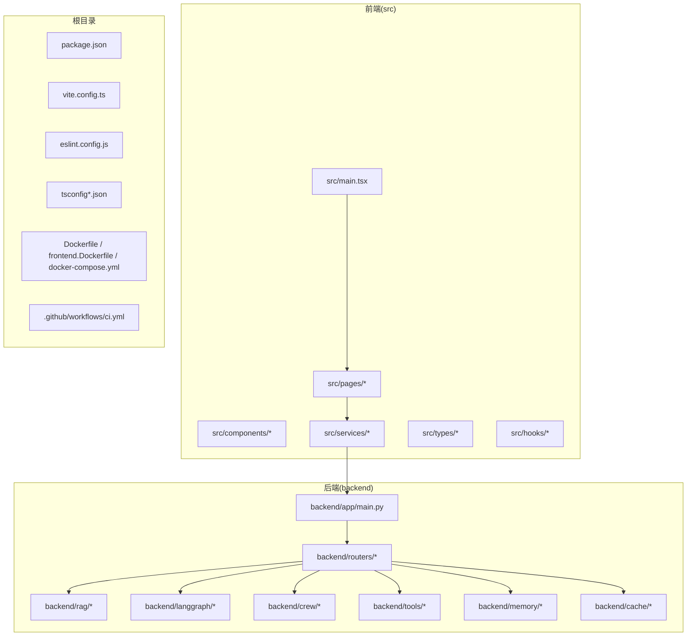
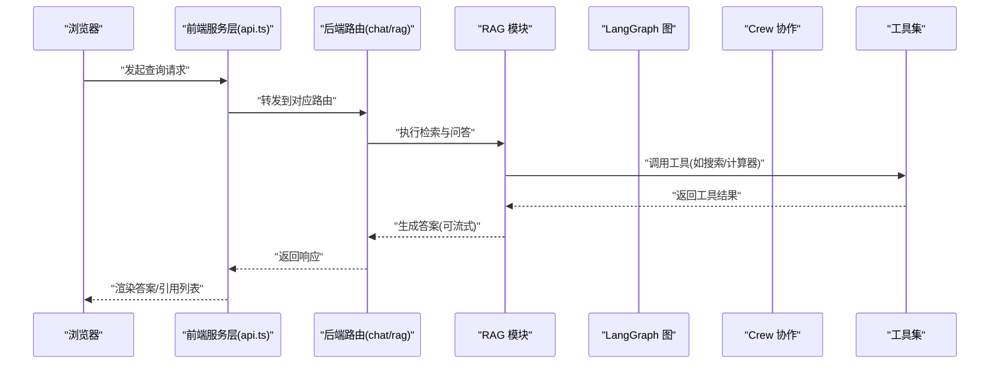
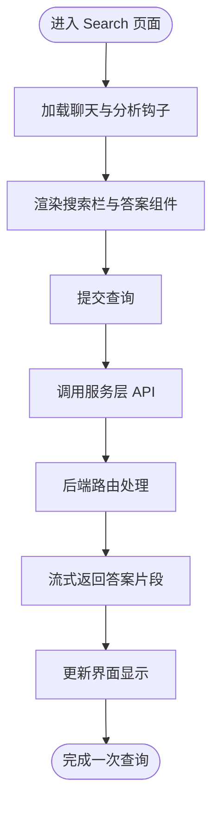
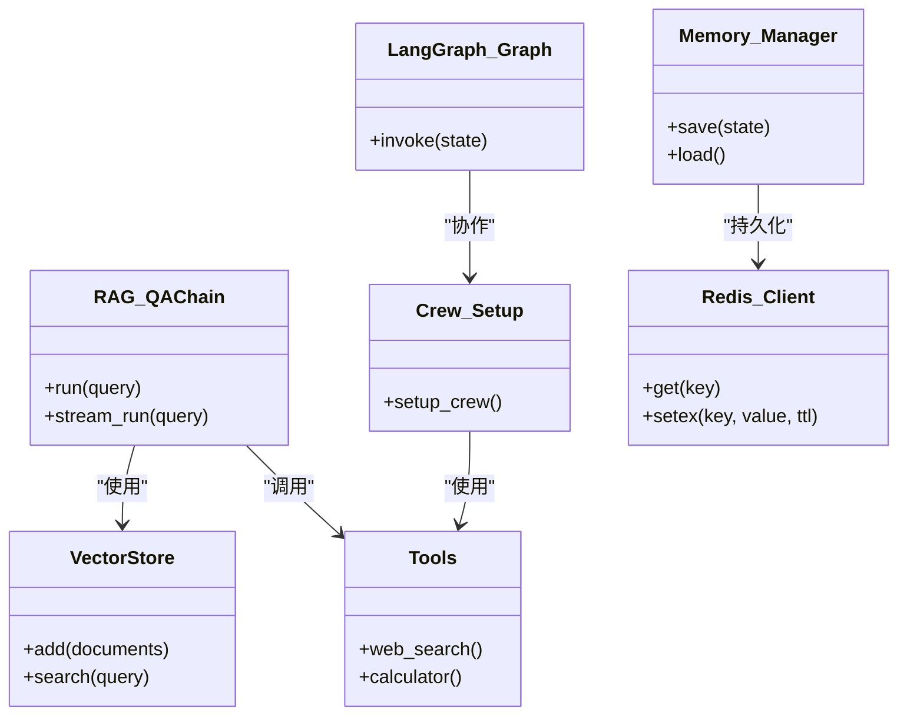
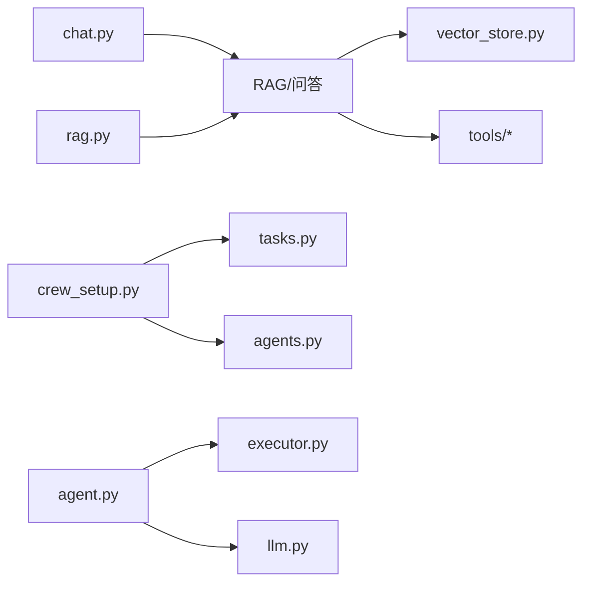
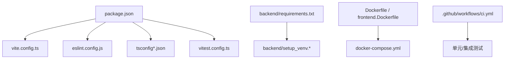

# 开发指南

<cite>
**本文引用的文件**
- [package.json](file://package.json)
- [vite.config.ts](file://vite.config.ts)
- [vitest.config.ts](file://vitest.config.ts)
- [eslint.config.js](file://eslint.config.js)
- [tsconfig.json](file://tsconfig.json)
- [tsconfig.app.json](file://tsconfig.app.json)
- [tsconfig.node.json](file://tsconfig.node.json)
- [src/main.tsx](file://src/main.tsx)
- [backend/app/main.py](file://backend/app/main.py)
- [backend/requirements.txt](file://backend/requirements.txt)
- [backend/setup_venv.sh](file://backend/setup_venv.sh)
- [backend/setup_venv.bat](file://backend/setup_venv.bat)
- [Dockerfile](file://Dockerfile)
- [frontend.Dockerfile](file://frontend.Dockerfile)
- [docker-compose.yml](file://docker-compose.yml)
- [.github/workflows/ci.yml](file://.github/workflows/ci.yml)
- [src/services/api.ts](file://src/services/api.ts)
- [src/hooks/useChat.ts](file://src/hooks/useChat.ts)
- [src/components/search/SearchBar.tsx](file://src/components/search/SearchBar.tsx)
- [src/components/search/StreamingAnswer.tsx](file://src/components/search/StreamingAnswer.tsx)
- [src/pages/Search.tsx](file://src/pages/Search.tsx)
- [src/types/message.ts](file://src/types/message.ts)
- [src/types/dashboard.ts](file://src/types/dashboard.ts)
- [src/test/setup.ts](file://src/test/setup.ts)
- [src/test-setup.ts](file://src/test-setup.ts)
- [backend/tests/test_api.py](file://backend/tests/test_api.py)
- [backend/tests/test_main.py](file://backend/tests/test_main.py)
- [backend/routers/chat.py](file://backend/routers/chat.py)
- [backend/routers/rag.py](file://backend/routers/rag.py)
- [backend/rag/models.py](file://backend/rag/models.py)
- [backend/rag/vector_store.py](file://backend/rag/vector_store.py)
- [backend/rag/qa_chain.py](file://backend/rag/qa_chain.py)
- [backend/langgraph/graph.py](file://backend/langgraph/graph.py)
- [backend/langgraph/state.py](file://backend/langgraph/state.py)
- [backend/crew/crew_setup.py](file://backend/crew/crew_setup.py)
- [backend/crew/tasks.py](file://backend/crew/tasks.py)
- [backend/crew/agents.py](file://backend/crew/agents.py)
- [backend/tools/calculator.py](file://backend/tools/calculator.py)
- [backend/tools/web_search.py](file://backend/tools/web_search.py)
- [backend/cache/redis_client.py](file://backend/cache/redis_client.py)
- [backend/memory/manager.py](file://backend/memory/manager.py)
- [backend/memory/l0_conversation.py](file://backend/memory/l0_conversation.py)
- [backend/memory/l1_atom.py](file://backend/memory/l1_atom.py)
- [backend/memory/l2_scenario.py](file://backend/memory/l2_scenario.py)
- [backend/memory/l3_persona.py](file://backend/memory/l3_persona.py)
- [backend/observability/router.py](file://backend/observability/router.py)
- [backend/reliability/router.py](file://backend/reliability/router.py)
- [backend/security/router.py](file://backend/security/router.py)
- [backend/integration/router.py](file://backend/integration/router.py)
- [backend/features/router.py](file://backend/features/router.py)
- [backend/knowledge/router.py](file://backend/knowledge/router.py)
- [backend/evaluation/router.py](file://backend/evaluation/router.py)
- [backend/ai_platform/router.py](file://backend/ai_platform/router.py)
- [backend/cost/router.py](file://backend/cost/router.py)
- [backend/agent/agent.py](file://backend/agent/agent.py)
- [backend/agent/executor.py](file://backend/agent/executor.py)
- [backend/agent/llm.py](file://backend/agent/llm.py)
- [backend/utils/lang_detect.py](file://backend/utils/lang_detect.py)
- [README.md](file://README.md)
- [USER_GUIDE.md](file://USER_GUIDE.md)
- [TECH_DESIGN.md](file://TECH_DESIGN.md)
- [AGENTS.md](file://AGENTS.md)
- [CLAUDE.md](file://CLAUDE.md)
- [docs/architecture/system-overview.md](file://docs/architecture/system-overview.md)
- [docs/deployment/docker-setup.md](file://docs/deployment/docker-setup.md)
- [docs/product/features.md](file://docs/product/features.md)
- [docs/rag-design.md](file://docs/rag-design.md)
- [docs/rag-enterprise-analysis.md](file://docs/rag-enterprise-analysis.md)
</cite>

## 目录
1. [简介](#简介)
2. [项目结构](#项目结构)
3. [核心组件](#核心组件)
4. [架构总览](#架构总览)
5. [详细组件分析](#详细组件分析)
6. [依赖分析](#依赖分析)
7. [性能考虑](#性能考虑)
8. [故障排查指南](#故障排查指南)
9. [结论](#结论)
10. [附录](#附录)

## 简介
本开发指南面向新加入的开发者，帮助你快速理解 Aureon 项目的整体架构、开发与测试流程、构建与部署配置，并掌握日常开发中的最佳实践。项目采用前后端分离架构：前端基于 Vite + React + TypeScript，后端基于 Python（FastAPI/Falcon 风格路由），并提供 Docker 化部署与 GitHub Actions CI 流水线。

## 项目结构
项目采用多模块组织方式：
- 前端：src 目录下包含页面、组件、服务、类型定义、国际化与测试设置
- 后端：backend 目录下包含应用入口、路由、RAG 模块、LangGraph 工作流、记忆体系统、缓存、工具与评估等子模块
- 文档：docs 目录包含架构、部署、产品特性、RAG 设计与企业分析文档
- 船员（Crew）：crew 目录提供独立的 Crew 应用
- 根目录：构建脚本、Docker 配置、CI 工作流、包管理与类型配置

图表来源
- [src/main.tsx:1-50](file://src/main.tsx#L1-L50)
- [backend/app/main.py:1-50](file://backend/app/main.py#L1-L50)
- [vite.config.ts:1-50](file://vite.config.ts#L1-L50)
- [Dockerfile:1-50](file://Dockerfile#L1-L50)
- [.github/workflows/ci.yml:1-50](file://.github/workflows/ci.yml#L1-L50)

章节来源
- [README.md:1-100](file://README.md#L1-L100)
- [package.json:1-100](file://package.json#L1-L100)
- [vite.config.ts:1-100](file://vite.config.ts#L1-L100)

## 核心组件
- 前端应用入口与路由：通过入口文件挂载 React 应用，页面组件负责业务视图，服务层封装 API 调用，类型定义确保数据结构一致性
- 后端应用入口与路由：应用入口集中注册路由模块，各领域模块（RAG、LangGraph、Crew、工具、记忆体、缓存等）按职责拆分
- 构建与测试：Vite 提供开发服务器与打包，Vitest 执行单元测试，ESLint 与 TypeScript 配置保障代码质量
- 部署与流水线：Dockerfile 与 docker-compose.yml 支持容器化部署；GitHub Actions 定义 CI 流程

章节来源
- [src/main.tsx:1-50](file://src/main.tsx#L1-L50)
- [backend/app/main.py:1-50](file://backend/app/main.py#L1-L50)
- [vite.config.ts:1-100](file://vite.config.ts#L1-L100)
- [vitest.config.ts:1-100](file://vitest.config.ts#L1-L100)
- [eslint.config.js:1-100](file://eslint.config.js#L1-L100)
- [tsconfig.json:1-100](file://tsconfig.json#L1-L100)
- [Dockerfile:1-100](file://Dockerfile#L1-L100)
- [.github/workflows/ci.yml:1-100](file://.github/workflows/ci.yml#L1-L100)

## 架构总览
Aureon 采用前后端分离架构，前端负责用户交互与状态管理，后端提供 RAG、LangGraph 工作流、Crew 协作与工具链能力。数据流从浏览器到前端服务层，再由后端路由转发至具体模块（如 RAG、LangGraph、Crew 等），最终返回流式或非流式的响应。

图表来源
- [src/services/api.ts:1-100](file://src/services/api.ts#L1-L100)
- [backend/routers/chat.py:1-100](file://backend/routers/chat.py#L1-L100)
- [backend/routers/rag.py:1-100](file://backend/routers/rag.py#L1-L100)
- [backend/rag/qa_chain.py:1-100](file://backend/rag/qa_chain.py#L1-L100)
- [backend/langgraph/graph.py:1-100](file://backend/langgraph/graph.py#L1-L100)
- [backend/crew/crew_setup.py:1-100](file://backend/crew/crew_setup.py#L1-L100)
- [backend/tools/web_search.py:1-100](file://backend/tools/web_search.py#L1-L100)
- [backend/tools/calculator.py:1-100](file://backend/tools/calculator.py#L1-L100)

## 详细组件分析

### 前端：页面与服务层
- 页面组件：Search 页面承载搜索与流式回答展示，Dashboard 展示指标与查询统计，Admin 页面用于评估与功能开关
- 服务层：统一在服务模块中封装 API 请求，便于 Mock 与测试
- 类型系统：消息与仪表盘类型定义确保前后端数据契约一致
- 钩子与组件：聊天钩子、分析钩子、UI 组件与文档上传组件等

图表来源
- [src/pages/Search.tsx:1-100](file://src/pages/Search.tsx#L1-L100)
- [src/services/api.ts:1-100](file://src/services/api.ts#L1-L100)
- [src/hooks/useChat.ts:1-100](file://src/hooks/useChat.ts#L1-L100)
- [src/components/search/SearchBar.tsx:1-100](file://src/components/search/SearchBar.tsx#L1-L100)
- [src/components/search/StreamingAnswer.tsx:1-100](file://src/components/search/StreamingAnswer.tsx#L1-L100)

章节来源
- [src/pages/Search.tsx:1-100](file://src/pages/Search.tsx#L1-L100)
- [src/services/api.ts:1-100](file://src/services/api.ts#L1-L100)
- [src/hooks/useChat.ts:1-100](file://src/hooks/useChat.ts#L1-L100)
- [src/types/message.ts:1-100](file://src/types/message.ts#L1-L100)
- [src/types/dashboard.ts:1-100](file://src/types/dashboard.ts#L1-L100)

### 后端：RAG 与 LangGraph 工作流
- RAG 模块：向量存储、检索器、问答链、查询重写、评估与质量控制
- LangGraph 图：状态机驱动的工作流节点（意图识别、检索、生成、代理）
- Crew：多智能体协作的任务编排
- 工具：网络搜索、计算器等外部能力
- 缓存与记忆体：Redis 缓存与层级化记忆（对话、原子、场景、人物）

图表来源
- [backend/rag/qa_chain.py:1-100](file://backend/rag/qa_chain.py#L1-L100)
- [backend/rag/vector_store.py:1-100](file://backend/rag/vector_store.py#L1-L100)
- [backend/langgraph/graph.py:1-100](file://backend/langgraph/graph.py#L1-L100)
- [backend/crew/crew_setup.py:1-100](file://backend/crew/crew_setup.py#L1-L100)
- [backend/tools/web_search.py:1-100](file://backend/tools/web_search.py#L1-L100)
- [backend/tools/calculator.py:1-100](file://backend/tools/calculator.py#L1-L100)
- [backend/memory/manager.py:1-100](file://backend/memory/manager.py#L1-L100)
- [backend/cache/redis_client.py:1-100](file://backend/cache/redis_client.py#L1-L100)

章节来源
- [backend/rag/models.py:1-100](file://backend/rag/models.py#L1-L100)
- [backend/rag/vector_store.py:1-100](file://backend/rag/vector_store.py#L1-L100)
- [backend/rag/qa_chain.py:1-100](file://backend/rag/qa_chain.py#L1-L100)
- [backend/langgraph/graph.py:1-100](file://backend/langgraph/graph.py#L1-L100)
- [backend/langgraph/state.py:1-100](file://backend/langgraph/state.py#L1-L100)
- [backend/crew/crew_setup.py:1-100](file://backend/crew/crew_setup.py#L1-L100)
- [backend/crew/tasks.py:1-100](file://backend/crew/tasks.py#L1-L100)
- [backend/crew/agents.py:1-100](file://backend/crew/agents.py#L1-L100)
- [backend/tools/calculator.py:1-100](file://backend/tools/calculator.py#L1-L100)
- [backend/tools/web_search.py:1-100](file://backend/tools/web_search.py#L1-L100)
- [backend/cache/redis_client.py:1-100](file://backend/cache/redis_client.py#L1-L100)
- [backend/memory/manager.py:1-100](file://backend/memory/manager.py#L1-L100)
- [backend/memory/l0_conversation.py:1-100](file://backend/memory/l0_conversation.py#L1-L100)
- [backend/memory/l1_atom.py:1-100](file://backend/memory/l1_atom.py#L1-L100)
- [backend/memory/l2_scenario.py:1-100](file://backend/memory/l2_scenario.py#L1-L100)
- [backend/memory/l3_persona.py:1-100](file://backend/memory/l3_persona.py#L1-L100)

### 后端：路由与模块化
- 路由模块：chat、rag 等路由将请求分发到具体实现
- 功能模块：observability、reliability、security、integration、features、knowledge、evaluation、ai_platform、cost 等
- 代理与执行：agent、executor、llm 提供智能体能力

图表来源
- [backend/routers/chat.py:1-100](file://backend/routers/chat.py#L1-L100)
- [backend/routers/rag.py:1-100](file://backend/routers/rag.py#L1-L100)
- [backend/rag/vector_store.py:1-100](file://backend/rag/vector_store.py#L1-L100)
- [backend/crew/crew_setup.py:1-100](file://backend/crew/crew_setup.py#L1-L100)
- [backend/crew/tasks.py:1-100](file://backend/crew/tasks.py#L1-L100)
- [backend/crew/agents.py:1-100](file://backend/crew/agents.py#L1-L100)
- [backend/agent/agent.py:1-100](file://backend/agent/agent.py#L1-L100)
- [backend/agent/executor.py:1-100](file://backend/agent/executor.py#L1-L100)
- [backend/agent/llm.py:1-100](file://backend/agent/llm.py#L1-L100)

章节来源
- [backend/routers/chat.py:1-100](file://backend/routers/chat.py#L1-L100)
- [backend/routers/rag.py:1-100](file://backend/routers/rag.py#L1-L100)
- [backend/observability/router.py:1-100](file://backend/observability/router.py#L1-L100)
- [backend/reliability/router.py:1-100](file://backend/reliability/router.py#L1-L100)
- [backend/security/router.py:1-100](file://backend/security/router.py#L1-L100)
- [backend/integration/router.py:1-100](file://backend/integration/router.py#L1-L100)
- [backend/features/router.py:1-100](file://backend/features/router.py#L1-L100)
- [backend/knowledge/router.py:1-100](file://backend/knowledge/router.py#L1-L100)
- [backend/evaluation/router.py:1-100](file://backend/evaluation/router.py#L1-L100)
- [backend/ai_platform/router.py:1-100](file://backend/ai_platform/router.py#L1-L100)
- [backend/cost/router.py:1-100](file://backend/cost/router.py#L1-L100)
- [backend/agent/agent.py:1-100](file://backend/agent/agent.py#L1-L100)
- [backend/agent/executor.py:1-100](file://backend/agent/executor.py#L1-L100)
- [backend/agent/llm.py:1-100](file://backend/agent/llm.py#L1-L100)

## 依赖分析
- 前端依赖：通过 package.json 管理，Vite 提供开发与打包，TypeScript 进行静态类型检查，ESLint 规范代码风格
- 后端依赖：requirements.txt 管理 Python 依赖，提供虚拟环境脚本以支持跨平台开发
- 容器化：Dockerfile 与 frontend.Dockerfile 分别构建后端与前端镜像，docker-compose.yml 统一编排
- CI：GitHub Actions 在 PR 与主分支上运行测试与质量检查

图表来源
- [package.json:1-100](file://package.json#L1-L100)
- [vite.config.ts:1-100](file://vite.config.ts#L1-L100)
- [eslint.config.js:1-100](file://eslint.config.js#L1-L100)
- [tsconfig.json:1-100](file://tsconfig.json#L1-L100)
- [backend/requirements.txt:1-100](file://backend/requirements.txt#L1-L100)
- [backend/setup_venv.sh:1-100](file://backend/setup_venv.sh#L1-L100)
- [backend/setup_venv.bat:1-100](file://backend/setup_venv.bat#L1-L100)
- [Dockerfile:1-100](file://Dockerfile#L1-L100)
- [frontend.Dockerfile:1-100](file://frontend.Dockerfile#L1-L100)
- [docker-compose.yml:1-100](file://docker-compose.yml#L1-L100)
- [.github/workflows/ci.yml:1-100](file://.github/workflows/ci.yml#L1-L100)

章节来源
- [package.json:1-100](file://package.json#L1-L100)
- [backend/requirements.txt:1-100](file://backend/requirements.txt#L1-L100)
- [Dockerfile:1-100](file://Dockerfile#L1-L100)
- [docker-compose.yml:1-100](file://docker-compose.yml#L1-L100)
- [.github/workflows/ci.yml:1-100](file://.github/workflows/ci.yml#L1-L100)

## 性能考虑
- 前端性能：利用 Vite 的按需加载与 Tree Shaking；对大型组件进行懒加载；合理拆分包体积；在生产模式启用压缩与资源内联
- 后端性能：使用 Redis 缓存热点数据；LangGraph 工作流中避免不必要的重复计算；RAG 检索阶段使用向量化与分片策略；工具调用尽量异步化
- 数据与内存：层级化记忆体按粒度分层存储，降低热路径上的 IO 压力；离线与归档策略减少长期占用
- 监控与可观测性：通过 observability 模块记录关键指标，reliability 模块保障稳定性，结合日志与追踪定位瓶颈

## 故障排查指南
- 前端问题：检查服务层 API 调用是否正确；确认类型定义与后端接口一致；查看控制台错误与网络请求状态码
- 后端问题：核对路由是否正确注册；检查 RAG 检索与问答链的异常处理；验证工具调用返回值；查看缓存与记忆体读写日志
- 构建与部署：确认 Docker 镜像构建步骤；检查 docker-compose 服务依赖与端口映射；验证 CI 日志中的测试失败点
- 测试失败：优先运行最小复现用例；逐步缩小范围定位模块；参考测试覆盖率报告补充缺失用例

章节来源
- [src/services/api.ts:1-100](file://src/services/api.ts#L1-L100)
- [backend/app/main.py:1-100](file://backend/app/main.py#L1-L100)
- [backend/rag/qa_chain.py:1-100](file://backend/rag/qa_chain.py#L1-L100)
- [backend/cache/redis_client.py:1-100](file://backend/cache/redis_client.py#L1-L100)
- [backend/memory/manager.py:1-100](file://backend/memory/manager.py#L1-L100)
- [docker-compose.yml:1-100](file://docker-compose.yml#L1-L100)
- [.github/workflows/ci.yml:1-100](file://.github/workflows/ci.yml#L1-L100)

## 结论
Aureon 项目通过清晰的模块划分与完善的工具链，提供了可扩展的 RAG 与智能体协作平台。建议新开发者从前端页面与服务层入手，逐步深入后端模块与工作流，同时严格遵循代码规范与测试策略，持续关注性能与可观测性。

## 附录

### 开发环境搭建
- 前端
  - 安装 Node.js 与 npm
  - 安装依赖：npm install
  - 启动开发服务器：npm run dev
- 后端
  - 安装 Python 3.x
  - 创建虚拟环境并激活：参考 backend/setup_venv.*
  - 安装依赖：pip install -r backend/requirements.txt
  - 启动后端服务：python backend/app/main.py
- 数据库与缓存
  - 使用本地 Redis 或 Docker Compose 启动所需服务
- 容器化
  - 使用 docker-compose.yml 启动完整栈
  - 或分别构建后端/前端镜像并运行

章节来源
- [package.json:1-100](file://package.json#L1-L100)
- [backend/requirements.txt:1-100](file://backend/requirements.txt#L1-L100)
- [backend/setup_venv.sh:1-100](file://backend/setup_venv.sh#L1-L100)
- [backend/setup_venv.bat:1-100](file://backend/setup_venv.bat#L1-L100)
- [docker-compose.yml:1-100](file://docker-compose.yml#L1-L100)

### 代码规范与类型定义
- ESLint 配置：统一规则与格式化策略
- TypeScript 配置：严格模式、路径映射、测试环境配置
- 类型定义：消息、仪表盘等核心类型在 src/types 下集中维护

章节来源
- [eslint.config.js:1-100](file://eslint.config.js#L1-L100)
- [tsconfig.json:1-100](file://tsconfig.json#L1-L100)
- [tsconfig.app.json:1-100](file://tsconfig.app.json#L1-L100)
- [tsconfig.node.json:1-100](file://tsconfig.node.json#L1-L100)
- [src/types/message.ts:1-100](file://src/types/message.ts#L1-L100)
- [src/types/dashboard.ts:1-100](file://src/types/dashboard.ts#L1-L100)

### 测试策略与编写指南
- 前端测试：Vitest 配置与测试入口，页面、组件与钩子的单元测试
- 后端测试：Python 测试套件覆盖路由、RAG、LangGraph、Crew、工具与缓存
- 测试建议：先写失败用例，再实现最小逻辑；关注边界条件与异常路径；保持测试隔离与可重复性

章节来源
- [vitest.config.ts:1-100](file://vitest.config.ts#L1-L100)
- [src/test/setup.ts:1-100](file://src/test/setup.ts#L1-L100)
- [src/test-setup.ts:1-100](file://src/test-setup.ts#L1-L100)
- [backend/tests/test_api.py:1-100](file://backend/tests/test_api.py#L1-L100)
- [backend/tests/test_main.py:1-100](file://backend/tests/test_main.py#L1-L100)

### Git 工作流程与代码审查
- 分支策略：主分支保护，功能开发在特性分支，修复在 hotfix 分支
- 提交信息：遵循约定式提交；描述清晰、包含影响范围
- 代码审查：PR 必须通过 CI 与至少一名 reviewer 同意；关注安全性、性能与可维护性
- 合并与发布：通过 CI 后合并到主分支，触发自动化发布流程

章节来源
- [.github/workflows/ci.yml:1-100](file://.github/workflows/ci.yml#L1-L100)

### 构建工具配置与打包优化
- Vite：开发服务器、代理、插件与构建参数
- TypeScript：严格类型检查与路径别名
- 生产构建：启用压缩、资源内联与分包策略
- Docker：多阶段构建减少镜像体积

章节来源
- [vite.config.ts:1-100](file://vite.config.ts#L1-L100)
- [tsconfig.json:1-100](file://tsconfig.json#L1-L100)
- [Dockerfile:1-100](file://Dockerfile#L1-L100)
- [frontend.Dockerfile:1-100](file://frontend.Dockerfile#L1-L100)

### 调试技巧与 IDE 推荐
- 前端调试：React DevTools、TypeScript 调试器、网络面板与性能面板
- 后端调试：Python 调试器、日志级别调整、Redis/数据库连接检查
- IDE 推荐：VSCode（配合 ESLint、Prettier、TypeScript 插件）
- 开发工具：Postman 或 curl 验证 API；Docker Compose 快速复现环境

章节来源
- [eslint.config.js:1-100](file://eslint.config.js#L1-L100)
- [tsconfig.json:1-100](file://tsconfig.json#L1-L100)

### 新功能添加、Bug 修复与性能优化流程
- 新功能
  - 设计文档与原型：参考 docs/architecture/system-overview.md 与产品文档
  - 前后端模块划分：遵循现有路由与模块结构
  - 编写测试：先写测试，再实现功能
  - 提交与评审：遵循 Git 工作流与代码审查标准
- Bug 修复
  - 复现与定位：最小复现用例、日志与断点
  - 修复与回归测试：补充测试用例，确保不引入新问题
- 性能优化
  - 前端：懒加载、缓存策略、减少重绘与回流
  - 后端：缓存命中率、检索优化、异步化与并发控制

章节来源
- [docs/architecture/system-overview.md:1-100](file://docs/architecture/system-overview.md#L1-L100)
- [docs/product/features.md:1-100](file://docs/product/features.md#L1-L100)
- [docs/deployment/docker-setup.md:1-100](file://docs/deployment/docker-setup.md#L1-L100)