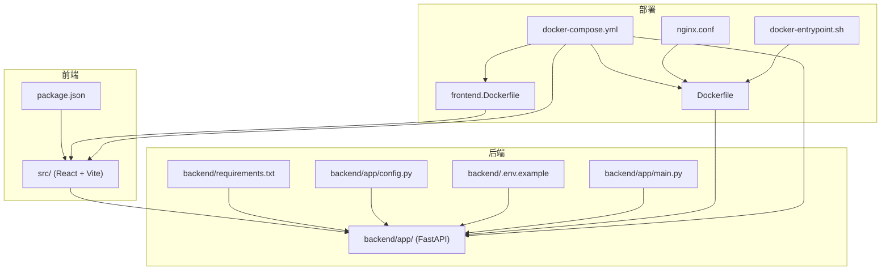
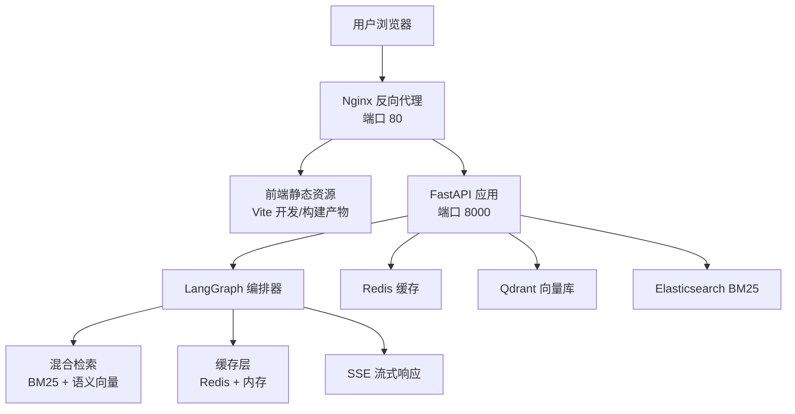
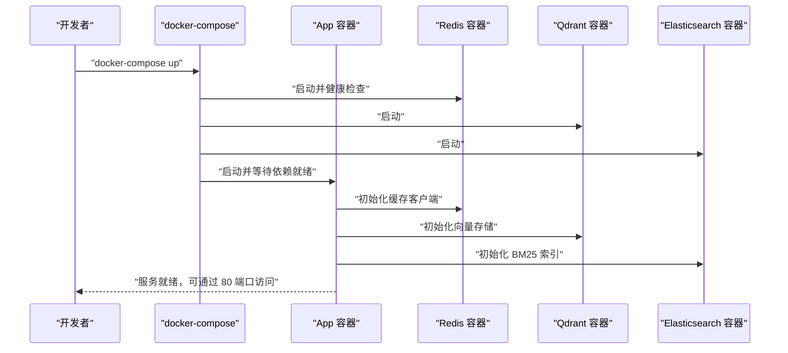
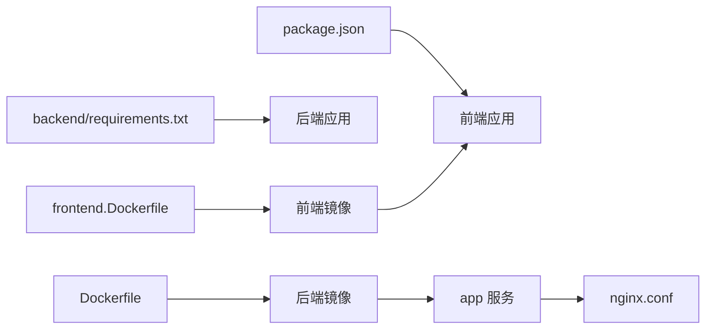

# 快速开始

<cite>
**本文引用的文件**
- [README.md](file://README.md)
- [README.zh-CN.md](file://README.zh-CN.md)
- [USER_GUIDE.md](file://USER_GUIDE.md)
- [package.json](file://package.json)
- [backend/requirements.txt](file://backend/requirements.txt)
- [docker-compose.yml](file://docker-compose.yml)
- [Dockerfile](file://Dockerfile)
- [frontend.Dockerfile](file://frontend.Dockerfile)
- [backend/app/config.py](file://backend/app/config.py)
- [backend/.env.example](file://backend/.env.example)
- [backend/app/main.py](file://backend/app/main.py)
- [nginx.conf](file://nginx.conf)
- [docker-entrypoint.sh](file://docker-entrypoint.sh)
- [backend/setup_venv.sh](file://backend/setup_venv.sh)
- [backend/setup_venv.bat](file://backend/setup_venv.bat)
</cite>

## 目录
1. [简介](#简介)
2. [项目结构](#项目结构)
3. [核心组件](#核心组件)
4. [架构总览](#架构总览)
5. [详细组件分析](#详细组件分析)
6. [依赖关系分析](#依赖关系分析)
7. [性能注意事项](#性能注意事项)
8. [故障排除指南](#故障排除指南)
9. [结论](#结论)
10. [附录](#附录)

## 简介
Aureon 是一个面向生产的“企业级 AI 知识库平台”，提供流式问答、混合检索（BM25 + 语义）、文档管理、系统仪表盘、可观测性、安全与成本治理等能力。本快速开始指南将帮助你以最短时间完成安装与首次运行，覆盖三种部署方式：本地开发环境、后端独立运行、以及推荐的 Docker 容器化部署。

- 英文版快速开始命令与架构概览请参阅 [README.md:51-63](file://README.md#L51-L63)
- 中文版快速开始命令与架构概览请参阅 [README.zh-CN.md:42-54](file://README.zh-CN.md#L42-L54)

**章节来源**
- [README.md:51-63](file://README.md#L51-L63)
- [README.zh-CN.md:42-54](file://README.zh-CN.md#L42-L54)

## 项目结构
仓库采用前后端分离与多模块组织方式：
- 前端：React + Vite，位于根目录 src/
- 后端：FastAPI 应用，位于 backend/app/，依赖在 backend/requirements.txt
- 部署：Dockerfile、frontend.Dockerfile、docker-compose.yml
- 文档：README、USER_GUIDE、docs/

**图表来源**
- [package.json:1-54](file://package.json#L1-L54)
- [backend/requirements.txt:1-57](file://backend/requirements.txt#L1-L57)
- [backend/app/config.py:1-90](file://backend/app/config.py#L1-L90)
- [backend/.env.example:1-19](file://backend/.env.example#L1-L19)
- [backend/app/main.py:1-371](file://backend/app/main.py#L1-L371)
- [Dockerfile:1-54](file://Dockerfile#L1-L54)
- [frontend.Dockerfile:1-28](file://frontend.Dockerfile#L1-L28)
- [docker-compose.yml:1-64](file://docker-compose.yml#L1-L64)
- [nginx.conf:1-36](file://nginx.conf#L1-L36)
- [docker-entrypoint.sh:1-15](file://docker-entrypoint.sh#L1-L15)

**章节来源**
- [package.json:1-54](file://package.json#L1-L54)
- [backend/requirements.txt:1-57](file://backend/requirements.txt#L1-L57)
- [docker-compose.yml:1-64](file://docker-compose.yml#L1-L64)

## 核心组件
- 前端应用：React + Vite，提供聊天界面、搜索、仪表盘等功能；开发服务器默认端口 5173。
- 后端服务：FastAPI 提供 REST 接口与 SSE 流式响应，集成 LangGraph、RAG、缓存、安全与可观测性等模块。
- 部署容器：单机多服务编排，包含 Redis、Qdrant、Elasticsearch，并通过 nginx 反向代理与静态资源服务。

**章节来源**
- [package.json:6-13](file://package.json#L6-L13)
- [backend/app/main.py:68-82](file://backend/app/main.py#L68-L82)
- [docker-compose.yml:13-37](file://docker-compose.yml#L13-L37)

## 架构总览
从用户到系统的端到端流程如下：

**图表来源**
- [nginx.conf:17-30](file://nginx.conf#L17-L30)
- [backend/app/main.py:350-362](file://backend/app/main.py#L350-L362)
- [docker-compose.yml:2-26](file://docker-compose.yml#L2-L26)
- [backend/app/config.py:43-57](file://backend/app/config.py#L43-L57)

## 详细组件分析

### 本地开发环境（前端 + 后端）
- 前端
  - 安装依赖与启动：参考 [README.md:54-55](file://README.md#L54-L55) 或 [USER_GUIDE.md:36-42](file://USER_GUIDE.md#L36-L42)
  - 默认访问地址：http://localhost:5173
- 后端
  - 安装依赖与启动：参考 [README.md:57-59](file://README.md#L57-L59) 或 [USER_GUIDE.md:21-27](file://USER_GUIDE.md#L21-L27)
  - 默认监听端口：8000
  - 首次启动日志中应出现 Uvicorn 运行信息与应用启动完成提示

**章节来源**
- [README.md:54-59](file://README.md#L54-L59)
- [USER_GUIDE.md:17-61](file://USER_GUIDE.md#L17-L61)

### Docker 容器化部署（推荐）
- 构建与启动
  - 使用 docker-compose：参考 [README.md:61-62](file://README.md#L61-L62) 或 [README.zh-CN.md:52-53](file://README.zh-CN.md#L52-L53)
  - compose 文件定义了 redis、qdrant、elasticsearch、app 四个服务
- 环境变量与存储
  - app 服务挂载 offloads 与 data 目录，用于持久化
  - 通过 env_file 与 environment 字段注入 REDIS_URL、VECTOR_BACKEND、BM25_BACKEND、QDRANT_URL、ES_URL 等
- 端口映射
  - app 映射 80:80，便于直接访问
  - redis:6379、qdrant:6333、elasticsearch:9200 分别映射宿主端口

**图表来源**
- [docker-compose.yml:1-64](file://docker-compose.yml#L1-L64)
- [backend/app/main.py:171-204](file://backend/app/main.py#L171-L204)

**章节来源**
- [docker-compose.yml:1-64](file://docker-compose.yml#L1-L64)
- [backend/app/main.py:171-204](file://backend/app/main.py#L171-L204)

### 配置说明（环境变量、数据库与缓存）
- 环境变量
  - 后端示例配置：[backend/.env.example:1-19](file://backend/.env.example#L1-L19)
  - 运行时加载与模型注册：[backend/app/config.py:4-65](file://backend/app/config.py#L4-L65)
- 数据库与缓存
  - Redis：用于语义缓存与会话状态，compose 中默认端口 6379
  - Qdrant：向量存储，compose 中默认端口 6333
  - Elasticsearch：BM25 后端，compose 中默认端口 9200
- 前端 API 地址
  - Docker 构建时通过 VITE_API_URL/VITE_CREW_API_URL 注入，nginx 反代 /api/ 到后端 8000 端口
  - 参考 [Dockerfile:9-12](file://Dockerfile#L9-L12) 与 [nginx.conf:17-30](file://nginx.conf#L17-L30)

**章节来源**
- [backend/.env.example:1-19](file://backend/.env.example#L1-L19)
- [backend/app/config.py:41-62](file://backend/app/config.py#L41-L62)
- [docker-compose.yml:21-26](file://docker-compose.yml#L21-L26)
- [Dockerfile:9-12](file://Dockerfile#L9-L12)
- [nginx.conf:17-30](file://nginx.conf#L17-L30)

### 首次运行验证
- 健康检查
  - 后端健康接口：GET /api/health，返回状态与索引准备情况
  - Crew 服务健康接口：GET /api/crew/health
- 前端访问
  - 默认地址：http://localhost:5173（本地开发）或 http://localhost（Docker）
- 日志与指标
  - 后端启动日志包含 Uvicorn 与应用启动信息
  - Prometheus 指标端点：/metrics

**章节来源**
- [backend/app/main.py:340-347](file://backend/app/main.py#L340-L347)
- [backend/app/main.py:331-337](file://backend/app/main.py#L331-L337)
- [backend/app/main.py:80-82](file://backend/app/main.py#L80-L82)

### 常见问题与解决方案
- 前端页面空白
  - 确认前端开发服务器仍在运行，刷新页面
- 发送消息无回复
  - 检查后端是否运行、LLM_API_KEY 是否有效
- 依赖缺失导致的 ModuleNotFoundError
  - 在 backend 目录执行 pip 安装依赖
- 端口占用
  - 后端默认 8000，前端默认 5173；如被占用可调整端口

**章节来源**
- [USER_GUIDE.md:162-193](file://USER_GUIDE.md#L162-L193)

## 依赖关系分析
- 前端依赖：React、Vite、TypeScript、TailwindCSS、i18n 等，详见 [package.json:14-52](file://package.json#L14-L52)
- 后端依赖：FastAPI、LangChain、LangGraph、Uvicorn、Redis、Chroma/Qdrant、Elasticsearch、Prometheus 等，详见 [backend/requirements.txt:4-57](file://backend/requirements.txt#L4-L57)
- 容器镜像：前端构建镜像基于 node:22，后端镜像基于 python:3.12，nginx 提供反向代理与静态资源服务，详见 [Dockerfile:1-54](file://Dockerfile#L1-L54) 与 [frontend.Dockerfile:1-28](file://frontend.Dockerfile#L1-28)

**图表来源**
- [package.json:14-52](file://package.json#L14-L52)
- [backend/requirements.txt:4-57](file://backend/requirements.txt#L4-L57)
- [Dockerfile:1-54](file://Dockerfile#L1-L54)
- [frontend.Dockerfile:1-28](file://frontend.Dockerfile#L1-L28)
- [nginx.conf:1-36](file://nginx.conf#L1-L36)

**章节来源**
- [package.json:14-52](file://package.json#L14-L52)
- [backend/requirements.txt:4-57](file://backend/requirements.txt#L4-L57)
- [Dockerfile:1-54](file://Dockerfile#L1-L54)
- [frontend.Dockerfile:1-28](file://frontend.Dockerfile#L1-L28)

## 性能注意事项
- 首次启动时后端会进行 BM25 索引预热与向量索引检查/重建，可能在后台线程异步完成
- 前端构建阶段预下载嵌入模型以减少冷启动延迟
- nginx 禁用代理缓冲以支持 SSE 流式传输

**章节来源**
- [backend/app/main.py:127-164](file://backend/app/main.py#L127-L164)
- [Dockerfile:32-34](file://Dockerfile#L32-L34)
- [nginx.conf:28-30](file://nginx.conf#L28-L30)

## 故障排除指南
- 后端启动失败
  - 检查 Python 版本与虚拟环境，参考 [backend/setup_venv.sh:1-54](file://backend/setup_venv.sh#L1-L54) 与 [backend/setup_venv.bat:1-54](file://backend/setup_venv.bat#L1-L54)
- 依赖安装问题
  - 在 backend 目录执行 pip install -r requirements.txt
- 端口冲突
  - 后端：uvicorn --port 新端口
  - 前端：Vite 默认 +1 端口策略
- Docker 端口映射
  - 修改 docker-compose.yml 中的端口映射或入口脚本中的监听端口

**章节来源**
- [backend/setup_venv.sh:1-54](file://backend/setup_venv.sh#L1-L54)
- [backend/setup_venv.bat:1-54](file://backend/setup_venv.bat#L1-L54)
- [USER_GUIDE.md:183-193](file://USER_GUIDE.md#L183-L193)
- [docker-entrypoint.sh:4-8](file://docker-entrypoint.sh#L4-L8)

## 结论
通过本指南，你可以选择本地开发或 Docker 两种方式快速启动 Aureon。建议优先使用 Docker 以获得一致的运行环境与服务编排体验。首次运行后，可通过健康检查与前端界面确认系统正常工作。

## 附录

### 安装步骤（双语对照）
- 英文版
  - 前端：参考 [README.md:54-55](file://README.md#L54-L55)
  - 后端：参考 [README.md:57-59](file://README.md#L57-L59)
  - Docker：参考 [README.md:61-62](file://README.md#L61-L62)
- 中文版
  - 前端：参考 [README.zh-CN.md:46-47](file://README.zh-CN.md#L46-L47)
  - 后端：参考 [README.zh-CN.md:49-50](file://README.zh-CN.md#L49-L50)
  - Docker：参考 [README.zh-CN.md:52-53](file://README.zh-CN.md#L52-L53)

**章节来源**
- [README.md:54-62](file://README.md#L54-L62)
- [README.zh-CN.md:46-53](file://README.zh-CN.md#L46-L53)