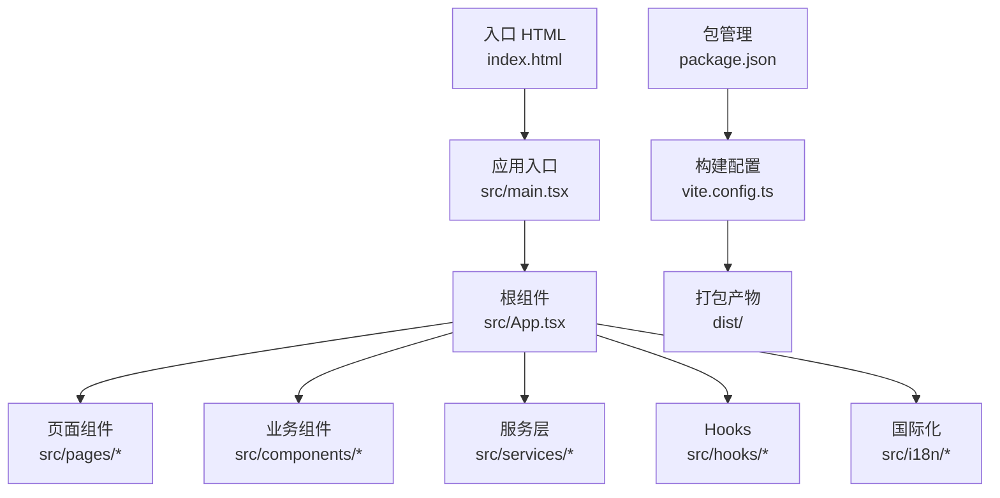
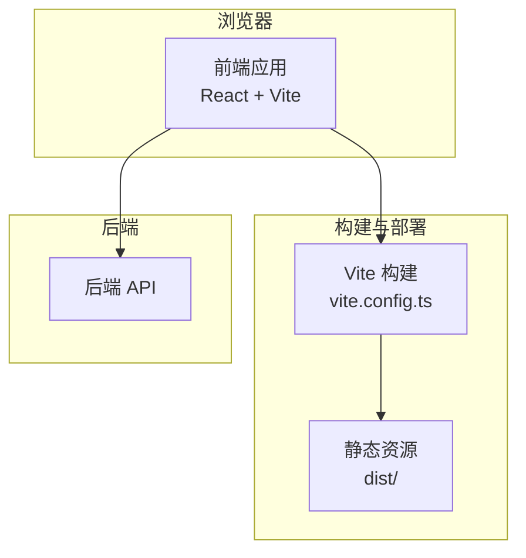
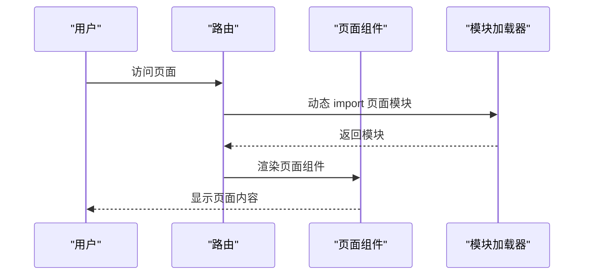
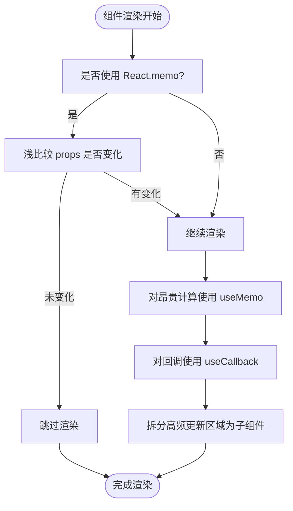
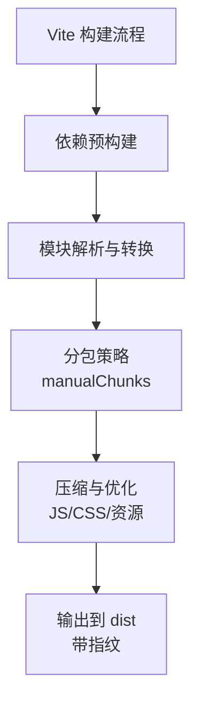
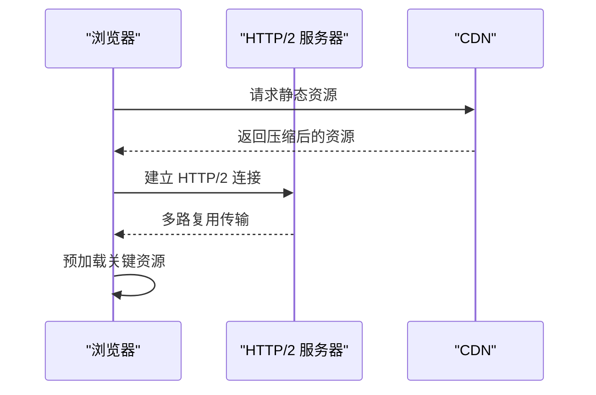
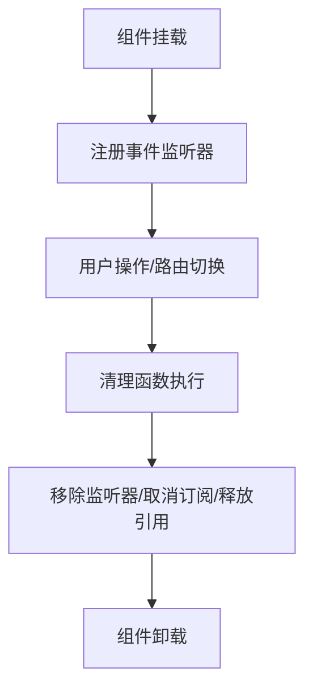
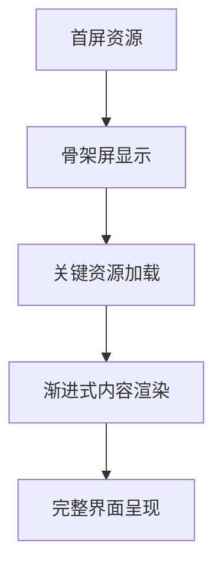
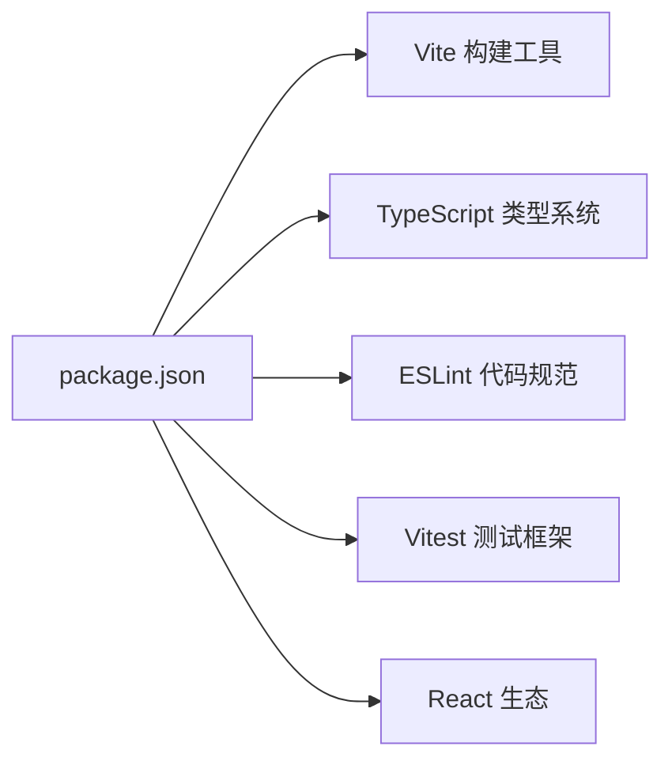

# 前端性能优化

<cite>
**本文引用的文件**
- [vite.config.ts](file://vite.config.ts)
- [package.json](file://package.json)
- [src/main.tsx](file://src/main.tsx)
- [src/App.tsx](file://src/App.tsx)
- [src/pages/Landing.tsx](file://src/pages/Landing.tsx)
- [src/pages/Dashboard.tsx](file://src/pages/Dashboard.tsx)
- [src/pages/Search.tsx](file://src/pages/Search.tsx)
- [src/components/search/StreamingAnswer.tsx](file://src/components/search/StreamingAnswer.tsx)
- [src/hooks/useChat.ts](file://src/hooks/useChat.ts)
- [src/services/api.ts](file://src/services/api.ts)
- [src/services/rag.ts](file://src/services/rag.ts)
- [src/components/ui/Button.tsx](file://src/components/ui/Button.tsx)
- [src/components/ui/Card.tsx](file://src/components/ui/Card.tsx)
- [src/components/dashboard/MetricGrid.tsx](file://src/components/dashboard/MetricGrid.tsx)
- [src/components/dashboard/QueryVolumeChart.tsx](file://src/components/dashboard/QueryVolumeChart.tsx)
- [src/components/documents/DocumentUpload.tsx](file://src/components/documents/DocumentUpload.tsx)
- [src/components/ErrorBoundary.tsx](file://src/components/ErrorBoundary.tsx)
- [src/i18n/config.ts](file://src/i18n/config.ts)
- [src/test/setup.ts](file://src/test/setup.ts)
- [vitest.config.ts](file://vitest.config.ts)
- [eslint.config.js](file://eslint.config.js)
- [tsconfig.app.json](file://tsconfig.app.json)
- [tsconfig.json](file://tsconfig.json)
- [tsconfig.node.json](file://tsconfig.node.json)
- [index.html](file://index.html)
</cite>

## 目录
1. [引言](#引言)
2. [项目结构](#项目结构)
3. [核心组件](#核心组件)
4. [架构总览](#架构总览)
5. [详细组件分析](#详细组件分析)
6. [依赖分析](#依赖分析)
7. [性能考虑](#性能考虑)
8. [故障排除指南](#故障排除指南)
9. [结论](#结论)
10. [附录](#附录)

## 引言
本文件面向 Aureon 系统的前端性能优化，系统性梳理代码分割策略、懒加载实现、资源压缩技术；深入分析 React 应用的组件渲染优化、状态管理优化与生命周期优化；阐述构建工具在 Vite 配置优化、打包策略与缓存机制方面的调优；提供网络性能优化技巧（HTTP/2、资源预加载、CDN 配置）；解释内存管理与垃圾回收优化（组件卸载、事件监听器清理、内存泄漏预防）；并给出用户体验优化策略（首屏加载、骨架屏、渐进式渲染）以及前端性能测试工具（Lighthouse、Web Vitals、性能回归测试）的实践建议。

## 项目结构
Aureon 前端采用 Vite + React + TypeScript 技术栈，源码位于 src 目录，构建配置集中在 vite.config.ts，包管理通过 package.json 管理依赖与脚本。页面组件按功能模块划分，服务层封装 API 调用，UI 组件库化，国际化配置独立，测试框架使用 Vitest。

**图表来源**
- [index.html](file://index.html)
- [src/main.tsx](file://src/main.tsx)
- [src/App.tsx](file://src/App.tsx)
- [vite.config.ts](file://vite.config.ts)
- [package.json](file://package.json)

**章节来源**
- [index.html](file://index.html)
- [src/main.tsx](file://src/main.tsx)
- [src/App.tsx](file://src/App.tsx)
- [vite.config.ts](file://vite.config.ts)
- [package.json](file://package.json)

## 核心组件
- 页面级组件：Landing、Dashboard、Search 等，承担路由与布局职责，适合进行代码分割与懒加载。
- 业务组件：SearchBar、StreamingAnswer、MetricGrid、QueryVolumeChart、DocumentUpload 等，承载具体功能，需关注渲染性能与状态更新频率。
- UI 组件：Button、Card 等基础组件，应保持稳定且可复用，避免不必要的重渲染。
- 服务层：api.ts、rag.ts 封装后端接口，便于统一错误处理与缓存策略。
- Hooks：useChat 等自定义 Hook，集中状态逻辑，减少重复计算与副作用。
- 国际化：i18n 配置，支持多语言切换，注意动态导入以降低初始包体。
- 错误边界：ErrorBoundary 提供组件级容错，防止异常扩散影响整体性能。

**章节来源**
- [src/pages/Landing.tsx](file://src/pages/Landing.tsx)
- [src/pages/Dashboard.tsx](file://src/pages/Dashboard.tsx)
- [src/pages/Search.tsx](file://src/pages/Search.tsx)
- [src/components/search/StreamingAnswer.tsx](file://src/components/search/StreamingAnswer.tsx)
- [src/components/dashboard/MetricGrid.tsx](file://src/components/dashboard/MetricGrid.tsx)
- [src/components/dashboard/QueryVolumeChart.tsx](file://src/components/dashboard/QueryVolumeChart.tsx)
- [src/components/documents/DocumentUpload.tsx](file://src/components/documents/DocumentUpload.tsx)
- [src/components/ui/Button.tsx](file://src/components/ui/Button.tsx)
- [src/components/ui/Card.tsx](file://src/components/ui/Card.tsx)
- [src/services/api.ts](file://src/services/api.ts)
- [src/services/rag.ts](file://src/services/rag.ts)
- [src/hooks/useChat.ts](file://src/hooks/useChat.ts)
- [src/i18n/config.ts](file://src/i18n/config.ts)
- [src/components/ErrorBoundary.tsx](file://src/components/ErrorBoundary.tsx)

## 架构总览
前端采用单页应用（SPA）架构，基于 Vite 进行开发与构建，React 负责视图层，服务层负责数据获取与状态管理，UI 组件库化提升复用性与一致性。页面组件通过路由懒加载实现按需加载，业务组件通过 useMemo/useCallback 优化渲染，服务层通过缓存与去抖策略降低请求频率。

**图表来源**
- [vite.config.ts](file://vite.config.ts)
- [src/main.tsx](file://src/main.tsx)
- [src/services/api.ts](file://src/services/api.ts)

## 详细组件分析

### 代码分割与懒加载策略
- 页面级懒加载：将 Landing、Dashboard、Search 等页面组件通过动态 import 实现路由级代码分割，仅在访问时加载对应模块，显著降低首屏包体。
- 功能级懒加载：对重型组件（如图表、上传组件）采用动态 import，在用户交互或条件满足时再加载，避免阻塞主线程。
- 国际化资源：将语言包按需加载，减少初始下载体积，切换语言时再异步获取对应语言资源。
- 第三方库：对非首屏必需的第三方库（如图表库、编辑器）采用动态 import，结合 WebpackChunkName 注释便于调试与缓存命中。

**图表来源**
- [src/pages/Landing.tsx](file://src/pages/Landing.tsx)
- [src/pages/Dashboard.tsx](file://src/pages/Dashboard.tsx)
- [src/pages/Search.tsx](file://src/pages/Search.tsx)
- [src/i18n/config.ts](file://src/i18n/config.ts)

**章节来源**
- [src/pages/Landing.tsx](file://src/pages/Landing.tsx)
- [src/pages/Dashboard.tsx](file://src/pages/Dashboard.tsx)
- [src/pages/Search.tsx](file://src/pages/Search.tsx)
- [src/i18n/config.ts](file://src/i18n/config.ts)

### React 应用性能优化
- 组件渲染优化：
  - 使用 React.memo 包裹纯展示组件，避免无谓重渲染。
  - 对 props 使用 useMemo 缓存昂贵计算结果，对回调使用 useCallback 绑定稳定引用。
  - 将高频更新区域拆分为独立子组件，配合浅比较减少渲染范围。
- 状态管理优化：
  - 将局部状态与全局状态分离，避免无关组件订阅导致的不必要更新。
  - 使用 useReducer 或分片状态管理复杂对象，降低深层更新成本。
  - 在服务层统一处理缓存与去抖，减少重复请求与状态风暴。
- 生命周期优化：
  - 在 useEffect 中正确清理副作用（定时器、订阅、事件监听），防止内存泄漏。
  - 对长任务采用 requestIdleCallback 或 Web Workers，避免阻塞 UI 线程。
  - 对动画与滚动事件使用节流/防抖，控制事件触发频率。

**图表来源**
- [src/components/ui/Button.tsx](file://src/components/ui/Button.tsx)
- [src/components/ui/Card.tsx](file://src/components/ui/Card.tsx)
- [src/components/dashboard/MetricGrid.tsx](file://src/components/dashboard/MetricGrid.tsx)
- [src/hooks/useChat.ts](file://src/hooks/useChat.ts)

**章节来源**
- [src/components/ui/Button.tsx](file://src/components/ui/Button.tsx)
- [src/components/ui/Card.tsx](file://src/components/ui/Card.tsx)
- [src/components/dashboard/MetricGrid.tsx](file://src/components/dashboard/MetricGrid.tsx)
- [src/hooks/useChat.ts](file://src/hooks/useChat.ts)

### 构建工具性能调优（Vite）
- 预构建与依赖优化：
  - 合理配置 optimizeDeps，预构建常用依赖，缩短冷启动时间。
  - 对大型第三方库启用 external 并通过 CDN 加载，减少打包体积。
- 打包策略：
  - 启用 rollupOptions.output.manualChunks 进行自定义分包，提升缓存命中率。
  - 使用动态 import 的命名注解，确保 chunk 名称稳定以便长期缓存。
- 缓存机制：
  - 利用 Vite 的内置缓存与浏览器 HTTP 缓存，设置合理的 Cache-Control 头。
  - 对静态资源添加指纹（hash），实现不可变缓存。
- 资源压缩：
  - 启用 terser 或 esbuild 压缩 JS，开启压缩级别与并行处理。
  - 使用 cssnano 压缩 CSS，移除未使用样式。
  - 图片与字体资源使用最优格式（WebP、WOFF2）并进行压缩。

**图表来源**
- [vite.config.ts](file://vite.config.ts)
- [package.json](file://package.json)

**章节来源**
- [vite.config.ts](file://vite.config.ts)
- [package.json](file://package.json)

### 网络性能优化
- HTTP/2 优化：
  - 启用 HTTP/2 多路复用，减少连接建立开销；合理设置优先级与服务器推送。
- 资源预加载：
  - 使用 rel="modulepreload" 预加载关键入口模块；使用 rel="prefetch" 预取后续页面资源。
  - 对字体与图标资源使用 rel="preload"，避免 FOIT/FOUT。
- CDN 配置：
  - 将静态资源托管至 CDN，选择就近节点；配置全球加速与边缘缓存。
  - 对不同资源类型设置差异化缓存策略与压缩参数。

**图表来源**
- [index.html](file://index.html)
- [vite.config.ts](file://vite.config.ts)

**章节来源**
- [index.html](file://index.html)
- [vite.config.ts](file://vite.config.ts)

### 内存管理与垃圾回收优化
- 组件卸载：
  - 在 useEffect 的清理函数中移除事件监听器、取消订阅与清理定时器。
  - 卸载前主动释放大对象引用，避免闭包持有导致的内存泄漏。
- 事件监听器清理：
  - 使用弱引用或手动解绑，避免重复绑定造成内存堆积。
- 内存泄漏预防：
  - 定期审查长生命周期对象（全局状态、缓存、定时器）的生命周期。
  - 使用性能监控工具识别异常增长的内存曲线。

**图表来源**
- [src/hooks/useChat.ts](file://src/hooks/useChat.ts)
- [src/components/ErrorBoundary.tsx](file://src/components/ErrorBoundary.tsx)

**章节来源**
- [src/hooks/useChat.ts](file://src/hooks/useChat.ts)
- [src/components/ErrorBoundary.tsx](file://src/components/ErrorBoundary.tsx)

### 用户体验优化
- 首屏加载优化：
  - 采用骨架屏（Skeleton Screen）与占位符，提升感知性能。
  - 将关键渲染路径最小化，优先加载首屏必需资源。
- 渐进式渲染：
  - 对列表与图表采用分块渲染，逐步展示内容，避免长时间卡顿。
- 交互反馈：
  - 按钮与表单添加加载状态，提供即时反馈。
  - 对长任务使用进度条或分步提示，改善用户预期。

**图表来源**
- [src/pages/Landing.tsx](file://src/pages/Landing.tsx)
- [src/components/ui/Card.tsx](file://src/components/ui/Card.tsx)
- [src/components/dashboard/MetricGrid.tsx](file://src/components/dashboard/MetricGrid.tsx)

**章节来源**
- [src/pages/Landing.tsx](file://src/pages/Landing.tsx)
- [src/components/ui/Card.tsx](file://src/components/ui/Card.tsx)
- [src/components/dashboard/MetricGrid.tsx](file://src/components/dashboard/MetricGrid.tsx)

## 依赖分析
- 开发依赖：Vite、TypeScript、ESLint、Vitest 等，提供构建、类型检查与测试能力。
- 运行时依赖：React 生态、国际化库、图表库等，需通过动态 import 与分包策略优化加载。
- 依赖版本与兼容性：通过 package.json 管理，建议定期升级以获得性能与安全收益。

**图表来源**
- [package.json](file://package.json)

**章节来源**
- [package.json](file://package.json)

## 性能考虑
- 代码分割与懒加载：通过动态 import 与路由懒加载降低首屏包体，提升首次渲染速度。
- 渲染优化：使用 memo、useMemo、useCallback 控制渲染范围与频率，避免不必要的重渲染。
- 状态管理：将局部状态与全局状态分离，减少无关组件的订阅与更新。
- 构建优化：合理分包、指纹化与压缩，结合 CDN 与 HTTP/2 提升传输效率。
- 网络优化：预加载关键资源、字体与图标，配置 CDN 与缓存策略。
- 内存管理：在组件卸载时清理事件监听器与订阅，释放大对象引用，防止内存泄漏。
- 用户体验：骨架屏、渐进式渲染与交互反馈提升感知性能与用户满意度。

## 故障排除指南
- 性能测试工具：
  - Lighthouse：分析页面性能、可访问性与最佳实践，定位瓶颈。
  - Web Vitals：监控 LCP、FID、CLS 等指标，持续跟踪用户体验。
  - 性能回归测试：在 CI 中集成性能阈值，防止回归。
- 常见问题排查：
  - 首屏过慢：检查代码分割与懒加载策略，确认关键资源是否被正确预加载。
  - 交互卡顿：审查重渲染与长任务，使用 React Profiler 定位热点组件。
  - 内存泄漏：检查 useEffect 清理逻辑与事件监听器解绑情况。
  - 构建体积过大：分析分包策略与第三方库，启用 external 与 CDN。

**章节来源**
- [src/test/setup.ts](file://src/test/setup.ts)
- [vitest.config.ts](file://vitest.config.ts)
- [eslint.config.js](file://eslint.config.js)

## 结论
通过系统性的代码分割、懒加载、渲染优化与构建工具调优，Aureon 前端可在保证功能完整性的同时显著提升性能表现。结合网络优化与内存管理策略，能够进一步改善用户体验与稳定性。建议在持续集成中引入性能监控与回归测试，确保性能质量的长期维持。

## 附录
- TypeScript 配置：tsconfig.app.json、tsconfig.json、tsconfig.node.json 提供类型检查与编译选项，建议保持严格模式以减少运行时错误。
- 测试配置：vitest.config.ts 与 src/test/setup.ts 提供单元测试环境，建议补充性能测试用例与基准测试。

**章节来源**
- [tsconfig.app.json](file://tsconfig.app.json)
- [tsconfig.json](file://tsconfig.json)
- [tsconfig.node.json](file://tsconfig.node.json)
- [vitest.config.ts](file://vitest.config.ts)
- [src/test/setup.ts](file://src/test/setup.ts)