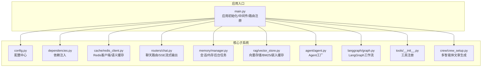
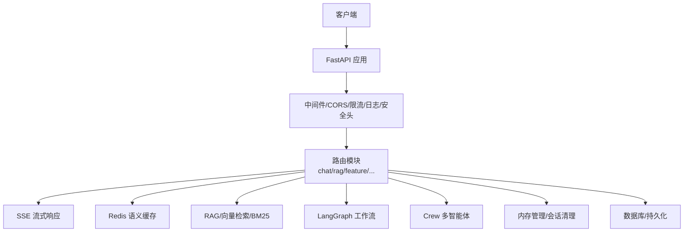
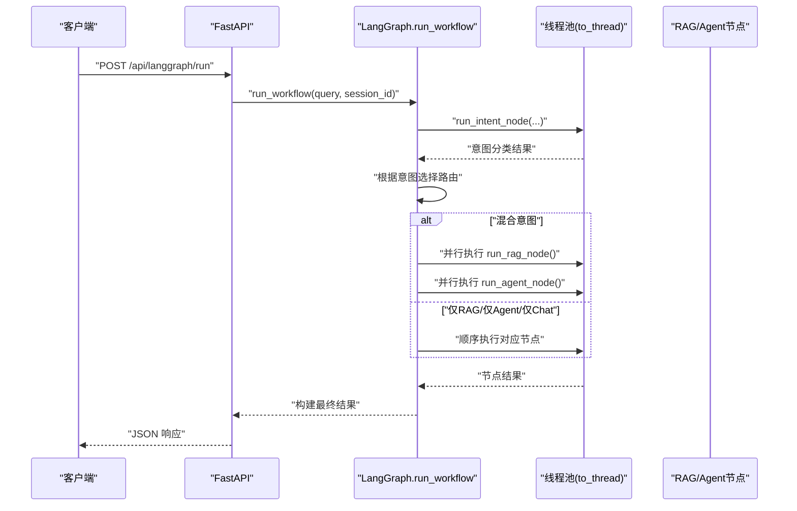
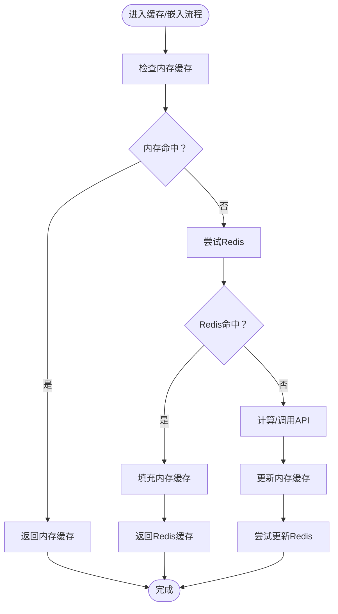
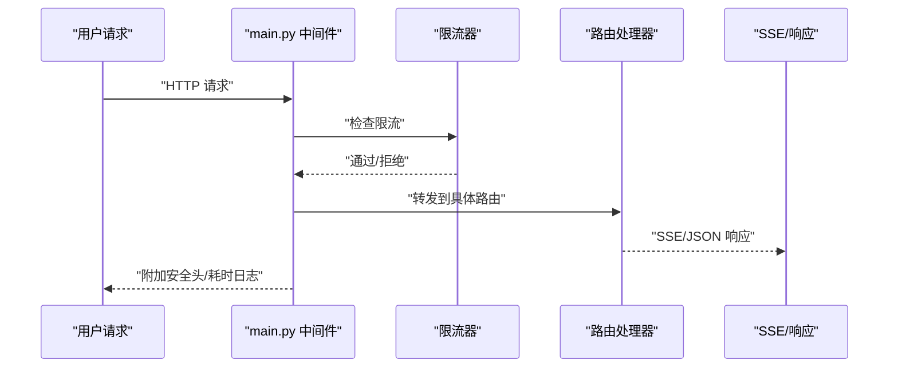
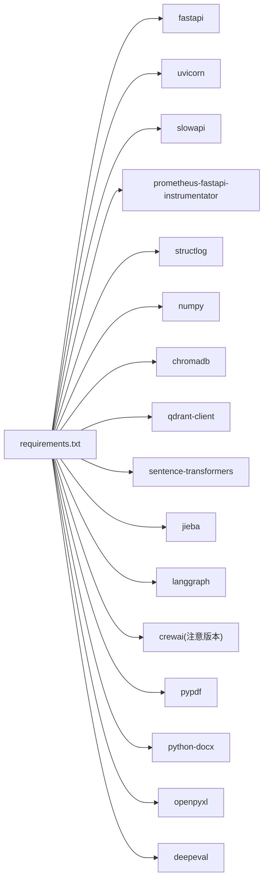

# 后端性能调优

<cite>
**本文引用的文件**
- [backend/app/main.py](file://backend/app/main.py)
- [backend/app/config.py](file://backend/app/config.py)
- [backend/app/dependencies.py](file://backend/app/dependencies.py)
- [backend/app/cache/redis_client.py](file://backend/app/cache/redis_client.py)
- [backend/app/routers/chat.py](file://backend/app/routers/chat.py)
- [backend/app/memory/manager.py](file://backend/app/memory/manager.py)
- [backend/app/rag/vector_store.py](file://backend/app/rag/vector_store.py)
- [backend/app/agent/agent.py](file://backend/app/agent/agent.py)
- [backend/app/langgraph/graph.py](file://backend/app/langgraph/graph.py)
- [backend/app/exceptions.py](file://backend/app/exceptions.py)
- [backend/app/tools/__init__.py](file://backend/app/tools/__init__.py)
- [backend/app/crew/crew_setup.py](file://backend/app/crew/crew_setup.py)
- [backend/requirements.txt](file://backend/requirements.txt)
</cite>

## 目录
1. [引言](#引言)
2. [项目结构](#项目结构)
3. [核心组件](#核心组件)
4. [架构总览](#架构总览)
5. [详细组件分析](#详细组件分析)
6. [依赖分析](#依赖分析)
7. [性能考虑](#性能考虑)
8. [故障排查指南](#故障排查指南)
9. [结论](#结论)
10. [附录](#附录)

## 引言
本文件面向 Aureon 后端系统，聚焦于在高并发与复杂 AI 工作负载下的性能调优实践。内容覆盖异步处理优化、并发控制与资源池管理、FastAPI 应用性能优化、API 性能调优、内存管理优化、并发处理策略、负载均衡与水平扩展建议，以及性能测试方法与瓶颈识别技术。目标是在保证功能正确性的前提下，最大化吞吐、降低延迟、提升稳定性与可维护性。

## 项目结构
后端采用 FastAPI 主应用 + 多模块子系统（RAG、LangGraph、Agent、Crew、缓存、内存管理等）的分层组织方式。主应用负责路由注册、中间件、异常处理、指标暴露与启动/关闭流程；各子模块按职责拆分，便于独立优化与演进。

图表来源
- [backend/app/main.py:68-371](file://backend/app/main.py#L68-L371)
- [backend/app/config.py:1-90](file://backend/app/config.py#L1-L90)
- [backend/app/dependencies.py:1-38](file://backend/app/dependencies.py#L1-L38)
- [backend/app/cache/redis_client.py:1-161](file://backend/app/cache/redis_client.py#L1-L161)
- [backend/app/routers/chat.py:1-107](file://backend/app/routers/chat.py#L1-L107)
- [backend/app/memory/manager.py:1-130](file://backend/app/memory/manager.py#L1-L130)
- [backend/app/rag/vector_store.py:1-800](file://backend/app/rag/vector_store.py#L1-L800)
- [backend/app/agent/agent.py:1-71](file://backend/app/agent/agent.py#L1-L71)
- [backend/app/langgraph/graph.py:1-163](file://backend/app/langgraph/graph.py#L1-L163)
- [backend/app/tools/__init__.py:1-23](file://backend/app/tools/__init__.py#L1-L23)
- [backend/app/crew/crew_setup.py:1-97](file://backend/app/crew/crew_setup.py#L1-L97)

章节来源
- [backend/app/main.py:68-371](file://backend/app/main.py#L68-L371)

## 核心组件
- 应用入口与中间件：统一 CORS、速率限制、结构化日志与安全头注入，启动/关闭阶段初始化数据库、特性开关表、可观测性表等，并启动后台任务与索引预热。
- 缓存与依赖注入：提供 Redis 语义缓存与降级回退、依赖注入封装，支持“必需/可选”两种模式。
- 聊天与增强聊天：基于 SSE 的流式输出，支持基础聊天与带 RAG 的增强聊天。
- 内存管理：会话生命周期管理、原子事实抽取、场景终结与 Persona 更新、后台清理任务。
- 向量检索与嵌入：本地/远端嵌入链路、Chroma/Qdrant/Elasticsearch 支持、BM25 关键词检索、嵌入缓存与降级。
- Agent/LangGraph/Crew：LangGraph 工作流编排、Agent 工厂、多智能体文章生成流水线。
- 异常体系：统一结构化错误返回，便于前端与监控系统消费。

章节来源
- [backend/app/main.py:68-371](file://backend/app/main.py#L68-L371)
- [backend/app/cache/redis_client.py:1-161](file://backend/app/cache/redis_client.py#L1-L161)
- [backend/app/dependencies.py:1-38](file://backend/app/dependencies.py#L1-L38)
- [backend/app/routers/chat.py:1-107](file://backend/app/routers/chat.py#L1-L107)
- [backend/app/memory/manager.py:1-130](file://backend/app/memory/manager.py#L1-L130)
- [backend/app/rag/vector_store.py:1-800](file://backend/app/rag/vector_store.py#L1-L800)
- [backend/app/agent/agent.py:1-71](file://backend/app/agent/agent.py#L1-L71)
- [backend/app/langgraph/graph.py:1-163](file://backend/app/langgraph/graph.py#L1-L163)
- [backend/app/crew/crew_setup.py:1-97](file://backend/app/crew/crew_setup.py#L1-L97)

## 架构总览
系统采用“主应用 + 子模块”的分层架构，结合异步与流式处理实现高并发下的低延迟响应。关键性能点包括：
- 中间件与异常处理：统一结构化日志、安全头、速率限制与指标暴露。
- 缓存与降级：Redis 语义缓存 + 内存缓存双通道，失败即降级。
- 并发与异步：SSE 流式输出、LangGraph 节点并行执行、后台任务清理。
- 检索与嵌入：BM25 关键词检索（毫秒级）、嵌入缓存与多提供商回退链路。

图表来源
- [backend/app/main.py:68-371](file://backend/app/main.py#L68-L371)
- [backend/app/routers/chat.py:46-93](file://backend/app/routers/chat.py#L46-L93)
- [backend/app/rag/vector_store.py:663-740](file://backend/app/rag/vector_store.py#L663-L740)
- [backend/app/langgraph/graph.py:43-146](file://backend/app/langgraph/graph.py#L43-L146)
- [backend/app/crew/crew_setup.py:50-97](file://backend/app/crew/crew_setup.py#L50-L97)

## 详细组件分析

### 组件A：异步任务调度与并发控制
- LangGraph 工作流在节点执行时使用线程池包装同步阻塞调用，避免阻塞事件循环，同时允许“混合”意图下 RAG 与 Agent 节点并行执行，缩短端到端时延。
- 聊天路由中的 SSE 流式输出通过异步生成器逐段推送，配合连接保持与缓冲禁用头，减少首字节延迟。
- 内存管理器启动后台任务定期清理长时间不活跃会话，避免内存泄漏与状态膨胀。

图表来源
- [backend/app/langgraph/graph.py:43-146](file://backend/app/langgraph/graph.py#L43-L146)

章节来源
- [backend/app/langgraph/graph.py:43-146](file://backend/app/langgraph/graph.py#L43-L146)
- [backend/app/routers/chat.py:46-93](file://backend/app/routers/chat.py#L46-L93)
- [backend/app/memory/manager.py:88-127](file://backend/app/memory/manager.py#L88-L127)

### 组件B：缓存与资源池管理
- Redis 语义缓存：查询命中优先查内存缓存，再查 Redis；写入时同时更新内存缓存；连接失败时降级为内存缓存，具备重试与失败计数机制。
- 嵌入缓存：对嵌入结果进行内存与 Redis 双缓存，LRU 淘汰，避免重复 API 调用。
- 工具注册：根据向量索引存在性动态注册 RAG 工具，减少无效依赖加载。

图表来源
- [backend/app/cache/redis_client.py:106-144](file://backend/app/cache/redis_client.py#L106-L144)
- [backend/app/rag/vector_store.py:416-512](file://backend/app/rag/vector_store.py#L416-L512)

章节来源
- [backend/app/cache/redis_client.py:1-161](file://backend/app/cache/redis_client.py#L1-L161)
- [backend/app/rag/vector_store.py:1-800](file://backend/app/rag/vector_store.py#L1-L800)
- [backend/app/tools/__init__.py:12-23](file://backend/app/tools/__init__.py#L12-L23)

### 组件C：FastAPI 应用性能优化
- 中间件：CORS 允许配置化来源；HTTP 中间件注入请求 ID、安全头与耗时日志。
- 速率限制：SlowAPI 基于远程地址限流，保护下游服务。
- 指标暴露：Prometheus 指标自动注入与端点暴露，便于运维观测。
- 路由注册：将多个子路由模块集中注册，避免重复扫描与导入成本。

图表来源
- [backend/app/main.py:68-124](file://backend/app/main.py#L68-L124)
- [backend/app/main.py:65-71](file://backend/app/main.py#L65-L71)
- [backend/app/main.py:80-81](file://backend/app/main.py#L80-L81)

章节来源
- [backend/app/main.py:68-124](file://backend/app/main.py#L68-L124)
- [backend/app/main.py:80-81](file://backend/app/main.py#L80-L81)

### 组件D：API 性能调优
- SSE 连接复用：聊天增强路由设置合适的缓存控制与缓冲禁用头，避免代理层缓存导致的延迟。
- 请求处理优化：路由内尽量前置校验与快速失败（如 Crew 生成的模块缺失），减少无效开销。
- 响应压缩：当前未见显式压缩中间件，可在生产环境评估启用 gzip/br 压缩以降低带宽占用。

章节来源
- [backend/app/routers/chat.py:66-93](file://backend/app/routers/chat.py#L66-L93)
- [backend/app/main.py:235-267](file://backend/app/main.py#L235-L267)

### 组件E：内存管理优化
- 对象池与缓存：嵌入缓存采用固定容量与淘汰策略；Redis 降级时的内存缓存具备 TTL 与大小上限控制。
- 垃圾回收调优：通过避免在热路径创建临时大对象、复用字符串与小对象、及时释放会话与场景数据，减少 GC 压力。
- 内存泄漏检测：后台清理任务定期终结不活跃会话并清理旧消息，防止会话无限增长。

章节来源
- [backend/app/rag/vector_store.py:21-31](file://backend/app/rag/vector_store.py#L21-L31)
- [backend/app/cache/redis_client.py:19-60](file://backend/app/cache/redis_client.py#L19-L60)
- [backend/app/memory/manager.py:104-127](file://backend/app/memory/manager.py#L104-L127)

### 组件F：并发处理优化
- 线程池配置：LangGraph 使用 asyncio.to_thread 包装同步节点执行，避免阻塞事件循环；可根据 CPU 核数与 I/O 特性调整线程池大小。
- 协程使用：SSE 与异步生成器在路由中广泛使用，降低阻塞与上下文切换成本。
- 锁竞争避免：Agent 工厂使用 asyncio.Lock 保护共享缓存字典的创建过程，避免竞态；聊天路由中的全局缓存需注意并发访问。

章节来源
- [backend/app/langgraph/graph.py:56-98](file://backend/app/langgraph/graph.py#L56-L98)
- [backend/app/routers/chat.py:28-43](file://backend/app/routers/chat.py#L28-L43)

### 组件G：负载均衡与水平扩展
- 应用层：通过容器编排与反向代理实现多实例部署与健康检查；静态资源挂载在应用内，适合单实例部署。
- 数据层：Redis、Chroma/Qdrant/Elasticsearch 等外部组件需独立扩缩容与高可用配置。
- 扩展建议：CPU 密集型节点（嵌入/重排）与 I/O 密集型节点（SSE/网络）分离部署；引入队列/消息中间件承载长耗时任务。

章节来源
- [backend/app/main.py:364-371](file://backend/app/main.py#L364-L371)
- [backend/app/config.py:41-62](file://backend/app/config.py#L41-L62)

## 依赖分析
- FastAPI 生态：uvicorn、slowapi、prometheus-fastapi-instrumentator、structlog。
- RAG 生态：numpy、chromadb、qdrant-client、sentence-transformers、jieba。
- LangGraph：langgraph。
- Crew：crewai（与 langchain 版本兼容性注意）。
- 文档解析：pypdf、python-docx、openpyxl。
- 评估：deepeval。

图表来源
- [backend/requirements.txt:1-57](file://backend/requirements.txt#L1-L57)

章节来源
- [backend/requirements.txt:1-57](file://backend/requirements.txt#L1-L57)

## 性能考虑
- 异步与并发
  - 使用 asyncio.to_thread 包装阻塞调用，避免事件循环被阻塞。
  - SSE 流式输出减少一次性大响应的内存占用与传输时间。
  - 后台任务定期清理不活跃会话，避免内存泄漏。
- 缓存与降级
  - 语义缓存与嵌入缓存双通道，失败即降级，提升可用性与稳定性。
  - 内存缓存具备 TTL 与容量上限，避免无限增长。
- 路由与中间件
  - 统一 CORS、速率限制与指标暴露，减少重复逻辑。
  - 结构化日志与安全头注入，便于问题定位与安全加固。
- 检索与嵌入
  - BM25 关键词检索毫秒级，显著降低检索延迟。
  - 多提供商嵌入回退链路，提高成功率与稳定性。
- 工具与依赖
  - 动态注册工具，避免不必要的依赖加载。
  - Crew 生成流程中使用回调与进度事件，提升用户体验。

章节来源
- [backend/app/langgraph/graph.py:56-98](file://backend/app/langgraph/graph.py#L56-L98)
- [backend/app/routers/chat.py:46-93](file://backend/app/routers/chat.py#L46-L93)
- [backend/app/memory/manager.py:88-127](file://backend/app/memory/manager.py#L88-L127)
- [backend/app/cache/redis_client.py:106-144](file://backend/app/cache/redis_client.py#L106-L144)
- [backend/app/rag/vector_store.py:176-324](file://backend/app/rag/vector_store.py#L176-L324)
- [backend/app/tools/__init__.py:12-23](file://backend/app/tools/__init__.py#L12-L23)
- [backend/app/crew/crew_setup.py:27-47](file://backend/app/crew/crew_setup.py#L27-L47)

## 故障排查指南
- 自定义异常处理：统一结构化 JSON 错误响应，包含错误类型与详情，便于前端与监控系统消费。
- 速率限制：SlowAPI 超限时返回标准错误，可通过指标与日志定位热点接口。
- 日志与指标：中间件记录请求耗时与状态码，Prometheus 指标暴露端点便于 Grafana 监控。
- 缓存问题：Redis 不可用时自动降级为内存缓存；若仍失败，检查连接参数与网络策略。
- 向量检索：Chroma 初始化失败或维度不匹配时自动回退至 API 嵌入并清理错误缓存。

章节来源
- [backend/app/exceptions.py:12-41](file://backend/app/exceptions.py#L12-L41)
- [backend/app/main.py:65-71](file://backend/app/main.py#L65-L71)
- [backend/app/main.py:80-81](file://backend/app/main.py#L80-L81)
- [backend/app/cache/redis_client.py:67-97](file://backend/app/cache/redis_client.py#L67-L97)
- [backend/app/rag/vector_store.py:699-718](file://backend/app/rag/vector_store.py#L699-L718)

## 结论
Aureon 后端在异步、缓存、并发与可观测性方面已具备良好基础。建议在生产环境中进一步完善：
- 明确线程池与 uvicorn worker 数量，结合 CPU/IO 特性调优。
- 引入响应压缩中间件，降低带宽占用。
- 对关键路径增加采样日志与埋点，持续监控 P95/P99 延迟。
- 将长耗时任务迁移至队列/消息中间件，保障接口 SLA。
- 在反向代理层配置合理的超时与健康检查策略，确保水平扩展的稳定性。

## 附录
- 性能测试方法
  - 压力测试：使用 locust 或 k6 对聊天、LangGraph、Crew 等关键接口施压，观察延迟与错误率。
  - 性能基准测试：针对嵌入、检索、SSE 流式输出分别制定基准，定期回归。
  - 瓶颈识别：结合 Prometheus 指标、应用日志与火焰图，定位 CPU/IO/网络瓶颈。
- 负载均衡与水平扩展
  - 多实例部署：通过容器编排与反向代理实现横向扩展。
  - 数据层扩展：Redis、Chroma/Qdrant/Elasticsearch 独立扩缩容与高可用配置。
  - 分离 CPU/I-O 密集型任务：将嵌入/重排与 SSE/网络 I/O 解耦部署。