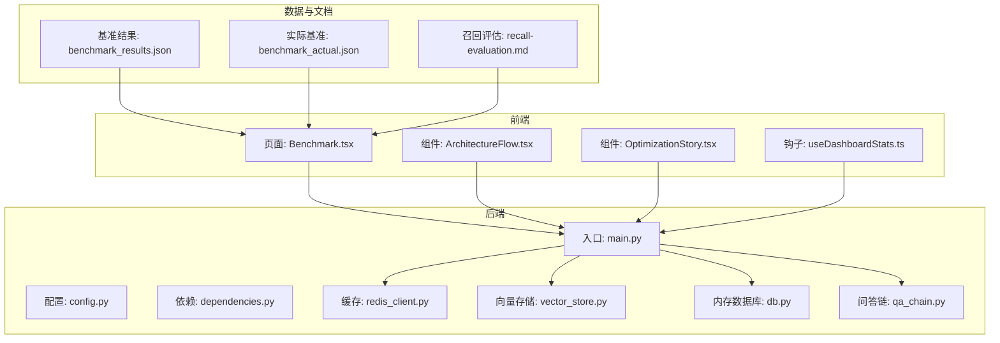
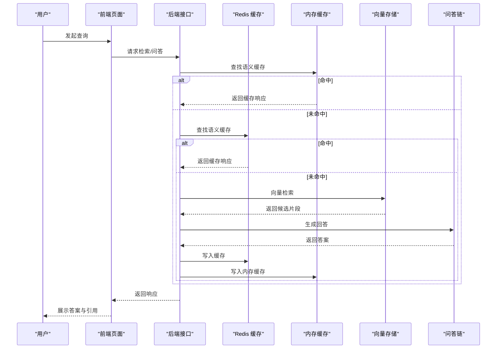
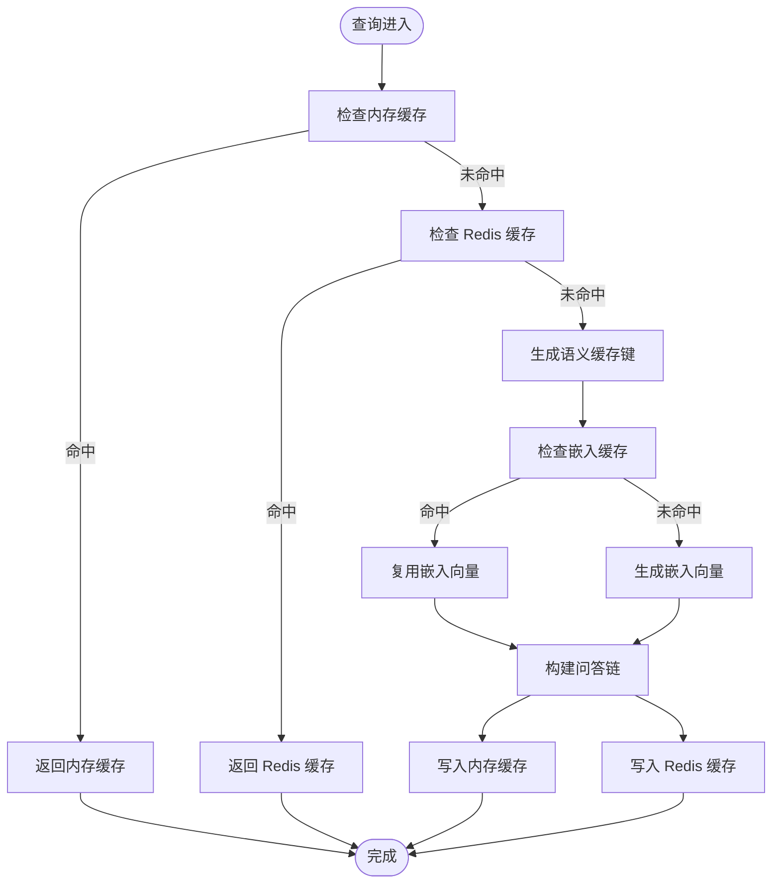
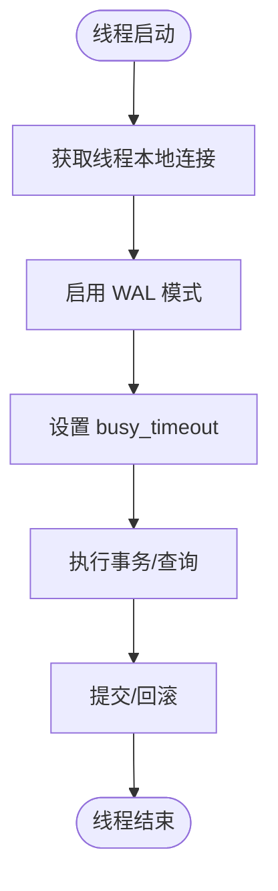
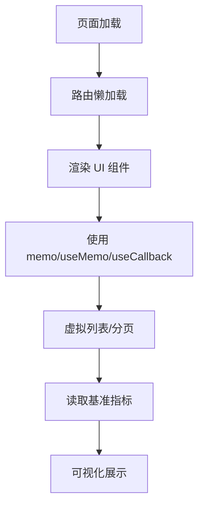
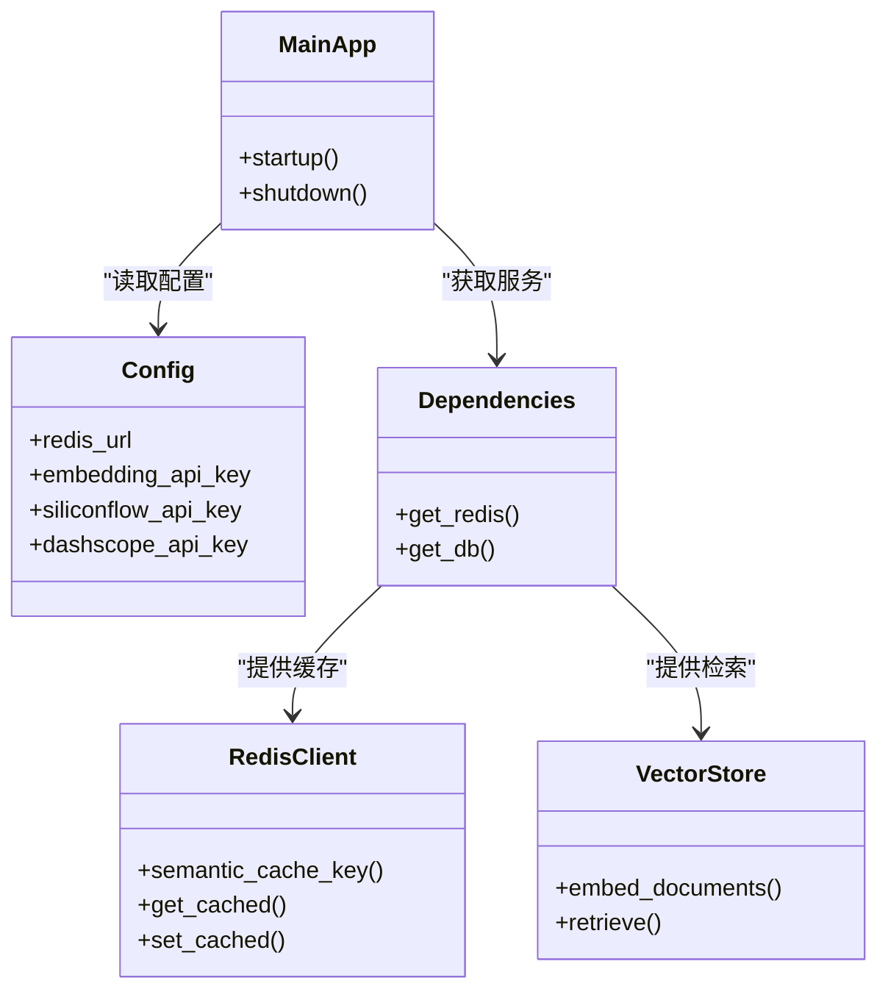
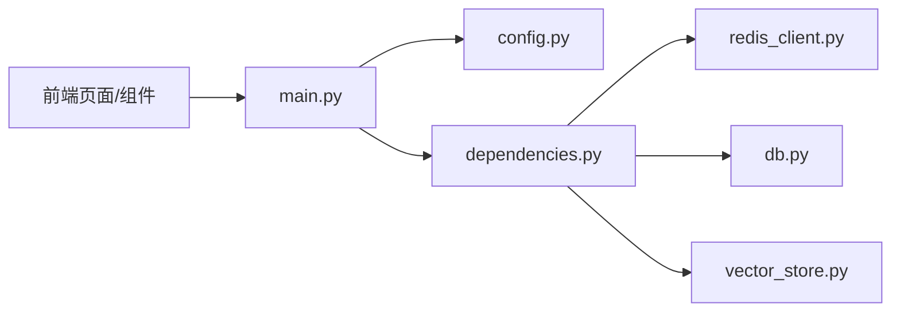

# 性能优化

<cite>
**本文引用的文件**
- [redis_client.py](file://backend/app/cache/redis_client.py)
- [vector_store.py](file://backend/app/rag/vector_store.py)
- [db.py](file://backend/app/memory/db.py)
- [OptimizationStory.tsx](file://src/components/architecture/OptimizationStory.tsx)
- [Benchmark.tsx](file://src/pages/Benchmark.tsx)
- [ArchitectureFlow.tsx](file://src/components/architecture/ArchitectureFlow.tsx)
- [useDashboardStats.ts](file://src/hooks/useDashboardStats.ts)
- [react-performance-tips.md](file://backend/data/articles/en/react-performance-tips.md)
- [config.py](file://backend/app/config.py)
- [dependencies.py](file://backend/app/dependencies.py)
- [main.py](file://backend/app/main.py)
- [models.py](file://backend/app/api/models.py)
- [qa_chain.py](file://backend/app/rag/qa_chain.py)
- [benchmark_results.json](file://backend/data/benchmark_results.json)
- [benchmark_actual.json](file://backend/data/benchmark_actual.json)
- [recall-evaluation.md](file://docs/benchmarks/recall-evaluation.md)
</cite>

## 目录
1. [简介](#简介)
2. [项目结构](#项目结构)
3. [核心组件](#核心组件)
4. [架构总览](#架构总览)
5. [详细组件分析](#详细组件分析)
6. [依赖关系分析](#依赖关系分析)
7. [性能考量](#性能考量)
8. [故障排查指南](#故障排查指南)
9. [结论](#结论)
10. [附录](#附录)

## 简介
本文件面向 Aureon 系统的性能优化，围绕以下目标展开：  
- 性能指标与评估：召回率评估、延迟测量、吞吐量分析  
- 缓存优化：Redis 缓存、内存缓存、嵌入模型缓存的配置与调优  
- 数据库查询优化：索引策略、连接池与并发控制  
- 前端性能优化：代码分割、懒加载、资源压缩与渲染优化  
- 后端性能调优：异步处理、并发控制、资源管理  
- 监控与瓶颈识别：性能监控工具、指标采集与定位  
- 测试与持续优化：性能测试方法、基准测试与迭代优化策略  

## 项目结构
Aureon 采用前后端分离架构，后端以 Python/FastAPI 为核心，前端基于 React/Vite。性能优化涉及后端缓存层（Redis/内存）、RAG 嵌入与检索、SQLite 内存数据库、以及前端渲染与网络请求优化。

**图表来源**
- [main.py](file://backend/app/main.py)
- [config.py](file://backend/app/config.py)
- [dependencies.py](file://backend/app/dependencies.py)
- [redis_client.py](file://backend/app/cache/redis_client.py)
- [vector_store.py](file://backend/app/rag/vector_store.py)
- [db.py](file://backend/app/memory/db.py)
- [qa_chain.py](file://backend/app/rag/qa_chain.py)
- [Benchmark.tsx](file://src/pages/Benchmark.tsx)
- [ArchitectureFlow.tsx](file://src/components/architecture/ArchitectureFlow.tsx)
- [OptimizationStory.tsx](file://src/components/architecture/OptimizationStory.tsx)
- [useDashboardStats.ts](file://src/hooks/useDashboardStats.ts)
- [benchmark_results.json](file://backend/data/benchmark_results.json)
- [benchmark_actual.json](file://backend/data/benchmark_actual.json)
- [recall-evaluation.md](file://docs/benchmarks/recall-evaluation.md)

**章节来源**
- [main.py](file://backend/app/main.py)
- [config.py](file://backend/app/config.py)
- [dependencies.py](file://backend/app/dependencies.py)

## 核心组件
- 缓存层：Redis 语义缓存与内存降级缓存，支持 TTL 与版本化失效  
- 向量存储与嵌入：多级缓存（Redis/本地模型/API）与批量嵌入  
- 内存数据库：SQLite 线程本地连接、WAL 模式与忙等待超时  
- 前端性能：基准展示、架构流程可视化、仪表盘轮询与指数退避  
- 配置与依赖：统一配置与依赖注入，便于在不同环境调整性能参数  

**章节来源**
- [redis_client.py](file://backend/app/cache/redis_client.py)
- [vector_store.py](file://backend/app/rag/vector_store.py)
- [db.py](file://backend/app/memory/db.py)
- [OptimizationStory.tsx](file://src/components/architecture/OptimizationStory.tsx)
- [Benchmark.tsx](file://src/pages/Benchmark.tsx)
- [ArchitectureFlow.tsx](file://src/components/architecture/ArchitectureFlow.tsx)
- [useDashboardStats.ts](file://src/hooks/useDashboardStats.ts)

## 架构总览
系统性能优化的关键路径包括：  
- 查询命中缓存（Redis/内存）→ 直接返回响应  
- 缓存未命中 → 向量检索与生成链路（QA Chain）  
- 嵌入生成：优先本地模型，失败回退到 API 提供商  
- 数据持久化：内存数据库用于对话记忆，避免跨线程竞争  

**图表来源**
- [redis_client.py](file://backend/app/cache/redis_client.py)
- [vector_store.py](file://backend/app/rag/vector_store.py)
- [qa_chain.py](file://backend/app/rag/qa_chain.py)

## 详细组件分析

### 缓存优化策略
- 语义缓存键：对查询进行标准化与哈希，结合版本号，确保变更后自动失效  
- 多级缓存：内存缓存优先、Redis 次之；Redis 不可用时自动降级至内存缓存  
- TTL 与失效：内存缓存与 Redis 使用相同 TTL；版本号作为全局失效开关  
- 嵌入缓存：向量存储模块对嵌入结果进行 Redis 缓存，减少重复计算  
- 调优建议：  
  - 根据业务 QPS 调整内存缓存上限与 TTL  
  - Redis 连接超时与重试策略需与上游 SLA 对齐  
  - 版本号在检索逻辑或模型更新后及时升级，避免陈旧缓存影响召回  

**图表来源**
- [redis_client.py](file://backend/app/cache/redis_client.py)
- [vector_store.py](file://backend/app/rag/vector_store.py)

**章节来源**
- [redis_client.py](file://backend/app/cache/redis_client.py)
- [vector_store.py](file://backend/app/rag/vector_store.py)

### 数据库查询优化与连接池
- 线程本地连接：每个线程独立持有 SQLite 连接，避免跨线程共享带来的锁争用  
- WAL 模式：允许多个读取连接并发访问，降低写入阻塞  
- 忙等待超时：设置合理的 busy_timeout，缓解写入竞争导致的阻塞  
- 建议：  
  - 将热点表建立合适索引，避免全表扫描  
  - 控制单次事务大小，缩短锁持有时间  
  - 对高频查询使用只读连接池或连接池大小与并发匹配  

**图表来源**
- [db.py](file://backend/app/memory/db.py)

**章节来源**
- [db.py](file://backend/app/memory/db.py)

### 前端性能优化
- 渲染优化：使用 React.memo、useMemo、useCallback 减少不必要重渲染  
- 代码分割：路由级懒加载，降低首屏体积与解析时间  
- 虚拟列表：大数据量渲染仅渲染可视区域元素  
- 资源压缩：Vite 构建开启压缩与 Tree Shaking  
- 基准展示：通过页面与组件动态读取后端基准指标，直观呈现优化效果  
- 仪表盘轮询：指数退避策略降低峰值压力，提升稳定性  

**图表来源**
- [Benchmark.tsx](file://src/pages/Benchmark.tsx)
- [OptimizationStory.tsx](file://src/components/architecture/OptimizationStory.tsx)
- [ArchitectureFlow.tsx](file://src/components/architecture/ArchitectureFlow.tsx)
- [useDashboardStats.ts](file://src/hooks/useDashboardStats.ts)
- [react-performance-tips.md](file://backend/data/articles/en/react-performance-tips.md)

**章节来源**
- [Benchmark.tsx](file://src/pages/Benchmark.tsx)
- [OptimizationStory.tsx](file://src/components/architecture/OptimizationStory.tsx)
- [ArchitectureFlow.tsx](file://src/components/architecture/ArchitectureFlow.tsx)
- [useDashboardStats.ts](file://src/hooks/useDashboardStats.ts)
- [react-performance-tips.md](file://backend/data/articles/en/react-performance-tips.md)

### 后端性能调优
- 异步处理：Redis 客户端使用异步连接，降低阻塞风险  
- 并发控制：根据 CPU/IO 特性调整工作进程数与连接池大小  
- 资源管理：嵌入生成优先本地模型，失败回退 API，避免单点依赖  
- 配置与依赖：集中配置与依赖注入，便于在不同环境快速切换参数  

**图表来源**
- [config.py](file://backend/app/config.py)
- [dependencies.py](file://backend/app/dependencies.py)
- [redis_client.py](file://backend/app/cache/redis_client.py)
- [vector_store.py](file://backend/app/rag/vector_store.py)
- [main.py](file://backend/app/main.py)

**章节来源**
- [config.py](file://backend/app/config.py)
- [dependencies.py](file://backend/app/dependencies.py)
- [main.py](file://backend/app/main.py)

## 依赖关系分析
- 后端入口依赖配置与依赖注入，统一管理缓存与数据库客户端  
- 缓存与向量存储模块相互解耦，可独立扩展与替换  
- 前端通过页面与组件消费后端指标，形成闭环反馈  

**图表来源**
- [main.py](file://backend/app/main.py)
- [config.py](file://backend/app/config.py)
- [dependencies.py](file://backend/app/dependencies.py)
- [redis_client.py](file://backend/app/cache/redis_client.py)
- [db.py](file://backend/app/memory/db.py)
- [vector_store.py](file://backend/app/rag/vector_store.py)

**章节来源**
- [main.py](file://backend/app/main.py)
- [dependencies.py](file://backend/app/dependencies.py)

## 性能考量
- 召回率评估：参考召回评估文档，结合检索链路与语义相似度阈值，持续优化检索质量  
- 延迟测量：前端基准页面展示 TTFT、检索延迟等关键指标，便于对比优化前后的差异  
- 吞吐量分析：通过仪表盘统计查询量与趋势，结合数据库连接池与缓存命中率评估系统承载能力  
- 成本控制：嵌入与大模型调用成本可通过缓存命中率与本地模型优先策略显著降低  
- 权衡考虑：缓存一致性与新鲜度、本地模型精度与成本、并发与资源占用之间的平衡  

**章节来源**
- [recall-evaluation.md](file://docs/benchmarks/recall-evaluation.md)
- [Benchmark.tsx](file://src/pages/Benchmark.tsx)
- [OptimizationStory.tsx](file://src/components/architecture/OptimizationStory.tsx)
- [QueryVolumeChart.tsx](file://src/components/dashboard/QueryVolumeChart.tsx)

## 故障排查指南
- 缓存不可用：Redis 连接异常时自动降级内存缓存；检查连接超时与失败计数，确认版本号是否正确  
- 嵌入生成失败：若本地模型不可用，检查 API 密钥配置；按顺序尝试多个提供商，记录最后一次错误  
- 数据库阻塞：检查 busy_timeout 设置与事务大小；避免跨线程共享连接  
- 前端指标异常：确认基准数据接口可用；检查指数退避策略是否导致刷新延迟  
- 监控与日志：关注缓存命中率、检索延迟、TTFT、成本等指标，定位瓶颈环节  

**章节来源**
- [redis_client.py](file://backend/app/cache/redis_client.py)
- [vector_store.py](file://backend/app/rag/vector_store.py)
- [db.py](file://backend/app/memory/db.py)
- [useDashboardStats.ts](file://src/hooks/useDashboardStats.ts)

## 结论
Aureon 的性能优化以“多级缓存 + 本地优先 + 异步与并发控制”为核心策略。通过前端指标可视化与后端指标采集，形成持续优化闭环。建议在不同场景下动态调整缓存策略、并发参数与检索阈值，在保证质量的前提下最大化吞吐与降低成本。

## 附录
- 基准测试与结果  
  - 基准结果文件：[benchmark_results.json](file://backend/data/benchmark_results.json)  
  - 实际基准文件：[benchmark_actual.json](file://backend/data/benchmark_actual.json)  
- 召回评估文档：[recall-evaluation.md](file://docs/benchmarks/recall-evaluation.md)  
- 前端性能文章：[react-performance-tips.md](file://backend/data/articles/en/react-performance-tips.md)