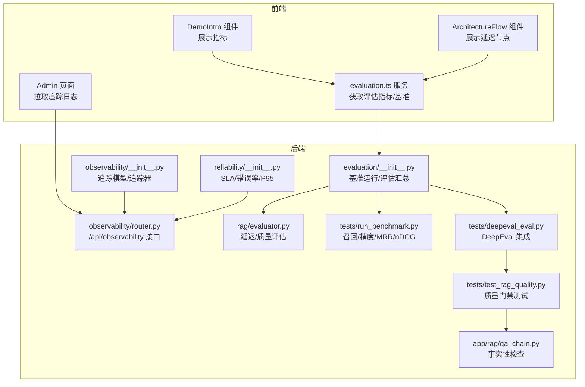
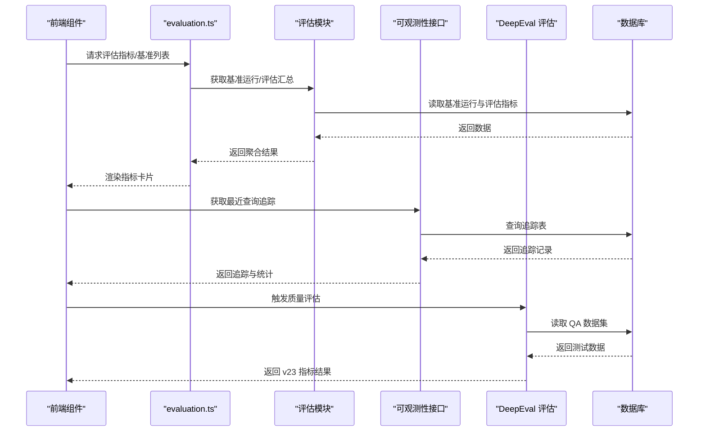
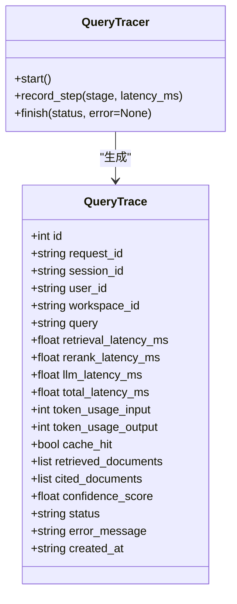
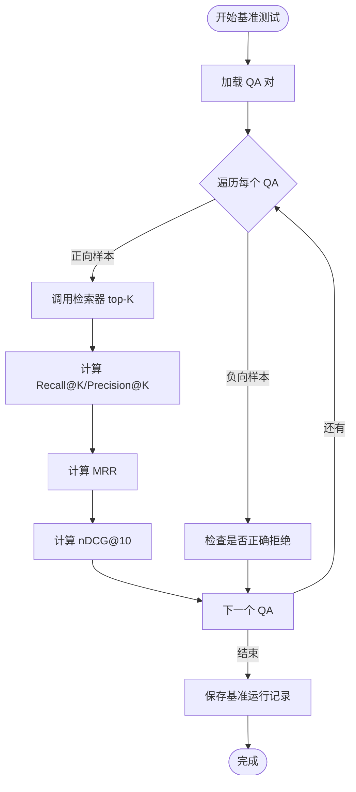
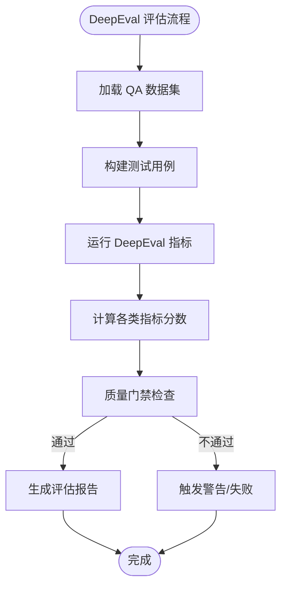
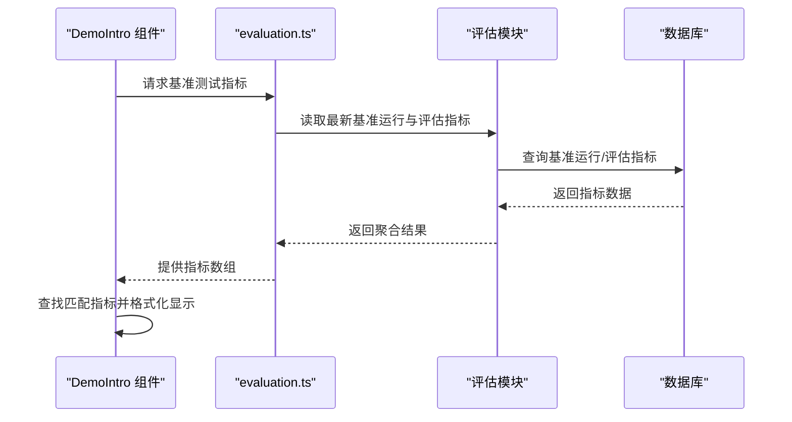
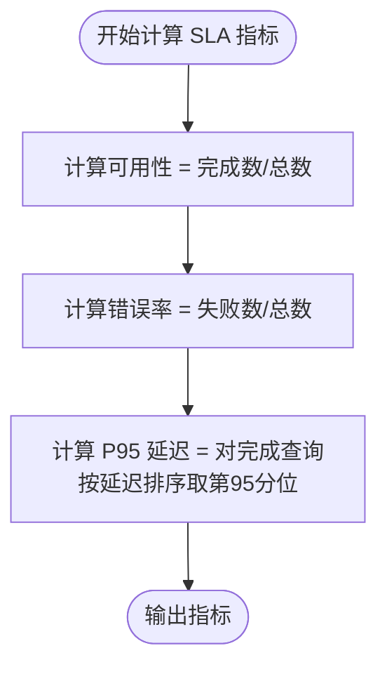
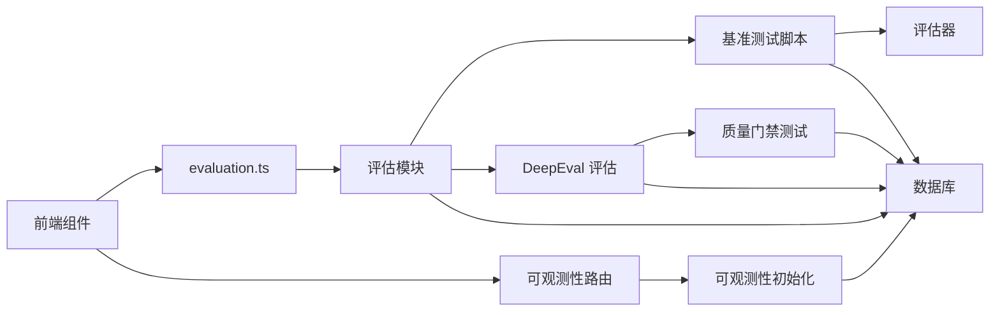

# 性能指标与监控

<cite>
**本文引用的文件**
- [backend/app/observability/__init__.py](file://backend/app/observability/__init__.py)
- [backend/app/observability/router.py](file://backend/app/observability/router.py)
- [backend/app/reliability/__init__.py](file://backend/app/reliability/__init__.py)
- [backend/app/evaluation/__init__.py](file://backend/app/evaluation/__init__.py)
- [backend/app/rag/evaluator.py](file://backend/app/rag/evaluator.py)
- [backend/tests/run_benchmark.py](file://backend/tests/run_benchmark.py)
- [backend/tests/test_observability.py](file://backend/tests/test_observability.py)
- [backend/tests/deepeval_eval.py](file://backend/tests/deepeval_eval.py)
- [backend/tests/test_rag_quality.py](file://backend/tests/test_rag_quality.py)
- [backend/tests/eval_runner.py](file://backend/tests/eval_runner.py)
- [backend/app/rag/qa_chain.py](file://backend/app/rag/qa_chain.py)
- [src/components/DemoIntro.tsx](file://src/components/DemoIntro.tsx)
- [src/components/architecture/ArchitectureFlow.tsx](file://src/components/architecture/ArchitectureFlow.tsx)
- [src/services/evaluation.ts](file://src/services/evaluation.ts)
- [src/pages/Admin.tsx](file://src/pages/Admin.tsx)
- [docs/superpowers/plans/2026-06-02-enterprise-rag-upgrade.md](file://docs/superpowers/plans/2026-06-02-enterprise-rag-upgrade.md)
- [.github/workflows/rag-quality.yml](file://.github/workflows/rag-quality.yml)
</cite>

## 更新摘要
**所做更改**
- 新增 DeepEval 质量评估能力章节，包含 v23 指标标准
- 更新检索质量评估指标，新增 Contextual Precision/Recall/Relevancy
- 新增生成质量评估指标，包含 Answer Relevancy 和 Hallucination 评估
- 增强质量门禁（Quality Gate）机制，包含 CI 自动化测试
- 更新评估标准阈值和质量报告格式

## 目录
1. [简介](#简介)
2. [项目结构](#项目结构)
3. [核心组件](#核心组件)
4. [架构总览](#架构总览)
5. [详细组件分析](#详细组件分析)
6. [依赖关系分析](#依赖关系分析)
7. [性能考量](#性能考量)
8. [故障排查指南](#故障排查指南)
9. [结论](#结论)
10. [附录](#附录)

## 简介
本文件面向 Aureon 系统的性能指标与监控，系统性梳理关键性能指标（KPI）的定义与计算方法，涵盖响应时间、吞吐量、并发用户数、错误率等；解释召回率评估机制（精确率、召回率、F1 分数、MRR、nDCG）；阐述延迟测量技术（端到端、检索、重排序、LLM）；给出吞吐量分析方法与资源利用率监控建议；提供 Prometheus/Grafana 工具使用与告警配置思路；并给出性能基线建立、趋势分析与容量规划方法，以及开发者如何进行性能测试与扩展自定义监控指标。

**更新** 新增 DeepEval 质量评估能力，引入 v23 指标标准，包含 Contextual Retrieval 指标类别和新的质量评估标准。

## 项目结构
后端通过可观测性层记录查询链路的端到端与分段延迟，并提供查询追踪与统计接口；评估模块负责基准测试与多指标聚合；DeepEval 集成提供企业级质量评估能力；前端组件展示关键性能指标与架构流程；测试用例覆盖可观测性 API 的可用性与指标字段。

**图表来源**
- [backend/app/observability/__init__.py:1-36](file://backend/app/observability/__init__.py#L1-L36)
- [backend/app/observability/router.py:1-22](file://backend/app/observability/router.py#L1-L22)
- [backend/app/reliability/__init__.py:109-385](file://backend/app/reliability/__init__.py#L109-L385)
- [backend/app/evaluation/__init__.py:133-282](file://backend/app/evaluation/__init__.py#L133-L282)
- [backend/app/rag/evaluator.py:140-180](file://backend/app/rag/evaluator.py#L140-L180)
- [backend/tests/run_benchmark.py:1-51](file://backend/tests/run_benchmark.py#L1-L51)
- [backend/tests/deepeval_eval.py:1-418](file://backend/tests/deepeval_eval.py#L1-L418)
- [backend/tests/test_rag_quality.py:1-75](file://backend/tests/test_rag_quality.py#L1-L75)
- [backend/app/rag/qa_chain.py:517-561](file://backend/app/rag/qa_chain.py#L517-L561)

**章节来源**
- [backend/app/observability/__init__.py:1-36](file://backend/app/observability/__init__.py#L1-L36)
- [backend/app/observability/router.py:1-22](file://backend/app/observability/router.py#L1-L22)
- [backend/app/reliability/__init__.py:109-385](file://backend/app/reliability/__init__.py#L109-L385)
- [backend/app/evaluation/__init__.py:133-282](file://backend/app/evaluation/__init__.py#L133-L282)
- [backend/app/rag/evaluator.py:140-180](file://backend/app/rag/evaluator.py#L140-L180)
- [backend/tests/run_benchmark.py:1-51](file://backend/tests/run_benchmark.py#L1-L51)
- [backend/tests/deepeval_eval.py:1-418](file://backend/tests/deepeval_eval.py#L1-L418)
- [backend/tests/test_rag_quality.py:1-75](file://backend/tests/test_rag_quality.py#L1-L75)
- [backend/app/rag/qa_chain.py:517-561](file://backend/app/rag/qa_chain.py#L517-L561)
- [src/components/DemoIntro.tsx:38-66](file://src/components/DemoIntro.tsx#L38-L66)
- [src/components/architecture/ArchitectureFlow.tsx:23-43](file://src/components/architecture/ArchitectureFlow.tsx#L23-L43)
- [src/services/evaluation.ts:59-94](file://src/services/evaluation.ts#L59-L94)
- [src/pages/Admin.tsx:22-39](file://src/pages/Admin.tsx#L22-L39)

## 核心组件
- 可观测性追踪模型与接口：定义查询追踪数据结构与查询追踪器，提供查询追踪与统计接口，支撑端到端与分段延迟监控。
- 评估与基准测试：负责基准测试运行的保存、查询与汇总，包含召回率、精确率、MRR、nDCG 等指标。
- DeepEval 质量评估：集成企业级 RAG 评估框架，提供 Contextual Precision/Recall/Relevancy、Answer Relevancy、Faithfulness、Hallucination 等 v23 指标。
- 延迟评估：提供 RAG 查询延迟测量（均值、P50、P99）。
- 召回率评估：在基准测试中实现 Recall@K、Precision@K、MRR、nDCG@10 等指标计算。
- 质量门禁测试：CI 自动化测试，确保关键指标不低于阈值要求。
- 前端指标展示：组件从基准测试结果中提取关键指标并渲染，支持端到端延迟、检索延迟、TTFT、LLM 调用次数等。
- SLA 与可靠性：基于查询追踪表计算可用性、错误率与 P95 延迟。

**更新** 新增 DeepEval 质量评估组件，包含 v23 指标标准和质量门禁测试机制。

**章节来源**
- [backend/app/observability/__init__.py:12-36](file://backend/app/observability/__init__.py#L12-L36)
- [backend/app/observability/router.py:12-22](file://backend/app/observability/router.py#L12-L22)
- [backend/app/evaluation/__init__.py:147-282](file://backend/app/evaluation/__init__.py#L147-L282)
- [backend/app/rag/evaluator.py:140-180](file://backend/app/rag/evaluator.py#L140-L180)
- [backend/tests/run_benchmark.py:33-51](file://backend/tests/run_benchmark.py#L33-L51)
- [backend/tests/deepeval_eval.py:180-286](file://backend/tests/deepeval_eval.py#L180-L286)
- [backend/tests/test_rag_quality.py:16-28](file://backend/tests/test_rag_quality.py#L16-L28)
- [src/components/DemoIntro.tsx:38-66](file://src/components/DemoIntro.tsx#L38-L66)
- [backend/app/reliability/__init__.py:350-385](file://backend/app/reliability/__init__.py#L350-L385)

## 架构总览
下图展示了前端组件、评估服务与后端可观测性/评估模块之间的交互关系，以及查询追踪与统计接口在系统中的位置。

**图表来源**
- [src/services/evaluation.ts:59-94](file://src/services/evaluation.ts#L59-L94)
- [backend/app/evaluation/__init__.py:147-282](file://backend/app/evaluation/__init__.py#L147-L282)
- [backend/app/observability/router.py:12-22](file://backend/app/observability/router.py#L12-L22)
- [backend/app/observability/__init__.py:12-36](file://backend/app/observability/__init__.py#L12-L36)
- [backend/tests/deepeval_eval.py:180-286](file://backend/tests/deepeval_eval.py#L180-L286)

## 详细组件分析

### 可观测性追踪与接口
- 追踪模型：包含请求 ID、会话 ID、用户 ID、工作区 ID、查询内容、各阶段延迟（检索、重排序、LLM）、总延迟、Token 使用、缓存命中、引用文档、置信度、状态与错误信息等字段。
- 追踪器：用于在查询链路中埋点，记录各阶段耗时与上下文，最终生成一条完整的 QueryTrace。
- 接口：提供"最近追踪列表"和"可观测性统计"两个端点，支持限制数量与返回关键统计指标（如总请求数、成功率、平均总延迟、P95 总延迟）。

**图表来源**
- [backend/app/observability/__init__.py:12-36](file://backend/app/observability/__init__.py#L12-L36)

**章节来源**
- [backend/app/observability/__init__.py:12-36](file://backend/app/observability/__init__.py#L12-L36)
- [backend/app/observability/router.py:12-22](file://backend/app/observability/router.py#L12-L22)
- [backend/tests/test_observability.py:17-41](file://backend/tests/test_observability.py#L17-L41)

### 评估与基准测试
- 基准运行保存：将一次完整基准测试的结果写入基准运行表，包含总查询数、成功/失败数、平均延迟、Recall@1、Recall@3、Recall@5、Faithfulness、幻觉率、MRR、nDCG、状态与起止时间。
- 评估汇总：从评估指标表中读取最新 Faithfulness、Hallucination Rate 与 Recall@3，并统计总运行次数与成功次数。
- 延迟评估：对一组 QA 对重复执行查询，测量端到端延迟（均值、P50、P99、最小、最大）。
- 召回率评估：在 run_benchmark 中实现 Recall@K、Precision@K、MRR、nDCG@10 的计算逻辑；计划文档中还规划了新增 Recall@10 与 nDCG@10 的实现。

**图表来源**
- [backend/tests/run_benchmark.py:33-51](file://backend/tests/run_benchmark.py#L33-L51)
- [backend/app/rag/evaluator.py:140-180](file://backend/app/rag/evaluator.py#L140-L180)
- [backend/app/evaluation/__init__.py:147-183](file://backend/app/evaluation/__init__.py#L147-L183)
- [docs/superpowers/plans/2026-06-02-enterprise-rag-upgrade.md:37-86](file://docs/superpowers/plans/2026-06-02-enterprise-rag-upgrade.md#L37-L86)

**章节来源**
- [backend/app/evaluation/__init__.py:147-282](file://backend/app/evaluation/__init__.py#L147-L282)
- [backend/app/rag/evaluator.py:140-180](file://backend/app/rag/evaluator.py#L140-L180)
- [backend/tests/run_benchmark.py:33-51](file://backend/tests/run_benchmark.py#L33-L51)
- [docs/superpowers/plans/2026-06-02-enterprise-rag-upgrade.md:37-86](file://docs/superpowers/plans/2026-06-02-enterprise-rag-upgrade.md#L37-L86)

### DeepEval 质量评估能力

**更新** 新增 DeepEval 集成，提供 v23 指标标准的企业级 RAG 评估能力。

- **Contextual Retrieval 指标类别**：包含 Contextual Precision、Contextual Recall、Contextual Relevancy 三个核心指标，专门评估检索到的上下文质量。
- **Generation 指标类别**：包含 Answer Relevancy、Faithfulness、Hallucination 评估，全面衡量生成质量。
- **质量门禁测试**：CI 自动化测试，确保关键指标不低于预设阈值（Context Precision ≥ 0.70、Context Recall ≥ 0.75、Faithfulness ≥ 0.70）。
- **评估阈值标准**：
  - Context Precision: 0.70
  - Context Recall: 0.75  
  - Context Relevancy: 0.70
  - Answer Relevancy: 0.60
  - Faithfulness: 0.70
  - Hallucination Max: 0.20

**图表来源**
- [backend/tests/deepeval_eval.py:180-286](file://backend/tests/deepeval_eval.py#L180-L286)
- [backend/tests/test_rag_quality.py:56-75](file://backend/tests/test_rag_quality.py#L56-L75)
- [backend/tests/eval_runner.py:228-259](file://backend/tests/eval_runner.py#L228-L259)

**章节来源**
- [backend/tests/deepeval_eval.py:1-418](file://backend/tests/deepeval_eval.py#L1-L418)
- [backend/tests/test_rag_quality.py:1-75](file://backend/tests/test_rag_quality.py#L1-L75)
- [backend/tests/eval_runner.py:228-259](file://backend/tests/eval_runner.py#L228-L259)
- [backend/app/rag/qa_chain.py:517-561](file://backend/app/rag/qa_chain.py#L517-L561)

### 前端指标展示与架构流程
- 指标展示：DemoIntro 组件从基准测试结果中查找并显示"回答准确率""响应延迟""成本/查询""检索延迟""TTFT（流式）""全链路延迟""LLM 调用次数""意图分类""MMR 优化""测试 QA 对数"等关键指标。
- 架构流程：ArchitectureFlow 组件根据检索延迟动态渲染流程节点的延迟标注，体现端到端延迟在不同阶段的分布。

**图表来源**
- [src/components/DemoIntro.tsx:38-66](file://src/components/DemoIntro.tsx#L38-L66)
- [src/services/evaluation.ts:59-94](file://src/services/evaluation.ts#L59-L94)
- [backend/app/evaluation/__init__.py:238-282](file://backend/app/evaluation/__init__.py#L238-L282)

**章节来源**
- [src/components/DemoIntro.tsx:38-66](file://src/components/DemoIntro.tsx#L38-L66)
- [src/components/architecture/ArchitectureFlow.tsx:23-43](file://src/components/architecture/ArchitectureFlow.tsx#L23-L43)
- [src/services/evaluation.ts:59-94](file://src/services/evaluation.ts#L59-L94)
- [backend/app/evaluation/__init__.py:238-282](file://backend/app/evaluation/__init__.py#L238-L282)

### SLA 与可靠性指标
- 可用性：在指定窗口期内，完成状态的查询占比。
- 错误率：在指定窗口期内，失败状态的查询占比。
- P95 延迟：在完成状态的查询中，按总延迟排序取第 95 分位的延迟值。
- 配置表：包含 SLA 配置表，支持目标值、窗口天数、启用状态等。

**图表来源**
- [backend/app/reliability/__init__.py:350-385](file://backend/app/reliability/__init__.py#L350-L385)

**章节来源**
- [backend/app/reliability/__init__.py:109-147](file://backend/app/reliability/__init__.py#L109-L147)
- [backend/app/reliability/__init__.py:350-385](file://backend/app/reliability/__init__.py#L350-L385)

## 依赖关系分析
- 前端组件依赖评估服务与可观测性接口，以获取基准测试指标与查询追踪。
- 评估模块依赖数据库存储基准运行与评估指标，并为前端提供聚合视图。
- 可观测性模块依赖数据库表记录查询追踪，为 SLA 与延迟分析提供原始数据。
- 基准测试脚本与评估器共同产出召回率、精确率、MRR、nDCG 等指标，作为评估模块的数据源。
- DeepEval 评估模块集成企业级评估框架，提供 v23 指标标准和质量门禁测试。

**图表来源**
- [src/services/evaluation.ts:59-94](file://src/services/evaluation.ts#L59-L94)
- [backend/app/evaluation/__init__.py:147-282](file://backend/app/evaluation/__init__.py#L147-L282)
- [backend/app/observability/router.py:12-22](file://backend/app/observability/router.py#L12-L22)
- [backend/app/observability/__init__.py:12-36](file://backend/app/observability/__init__.py#L12-L36)
- [backend/tests/run_benchmark.py:33-51](file://backend/tests/run_benchmark.py#L33-L51)
- [backend/app/rag/evaluator.py:140-180](file://backend/app/rag/evaluator.py#L140-L180)
- [backend/tests/deepeval_eval.py:180-286](file://backend/tests/deepeval_eval.py#L180-L286)
- [backend/tests/test_rag_quality.py:56-75](file://backend/tests/test_rag_quality.py#L56-L75)

**章节来源**
- [src/services/evaluation.ts:59-94](file://src/services/evaluation.ts#L59-L94)
- [backend/app/evaluation/__init__.py:147-282](file://backend/app/evaluation/__init__.py#L147-L282)
- [backend/app/observability/router.py:12-22](file://backend/app/observability/router.py#L12-L22)
- [backend/app/observability/__init__.py:12-36](file://backend/app/observability/__init__.py#L12-L36)
- [backend/tests/run_benchmark.py:33-51](file://backend/tests/run_benchmark.py#L33-L51)
- [backend/app/rag/evaluator.py:140-180](file://backend/app/rag/evaluator.py#L140-L180)
- [backend/tests/deepeval_eval.py:180-286](file://backend/tests/deepeval_eval.py#L180-L286)
- [backend/tests/test_rag_quality.py:56-75](file://backend/tests/test_rag_quality.py#L56-L75)

## 性能考量
- 关键性能指标（KPI）
  - 响应时间：端到端总延迟（QueryTrace.total_latency_ms），可进一步拆分为检索、重排序、LLM 各阶段延迟。
  - 吞吐量：单位时间内完成的查询数（可通过统计"完成状态"的查询数量与时间窗口计算）。
  - 并发用户数：活跃会话或并发请求峰值，结合追踪表中的 session_id 或请求并发峰值估算。
  - 错误率：失败状态的查询占比（reliability 模块计算）。
- 召回率评估机制
  - 精确率（Precision@K）：Top-K 结果中相关文档的比例。
  - 召回率（Recall@K）：正确文档出现在 Top-K 的比例。
  - F1 分数：精确率与召回率的调和平均。
  - MRR（Mean Reciprocal Rank）：首个相关结果倒数的平均。
  - nDCG（Normalized Discounted Cumulative Gain）：考虑相关性排序质量的归一化指标。
- **v23 指标与 DeepEval 集成**
  - Contextual Precision：检索到的上下文与查询的相关程度，评估检索质量。
  - Contextual Recall：正确相关文档在检索结果中的覆盖率，衡量召回完整性。
  - Contextual Relevancy：检索上下文对问题解答的支持程度。
  - Answer Relevancy：生成答案与原始问题的相关性。
  - Faithfulness：答案忠实于提供的参考文档程度。
  - Hallucination：生成内容中的虚假信息比例。
- 延迟测量技术
  - 端到端延迟：QueryTrace.total_latency_ms。
  - 数据库延迟：可在检索与重排序阶段埋点，结合追踪器记录各阶段耗时。
  - API 延迟：结合可观测性接口统计的平均与分位延迟。
- 吞吐量分析方法
  - 请求处理速率：统计完成查询数与时间窗口，计算 QPS。
  - 资源利用率：结合外部监控（如 CPU、内存、网络、数据库连接数）与延迟、错误率综合分析。
- 性能基线建立、趋势分析与容量规划
  - 基线：以历史基准运行的平均延迟、成功率、资源使用为基线。
  - 趋势：按日/周/月对比关键指标变化，识别回归与增长。
  - 容量：基于 P95 延迟与资源使用，推导最大可承受并发与扩容阈值。
- 开发者性能测试与自定义监控
  - 使用基准测试脚本与评估器扩展新指标（如 Recall@10、nDCG@10）。
  - 在追踪器中新增阶段埋点，丰富延迟分解维度。
  - 通过评估模块持久化新指标，前端组件统一展示。
  - 集成 DeepEval 评估框架，扩展质量评估维度。

**更新** 新增 v23 指标标准和 DeepEval 集成，提供更全面的质量评估能力。

**章节来源**
- [backend/app/observability/__init__.py:12-36](file://backend/app/observability/__init__.py#L12-L36)
- [backend/app/reliability/__init__.py:350-385](file://backend/app/reliability/__init__.py#L350-L385)
- [backend/tests/run_benchmark.py:33-51](file://backend/tests/run_benchmark.py#L33-L51)
- [backend/app/rag/evaluator.py:140-180](file://backend/app/rag/evaluator.py#L140-L180)
- [backend/tests/deepeval_eval.py:29-36](file://backend/tests/deepeval_eval.py#L29-L36)
- [docs/superpowers/plans/2026-06-02-enterprise-rag-upgrade.md:37-86](file://docs/superpowers/plans/2026-06-02-enterprise-rag-upgrade.md#L37-L86)

## 故障排查指南
- 可观测性接口验证
  - 测试用例覆盖"最近追踪列表"与"可观测性统计"，确保接口返回关键指标字段（总请求数、成功率、平均总延迟、P95 总延迟）。
- 前端指标缺失排查
  - 若指标未显示，检查评估服务是否成功返回基准运行与评估指标；确认前端组件按标签匹配指标。
- 追踪数据异常
  - 检查追踪表是否存在、字段是否完整；核对追踪器埋点是否覆盖关键阶段。
- SLA 不达标
  - 检查窗口期配置与查询状态过滤；确认 P95 计算逻辑与数据一致性。
- **DeepEval 评估问题排查**
  - 检查评估阈值配置是否正确（Context Precision ≥ 0.70、Context Recall ≥ 0.75、Faithfulness ≥ 0.70）。
  - 验证 QA 数据集加载是否正常，测试用例构建是否成功。
  - 确认 LLM API 密钥和配置是否正确设置。
  - 检查质量门禁测试是否按预期失败或通过。

**更新** 新增 DeepEval 评估相关的故障排查指南。

**章节来源**
- [backend/tests/test_observability.py:17-41](file://backend/tests/test_observability.py#L17-L41)
- [src/pages/Admin.tsx:22-39](file://src/pages/Admin.tsx#L22-L39)
- [backend/app/observability/router.py:12-22](file://backend/app/observability/router.py#L12-L22)
- [backend/tests/deepeval_eval.py:180-286](file://backend/tests/deepeval_eval.py#L180-L286)
- [backend/tests/test_rag_quality.py:56-75](file://backend/tests/test_rag_quality.py#L56-L75)

## 结论
Aureon 系统已具备完善的性能监控基础：可观测性追踪模型与接口、评估与基准测试模块、前端指标展示与架构流程可视化。通过 SLA 计算与延迟分解，可有效定位性能瓶颈并指导容量规划。**更新** 最新版本增强了质量评估能力，通过 DeepEval 集成引入 v23 指标标准，包含 Contextual Retrieval 和 Generation 两大类别的质量评估指标，配合质量门禁测试确保系统质量。建议持续扩展指标维度，完善追踪埋点，结合外部监控工具构建端到端的性能观测体系。

## 附录
- Prometheus 指标收集建议
  - 导出 QueryTrace 中的总延迟、各阶段延迟、Token 使用、缓存命中、错误状态等字段为直方图与计数器。
  - 将 SLA 指标（可用性、错误率、P95 延迟）作为派生指标定期抓取。
  - **新增** 导出 DeepEval 评估指标（Context Precision、Context Recall、Faithfulness、Hallucination 等）为 Gauge 指标。
- Grafana 仪表板配置建议
  - 图表：QPS、平均/分位延迟、错误率、缓存命中率、Token 使用趋势。
  - 面板：召回率、精确率、MRR、nDCG 的趋势与对比。
  - **新增** 面板：v23 指标面板，展示 Contextual Retrieval 和 Generation 质量指标趋势。
- 告警设置建议
  - 延迟 P95 超过阈值、错误率上升、吞吐量骤降、缓存命中率下降等触发告警。
  - **新增** 质量门禁告警：当 DeepEval 指标低于阈值时触发警告。
- 开发者操作清单
  - 扩展评估器：新增指标计算函数并更新基准测试脚本。
  - 增加追踪埋点：在关键节点记录阶段延迟与上下文。
  - 前端展示：在组件中查找并渲染新指标。
  - **新增** DeepEval 集成：配置评估阈值，扩展质量评估维度，完善质量门禁测试。

**更新** 新增 DeepEval 集成相关的监控和告警配置建议。