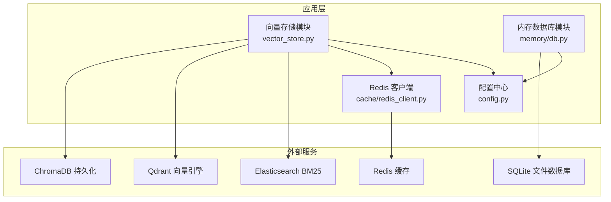
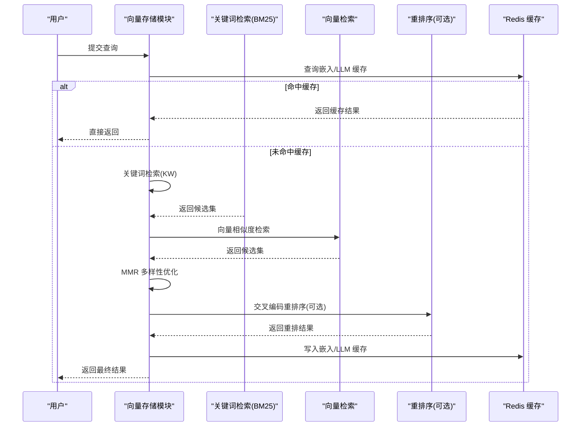
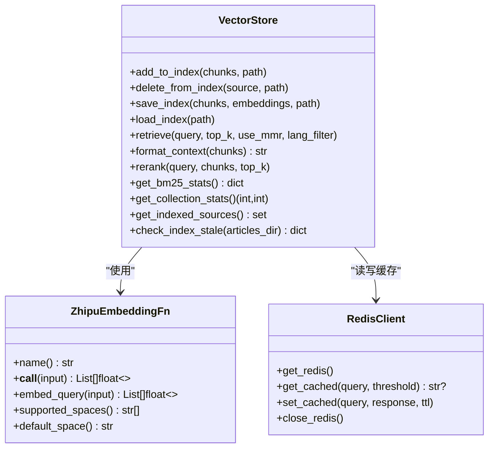
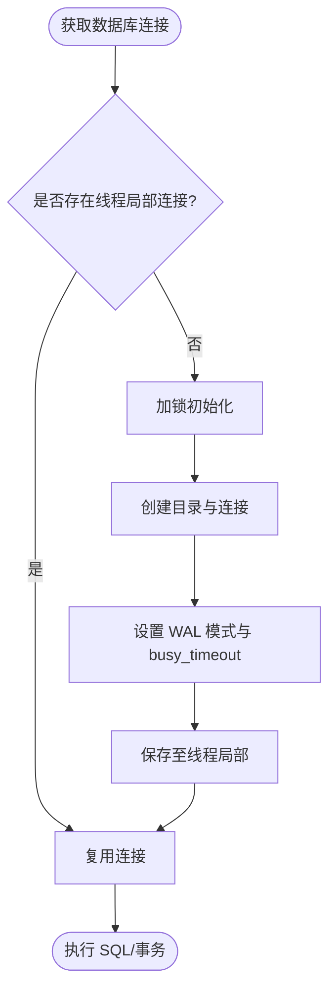
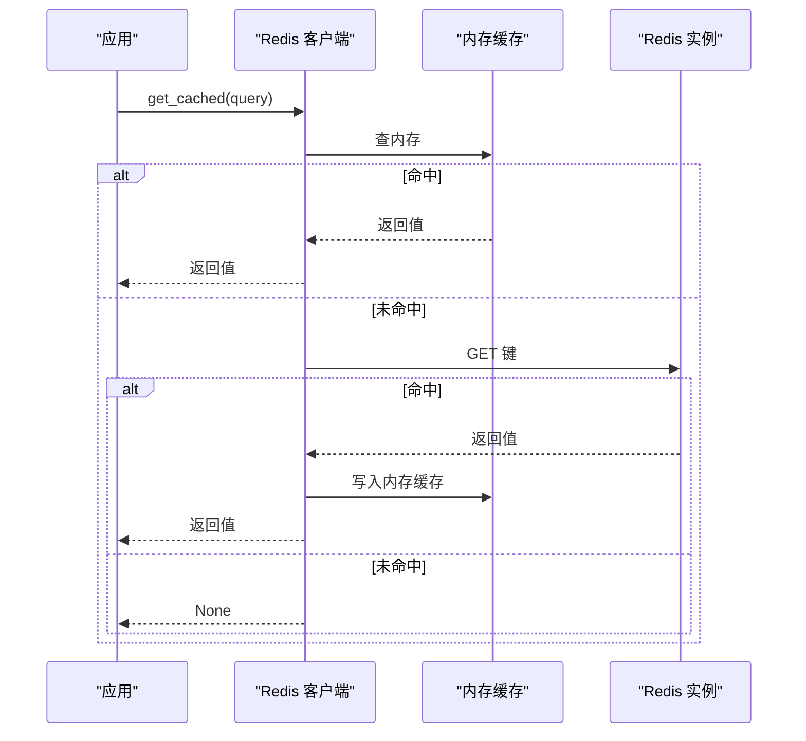
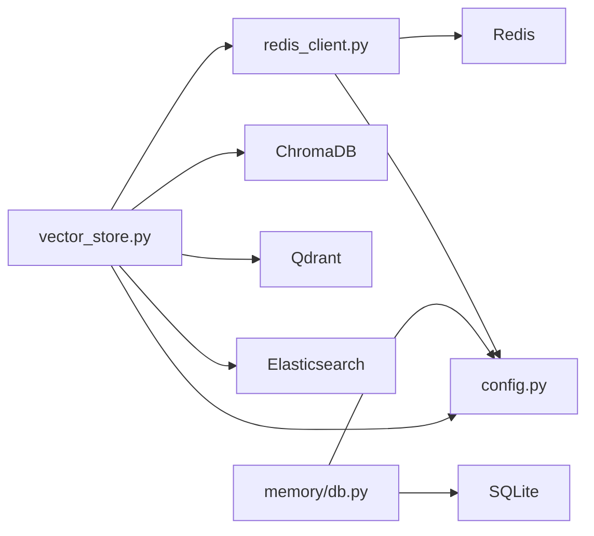

# 数据库与向量存储优化

<cite>
**本文引用的文件**
- [backend/app/rag/vector_store.py](file://backend/app/rag/vector_store.py)
- [backend/app/memory/db.py](file://backend/app/memory/db.py)
- [backend/app/cache/redis_client.py](file://backend/app/cache/redis_client.py)
- [backend/app/config.py](file://backend/app/config.py)
- [backend/tests/test_vector_store.py](file://backend/tests/test_vector_store.py)
</cite>

## 目录
1. [简介](#简介)
2. [项目结构](#项目结构)
3. [核心组件](#核心组件)
4. [架构总览](#架构总览)
5. [详细组件分析](#详细组件分析)
6. [依赖关系分析](#依赖关系分析)
7. [性能考量](#性能考量)
8. [故障排查指南](#故障排查指南)
9. [结论](#结论)
10. [附录](#附录)

## 简介
本文件面向 Aureon 系统的数据库与向量存储优化，聚焦以下目标：
- 向量数据库性能优化：索引类型选择、相似度计算优化、批量写入与查询性能提升
- 关系型数据库查询优化：SQL 查询优化、索引策略设计、查询计划分析
- 连接池与资源控制：连接数配置、超时设置、资源回收策略
- 向量存储调优：维度选择、存储格式、检索算法优化
- 监控与分析：慢查询日志、锁等待、内存使用跟踪
- 备份与高可用：备份恢复策略与高可用配置建议
- 测试与验证：性能测试工具使用与优化效果验证方法

## 项目结构
本项目的数据库与向量存储相关实现主要集中在后端 Python 代码中，涉及：
- 向量存储与检索：ChromaDB/Qdrant/Elasticsearch 的封装与多级检索流程
- 关系型数据库：SQLite 内存数据库用于对话记忆与原子事实存储
- 缓存层：Redis 异步客户端与内存降级缓存
- 配置中心：统一的 Settings 类管理嵌入模型、向量后端、BM25 后端、Redis 等参数

图表来源
- [backend/app/rag/vector_store.py](file://backend/app/rag/vector_store.py)
- [backend/app/memory/db.py](file://backend/app/memory/db.py)
- [backend/app/cache/redis_client.py](file://backend/app/cache/redis_client.py)
- [backend/app/config.py](file://backend/app/config.py)

章节来源
- [backend/app/rag/vector_store.py](file://backend/app/rag/vector_store.py)
- [backend/app/memory/db.py](file://backend/app/memory/db.py)
- [backend/app/cache/redis_client.py](file://backend/app/cache/redis_client.py)
- [backend/app/config.py](file://backend/app/config.py)

## 核心组件
- 向量存储与检索
  - ChromaDB 单例客户端与集合管理
  - 多提供商嵌入 API 调用与回退链路
  - 关键词检索（BM25）与增量索引构建
  - 向量相似度检索与 MMR 多样性优化
  - 交叉编码重排序（可选）
  - Qdrant/Elasticsearch 后端支持
- 关系型数据库
  - SQLite 文件数据库，WAL 模式与忙等待超时
  - 会话与原子事实表，按会话建立二级索引
- 缓存
  - Redis 异步客户端单例，失败自动重连
  - 内存降级缓存，带 TTL 与容量淘汰
- 配置中心
  - 统一加载 .env，提供 LLM/嵌入、向量后端、BM25 后端、Redis 等配置

章节来源
- [backend/app/rag/vector_store.py](file://backend/app/rag/vector_store.py)
- [backend/app/memory/db.py](file://backend/app/memory/db.py)
- [backend/app/cache/redis_client.py](file://backend/app/cache/redis_client.py)
- [backend/app/config.py](file://backend/app/config.py)

## 架构总览
Aureon 的检索流程采用“关键词检索 + 向量检索 + 可选重排序”的混合策略：
- 关键词检索（BM25）：无嵌入计算，查询延迟极低，适合快速过滤
- 向量检索：基于 ChromaDB/Qdrant，支持 Cosine/IP/L2 距离空间
- 多样性与重排序：MMR 候选多样性，交叉编码器重排序提升准确性
- 缓存：嵌入向量与 LLM 结果缓存，降低重复计算与外部 API 调用

图表来源
- [backend/app/rag/vector_store.py](file://backend/app/rag/vector_store.py)
- [backend/app/cache/redis_client.py](file://backend/app/cache/redis_client.py)

## 详细组件分析

### 向量存储与检索组件
- ChromaDB 单例与集合管理
  - 使用持久化客户端，按路径隔离存储
  - 集合创建时绑定自定义嵌入函数，支持多提供商回退
- 嵌入生成与缓存
  - 本地 BGE 模型优先；不可用则按 DashScope/SiliconFlow/Zhipu 顺序回退
  - 内存字典缓存 + Redis 缓存，带 FIFO 淘汰
  - 批量请求与指数退避重试，避免瞬时错误放大
- 关键词检索（BM25）
  - 文档预索引：一次性扫描集合，构建词项 IDF、平均文档长度
  - 查询时分词与英文增强（词干/大小写归一），按 BM25+ 计算打分
  - 最小原始分数阈值过滤噪声
- 向量检索与多样性
  - fetch_k 策略：MMR 开启时扩大候选规模再多样性筛选
  - 支持语言过滤与元数据透传
- 重排序
  - 交叉编码器（SentenceTransformers CrossEncoder）联合编码 query+doc
  - 可通过环境变量禁用，平衡准确度与延迟
- Qdrant/Elasticsearch 后端
  - Qdrant：COSINE 距离向量库，批量 upsert
  - Elasticsearch：标准分析器映射，多字段多级权重 BM25 检索

图表来源
- [backend/app/rag/vector_store.py](file://backend/app/rag/vector_store.py)
- [backend/app/cache/redis_client.py](file://backend/app/cache/redis_client.py)

章节来源
- [backend/app/rag/vector_store.py](file://backend/app/rag/vector_store.py)
- [backend/tests/test_vector_store.py](file://backend/tests/test_vector_store.py)

### 关系型数据库（SQLite）组件
- 连接管理
  - 线程局部连接，避免跨线程共享
  - WAL 模式支持并发读取；busy_timeout 处理写竞争
- 表结构与索引
  - 对话表：按 session_id 建立二级索引
  - 原子事实表：按 session_id 建立二级索引
- 初始化脚本
  - 创建表与索引，确保幂等初始化

图表来源
- [backend/app/memory/db.py](file://backend/app/memory/db.py)

章节来源
- [backend/app/memory/db.py](file://backend/app/memory/db.py)

### 缓存组件（Redis）
- 客户端单例
  - 异步 Redis 客户端，连接超时短配置，失败后定期重试
- 缓存策略
  - 版本化键前缀，保证逻辑失效
  - 先查内存缓存，再查 Redis，命中后回填内存
  - 内存缓存 TTL 与容量淘汰，避免无限增长
- 关闭流程
  - 应用关闭时主动释放连接

图表来源
- [backend/app/cache/redis_client.py](file://backend/app/cache/redis_client.py)

章节来源
- [backend/app/cache/redis_client.py](file://backend/app/cache/redis_client.py)

### 配置中心
- 关键配置项
  - LLM 与嵌入 API：主备密钥、基础地址、模型与维度
  - 向量后端：chroma/qdrant 切换
  - BM25 后端：memory/elasticsearch 切换
  - Redis 地址
  - 自动索引重建开关
- 模型注册表：统一管理不同模型的提供商与参数

章节来源
- [backend/app/config.py](file://backend/app/config.py)

## 依赖关系分析
- 向量存储模块依赖
  - ChromaDB/Qdrant/Elasticsearch 客户端
  - 嵌入 API（DashScope/SiliconFlow/Zhipu）
  - Redis 异步客户端
  - 分词工具（jieba）与中文停用词
- 数据库模块依赖
  - sqlite3 标准库
  - 线程局部存储
- 缓存模块依赖
  - redis.asyncio
  - 时间与哈希库

图表来源
- [backend/app/rag/vector_store.py](file://backend/app/rag/vector_store.py)
- [backend/app/memory/db.py](file://backend/app/memory/db.py)
- [backend/app/cache/redis_client.py](file://backend/app/cache/redis_client.py)
- [backend/app/config.py](file://backend/app/config.py)

章节来源
- [backend/app/rag/vector_store.py](file://backend/app/rag/vector_store.py)
- [backend/app/memory/db.py](file://backend/app/memory/db.py)
- [backend/app/cache/redis_client.py](file://backend/app/cache/redis_client.py)
- [backend/app/config.py](file://backend/app/config.py)

## 性能考量

### 向量数据库性能优化
- 索引类型与距离空间
  - ChromaDB 默认 COSINE 空间，适合余弦相似度；IP/L2 可根据场景切换
  - Qdrant 使用 COSINE 向量参数，批量 upsert 提升写入吞吐
- 相似度计算优化
  - 关键词检索（BM25）作为第一阶段过滤，显著减少向量检索候选规模
  - 向量检索 fetch_k 策略：MMR 开启时扩大候选，再按来源去重与分数填充
  - 交叉编码重排序仅在候选充足时启用，避免不必要的 CPU 开销
- 批量操作性能
  - 向量写入与关键词索引构建均采用批量处理（Chroma 批 20，Qdrant 批 100）
  - 嵌入 API 请求分批并带指数退避，提高成功率与稳定性
- 维度与存储格式
  - 本地 BGE 模型默认 1024 维；可通过环境变量跳过本地模型以适配 API 维度
  - 存储格式为浮点数组，dtype 为 float32，兼顾精度与内存占用
- 检索算法优化
  - BM25+ 参数（k1、b、δ）与英文词增强（≥3 字母词权重翻倍）提升相关性
  - 最小 IDF 与最小原始分数阈值过滤噪声词

章节来源
- [backend/app/rag/vector_store.py](file://backend/app/rag/vector_store.py)

### 关系型数据库查询优化
- 连接与模式
  - WAL 模式支持并发读取，降低读写冲突
  - busy_timeout 设置缓解写竞争导致的锁等待
- 索引策略
  - 会话级查询频繁，按 session_id 建立二级索引，加速过滤
- 查询计划分析
  - 使用 SQLite 的 EXPLAIN QUERY PLAN 分析常见查询（如按会话过滤）
  - 避免 SELECT *，仅选择必要列，减少 IO 与序列化开销

章节来源
- [backend/app/memory/db.py](file://backend/app/memory/db.py)

### 连接池与资源控制
- 向量存储
  - ChromaDB/Qdrant/Elasticsearch 客户端为进程内单例，避免重复握手
  - 嵌入 API 批处理与超时控制，防止阻塞与资源耗尽
- 缓存
  - Redis 连接超时短配置，失败后周期性重试，避免长时间阻塞
  - 内存缓存 TTL 与容量淘汰，防止内存泄漏
- 数据库
  - 线程局部连接避免跨线程共享，减少锁竞争
  - WAL 模式与 busy_timeout 平衡并发与一致性

章节来源
- [backend/app/rag/vector_store.py](file://backend/app/rag/vector_store.py)
- [backend/app/cache/redis_client.py](file://backend/app/cache/redis_client.py)
- [backend/app/memory/db.py](file://backend/app/memory/db.py)

### 监控与性能分析
- 慢查询日志
  - 向量检索与嵌入 API 调用记录耗时与错误，便于定位瓶颈
  - 关键词检索统计（文档数、词项数、平均文档长度）用于健康检查
- 锁等待与并发
  - SQLite busy_timeout 观测写竞争；必要时拆分写热点或引入只读副本
- 内存使用
  - 嵌入缓存与内存降级缓存均有限额与淘汰策略，需结合业务峰值评估容量

章节来源
- [backend/app/rag/vector_store.py](file://backend/app/rag/vector_store.py)
- [backend/app/cache/redis_client.py](file://backend/app/cache/redis_client.py)
- [backend/app/memory/db.py](file://backend/app/memory/db.py)

### 备份与高可用
- 向量存储
  - ChromaDB：持久化目录备份；集合删除/重建逻辑可用于灾难恢复
  - Qdrant/Elasticsearch：各自提供备份与快照能力，结合容器编排实现高可用
- 关系型数据库
  - SQLite 文件备份即可；生产环境建议 WAL 日志与定期快照
- 缓存
  - Redis 主从/哨兵或集群部署，配合自动故障转移

章节来源
- [backend/app/rag/vector_store.py](file://backend/app/rag/vector_store.py)
- [backend/app/memory/db.py](file://backend/app/memory/db.py)
- [backend/app/cache/redis_client.py](file://backend/app/cache/redis_client.py)

### 性能测试与验证
- 单元测试覆盖
  - 关键函数（分词、BM25 打分、多样性、上下文格式化、嵌入函数）均有单元测试
- 基准测试建议
  - 向量检索：不同 top_k、fetch_k、MMR 开关组合下的 P95 延迟
  - 关键词检索：不同查询长度与停用词过滤下的延迟
  - 嵌入缓存：命中率与缓存大小对延迟的影响
  - 数据库：按 session_id 过滤的查询延迟随数据量增长曲线
- 回归验证
  - 通过测试套件验证功能正确性与边界行为（空索引、零向量、维度不匹配）

章节来源
- [backend/tests/test_vector_store.py](file://backend/tests/test_vector_store.py)

## 故障排查指南
- 向量检索失败
  - 检查集合是否为空、维度是否与嵌入模型一致
  - 若出现维度不匹配，系统会自动切换到 API 嵌入并清空缓存
- 嵌入 API 失败
  - 检查密钥与基础地址配置；观察指数退避日志
  - 确认网络可达与证书有效
- 关键词检索无结果
  - 检查最小原始分数阈值与最小 IDF 阈值设置
  - 确认索引已构建且文档非空
- 缓存异常
  - Redis 不可用时自动降级内存缓存；检查内存缓存 TTL 与容量
- 数据库锁等待
  - 提升 busy_timeout 或拆分写热点；确认 WAL 模式生效

章节来源
- [backend/app/rag/vector_store.py](file://backend/app/rag/vector_store.py)
- [backend/app/cache/redis_client.py](file://backend/app/cache/redis_client.py)
- [backend/app/memory/db.py](file://backend/app/memory/db.py)

## 结论
Aureon 在数据库与向量存储方面采用了“关键词检索 + 向量检索 + 可选重排序”的混合架构，并通过缓存、批量处理与多提供商回退链路实现了较好的性能与可靠性。针对不同场景，建议：
- 优先使用关键词检索进行快速过滤，再进行向量检索与重排序
- 根据业务数据分布调整 BM25 参数与阈值
- 合理设置嵌入维度与缓存容量，平衡精度与延迟
- 通过单元测试与基准测试持续验证优化效果

## 附录
- 关键配置项参考
  - LLM/嵌入 API：主备密钥、基础地址、模型与维度
  - 向量后端：chroma/qdrant 切换
  - BM25 后端：memory/elasticsearch 切换
  - Redis 地址
  - 自动索引重建开关

章节来源
- [backend/app/config.py](file://backend/app/config.py)