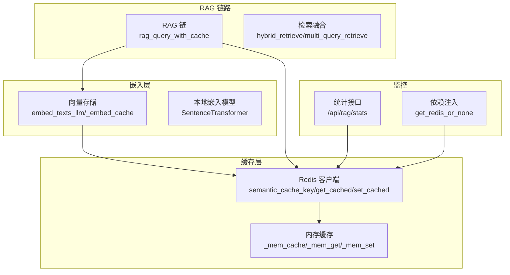
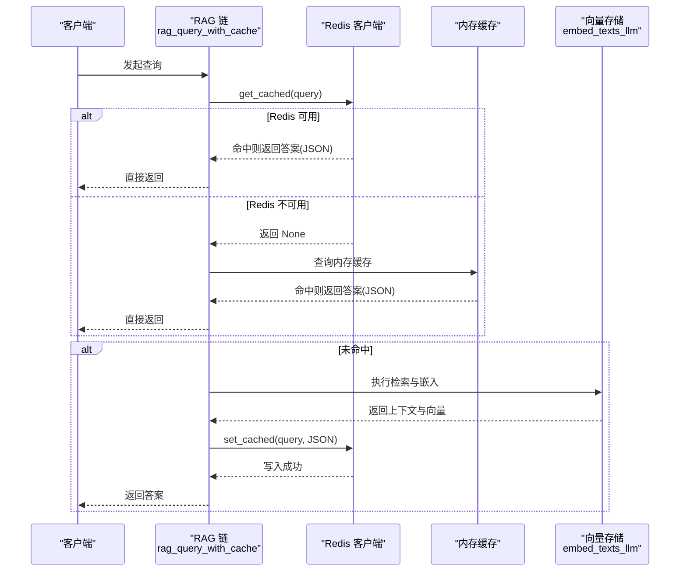
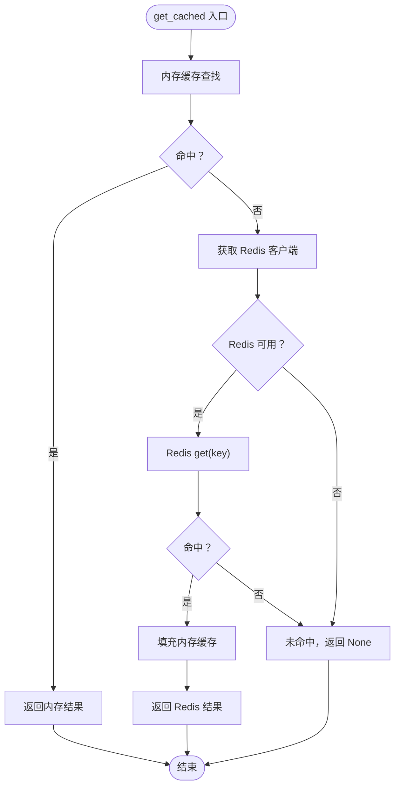
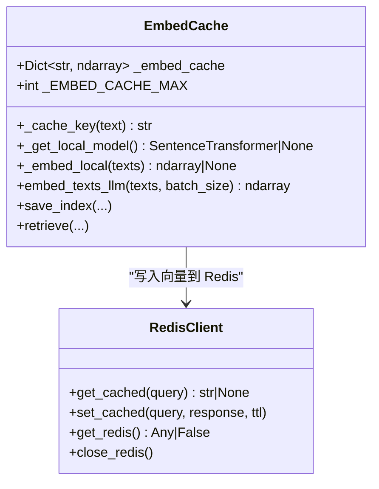
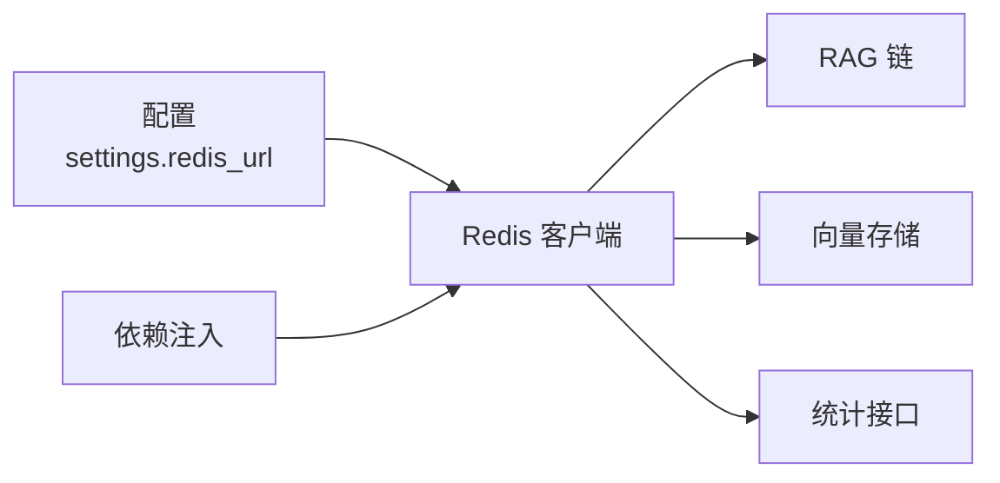

# 缓存优化策略

<cite>
**本文档引用的文件**
- [backend/app/cache/redis_client.py](file://backend/app/cache/redis_client.py)
- [backend/app/rag/vector_store.py](file://backend/app/rag/vector_store.py)
- [backend/app/rag/qa_chain.py](file://backend/app/rag/qa_chain.py)
- [backend/app/api/rag_stats.py](file://backend/app/api/rag_stats.py)
- [backend/app/config.py](file://backend/app/config.py)
- [backend/app/dependencies.py](file://backend/app/dependencies.py)
- [backend/tests/test_redis_cache.py](file://backend/tests/test_redis_cache.py)
- [backend/requirements.txt](file://backend/requirements.txt)
</cite>

## 目录
1. [简介](#简介)
2. [项目结构](#项目结构)
3. [核心组件](#核心组件)
4. [架构概览](#架构概览)
5. [详细组件分析](#详细组件分析)
6. [依赖关系分析](#依赖关系分析)
7. [性能考虑](#性能考虑)
8. [故障排查指南](#故障排查指南)
9. [结论](#结论)
10. [附录](#附录)

## 简介
本文件面向 Aureon 系统的缓存优化，系统采用多层缓存架构：Redis 语义缓存（LLM 响应）、内存缓存（降级与快速访问）、嵌入模型缓存（向量化向量）。文档围绕缓存命中率优化、缓存键设计、过期策略、缓存预热、一致性保证、配置优化、性能监控与故障处理等方面展开，并提供调试与性能测试方法。

## 项目结构
Aureon 后端采用模块化组织，缓存相关逻辑分布在以下模块：
- 缓存客户端：Redis 客户端与降级内存缓存
- 向量存储：嵌入缓存、本地模型懒加载、向量检索
- RAG 链路：语义缓存集成、检索融合、重排与生成
- 统计与监控：命中率统计、延迟聚合、查询量统计
- 配置与依赖：Redis 连接配置、依赖注入

**图表来源**
- [backend/app/cache/redis_client.py:100-161](file://backend/app/cache/redis_client.py#L100-L161)
- [backend/app/rag/vector_store.py:416-513](file://backend/app/rag/vector_store.py#L416-L513)
- [backend/app/rag/qa_chain.py:756-808](file://backend/app/rag/qa_chain.py#L756-L808)
- [backend/app/api/rag_stats.py:152-214](file://backend/app/api/rag_stats.py#L152-L214)
- [backend/app/dependencies.py:28-38](file://backend/app/dependencies.py#L28-L38)

**章节来源**
- [backend/app/cache/redis_client.py:1-161](file://backend/app/cache/redis_client.py#L1-L161)
- [backend/app/rag/vector_store.py:1-1118](file://backend/app/rag/vector_store.py#L1-L1118)
- [backend/app/rag/qa_chain.py:1-1072](file://backend/app/rag/qa_chain.py#L1-L1072)
- [backend/app/api/rag_stats.py:1-426](file://backend/app/api/rag_stats.py#L1-L426)
- [backend/app/dependencies.py:1-38](file://backend/app/dependencies.py#L1-L38)

## 核心组件
- Redis 语义缓存：基于查询规范化与 MD5 的确定性键，支持 TTL 控制与优雅降级
- 内存缓存：单机快速访问，容量限制与过期淘汰
- 嵌入模型缓存：按文本哈希的 FIFO 缓存，持久化至 Redis
- RAG 链路缓存：在完整 RAG 流程上增加语义缓存封装
- 统计与监控：命中率、延迟、查询量等指标采集与展示

**章节来源**
- [backend/app/cache/redis_client.py:100-161](file://backend/app/cache/redis_client.py#L100-L161)
- [backend/app/rag/vector_store.py:21-513](file://backend/app/rag/vector_store.py#L21-L513)
- [backend/app/rag/qa_chain.py:756-808](file://backend/app/rag/qa_chain.py#L756-L808)
- [backend/app/api/rag_stats.py:152-214](file://backend/app/api/rag_stats.py#L152-L214)

## 架构概览
多层缓存协同工作：RAG 请求先查内存缓存，再查 Redis；若均未命中，则执行检索与生成，随后写回两级缓存。嵌入向量同样遵循“内存优先、Redis 持久化”的策略，避免重复计算。

**图表来源**
- [backend/app/rag/qa_chain.py:756-808](file://backend/app/rag/qa_chain.py#L756-L808)
- [backend/app/cache/redis_client.py:106-145](file://backend/app/cache/redis_client.py#L106-L145)
- [backend/app/rag/vector_store.py:416-513](file://backend/app/rag/vector_store.py#L416-L513)

## 详细组件分析

### Redis 语义缓存
- 键设计：查询标准化（去空白、小写）后进行 MD5 哈希，前缀包含版本号，便于缓存失效与重建
- 访问顺序：内存缓存 → Redis → 未命中
- 写入策略：内存缓存必写；Redis 写入失败不抛出异常，保证降级可用
- 连接管理：延迟初始化、失败计数与重连阈值，支持运行时恢复
- 关闭流程：应用关闭时安全释放连接

**图表来源**
- [backend/app/cache/redis_client.py:106-128](file://backend/app/cache/redis_client.py#L106-L128)

**章节来源**
- [backend/app/cache/redis_client.py:100-161](file://backend/app/cache/redis_client.py#L100-L161)
- [backend/tests/test_redis_cache.py:76-146](file://backend/tests/test_redis_cache.py#L76-L146)

### 内存缓存（降级与快速访问）
- 结构：字典存储，键为“llm_cache:版本:MD5”
- TTL：统一 1 小时，与 Redis 保持一致
- 容量控制：超过上限时先清理过期项，再按过期时间淘汰最旧条目
- 作用：Redis 不可用时的快速通道，以及热点数据的低延迟访问

**章节来源**
- [backend/app/cache/redis_client.py:19-60](file://backend/app/cache/redis_client.py#L19-L60)

### 嵌入模型缓存（向量缓存）
- 缓存结构：按文本 MD5 作为键，值为向量数组
- 上限：最多 500 项，超过则按 FIFO 淘汰
- 写入路径：内存缓存命中即返回；未命中则调用本地模型或 API，得到结果后写入内存与 Redis
- Redis 持久化：向量序列化为二进制存储，TTL 7 天

**图表来源**
- [backend/app/rag/vector_store.py:21-513](file://backend/app/rag/vector_store.py#L21-L513)
- [backend/app/cache/redis_client.py:131-145](file://backend/app/cache/redis_client.py#L131-L145)

**章节来源**
- [backend/app/rag/vector_store.py:21-513](file://backend/app/rag/vector_store.py#L21-L513)

### RAG 链路缓存集成
- 包装函数：rag_query_with_cache 在完整 RAG 流程前后加入缓存读写
- 缓存键：与语义缓存一致，确保跨组件一致性
- 命中率统计：命中时自增命中计数，未命中时自增未命中计数
- 降级策略：Redis 不可用时仍可正常工作，仅丢失缓存能力

**章节来源**
- [backend/app/rag/qa_chain.py:756-808](file://backend/app/rag/qa_chain.py#L756-L808)

### 统计与监控
- 命中率：从 Redis 读取命中/未命中计数并计算比例
- 延迟：聚合最近查询的延迟，支持排序集合与列表回退
- 查询量：按小时聚合，支持日维度汇总
- 文档统计：从向量存储读取索引状态

**章节来源**
- [backend/app/api/rag_stats.py:152-214](file://backend/app/api/rag_stats.py#L152-L214)

## 依赖关系分析
- Redis 客户端：被 RAG 链路与嵌入模块共同依赖
- 配置模块：提供 Redis URL 等运行时参数
- 依赖注入：API 层通过依赖注入获取 Redis 客户端，支持强制可用与可选两种模式

**图表来源**
- [backend/app/config.py:41-41](file://backend/app/config.py#L41-L41)
- [backend/app/cache/redis_client.py:83-96](file://backend/app/cache/redis_client.py#L83-L96)
- [backend/app/dependencies.py:28-38](file://backend/app/dependencies.py#L28-L38)

**章节来源**
- [backend/app/config.py:1-90](file://backend/app/config.py#L1-L90)
- [backend/app/dependencies.py:1-38](file://backend/app/dependencies.py#L1-L38)
- [backend/requirements.txt:48-48](file://backend/requirements.txt#L48-L48)

## 性能考虑
- 命中率优化
  - 键设计：查询标准化 + MD5 哈希，避免大小写与空白差异导致的分散
  - 版本控制：通过版本号前缀实现缓存失效与重建，避免数据陈旧
  - 预热策略：启动时或空闲时段批量写入高频查询结果
- 过期策略
  - LLM 响应：默认 1 小时；嵌入向量：默认 7 天
  - 内存缓存：TTL 过期自动清理，容量超限时按过期时间淘汰
- 并发与连接
  - Redis 客户端延迟初始化，失败计数与重连阈值降低抖动
  - 统计接口使用流水线减少往返开销

**章节来源**
- [backend/app/cache/redis_client.py:24-25](file://backend/app/cache/redis_client.py#L24-L25)
- [backend/app/rag/vector_store.py:498-512](file://backend/app/rag/vector_store.py#L498-L512)
- [backend/app/api/rag_stats.py:92-126](file://backend/app/api/rag_stats.py#L92-L126)

## 故障排查指南
- Redis 不可用
  - 现象：get/set 缓存返回 None 或异常
  - 排查：检查环境变量 REDIS_URL、网络连通性、Redis 服务状态
  - 降级：内存缓存与向量缓存仍可工作，仅丢失持久化能力
- 命中率低
  - 检查键一致性：确认查询标准化逻辑一致
  - 检查版本号：变更检索逻辑后需提升版本号以失效旧缓存
  - 检查 TTL：确认过期时间是否过短
- 性能下降
  - 检查内存缓存容量：是否频繁触发淘汰
  - 检查嵌入缓存：是否因维度不匹配导致缓存清空
  - 检查统计接口：确认 Redis 可用且流水线执行正常

**章节来源**
- [backend/app/cache/redis_client.py:67-97](file://backend/app/cache/redis_client.py#L67-L97)
- [backend/app/rag/vector_store.py:704-706](file://backend/app/rag/vector_store.py#L704-L706)
- [backend/app/api/rag_stats.py:64-139](file://backend/app/api/rag_stats.py#L64-L139)

## 结论
Aureon 的多层缓存体系通过“内存优先、Redis 持久化、向量可重算”的设计，在保证稳定性的同时显著提升了响应速度与资源利用率。建议在生产环境中结合业务特征进行键设计与 TTL 调优，并建立缓存预热与监控告警机制，持续优化命中率与用户体验。

## 附录

### 缓存配置优化指南
- Redis 连接参数
  - 连接超时：socket_connect_timeout、socket_timeout
  - 重试阈值：失败计数与重连间隔
- 内存分配
  - 内存缓存上限：根据实例内存与 QPS 调整
  - 嵌入缓存上限：平衡内存占用与命中率
- 并发控制
  - 统计接口使用流水线，减少网络往返
  - 嵌入批处理大小：平衡吞吐与延迟

**章节来源**
- [backend/app/cache/redis_client.py:83-96](file://backend/app/cache/redis_client.py#L83-L96)
- [backend/app/rag/vector_store.py:462-492](file://backend/app/rag/vector_store.py#L462-L492)
- [backend/app/api/rag_stats.py:92-126](file://backend/app/api/rag_stats.py#L92-L126)

### 缓存性能监控方法
- 命中率统计：通过 /api/rag/stats 获取缓存命中/未命中计数
- 延迟分析：聚合最近查询延迟，定位慢查询
- 查询量趋势：按小时/日维度统计查询量变化
- 向量存储健康：索引文档与块数量、维度一致性检查

**章节来源**
- [backend/app/api/rag_stats.py:152-214](file://backend/app/api/rag_stats.py#L152-L214)
- [backend/app/rag/vector_store.py:856-877](file://backend/app/rag/vector_store.py#L856-L877)

### 缓存调试与测试
- 单元测试：覆盖内存缓存键生成、命中/未命中、过期与淘汰逻辑
- 集成测试：验证 Redis 不可用时的降级行为与统计回退
- 性能测试：模拟高并发场景下的命中率与延迟表现

**章节来源**
- [backend/tests/test_redis_cache.py:1-193](file://backend/tests/test_redis_cache.py#L1-L193)