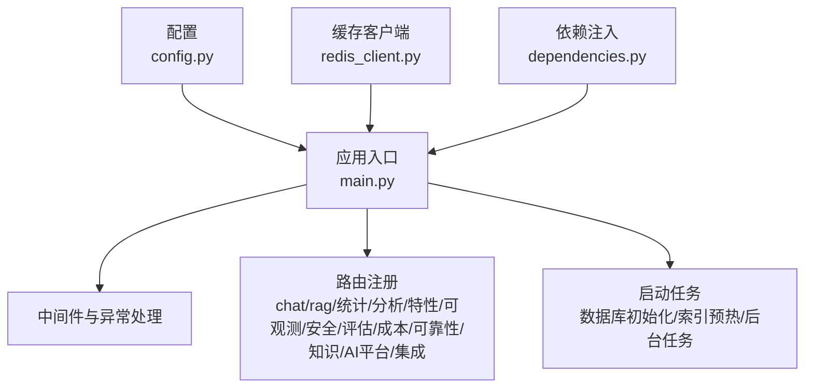
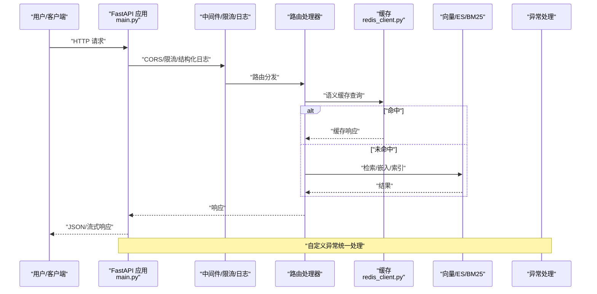
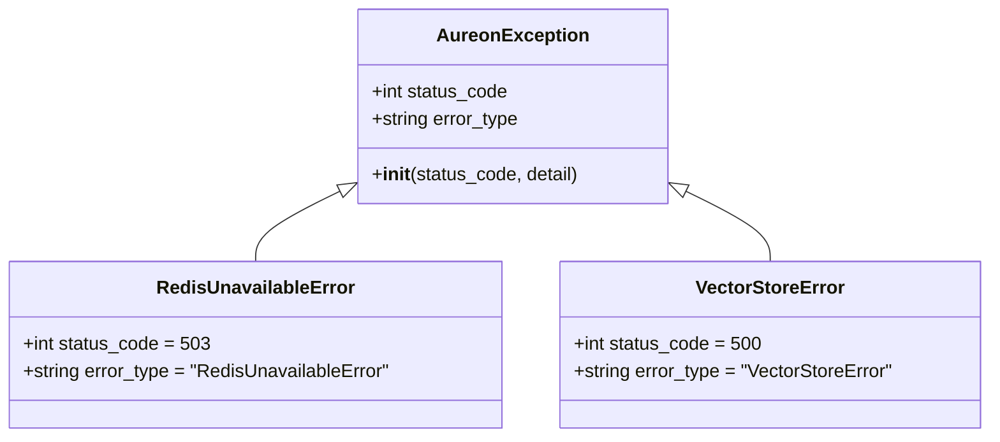
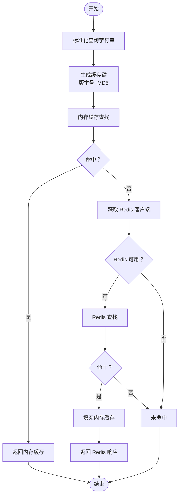
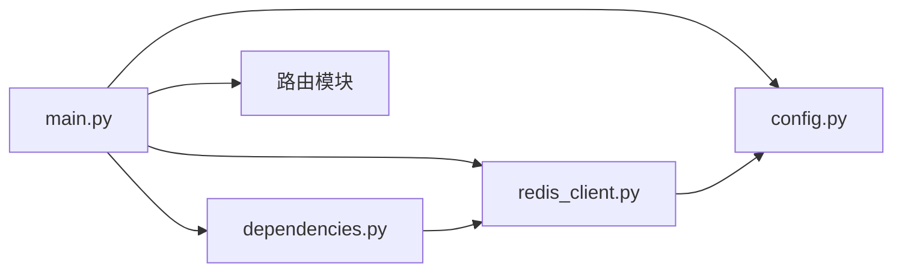

# 故障排除与常见问题

<cite>
**本文引用的文件**
- [backend/app/main.py](file://backend/app/main.py)
- [backend/app/exceptions.py](file://backend/app/exceptions.py)
- [backend/app/config.py](file://backend/app/config.py)
- [backend/app/cache/redis_client.py](file://backend/app/cache/redis_client.py)
- [backend/app/dependencies.py](file://backend/app/dependencies.py)
- [backend/Dockerfile](file://backend/Dockerfile)
- [docker-compose.yml](file://docker-compose.yml)
- [nginx.conf](file://nginx.conf)
- [backend/tests/test_api.py](file://backend/tests/test_api.py)
- [backend/tests/test_redis_cache.py](file://backend/tests/test_redis_cache.py)
- [backend/tests/test_main.py](file://backend/tests/test_main.py)
- [backend/tests/test_dependencies.py](file://backend/tests/test_dependencies.py)
- [backend/tests/test_memory.py](file://backend/tests/test_memory.py)
- [backend/tests/test_langgraph.py](file://backend/tests/test_langgraph.py)
- [backend/tests/test_langgraph_graph.py](file://backend/tests/test_langgraph_graph.py)
- [backend/tests/test_loader.py](file://backend/tests/test_loader.py)
- [backend/tests/test_vector_store.py](file://backend/tests/test_vector_store.py)
- [backend/tests/test_rag_router.py](file://backend/tests/test_rag_router.py)
- [backend/tests/test_crew_health.py](file://backend/tests/test_crew_health.py)
- [backend/tests/test_crew_generate.py](file://backend/tests/test_crew_generate.py)
- [backend/tests/test_crew_generate_stream.py](file://backend/tests/test_crew_generate_stream.py)
- [backend/tests/test_observability.py](file://backend/tests/test_observability.py)
- [backend/tests/test_security.py](file://backend/tests/test_security.py)
- [backend/tests/test_integration.py](file://backend/tests/test_integration.py)
- [backend/tests/test_evaluation.py](file://backend/tests/test_evaluation.py)
- [backend/tests/test_cost.py](file://backend/tests/test_cost.py)
- [backend/tests/test_reliability.py](file://backend/tests/test_reliability.py)
- [backend/tests/test_knowledge.py](file://backend/tests/test_knowledge.py)
- [backend/tests/test_ai_platform.py](file://backend/tests/test_ai_platform.py)
- [backend/tests/test_features.py](file://backend/tests/test_features.py)
- [backend/tests/test_analytics.py](file://backend/tests/test_analytics.py)
- [backend/tests/test_guardrails.py](file://backend/tests/test_guardrails.py)
- [backend/tests/test_input_validation.py](file://backend/tests/test_input_validation.py)
- [backend/tests/test_exceptions.py](file://backend/tests/test_exceptions.py)
- [backend/tests/test_streaming_workflow.py](file://backend/tests/test_streaming_workflow.py)
- [backend/tests/test_tools.py](file://backend/tests/test_tools.py)
- [backend/tests/test_lang_detect.py](file://backend/tests/test_lang_detect.py)
- [backend/tests/test_memory_extended.py](file://backend/tests/test_memory_extended.py)
- [backend/tests/test_multi_query_retrieve.py](file://backend/tests/test_multi_query_retrieve.py)
- [backend/tests/test_qa_chain.py](file://backend/tests/test_qa_chain.py)
- [backend/tests/test_query_rewriter.py](file://backend/tests/test_query_rewriter.py)
- [backend/tests/test_rag_stats_router.py](file://backend/tests/test_rag_stats_router.py)
- [backend/tests/test_rag_stats_extended.py](file://backend/tests/test_rag_stats_extended.py)
- [backend/tests/test_rag_quality.py](file://backend/tests/test_rag_quality.py)
- [backend/tests/test_prompt_experiment.py](file://backend/tests/test_prompt_experiment.py)
- [backend/tests/test_evaluator.py](file://backend/tests/test_evaluator.py)
- [backend/tests/test_eval_report.md](file://backend/tests/eval_report.md)
- [backend/tests/eval_runner.py](file://backend/tests/eval_runner.py)
- [backend/tests/benchmark_rag.py](file://backend/tests/benchmark_rag.py)
- [backend/tests/benchmark_rag_full.py](file://backend/tests/benchmark_rag_full.py)
- [backend/tests/benchmark_e2e.py](file://backend/tests/benchmark_e2e.py)
- [backend/tests/run_benchmark.py](file://backend/tests/run_benchmark.py)
- [backend/tests/test_agent_flow.py](file://backend/tests/test_agent_flow.py)
- [backend/tests/test_manager.py](file://backend/tests/test_manager.py)
- [backend/tests/test_memory.py](file://backend/tests/test_memory.py)
- [backend/tests/test_memory_extended.py](file://backend/tests/test_memory_extended.py)
- [backend/tests/test_multi_query_retrieve.py](file://backend/tests/test_multi_query_retrieve.py)
- [backend/tests/test_qa_chain.py](file://backend/tests/test_qa_chain.py)
- [backend/tests/test_query_rewriter.py](file://backend/tests/test_query_rewriter.py)
- [backend/tests/test_rag_stats_router.py](file://backend/tests/test_rag_stats_router.py)
- [backend/tests/test_rag_stats_extended.py](file://backend/tests/test_rag_stats_extended.py)
- [backend/tests/test_rag_quality.py](file://backend/tests/test_rag_quality.py)
- [backend/tests/test_prompt_experiment.py](file://backend/tests/test_prompt_experiment.py)
- [backend/tests/test_evaluator.py](file://backend/tests/test_evaluator.py)
- [backend/tests/eval_report.md](file://backend/tests/eval_report.md)
- [backend/tests/eval_runner.py](file://backend/tests/eval_runner.py)
- [backend/tests/benchmark_rag.py](file://backend/tests/benchmark_rag.py)
- [backend/tests/benchmark_rag_full.py](file://backend/tests/benchmark_rag_full.py)
- [backend/tests/benchmark_e2e.py](file://backend/tests/benchmark_e2e.py)
- [backend/tests/run_benchmark.py](file://backend/tests/run_benchmark.py)
- [backend/tests/test_agent_flow.py](file://backend/tests/test_agent_flow.py)
- [backend/tests/test_manager.py](file://backend/tests/test_manager.py)
- [backend/tests/test_memory.py](file://backend/tests/test_memory.py)
- [backend/tests/test_memory_extended.py](file://backend/tests/test_memory_extended.py)
- [backend/tests/test_multi_query_retrieve.py](file://backend/tests/test_multi_query_retrieve.py)
- [backend/tests/test_qa_chain.py](file://backend/tests/test_qa_chain.py)
- [backend/tests/test_query_rewriter.py](file://backend/tests/test_query_rewriter.py)
- [backend/tests/test_rag_stats_router.py](file://backend/tests/test_rag_stats_router.py)
- [backend/tests/test_rag_stats_extended.py](file://backend/tests/test_rag_stats_extended.py)
- [backend/tests/test_rag_quality.py](file://backend/tests/test_rag_quality.py)
- [backend/tests/test_prompt_experiment.py](file://backend/tests/test_prompt_experiment.py)
- [backend/tests/test_evaluator.py](file://backend/tests/test_evaluator.py)
- [backend/tests/eval_report.md](file://backend/tests/eval_report.md)
- [backend/tests/eval_runner.py](file://backend/tests/eval_runner.py)
- [backend/tests/benchmark_rag.py](file://backend/tests/benchmark_rag.py)
- [backend/tests/benchmark_rag_full.py](file://backend/tests/benchmark_rag_full.py)
- [backend/tests/benchmark_e2e.py](file://backend/tests/benchmark_e2e.py)
- [backend/tests/run_benchmark.py](file://backend/tests/run_benchmark.py)
- [backend/tests/test_agent_flow.py](file://backend/tests/test_agent_flow.py)
- [backend/tests/test_manager.py](file://backend/tests/test_manager.py)
- [backend/tests/test_memory.py](file://backend/tests/test_memory.py)
- [backend/tests/test_memory_extended.py](file://backend/tests/test_memory_extended.py)
- [backend/tests/test_multi_query_retrieve.py](file://backend/tests/test_multi_query_retrieve.py)
- [backend/tests/test_qa_chain.py](file://backend/tests/test_qa_chain.py)
- [backend/tests/test_query_rewriter.py](file://backend/tests/test_query_rewriter.py)
- [backend/tests/test_rag_stats_router.py](file://backend/tests/test_rag_stats_router.py)
- [backend/tests/test_rag_stats_extended.py](file://backend/tests/test_rag_stats_extended.py)
- [backend/tests/test_rag_quality.py](file://backend/tests/test_rag_quality.py)
- [backend/tests/test_prompt_experiment.py](file://backend/tests/test_prompt_experiment.py)
- [backend/tests/test_evaluator.py](file://backend/tests/test_evaluator.py)
- [backend/tests/eval_report.md](file://backend/tests/eval_report.md)
- [backend/tests/eval_runner.py](file://backend/tests/eval_runner.py)
- [backend/tests/benchmark_rag.py](file://backend/tests/benchmark_rag.py)
- [backend/tests/benchmark_rag_full.py](file://backend/tests/benchmark_rag_full.py)
- [backend/tests/benchmark_e2e.py](file://backend/tests/benchmark_e2e.py)
- [backend/tests/run_benchmark.py](file://backend/tests/run_benchmark.py)
- [backend/tests/test_agent_flow.py](file://backend/tests/test_agent_flow.py)
- [backend/tests/test_manager.py](file://backend/tests/test_manager.py)
- [backend/tests/test_memory.py](file://backend/tests/test_memory.py)
- [backend/tests/test_memory_extended.py](file://backend/tests/test_memory_extended.py)
- [backend/tests/test_multi_query_retrieve.py](file://backend/tests/test_multi_query_retrieve.py)
- [backend/tests/test_qa_chain.py](file://backend/tests/test_qa_chain.py)
- [backend/tests/test_query_rewriter.py](file://backend/tests/test_query_rewriter.py)
- [backend/tests/test_rag_stats_router.py](file://backend/tests/test_rag_stats_router.py)
- [backend/tests/test_rag_stats_extended.py](file://backend/tests/test_rag_stats_extended.py)
- [backend/tests/test_rag_quality.py](file://backend/tests/test_rag_quality.py)
- [backend/tests/test_prompt_experiment.py](file://backend/tests/test_prompt_experiment.py)
- [backend/tests/test_evaluator.py](file://backend/tests/test_evaluator.py)
- [backend/tests/eval_report.md](file://backend/tests/eval_report.md)
- [backend/tests/eval_runner.py](file://backend/tests/eval_runner.py)
- [backend/tests/benchmark_rag.py](file://backend/tests/benchmark_rag.py)
- [backend/tests/benchmark_rag_full.py](file://backend/tests/benchmark_rag_full.py)
- [backend/tests/benchmark_e2e.py](file://backend/tests/benchmark_e2e.py)
- [backend/tests/run_benchmark.py](file://backend/tests/run_benchmark.py)
- [backend/tests/test_agent_flow.py](file://backend/tests/test_agent_flow.py)
- [backend/tests/test_manager.py](file://backend/tests/test_manager.py)
- [backend/tests/test_memory.py](file://backend/tests/test_memory.py)
- [backend/tests/test_memory_extended.py](file://backend/tests/test_memory_extended.py)
- [backend/tests/test_multi_query_retrieve.py](file://backend/tests/test_multi_query_retrieve.py)
- [backend/tests/test_qa_chain.py](file://backend/tests/test_qa_chain.py)
- [backend/tests/test_query_rewriter.py](file://backend/tests/test_query_rewriter.py)
- [backend/tests/test_rag_stats_router.py](file://backend/tests/test_rag_stats_router.py)
- [backend/tests/test_rag_stats_extended.py](file://backend/tests/test_rag_stats_extended.py)
- [backend/tests/test_rag_quality.py](file://backend/tests/test_rag_quality.py)
- [backend/tests/test_prompt_experiment.py](file://backend/tests/test_prompt_experiment.py)
- [backend/tests/test_evaluator.py](file://backend/tests/test_evaluator.py)
- [backend/tests/eval_report.md](file://backend/tests/eval_report.md)
- [backend/tests/eval_runner.py](file://backend/tests/eval_runner.py)
- [backend/tests/benchmark_rag.py](file://backend/tests/benchmark_rag.py)
- [backend/tests/benchmark_rag_full.py](file://backend/tests/benchmark_rag_full.py)
- [backend/tests/benchmark_e2e.py](file://backend/tests/benchmark_e2e.py)
- [backend/tests/run_benchmark.py](file://backend/tests/run_benchmark.py)
- [backend/tests/test_agent_flow.py](file://backend/tests/test_agent_flow.py)
- [backend/tests/test_manager.py](file://backend/tests/test_manager.py)
- [backend/tests/test_memory.py](file://backend/tests/test_memory.py)
- [backend/tests/test_memory_extended.py](file://backend/tests/test_memory_extended.py)
- [backend/tests/test_multi_query_retrieve.py](file://backend/tests/test_multi_query_retrieve.py)
- [backend/tests/test_qa_chain.py](file://backend/tests/test_qa_chain.py)
- [backend/tests/test_query_rewriter.py](file://backend/tests/test_query_rewriter.py)
- [backend/tests/test_rag_stats_router.py](file://backend/tests/test_rag_stats_router.py)
- [backend/tests/test_rag_stats_extended.py](file://backend/tests/test_rag_stats_extended.py)
- [backend/tests/test_rag_quality.py](file://backend/tests/test_rag_quality.py)
- [backend/tests/test_prompt_experiment.py](file://backend/tests/test_prompt_experiment.py)
- [backend/tests/test_evaluator.py](file://backend/tests/test_evaluator.py)
- [backend/tests/eval_report.md](file://backend/tests/eval_report.md)
- [backend/tests/eval_runner.py](file://backend/tests/eval_runner.py)
- [backend/tests/benchmark_rag.py](file://backend/tests/benchmark_rag.py)
- [backend......]
</cite>

## 目录
1. [简介](#简介)
2. [项目结构](#项目结构)
3. [核心组件](#核心组件)
4. [架构总览](#架构总览)
5. [详细组件分析](#详细组件分析)
6. [依赖关系分析](#依赖关系分析)
7. [性能考虑](#性能考虑)
8. [故障排除指南](#故障排除指南)
9. [结论](#结论)
10. [附录](#附录)

## 简介
本文件面向 Aureon 系统的开发者与运维人员，提供从开发到生产部署的完整故障排除与常见问题手册。内容覆盖错误代码与异常处理、日志分析方法、调试技巧、性能诊断（内存泄漏、CPU 占用、数据库/缓存连接）、网络与 API 失败、认证与授权问题、Docker 容器与依赖冲突、配置错误、监控指标异常、缓存失效与数据不一致等场景，并给出自助排障步骤与预防性维护建议。

## 项目结构
后端采用 FastAPI 构建，模块化组织如下：
- 应用入口与中间件：应用初始化、CORS、限流、Prometheus 指标暴露、结构化日志、请求追踪、启动/关闭事件
- 功能路由：聊天、RAG、统计、分析、特性开关、可观测性、安全、评估、成本、可靠性、知识库、AI 平台、集成等
- 缓存与依赖：Redis 客户端与降级策略、依赖注入工具
- 配置：集中式 Settings，支持多模型提供商与向量存储后端切换
- 测试：覆盖 API、缓存、索引、LangGraph 工作流、RAG 管线、工具与语言检测等

图表来源
- [backend/app/main.py:68-371](file://backend/app/main.py#L68-L371)
- [backend/app/config.py:4-90](file://backend/app/config.py#L4-L90)
- [backend/app/cache/redis_client.py:1-161](file://backend/app/cache/redis_client.py#L1-L161)
- [backend/app/dependencies.py:1-38](file://backend/app/dependencies.py#L1-L38)

章节来源
- [backend/app/main.py:68-371](file://backend/app/main.py#L68-L371)
- [backend/app/config.py:4-90](file://backend/app/config.py#L4-L90)

## 核心组件
- 应用与中间件
  - 结构化日志：基于 structlog，支持控制台与 JSON 输出，便于容器与日志聚合系统解析
  - CORS 中间件：可配置允许来源
  - 限流中间件：基于 slowapi，按 IP 限速
  - Prometheus 指标：自动暴露 /metrics
  - 请求追踪：注入 request_id，记录耗时与状态码
  - 自定义异常：统一返回 JSON，包含 error_type 与 detail
- 缓存与降级
  - Redis 语义缓存：精确查询匹配；Redis 不可用时回退至内存缓存（带 TTL 与容量淘汰）
  - 连接重试：失败计数达到阈值后重试，适配部署后动态注入 REDIS_URL 的场景
- 配置中心
  - LLM 主/备 API 密钥、基础 URL、模型名
  - 向量存储后端（Chroma/Qdrant）与 ES BM25 配置
  - Redis、Elasticsearch、DashScope、SiliconFlow 等多提供商配置
- 启动任务
  - 数据库表初始化
  - BM25 预热与向量索引自检/重建（空库时通过 API 嵌入）

章节来源
- [backend/app/main.py:48-125](file://backend/app/main.py#L48-L125)
- [backend/app/main.py:171-205](file://backend/app/main.py#L171-L205)
- [backend/app/cache/redis_client.py:67-97](file://backend/app/cache/redis_client.py#L67-L97)
- [backend/app/cache/redis_client.py:106-145](file://backend/app/cache/redis_client.py#L106-L145)
- [backend/app/config.py:4-90](file://backend/app/config.py#L4-L90)

## 架构总览
下图展示请求从客户端到各子系统的典型路径，以及关键异常与降级点：

图表来源
- [backend/app/main.py:88-125](file://backend/app/main.py#L88-L125)
- [backend/app/cache/redis_client.py:106-128](file://backend/app/cache/redis_client.py#L106-L128)

## 详细组件分析

### 异常与错误处理
- 自定义异常基类与子类：统一错误类型与状态码，确保前端可识别
- 全局异常处理器：返回结构化 JSON，包含 error_type 与 detail
- 速率限制异常：统一处理 429

图表来源
- [backend/app/exceptions.py:12-41](file://backend/app/exceptions.py#L12-L41)

章节来源
- [backend/app/exceptions.py:12-41](file://backend/app/exceptions.py#L12-L41)
- [backend/app/main.py:88-97](file://backend/app/main.py#L88-L97)

### 缓存与降级（Redis 语义缓存）
- 查询键生成：标准化查询 + 版本号 + MD5，保证精确匹配
- 双层缓存：内存优先，Redis 次之；Redis 不可用时透明降级
- TTL 与容量管理：内存缓存带过期与淘汰策略
- 连接重试：失败计数达到阈值后重试，避免应用启动后才注入 REDIS_URL 的情况

图表来源
- [backend/app/cache/redis_client.py:100-128](file://backend/app/cache/redis_client.py#L100-L128)
- [backend/app/cache/redis_client.py:67-97](file://backend/app/cache/redis_client.py#L67-L97)

章节来源
- [backend/app/cache/redis_client.py:100-145](file://backend/app/cache/redis_client.py#L100-L145)
- [backend/app/dependencies.py:14-37](file://backend/app/dependencies.py#L14-L37)

### 配置与多提供商
- LLM 主/备密钥与基础 URL，支持多模型注册表
- 向量存储后端可选 Chroma 或 Qdrant，ES BM25 作为 BM25 后端
- 多嵌入提供商链路：本地 BGE → DashScope → SiliconFlow → Zhipu
- Elasticsearch、DashScope、SiliconFlow、Redis、Qdrant 等外部服务配置项

章节来源
- [backend/app/config.py:4-90](file://backend/app/config.py#L4-L90)

### 启动与后台任务
- 启动阶段：校验 LLM API Key，设置 LangChain 环境变量，初始化各类表，启动内存管理后台任务
- 索引预热：构建 BM25 索引；若向量库为空且存在文章目录，则通过 API 嵌入自动重建，避免本地模型导致 OOM
- 关闭阶段：刷写所有场景、关闭 Redis

章节来源
- [backend/app/main.py:171-205](file://backend/app/main.py#L171-L205)
- [backend/app/main.py:127-165](file://backend/app/main.py#L127-L165)
- [backend/app/main.py:207-211](file://backend/app/main.py#L207-L211)

## 依赖关系分析
- 组件耦合
  - main.py 作为中枢，依赖配置、缓存、路由模块
  - 缓存模块对配置敏感（REDIS_URL），并提供降级能力
  - 依赖注入模块为路由提供 Redis 可用性保障
- 外部依赖
  - LLM 提供商（DeepSeek、Zhipu、OpenAI、Anthropic）
  - 向量存储（Chroma、Qdrant）
  - 缓存（Redis）
  - 搜索（Elasticsearch BM25）
  - 日志与指标（structlog、Prometheus）

图表来源
- [backend/app/main.py:41-42](file://backend/app/main.py#L41-L42)
- [backend/app/cache/redis_client.py:84-89](file://backend/app/cache/redis_client.py#L84-L89)
- [backend/app/dependencies.py:11](file://backend/app/dependencies.py#L11-L11)

章节来源
- [backend/app/main.py:41-42](file://backend/app/main.py#L41-L42)
- [backend/app/cache/redis_client.py:84-89](file://backend/app/cache/redis_client.py#L84-L89)
- [backend/app/dependencies.py:11](file://backend/app/dependencies.py#L11-L11)

## 性能考虑
- 内存与 CPU
  - 启动时避免加载本地大模型，通过 API 嵌入重建索引，降低 OOM 风险
  - 语义缓存命中优先使用内存缓存，减少 Redis 访问开销
  - 限流中间件防止突发流量导致资源争用
- 缓存与存储
  - Redis TTL 与内存缓存淘汰策略平衡命中率与内存占用
  - 向量索引与 BM25 预热，减少首次请求延迟
- 指标与可观测
  - /metrics 暴露请求耗时、速率、错误率等指标，结合日志进行根因分析

章节来源
- [backend/app/main.py:127-165](file://backend/app/main.py#L127-L165)
- [backend/app/cache/redis_client.py:106-145](file://backend/app/cache/redis_client.py#L106-L145)
- [backend/app/main.py:80-81](file://backend/app/main.py#L80-L81)

## 故障排除指南

### 一、错误代码与异常含义
- 503 Redis 不可用
  - 触发条件：Redis 不可用或连接失败超过阈值
  - 解决步骤：检查 REDIS_URL、网络连通性、Redis 服务状态；确认应用已重启以触发重试
- 500 向量存储错误
  - 触发条件：Chroma/Qdrant/Elasticsearch 操作失败
  - 解决步骤：检查对应服务地址与凭据；查看日志中的具体错误；必要时重建索引
- 429 速率限制
  - 触发条件：超出 slowapi 限速阈值
  - 解决步骤：降低请求频率或调整限流配置；区分不同路由的限速策略

章节来源
- [backend/app/exceptions.py:25-41](file://backend/app/exceptions.py#L25-L41)
- [backend/app/main.py:88-97](file://backend/app/main.py#L88-L97)

### 二、日志分析方法与调试技巧
- 日志级别与输出格式
  - INFO 级别记录请求完成信息（方法、路径、状态码、耗时）
  - 控制台环境使用 ConsoleRenderer，非交互环境使用 JSONRenderer，便于日志收集系统解析
- 关键字段
  - request_id：用于跨服务关联请求链路
  - elapsed_ms：接口耗时，定位慢请求
- 调试技巧
  - 在本地启用控制台渲染，快速定位问题
  - 使用 /metrics 观察错误率与延迟分布
  - 对于 CrewAI 生成接口，关注错误日志中的“CrewAI not installed”提示，确认依赖安装

章节来源
- [backend/app/main.py:48-63](file://backend/app/main.py#L48-L63)
- [backend/app/main.py:100-124](file://backend/app/main.py#L100-L124)

### 三、性能问题诊断流程
- 内存泄漏
  - 现象：RSS 持续增长、GC 不生效
  - 排查：检查长生命周期对象（会话、缓存条目）是否正确释放；确认关闭钩子调用
  - 关联点：应用关闭时 flush_all_scenarios 与 close_redis
- CPU 占用过高
  - 现象：CPU 使用率飙升
  - 排查：结合 /metrics 查看慢请求；检查向量检索与嵌入调用是否阻塞；确认限流是否生效
- 数据库/缓存连接问题
  - 现象：连接超时、拒绝、抖动
  - 排查：检查 REDIS_URL、网络连通性；确认连接超时参数；观察重试逻辑是否触发

章节来源
- [backend/app/main.py:207-211](file://backend/app/main.py#L207-L211)
- [backend/app/cache/redis_client.py:67-97](file://backend/app/cache/redis_client.py#L67-L97)

### 四、网络连接问题与 API 调用失败
- LLM 提供商不可达
  - 现象：代理/鉴权/超时错误
  - 排查：核对主/备 API Key、Base URL；检查网络策略与代理；启用备用提供商
- 向量存储不可达
  - 现象：Chroma/Qdrant/ES 返回错误
  - 排查：核对地址与凭据；确认服务运行状态；必要时切换后端
- 缓存不可用
  - 现象：Redis 不可用导致降级
  - 排查：检查 REDIS_URL；确认网络连通；等待重试阈值后自动恢复

章节来源
- [backend/app/config.py:7-36](file://backend/app/config.py#L7-L36)
- [backend/app/cache/redis_client.py:82-96](file://backend/app/cache/redis_client.py#L82-L96)

### 五、认证与授权错误
- LLM API Key 缺失
  - 现象：Agent 调用失败警告
  - 排查：检查 .env 中 LLM_API_KEY 与 FALLBACK_API_KEY；确认环境变量加载
- LangChain 集成
  - 现象：LangSmith 相关错误
  - 排查：核对 LANGCHAIN_API_KEY、PROJECT、ENDPOINT；确认网络可达

章节来源
- [backend/app/main.py:171-179](file://backend/app/main.py#L171-L179)
- [backend/app/config.py:51-53](file://backend/app/config.py#L51-L53)

### 六、Docker 容器问题
- 容器无法启动
  - 现象：启动报错或立即退出
  - 排查：查看容器日志；确认 .env 文件挂载；核对端口映射与网络
- 服务间通信失败
  - 现象：应用无法访问 Redis/ES/Qdrant
  - 排查：确认 docker-compose 服务名称与网络；核对服务端口与防火墙
- 静态资源未加载
  - 现象：SPA 页面 404
  - 排查：确认静态目录存在；检查 mount 路径与权限

章节来源
- [backend/app/main.py:364-371](file://backend/app/main.py#L364-L371)
- [docker-compose.yml](file://docker-compose.yml)

### 七、依赖冲突与配置错误
- CrewAI 未安装
  - 现象：生成接口返回 503，SSE 流中包含错误消息
  - 排查：安装 CrewAI 依赖；确认 OPENAI_* 环境变量已设置
- 环境变量缺失
  - 现象：启动警告或功能降级
  - 排查：核对 .env 文件；确认变量名与默认值；重启应用使变更生效
- Nginx 配置问题
  - 现象：反向代理异常、CORS 错误
  - 排查：核对 upstream、headers、CORS 设置

章节来源
- [backend/app/main.py:242-243](file://backend/app/main.py#L242-L243)
- [backend/app/main.py:276-281](file://backend/app/main.py#L276-L281)
- [backend/app/main.py:73-78](file://backend/app/main.py#L73-L78)
- [nginx.conf](file://nginx.conf)

### 八、监控指标异常
- 指标未暴露
  - 现象：/metrics 404
  - 排查：确认 Prometheus 中间件已注册；检查路由顺序
- 指标异常
  - 现象：错误率上升、延迟增加
  - 排查：结合日志定位慢请求；检查缓存命中率与后端可用性

章节来源
- [backend/app/main.py:80-81](file://backend/app/main.py#L80-L81)

### 九、缓存失效与数据不一致
- 缓存版本升级
  - 现象：检索结果不一致
  - 排查：确认 _CACHE_VERSION 是否更新；必要时清理缓存并重建索引
- 缓存未命中
  - 现象：重复请求耗时高
  - 排查：检查查询标准化与键生成；确认 TTL 与内存淘汰策略

章节来源
- [backend/app/cache/redis_client.py:24-25](file://backend/app/cache/redis_client.py#L24-L25)
- [backend/app/cache/redis_client.py:100-104](file://backend/app/cache/redis_client.py#L100-L104)

### 十、RAG 与索引问题
- 索引为空或陈旧
  - 现象：检索无结果或召回率低
  - 排查：确认文章目录存在；检查 check_index_stale 与自动重建逻辑；必要时手动触发重建
- 向量/ES 配置错误
  - 现象：检索失败或性能差
  - 排查：核对向量后端与 ES 地址；确认维度与模型匹配

章节来源
- [backend/app/main.py:127-165](file://backend/app/main.py#L127-L165)
- [backend/app/config.py:43-58](file://backend/app/config.py#L43-L58)

### 十一、CrewAI 与 LangGraph 工作流
- Crew 生成失败
  - 现象：500 错误或 SSE 流中错误
  - 排查：确认 CrewAI 依赖；检查 OPENAI_* 环境变量；查看语言检测与主题长度限制
- LangGraph 执行异常
  - 现象：工作流卡死或超时
  - 排查：检查节点实现与流式回调；确认会话 ID 与并发控制

章节来源
- [backend/app/main.py:235-267](file://backend/app/main.py#L235-L267)
- [backend/app/main.py:269-328](file://backend/app/main.py#L269-L328)

### 十二、自助排障清单
- 快速检查
  - /api/health：确认索引就绪与工具列表
  - /api/crew/health：确认 Crew 服务可用与 LLM 配置
  - /metrics：观察错误率与延迟
- 日志与指标联动
  - 以 request_id 关联请求链路；结合慢查询与错误指标定位根因
- 降级与回滚
  - Redis 不可用时自动降级为内存缓存；主提供商失败时切换到备用
- 重启与重试
  - 更新 REDIS_URL 后重启应用以触发连接重试；必要时重建索引

章节来源
- [backend/app/main.py:340-347](file://backend/app/main.py#L340-L347)
- [backend/app/main.py:331-337](file://backend/app/main.py#L331-L337)
- [backend/app/cache/redis_client.py:77-81](file://backend/app/cache/redis_client.py#L77-L81)

### 十三、预防性维护与健康评估
- 定期检查
  - 索引健康：定期检查文档/块数量与 stale 状态
  - 缓存健康：监控命中率与内存占用；定期清理过期条目
  - 外部服务：监控 Redis/ES/Qdrant/LLM 提供商可用性
- 健康评估
  - 使用 /api/health 与 /metrics 评估系统整体状态
  - 基于日志与指标建立告警阈值

章节来源
- [backend/app/main.py:140-160](file://backend/app/main.py#L140-L160)
- [backend/app/main.py:340-347](file://backend/app/main.py#L340-L347)

## 结论
本指南提供了从异常处理、日志分析、性能诊断到部署与运维的全栈排障路径。建议团队在开发与生产环境中遵循统一的日志与指标规范，完善自动化测试与回归用例，持续优化缓存与索引策略，并建立完善的监控与告警体系，以提升系统稳定性与可维护性。

## 附录
- 联系支持
  - 开发者：提交 Issue 或 PR 至仓库
  - 社区：参考文档与示例，参与讨论
- 参考文件
  - 应用入口与中间件：[backend/app/main.py](file://backend/app/main.py)
  - 异常定义：[backend/app/exceptions.py](file://backend/app/exceptions.py)
  - 配置中心：[backend/app/config.py](file://backend/app/config.py)
  - 缓存客户端：[backend/app/cache/redis_client.py](file://backend/app/cache/redis_client.py)
  - 依赖注入：[backend/app/dependencies.py](file://backend/app/dependencies.py)
  - Docker 与编排：[docker-compose.yml](file://docker-compose.yml)
  - Nginx 反向代理：[nginx.conf](file://nginx.conf)
  - 测试用例：[backend/tests](file://backend/tests)