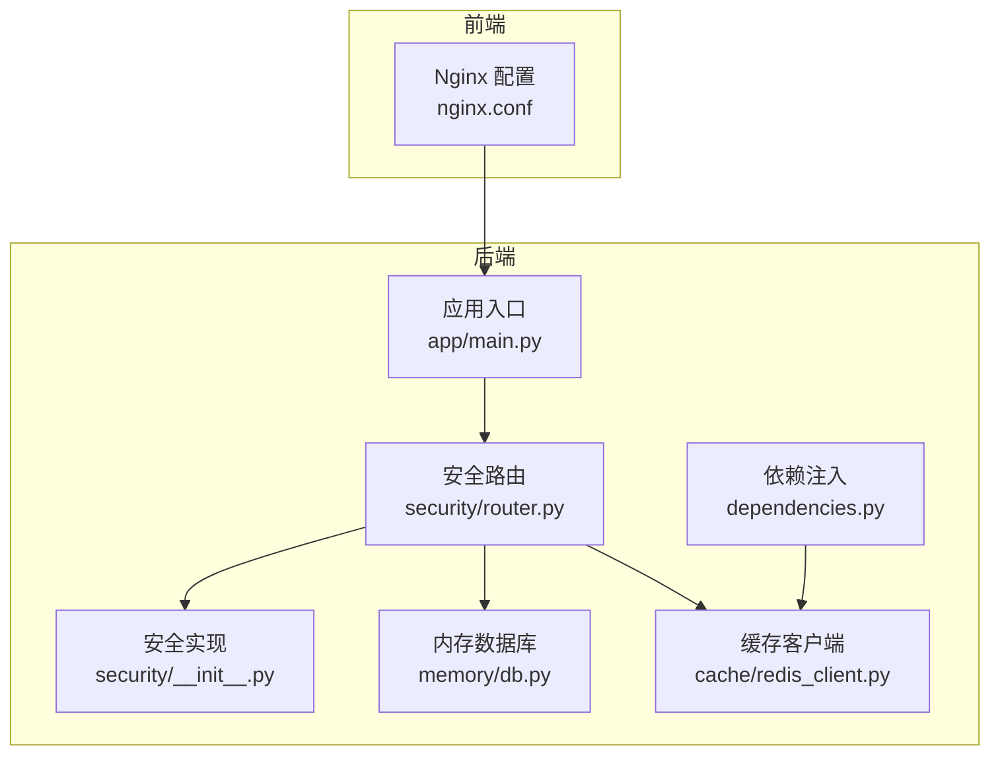
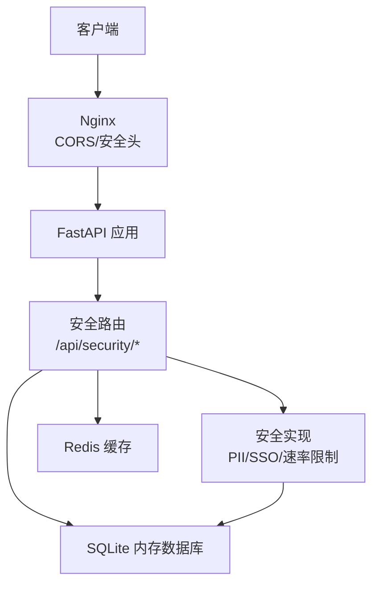
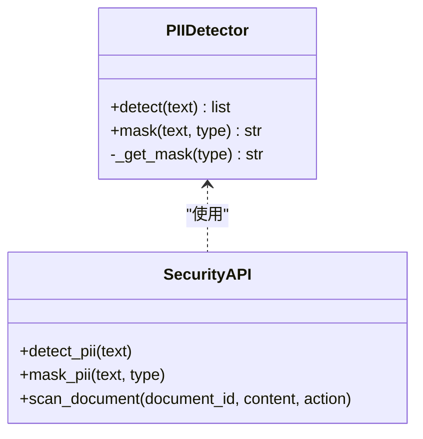
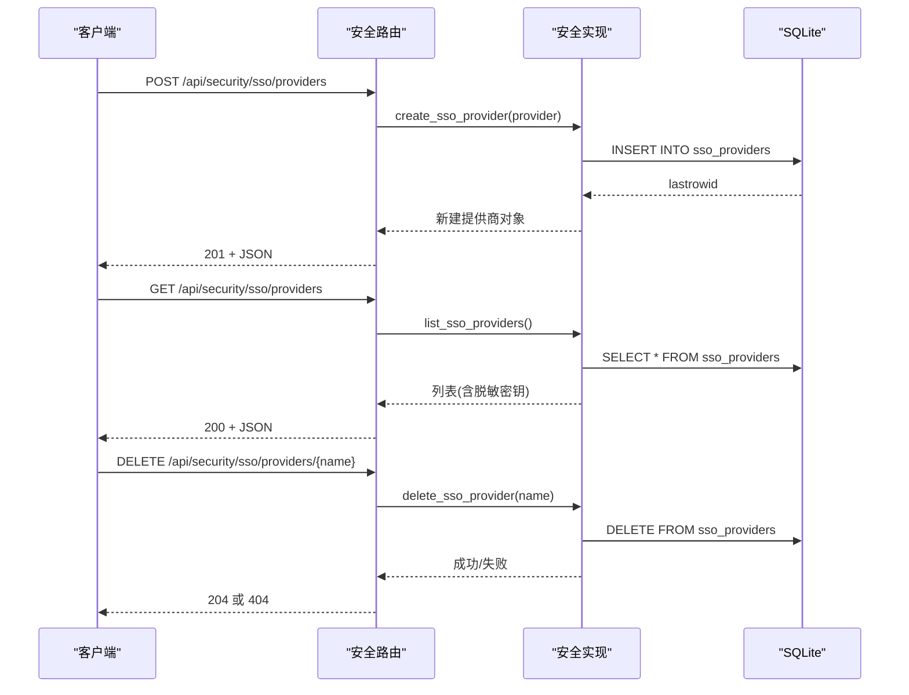
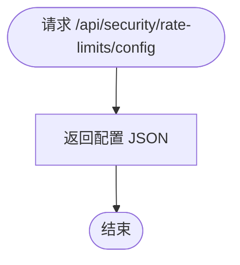
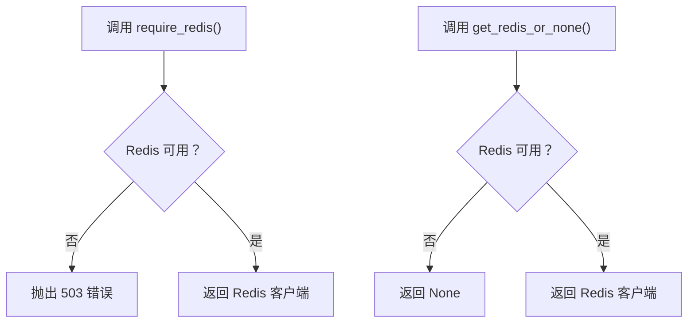
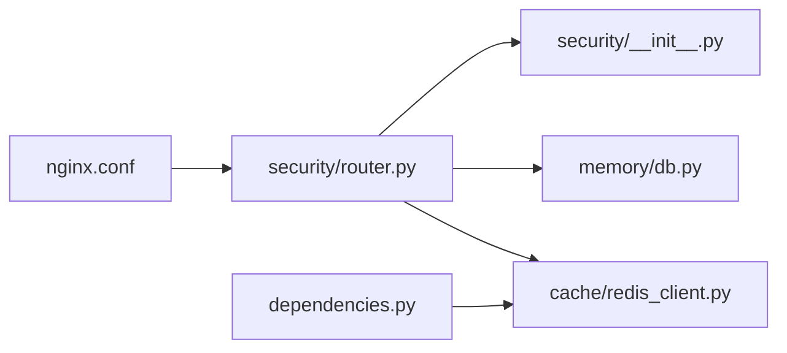

# 安全架构

<cite>
**本文引用的文件**
- [backend/app/security/router.py](file://backend/app/security/router.py)
- [backend/app/security/__init__.py](file://backend/app/security/__init__.py)
- [backend/tests/test_security.py](file://backend/tests/test_security.py)
- [backend/app/dependencies.py](file://backend/app/dependencies.py)
- [backend/app/main.py](file://backend/app/main.py)
- [backend/app/memory/db.py](file://backend/app/memory/db.py)
- [backend/app/cache/redis_client.py](file://backend/app/cache/redis_client.py)
- [nginx.conf](file://nginx.conf)
</cite>

## 目录
1. [引言](#引言)
2. [项目结构](#项目结构)
3. [核心组件](#核心组件)
4. [架构总览](#架构总览)
5. [详细组件分析](#详细组件分析)
6. [依赖关系分析](#依赖关系分析)
7. [性能考虑](#性能考虑)
8. [故障排查指南](#故障排查指南)
9. [结论](#结论)
10. [附录](#附录)

## 引言
本文件面向 Aureon 系统的安全架构，聚焦于认证授权、API 密钥管理、CORS 与安全头配置、速率限制、输入验证、SQL 注入与 XSS 防护、数据加密与隐私保护、PII 检测与脱敏、安全审计与日志、威胁检测以及合规性与最佳实践。文档基于仓库中已实现的功能与测试用例进行梳理，并在必要处给出可落地的改进建议。

## 项目结构
后端采用 FastAPI 架构，安全相关能力集中在 security 包中，包含 PII 检测、SSO 配置与管理、速率限制配置接口等；同时通过依赖注入模块提供 Redis 可用性保障；前端静态资源由 Nginx 提供，Nginx 配置文件集中管理跨域与安全头策略。

**图表来源**
- [backend/app/main.py](file://backend/app/main.py)
- [backend/app/security/router.py](file://backend/app/security/router.py)
- [backend/app/security/__init__.py](file://backend/app/security/__init__.py)
- [backend/app/dependencies.py](file://backend/app/dependencies.py)
- [backend/app/cache/redis_client.py](file://backend/app/cache/redis_client.py)
- [backend/app/memory/db.py](file://backend/app/memory/db.py)
- [nginx.conf](file://nginx.conf)

**章节来源**
- [backend/app/security/router.py:1-96](file://backend/app/security/router.py#L1-L96)
- [backend/app/security/__init__.py:1-282](file://backend/app/security/__init__.py#L1-L282)
- [backend/app/dependencies.py:1-38](file://backend/app/dependencies.py#L1-L38)
- [nginx.conf](file://nginx.conf)

## 核心组件
- PII 检测与脱敏：内置正则规则识别邮箱、手机号、身份证、银行卡、IP 地址等敏感信息，并支持按类型或全量脱敏；检测结果可落库审计。
- SSO 提供商管理：提供创建、查询、删除 SSO 提供商的接口，支持 SAML/OIDC/LDAP 类型；对密钥字段进行脱敏展示。
- 速率限制配置：提供速率限制参数查询接口，便于前端或网关侧统一策略。
- 依赖注入与缓存可用性：通过依赖函数在 Redis 不可用时返回 503，确保服务降级与可观测性。
- 前端安全头与 CORS：通过 Nginx 配置集中管理跨域与安全响应头，避免后端重复实现。

**章节来源**
- [backend/app/security/__init__.py:20-72](file://backend/app/security/__init__.py#L20-L72)
- [backend/app/security/router.py:21-59](file://backend/app/security/router.py#L21-L59)
- [backend/app/security/router.py:64-82](file://backend/app/security/router.py#L64-L82)
- [backend/app/security/router.py:86-95](file://backend/app/security/router.py#L86-L95)
- [backend/app/dependencies.py:14-37](file://backend/app/dependencies.py#L14-L37)
- [nginx.conf](file://nginx.conf)

## 架构总览
下图展示了安全相关模块在系统中的交互关系，包括 PII 检测与审计、SSO 管理、速率限制配置、Redis 可用性保障以及 Nginx 的安全头/CORS 策略。

**图表来源**
- [backend/app/security/router.py:1-96](file://backend/app/security/router.py#L1-L96)
- [backend/app/security/__init__.py:119-165](file://backend/app/security/__init__.py#L119-L165)
- [backend/app/dependencies.py:14-37](file://backend/app/dependencies.py#L14-L37)
- [nginx.conf](file://nginx.conf)

## 详细组件分析

### PII 检测与脱敏
- 检测范围：邮箱、中国手机号、美国手机号、中国身份证、银行卡号、IP 地址。
- 脱敏策略：按类型提供固定掩码；支持全量脱敏。
- 审计落库：检测到 PII 后计算哈希并记录到 pii_detections 表，包含文档 ID、类型、原始长度、处理动作等。
- 查询与索引：提供按 document_id 的索引以优化审计查询。

**图表来源**
- [backend/app/security/__init__.py:20-72](file://backend/app/security/__init__.py#L20-L72)
- [backend/app/security/router.py:21-59](file://backend/app/security/router.py#L21-L59)

**章节来源**
- [backend/app/security/__init__.py:20-72](file://backend/app/security/__init__.py#L20-L72)
- [backend/app/security/__init__.py:119-165](file://backend/app/security/__init__.py#L119-L165)
- [backend/app/security/router.py:21-59](file://backend/app/security/router.py#L21-L59)
- [backend/tests/test_security.py:16-77](file://backend/tests/test_security.py#L16-L77)

### SSO 提供商管理
- 数据模型：SSOProvider 支持 name、provider_type、client_id、client_secret、metadata_url、enabled 等字段。
- 管理接口：创建、列出、删除；列表与查询时对 client_secret 进行脱敏显示。
- 存储：sso_providers 表，包含唯一约束与启用状态；初始化时创建表并提交事务。
- 删除行为：未找到返回 404。

**图表来源**
- [backend/app/security/router.py:64-82](file://backend/app/security/router.py#L64-L82)
- [backend/app/security/__init__.py:169-282](file://backend/app/security/__init__.py#L169-L282)

**章节来源**
- [backend/app/security/__init__.py:76-96](file://backend/app/security/__init__.py#L76-L96)
- [backend/app/security/__init__.py:169-282](file://backend/app/security/__init__.py#L169-L282)
- [backend/app/security/router.py:64-82](file://backend/app/security/router.py#L64-L82)
- [backend/tests/test_security.py:79-119](file://backend/tests/test_security.py#L79-L119)

### 速率限制配置
- 接口：GET /api/security/rate-limits/config 返回启用状态与各粒度阈值。
- 设计意图：为前端或网关侧统一速率限制策略提供参考配置。

**图表来源**
- [backend/app/security/router.py:86-95](file://backend/app/security/router.py#L86-L95)

**章节来源**
- [backend/app/security/router.py:86-95](file://backend/app/security/router.py#L86-L95)

### 依赖注入与缓存可用性
- require_redis：当 Redis 不可用时抛出 503，确保关键功能不可用时明确失败。
- get_redis_or_none：当 Redis 不可用时返回 None，允许非关键功能降级。

**图表来源**
- [backend/app/dependencies.py:14-37](file://backend/app/dependencies.py#L14-L37)

**章节来源**
- [backend/app/dependencies.py:14-37](file://backend/app/dependencies.py#L14-L37)

### CORS 与安全头配置
- 统一由 Nginx 配置集中管理跨域与安全响应头，避免后端重复实现。
- 建议在生产环境开启严格安全头（如 X-Content-Type-Options、X-Frame-Options、Referrer-Policy、Permissions-Policy 等），并在 Dev 环境谨慎放宽。

**章节来源**
- [nginx.conf](file://nginx.conf)

## 依赖关系分析
- 安全路由依赖安全实现模块提供的 PII 检测、SSO 管理与审计能力。
- 安全实现依赖内存数据库进行持久化（SQLite），并可扩展至外部数据库。
- 依赖注入模块为需要缓存的路由提供统一可用性检查。
- Nginx 作为反向代理，负责 CORS 与安全头策略，减少后端耦合。

**图表来源**
- [backend/app/security/router.py:1-96](file://backend/app/security/router.py#L1-L96)
- [backend/app/security/__init__.py:1-282](file://backend/app/security/__init__.py#L1-L282)
- [backend/app/dependencies.py:1-38](file://backend/app/dependencies.py#L1-L38)
- [backend/app/memory/db.py](file://backend/app/memory/db.py)
- [backend/app/cache/redis_client.py](file://backend/app/cache/redis_client.py)
- [nginx.conf](file://nginx.conf)

**章节来源**
- [backend/app/security/router.py:1-96](file://backend/app/security/router.py#L1-L96)
- [backend/app/security/__init__.py:1-282](file://backend/app/security/__init__.py#L1-L282)
- [backend/app/dependencies.py:1-38](file://backend/app/dependencies.py#L1-L38)
- [backend/app/memory/db.py](file://backend/app/memory/db.py)
- [backend/app/cache/redis_client.py](file://backend/app/cache/redis_client.py)
- [nginx.conf](file://nginx.conf)

## 性能考虑
- PII 检测：正则匹配在大文本上可能成为瓶颈，建议分段处理或异步执行，并结合缓存命中率优化。
- 审计落库：批量写入与索引维护需关注 SQLite 的并发写入性能，必要时引入队列或迁移到高性能数据库。
- 速率限制：当前仅提供配置查询，实际限流可在网关层或中间件实现，避免在业务路由中重复实现。
- 缓存可用性：Redis 不可用时快速失败有助于避免级联超时，但应配合熔断与降级策略。

## 故障排查指南
- PII 检测无结果或误报
  - 检查正则规则是否覆盖目标格式；可通过测试用例定位问题。
  - 参考测试用例路径：[backend/tests/test_security.py:19-51](file://backend/tests/test_security.py#L19-L51)
- SSO 提供商管理异常
  - 创建/删除后查询不到或 404：确认数据库事务提交与表初始化是否完成。
  - 列表中密钥显示异常：确认脱敏逻辑是否生效。
  - 参考测试用例路径：[backend/tests/test_security.py:82-119](file://backend/tests/test_security.py#L82-L119)
- 速率限制配置
  - 若前端或网关侧策略不一致，优先以接口返回为准；若需调整阈值，请在实现中更新配置模型。
  - 参考接口定义路径：[backend/app/security/router.py:86-95](file://backend/app/security/router.py#L86-L95)
- Redis 不可用
  - 关键路由返回 503：检查 Redis 服务状态与连接配置；非关键路由可降级。
  - 参考依赖函数路径：[backend/app/dependencies.py:14-37](file://backend/app/dependencies.py#L14-L37)
- CORS 与安全头
  - 跨域失败或安全头缺失：检查 Nginx 配置是否正确加载与生效。
  - 参考配置文件路径：[nginx.conf](file://nginx.conf)

**章节来源**
- [backend/tests/test_security.py:16-131](file://backend/tests/test_security.py#L16-L131)
- [backend/app/security/router.py:86-95](file://backend/app/security/router.py#L86-L95)
- [backend/app/dependencies.py:14-37](file://backend/app/dependencies.py#L14-L37)
- [nginx.conf](file://nginx.conf)

## 结论
Aureon 的安全架构以“前端统一安全头/CORS + 后端安全能力模块”为核心设计，实现了 PII 检测与脱敏、SSO 提供商管理、速率限制配置查询与缓存可用性保障。建议后续在网关层完善速率限制与鉴权，强化输入验证与 SQL 注入/XSS 防护，并建立完善的日志与威胁检测体系，以满足更严格的合规与安全要求。

## 附录

### 认证授权机制
- 当前实现：SSO 提供商管理接口，支持 SAML/OIDC/LDAP 类型；未发现通用登录/会话管理接口。
- 建议：在网关或中间件层接入统一认证（如 JWT/OAuth2），并结合 RBAC 控制访问权限。

### API 密钥管理
- 当前实现：SSO 提供商模型包含 client_id/client_secret 字段，列表/查询时进行脱敏展示。
- 建议：密钥存储使用 KMS 加密；传输与落库均需加密；定期轮换与审计。

### CORS 配置与安全头
- 当前实现：Nginx 配置集中管理跨域与安全头。
- 建议：在生产环境启用严格安全头，Dev 环境仅用于调试。

### 速率限制
- 当前实现：提供速率限制配置查询接口。
- 建议：在网关层实现令牌桶/滑动窗口算法，结合用户/IP/Key 维度过载保护。

### 输入验证、SQL 注入与 XSS 防护
- 输入验证：建议在 Pydantic 模型中增加字段校验与长度限制。
- SQL 注入：当前使用 SQLite 且通过 ORM/参数化查询方式较少见直接注入风险，仍建议统一参数化与最小权限原则。
- XSS：建议在前端渲染层启用 CSP 与内容安全策略，后端输出编码与白名单过滤。

### 数据加密与隐私保护
- PII 脱敏：已实现按类型掩码；建议对存储的敏感字段进行额外加密。
- 审计：已记录检测事件；建议补充访问日志与操作审计。

### 合规性与最佳实践
- 建议遵循 ISO 27001、GDPR、网络安全法等合规要求，建立数据分类分级与最小化收集原则。
- 最佳实践：零信任网络、最小权限、纵深防御、持续监控与演练。