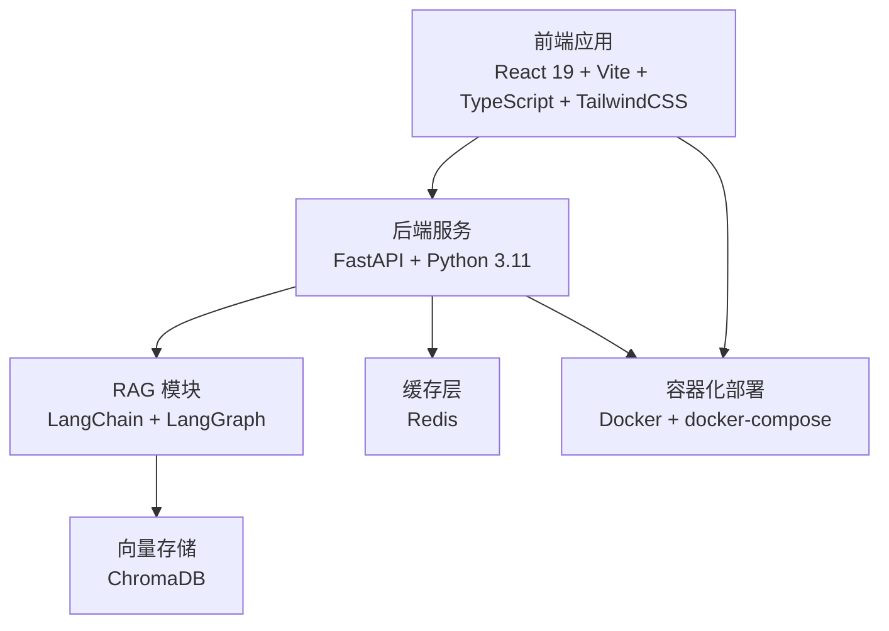
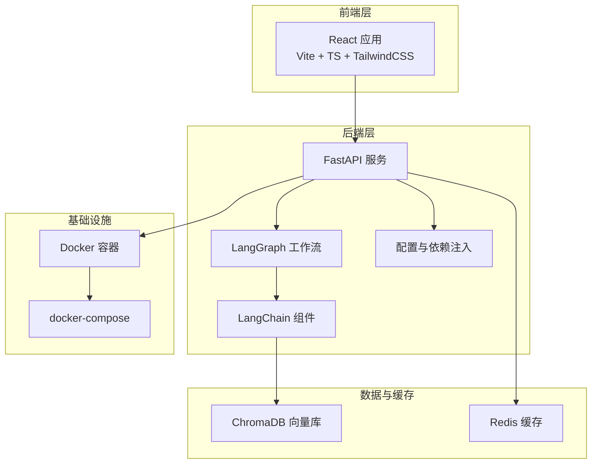
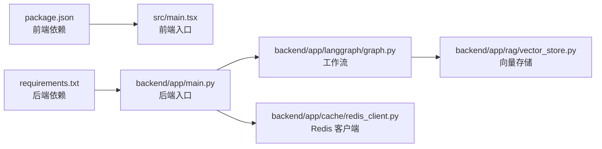

# 技术栈选择

<cite>
**本文档引用的文件**
- [package.json](file://package.json)
- [vite.config.ts](file://vite.config.ts)
- [tsconfig.app.json](file://tsconfig.app.json)
- [src/main.tsx](file://src/main.tsx)
- [backend/Dockerfile](file://backend/Dockerfile)
- [backend/requirements.txt](file://backend/requirements.txt)
- [backend/app/main.py](file://backend/app/main.py)
- [backend/app/config.py](file://backend/app/config.py)
- [backend/app/langgraph/graph.py](file://backend/app/langgraph/graph.py)
- [backend/app/rag/vector_store.py](file://backend/app/rag/vector_store.py)
- [backend/app/cache/redis_client.py](file://backend/app/cache/redis_client.py)
- [backend/app/dependencies.py](file://backend/app/dependencies.py)
- [README.md](file://README.md)
- [docs/architecture/system-overview.md](file://docs/architecture/system-overview.md)
- [docs/rag-design.md](file://docs/rag-design.md)
- [docs/deployment/docker-setup.md](file://docs/deployment/docker-setup.md)
</cite>

## 目录
1. [引言](#引言)
2. [项目结构](#项目结构)
3. [核心组件](#核心组件)
4. [架构总览](#架构总览)
5. [详细组件分析](#详细组件分析)
6. [依赖关系分析](#依赖关系分析)
7. [性能考量](#性能考量)
8. [故障排除指南](#故障排除指南)
9. [结论](#结论)
10. [附录](#附录)

## 引言
本技术栈选择文档围绕 Aureon 系统的前端与后端技术选型展开，重点说明前端（React 19、Vite、TypeScript、TailwindCSS）与后端（FastAPI、Python 3.11、LangGraph、LangChain、ChromaDB、Redis）的技术决策依据、优势与适用场景，并提供版本兼容性、性能考量与维护成本分析，以及技术栈演进路线图与未来规划建议。

## 项目结构
Aureon 采用前后端分离架构：前端位于 src 目录，使用 Vite 构建；后端位于 backend/app 目录，基于 FastAPI 提供服务接口；知识库与检索增强（RAG）模块集成 LangChain/LangGraph；向量存储采用 ChromaDB，缓存采用 Redis；Docker 化部署贯穿前后端。

图表来源
- [src/main.tsx:1-50](file://src/main.tsx#L1-L50)
- [backend/app/main.py:1-80](file://backend/app/main.py#L1-L80)
- [backend/app/rag/vector_store.py:1-80](file://backend/app/rag/vector_store.py#L1-L80)
- [backend/app/cache/redis_client.py:1-80](file://backend/app/cache/redis_client.py#L1-L80)
- [backend/Dockerfile:1-120](file://backend/Dockerfile#L1-L120)

章节来源
- [README.md:1-200](file://README.md#L1-L200)
- [docs/architecture/system-overview.md:1-200](file://docs/architecture/system-overview.md#L1-L200)

## 核心组件
- 前端技术栈
  - React 19：现代 React 版本，支持并发特性与改进的开发体验，适合构建交互式用户界面。
  - Vite：快速构建工具，提供热更新与优化打包能力，提升开发效率。
  - TypeScript：强类型语言，提高代码可维护性与协作效率，降低运行时错误风险。
  - TailwindCSS：原子化 CSS 框架，便于快速样式迭代与主题一致性管理。
- 后端技术栈
  - FastAPI：高性能异步 Web 框架，自动生成 OpenAPI 文档，具备出色的性能与开发者体验。
  - Python 3.11：稳定且性能优异的运行时，支持异步 I/O 与类型提示，适配 FastAPI。
  - LangGraph：用于编排多智能体工作流，支持状态流转与节点组合，满足复杂对话与任务编排需求。
  - LangChain：提供 LLM 集成、链式调用与评估工具，支撑 RAG 与工具调用等能力。
- 数据库与缓存
  - ChromaDB：嵌入式向量数据库，易于部署与扩展，适合中小规模知识库与检索场景。
  - Redis：高性能键值缓存/会话存储，支持多种数据结构，适合作为查询缓存与会话缓存。

章节来源
- [package.json:1-200](file://package.json#L1-L200)
- [vite.config.ts:1-200](file://vite.config.ts#L1-L200)
- [tsconfig.app.json:1-200](file://tsconfig.app.json#L1-L200)
- [backend/requirements.txt:1-200](file://backend/requirements.txt#L1-L200)
- [backend/app/main.py:1-120](file://backend/app/main.py#L1-L120)
- [backend/app/config.py:1-120](file://backend/app/config.py#L1-L120)

## 架构总览
下图展示 Aureon 的端到端架构：前端通过 API 路由与后端交互；后端通过 LangGraph 编排智能体与 RAG 流程；向量存储与缓存分别承担知识检索与性能优化；容器化部署确保环境一致性与可移植性。

图表来源
- [src/main.tsx:1-50](file://src/main.tsx#L1-L50)
- [backend/app/main.py:1-120](file://backend/app/main.py#L1-L120)
- [backend/app/langgraph/graph.py:1-120](file://backend/app/langgraph/graph.py#L1-L120)
- [backend/app/rag/vector_store.py:1-120](file://backend/app/rag/vector_store.py#L1-L120)
- [backend/app/cache/redis_client.py:1-120](file://backend/app/cache/redis_client.py#L1-L120)
- [backend/app/dependencies.py:1-120](file://backend/app/dependencies.py#L1-L120)
- [backend/Dockerfile:1-120](file://backend/Dockerfile#L1-L120)
- [docker-compose.yml:1-200](file://docker-compose.yml#L1-L200)

## 详细组件分析

### 前端技术栈（React 19、Vite、TypeScript、TailwindCSS）
- React 19
  - 优势：并发渲染、改进的 Suspense 行为、更小的包体积与更好的内存管理。
  - 适用场景：需要高交互性的聊天界面、仪表盘与文档上传组件。
  - 替代方案：Next.js（服务端渲染）、SolidJS（更小体积与更高性能）。
- Vite
  - 优势：极快的冷启动与热更新、原生 ESM 支持、插件生态丰富。
  - 适用场景：本地开发与生产构建，配合 React 19 快速迭代。
  - 替代方案：Webpack（成熟但较慢）、Parcel（零配置但生态偏弱）。
- TypeScript
  - 优势：静态类型检查、更好的 IDE 支持、团队协作与长期维护。
  - 适用场景：消息类型、路由参数、API 返回值的强约束。
  - 替代方案：JavaScript（灵活性高但风险大）。
- TailwindCSS
  - 优势：原子类快速布局、主题一致性强、易于响应式设计。
  - 适用场景：UI 组件样式与页面布局，统一设计系统。
  - 替代方案：Styled Components（CSS-in-JS）、SCSS（传统样式组织）。

章节来源
- [package.json:1-200](file://package.json#L1-L200)
- [vite.config.ts:1-200](file://vite.config.ts#L1-L200)
- [tsconfig.app.json:1-200](file://tsconfig.app.json#L1-L200)
- [src/main.tsx:1-50](file://src/main.tsx#L1-L50)

### 后端技术栈（FastAPI、Python 3.11、LangGraph、LangChain）
- FastAPI
  - 优势：自动生成 OpenAPI/Swagger 文档、高性能、类型安全、异步支持。
  - 适用场景：REST API、实时流式响应、可观测性与监控集成。
  - 替代方案：Flask（轻量但功能有限）、Django（全栈但较重）。
- Python 3.11
  - 优势：更快的解释器、更好的异常显示、异步 I/O 性能提升。
  - 适用场景：AI/ML 推理、数据处理与 RAG 管道。
  - 替代方案：PyPy（JIT 加速但兼容性问题）、其他语言（如 Go/Rust）需权衡生态。
- LangGraph
  - 优势：可视化工作流、状态管理、节点组合灵活、易于调试。
  - 适用场景：多智能体编排、意图识别、RAG 生成与检索流程。
  - 替代方案：Celery（任务队列）、Apache Airflow（ETL/调度）。
- LangChain
  - 优势：LLM 集成、链式调用、工具与记忆体、评估与基准测试。
  - 适用场景：问答链、查询改写、检索增强与质量评估。
  - 替代方案：LlamaIndex（索引与检索）、Transformers（模型直接调用）。

章节来源
- [backend/requirements.txt:1-200](file://backend/requirements.txt#L1-L200)
- [backend/app/main.py:1-120](file://backend/app/main.py#L1-L120)
- [backend/app/langgraph/graph.py:1-120](file://backend/app/langgraph/graph.py#L1-L120)
- [backend/app/rag/vector_store.py:1-120](file://backend/app/rag/vector_store.py#L1-L120)

### 数据库与缓存（ChromaDB、Redis）
- ChromaDB
  - 优势：嵌入式、易于部署、支持向量相似度搜索、与 LangChain 生态契合。
  - 适用场景：中小规模知识库、文档向量化与检索。
  - 替代方案：Pinecone（托管向量服务）、Weaviate（图谱+向量）、FAISS（本地高性能）。
- Redis
  - 优势：高性能键值存储、支持多种数据结构、可做会话与查询缓存。
  - 适用场景：会话状态、热门查询结果缓存、速率限制。
  - 替代方案：Memcached（简单键值缓存）、本地内存缓存（单实例）。

章节来源
- [backend/app/rag/vector_store.py:1-120](file://backend/app/rag/vector_store.py#L1-L120)
- [backend/app/cache/redis_client.py:1-120](file://backend/app/cache/redis_client.py#L1-L120)

### 版本兼容性与性能考量
- 前端
  - React 19 与 Vite 的组合在本地开发中具备极佳的热更新与构建速度；TypeScript 类型定义有助于减少运行时错误。
- 后端
  - Python 3.11 与 FastAPI 的异步特性结合，适合高并发请求与长连接流式响应；LangGraph 与 LangChain 的模块化设计便于扩展与测试。
- 数据与缓存
  - ChromaDB 作为嵌入式向量库，部署简单；Redis 作为缓存层，显著降低重复查询延迟。

章节来源
- [package.json:1-200](file://package.json#L1-L200)
- [backend/requirements.txt:1-200](file://backend/requirements.txt#L1-L200)
- [backend/app/config.py:1-120](file://backend/app/config.py#L1-L120)

### 维护成本分析
- 前端：TypeScript 与组件化设计降低维护成本；TailwindCSS 统一样式减少样式冲突。
- 后端：FastAPI 自动生成文档与类型约束，减少接口变更带来的风险；LangGraph 的可视化工作流便于调试与维护。
- 数据与缓存：ChromaDB 与 Redis 均为轻量级组件，运维成本较低。

章节来源
- [backend/app/main.py:1-120](file://backend/app/main.py#L1-L120)
- [backend/app/dependencies.py:1-120](file://backend/app/dependencies.py#L1-L120)

## 依赖关系分析
前端与后端通过 API 路由进行解耦；后端内部通过 LangGraph 编排 RAG 流程；向量存储与缓存作为外部依赖被后端统一管理；Docker 化部署确保环境一致性。

图表来源
- [package.json:1-200](file://package.json#L1-L200)
- [backend/requirements.txt:1-200](file://backend/requirements.txt#L1-L200)
- [src/main.tsx:1-50](file://src/main.tsx#L1-L50)
- [backend/app/main.py:1-120](file://backend/app/main.py#L1-L120)
- [backend/app/langgraph/graph.py:1-120](file://backend/app/langgraph/graph.py#L1-L120)
- [backend/app/rag/vector_store.py:1-120](file://backend/app/rag/vector_store.py#L1-L120)
- [backend/app/cache/redis_client.py:1-120](file://backend/app/cache/redis_client.py#L1-L120)

章节来源
- [package.json:1-200](file://package.json#L1-L200)
- [backend/requirements.txt:1-200](file://backend/requirements.txt#L1-L200)

## 性能考量
- 前端性能：Vite 的按需加载与 Tree-shaking 减少包体积；TailwindCSS 的原子类避免冗余样式；React 19 的并发渲染提升交互流畅度。
- 后端性能：FastAPI 的异步 I/O 与事件循环处理高并发；LangGraph 的节点化设计便于并行执行；LangChain 的链式调用减少重复计算。
- 数据与缓存：ChromaDB 的向量索引加速检索；Redis 的热点数据缓存降低后端压力。

章节来源
- [vite.config.ts:1-200](file://vite.config.ts#L1-L200)
- [backend/app/main.py:1-120](file://backend/app/main.py#L1-L120)
- [backend/app/rag/vector_store.py:1-120](file://backend/app/rag/vector_store.py#L1-L120)
- [backend/app/cache/redis_client.py:1-120](file://backend/app/cache/redis_client.py#L1-L120)

## 故障排除指南
- 前端常见问题
  - 构建失败：检查 Vite 配置与 TypeScript 编译选项；确认依赖安装完整。
  - 样式异常：检查 TailwindCSS 配置与类名拼写；确认未被覆盖。
- 后端常见问题
  - API 无法访问：检查 FastAPI 路由注册与依赖注入；确认端口开放。
  - LangGraph 执行异常：检查节点输入输出类型与状态字段；启用日志定位。
  - ChromaDB 连接失败：确认向量维度与嵌入模型一致；检查磁盘空间。
  - Redis 连接失败：确认连接参数与网络策略；检查内存上限。
- 部署相关
  - Docker 构建失败：检查镜像基础层与依赖版本；确认 .dockerignore 规则。

章节来源
- [backend/app/main.py:1-120](file://backend/app/main.py#L1-L120)
- [backend/app/dependencies.py:1-120](file://backend/app/dependencies.py#L1-L120)
- [backend/app/cache/redis_client.py:1-120](file://backend/app/cache/redis_client.py#L1-L120)
- [docs/deployment/docker-setup.md:1-200](file://docs/deployment/docker-setup.md#L1-L200)

## 结论
Aureon 的技术栈选择以“高性能、可维护、易扩展”为核心目标：前端采用 React 19 + Vite + TS + TailwindCSS，确保开发效率与用户体验；后端采用 FastAPI + Python 3.11 + LangGraph + LangChain，支撑复杂的 AI 工作流与 RAG 场景；数据与缓存采用 ChromaDB + Redis，兼顾易用性与性能。整体方案在当前阶段具备良好的稳定性与扩展性，适合持续演进。

## 附录

### 技术栈演进路线图与未来规划
- 短期（3-6 个月）
  - 优化前端构建与懒加载策略，引入组件库与设计系统规范。
  - 完善后端可观测性与日志体系，集成 APM 工具。
  - 扩展 RAG 评估指标与自动化测试流程。
- 中期（6-12 个月）
  - 引入企业级向量服务（如 Pinecone/Opendal）以支持更大规模知识库。
  - 将部分后端逻辑迁移至边缘或云函数，降低主服务负载。
  - 引入多语言与多模态支持，扩展应用场景。
- 长期（12+ 个月）
  - 探索更强的推理与记忆体能力，结合更先进的 LLM 与检索算法。
  - 建立跨团队共享的 AI 原子能力平台，沉淀可复用组件。
  - 完善安全与合规体系，支持企业级部署与审计。

章节来源
- [docs/architecture/system-overview.md:1-200](file://docs/architecture/system-overview.md#L1-L200)
- [docs/rag-design.md:1-200](file://docs/rag-design.md#L1-L200)