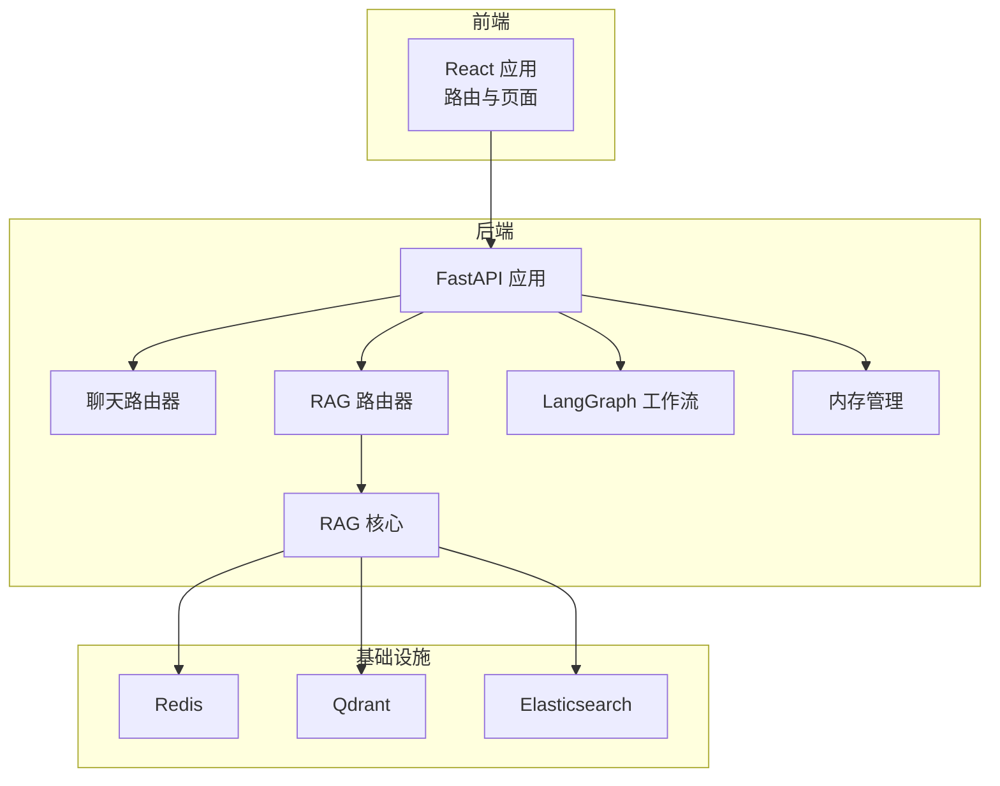
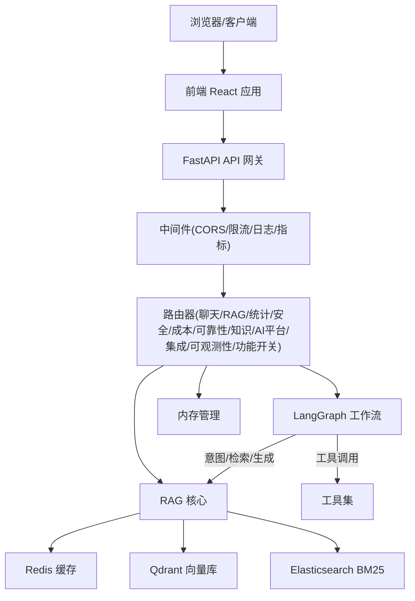
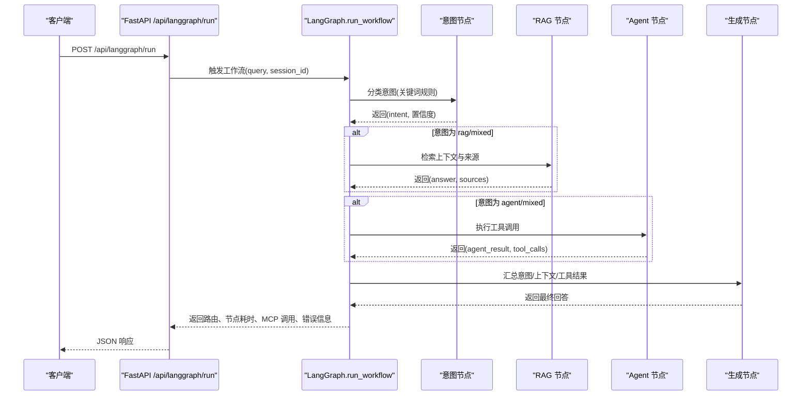
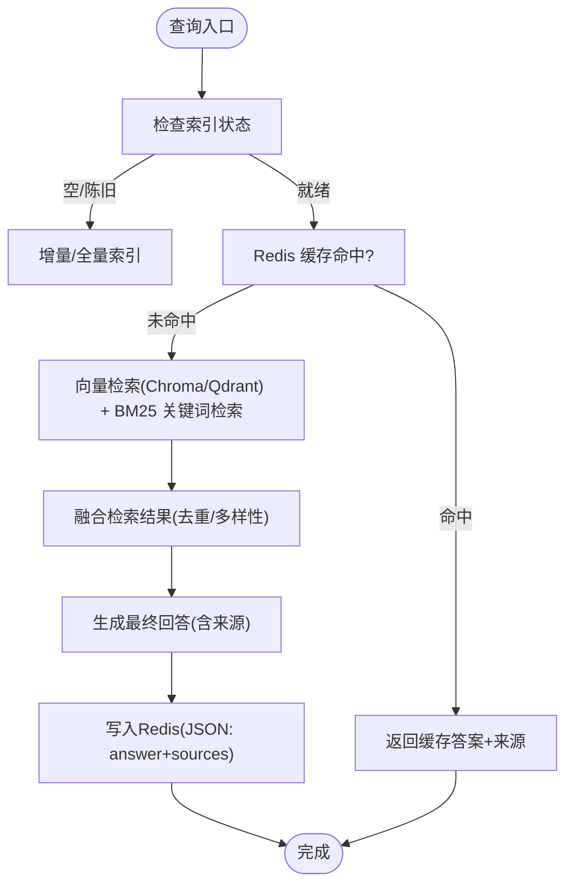
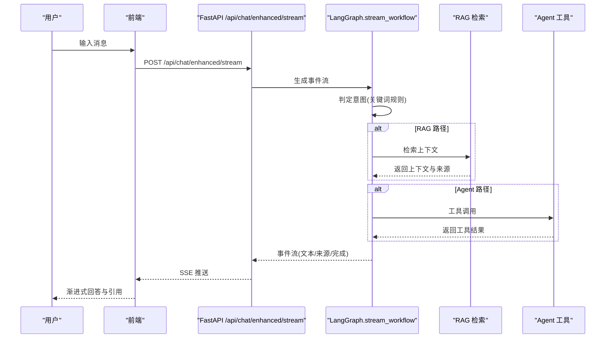
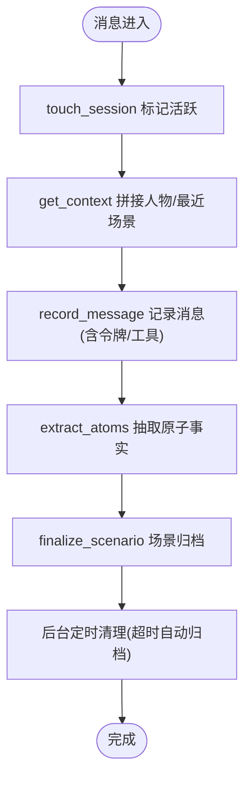
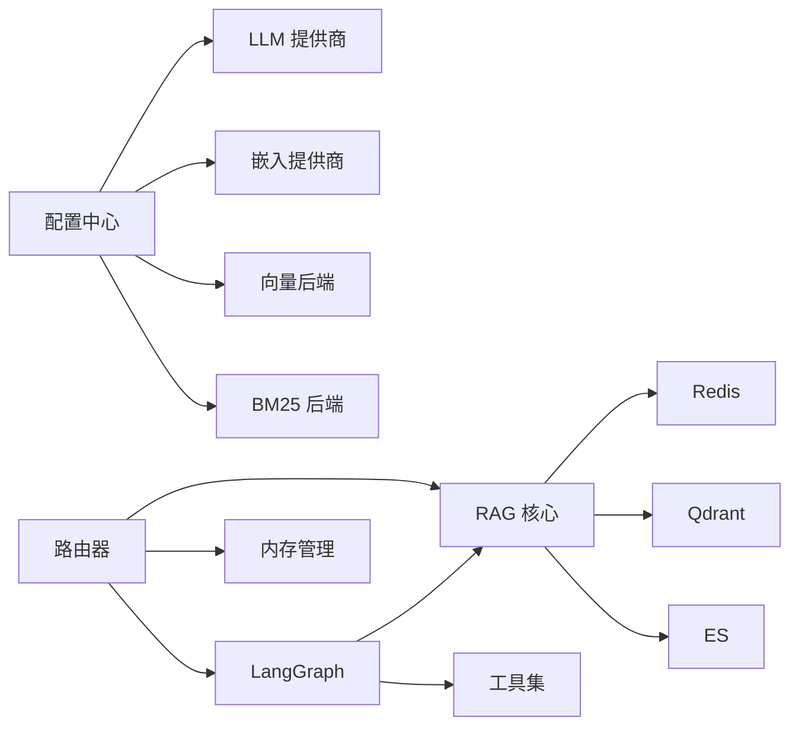

# 架构设计

<cite>
**本文引用的文件**
- [README.md](file://README.md)
- [docker-compose.yml](file://docker-compose.yml)
- [backend/app/main.py](file://backend/app/main.py)
- [backend/app/config.py](file://backend/app/config.py)
- [backend/app/routers/chat.py](file://backend/app/routers/chat.py)
- [backend/app/routers/rag.py](file://backend/app/routers/rag.py)
- [backend/app/langgraph/graph.py](file://backend/app/langgraph/graph.py)
- [backend/app/langgraph/state.py](file://backend/app/langgraph/state.py)
- [backend/app/langgraph/nodes/intent.py](file://backend/app/langgraph/nodes/intent.py)
- [backend/app/langgraph/nodes/rag.py](file://backend/app/langgraph/nodes/rag.py)
- [backend/app/langgraph/nodes/agent.py](file://backend/app/langgraph/nodes/agent.py)
- [backend/app/langgraph/nodes/generate.py](file://backend/app/langgraph/nodes/generate.py)
- [backend/app/memory/manager.py](file://backend/app/memory/manager.py)
- [backend/app/rag/vector_store.py](file://backend/app/rag/vector_store.py)
- [src/App.tsx](file://src/App.tsx)
</cite>

## 目录
1. [引言](#引言)
2. [项目结构](#项目结构)
3. [核心组件](#核心组件)
4. [架构总览](#架构总览)
5. [详细组件分析](#详细组件分析)
6. [依赖分析](#依赖分析)
7. [性能考量](#性能考量)
8. [故障排查指南](#故障排查指南)
9. [结论](#结论)
10. [附录](#附录)

## 引言
本架构设计文档面向 Aureon 企业级 AI 知识库平台，系统采用前后端分离与多服务协同的微服务架构：前端 React 应用负责用户交互与可视化；后端 FastAPI 服务提供统一 API 网关与业务编排；LangGraph 工作流编排引擎实现智能意图识别、RAG 检索与 Agent 工具执行的动态路由；RAG 子系统提供混合检索（BM25 关键词 + 向量相似度）、缓存与增量索引能力；内存管理子系统支撑会话生命周期与上下文持久化；基础设施层包含 Redis、Qdrant、Elasticsearch 等外部组件。

该系统强调可观测性、安全与可靠性，支持多 LLM 提供商与嵌入模型的弹性切换，并通过速率限制、安全头、结构化日志与指标暴露保障生产可用性。

## 项目结构
- 前端（React + Vite）
  - 页面与组件：路由懒加载、国际化、错误边界、仪表盘与搜索界面
  - 服务层：API 封装、评估、特征开关、RAG 服务等
- 后端（FastAPI）
  - 应用入口与中间件：CORS、速率限制、Prometheus 指标、结构化日志、安全头
  - 路由器：聊天、RAG、统计、分析、安全、成本、可靠性、知识、AI 平台、集成、可观测性、功能开关
  - LangGraph 编排：状态、节点（意图、RAG、Agent、生成）、流式输出
  - RAG 核心：向量存储（Chroma/Qdrant）、BM25 关键词检索、嵌入缓存与回退链、增量索引
  - 内存管理：会话生命周期、原子记忆、场景与人物画像、离线落盘
  - 配置中心：多提供商 LLM/嵌入配置、向量与 BM25 后端选择
- 基础设施（Docker Compose）
  - Redis、Qdrant、Elasticsearch 服务与健康检查
  - 数据卷与环境变量配置

**图表来源**
- [backend/app/main.py:68-371](file://backend/app/main.py#L68-L371)
- [backend/app/routers/chat.py:1-107](file://backend/app/routers/chat.py#L1-L107)
- [backend/app/routers/rag.py:1-566](file://backend/app/routers/rag.py#L1-L566)
- [backend/app/langgraph/graph.py:1-163](file://backend/app/langgraph/graph.py#L1-L163)
- [backend/app/memory/manager.py:1-130](file://backend/app/memory/manager.py#L1-L130)
- [backend/app/rag/vector_store.py:1-1118](file://backend/app/rag/vector_store.py#L1-L1118)
- [docker-compose.yml:1-64](file://docker-compose.yml#L1-L64)

**章节来源**
- [README.md:40-63](file://README.md#L40-L63)
- [docker-compose.yml:1-64](file://docker-compose.yml#L1-L64)
- [backend/app/main.py:68-371](file://backend/app/main.py#L68-L371)

## 核心组件
- 前端 React 应用
  - 路由懒加载与国际化，提供仪表盘、搜索、文档管理、分析、架构图、管理员界面等页面
  - 通过服务层封装调用后端 API，支持 SSE 流式响应与事件收集
- 后端 FastAPI 服务
  - 中间件：CORS、速率限制、Prometheus 指标、结构化日志、安全头
  - 路由器：聊天（基础与增强流式）、RAG（查询、流式、索引、上传、评估、实验、健康、基准）
  - LangGraph 工作流：意图识别、RAG 检索、Agent 工具执行、生成最终答案
  - 内存管理：会话生命周期、原子记忆、场景与人物画像、后台清理任务
  - 配置中心：多提供商 LLM/嵌入、向量与 BM25 后端、自动索引策略
- 基础设施
  - Redis：缓存与计数
  - Qdrant：向量检索
  - Elasticsearch：BM25 关键词检索（可选）

**章节来源**
- [src/App.tsx:1-122](file://src/App.tsx#L1-L122)
- [backend/app/main.py:68-371](file://backend/app/main.py#L68-L371)
- [backend/app/routers/chat.py:1-107](file://backend/app/routers/chat.py#L1-L107)
- [backend/app/routers/rag.py:1-566](file://backend/app/routers/rag.py#L1-L566)
- [backend/app/langgraph/graph.py:1-163](file://backend/app/langgraph/graph.py#L1-L163)
- [backend/app/memory/manager.py:1-130](file://backend/app/memory/manager.py#L1-L130)
- [backend/app/config.py:1-90](file://backend/app/config.py#L1-L90)
- [backend/app/rag/vector_store.py:1-1118](file://backend/app/rag/vector_store.py#L1-L1118)
- [docker-compose.yml:1-64](file://docker-compose.yml#L1-L64)

## 架构总览
系统采用“前端单页应用 + 后端微服务 + 外部数据存储”的分层架构。前端通过 REST/SSE 与后端交互；后端以 FastAPI 为核心，聚合聊天、RAG、LangGraph 编排、内存管理与基础设施服务；LangGraph 在运行时根据用户意图动态路由至 RAG 检索、Agent 工具执行或直接生成。

**图表来源**
- [backend/app/main.py:68-371](file://backend/app/main.py#L68-L371)
- [backend/app/routers/chat.py:1-107](file://backend/app/routers/chat.py#L1-L107)
- [backend/app/routers/rag.py:1-566](file://backend/app/routers/rag.py#L1-L566)
- [backend/app/langgraph/graph.py:1-163](file://backend/app/langgraph/graph.py#L1-L163)
- [backend/app/memory/manager.py:1-130](file://backend/app/memory/manager.py#L1-L130)
- [backend/app/rag/vector_store.py:1-1118](file://backend/app/rag/vector_store.py#L1-L1118)
- [docker-compose.yml:1-64](file://docker-compose.yml#L1-L64)

## 详细组件分析

### LangGraph 工作流编排
LangGraph 通过状态机定义意图识别、RAG 检索、Agent 工具执行与最终生成的流程。工作流根据意图路由并行或串行执行节点，最终汇总生成回答并返回节点耗时、中间结果与 MCP 调用记录。

**图表来源**
- [backend/app/main.py:218-226](file://backend/app/main.py#L218-L226)
- [backend/app/langgraph/graph.py:43-147](file://backend/app/langgraph/graph.py#L43-L147)
- [backend/app/langgraph/nodes/intent.py:47-76](file://backend/app/langgraph/nodes/intent.py#L47-L76)
- [backend/app/langgraph/nodes/rag.py:11-27](file://backend/app/langgraph/nodes/rag.py#L11-L27)
- [backend/app/langgraph/nodes/agent.py:13-32](file://backend/app/langgraph/nodes/agent.py#L13-L32)
- [backend/app/langgraph/nodes/generate.py:34-89](file://backend/app/langgraph/nodes/generate.py#L34-L89)

**章节来源**
- [backend/app/langgraph/graph.py:1-163](file://backend/app/langgraph/graph.py#L1-L163)
- [backend/app/langgraph/state.py:1-47](file://backend/app/langgraph/state.py#L1-L47)
- [backend/app/langgraph/nodes/intent.py:1-76](file://backend/app/langgraph/nodes/intent.py#L1-L76)
- [backend/app/langgraph/nodes/rag.py:1-27](file://backend/app/langgraph/nodes/rag.py#L1-L27)
- [backend/app/langgraph/nodes/agent.py:1-32](file://backend/app/langgraph/nodes/agent.py#L1-L32)
- [backend/app/langgraph/nodes/generate.py:1-89](file://backend/app/langgraph/nodes/generate.py#L1-L89)

### RAG 检索与嵌入流水线
RAG 子系统提供混合检索（BM25 + 向量）、增量索引、缓存与评估能力。向量存储支持 Chroma/Qdrant，嵌入提供本地 BGE、DashScope、SiliconFlow、Zhipu 的回退链；BM25 关键词检索预构建索引，查询时快速打分并过滤低 IDF 与低分数项。

**图表来源**
- [backend/app/routers/rag.py:86-131](file://backend/app/routers/rag.py#L86-L131)
- [backend/app/routers/rag.py:133-267](file://backend/app/routers/rag.py#L133-L267)
- [backend/app/rag/vector_store.py:663-741](file://backend/app/rag/vector_store.py#L663-L741)
- [backend/app/rag/vector_store.py:176-325](file://backend/app/rag/vector_store.py#L176-L325)

**章节来源**
- [backend/app/routers/rag.py:1-566](file://backend/app/routers/rag.py#L1-L566)
- [backend/app/rag/vector_store.py:1-1118](file://backend/app/rag/vector_store.py#L1-L1118)

### 聊天与增强对话（LangGraph 集成）
聊天接口支持两种模式：基础流式对话与增强流式对话（自动集成 LangGraph 意图路由）。增强模式下，后端将查询交由 LangGraph 判定意图，按需触发 RAG 检索或 Agent 工具执行，并通过 SSE 实时返回事件。

**图表来源**
- [backend/app/routers/chat.py:66-93](file://backend/app/routers/chat.py#L66-L93)
- [backend/app/langgraph/graph.py:72-147](file://backend/app/langgraph/graph.py#L72-L147)

**章节来源**
- [backend/app/routers/chat.py:1-107](file://backend/app/routers/chat.py#L1-L107)
- [backend/app/langgraph/graph.py:1-163](file://backend/app/langgraph/graph.py#L1-L163)

### 内存管理与会话生命周期
内存管理器负责会话的活跃标记、上下文拼接、原子记忆提取、场景与人物画像更新以及后台定时清理。在聊天与 LangGraph 场景中，均通过内存管理器记录消息、抽取原子事实并按超时自动归档。

**图表来源**
- [backend/app/memory/manager.py:27-127](file://backend/app/memory/manager.py#L27-L127)

**章节来源**
- [backend/app/memory/manager.py:1-130](file://backend/app/memory/manager.py#L1-L130)

### 配置与多提供商策略
配置中心集中管理 LLM 与嵌入提供商、向量与 BM25 后端、自动索引策略等。系统支持主备 LLM 与嵌入提供商回退链，确保在部分服务不可用时仍可运行。

- LLM 提供商注册与回退链
- 嵌入提供商优先级：本地 BGE → DashScope → SiliconFlow → Zhipu
- 向量后端：Chroma（默认）/ Qdrant
- BM25 后端：内存（默认）/ Elasticsearch

**章节来源**
- [backend/app/config.py:1-90](file://backend/app/config.py#L1-L90)

## 依赖分析
- 组件内聚与耦合
  - LangGraph 节点与 RAG/Agent 解耦，通过函数式调用与状态传递实现松耦合
  - 路由器仅负责请求接入与参数校验，核心逻辑下沉至子系统
  - 内存管理器作为横切关注点，被聊天与 LangGraph 共享
- 外部依赖
  - Redis：缓存与计数
  - Qdrant：向量检索
  - Elasticsearch：BM25 关键词检索
- 可能的循环依赖
  - LangGraph 节点与 RAG/Agent 通过导入延迟避免循环
- 接口契约
  - RAG 查询返回结构化响应，包含答案与来源
  - LangGraph 输出包含路由、节点耗时、MCP 调用与错误信息

**图表来源**
- [backend/app/config.py:1-90](file://backend/app/config.py#L1-L90)
- [backend/app/routers/chat.py:1-107](file://backend/app/routers/chat.py#L1-L107)
- [backend/app/routers/rag.py:1-566](file://backend/app/routers/rag.py#L1-L566)
- [backend/app/langgraph/graph.py:1-163](file://backend/app/langgraph/graph.py#L1-L163)
- [backend/app/memory/manager.py:1-130](file://backend/app/memory/manager.py#L1-L130)
- [backend/app/rag/vector_store.py:1-1118](file://backend/app/rag/vector_store.py#L1-L1118)

**章节来源**
- [backend/app/config.py:1-90](file://backend/app/config.py#L1-L90)
- [backend/app/routers/chat.py:1-107](file://backend/app/routers/chat.py#L1-L107)
- [backend/app/routers/rag.py:1-566](file://backend/app/routers/rag.py#L1-L566)
- [backend/app/langgraph/graph.py:1-163](file://backend/app/langgraph/graph.py#L1-L163)
- [backend/app/memory/manager.py:1-130](file://backend/app/memory/manager.py#L1-L130)
- [backend/app/rag/vector_store.py:1-1118](file://backend/app/rag/vector_store.py#L1-L1118)

## 性能考量
- 流式与缓冲
  - RAG 流式查询采用事件缓冲策略，首包立即返回以降低 TTFT，后续按时间与字符阈值刷新
- 检索与索引
  - BM25 关键词检索预构建索引，查询时避免重复分词与打分，延迟低于 10ms
  - 向量检索支持 MMR 多样性优化，减少重复来源
- 缓存
  - Redis 缓存查询结果（答案+来源），命中后直接返回并统计命中率
  - 嵌入向量在内存与 Redis 双层缓存，降低重复嵌入开销
- 自动重建与健康检查
  - 启动阶段异步构建 BM25 与检查向量索引，必要时通过 API 嵌入重建，避免 OOM
- 指标与可观测性
  - Prometheus 指标暴露、结构化日志、速率限制、安全头，便于性能监控与问题定位

**章节来源**
- [backend/app/routers/rag.py:133-267](file://backend/app/routers/rag.py#L133-L267)
- [backend/app/rag/vector_store.py:176-325](file://backend/app/rag/vector_store.py#L176-L325)
- [backend/app/rag/vector_store.py:416-513](file://backend/app/rag/vector_store.py#L416-L513)
- [backend/app/main.py:127-164](file://backend/app/main.py#L127-L164)

## 故障排查指南
- 健康检查
  - /api/health：返回索引状态、模型与工具可用性
  - /api/rag/health：返回 LLM 配置、索引状态、BM25 统计、嵌入提供商链状态
  - /api/rag/index/status：返回索引健康度、缺失文件与自动索引策略
- 常见问题
  - LLM API Key 未配置：RAG 查询与聊天增强模式将返回 503
  - 索引为空：提示调用 /api/rag/index 进行重建
  - 嵌入维度不匹配：自动切换到 API 嵌入并清空缓存
  - 缓存异常：提供 /api/rag/cache/clear 清理键空间
- 日志与指标
  - 结构化日志包含请求 ID、方法、路径、状态码与耗时
  - Prometheus 指标端点 /metrics 暴露请求量、延迟与错误
  - 速率限制防止滥用，超限返回 429

**章节来源**
- [backend/app/main.py:340-347](file://backend/app/main.py#L340-L347)
- [backend/app/routers/rag.py:483-522](file://backend/app/routers/rag.py#L483-L522)
- [backend/app/routers/rag.py:304-322](file://backend/app/routers/rag.py#L304-L322)
- [backend/app/routers/rag.py:537-552](file://backend/app/routers/rag.py#L537-L552)

## 结论
Aureon 采用清晰的前后端分离与微服务架构，结合 LangGraph 工作流实现意图驱动的智能编排，RAG 子系统提供高性能混合检索与缓存策略，内存管理器支撑长会话与上下文持久化。通过多提供商回退链与可观测性设施，系统在生产环境中具备高可用、可扩展与易维护的特性。建议在部署时优先启用 Redis 缓存与 Qdrant 向量库，并根据业务规模调整速率限制与资源配额。

## 附录
- 技术栈与版本兼容性
  - 前端：React、Vite、TypeScript、React Router、Sonner、i18n
  - 后端：FastAPI、Pydantic、structlog、slowapi、prometheus-fastapi-instrumentator
  - RAG：ChromaDB、sentence-transformers、numpy、jieba、Elasticsearch
  - 向量库：Qdrant
  - 工具与集成：LangChain、CrewAI（可选）
- 部署拓扑
  - 使用 docker-compose 启动 Redis、Qdrant、Elasticsearch 与应用服务，映射端口与数据卷
  - 支持环境变量覆盖配置，如 REDIS_URL、QDRANT_URL、ES_URL、向量与 BM25 后端选择
- 安全与合规
  - CORS、安全头、速率限制、结构化异常处理
  - PII 检测、SSO、审计日志（通过安全与可观测性路由器）
- 可扩展性
  - LangGraph 节点可插拔扩展，新增工具通过 MCP 注册
  - 向量与 BM25 后端可热切换，适配不同规模与延迟要求
  - SSE 流式输出支持渐进式体验与实时反馈

**章节来源**
- [README.md:1-85](file://README.md#L1-L85)
- [docker-compose.yml:1-64](file://docker-compose.yml#L1-L64)
- [backend/app/main.py:68-371](file://backend/app/main.py#L68-L371)
- [backend/app/config.py:1-90](file://backend/app/config.py#L1-L90)