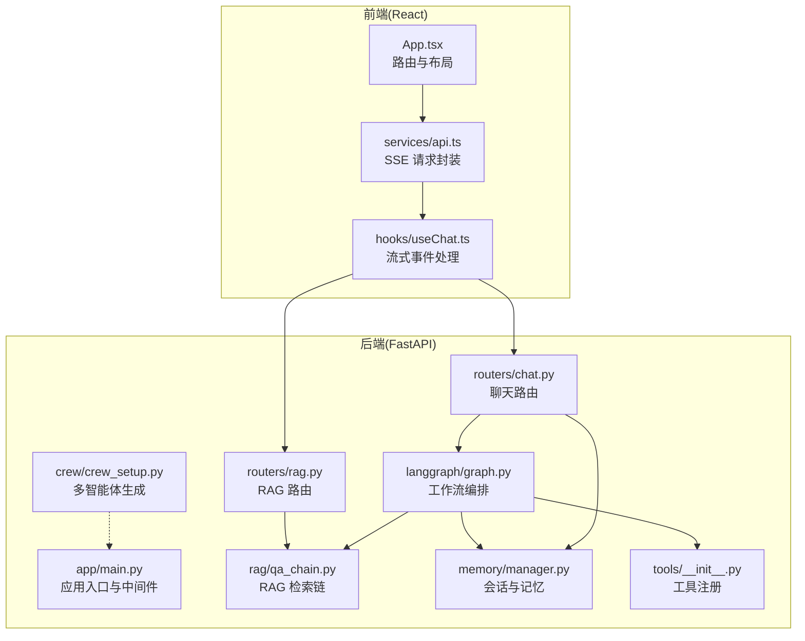
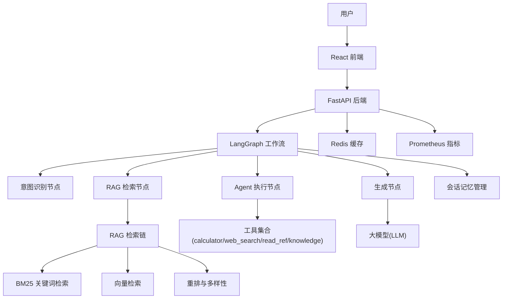
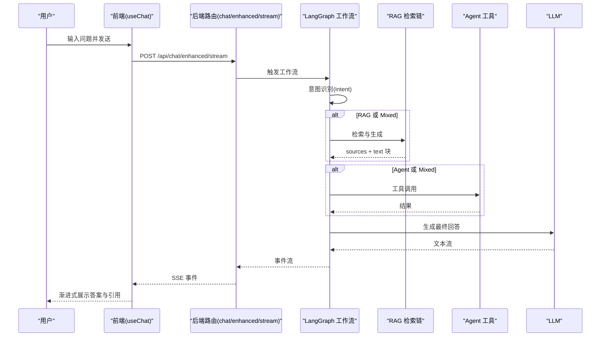
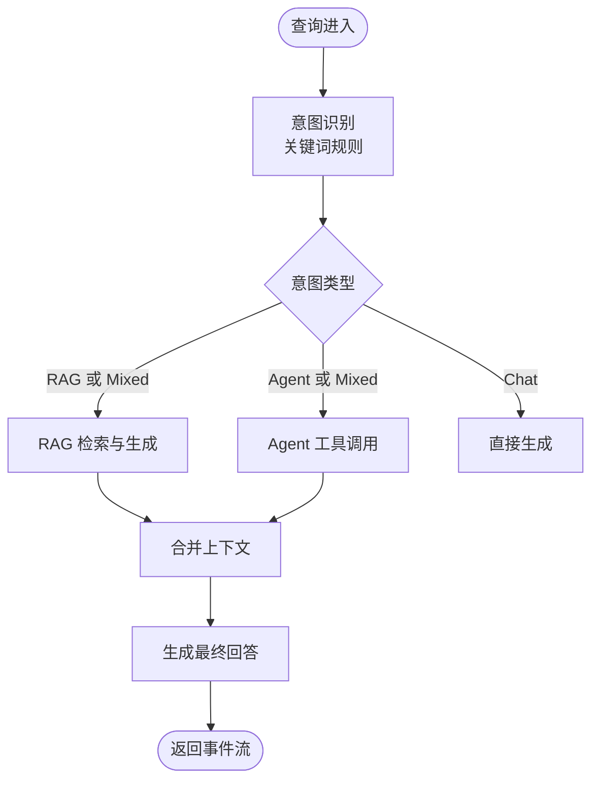
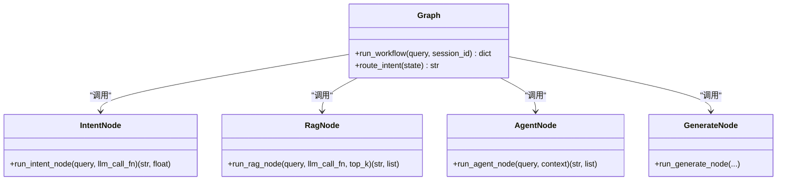
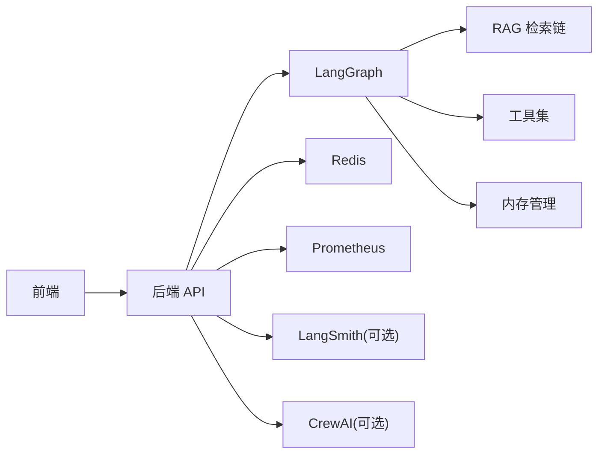

# 系统概览

<cite>
**本文档引用的文件**
- [README.md](file://README.md)
- [TECH_DESIGN.md](file://TECH_DESIGN.md)
- [backend/app/main.py](file://backend/app/main.py)
- [backend/app/routers/chat.py](file://backend/app/routers/chat.py)
- [backend/app/routers/rag.py](file://backend/app/routers/rag.py)
- [backend/app/langgraph/graph.py](file://backend/app/langgraph/graph.py)
- [backend/app/langgraph/nodes/intent.py](file://backend/app/langgraph/nodes/intent.py)
- [backend/app/langgraph/nodes/rag.py](file://backend/app/langgraph/nodes/rag.py)
- [backend/app/langgraph/nodes/agent.py](file://backend/app/langgraph/nodes/agent.py)
- [backend/app/rag/qa_chain.py](file://backend/app/rag/qa_chain.py)
- [backend/app/memory/manager.py](file://backend/app/memory/manager.py)
- [backend/app/tools/__init__.py](file://backend/app/tools/__init__.py)
- [backend/app/crew/crew_setup.py](file://backend/app/crew/crew_setup.py)
- [src/App.tsx](file://src/App.tsx)
- [src/services/api.ts](file://src/services/api.ts)
- [src/hooks/useChat.ts](file://src/hooks/useChat.ts)
</cite>

## 目录
1. [简介](#简介)
2. [项目结构](#项目结构)
3. [核心组件](#核心组件)
4. [架构总览](#架构总览)
5. [详细组件分析](#详细组件分析)
6. [依赖关系分析](#依赖关系分析)
7. [性能考量](#性能考量)
8. [故障排查指南](#故障排查指南)
9. [结论](#结论)
10. [附录](#附录)

## 简介
Aureon 是一个面向企业的人工智能知识库平台，提供生产级别的企业级 AI 搜索与知识智能能力。系统通过 React 前端与 FastAPI 后端协作，结合 LangGraph 工作流编排与 RAG 检索引擎，实现“意图识别—混合检索—多模态生成”的一体化问答体验。系统具备流式响应、渐进式引用、会话记忆、工具调用、可观测性、安全治理与成本控制等企业级特性。

## 项目结构
系统采用前后端分离架构，前端使用 React + Vite，后端使用 FastAPI，核心能力分布在以下模块：
- 前端模块：页面路由、SSE 事件处理、状态管理与 UI 组件
- 后端模块：API 路由、LangGraph 工作流、RAG 检索链、工具注册、内存管理、缓存与可观测性
- 集成模块：CrewAI 多智能体文章生成、MCP 工具协议、LangSmith 观察链路

**图表来源**
- [src/App.tsx:1-122](file://src/App.tsx#L1-L122)
- [src/services/api.ts:1-157](file://src/services/api.ts#L1-L157)
- [src/hooks/useChat.ts:1-280](file://src/hooks/useChat.ts#L1-L280)
- [backend/app/main.py:1-371](file://backend/app/main.py#L1-L371)
- [backend/app/routers/chat.py:1-107](file://backend/app/routers/chat.py#L1-L107)
- [backend/app/routers/rag.py:1-566](file://backend/app/routers/rag.py#L1-L566)
- [backend/app/langgraph/graph.py:1-163](file://backend/app/langgraph/graph.py#L1-L163)
- [backend/app/rag/qa_chain.py:1-800](file://backend/app/rag/qa_chain.py#L1-L800)
- [backend/app/memory/manager.py:1-130](file://backend/app/memory/manager.py#L1-L130)
- [backend/app/tools/__init__.py:1-23](file://backend/app/tools/__init__.py#L1-L23)
- [backend/app/crew/crew_setup.py:1-97](file://backend/app/crew/crew_setup.py#L1-L97)

**章节来源**
- [README.md:40-49](file://README.md#L40-L49)
- [TECH_DESIGN.md:24-58](file://TECH_DESIGN.md#L24-L58)

## 核心组件
- 前端 React 应用
  - 路由与页面：Landing、Dashboard、Search、Documents、Analytics、Admin、Architecture、CrewGenerator
  - SSE 封装：统一的流式请求与事件解析，支持背压控制与错误处理
  - 会话状态：本地存储会话 ID，流式累积文本，动态更新消息与引用
- 后端 FastAPI 服务
  - 中间件与安全：CORS、速率限制、结构化日志、安全头部
  - 路由模块：聊天流式、RAG 查询与流式、索引重建、文档上传、评估与基准
  - LangGraph 工作流：意图识别、RAG 检索、Agent 执行、生成节点与条件路由
  - RAG 引擎：混合检索（BM25 + 向量）、重排与多样性选择、负样本检测、一致性校验
  - 内存与工具：多层级对话记忆、工具注册与 MCP 协议
- LangGraph 工作流编排
  - 节点：意图识别、RAG 检索、Agent 执行、生成
  - 路由：根据意图类型并行或串行执行
- RAG 检索引擎
  - 检索：关键字检索 + 向量检索融合（RRF）、跨文章查询扩展、标题关键词加权
  - 生成：系统提示词模板、流式输出、引用溯源
  - 质量：负样本检测、一致性校验、缓存与统计
- CrewAI 多智能体
  - 研究员、写手、编辑角色，顺序流程，SSE 实时进度反馈

**章节来源**
- [src/App.tsx:9-108](file://src/App.tsx#L9-L108)
- [src/services/api.ts:25-94](file://src/services/api.ts#L25-L94)
- [src/hooks/useChat.ts:178-231](file://src/hooks/useChat.ts#L178-L231)
- [backend/app/main.py:68-371](file://backend/app/main.py#L68-L371)
- [backend/app/routers/chat.py:46-107](file://backend/app/routers/chat.py#L46-L107)
- [backend/app/routers/rag.py:86-267](file://backend/app/routers/rag.py#L86-L267)
- [backend/app/langgraph/graph.py:43-147](file://backend/app/langgraph/graph.py#L43-L147)
- [backend/app/rag/qa_chain.py:582-754](file://backend/app/rag/qa_chain.py#L582-L754)
- [backend/app/memory/manager.py:20-129](file://backend/app/memory/manager.py#L20-L129)
- [backend/app/tools/__init__.py:7-23](file://backend/app/tools/__init__.py#L7-L23)
- [backend/app/crew/crew_setup.py:50-97](file://backend/app/crew/crew_setup.py#L50-L97)

## 架构总览
系统采用“前端流式渲染 + 后端工作流编排 + 检索引擎”的三层架构。前端通过 SSE 与后端交互，后端根据查询意图选择 RAG 检索、Agent 工具调用或直接生成，并将结果与引用逐步返回给前端。

**图表来源**
- [README.md:42-49](file://README.md#L42-L49)
- [TECH_DESIGN.md:26-58](file://TECH_DESIGN.md#L26-L58)
- [backend/app/langgraph/graph.py:43-147](file://backend/app/langgraph/graph.py#L43-L147)
- [backend/app/rag/qa_chain.py:155-298](file://backend/app/rag/qa_chain.py#L155-L298)
- [backend/app/tools/__init__.py:7-23](file://backend/app/tools/__init__.py#L7-L23)
- [backend/app/memory/manager.py:42-50](file://backend/app/memory/manager.py#L42-L50)
- [backend/app/main.py:80-81](file://backend/app/main.py#L80-L81)

## 详细组件分析

### 前端组件分析
- 路由与布局
  - 使用 React Router 实现页面级代码分割，提升首屏性能
  - 导航栏与登录入口，支持国际化切换
- SSE 请求封装
  - 统一处理 data: 事件行，解析 JSON 并进行背压控制
  - 支持中断信号与错误回调
- 会话与消息
  - 文本缓冲与定时刷新，减少频繁渲染
  - 动态更新引用列表、工具调用状态与意图标签

**图表来源**
- [src/hooks/useChat.ts:178-231](file://src/hooks/useChat.ts#L178-L231)
- [src/services/api.ts:99-156](file://src/services/api.ts#L99-L156)
- [backend/app/routers/chat.py:66-93](file://backend/app/routers/chat.py#L66-L93)
- [backend/app/langgraph/graph.py:43-147](file://backend/app/langgraph/graph.py#L43-L147)
- [backend/app/rag/qa_chain.py:653-754](file://backend/app/rag/qa_chain.py#L653-L754)

**章节来源**
- [src/App.tsx:9-108](file://src/App.tsx#L9-L108)
- [src/services/api.ts:25-94](file://src/services/api.ts#L25-L94)
- [src/hooks/useChat.ts:178-231](file://src/hooks/useChat.ts#L178-L231)

### 后端组件分析
- 应用入口与中间件
  - 结构化日志、CORS、速率限制、健康检查、静态资源挂载
  - 启动时初始化数据库、特征开关、可观测性、安全、评估、成本、可靠性、知识平台、集成等表
- 路由模块
  - 聊天流式：基础聊天与增强聊天（含 LangGraph 意图路由）
  - RAG：查询、流式查询、索引重建、文档上传、评估与实验、健康检查、基准
- LangGraph 工作流
  - 意图识别：基于关键词规则快速判定
  - RAG 节点：调用检索链生成答案与引用
  - Agent 节点：组合上下文与工具调用
  - 生成节点：根据意图与上下文生成最终回答
- RAG 检索链
  - 混合检索：BM25 + 向量，RRF 融合，标题关键词加权
  - 跨文章查询：子查询展开 + RRF 融合 + 多样性选择
  - 负样本检测：LLM 分类器 + 关键词快速通道
  - 一致性校验：声明级分解与支持度统计
- 内存与工具
  - 多层级记忆：L0 对话、L1 事实、L2 场景、L3 画像
  - 工具注册：计算器、文件读取、知识检索、网络搜索（按配置）

**图表来源**
- [backend/app/langgraph/graph.py:32-147](file://backend/app/langgraph/graph.py#L32-L147)
- [backend/app/langgraph/nodes/intent.py:47-76](file://backend/app/langgraph/nodes/intent.py#L47-L76)
- [backend/app/langgraph/nodes/rag.py:11-27](file://backend/app/langgraph/nodes/rag.py#L11-L27)
- [backend/app/langgraph/nodes/agent.py:13-32](file://backend/app/langgraph/nodes/agent.py#L13-L32)
- [backend/app/rag/qa_chain.py:582-754](file://backend/app/rag/qa_chain.py#L582-L754)

**章节来源**
- [backend/app/main.py:68-371](file://backend/app/main.py#L68-L371)
- [backend/app/routers/chat.py:46-107](file://backend/app/routers/chat.py#L46-L107)
- [backend/app/routers/rag.py:86-267](file://backend/app/routers/rag.py#L86-L267)
- [backend/app/langgraph/graph.py:43-147](file://backend/app/langgraph/graph.py#L43-L147)
- [backend/app/rag/qa_chain.py:155-298](file://backend/app/rag/qa_chain.py#L155-L298)
- [backend/app/memory/manager.py:42-50](file://backend/app/memory/manager.py#L42-L50)
- [backend/app/tools/__init__.py:7-23](file://backend/app/tools/__init__.py#L7-L23)

### LangGraph 工作流类图

**图表来源**
- [backend/app/langgraph/graph.py:43-147](file://backend/app/langgraph/graph.py#L43-L147)
- [backend/app/langgraph/nodes/intent.py:73-76](file://backend/app/langgraph/nodes/intent.py#L73-L76)
- [backend/app/langgraph/nodes/rag.py:11-27](file://backend/app/langgraph/nodes/rag.py#L11-L27)
- [backend/app/langgraph/nodes/agent.py:13-32](file://backend/app/langgraph/nodes/agent.py#L13-L32)

## 依赖关系分析
- 前端对后端的依赖
  - 通过环境变量配置 API 地址，统一走 SSE 事件协议
  - 事件类型包括会话、文本、工具调用、引用、意图、完成与错误
- 后端内部依赖
  - LangGraph 依赖 RAG 检索链与工具集
  - RAG 检索链依赖向量存储与嵌入提供方
  - 工具集按配置动态注册，避免无索引时暴露检索工具
- 外部依赖与集成点
  - LLM 提供商（通过环境变量配置）
  - Redis 缓存与 Prometheus 指标
  - LangSmith 观察链路（可选）
  - CrewAI 多智能体（可选）

**图表来源**
- [src/services/api.ts:1-157](file://src/services/api.ts#L1-L157)
- [backend/app/main.py:80-81](file://backend/app/main.py#L80-L81)
- [backend/app/tools/__init__.py:7-23](file://backend/app/tools/__init__.py#L7-L23)
- [backend/app/crew/crew_setup.py:50-97](file://backend/app/crew/crew_setup.py#L50-L97)

**章节来源**
- [src/services/api.ts:1-157](file://src/services/api.ts#L1-L157)
- [backend/app/main.py:80-81](file://backend/app/main.py#L80-L81)
- [backend/app/tools/__init__.py:7-23](file://backend/app/tools/__init__.py#L7-L23)

## 性能考量
- 流式响应与首 Token 时间
  - SSE 流式传输，前端背压控制，降低渲染压力
  - RAG 流式查询先返回引用与分块，再流式输出文本，TTFT 低
- 检索性能
  - BM25 关键词检索近似常数时间，向量检索配合 RRF 与多样性选择
  - 跨文章查询启用子查询展开与标题关键词加权，提升召回
- 缓存策略
  - Redis 语义缓存命中后直接返回答案与引用，显著降低重复查询延迟
- 资源治理
  - 速率限制、CORS 白名单、安全头部、可观测性指标与健康检查

[本节为通用性能建议，无需特定文件引用]

## 故障排查指南
- 健康检查
  - 后端健康端点返回索引状态、模型配置与可用工具
- 错误处理
  - SSE 事件包含错误类型，前端捕获并显示
  - 后端结构化异常返回，便于定位
- 会话清理
  - 内存管理器定期清理超时会话，避免资源泄漏
- 索引重建
  - RAG 路由提供索引重建与状态检查，确保检索质量

**章节来源**
- [backend/app/main.py:340-347](file://backend/app/main.py#L340-L347)
- [backend/app/routers/rag.py:483-522](file://backend/app/routers/rag.py#L483-L522)
- [backend/app/memory/manager.py:104-127](file://backend/app/memory/manager.py#L104-L127)

## 结论
Aureon 通过“前端流式体验 + 后端工作流编排 + 企业级 RAG 引擎”的组合，实现了高性能、可扩展、可观测的企业知识智能平台。LangGraph 的意图路由与并行执行能力，结合 RAG 的混合检索与一致性校验，有效平衡了准确性与响应速度；前端的渐进式展示与工具调用反馈，提升了用户体验。系统在安全、成本、可靠性与可观测性方面均提供了企业级保障。

[本节为总结性内容，无需特定文件引用]

## 附录
- 快速启动
  - 前端：安装依赖后运行开发服务器
  - 后端：安装依赖并启动 Uvicorn
  - Docker：使用 Compose 一键启动
- 文档与基准
  - 架构、部署、产品文档与性能基准报告

**章节来源**
- [README.md:51-63](file://README.md#L51-L63)