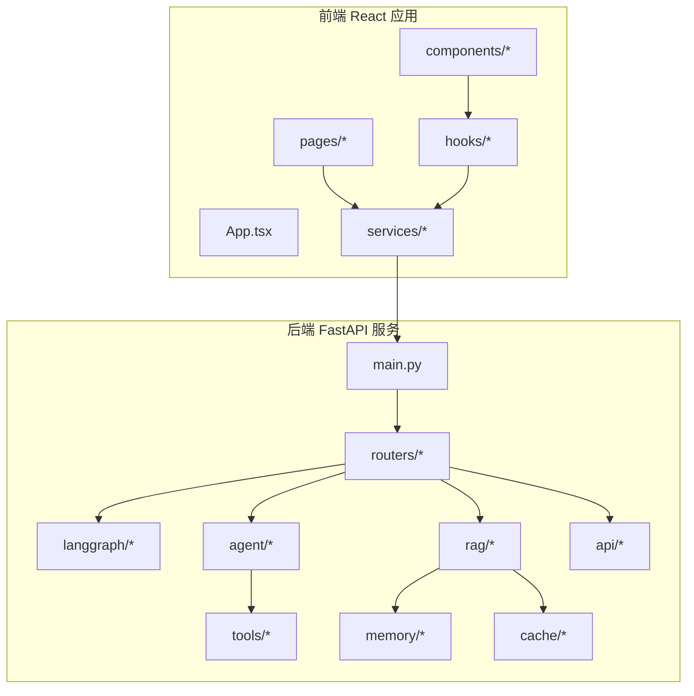
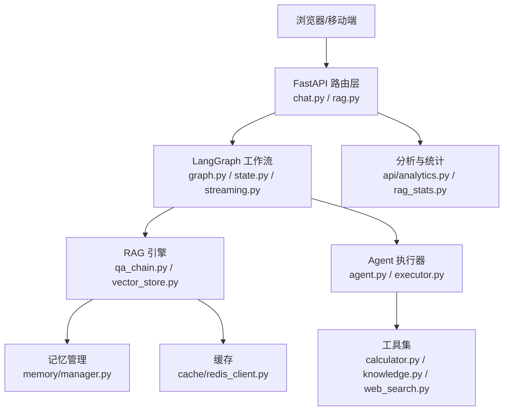
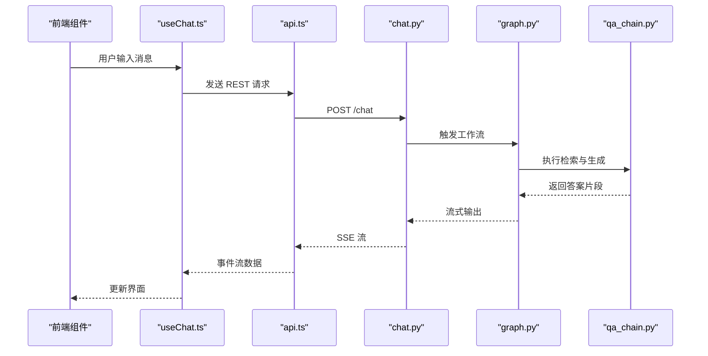
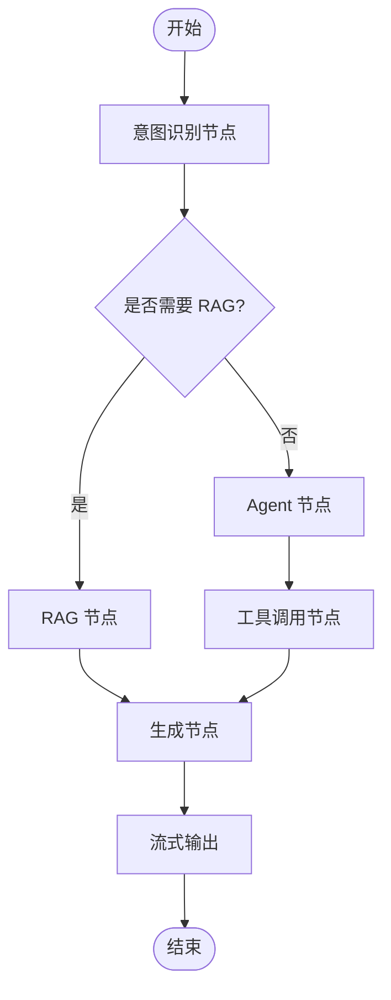
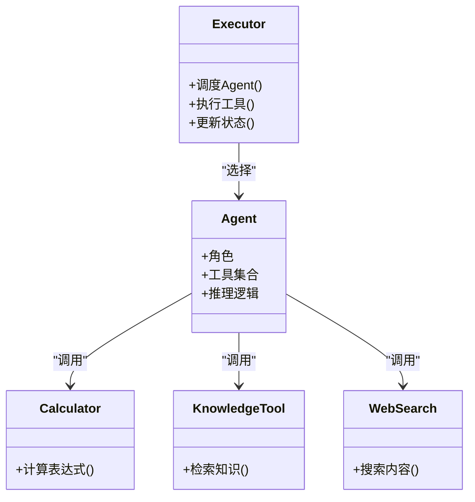
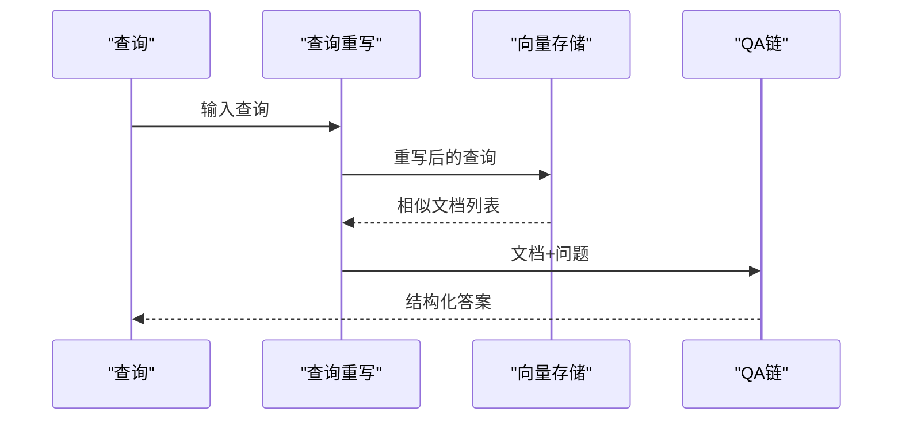
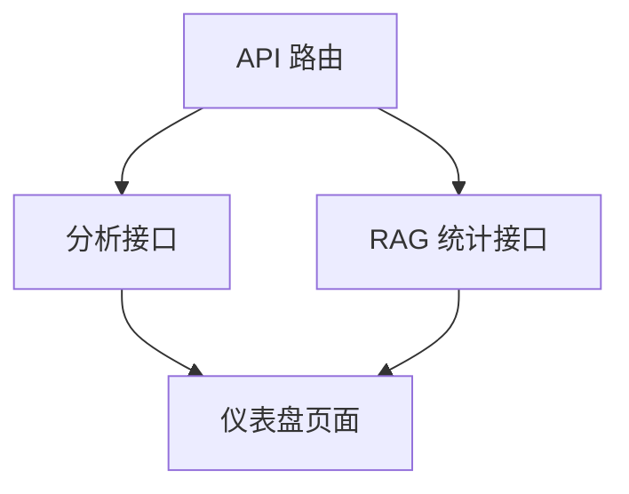
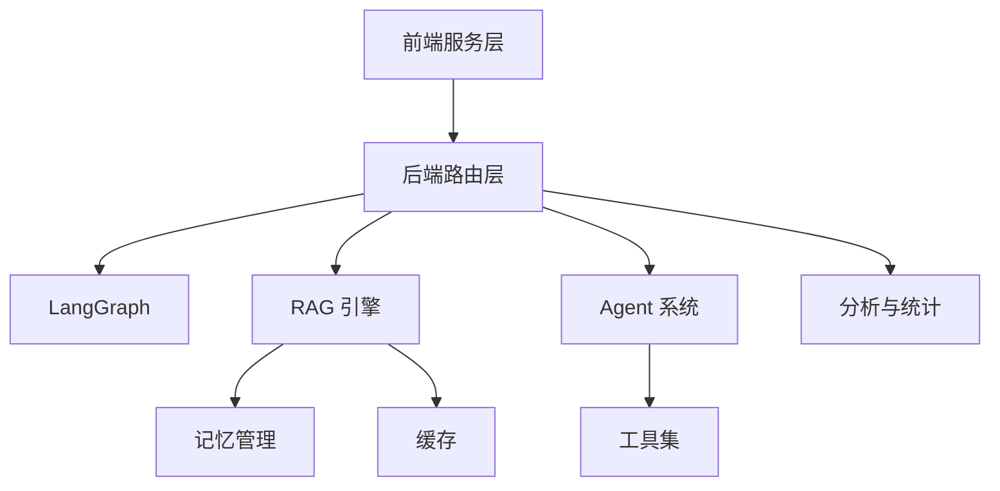

# 组件交互设计

<cite>
**本文引用的文件**
- [backend/app/main.py](file://backend/app/main.py)
- [backend/app/routers/chat.py](file://backend/app/routers/chat.py)
- [backend/app/routers/rag.py](file://backend/app/routers/rag.py)
- [backend/app/langgraph/graph.py](file://backend/app/langgraph/graph.py)
- [backend/app/langgraph/state.py](file://backend/app/langgraph/state.py)
- [backend/app/langgraph/streaming.py](file://backend/app/langgraph/streaming.py)
- [backend/app/rag/qa_chain.py](file://backend/app/rag/qa_chain.py)
- [backend/app/rag/vector_store.py](file://backend/app/rag/vector_store.py)
- [backend/app/tools/calculator.py](file://backend/app/tools/calculator.py)
- [backend/app/tools/knowledge.py](file://backend/app/tools/knowledge.py)
- [backend/app/tools/web_search.py](file://backend/app/tools/web_search.py)
- [backend/app/agent/agent.py](file://backend/app/agent/agent.py)
- [backend/app/agent/executor.py](file://backend/app/agent/executor.py)
- [backend/app/crew/crew_setup.py](file://backend/app/crew/crew_setup.py)
- [backend/app/crew/main_events.py](file://backend/app/crew/main_events.py)
- [backend/app/cache/redis_client.py](file://backend/app/cache/redis_client.py)
- [backend/app/memory/manager.py](file://backend/app/memory/manager.py)
- [backend/app/api/analytics.py](file://backend/app/api/analytics.py)
- [backend/app/api/rag_stats.py](file://backend/app/api/rag_stats.py)
- [src/services/api.ts](file://src/services/api.ts)
- [src/services/rag.ts](file://src/services/rag.ts)
- [src/hooks/useChat.ts](file://src/hooks/useChat.ts)
- [src/components/ChatWindow.tsx](file://src/components/ChatWindow.tsx)
- [src/components/search/StreamingAnswer.tsx](file://src/components/search/StreamingAnswer.tsx)
- [src/components/documents/DocumentUpload.tsx](file://src/components/documents/DocumentUpload.tsx)
- [src/pages/Search.tsx](file://src/pages/Search.tsx)
- [src/pages/Dashboard.tsx](file://src/pages/Dashboard.tsx)
- [src/App.tsx](file://src/App.tsx)
</cite>

## 目录
1. [引言](#引言)
2. [项目结构](#项目结构)
3. [核心组件](#核心组件)
4. [架构总览](#架构总览)
5. [详细组件分析](#详细组件分析)
6. [依赖关系分析](#依赖关系分析)
7. [性能考虑](#性能考虑)
8. [故障排除指南](#故障排除指南)
9. [结论](#结论)
10. [附录](#附录)

## 引言
本设计文档聚焦 Aureon 系统的组件交互设计，系统由前端 React 应用与后端 FastAPI 服务构成，后端包含 LangGraph 工作流引擎、RAG 引擎、Agent 系统、工具集、缓存与内存管理、分析与统计等模块。本文将详细说明：
- 前端与后端的通信机制：RESTful API 调用、WebSocket 连接、SSE 实时流
- LangGraph 工作流与 RAG 引擎的协作模式
- Agent 系统与工具集的交互方式
- 数据流向、状态管理与错误处理机制
- 组件间的依赖关系、接口契约与协议规范
- 提供详细的交互序列图与时序图

## 项目结构
系统采用前后端分离架构：
- 前端：React 应用，位于 src/ 目录，通过服务层封装与后端交互
- 后端：FastAPI 应用，位于 backend/app/ 目录，按功能域划分模块（langgraph、rag、agent、tools、memory、cache 等）



图表来源
- [backend/app/main.py](file://backend/app/main.py)
- [src/App.tsx](file://src/App.tsx)

章节来源
- [backend/app/main.py](file://backend/app/main.py)
- [src/App.tsx](file://src/App.tsx)

## 核心组件
- 前端服务层：封装 REST 请求、SSE 流式响应、WebSocket 连接，统一错误处理与状态管理
- 后端路由层：暴露 REST 接口，协调 LangGraph、RAG、Agent、工具与存储
- LangGraph 工作流：状态机驱动的消息路由、意图识别、RAG 生成与工具调用
- RAG 引擎：向量化检索、查询重写、QA 链与评估
- Agent 系统：基于工具的推理执行器，支持多 Agent 协作
- 工具集：计算器、知识库查询、网络搜索等外部能力
- 缓存与内存：Redis 缓存与分层记忆（L0-L3）管理
- 分析与统计：查询量、延迟、质量指标采集与展示

章节来源
- [backend/app/routers/chat.py](file://backend/app/routers/chat.py)
- [backend/app/routers/rag.py](file://backend/app/routers/rag.py)
- [backend/app/langgraph/graph.py](file://backend/app/langgraph/graph.py)
- [backend/app/rag/qa_chain.py](file://backend/app/rag/qa_chain.py)
- [backend/app/agent/executor.py](file://backend/app/agent/executor.py)
- [backend/app/tools/calculator.py](file://backend/app/tools/calculator.py)
- [backend/app/cache/redis_client.py](file://backend/app/cache/redis_client.py)
- [backend/app/memory/manager.py](file://backend/app/memory/manager.py)
- [backend/app/api/analytics.py](file://backend/app/api/analytics.py)
- [backend/app/api/rag_stats.py](file://backend/app/api/rag_stats.py)

## 架构总览
系统采用“前端服务层 + 后端 API 层 + 智能引擎层”的三层架构。前端通过 REST/SSE/WebSocket 与后端交互；后端通过路由聚合 LangGraph、RAG、Agent、工具与存储，形成闭环的数据与控制流。



图表来源
- [backend/app/routers/chat.py](file://backend/app/routers/chat.py)
- [backend/app/routers/rag.py](file://backend/app/routers/rag.py)
- [backend/app/langgraph/graph.py](file://backend/app/langgraph/graph.py)
- [backend/app/langgraph/state.py](file://backend/app/langgraph/state.py)
- [backend/app/langgraph/streaming.py](file://backend/app/langgraph/streaming.py)
- [backend/app/rag/qa_chain.py](file://backend/app/rag/qa_chain.py)
- [backend/app/rag/vector_store.py](file://backend/app/rag/vector_store.py)
- [backend/app/agent/agent.py](file://backend/app/agent/agent.py)
- [backend/app/agent/executor.py](file://backend/app/agent/executor.py)
- [backend/app/tools/calculator.py](file://backend/app/tools/calculator.py)
- [backend/app/tools/knowledge.py](file://backend/app/tools/knowledge.py)
- [backend/app/tools/web_search.py](file://backend/app/tools/web_search.py)
- [backend/app/memory/manager.py](file://backend/app/memory/manager.py)
- [backend/app/cache/redis_client.py](file://backend/app/cache/redis_client.py)
- [backend/app/api/analytics.py](file://backend/app/api/analytics.py)
- [backend/app/api/rag_stats.py](file://backend/app/api/rag_stats.py)

## 详细组件分析

### 前端与后端通信机制
- RESTful API 调用：前端服务层封装 fetch 请求，统一处理鉴权头、请求体与响应解析，并在 hooks 中集中管理状态与错误
- SSE 实时流：用于流式返回回答，前端监听事件流并增量渲染
- WebSocket 连接：用于双向实时交互（如会话状态同步），前端通过自定义 hook 管理连接生命周期



图表来源
- [src/hooks/useChat.ts](file://src/hooks/useChat.ts)
- [src/services/api.ts](file://src/services/api.ts)
- [backend/app/routers/chat.py](file://backend/app/routers/chat.py)
- [backend/app/langgraph/graph.py](file://backend/app/langgraph/graph.py)
- [backend/app/rag/qa_chain.py](file://backend/app/rag/qa_chain.py)

章节来源
- [src/hooks/useChat.ts](file://src/hooks/useChat.ts)
- [src/services/api.ts](file://src/services/api.ts)
- [src/components/ChatWindow.tsx](file://src/components/ChatWindow.tsx)
- [src/components/search/StreamingAnswer.tsx](file://src/components/search/StreamingAnswer.tsx)
- [backend/app/routers/chat.py](file://backend/app/routers/chat.py)

### LangGraph 工作流与 RAG 引擎协作
- 状态机：工作流以状态对象驱动，包含消息历史、当前节点、工具调用结果等
- 节点编排：意图识别、RAG 生成、Agent 决策与工具调用节点串联
- 流式输出：通过流式处理器将中间结果逐步返回给前端
- RAG 集成：检索到的上下文与用户问题共同参与生成



图表来源
- [backend/app/langgraph/state.py](file://backend/app/langgraph/state.py)
- [backend/app/langgraph/graph.py](file://backend/app/langgraph/graph.py)
- [backend/app/langgraph/streaming.py](file://backend/app/langgraph/streaming.py)
- [backend/app/rag/qa_chain.py](file://backend/app/rag/qa_chain.py)

章节来源
- [backend/app/langgraph/state.py](file://backend/app/langgraph/state.py)
- [backend/app/langgraph/graph.py](file://backend/app/langgraph/graph.py)
- [backend/app/langgraph/streaming.py](file://backend/app/langgraph/streaming.py)
- [backend/app/rag/qa_chain.py](file://backend/app/rag/qa_chain.py)

### Agent 系统与工具集交互
- Agent 定义：包含角色、提示词模板与工具集合
- 执行器：根据状态选择合适的 Agent 并调度工具
- 工具接口：计算器、知识库查询、网络搜索等工具遵循统一接口契约



图表来源
- [backend/app/agent/agent.py](file://backend/app/agent/agent.py)
- [backend/app/agent/executor.py](file://backend/app/agent/executor.py)
- [backend/app/tools/calculator.py](file://backend/app/tools/calculator.py)
- [backend/app/tools/knowledge.py](file://backend/app/tools/knowledge.py)
- [backend/app/tools/web_search.py](file://backend/app/tools/web_search.py)

章节来源
- [backend/app/agent/agent.py](file://backend/app/agent/agent.py)
- [backend/app/agent/executor.py](file://backend/app/agent/executor.py)
- [backend/app/tools/calculator.py](file://backend/app/tools/calculator.py)
- [backend/app/tools/knowledge.py](file://backend/app/tools/knowledge.py)
- [backend/app/tools/web_search.py](file://backend/app/tools/web_search.py)

### RAG 引擎与向量检索
- 向量存储：持久化嵌入向量，支持相似度检索
- QA 链：结合检索结果与提示工程生成最终回答
- 查询重写：优化原始查询以提升召回质量
- 评估与守卫：质量评估与内容安全守卫



图表来源
- [backend/app/rag/vector_store.py](file://backend/app/rag/vector_store.py)
- [backend/app/rag/qa_chain.py](file://backend/app/rag/qa_chain.py)

章节来源
- [backend/app/rag/vector_store.py](file://backend/app/rag/vector_store.py)
- [backend/app/rag/qa_chain.py](file://backend/app/rag/qa_chain.py)

### 缓存与记忆管理
- 缓存：Redis 客户端提供键值缓存，加速重复查询
- 记忆：分层记忆（L0 对话、L1 原子、L2 场景、L3 人物）支撑上下文与个性化

```mermaid
graph LR
Cache["Redis 缓存"] <- --> API["API 路由"]
Memory["记忆管理"] <- --> LGraph["LangGraph"]
API --> Cache
API --> Memory
```

图表来源
- [backend/app/cache/redis_client.py](file://backend/app/cache/redis_client.py)
- [backend/app/memory/manager.py](file://backend/app/memory/manager.py)
- [backend/app/routers/chat.py](file://backend/app/routers/chat.py)

章节来源
- [backend/app/cache/redis_client.py](file://backend/app/cache/redis_client.py)
- [backend/app/memory/manager.py](file://backend/app/memory/manager.py)
- [backend/app/routers/chat.py](file://backend/app/routers/chat.py)

### 分析与统计
- 查询量与延迟：采集查询次数、响应时间、成功率等指标
- RAG 质量：评估检索相关性、答案准确性与完整性
- 可视化：仪表盘页面展示关键指标



图表来源
- [backend/app/api/analytics.py](file://backend/app/api/analytics.py)
- [backend/app/api/rag_stats.py](file://backend/app/api/rag_stats.py)
- [src/pages/Dashboard.tsx](file://src/pages/Dashboard.tsx)

章节来源
- [backend/app/api/analytics.py](file://backend/app/api/analytics.py)
- [backend/app/api/rag_stats.py](file://backend/app/api/rag_stats.py)
- [src/pages/Dashboard.tsx](file://src/pages/Dashboard.tsx)

## 依赖关系分析
- 前端依赖后端服务层提供的接口契约，通过 hooks 封装状态与副作用
- 后端路由依赖 LangGraph、RAG、Agent、工具与存储模块
- 工具集与 RAG 引擎相互独立但可被 Agent 与 LangGraph 调用
- 缓存与记忆为上层模块提供基础设施支持



图表来源
- [src/services/api.ts](file://src/services/api.ts)
- [backend/app/routers/chat.py](file://backend/app/routers/chat.py)
- [backend/app/langgraph/graph.py](file://backend/app/langgraph/graph.py)
- [backend/app/rag/qa_chain.py](file://backend/app/rag/qa_chain.py)
- [backend/app/agent/executor.py](file://backend/app/agent/executor.py)
- [backend/app/tools/calculator.py](file://backend/app/tools/calculator.py)
- [backend/app/memory/manager.py](file://backend/app/memory/manager.py)
- [backend/app/cache/redis_client.py](file://backend/app/cache/redis_client.py)
- [backend/app/api/analytics.py](file://backend/app/api/analytics.py)

章节来源
- [src/services/api.ts](file://src/services/api.ts)
- [backend/app/routers/chat.py](file://backend/app/routers/chat.py)
- [backend/app/langgraph/graph.py](file://backend/app/langgraph/graph.py)
- [backend/app/rag/qa_chain.py](file://backend/app/rag/qa_chain.py)
- [backend/app/agent/executor.py](file://backend/app/agent/executor.py)
- [backend/app/tools/calculator.py](file://backend/app/tools/calculator.py)
- [backend/app/memory/manager.py](file://backend/app/memory/manager.py)
- [backend/app/cache/redis_client.py](file://backend/app/cache/redis_client.py)
- [backend/app/api/analytics.py](file://backend/app/api/analytics.py)

## 性能考虑
- 流式传输：优先使用 SSE/流式响应减少首字节延迟
- 缓存策略：对高频查询与中间结果进行缓存，降低数据库与 LLM 调用频率
- 并行化：LangGraph 多节点并行执行与工具调用并发
- 资源隔离：Agent 与工具调用限制超时与重试，避免级联失败
- 监控与告警：通过分析接口与日志体系监控性能瓶颈

## 故障排除指南
- 前端错误处理：统一拦截网络异常、解析错误与业务错误，提供用户友好提示
- 后端异常处理：路由层捕获异常并返回标准错误码与消息
- 日志与追踪：为关键路径添加日志与追踪 ID，便于定位问题
- 缓存与降级：缓存失效或下游不可用时启用降级策略

章节来源
- [src/services/api.ts](file://src/services/api.ts)
- [backend/app/routers/chat.py](file://backend/app/routers/chat.py)

## 结论
Aureon 系统通过清晰的前后端分层与模块化设计，实现了从用户交互到智能引擎的完整闭环。LangGraph 工作流与 RAG 引擎的协同、Agent 系统与工具集的解耦、以及缓存与记忆的基础设施支撑，共同构成了高性能、可扩展、可观测的智能问答平台。建议持续完善监控与自动化测试，保障系统稳定性与质量。

## 附录
- 接口契约与协议规范
  - REST 接口：统一的请求头、鉴权方案、响应格式与错误码约定
  - SSE 协议：事件类型、数据格式与断线重连策略
  - WebSocket 协议：握手、心跳与消息编解码规范
- 数据模型与状态管理
  - 状态对象结构、字段含义与转换规则
  - 前端状态与后端状态的映射关系
- 最佳实践
  - 错误处理与重试策略
  - 性能优化与资源管理
  - 安全与隐私保护措施