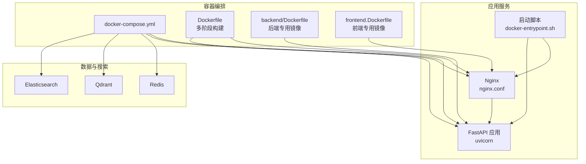
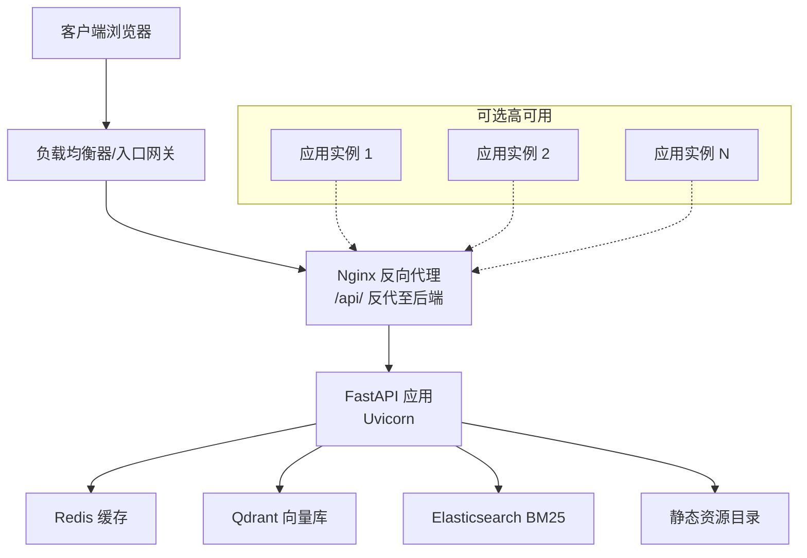
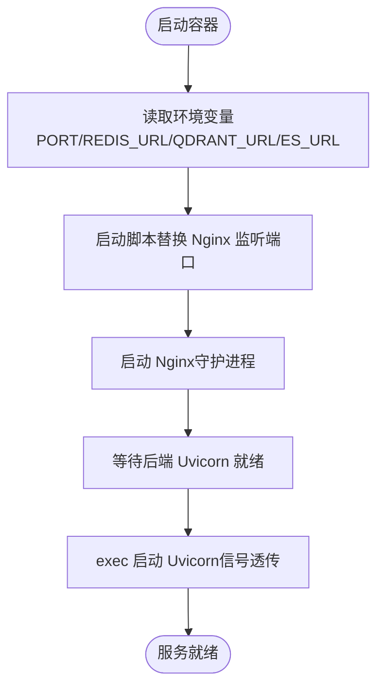
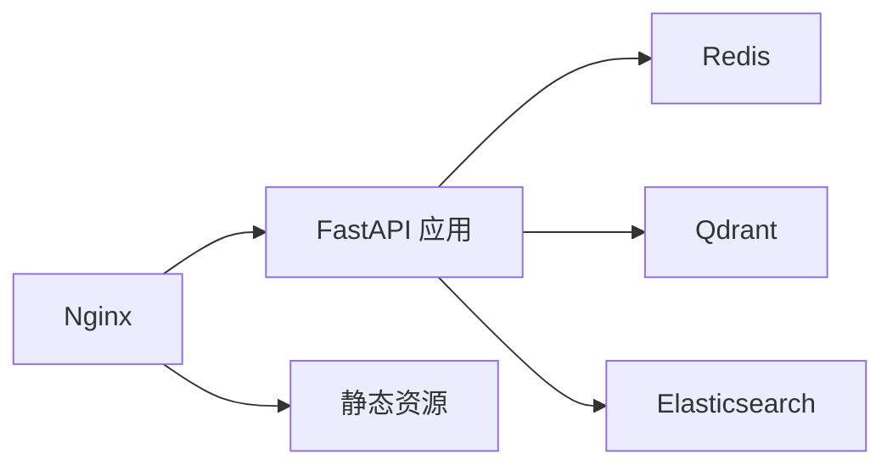

# 部署架构

<cite>
**本文引用的文件**
- [docker-compose.yml](file://docker-compose.yml)
- [Dockerfile](file://Dockerfile)
- [backend/Dockerfile](file://backend/Dockerfile)
- [frontend.Dockerfile](file://frontend.Dockerfile)
- [nginx.conf](file://nginx.conf)
- [docker-entrypoint.sh](file://docker-entrypoint.sh)
- [railway.json](file://railway.json)
- [.github/workflows/ci.yml](file://.github/workflows/ci.yml)
- [backend/.env](file://backend/.env)
- [backend/requirements.txt](file://backend/requirements.txt)
- [backend/app/main.py](file://backend/app/main.py)
- [docs/deployment/docker-setup.md](file://docs/deployment/docker-setup.md)
- [README.md](file://README.md)
- [docs/architecture/system-overview.md](file://docs/architecture/system-overview.md)
</cite>

## 目录
1. [简介](#简介)
2. [项目结构](#项目结构)
3. [核心组件](#核心组件)
4. [架构总览](#架构总览)
5. [详细组件分析](#详细组件分析)
6. [依赖分析](#依赖分析)
7. [性能考虑](#性能考虑)
8. [故障排查指南](#故障排查指南)
9. [结论](#结论)
10. [附录](#附录)

## 简介
本文件面向 Aureon 系统的生产级部署，系统采用容器化与微服务架构，结合 Nginx 反向代理、多阶段 Docker 构建、健康检查与重启策略，并通过 CI/CD 实现自动化流水线。部署拓扑包含前端静态站点、后端 FastAPI 服务、缓存与向量/搜索引擎等基础设施，支持高可用与可观测性。

## 项目结构
- 前端使用 Vite + React 构建，产物由 Nginx 提供静态服务。
- 后端基于 Python 3.12 的 FastAPI 应用，通过 Uvicorn 托管，Nginx 作为反向代理。
- 数据层包含 Redis 缓存、Qdrant 向量数据库与 Elasticsearch BM25 后端。
- 使用 Docker Compose 进行本地编排；Railway 提供云原生部署配置；GitHub Actions 支持 CI 流水线。

**图表来源**
- [docker-compose.yml:1-64](file://docker-compose.yml#L1-L64)
- [Dockerfile:1-54](file://Dockerfile#L1-L54)
- [backend/Dockerfile:1-29](file://backend/Dockerfile#L1-L29)
- [frontend.Dockerfile:1-28](file://frontend.Dockerfile#L1-L28)
- [nginx.conf:1-36](file://nginx.conf#L1-L36)
- [docker-entrypoint.sh:1-15](file://docker-entrypoint.sh#L1-L15)

**章节来源**
- [docker-compose.yml:1-64](file://docker-compose.yml#L1-L64)
- [Dockerfile:1-54](file://Dockerfile#L1-L54)
- [backend/Dockerfile:1-29](file://backend/Dockerfile#L1-L29)
- [frontend.Dockerfile:1-28](file://frontend.Dockerfile#L1-L28)
- [nginx.conf:1-36](file://nginx.conf#L1-L36)
- [docker-entrypoint.sh:1-15](file://docker-entrypoint.sh#L1-L15)
- [docs/architecture/system-overview.md:1-51](file://docs/architecture/system-overview.md#L1-L51)

## 核心组件
- 容器编排与服务发现
  - 使用 Docker Compose 管理多服务生命周期与依赖顺序，定义健康检查与重启策略。
  - 服务间通过内部网络通信，端口映射用于本地开发与测试。
- 反向代理与静态资源
  - Nginx 提供静态资源缓存、Gzip 压缩与 API 反向代理，支持 SSE 流式传输。
- 应用服务
  - FastAPI 应用通过 Uvicorn 托管，提供 REST 接口与 SSE 流式响应。
  - 启动脚本负责动态端口替换与进程信号传递，适配平台路由。
- 数据与搜索
  - Redis 用于语义缓存与会话状态。
  - Qdrant 作为向量存储，Elasticsearch 作为 BM25 关键词检索后端。
- CI/CD 与部署
  - GitHub Actions 执行前端与后端测试与构建。
  - Railway 提供容器化部署、副本数、重启策略与健康检查配置。

**章节来源**
- [docker-compose.yml:1-64](file://docker-compose.yml#L1-L64)
- [nginx.conf:1-36](file://nginx.conf#L1-L36)
- [backend/app/main.py:340-347](file://backend/app/main.py#L340-L347)
- [docker-entrypoint.sh:1-15](file://docker-entrypoint.sh#L1-L15)
- [.github/workflows/ci.yml:1-53](file://.github/workflows/ci.yml#L1-L53)
- [railway.json:1-16](file://railway.json#L1-L16)

## 架构总览
下图展示生产环境部署拓扑与流量走向：

**图表来源**
- [docker-compose.yml:1-64](file://docker-compose.yml#L1-L64)
- [nginx.conf:17-30](file://nginx.conf#L17-L30)
- [backend/app/main.py:340-347](file://backend/app/main.py#L340-L347)

## 详细组件分析

### 容器化与编排策略
- 多阶段构建
  - 前端构建阶段：使用 Node.js 基础镜像构建静态资源。
  - 后端阶段：Python 3.12 Slim 基础镜像，安装系统依赖与 Python 依赖，预下载嵌入模型以降低冷启动延迟。
  - 最终镜像：合并前端静态文件与 Nginx 配置，暴露 80 端口。
- 单体镜像 vs 分离镜像
  - 主 Dockerfile 将前端与后端打包到同一镜像，便于快速部署。
  - backend/Dockerfile 与 frontend.Dockerfile 提供后端与前端独立镜像方案，适合多仓库或多团队协作。
- 端口与环境变量
  - 主镜像默认监听 80，启动脚本根据平台环境变量动态替换 Nginx 监听端口。
  - 通过 env_file 与 environment 字段注入后端运行所需环境变量（如 Redis、Qdrant、Elasticsearch 地址）。
- 健康检查与重启
  - Redis、Qdrant、Elasticsearch 设置健康检查与重启策略。
  - 应用服务依赖健康状态，确保在缓存与搜索服务就绪后再启动。

**图表来源**
- [docker-entrypoint.sh:1-15](file://docker-entrypoint.sh#L1-L15)
- [Dockerfile:48-54](file://Dockerfile#L48-L54)
- [docker-compose.yml:19-37](file://docker-compose.yml#L19-L37)

**章节来源**
- [Dockerfile:1-54](file://Dockerfile#L1-L54)
- [backend/Dockerfile:1-29](file://backend/Dockerfile#L1-L29)
- [frontend.Dockerfile:1-28](file://frontend.Dockerfile#L1-L28)
- [docker-entrypoint.sh:1-15](file://docker-entrypoint.sh#L1-L15)
- [docker-compose.yml:1-64](file://docker-compose.yml#L1-L64)

### 微服务架构与部署模式
- 当前形态
  - 单体镜像包含前端静态资源与后端 API，适合中小型部署与演示场景。
- 建议演进
  - 将前端与后端拆分为独立镜像与服务，通过 Nginx 或 API 网关统一入口。
  - 后端按功能模块拆分（如 RAG、安全、成本、可观测性等子服务），提升可维护性与弹性伸缩能力。
- 依赖与耦合
  - 后端对 Redis、Qdrant、Elasticsearch 存在强依赖，建议在编排中设置健康检查与依赖顺序，避免级联失败。

**章节来源**
- [docs/architecture/system-overview.md:24-28](file://docs/architecture/system-overview.md#L24-L28)
- [backend/app/main.py:350-362](file://backend/app/main.py#L350-L362)

### 负载均衡与高可用配置
- 入口与反向代理
  - Nginx 作为单一入口，处理静态资源与 API 反代，开启 Gzip 与长连接超时以支持 SSE。
- 高可用建议
  - 在入口层部署多实例 Nginx 或使用云厂商负载均衡器，实现请求分发与故障切换。
  - 应用层通过副本数扩展（参考 Railway 配置），并启用健康检查与自动重启。
  - 数据层（Redis、Qdrant、Elasticsearch）建议使用集群模式与持久化卷，配合健康检查与自动恢复。

**章节来源**
- [nginx.conf:1-36](file://nginx.conf#L1-L36)
- [railway.json:7-14](file://railway.json#L7-L14)

### Nginx 反向代理与静态资源
- 配置要点
  - 监听 80 端口，根目录指向前端静态文件。
  - 对 /assets/ 开启长期缓存与 immutable 标记。
  - /api/ 路径反代至后端 8000 端口，启用升级头以支持 SSE，关闭代理缓冲，设置长读取超时。
  - SPA 回退：非文件路径统一返回 index.html。
- 动态端口适配
  - 启动脚本根据 PORT 环境变量动态修改 Nginx 监听端口，适配平台路由。

**章节来源**
- [nginx.conf:1-36](file://nginx.conf#L1-L36)
- [docker-entrypoint.sh:4-8](file://docker-entrypoint.sh#L4-L8)

### 环境变量与 Secrets 管理
- 后端环境变量
  - LLM 相关：API Key、Base URL、模型名。
  - 嵌入与搜索：DashScope、Tavily 等第三方密钥。
  - 博客同步：URL 与开关。
- 管理建议
  - 生产环境使用平台 Secrets 管理（如 Docker Secret、Kubernetes Secret、平台环境变量管理器）。
  - 避免将敏感信息硬编码在镜像或配置文件中，通过 env_file 注入或平台注入机制管理。

**章节来源**
- [backend/.env:1-13](file://backend/.env#L1-L13)
- [backend/app/main.py:73-78](file://backend/app/main.py#L73-L78)

### CI/CD 流水线与自动化部署
- CI 流程
  - 前端：Node.js 环境安装依赖、Linter、测试、构建。
  - 后端：Python 环境安装依赖与测试框架，执行测试套件。
- 部署建议
  - 在 CI 成功后触发镜像构建与推送，随后通过编排工具进行滚动更新。
  - 结合健康检查与就绪探针，实现零停机发布。
  - 回滚策略：记录镜像标签，出现异常时回滚至上一个稳定版本。

**章节来源**
- [.github/workflows/ci.yml:1-53](file://.github/workflows/ci.yml#L1-L53)

### 监控告警、日志与性能调优
- 监控与指标
  - 后端已集成 Prometheus 指标端点，可用于采集请求量、错误率、延迟等关键指标。
  - 观测性接口提供查询追踪与统计，便于定位性能瓶颈。
- 日志
  - 使用结构化日志输出，支持控制台与 JSON 渲染，便于日志聚合与检索。
- 性能优化
  - 预下载嵌入模型减少冷启动时间。
  - Nginx 启用 Gzip 与静态资源缓存，降低带宽与延迟。
  - SSE 通道禁用代理缓冲，保证流式响应实时性。
  - 合理设置 Elasticsearch JVM 内存与 Qdrant 存储卷，避免 OOM。

**章节来源**
- [backend/app/main.py:16-20](file://backend/app/main.py#L16-L20)
- [backend/app/main.py:80-81](file://backend/app/main.py#L80-L81)
- [backend/app/main.py:100-124](file://backend/app/main.py#L100-L124)
- [Dockerfile:32-34](file://Dockerfile#L32-L34)
- [nginx.conf:7-9](file://nginx.conf#L7-L9)
- [nginx.conf:12-15](file://nginx.conf#L12-L15)
- [nginx.conf:28-29](file://nginx.conf#L28-L29)

## 依赖分析
- 组件耦合
  - 应用服务对 Redis、Qdrant、Elasticsearch 存在直接依赖，编排中应确保其健康状态。
  - 前端静态资源与后端 API 通过 Nginx 统一入口访问。
- 外部依赖
  - LLM 与第三方搜索/嵌入服务需要稳定的网络与密钥管理。
- 潜在风险
  - 单体镜像部署简化了运维，但在多团队协作或大规模扩展时，建议拆分镜像与服务，降低耦合度。

**图表来源**
- [docker-compose.yml:1-64](file://docker-compose.yml#L1-L64)
- [nginx.conf:1-36](file://nginx.conf#L1-L36)

**章节来源**
- [docker-compose.yml:1-64](file://docker-compose.yml#L1-L64)
- [backend/requirements.txt:1-57](file://backend/requirements.txt#L1-L57)

## 性能考虑
- 启动与冷启动
  - 预下载嵌入模型，避免首次请求的模型加载延迟。
- 网络与传输
  - 启用 Gzip 压缩与静态资源缓存，降低带宽占用。
  - SSE 通道禁用缓冲并设置长读取超时，保障流式响应。
- 计算与存储
  - 合理设置 Elasticsearch JVM 内存参数，避免频繁 GC。
  - Qdrant 与 Chroma 的持久化目录挂载到独立卷，确保数据安全与性能。

**章节来源**
- [Dockerfile:32-34](file://Dockerfile#L32-L34)
- [nginx.conf:7-9](file://nginx.conf#L7-L9)
- [nginx.conf:12-15](file://nginx.conf#L12-L15)
- [nginx.conf:28-29](file://nginx.conf#L28-L29)

## 故障排查指南
- 健康检查失败
  - 检查 Redis、Qdrant、Elasticsearch 的健康检查与日志，确认端口可达与资源充足。
- 启动脚本端口问题
  - 确认 PORT 环境变量是否正确传递，启动脚本是否成功替换 Nginx 监听端口。
- API 无法访问
  - 检查 Nginx 反代配置与后端端口映射，确认 /api/ 路由是否正确转发。
- SSE 流中断
  - 确认代理缓冲已关闭、长读取超时已设置，且客户端网络稳定。
- 指标与日志
  - 通过 /metrics 端点与结构化日志定位异常，结合观测性接口查看追踪与统计。

**章节来源**
- [docker-entrypoint.sh:4-8](file://docker-entrypoint.sh#L4-L8)
- [nginx.conf:17-30](file://nginx.conf#L17-L30)
- [backend/app/main.py:80-81](file://backend/app/main.py#L80-L81)
- [backend/app/main.py:100-124](file://backend/app/main.py#L100-L124)

## 结论
Aureon 当前采用单体容器化部署，结合 Nginx 反向代理与多阶段构建，满足快速交付与演示需求。生产环境中建议进一步拆分镜像与服务、引入多副本与负载均衡、完善监控与日志体系，并通过 CI/CD 实现自动化与可回滚的发布流程，以达到高可用与高性能目标。

## 附录
- 快速开始与服务对照
  - 参考部署文档中的服务端口与环境变量示例，完成本地验证与生产准备。
- 技术栈与数据流
  - 前后端技术栈与数据流详见架构概览文档，便于理解各组件职责与交互。

**章节来源**
- [docs/deployment/docker-setup.md:1-53](file://docs/deployment/docker-setup.md#L1-L53)
- [README.md:40-49](file://README.md#L40-L49)
- [docs/architecture/system-overview.md:1-51](file://docs/architecture/system-overview.md#L1-L51)