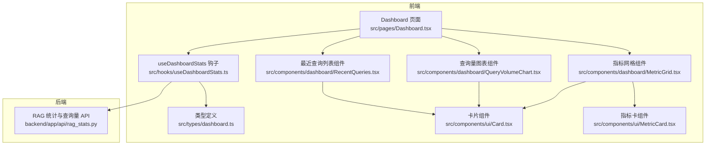
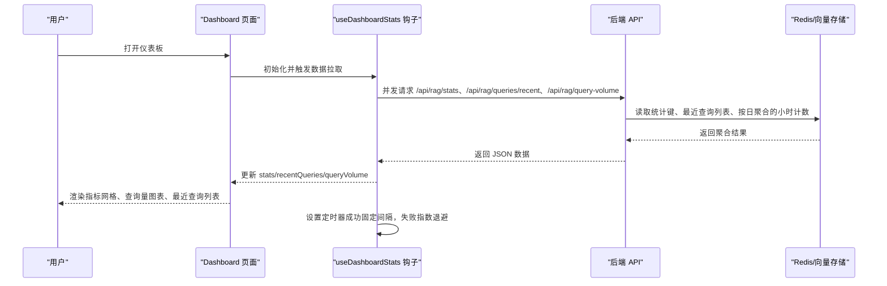
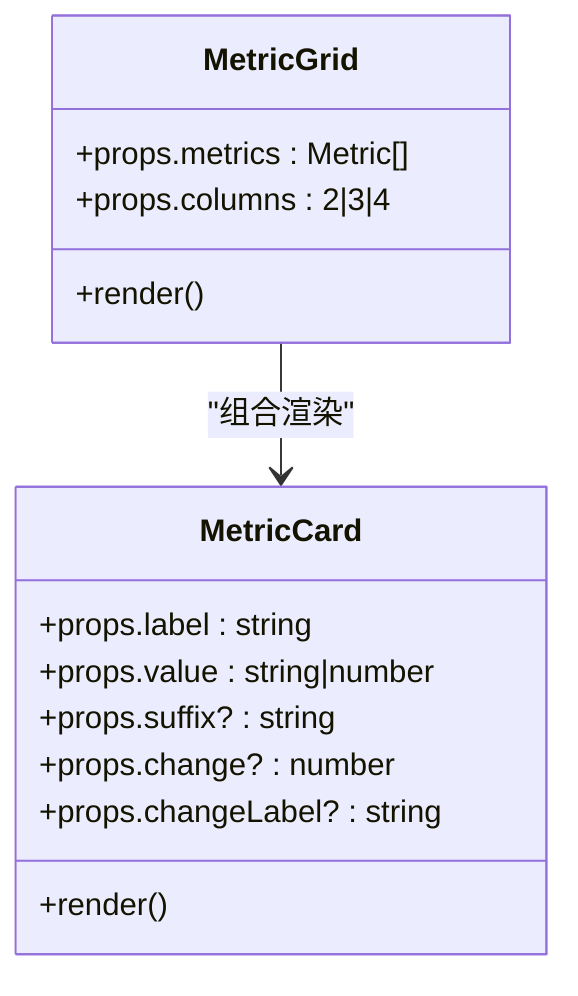
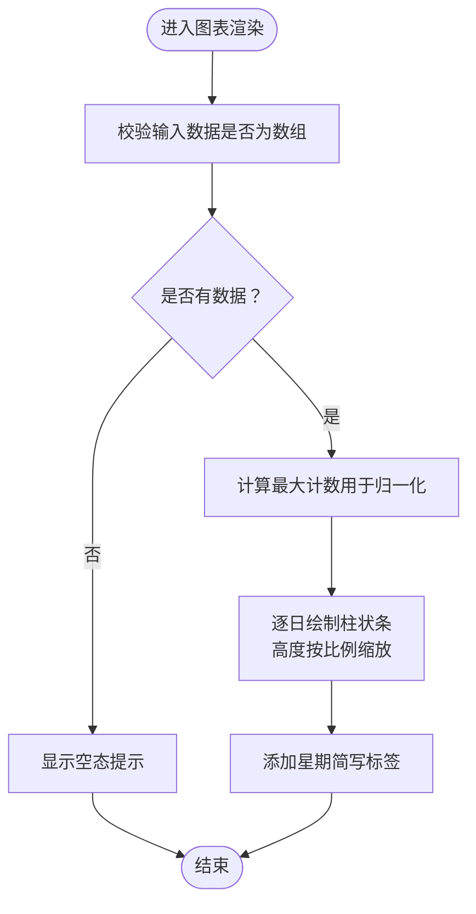
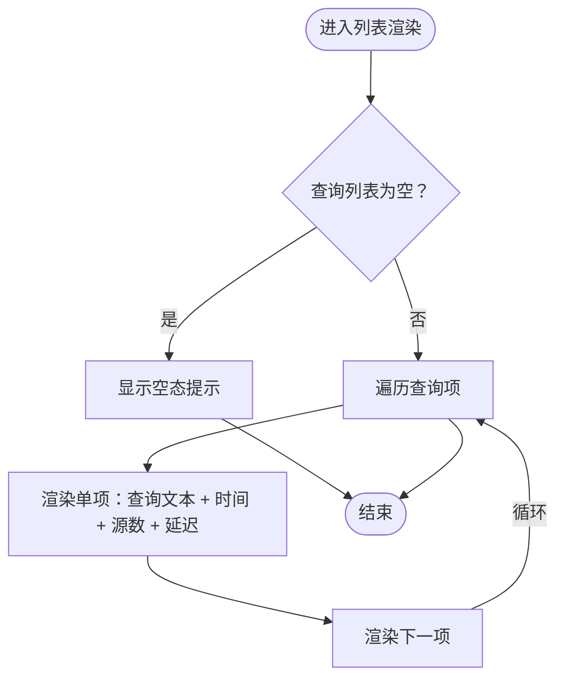
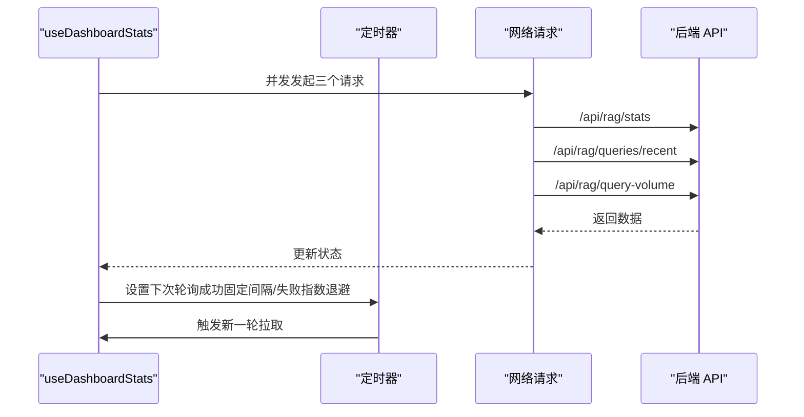
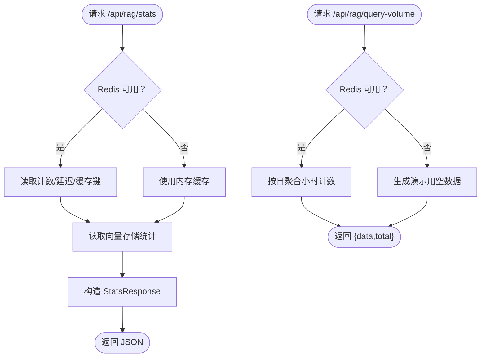
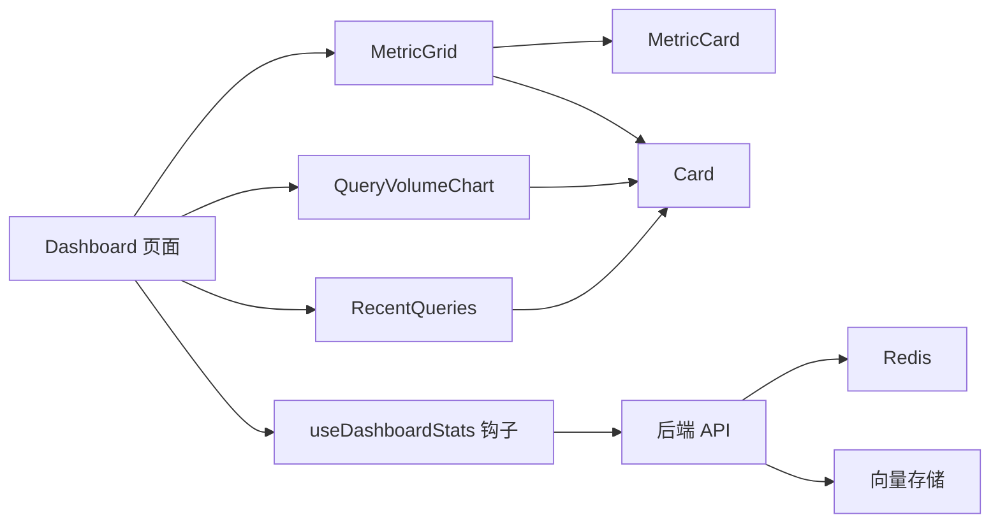

# 仪表板与分析

<cite>
**本文引用的文件**
- [src/components/dashboard/MetricGrid.tsx](file://src/components/dashboard/MetricGrid.tsx)
- [src/components/dashboard/QueryVolumeChart.tsx](file://src/components/dashboard/QueryVolumeChart.tsx)
- [src/components/dashboard/RecentQueries.tsx](file://src/components/dashboard/RecentQueries.tsx)
- [src/hooks/useDashboardStats.ts](file://src/hooks/useDashboardStats.ts)
- [src/types/dashboard.ts](file://src/types/dashboard.ts)
- [src/pages/Dashboard.tsx](file://src/pages/Dashboard.tsx)
- [src/components/ui/MetricCard.tsx](file://src/components/ui/MetricCard.tsx)
- [src/components/ui/Card.tsx](file://src/components/ui/Card.tsx)
- [backend/app/api/rag_stats.py](file://backend/app/api/rag_stats.py)
- [src/services/api.ts](file://src/services/api.ts)
</cite>

## 目录
1. [引言](#引言)
2. [项目结构](#项目结构)
3. [核心组件](#核心组件)
4. [架构总览](#架构总览)
5. [详细组件分析](#详细组件分析)
6. [依赖分析](#依赖分析)
7. [性能考虑](#性能考虑)
8. [故障排查指南](#故障排查指南)
9. [结论](#结论)
10. [附录](#附录)

## 引言
本文件面向开发者与产品团队，系统化梳理 Aureon 仪表板与分析模块的设计与实现，覆盖布局系统、响应式设计、组件组合模式；关键指标网格的计算、实时更新与视觉呈现；查询量图表的数据可视化、时间序列分析与交互；最近查询列表的管理与趋势洞察；以及数据分析接口的实现细节（数据采集、聚合计算与 API 设计）。同时给出图表库集成建议、主题定制与可访问性支持策略，并提供扩展分析维度、自定义指标与优化数据展示的实践指南。

## 项目结构
仪表板与分析功能由前端页面、数据钩子、UI 组件与后端 API 共同构成，采用“页面容器 + 自定义 Hook + 可复用 UI 组件”的分层组织方式，确保高内聚、低耦合与良好可测试性。

**图表来源**
- [src/pages/Dashboard.tsx:56-148](file://src/pages/Dashboard.tsx#L56-L148)
- [src/hooks/useDashboardStats.ts:19-93](file://src/hooks/useDashboardStats.ts#L19-L93)
- [src/components/dashboard/MetricGrid.tsx:16-30](file://src/components/dashboard/MetricGrid.tsx#L16-L30)
- [src/components/dashboard/QueryVolumeChart.tsx:13-50](file://src/components/dashboard/QueryVolumeChart.tsx#L13-L50)
- [src/components/dashboard/RecentQueries.tsx:8-52](file://src/components/dashboard/RecentQueries.tsx#L8-L52)
- [src/components/ui/Card.tsx:9-22](file://src/components/ui/Card.tsx#L9-L22)
- [src/components/ui/MetricCard.tsx:11-47](file://src/components/ui/MetricCard.tsx#L11-L47)
- [backend/app/api/rag_stats.py:152-425](file://backend/app/api/rag_stats.py#L152-L425)

**章节来源**
- [src/pages/Dashboard.tsx:56-148](file://src/pages/Dashboard.tsx#L56-L148)
- [src/hooks/useDashboardStats.ts:19-93](file://src/hooks/useDashboardStats.ts#L19-L93)

## 核心组件
- 指标网格（MetricGrid）：基于 Tailwind 响应式类实现网格布局，支持 2/3/4 列切换，内部使用 MetricCard 渲染单个指标。
- 查询量图表（QueryVolumeChart）：按日聚合的柱状图，支持空态提示与悬停高亮，使用 CSS 变量实现主题色统一。
- 最近查询列表（RecentQueries）：展示最近查询的历史记录，包含查询文本、时间戳、引用源数量与延迟。
- 数据钩子（useDashboardStats）：并发拉取统计、最近查询与查询量数据，内置指数退避重试与手动刷新机制。
- 类型定义（dashboard.ts）：定义后端返回的统计与最近查询数据结构，保证前后端契约一致。
- 页面容器（Dashboard）：组装指标、图表与系统健康状态，提供加载骨架与错误兜底。

**章节来源**
- [src/components/dashboard/MetricGrid.tsx:16-30](file://src/components/dashboard/MetricGrid.tsx#L16-L30)
- [src/components/dashboard/QueryVolumeChart.tsx:13-50](file://src/components/dashboard/QueryVolumeChart.tsx#L13-L50)
- [src/components/dashboard/RecentQueries.tsx:8-52](file://src/components/dashboard/RecentQueries.tsx#L8-L52)
- [src/hooks/useDashboardStats.ts:19-93](file://src/hooks/useDashboardStats.ts#L19-L93)
- [src/types/dashboard.ts:1-15](file://src/types/dashboard.ts#L1-L15)
- [src/pages/Dashboard.tsx:56-148](file://src/pages/Dashboard.tsx#L56-L148)

## 架构总览
仪表板采用“前端 Hook + 组件 + 后端 API”三层协作模式：页面负责编排与状态展示；Hook 负责数据获取与轮询；组件负责渲染与交互；后端 API 提供统计、查询量与文档等数据。

**图表来源**
- [src/pages/Dashboard.tsx:56-148](file://src/pages/Dashboard.tsx#L56-L148)
- [src/hooks/useDashboardStats.ts:32-90](file://src/hooks/useDashboardStats.ts#L32-L90)
- [backend/app/api/rag_stats.py:152-425](file://backend/app/api/rag_stats.py#L152-L425)

## 详细组件分析

### 指标网格（MetricGrid）与指标卡（MetricCard）
- 设计要点
  - 响应式列数：根据列数配置映射到不同断点的网格类，实现从移动端到桌面端的平滑过渡。
  - 组件组合：MetricGrid 负责布局，MetricCard 负责单个指标的展示，支持后缀与变化趋势标签。
  - 主题适配：使用 CSS 变量统一颜色体系，便于深浅主题切换。
- 数据绑定
  - Dashboard 将后端 stats 转换为指标数组传入 MetricGrid，再由 MetricCard 展示数值与单位。
- 可扩展性
  - 可在 MetricCard 中增加趋势箭头与变化百分比，或支持点击跳转到详情页。

**图表来源**
- [src/components/dashboard/MetricGrid.tsx:16-30](file://src/components/dashboard/MetricGrid.tsx#L16-L30)
- [src/components/ui/MetricCard.tsx:11-47](file://src/components/ui/MetricCard.tsx#L11-L47)

**章节来源**
- [src/components/dashboard/MetricGrid.tsx:16-30](file://src/components/dashboard/MetricGrid.tsx#L16-L30)
- [src/components/ui/MetricCard.tsx:11-47](file://src/components/ui/MetricCard.tsx#L11-L47)
- [src/pages/Dashboard.tsx:67-74](file://src/pages/Dashboard.tsx#L67-L74)

### 查询量图表（QueryVolumeChart）
- 功能特性
  - 日维度聚合：接收按日统计的计数数组，计算最大值用于高度归一化。
  - 视觉设计：柱状条按比例高度绘制，支持空态提示与星期简写标签。
  - 交互反馈：悬停高亮，提升可读性。
- 数据来源
  - 由 useDashboardStats 并发拉取 /api/rag/query-volume 接口，传入图表组件。
- 可视化建议
  - 可引入轻量图表库（如 Victory 或 Recharts）以支持缩放、工具提示与多轴对比。
  - 增加时间范围选择器与滚动窗口平均线。

**图表来源**
- [src/components/dashboard/QueryVolumeChart.tsx:13-50](file://src/components/dashboard/QueryVolumeChart.tsx#L13-L50)
- [src/hooks/useDashboardStats.ts:13-15](file://src/hooks/useDashboardStats.ts#L13-L15)

**章节来源**
- [src/components/dashboard/QueryVolumeChart.tsx:13-50](file://src/components/dashboard/QueryVolumeChart.tsx#L13-L50)
- [src/hooks/useDashboardStats.ts:13-15](file://src/hooks/useDashboardStats.ts#L13-L15)

### 最近查询列表（RecentQueries）
- 功能特性
  - 展示最近查询的文本、时间戳、引用源数量与延迟，支持空态提示。
  - 使用 CSS 变量与悬停态提升可读性与交互体验。
- 数据来源
  - 由 useDashboardStats 并发拉取 /api/rag/queries/recent 接口，传入列表组件。
- 分析价值
  - 可作为热门搜索与趋势分析的基础数据源，结合意图分类进行聚类分析。

**图表来源**
- [src/components/dashboard/RecentQueries.tsx:8-52](file://src/components/dashboard/RecentQueries.tsx#L8-L52)
- [src/hooks/useDashboardStats.ts](file://src/hooks/useDashboardStats.ts#L14)

**章节来源**
- [src/components/dashboard/RecentQueries.tsx:8-52](file://src/components/dashboard/RecentQueries.tsx#L8-L52)
- [src/hooks/useDashboardStats.ts](file://src/hooks/useDashboardStats.ts#L14)

### 数据钩子（useDashboardStats）
- 并发拉取
  - 同时请求统计、最近查询与查询量接口，减少首屏等待。
- 轮询与重试
  - 成功固定间隔轮询，失败采用指数退避，避免雪崩。
- 错误处理
  - 解析后端错误消息，捕获异常并记录重试次数。
- 手动刷新
  - 提供 refetch 方法，支持用户主动刷新。

**图表来源**
- [src/hooks/useDashboardStats.ts:32-90](file://src/hooks/useDashboardStats.ts#L32-L90)
- [backend/app/api/rag_stats.py:152-425](file://backend/app/api/rag_stats.py#L152-L425)

**章节来源**
- [src/hooks/useDashboardStats.ts:19-93](file://src/hooks/useDashboardStats.ts#L19-L93)

### 后端 API（RAG 统计与查询量）
- 统计接口（/api/rag/stats）
  - 读取 24 小时查询计数、延迟集合、缓存命中/未命中计数，回退到内存缓存。
  - 结合向量存储统计索引文档数与块数。
- 最近查询接口（/api/rag/queries/recent）
  - 从 Redis 列表中读取最近 N 条查询，解析字段并返回。
- 查询量接口（/api/rag/query-volume）
  - 将小时粒度计数聚合为日粒度，返回日期与计数对及总数。
- 容错与降级
  - Redis 不可用时自动降级到内存缓存，保障服务可用性。

**图表来源**
- [backend/app/api/rag_stats.py:152-425](file://backend/app/api/rag_stats.py#L152-L425)

**章节来源**
- [backend/app/api/rag_stats.py:152-425](file://backend/app/api/rag_stats.py#L152-L425)

## 依赖分析
- 组件间依赖
  - Dashboard 依赖 useDashboardStats 获取数据，依赖 MetricGrid、QueryVolumeChart、RecentQueries 渲染。
  - MetricGrid 依赖 MetricCard 与 Card；QueryVolumeChart、RecentQueries 依赖 Card。
- 外部依赖
  - 后端依赖 Redis 与向量存储（Chroma），提供高性能缓存与检索统计。
  - 前端通过 fetch 发起 API 请求，使用 CSS 变量与 Tailwind 实现主题与布局。

**图表来源**
- [src/pages/Dashboard.tsx:56-148](file://src/pages/Dashboard.tsx#L56-L148)
- [src/hooks/useDashboardStats.ts:19-93](file://src/hooks/useDashboardStats.ts#L19-L93)
- [backend/app/api/rag_stats.py:152-425](file://backend/app/api/rag_stats.py#L152-L425)

**章节来源**
- [src/pages/Dashboard.tsx:56-148](file://src/pages/Dashboard.tsx#L56-L148)
- [src/hooks/useDashboardStats.ts:19-93](file://src/hooks/useDashboardStats.ts#L19-L93)
- [backend/app/api/rag_stats.py:152-425](file://backend/app/api/rag_stats.py#L152-L425)

## 性能考虑
- 前端
  - 并发请求与固定/退避轮询降低等待时间与服务器压力。
  - 图表渲染仅做基础归一化，避免复杂计算；必要时引入虚拟化或分页。
- 后端
  - Redis 管道批量写入，减少 RTT；按天/小时键空间设计便于聚合与过期清理。
  - 内存降级保障可用性，但需限制缓存大小防止内存膨胀。
- 可扩展
  - 引入轻量图表库支持交互与缩放；对热点数据增加本地缓存；对长列表启用懒加载。

## 故障排查指南
- 常见问题
  - 仪表板空白：检查后端 API 是否可达，确认 Redis 连接状态。
  - 数据不更新：确认轮询定时器是否正常工作，查看错误状态与重试次数。
  - 图表无数据：确认 /api/rag/query-volume 返回格式与 days 参数。
- 定位方法
  - 查看 useDashboardStats 的错误状态与 retryCountRef。
  - 在浏览器网络面板观察三个 API 的响应码与耗时。
  - 检查后端日志中的 Redis 读写与向量存储统计调用。

**章节来源**
- [src/hooks/useDashboardStats.ts:67-82](file://src/hooks/useDashboardStats.ts#L67-L82)
- [backend/app/api/rag_stats.py:152-425](file://backend/app/api/rag_stats.py#L152-L425)

## 结论
Aureon 仪表板与分析模块通过清晰的分层设计与可靠的后端聚合，实现了关键指标、查询量与最近查询的高效展示。前端采用响应式布局与主题变量，具备良好的可维护性与可扩展性。后续可在图表交互、趋势分析与多维指标方面进一步深化，以满足更复杂的业务洞察需求。

## 附录

### 数据模型与接口摘要
- 统计响应（StatsResponse）
  - cache_hit_rate: 缓存命中率（浮点）
  - query_count_24h: 24 小时查询总量（整数）
  - avg_retrieval_latency_ms: 平均检索延迟（毫秒，浮点）
  - total_indexed_docs: 已索引文档数（整数）
  - total_chunks: 块总数（整数）

- 最近查询（RecentQuery）
  - query: 查询文本（字符串）
  - sources_count: 引用源数量（整数）
  - latency_ms: 延迟（毫秒，浮点）
  - timestamp: ISO 时间戳（字符串）

- 查询量（QueryVolumeChart）
  - data: 数组，元素包含 date（YYYY-MM-DD）、count（整数）
  - total: 总计（整数）

**章节来源**
- [src/types/dashboard.ts:1-15](file://src/types/dashboard.ts#L1-L15)
- [backend/app/api/rag_stats.py:25-31](file://backend/app/api/rag_stats.py#L25-L31)
- [backend/app/api/rag_stats.py:19-24](file://backend/app/api/rag_stats.py#L19-L24)

### 主题定制与可访问性
- 主题定制
  - 使用 CSS 变量统一颜色与边框，便于切换深浅主题。
  - 卡片组件支持 hover 边框与阴影，提升交互反馈。
- 可访问性
  - 保持语义化标签与对比度；为图标与状态点提供替代文本或标题属性。
  - 为键盘用户提供可聚焦元素与快捷操作提示。

**章节来源**
- [src/components/ui/Card.tsx:9-22](file://src/components/ui/Card.tsx#L9-L22)
- [src/components/ui/MetricCard.tsx:11-47](file://src/components/ui/MetricCard.tsx#L11-L47)
- [src/components/dashboard/QueryVolumeChart.tsx:13-50](file://src/components/dashboard/QueryVolumeChart.tsx#L13-L50)
- [src/components/dashboard/RecentQueries.tsx:8-52](file://src/components/dashboard/RecentQueries.tsx#L8-L52)

### 实践指南：扩展分析维度与优化展示
- 新增指标
  - 在后端聚合 Redis 键或向量存储元数据，新增字段到 StatsResponse。
  - 在前端 Dashboard 中映射新指标到 MetricGrid。
- 自定义图表
  - 引入轻量图表库，替换基础柱状图，支持工具提示、缩放与多系列对比。
- 优化数据展示
  - 对长列表启用虚拟化；对高频轮询设置合理间隔；对异常数据进行清洗与阈值告警。
- 数据采集与聚合
  - 明确键命名规范与过期策略；对冷热数据分离存储；定期清理过期键。

**章节来源**
- [backend/app/api/rag_stats.py:37-126](file://backend/app/api/rag_stats.py#L37-L126)
- [src/hooks/useDashboardStats.ts:13-17](file://src/hooks/useDashboardStats.ts#L13-L17)
- [src/pages/Dashboard.tsx:67-74](file://src/pages/Dashboard.tsx#L67-L74)