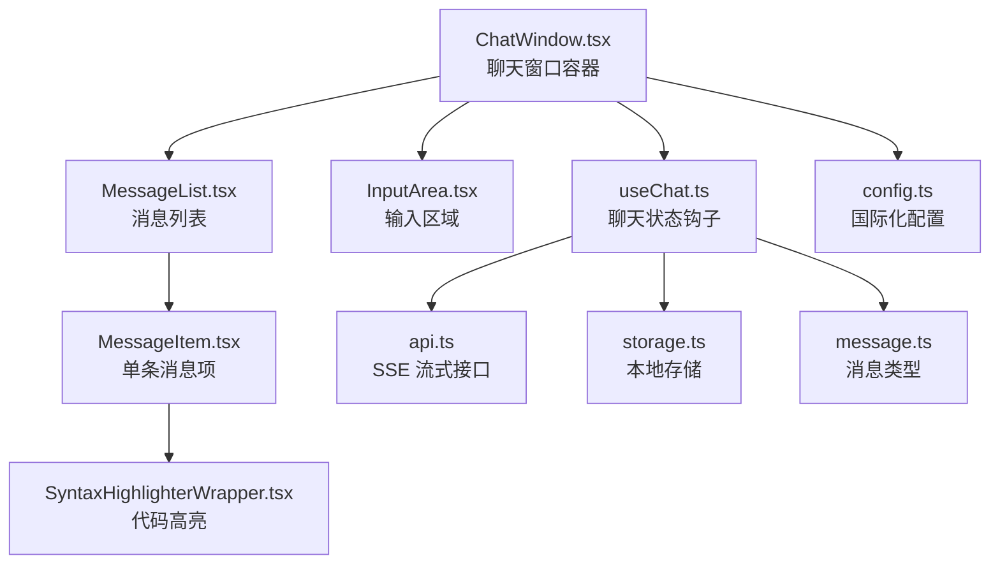
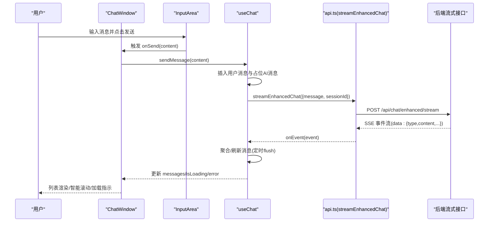
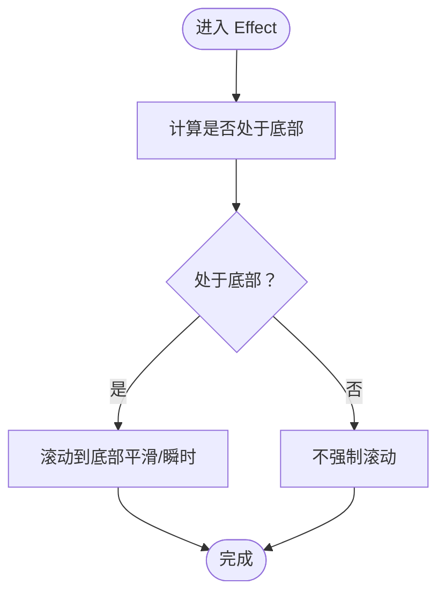
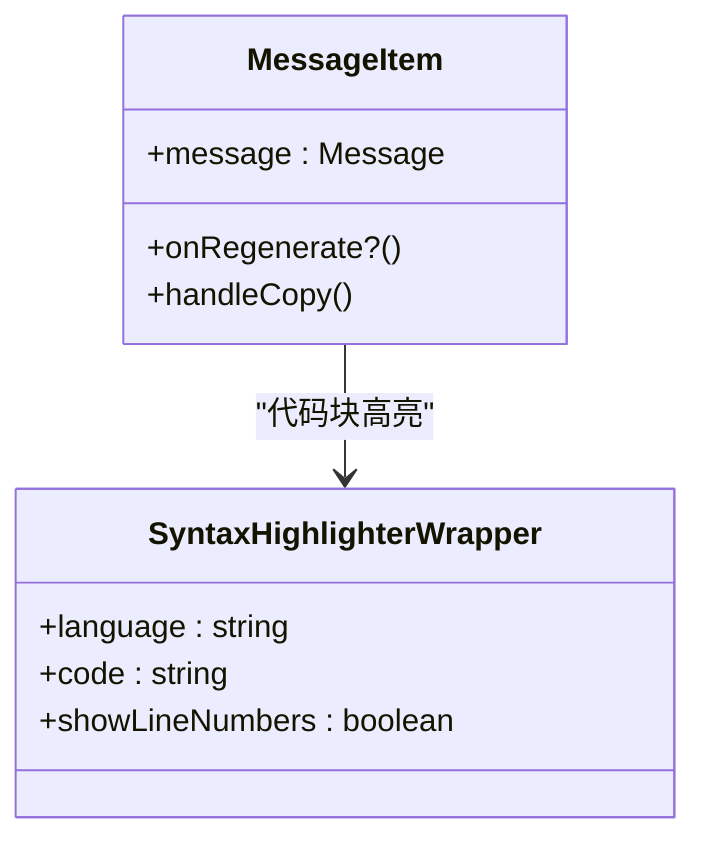
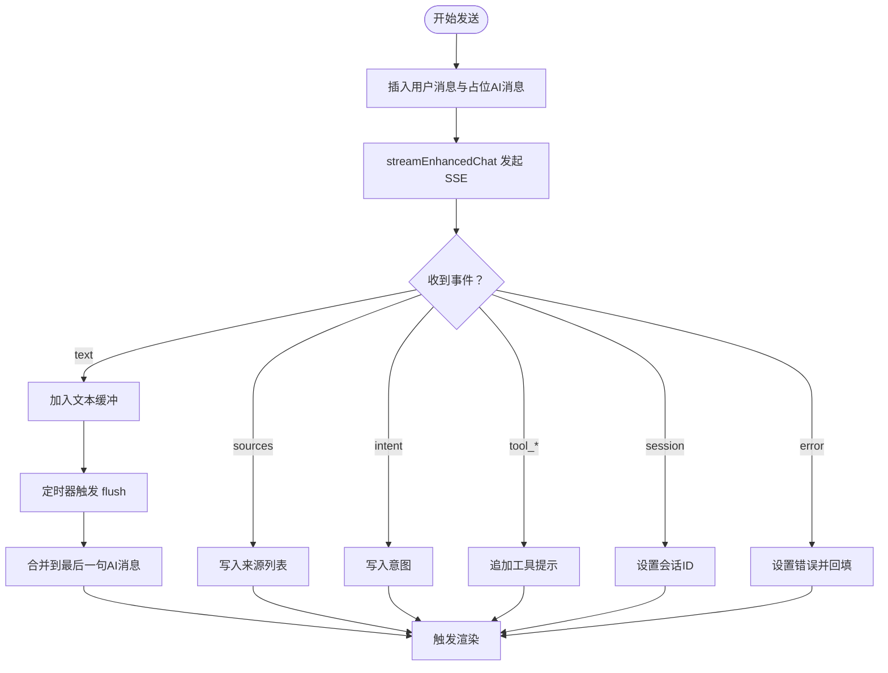
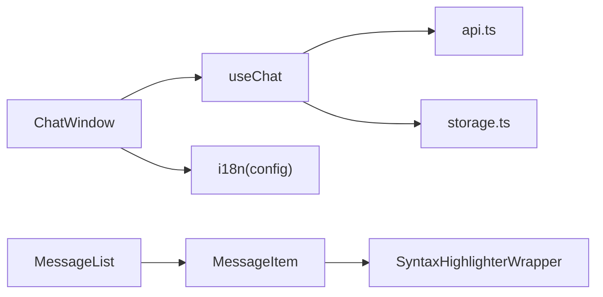

# 实时聊天

<cite>
**本文引用的文件**
- [ChatWindow.tsx](file://src/components/ChatWindow.tsx)
- [MessageList.tsx](file://src/components/MessageList.tsx)
- [InputArea.tsx](file://src/components/InputArea.tsx)
- [MessageItem.tsx](file://src/components/MessageItem.tsx)
- [useChat.ts](file://src/hooks/useChat.ts)
- [api.ts](file://src/services/api.ts)
- [storage.ts](file://src/services/storage.ts)
- [message.ts](file://src/types/message.ts)
- [SyntaxHighlighterWrapper.tsx](file://src/components/SyntaxHighlighterWrapper.tsx)
- [config.ts](file://src/i18n/config.ts)
</cite>

## 目录
1. [简介](#简介)
2. [项目结构](#项目结构)
3. [核心组件](#核心组件)
4. [架构总览](#架构总览)
5. [详细组件分析](#详细组件分析)
6. [依赖关系分析](#依赖关系分析)
7. [性能考量](#性能考量)
8. [故障排查指南](#故障排查指南)
9. [结论](#结论)
10. [附录](#附录)

## 简介
本文件面向开发者与产品团队，系统性阐述 Aureon 实时聊天功能的前端架构与实现细节。重点覆盖：
- 聊天窗口组件的结构与交互
- 消息列表渲染、智能滚动与状态管理
- 输入区域的文本输入、快捷键、附件占位与发送/停止控制
- 流式响应系统（SSE）的事件分片、实时更新与连接管理
- 会话管理（上下文维护、历史记录持久化与恢复）
- 性能优化策略（虚拟滚动建议、消息缓存与网络背压）
- 消息格式化、Markdown 渲染与代码高亮
- 自定义聊天行为、扩展消息类型与优化实时通信的实践指导

## 项目结构
实时聊天模块由“页面容器 + 列表 + 输入 + 状态钩子 + 服务层 + 类型定义”构成，采用“组件分层 + Hook 抽象 + 服务封装”的组织方式，便于复用与测试。

**图表来源**
- [ChatWindow.tsx:1-68](file://src/components/ChatWindow.tsx#L1-L68)
- [MessageList.tsx:1-72](file://src/components/MessageList.tsx#L1-L72)
- [InputArea.tsx:1-108](file://src/components/InputArea.tsx#L1-L108)
- [MessageItem.tsx:1-199](file://src/components/MessageItem.tsx#L1-L199)
- [useChat.ts:1-280](file://src/hooks/useChat.ts#L1-L280)
- [api.ts:1-157](file://src/services/api.ts#L1-L157)
- [storage.ts:1-61](file://src/services/storage.ts#L1-L61)
- [message.ts:1-16](file://src/types/message.ts#L1-L16)
- [SyntaxHighlighterWrapper.tsx:1-27](file://src/components/SyntaxHighlighterWrapper.tsx#L1-L27)
- [config.ts:1-22](file://src/i18n/config.ts#L1-L22)

**章节来源**
- [ChatWindow.tsx:1-68](file://src/components/ChatWindow.tsx#L1-L68)
- [useChat.ts:1-280](file://src/hooks/useChat.ts#L1-L280)

## 核心组件
- 聊天窗口容器：负责布局、错误提示、空态展示与消息列表/输入区域的组合。
- 消息列表：负责渲染消息、智能滚动、加载指示与底部占位。
- 输入区域：负责文本输入、自动高度调整、快捷键、附件按钮占位与发送/停止控制。
- 状态钩子：统一管理消息、加载、错误、会话 ID、SSE 事件处理与本地存储。
- 服务层：封装 SSE 请求、事件解析与背压控制；提供增强模式 API。
- 类型定义：标准化消息结构，支持增强模式下的来源与意图字段。
- 代码高亮：基于 Prism 的懒加载高亮组件。
- 国际化：i18n 初始化与检测，确保多语言文案正确显示。

**章节来源**
- [MessageList.tsx:1-72](file://src/components/MessageList.tsx#L1-L72)
- [InputArea.tsx:1-108](file://src/components/InputArea.tsx#L1-L108)
- [MessageItem.tsx:1-199](file://src/components/MessageItem.tsx#L1-L199)
- [useChat.ts:1-280](file://src/hooks/useChat.ts#L1-L280)
- [api.ts:1-157](file://src/services/api.ts#L1-L157)
- [storage.ts:1-61](file://src/services/storage.ts#L1-L61)
- [message.ts:1-16](file://src/types/message.ts#L1-L16)
- [SyntaxHighlighterWrapper.tsx:1-27](file://src/components/SyntaxHighlighterWrapper.tsx#L1-L27)
- [config.ts:1-22](file://src/i18n/config.ts#L1-L22)

## 架构总览
整体流程：用户在输入区输入并发送，前端通过 useChat 钩子发起 SSE 请求，后端以事件流推送消息片段，前端聚合并渲染，同时维护会话 ID 与本地历史。

**图表来源**
- [ChatWindow.tsx:1-68](file://src/components/ChatWindow.tsx#L1-L68)
- [InputArea.tsx:1-108](file://src/components/InputArea.tsx#L1-L108)
- [useChat.ts:178-231](file://src/hooks/useChat.ts#L178-L231)
- [api.ts:99-156](file://src/services/api.ts#L99-L156)

## 详细组件分析

### 聊天窗口 ChatWindow
- 负责标题栏、清空会话、错误提示与空态展示。
- 条件渲染消息列表或空态提示。
- 将发送、停止等回调传递给输入区域。

**章节来源**
- [ChatWindow.tsx:1-68](file://src/components/ChatWindow.tsx#L1-L68)

### 消息列表 MessageList
- 使用容器与底部占位，结合 isAtBottom 判断是否自动滚动。
- 在加载中且最后一条为 assistant 且内容为空时，渲染“正在输入”动画。
- 支持空态提示。

**图表来源**
- [MessageList.tsx:17-27](file://src/components/MessageList.tsx#L17-L27)

**章节来源**
- [MessageList.tsx:1-72](file://src/components/MessageList.tsx#L1-L72)

### 输入区域 InputArea
- 文本域自动高度：根据内容高度限制在一定范围。
- 快捷键：Shift+Enter 换行；Enter 发送。
- 附件按钮为占位，预留文件选择入口。
- 发送/停止按钮：根据 isLoading 切换；禁用条件为无内容或加载中。

**章节来源**
- [InputArea.tsx:1-108](file://src/components/InputArea.tsx#L1-L108)

### 单条消息 MessageItem
- 使用 react-markdown + remark-gfm 渲染 Markdown。
- 代码块懒加载语法高亮，支持复制代码。
- AI 消息支持悬浮工具栏：复制、重新生成、反馈。
- 增强模式下可显示来源与意图标签。

**图表来源**
- [MessageItem.tsx:1-199](file://src/components/MessageItem.tsx#L1-L199)
- [SyntaxHighlighterWrapper.tsx:1-27](file://src/components/SyntaxHighlighterWrapper.tsx#L1-L27)

**章节来源**
- [MessageItem.tsx:1-199](file://src/components/MessageItem.tsx#L1-L199)
- [SyntaxHighlighterWrapper.tsx:1-27](file://src/components/SyntaxHighlighterWrapper.tsx#L1-L27)

### 状态钩子 useChat
- 状态：messages、isLoading、error、sessionId。
- 事件处理：session/text/tool_start/tool_end/sources/intent/error。
- 文本缓冲与定时刷新：减少频繁 setMessages，提升渲染性能。
- 本地存储：仅在流结束时保存，避免频繁写入；支持增量合并去重。
- 连接管理：AbortController 控制取消；停止时清理并标记状态。

**图表来源**
- [useChat.ts:37-79](file://src/hooks/useChat.ts#L37-L79)
- [useChat.ts:96-176](file://src/hooks/useChat.ts#L96-L176)
- [useChat.ts:178-231](file://src/hooks/useChat.ts#L178-L231)

**章节来源**
- [useChat.ts:1-280](file://src/hooks/useChat.ts#L1-L280)
- [message.ts:1-16](file://src/types/message.ts#L1-L16)
- [storage.ts:1-61](file://src/services/storage.ts#L1-L61)

### 服务层 api.ts
- 提供 streamChat 与 streamEnhancedChat 两个 SSE 接口。
- 背压控制：pendingEvents 超过阈值时暂停读取，避免前端卡顿。
- 错误处理：统一捕获 AbortError 与网络异常，回调 onError。

**章节来源**
- [api.ts:1-157](file://src/services/api.ts#L1-L157)

### 本地存储 storage.ts
- loadMessages：从 localStorage 解析历史。
- saveMessages：增量保存最后一条，若 id 已存在则替换，否则追加；并做去重清理。
- clearMessages：清空历史。

**章节来源**
- [storage.ts:1-61](file://src/services/storage.ts#L1-L61)

### 类型定义 message.ts
- 统一消息结构，支持增强模式的 sources 与 intent 字段。

**章节来源**
- [message.ts:1-16](file://src/types/message.ts#L1-L16)

### 代码高亮 SyntaxHighlighterWrapper
- 懒加载 Prism，按需渲染代码块，降低首屏开销。

**章节来源**
- [SyntaxHighlighterWrapper.tsx:1-27](file://src/components/SyntaxHighlighterWrapper.tsx#L1-L27)

### 国际化 config.ts
- 初始化 i18n，支持浏览器语言检测与本地存储缓存。

**章节来源**
- [config.ts:1-22](file://src/i18n/config.ts#L1-L22)

## 依赖关系分析
- ChatWindow 依赖 useChat 提供的状态与方法。
- MessageList 依赖 MessageItem 渲染消息。
- MessageItem 依赖 Markdown 渲染与代码高亮组件。
- useChat 依赖 api.ts 的 SSE 接口与 storage.ts 的本地存储。
- api.ts 依赖 fetch 与 TextDecoder 解析事件流。
- 全局依赖 i18n 提供文案。

**图表来源**
- [ChatWindow.tsx:1-68](file://src/components/ChatWindow.tsx#L1-L68)
- [MessageList.tsx:1-72](file://src/components/MessageList.tsx#L1-L72)
- [MessageItem.tsx:1-199](file://src/components/MessageItem.tsx#L1-L199)
- [useChat.ts:1-280](file://src/hooks/useChat.ts#L1-L280)
- [api.ts:1-157](file://src/services/api.ts#L1-L157)
- [storage.ts:1-61](file://src/services/storage.ts#L1-L61)
- [SyntaxHighlighterWrapper.tsx:1-27](file://src/components/SyntaxHighlighterWrapper.tsx#L1-L27)
- [config.ts:1-22](file://src/i18n/config.ts#L1-L22)

## 性能考量
- 渲染优化
  - 文本缓冲与定时刷新：通过缓冲与固定间隔刷新，降低 setMessages 频率，减少重排重绘。
  - 懒加载代码高亮：仅在需要时加载语法高亮组件，缩短首屏渲染时间。
  - 智能滚动：仅在用户位于底部时自动滚动，避免打断用户阅读。
- 网络优化
  - SSE 背压控制：当 pendingEvents 超阈值时暂停读取，保障前端渲染稳定。
  - 仅在流结束后保存历史：避免高频写入 LocalStorage。
- 可扩展建议
  - 虚拟滚动：消息量大时可引入虚拟列表，仅渲染可视区域。
  - 消息缓存：对已渲染的 Markdown/高亮结果进行缓存，避免重复计算。
  - 网络降级：在网络不稳定时，启用本地兜底与断点续传策略。

[本节为通用性能建议，无需特定文件引用]

## 故障排查指南
- 无法接收流事件
  - 检查后端 SSE 是否正常返回 data 行；确认跨域与代理配置。
  - 查看 api.ts 的错误回调与异常分支。
- 事件堆积导致卡顿
  - 关注背压阈值与 pendingEvents 计数；必要时增大阈值或优化渲染。
- 会话丢失或历史异常
  - 确认 sessionId 是否正确写入 localStorage；检查 useChat 对 session 事件的处理。
  - 若历史异常，检查 storage.ts 的增量保存与去重逻辑。
- 发送按钮不可用
  - 检查输入是否为空、是否处于加载中；确认 InputArea 的禁用条件。
- Markdown/代码高亮异常
  - 确认 remarkGfm 插件与懒加载组件是否正确注册；检查代码块语言类名匹配。

**章节来源**
- [api.ts:57-94](file://src/services/api.ts#L57-L94)
- [useChat.ts:96-176](file://src/hooks/useChat.ts#L96-L176)
- [storage.ts:18-61](file://src/services/storage.ts#L18-L61)
- [InputArea.tsx:89-98](file://src/components/InputArea.tsx#L89-L98)
- [MessageItem.tsx:77-110](file://src/components/MessageItem.tsx#L77-L110)

## 结论
该聊天系统以清晰的分层与职责划分实现了稳定的实时交互体验：通过 SSE 事件流与缓冲刷新机制保证了流畅的渲染；通过智能滚动与懒加载优化了性能；通过本地存储与会话 ID 实现了上下文与历史的持久化。后续可在虚拟滚动、消息缓存与网络降级方面进一步优化，以适配更大规模的消息场景。

[本节为总结性内容，无需特定文件引用]

## 附录

### 开发者实践清单
- 自定义聊天行为
  - 在 useChat 的 handleEvent 中新增事件类型与处理逻辑，确保 flush 时机合理。
  - 扩展消息类型：在 message.ts 增加字段并在 MessageItem 中渲染。
- 扩展消息类型
  - 新增枚举或接口字段，保持与后端事件一致；在 Markdown 渲染处补充对应组件映射。
- 优化实时通信
  - 调整 FLUSH_INTERVAL 与 BACKPRESSURE_HIGH_WATER 以平衡实时性与性能。
  - 在网络异常时提供重试与提示，避免阻塞用户操作。

[本节为实践建议，无需特定文件引用]