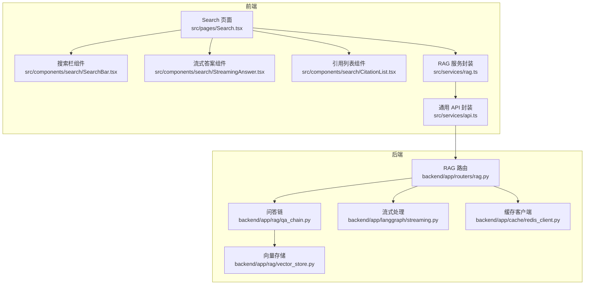
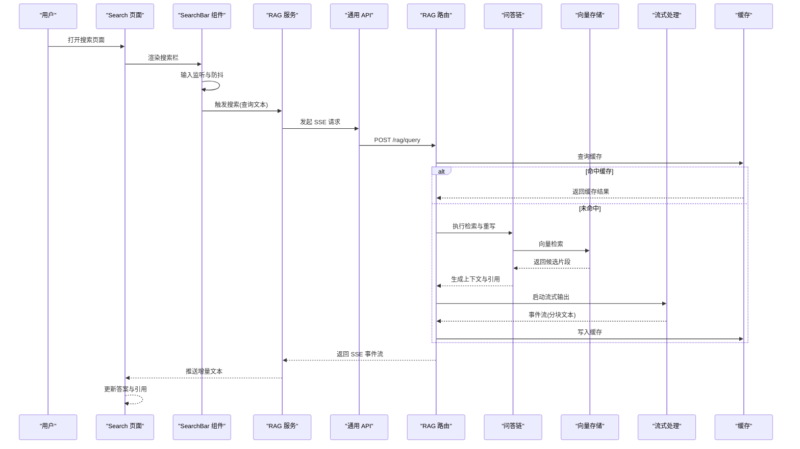
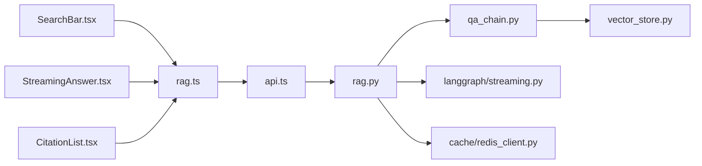

# 搜索功能

<cite>
**本文档引用的文件**
- [Search.tsx](file://src/pages/Search.tsx)
- [SearchBar.tsx](file://src/components/search/SearchBar.tsx)
- [CitationList.tsx](file://src/components/search/CitationList.tsx)
- [StreamingAnswer.tsx](file://src/components/search/StreamingAnswer.tsx)
- [rag.ts](file://src/services/rag.ts)
- [api.ts](file://src/services/api.ts)
- [rag.py](file://backend/app/routers/rag.py)
- [qa_chain.py](file://backend/app/rag/qa_chain.py)
- [vector_store.py](file://backend/app/rag/vector_store.py)
- [redis_client.py](file://backend/app/cache/redis_client.py)
- [router.py](file://backend/app/langgraph/streaming.py)
</cite>

## 目录
1. [简介](#简介)
2. [项目结构](#项目结构)
3. [核心组件](#核心组件)
4. [架构总览](#架构总览)
5. [详细组件分析](#详细组件分析)
6. [依赖关系分析](#依赖关系分析)
7. [性能考量](#性能考量)
8. [故障排除指南](#故障排除指南)
9. [结论](#结论)
10. [附录](#附录)

## 简介
本文件面向 Aureon 的搜索功能，系统化梳理前端搜索界面与后端检索链路的实现架构，覆盖搜索栏组件设计、实时搜索建议与输入验证、流式响应（Server-Sent Events）机制、引用展示与交互、搜索结果排序与相关性评分、过滤机制、性能优化策略、用户交互与可访问性设计以及移动端适配方案，并为开发者提供定制搜索行为、扩展搜索算法与优化用户体验的实践指导。

## 项目结构
Aureon 的搜索功能由前端页面与服务层共同构成：
- 前端页面：负责用户交互、输入校验、实时建议触发、流式渲染与引用展示。
- 后端路由与检索链：负责接收查询、执行检索、生成流式响应并返回引用列表。

图表来源
- [Search.tsx](file://src/pages/Search.tsx)
- [SearchBar.tsx](file://src/components/search/SearchBar.tsx)
- [StreamingAnswer.tsx](file://src/components/search/StreamingAnswer.tsx)
- [CitationList.tsx](file://src/components/search/CitationList.tsx)
- [rag.ts](file://src/services/rag.ts)
- [api.ts](file://src/services/api.ts)
- [rag.py](file://backend/app/routers/rag.py)
- [qa_chain.py](file://backend/app/rag/qa_chain.py)
- [vector_store.py](file://backend/app/rag/vector_store.py)
- [router.py](file://backend/app/langgraph/streaming.py)
- [redis_client.py](file://backend/app/cache/redis_client.py)

章节来源
- [Search.tsx](file://src/pages/Search.tsx)
- [SearchBar.tsx](file://src/components/search/SearchBar.tsx)
- [StreamingAnswer.tsx](file://src/components/search/StreamingAnswer.tsx)
- [CitationList.tsx](file://src/components/search/CitationList.tsx)
- [rag.ts](file://src/services/rag.ts)
- [api.ts](file://src/services/api.ts)
- [rag.py](file://backend/app/routers/rag.py)
- [qa_chain.py](file://backend/app/rag/qa_chain.py)
- [vector_store.py](file://backend/app/rag/vector_store.py)
- [router.py](file://backend/app/langgraph/streaming.py)
- [redis_client.py](file://backend/app/cache/redis_client.py)

## 核心组件
- 搜索页面：承载搜索栏、流式答案与引用列表的整体布局与状态管理。
- 搜索栏组件：负责输入事件监听、防抖/节流、实时建议触发与提交逻辑。
- 流式答案组件：消费后端 SSE 数据流，增量渲染回答文本与进度指示。
- 引用列表组件：展示检索到的引用条目，支持点击预览与跳转。
- RAG 服务封装：统一调用后端接口，处理请求参数、SSE 连接与错误回调。
- 后端 RAG 路由：接收查询、调用检索链、启动流式输出与缓存处理。
- 检索链与向量存储：执行语义检索、构建上下文与候选集。
- 流式处理模块：将检索结果转换为 SSE 事件流。
- 缓存客户端：基于 Redis 的查询结果缓存与命中判断。

章节来源
- [Search.tsx](file://src/pages/Search.tsx)
- [SearchBar.tsx](file://src/components/search/SearchBar.tsx)
- [StreamingAnswer.tsx](file://src/components/search/StreamingAnswer.tsx)
- [CitationList.tsx](file://src/components/search/CitationList.tsx)
- [rag.ts](file://src/services/rag.ts)
- [rag.py](file://backend/app/routers/rag.py)
- [qa_chain.py](file://backend/app/rag/qa_chain.py)
- [vector_store.py](file://backend/app/rag/vector_store.py)
- [router.py](file://backend/app/langgraph/streaming.py)
- [redis_client.py](file://backend/app/cache/redis_client.py)

## 架构总览
下图展示了从前端到后端的完整搜索流程，包括输入验证、检索链、流式输出与引用生成：

图表来源
- [Search.tsx](file://src/pages/Search.tsx)
- [SearchBar.tsx](file://src/components/search/SearchBar.tsx)
- [rag.ts](file://src/services/rag.ts)
- [api.ts](file://src/services/api.ts)
- [rag.py](file://backend/app/routers/rag.py)
- [qa_chain.py](file://backend/app/rag/qa_chain.py)
- [vector_store.py](file://backend/app/rag/vector_store.py)
- [router.py](file://backend/app/langgraph/streaming.py)
- [redis_client.py](file://backend/app/cache/redis_client.py)

## 详细组件分析

### 搜索栏组件（SearchBar）
- 设计要点
  - 输入监听与防抖/节流：避免高频请求，提升用户体验与后端吞吐。
  - 实时建议触发：在用户输入达到阈值时触发建议查询，减少无关请求。
  - 提交逻辑：回车或按钮触发正式搜索，清空建议状态。
- 输入验证
  - 非空与长度限制：防止空查询与超长查询导致资源浪费。
  - 字符集与特殊字符处理：过滤或转义可能影响检索效果的字符。
- 与服务层集成
  - 通过 RAG 服务发起搜索请求，订阅 SSE 事件以更新答案与引用。

章节来源
- [SearchBar.tsx](file://src/components/search/SearchBar.tsx)
- [rag.ts](file://src/services/rag.ts)

### 流式答案组件（StreamingAnswer）
- 功能特性
  - SSE 订阅：持续接收后端推送的增量文本块。
  - 增量渲染：逐块追加到答案容器，保持滚动与高亮效果。
  - 进度与状态：显示加载中、完成或错误状态，便于用户感知。
- 错误处理
  - 断线重连：在连接中断时自动重试，设置最大重试次数与退避策略。
  - 错误提示：捕获网络异常与业务错误，向用户反馈并允许重试。
- 可访问性
  - 屏幕阅读器友好：为加载状态与错误消息提供语义化标签。
  - 键盘导航：确保可聚焦元素可通过键盘操作。

章节来源
- [StreamingAnswer.tsx](file://src/components/search/StreamingAnswer.tsx)
- [rag.ts](file://src/services/rag.ts)

### 引用列表组件（CitationList）
- 引用生成
  - 来自后端检索链：每个引用包含标题、片段摘要、来源链接等元数据。
  - 去重与排序：按相关性或时间戳去重，维持稳定顺序。
- 点击交互
  - 预览：点击引用在侧边或弹窗中展示完整片段。
  - 跳转：点击“查看原文”打开源文档链接。
- 文档预览
  - 支持 Markdown/纯文本片段渲染，必要时截断过长内容。
  - 高亮匹配关键词，增强定位效果。

章节来源
- [CitationList.tsx](file://src/components/search/CitationList.tsx)
- [rag.py](file://backend/app/routers/rag.py)
- [qa_chain.py](file://backend/app/rag/qa_chain.py)

### 搜索页面（Search）
- 布局与状态
  - 上方：搜索栏组件，负责输入与建议。
  - 中部：流式答案组件，展示增量回答。
  - 下方：引用列表组件，展示检索引用。
- 用户体验
  - 自动滚动至最新答案，保持焦点在输入框。
  - 成功/失败状态提示，支持一键重试。
- 与服务层协作
  - 订阅 RAG 服务的 SSE 事件，更新答案与引用列表。

章节来源
- [Search.tsx](file://src/pages/Search.tsx)
- [rag.ts](file://src/services/rag.ts)

### 后端 RAG 路由与检索链
- RAG 路由
  - 接收查询参数，调用缓存客户端检查命中。
  - 未命中时启动检索链，生成引用与上下文。
  - 启动流式处理模块，将结果以 SSE 形式返回。
- 检索链（QA Chain）
  - 查询重写：优化原始查询，提升检索质量。
  - 向量检索：从向量存储中召回相似片段。
  - 上下文构建：拼接候选片段，控制上下文长度。
  - 引用提取：从候选中抽取可溯源的引用条目。
- 流式处理
  - 将检索到的文本分块，按事件格式推送，前端逐块渲染。
- 缓存
  - 使用 Redis 存储查询-结果映射，命中则直接返回，降低延迟与成本。

章节来源
- [rag.py](file://backend/app/routers/rag.py)
- [qa_chain.py](file://backend/app/rag/qa_chain.py)
- [vector_store.py](file://backend/app/rag/vector_store.py)
- [router.py](file://backend/app/langgraph/streaming.py)
- [redis_client.py](file://backend/app/cache/redis_client.py)

## 依赖关系分析
- 前端依赖
  - Search 页面依赖 SearchBar、StreamingAnswer、CitationList。
  - RAG 服务依赖通用 API 封装，用于发起 SSE 请求。
- 后端依赖
  - RAG 路由依赖 QA Chain、向量存储与流式处理模块。
  - 缓存客户端为 RAG 路由提供查询缓存能力。
- 外部依赖
  - Redis：作为缓存介质，支撑查询结果复用。
  - 浏览器 SSE：前端通过 EventSource 订阅后端事件流。

图表来源
- [SearchBar.tsx](file://src/components/search/SearchBar.tsx)
- [StreamingAnswer.tsx](file://src/components/search/StreamingAnswer.tsx)
- [CitationList.tsx](file://src/components/search/CitationList.tsx)
- [rag.ts](file://src/services/rag.ts)
- [api.ts](file://src/services/api.ts)
- [rag.py](file://backend/app/routers/rag.py)
- [qa_chain.py](file://backend/app/rag/qa_chain.py)
- [vector_store.py](file://backend/app/rag/vector_store.py)
- [router.py](file://backend/app/langgraph/streaming.py)
- [redis_client.py](file://backend/app/cache/redis_client.py)

章节来源
- [Search.tsx](file://src/pages/Search.tsx)
- [SearchBar.tsx](file://src/components/search/SearchBar.tsx)
- [StreamingAnswer.tsx](file://src/components/search/StreamingAnswer.tsx)
- [CitationList.tsx](file://src/components/search/CitationList.tsx)
- [rag.ts](file://src/services/rag.ts)
- [api.ts](file://src/services/api.ts)
- [rag.py](file://backend/app/routers/rag.py)
- [qa_chain.py](file://backend/app/rag/qa_chain.py)
- [vector_store.py](file://backend/app/rag/vector_store.py)
- [router.py](file://backend/app/langgraph/streaming.py)
- [redis_client.py](file://backend/app/cache/redis_client.py)

## 性能考量
- 缓存策略
  - 查询缓存：对常见查询进行缓存，命中后直接返回，显著降低延迟与后端负载。
  - 结果失效：设定 TTL 或基于内容哈希的失效策略，平衡新鲜度与性能。
- 查询优化
  - 查询重写：通过意图识别与关键词提取，提升检索准确性与召回率。
  - 上下文裁剪：控制上下文长度，避免过长上下文导致的性能下降与成本上升。
- 响应时间优化
  - 流式输出：前端增量渲染，缩短首字节时间，提升感知速度。
  - 防抖与节流：减少无效请求，平滑网络压力。
- 向量检索优化
  - 向量维度与索引：选择合适的嵌入模型与索引类型，优化检索效率。
  - 分页与采样：在候选集较大时采用分页或采样策略，控制返回数量。
- 前端渲染优化
  - 虚拟滚动：对长引用列表启用虚拟滚动，减少 DOM 节点数量。
  - 懒加载：对预览内容与图片懒加载，提升初始渲染性能。

## 故障排除指南
- 常见问题
  - 无结果或结果不相关：检查查询重写是否生效、向量索引是否正常、候选数量是否充足。
  - 流式输出中断：确认网络连接稳定、SSE 服务器配置正确、前端 EventSource 未被阻断。
  - 缓存未命中：检查缓存键生成规则、TTL 设置与 Redis 连接状态。
- 调试步骤
  - 前端：开启浏览器网络面板，观察 SSE 连接状态与事件流格式。
  - 后端：查看日志中检索链执行时间、向量检索耗时与缓存命中率。
  - 缓存：验证缓存键是否存在、值是否过期、序列化格式是否正确。
- 错误恢复
  - 自动重试：在前端设置指数退避重试，在后端设置幂等与补偿机制。
  - 回退策略：当流式失败时，回退到一次性响应；缓存不可用时直连检索链。

章节来源
- [rag.ts](file://src/services/rag.ts)
- [api.ts](file://src/services/api.ts)
- [rag.py](file://backend/app/routers/rag.py)
- [router.py](file://backend/app/langgraph/streaming.py)
- [redis_client.py](file://backend/app/cache/redis_client.py)

## 结论
Aureon 的搜索功能通过前后端协同实现了从输入到流式输出的完整闭环：前端负责交互与渲染，后端负责检索与流式传输。通过缓存、查询优化与流式渲染等手段，系统在保证响应速度的同时提升了用户体验。后续可在检索算法、引用质量与前端交互细节上持续迭代，进一步提升搜索的准确性与可用性。

## 附录
- 开发者实践建议
  - 自定义搜索行为：在前端增加查询参数（如时间范围、文档类型），在后端路由中解析并传递给检索链。
  - 扩展搜索算法：引入多路召回、重排与融合策略，结合用户反馈进行在线学习。
  - 优化用户体验：增加撤销/重做、复制答案、导出引用等功能；完善无障碍支持与移动端适配。
- 用户交互设计指南
  - 明确的视觉层次：搜索栏、答案区域、引用区域的布局与颜色对比清晰。
  - 即时反馈：加载动画、成功/失败提示与重试按钮，帮助用户理解当前状态。
  - 移动端适配：增大点击目标、简化输入方式、优化滚动与键盘遮挡问题。
- 可访问性考虑
  - 语义化标签：为关键元素添加 aria-label 与 role。
  - 键盘导航：Tab 顺序合理，焦点可见，快捷键提示明确。
  - 屏幕阅读器：提供必要的文本描述与状态通知。