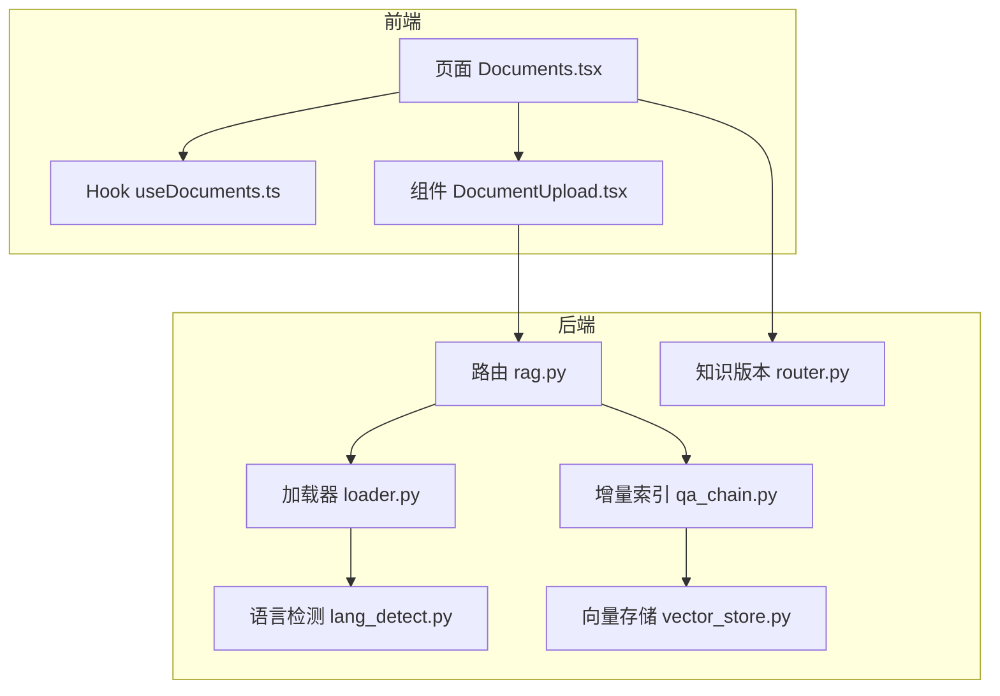
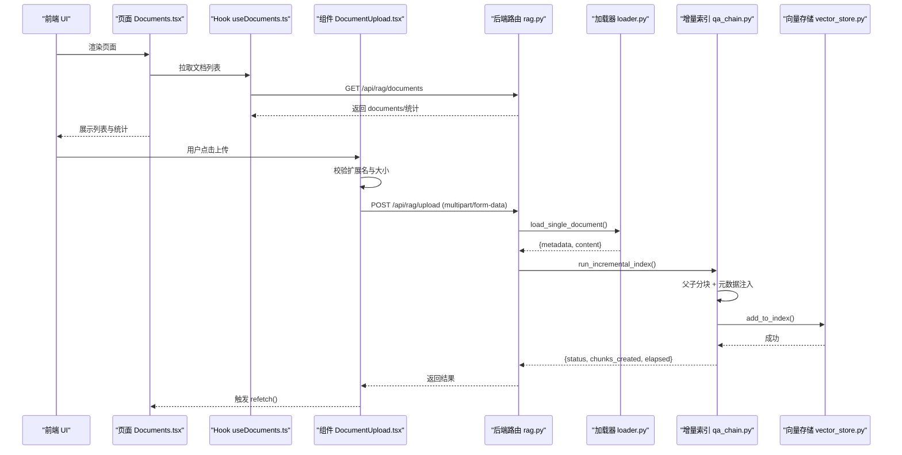
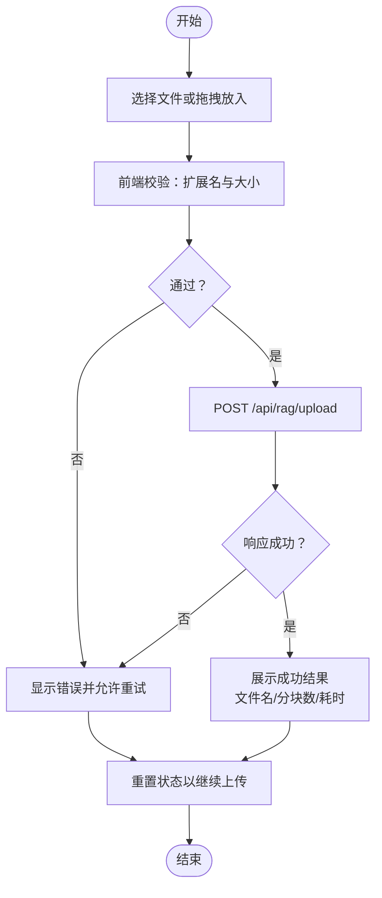
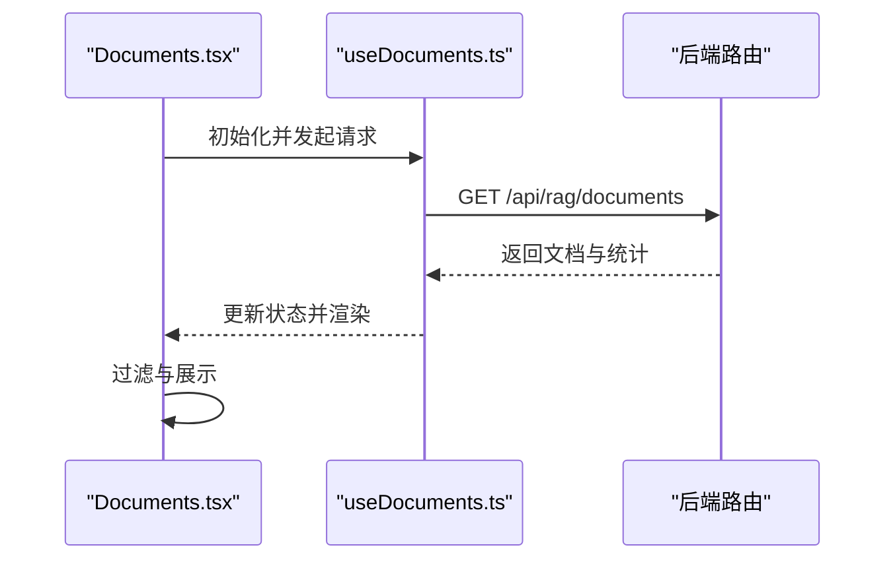
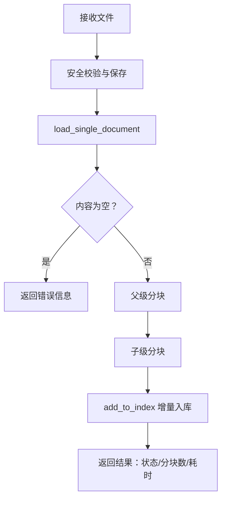
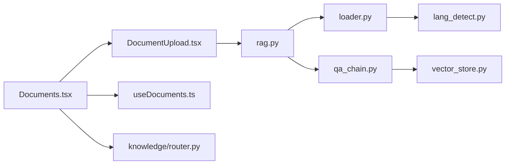

# 文档管理

<cite>
**本文引用的文件**
- [DocumentUpload.tsx](file://src/components/documents/DocumentUpload.tsx)
- [useDocuments.ts](file://src/hooks/useDocuments.ts)
- [Documents.tsx](file://src/pages/Documents.tsx)
- [loader.py](file://backend/app/rag/loader.py)
- [lang_detect.py](file://backend/app/utils/lang_detect.py)
- [rag.py](file://backend/app/routers/rag.py)
- [qa_chain.py](file://backend/app/rag/qa_chain.py)
- [vector_store.py](file://backend/app/rag/vector_store.py)
- [router.py](file://backend/app/knowledge/router.py)
- [2026-06-01-multi-format-docs.md](file://docs/superpowers/plans/2026-06-01-multi-format-docs.md)
- [2026-06-02-enterprise-rag-upgrade.md](file://docs/superpowers/plans/2026-06-02-enterprise-rag-upgrade.md)
</cite>

## 目录
1. [简介](#简介)
2. [项目结构](#项目结构)
3. [核心组件](#核心组件)
4. [架构总览](#架构总览)
5. [详细组件分析](#详细组件分析)
6. [依赖分析](#依赖分析)
7. [性能考量](#性能考量)
8. [故障排查指南](#故障排查指南)
9. [结论](#结论)
10. [附录](#附录)

## 简介
本文件面向开发者与技术文档维护者，系统性梳理 Aureon 的“文档管理”能力：从前端上传组件到后端增量索引、向量化存储、元数据管理与版本控制，以及面向未来的扩展路径（多格式支持、自定义索引策略与存储优化）。文档同时覆盖前端状态管理、拖拽上传、进度与错误反馈，以及后端安全校验、分块策略与检索增强生成（RAG）集成。

## 项目结构
文档管理功能横跨前后端：
- 前端
  - 页面 Documents.tsx：展示文档列表、搜索过滤、上传入口与博客同步按钮
  - Hook useDocuments.ts：拉取文档清单、统计总数与分块数
  - 组件 DocumentUpload.tsx：文件选择、拖拽上传、状态提示与错误处理
- 后端
  - 路由 rag.py：上传接口、列出上传文件、删除上传文件、健康检查等
  - 加载器 loader.py：Markdown、TXT、PDF、DOCX、XLSX 的解析与元数据抽取
  - 语言检测 lang_detect.py：中英语言判定
  - 增量索引 qa_chain.py：文档加载、父子分块、向量入库
  - 向量存储 vector_store.py：索引增删改查、健康状态
  - 知识版本 knowledge/router.py：文档版本控制与导出记录

图表来源
- [Documents.tsx:15-231](file://src/pages/Documents.tsx#L15-L231)
- [useDocuments.ts:22-59](file://src/hooks/useDocuments.ts#L22-L59)
- [DocumentUpload.tsx:19-232](file://src/components/documents/DocumentUpload.tsx#L19-L232)
- [rag.py:330-529](file://backend/app/routers/rag.py#L330-L529)
- [loader.py:47-224](file://backend/app/rag/loader.py#L47-L224)
- [lang_detect.py:15-45](file://backend/app/utils/lang_detect.py#L15-L45)
- [qa_chain.py:810-877](file://backend/app/rag/qa_chain.py#L810-L877)
- [vector_store.py:937-974](file://backend/app/rag/vector_store.py#L937-L974)
- [router.py:16-72](file://backend/app/knowledge/router.py#L16-L72)

章节来源
- [Documents.tsx:15-231](file://src/pages/Documents.tsx#L15-L231)
- [useDocuments.ts:22-59](file://src/hooks/useDocuments.ts#L22-L59)
- [DocumentUpload.tsx:19-232](file://src/components/documents/DocumentUpload.tsx#L19-L232)
- [rag.py:330-529](file://backend/app/routers/rag.py#L330-L529)
- [loader.py:47-224](file://backend/app/rag/loader.py#L47-L224)
- [lang_detect.py:15-45](file://backend/app/utils/lang_detect.py#L15-L45)
- [qa_chain.py:810-877](file://backend/app/rag/qa_chain.py#L810-L877)
- [vector_store.py:937-974](file://backend/app/rag/vector_store.py#L937-L974)
- [router.py:16-72](file://backend/app/knowledge/router.py#L16-L72)

## 核心组件
- 前端上传组件 DocumentUpload.tsx
  - 功能：文件选择、拖拽区域、状态提示（空闲/上传中/成功/错误）、错误信息国际化
  - 安全与限制：前端限制扩展名与大小；后端再次校验
  - 交互：点击触发文件选择，拖拽进入/离开切换样式，放下即上传
- 文档列表与钩子 useDocuments.ts
  - 功能：拉取后端 /api/rag/documents 返回的文档清单、总数、总分块数
  - 错误处理：AbortController 取消请求，避免内存泄漏
- 文档页面 Documents.tsx
  - 功能：搜索过滤、上传面板开关、博客同步按钮、版本/导出入口
  - 展示：桌面表格与移动端卡片两种视图，按类型着色徽标

章节来源
- [DocumentUpload.tsx:19-232](file://src/components/documents/DocumentUpload.tsx#L19-L232)
- [useDocuments.ts:22-59](file://src/hooks/useDocuments.ts#L22-L59)
- [Documents.tsx:15-231](file://src/pages/Documents.tsx#L15-L231)

## 架构总览
文档管理从“上传—解析—分块—索引—检索—展示”的闭环展开。前端负责用户交互与状态反馈，后端负责安全校验、内容解析、分块策略与向量化存储，并通过检索链路服务于问答与查询。

图表来源
- [Documents.tsx:15-231](file://src/pages/Documents.tsx#L15-L231)
- [useDocuments.ts:22-59](file://src/hooks/useDocuments.ts#L22-L59)
- [DocumentUpload.tsx:19-232](file://src/components/documents/DocumentUpload.tsx#L19-L232)
- [rag.py:330-529](file://backend/app/routers/rag.py#L330-L529)
- [loader.py:47-224](file://backend/app/rag/loader.py#L47-L224)
- [qa_chain.py:810-877](file://backend/app/rag/qa_chain.py#L810-L877)
- [vector_store.py:937-974](file://backend/app/rag/vector_store.py#L937-L974)

## 详细组件分析

### 前端上传组件：DocumentUpload.tsx
- 文件选择与拖拽
  - 使用隐藏的 <input type="file"> 触发点击
  - 拖拽事件 onDragOver/onDragLeave/onDrop 控制视觉反馈与文件提取
- 上传流程
  - 前端二次校验：扩展名白名单、大小限制
  - 构造 FormData，调用 /api/rag/upload
  - 成功：解析返回的 filename、chunks_created、elapsed_seconds
  - 失败：捕获异常并显示国际化错误消息
- 状态与 UI
  - 空闲/上传中/成功/错误四种状态，分别渲染不同提示与按钮

图表来源
- [DocumentUpload.tsx:33-84](file://src/components/documents/DocumentUpload.tsx#L33-L84)
- [DocumentUpload.tsx:58-81](file://src/components/documents/DocumentUpload.tsx#L58-L81)

章节来源
- [DocumentUpload.tsx:19-232](file://src/components/documents/DocumentUpload.tsx#L19-L232)

### 文档列表与钩子：useDocuments.ts 与 Documents.tsx
- useDocuments.ts
  - 拉取 /api/rag/documents，返回 documents、total_docs、total_chunks
  - 使用 AbortController 在组件卸载时取消请求
- Documents.tsx
  - 提供搜索框，支持按标题与来源过滤
  - 条件渲染：错误态、加载态、空态、列表态
  - 上传面板开关，配合 refetch 刷新列表

图表来源
- [useDocuments.ts:30-45](file://src/hooks/useDocuments.ts#L30-L45)
- [Documents.tsx:22-28](file://src/pages/Documents.tsx#L22-L28)

章节来源
- [useDocuments.ts:22-59](file://src/hooks/useDocuments.ts#L22-L59)
- [Documents.tsx:15-231](file://src/pages/Documents.tsx#L15-L231)

### 后端上传与增量索引：rag.py、loader.py、qa_chain.py
- 上传接口 /api/rag/upload
  - 安全校验：文件名、扩展名白名单、大小限制、路径穿越防护
  - 写入上传目录，随后执行增量索引
  - 支持语言与标题参数更新元数据
- 增量索引 run_incremental_index
  - 加载单文件：load_single_document
  - 分块策略：先父级（标题/段落层级）再子级（句/词粒度），保留父子关系元数据
  - 向量入库：add_to_index，不重建全局索引，仅增量更新
- 文档加载器 loader.py
  - 支持 .md/.txt/.pdf/.docx/.xlsx/.xls
  - Markdown 解析 frontmatter，提取 title/slug/tags/category/lang
  - 其他格式提取纯文本，自动检测语言

图表来源
- [rag.py:330-397](file://backend/app/routers/rag.py#L330-L397)
- [loader.py:47-224](file://backend/app/rag/loader.py#L47-L224)
- [qa_chain.py:810-877](file://backend/app/rag/qa_chain.py#L810-L877)

章节来源
- [rag.py:330-397](file://backend/app/routers/rag.py#L330-L397)
- [loader.py:47-224](file://backend/app/rag/loader.py#L47-L224)
- [qa_chain.py:810-877](file://backend/app/rag/qa_chain.py#L810-L877)

### 向量存储与检索：vector_store.py
- 健康检查与状态
  - 提供 get_bm25_stats、check_index_stale 等方法，监控索引一致性与可用性
- 增量写入
  - add_to_index 将新分块写入现有集合，避免全量重建
- 删除与清理
  - delete_from_index 从索引移除对应文件的分块

章节来源
- [vector_store.py:937-974](file://backend/app/rag/vector_store.py#L937-L974)

### 元数据管理与版本控制：loader.py 与 knowledge/router.py
- 元数据字段
  - Markdown：frontmatter 中的 title/slug/tags/category/lang
  - 其他格式：自动生成 title/source/language/file_type
  - 上传标记 uploaded=true，便于区分来源
- 版本控制
  - 知识版本路由提供创建版本、查询历史、获取最新版本、导出记录等接口
  - 适合企业场景下的文档演进与合规审计

章节来源
- [loader.py:64-110](file://backend/app/rag/loader.py#L64-L110)
- [router.py:19-72](file://backend/app/knowledge/router.py#L19-L72)

### 多格式支持与扩展指南
- 当前支持：.md、.txt、.pdf、.docx、.xlsx/.xls
- 扩展路径参考设计文档
  - 在 load_single_document 中新增分支，调用对应 load_* 函数
  - 保持 metadata 字段一致（source/title/language/file_type 等）
  - 在前端 DocumentUpload.tsx 的 accept 与白名单处同步扩展

章节来源
- [loader.py:47-224](file://backend/app/rag/loader.py#L47-L224)
- [2026-06-01-multi-format-docs.md:245-311](file://docs/superpowers/plans/2026-06-01-multi-format-docs.md#L245-L311)
- [DocumentUpload.tsx:144](file://src/components/documents/DocumentUpload.tsx#L144)

### 检索增强与性能优化建议
- 检索策略
  - 设计文档提出扩大候选集与启用精排（rerank）的升级方案
  - 通过环境变量控制候选倍数与候选上限，提升召回质量
- 存储与索引
  - 增量索引避免全量重建，降低维护成本
  - 健康检查与陈旧状态检测，确保索引一致性

章节来源
- [2026-06-02-enterprise-rag-upgrade.md:277-336](file://docs/superpowers/plans/2026-06-02-enterprise-rag-upgrade.md#L277-L336)
- [vector_store.py:937-974](file://backend/app/rag/vector_store.py#L937-L974)

## 依赖分析
- 前端
  - Documents.tsx 依赖 useDocuments.ts 与 DocumentUpload.tsx
  - DocumentUpload.tsx 依赖 i18n 与 fetch 接口
- 后端
  - rag.py 依赖 loader.py、qa_chain.py、vector_store.py
  - loader.py 依赖 lang_detect.py 与第三方库（pypdf/docx/openpyxl）

图表来源
- [DocumentUpload.tsx:19-232](file://src/components/documents/DocumentUpload.tsx#L19-L232)
- [Documents.tsx:15-231](file://src/pages/Documents.tsx#L15-L231)
- [useDocuments.ts:22-59](file://src/hooks/useDocuments.ts#L22-L59)
- [rag.py:330-529](file://backend/app/routers/rag.py#L330-L529)
- [loader.py:47-224](file://backend/app/rag/loader.py#L47-L224)
- [lang_detect.py:15-45](file://backend/app/utils/lang_detect.py#L15-L45)
- [qa_chain.py:810-877](file://backend/app/rag/qa_chain.py#L810-L877)
- [vector_store.py:937-974](file://backend/app/rag/vector_store.py#L937-L974)
- [router.py:16-72](file://backend/app/knowledge/router.py#L16-L72)

章节来源
- [DocumentUpload.tsx:19-232](file://src/components/documents/DocumentUpload.tsx#L19-L232)
- [Documents.tsx:15-231](file://src/pages/Documents.tsx#L15-L231)
- [useDocuments.ts:22-59](file://src/hooks/useDocuments.ts#L22-L59)
- [rag.py:330-529](file://backend/app/routers/rag.py#L330-L529)
- [loader.py:47-224](file://backend/app/rag/loader.py#L47-L224)
- [lang_detect.py:15-45](file://backend/app/utils/lang_detect.py#L15-L45)
- [qa_chain.py:810-877](file://backend/app/rag/qa_chain.py#L810-L877)
- [vector_store.py:937-974](file://backend/app/rag/vector_store.py#L937-L974)
- [router.py:16-72](file://backend/app/knowledge/router.py#L16-L72)

## 性能考量
- 上传与解析
  - 前端二次校验减少无效请求；后端严格校验与大小限制，防止资源滥用
  - 增量索引避免全量重建，缩短索引时间
- 分块策略
  - 父子分块兼顾语义完整性与细粒度检索
  - 可根据业务调整分块尺寸与重叠比例
- 检索与排序
  - 通过候选倍数与候选上限参数化召回规模
  - 启用精排可提升相关性但增加延迟，需权衡

## 故障排查指南
- 上传失败
  - 前端：检查扩展名与大小限制是否匹配
  - 后端：确认 /api/rag/upload 的安全校验与保存逻辑
- 索引异常
  - 检查 run_incremental_index 的返回状态与错误消息
  - 确认向量存储 add_to_index 是否成功
- 列表为空
  - useDocuments.ts 捕获网络错误并提示重试
  - 检查 /api/rag/documents 的返回结构与字段映射
- 索引陈旧
  - 使用 check_index_stale 判断磁盘文件与索引条目数量差异

章节来源
- [DocumentUpload.tsx:33-84](file://src/components/documents/DocumentUpload.tsx#L33-L84)
- [rag.py:330-397](file://backend/app/routers/rag.py#L330-L397)
- [qa_chain.py:810-877](file://backend/app/rag/qa_chain.py#L810-L877)
- [vector_store.py:937-974](file://backend/app/rag/vector_store.py#L937-L974)
- [useDocuments.ts:30-45](file://src/hooks/useDocuments.ts#L30-L45)

## 结论
Aureon 的文档管理以“前端轻交互 + 后端强索引”为核心，实现了从上传、解析、分块到向量入库的完整闭环。前端提供直观的拖拽上传与状态反馈，后端通过增量索引与健康检查保障性能与稳定性。未来可在多格式支持、检索策略与存储优化方面持续演进，满足企业级需求。

## 附录
- 开发者实践要点
  - 新增文档格式：在 loader.py 中扩展 load_single_document 分支，并在前端 accept 与白名单同步
  - 自定义索引策略：调整 qa_chain.py 中的分块参数与父子层级
  - 存储优化：结合 check_index_stale 与增量入库，定期清理陈旧索引
- 相关设计文档
  - 多格式文档设计：[2026-06-01-multi-format-docs.md](file://docs/superpowers/plans/2026-06-01-multi-format-docs.md)
  - 企业级 RAG 升级：[2026-06-02-enterprise-rag-upgrade.md](file://docs/superpowers/plans/2026-06-02-enterprise-rag-upgrade.md)