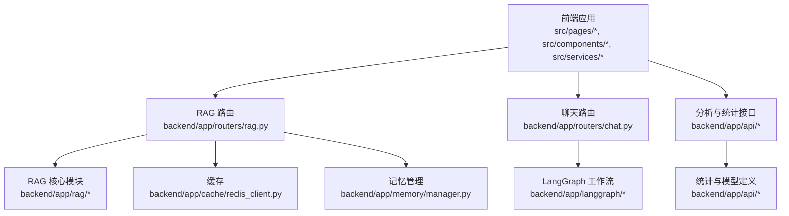
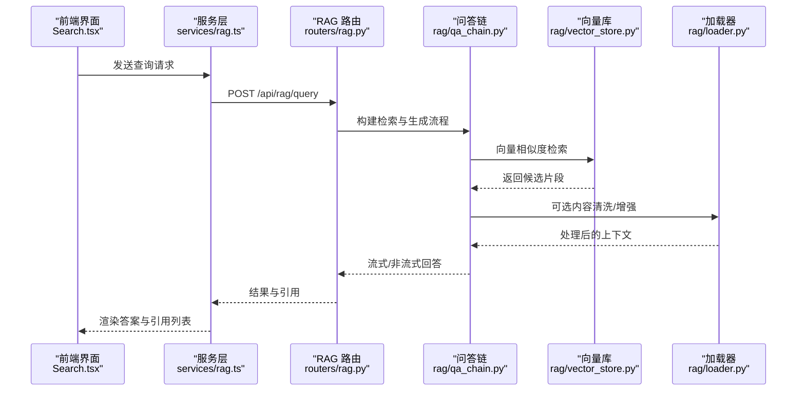
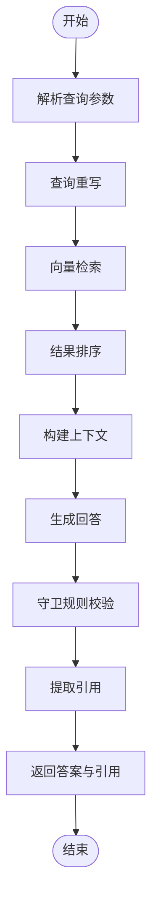
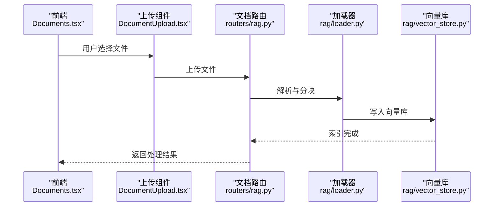
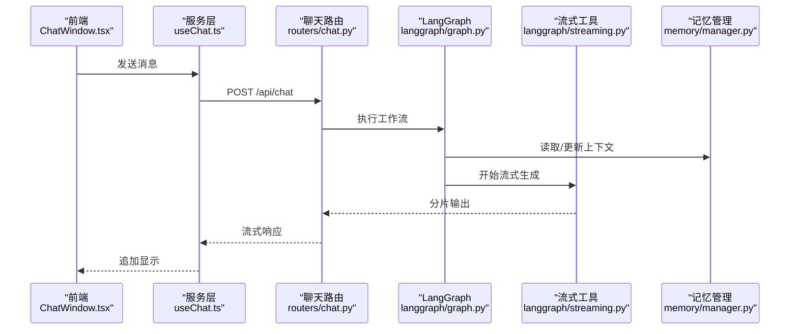
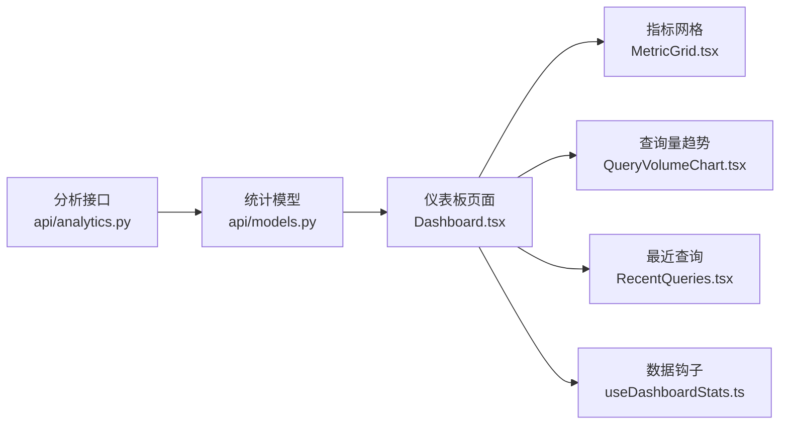
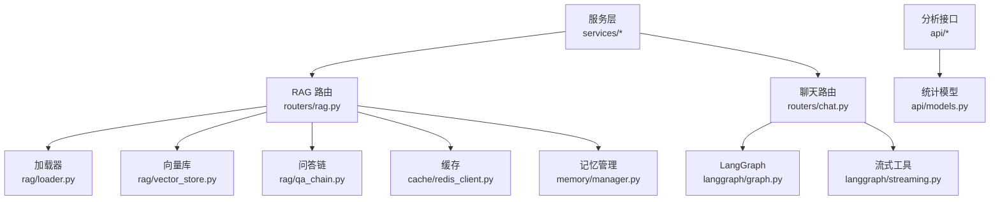

# 核心功能模块

<cite>
**本文档引用的文件**
- [backend/app/main.py](file://backend/app/main.py)
- [backend/app/routers/chat.py](file://backend/app/routers/chat.py)
- [backend/app/routers/rag.py](file://backend/app/routers/rag.py)
- [backend/app/rag/loader.py](file://backend/app/rag/loader.py)
- [backend/app/rag/vector_store.py](file://backend/app/rag/vector_store.py)
- [backend/app/rag/qa_chain.py](file://backend/app/rag/qa_chain.py)
- [backend/app/rag/query_rewriter.py](file://backend/app/rag/query_rewriter.py)
- [backend/app/rag/guardrails.py](file://backend/app/rag/guardrails.py)
- [backend/app/memory/manager.py](file://backend/app/memory/manager.py)
- [backend/app/langgraph/graph.py](file://backend/app/langgraph/graph.py)
- [backend/app/langgraph/streaming.py](file://backend/app/langgraph/streaming.py)
- [backend/app/cache/redis_client.py](file://backend/app/cache/redis_client.py)
- [src/pages/Search.tsx](file://src/pages/Search.tsx)
- [src/components/search/SearchBar.tsx](file://src/components/search/SearchBar.tsx)
- [src/components/search/StreamingAnswer.tsx](file://src/components/search/StreamingAnswer.tsx)
- [src/components/search/CitationList.tsx](file://src/components/search/CitationList.tsx)
- [src/services/rag.ts](file://src/services/rag.ts)
- [src/hooks/useChat.ts](file://src/hooks/useChat.ts)
- [src/pages/Documents.tsx](file://src/pages/Documents.tsx)
- [src/components/documents/DocumentUpload.tsx](file://src/components/documents/DocumentUpload.tsx)
- [src/hooks/useDocuments.ts](file://src/hooks/useDocuments.ts)
- [src/pages/Dashboard.tsx](file://src/pages/Dashboard.tsx)
- [src/components/dashboard/MetricGrid.tsx](file://src/components/dashboard/MetricGrid.tsx)
- [src/components/dashboard/QueryVolumeChart.tsx](file://src/components/dashboard/QueryVolumeChart.tsx)
- [src/components/dashboard/RecentQueries.tsx](file://src/components/dashboard/RecentQueries.tsx)
- [src/hooks/useDashboardStats.ts](file://src/hooks/useDashboardStats.ts)
- [src/services/api.ts](file://src/services/api.ts)
- [backend/app/api/analytics.py](file://backend/app/api/analytics.py)
- [backend/app/api/models.py](file://backend/app/api/models.py)
- [backend/app/api/rag_stats.py](file://backend/app/api/rag_stats.py)
- [backend/app/dependencies.py](file://backend/app/dependencies.py)
- [backend/app/config.py](file://backend/app/config.py)
- [backend/app/common.py](file://backend/app/common.py)
- [backend/app/exceptions.py](file://backend/app/exceptions.py)
- [backend/app/utils/lang_detect.py](file://backend/app/utils/lang_detect.py)
</cite>

## 目录
1. [简介](#简介)
2. [项目结构](#项目结构)
3. [核心组件](#核心组件)
4. [架构总览](#架构总览)
5. [详细组件分析](#详细组件分析)
6. [依赖分析](#依赖分析)
7. [性能考虑](#性能考虑)
8. [故障排除指南](#故障排除指南)
9. [结论](#结论)
10. [附录](#附录)

## 简介
本文件聚焦 Aureon 的核心功能模块，系统性梳理以下能力：搜索（实时搜索、结果排序与引用展示）、文档管理（上传、自动索引、预览与版本控制）、实时聊天（流式响应、会话管理与上下文维护）、仪表板（数据可视化与指标展示）。文档从代码级架构出发，结合前端组件与后端服务的协作关系，给出流程图、类图与序列图，并提供性能优化、用户体验改进与扩展指导。

## 项目结构
Aureon 采用前后端分离架构：
- 前端位于 src/，包含页面、组件、服务与类型定义，通过服务层对接后端 API。
- 后端位于 backend/app/，提供 RAG、聊天、缓存、内存、分析等模块化服务，通过路由暴露 REST 接口。

图表来源
- [backend/app/routers/rag.py](file://backend/app/routers/rag.py)
- [backend/app/routers/chat.py](file://backend/app/routers/chat.py)
- [backend/app/rag/loader.py](file://backend/app/rag/loader.py)
- [backend/app/rag/vector_store.py](file://backend/app/rag/vector_store.py)
- [backend/app/langgraph/graph.py](file://backend/app/langgraph/graph.py)
- [backend/app/cache/redis_client.py](file://backend/app/cache/redis_client.py)
- [backend/app/memory/manager.py](file://backend/app/memory/manager.py)
- [backend/app/api/analytics.py](file://backend/app/api/analytics.py)

章节来源
- [backend/app/main.py](file://backend/app/main.py)
- [backend/app/routers/rag.py](file://backend/app/routers/rag.py)
- [backend/app/routers/chat.py](file://backend/app/routers/chat.py)

## 核心组件
- 搜索与问答链路：RAG 路由接收查询，经查询重写、向量化检索、QA 链与守卫规则处理，返回带引用的答案。
- 实时聊天：LangGraph 定义节点与状态机，支持流式输出与上下文维护。
- 文档管理：前端上传组件与后端加载器/向量库配合，实现自动索引与检索。
- 仪表板：聚合分析数据，提供指标网格、查询量趋势与最近查询列表。

章节来源
- [backend/app/routers/rag.py](file://backend/app/routers/rag.py)
- [backend/app/rag/qa_chain.py](file://backend/app/rag/qa_chain.py)
- [backend/app/rag/query_rewriter.py](file://backend/app/rag/query_rewriter.py)
- [backend/app/rag/guardrails.py](file://backend/app/rag/guardrails.py)
- [backend/app/langgraph/graph.py](file://backend/app/langgraph/graph.py)
- [backend/app/langgraph/streaming.py](file://backend/app/langgraph/streaming.py)
- [src/pages/Search.tsx](file://src/pages/Search.tsx)
- [src/services/rag.ts](file://src/services/rag.ts)
- [src/pages/Documents.tsx](file://src/pages/Documents.tsx)
- [src/components/documents/DocumentUpload.tsx](file://src/components/documents/DocumentUpload.tsx)
- [src/pages/Dashboard.tsx](file://src/pages/Dashboard.tsx)
- [src/components/dashboard/MetricGrid.tsx](file://src/components/dashboard/MetricGrid.tsx)

## 架构总览
下图展示了从前端到后端的关键交互路径，以及各模块间的依赖关系。

图表来源
- [src/pages/Search.tsx](file://src/pages/Search.tsx)
- [src/services/rag.ts](file://src/services/rag.ts)
- [backend/app/routers/rag.py](file://backend/app/routers/rag.py)
- [backend/app/rag/qa_chain.py](file://backend/app/rag/qa_chain.py)
- [backend/app/rag/vector_store.py](file://backend/app/rag/vector_store.py)
- [backend/app/rag/loader.py](file://backend/app/rag/loader.py)

## 详细组件分析

### 搜索功能：实时搜索、排序与引用展示
- 实时搜索：前端通过服务层发起查询，后端路由解析参数并进入 RAG 流程。
- 查询重写：在检索前对用户输入进行改写以提升召回质量。
- 向量检索：基于向量库执行相似度匹配，返回高相关度片段。
- QA 链：将上下文与问题拼接，调用 LLM 生成回答。
- 引用展示：答案中嵌入引用信息，前端以引用列表组件呈现。

图表来源
- [backend/app/routers/rag.py](file://backend/app/routers/rag.py)
- [backend/app/rag/query_rewriter.py](file://backend/app/rag/query_rewriter.py)
- [backend/app/rag/vector_store.py](file://backend/app/rag/vector_store.py)
- [backend/app/rag/qa_chain.py](file://backend/app/rag/qa_chain.py)
- [backend/app/rag/guardrails.py](file://backend/app/rag/guardrails.py)

章节来源
- [src/pages/Search.tsx](file://src/pages/Search.tsx)
- [src/components/search/SearchBar.tsx](file://src/components/search/SearchBar.tsx)
- [src/components/search/StreamingAnswer.tsx](file://src/components/search/StreamingAnswer.tsx)
- [src/components/search/CitationList.tsx](file://src/components/search/CitationList.tsx)
- [src/services/rag.ts](file://src/services/rag.ts)
- [backend/app/routers/rag.py](file://backend/app/routers/rag.py)
- [backend/app/rag/query_rewriter.py](file://backend/app/rag/query_rewriter.py)
- [backend/app/rag/vector_store.py](file://backend/app/rag/vector_store.py)
- [backend/app/rag/qa_chain.py](file://backend/app/rag/qa_chain.py)
- [backend/app/rag/guardrails.py](file://backend/app/rag/guardrails.py)

### 文档管理：上传、自动索引、预览与版本控制
- 文件上传：前端提供上传组件，选择文件后提交至后端路由。
- 自动索引：后端加载器解析文档，分块与嵌入，写入向量库。
- 预览：前端可渲染文档内容或摘要。
- 版本控制：当前实现未见显式版本字段，建议在元数据中引入版本号并建立版本切换逻辑。

图表来源
- [src/pages/Documents.tsx](file://src/pages/Documents.tsx)
- [src/components/documents/DocumentUpload.tsx](file://src/components/documents/DocumentUpload.tsx)
- [backend/app/routers/rag.py](file://backend/app/routers/rag.py)
- [backend/app/rag/loader.py](file://backend/app/rag/loader.py)
- [backend/app/rag/vector_store.py](file://backend/app/rag/vector_store.py)

章节来源
- [src/pages/Documents.tsx](file://src/pages/Documents.tsx)
- [src/components/documents/DocumentUpload.tsx](file://src/components/documents/DocumentUpload.tsx)
- [src/hooks/useDocuments.ts](file://src/hooks/useDocuments.ts)
- [backend/app/routers/rag.py](file://backend/app/routers/rag.py)
- [backend/app/rag/loader.py](file://backend/app/rag/loader.py)
- [backend/app/rag/vector_store.py](file://backend/app/rag/vector_store.py)

### 实时聊天：流式响应、会话管理与上下文维护
- LangGraph 工作流：定义节点（意图识别、检索增强、生成等）与状态机，支持多轮对话。
- 流式响应：通过流式工具将回答逐步推送到前端，改善等待体验。
- 会话与上下文：记忆管理器负责上下文持久化与回放，确保多轮连贯性。

图表来源
- [src/pages/Search.tsx](file://src/pages/Search.tsx)
- [src/hooks/useChat.ts](file://src/hooks/useChat.ts)
- [backend/app/routers/chat.py](file://backend/app/routers/chat.py)
- [backend/app/langgraph/graph.py](file://backend/app/langgraph/graph.py)
- [backend/app/langgraph/streaming.py](file://backend/app/langgraph/streaming.py)
- [backend/app/memory/manager.py](file://backend/app/memory/manager.py)

章节来源
- [src/pages/Search.tsx](file://src/pages/Search.tsx)
- [src/hooks/useChat.ts](file://src/hooks/useChat.ts)
- [backend/app/routers/chat.py](file://backend/app/routers/chat.py)
- [backend/app/langgraph/graph.py](file://backend/app/langgraph/graph.py)
- [backend/app/langgraph/streaming.py](file://backend/app/langgraph/streaming.py)
- [backend/app/memory/manager.py](file://backend/app/memory/manager.py)

### 仪表板：数据可视化、指标展示与界面设计
- 指标网格：展示关键指标卡片，如查询量、命中率等。
- 查询量趋势：折线图展示查询量随时间变化。
- 最近查询：列表展示近期查询与响应摘要。
- 数据来源：后端分析接口提供统计数据，前端通过钩子拉取并渲染。

图表来源
- [backend/app/api/analytics.py](file://backend/app/api/analytics.py)
- [backend/app/api/models.py](file://backend/app/api/models.py)
- [src/pages/Dashboard.tsx](file://src/pages/Dashboard.tsx)
- [src/components/dashboard/MetricGrid.tsx](file://src/components/dashboard/MetricGrid.tsx)
- [src/components/dashboard/QueryVolumeChart.tsx](file://src/components/dashboard/QueryVolumeChart.tsx)
- [src/components/dashboard/RecentQueries.tsx](file://src/components/dashboard/RecentQueries.tsx)
- [src/hooks/useDashboardStats.ts](file://src/hooks/useDashboardStats.ts)

章节来源
- [src/pages/Dashboard.tsx](file://src/pages/Dashboard.tsx)
- [src/components/dashboard/MetricGrid.tsx](file://src/components/dashboard/MetricGrid.tsx)
- [src/components/dashboard/QueryVolumeChart.tsx](file://src/components/dashboard/QueryVolumeChart.tsx)
- [src/components/dashboard/RecentQueries.tsx](file://src/components/dashboard/RecentQueries.tsx)
- [src/hooks/useDashboardStats.ts](file://src/hooks/useDashboardStats.ts)
- [backend/app/api/analytics.py](file://backend/app/api/analytics.py)
- [backend/app/api/models.py](file://backend/app/api/models.py)

## 依赖分析
- 组件耦合：前端组件通过服务层与后端路由解耦；后端模块按职责拆分，RAG、聊天、缓存、记忆相对独立。
- 外部依赖：Redis 缓存、向量库、LLM 平台等通过配置注入，便于替换与扩展。
- 潜在循环依赖：当前结构清晰，未发现直接循环导入；建议保持模块边界，避免跨模块反向依赖。

图表来源
- [src/services/rag.ts](file://src/services/rag.ts)
- [backend/app/routers/rag.py](file://backend/app/routers/rag.py)
- [backend/app/routers/chat.py](file://backend/app/routers/chat.py)
- [backend/app/rag/loader.py](file://backend/app/rag/loader.py)
- [backend/app/rag/vector_store.py](file://backend/app/rag/vector_store.py)
- [backend/app/rag/qa_chain.py](file://backend/app/rag/qa_chain.py)
- [backend/app/langgraph/graph.py](file://backend/app/langgraph/graph.py)
- [backend/app/langgraph/streaming.py](file://backend/app/langgraph/streaming.py)
- [backend/app/cache/redis_client.py](file://backend/app/cache/redis_client.py)
- [backend/app/memory/manager.py](file://backend/app/memory/manager.py)
- [backend/app/api/analytics.py](file://backend/app/api/analytics.py)
- [backend/app/api/models.py](file://backend/app/api/models.py)

章节来源
- [backend/app/dependencies.py](file://backend/app/dependencies.py)
- [backend/app/config.py](file://backend/app/config.py)
- [backend/app/common.py](file://backend/app/common.py)

## 性能考虑
- 向量检索优化：合理设置分块大小与重叠，平衡召回与延迟；启用 Redis 缓存热点查询结果。
- 流式输出：前端按分片渲染，减少首字节延迟；后端控制分片大小与频率。
- 上下文压缩：对长对话进行摘要或截断，降低 LLM 输入成本。
- 并发与限流：在路由层增加速率限制与超时控制，防止雪崩效应。
- 存储与索引：批量写入向量库，定期重建索引以维持检索精度。

## 故障排除指南
- 查询无结果：检查加载器是否正确分块与嵌入；确认向量库索引是否完整。
- 回答质量差：调整查询重写策略与提示词；启用守卫规则过滤不当输出。
- 聊天卡顿：排查 LangGraph 节点耗时；优化流式分片与前端渲染。
- 缓存异常：验证 Redis 连接与键空间策略；监控命中率与过期策略。
- 权限与异常：统一异常处理与日志记录，区分业务异常与系统异常。

章节来源
- [backend/app/exceptions.py](file://backend/app/exceptions.py)
- [backend/app/rag/guardrails.py](file://backend/app/rag/guardrails.py)
- [backend/app/cache/redis_client.py](file://backend/app/cache/redis_client.py)

## 结论
Aureon 的核心功能围绕“搜索—聊天—文档—仪表板”四大支柱展开，前后端通过清晰的服务层与路由层协同工作。RAG 与 LangGraph 提供强大的检索增强与多轮对话能力，文档管理与仪表板完善了知识入库与运营观测。建议在版本控制、上下文压缩与缓存策略上持续优化，以进一步提升性能与用户体验。

## 附录
- 开发者实践指南
  - 修改现有功能：从前端服务层入手，逐步定位到对应后端路由与模块；确保变更在测试中覆盖。
  - 添加新功能：遵循现有模块边界，新增路由与服务，复用缓存与记忆管理；提供前端组件与数据钩子。
  - 用户体验改进：优先优化首屏与流式体验；提供错误兜底与重试机制；增强引用与上下文的可读性。
  - 功能扩展：引入版本控制与增量索引；扩展多模态支持；完善 A/B 实验与埋点体系。