# CI工作流增强

<cite>
**本文档引用的文件**
- [ci.yml](file://.github/workflows/ci.yml)
- [rag-quality.yml](file://.github/workflows/rag-quality.yml)
- [Dockerfile](file://Dockerfile)
- [backend/Dockerfile](file://backend/Dockerfile)
- [package.json](file://package.json)
- [backend/requirements.txt](file://backend/requirements.txt)
- [backend/app/main.py](file://backend/app/main.py)
- [backend/app/config.py](file://backend/app/config.py)
- [backend/tests/test_main.py](file://backend/tests/test_main.py)
- [backend/tests/test_rag_quality.py](file://backend/tests/test_rag_quality.py)
- [backend/tests/eval_runner.py](file://backend/tests/eval_runner.py)
- [backend/tests/test_data_golden.py](file://backend/tests/test_data_golden.py)
- [docker-compose.yml](file://docker-compose.yml)
- [Dockerfile.test](file://Dockerfile.test)
- [railway.json](file://railway.json)
</cite>

## 目录
1. [简介](#简介)
2. [项目结构](#项目结构)
3. [核心组件](#核心组件)
4. [架构概览](#架构概览)
5. [详细组件分析](#详细组件分析)
6. [依赖分析](#依赖分析)
7. [性能考虑](#性能考虑)
8. [故障排除指南](#故障排除指南)
9. [结论](#结论)

## 简介

本文档详细分析了Aureon平台的CI/CD工作流增强方案。该项目是一个基于FastAPI的AI聊天机器人平台，集成了RAG（检索增强生成）、LangGraph工作流、CrewAI智能体等多个先进功能。当前的CI工作流已经包含了完整的前端和后端测试、质量门禁检查以及多阶段容器构建。

项目采用现代化的开发实践，包括：
- GitHub Actions自动化CI/CD流水线
- Docker多阶段构建优化
- 深度评估框架集成
- 多环境部署支持
- 完整的监控和可观测性

## 项目结构

Aureon平台采用前后端分离的架构设计，具有清晰的功能模块划分：

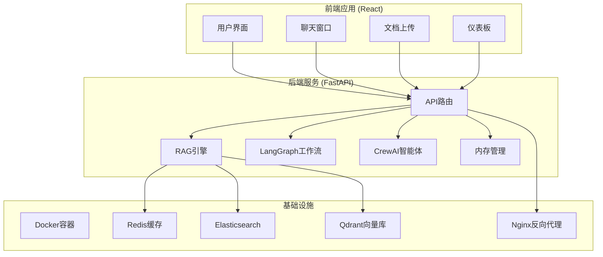

**图表来源**
- [backend/app/main.py:350-371](file://backend/app/main.py#L350-L371)
- [docker-compose.yml:1-64](file://docker-compose.yml#L1-L64)

**章节来源**
- [backend/app/main.py:1-371](file://backend/app/main.py#L1-L371)
- [docker-compose.yml:1-64](file://docker-compose.yml#L1-L64)

## 核心组件

### CI/CD工作流架构

项目目前包含两个主要的GitHub Actions工作流：

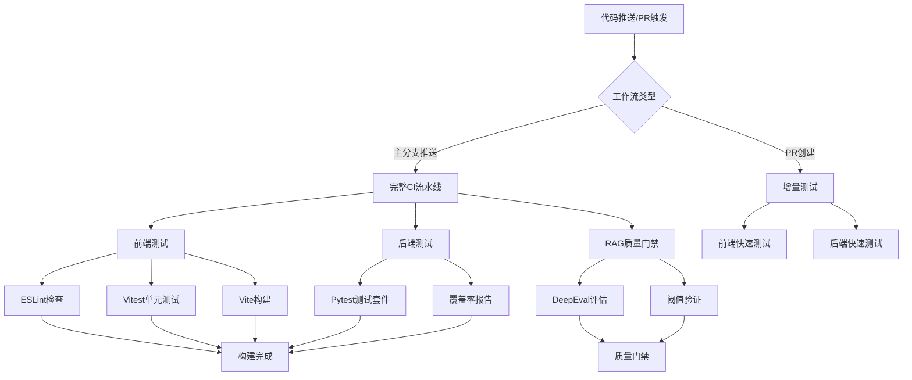

**图表来源**
- [.github/workflows/ci.yml:1-53](file://.github/workflows/ci.yml#L1-L53)
- [.github/workflows/rag-quality.yml:1-57](file://.github/workflows/rag-quality.yml#L1-L57)

### Docker容器化架构

项目采用多阶段Docker构建策略，优化了镜像大小和启动性能：

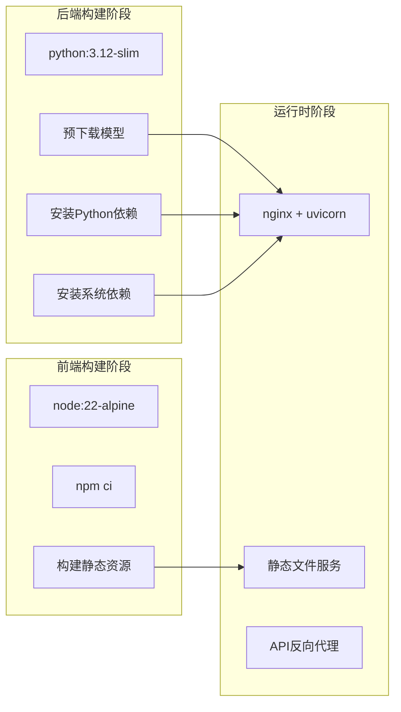

**图表来源**
- [Dockerfile:1-54](file://Dockerfile#L1-L54)
- [backend/Dockerfile:1-29](file://backend/Dockerfile#L1-L29)

**章节来源**
- [.github/workflows/ci.yml:1-53](file://.github/workflows/ci.yml#L1-L53)
- [.github/workflows/rag-quality.yml:1-57](file://.github/workflows/rag-quality.yml#L1-L57)
- [Dockerfile:1-54](file://Dockerfile#L1-L54)
- [backend/Dockerfile:1-29](file://backend/Dockerfile#L1-L29)

## 架构概览

### CI流水线详细流程

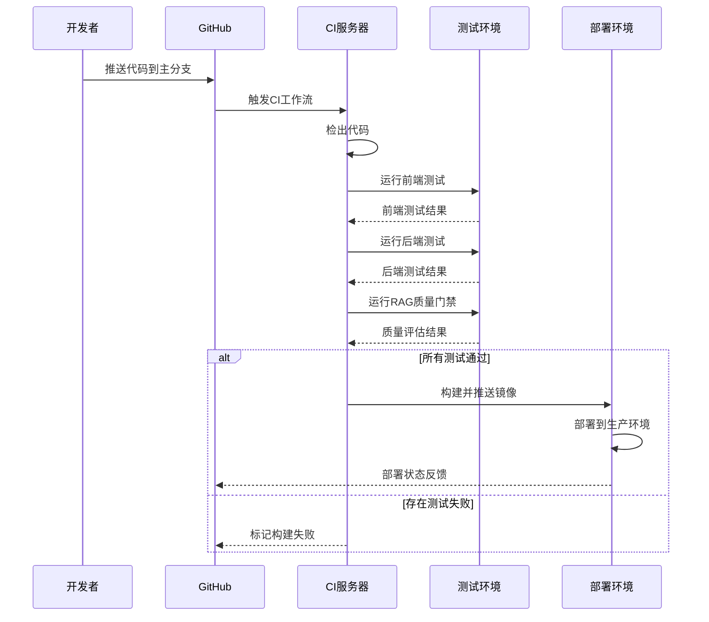

**图表来源**
- [.github/workflows/ci.yml:9-53](file://.github/workflows/ci.yml#L9-L53)
- [.github/workflows/rag-quality.yml:17-57](file://.github/workflows/rag-quality.yml#L17-L57)

### RAG质量评估流程

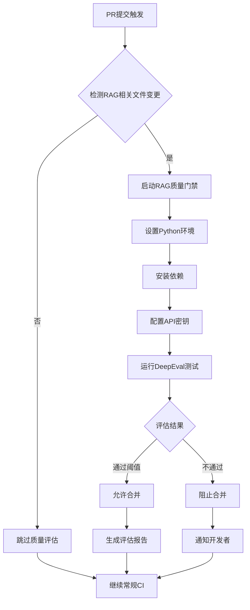

**图表来源**
- [.github/workflows/rag-quality.yml:3-57](file://.github/workflows/rag-quality.yml#L3-L57)

**章节来源**
- [.github/workflows/rag-quality.yml:1-57](file://.github/workflows/rag-quality.yml#L1-L57)

## 详细组件分析

### 前端测试组件

前端采用Vite + React + TypeScript技术栈，测试框架使用Vitest配合@testing-library：

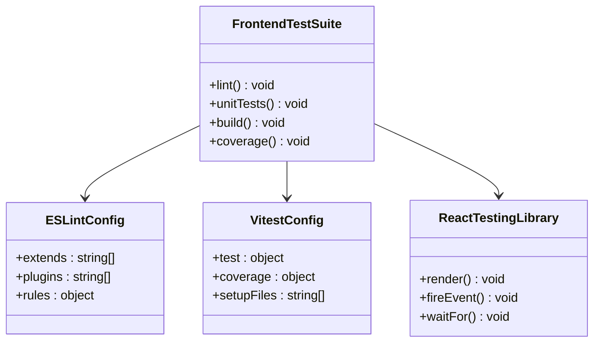

**图表来源**
- [package.json:6-13](file://package.json#L6-L13)

**章节来源**
- [package.json:1-54](file://package.json#L1-L54)

### 后端测试组件

后端使用Pytest进行测试，包含单元测试、集成测试和端到端测试：

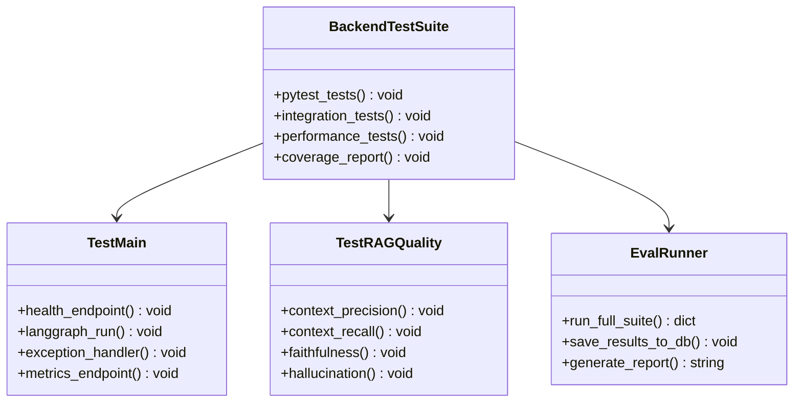

**图表来源**
- [backend/tests/test_main.py:1-132](file://backend/tests/test_main.py#L1-L132)
- [backend/tests/test_rag_quality.py:1-101](file://backend/tests/test_rag_quality.py#L1-L101)
- [backend/tests/eval_runner.py:1-200](file://backend/tests/eval_runner.py#L1-L200)

**章节来源**
- [backend/tests/test_main.py:1-132](file://backend/tests/test_main.py#L1-L132)
- [backend/tests/test_rag_quality.py:1-101](file://backend/tests/test_rag_quality.py#L1-L101)
- [backend/tests/eval_runner.py:1-200](file://backend/tests/eval_runner.py#L1-L200)

### RAG质量评估组件

RAG质量评估系统集成了DeepEval框架，提供多维度的质量指标：

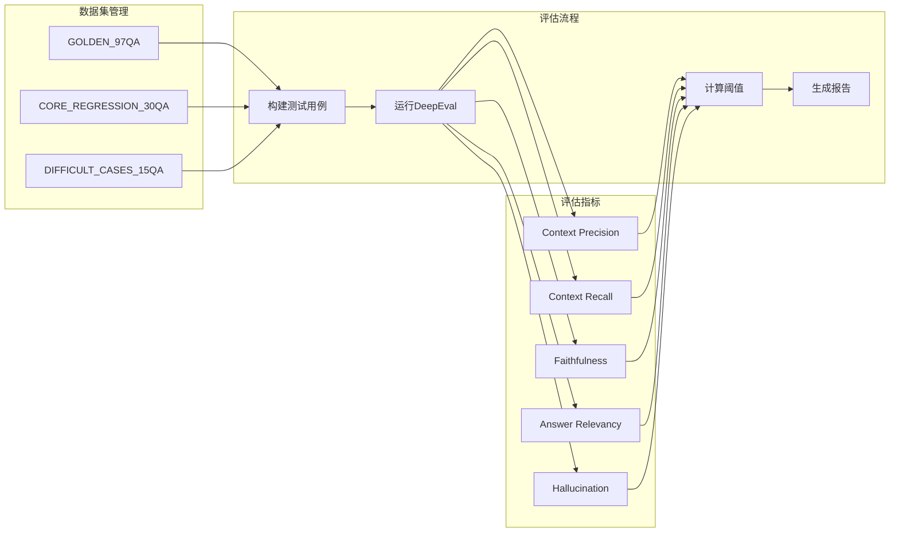

**图表来源**
- [backend/tests/test_data_golden.py:1-200](file://backend/tests/test_data_golden.py#L1-L200)
- [backend/tests/test_rag_quality.py:16-28](file://backend/tests/test_rag_quality.py#L16-L28)

**章节来源**
- [backend/tests/test_data_golden.py:1-200](file://backend/tests/test_data_golden.py#L1-L200)
- [backend/tests/test_rag_quality.py:1-101](file://backend/tests/test_rag_quality.py#L1-L101)

### 配置管理系统

应用配置采用Pydantic Settings模式，支持多环境配置：

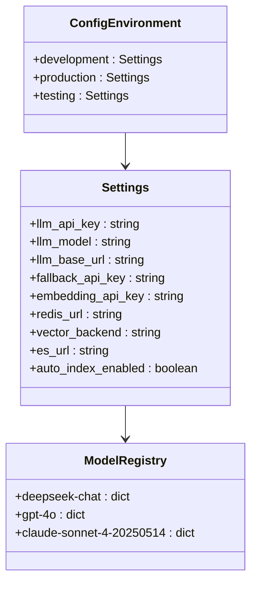

**图表来源**
- [backend/app/config.py:4-90](file://backend/app/config.py#L4-L90)

**章节来源**
- [backend/app/config.py:1-90](file://backend/app/config.py#L1-L90)

## 依赖分析

### 技术栈依赖关系

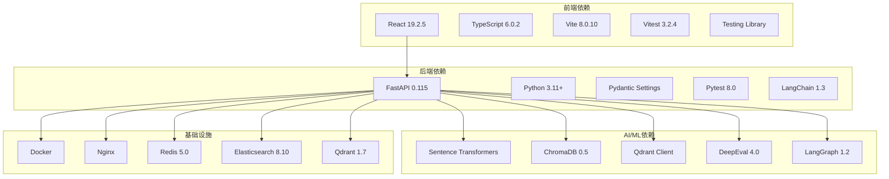

**图表来源**
- [package.json:14-52](file://package.json#L14-L52)
- [backend/requirements.txt:1-57](file://backend/requirements.txt#L1-L57)

### CI/CD依赖关系

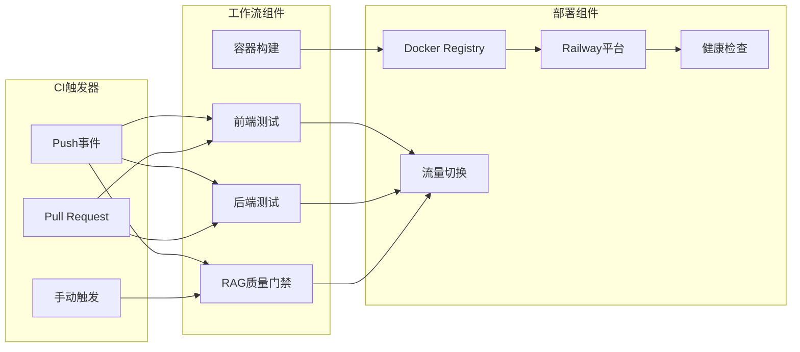

**图表来源**
- [.github/workflows/ci.yml:3-7](file://.github/workflows/ci.yml#L3-L7)
- [.github/workflows/rag-quality.yml:3-10](file://.github/workflows/rag-quality.yml#L3-L10)
- [railway.json:7-14](file://railway.json#L7-L14)

**章节来源**
- [backend/requirements.txt:1-57](file://backend/requirements.txt#L1-L57)
- [package.json:1-54](file://package.json#L1-L54)

## 性能考虑

### CI性能优化策略

项目在CI/CD流程中采用了多项性能优化措施：

1. **并行测试执行**：前端和后端测试在独立的作业中并行运行
2. **缓存优化**：npm和pip依赖缓存，Docker层缓存
3. **增量构建**：仅在相关文件变更时运行特定测试
4. **预热机制**：Docker镜像预下载大型模型文件

### 容器启动性能

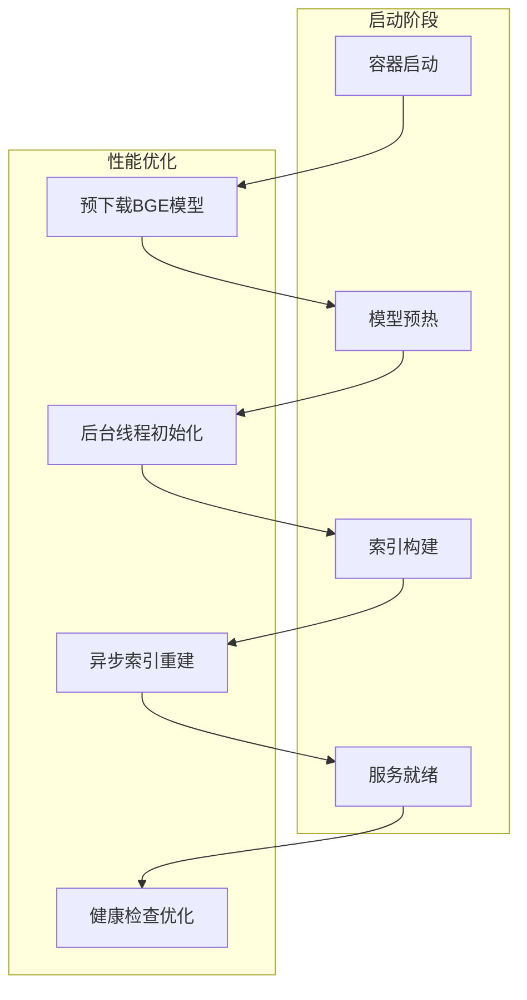

**图表来源**
- [Dockerfile:32-34](file://Dockerfile#L32-L34)
- [backend/app/main.py:127-165](file://backend/app/main.py#L127-L165)

**章节来源**
- [Dockerfile:1-54](file://Dockerfile#L1-L54)
- [backend/app/main.py:127-165](file://backend/app/main.py#L127-L165)

## 故障排除指南

### 常见CI问题及解决方案

| 问题类型 | 症状 | 可能原因 | 解决方案 |
|---------|------|----------|----------|
| 前端测试失败 | ESLint错误或单元测试失败 | 代码风格不符或逻辑错误 | 运行本地lint修复，更新测试用例 |
| 后端测试失败 | Pytest异常或覆盖率不足 | 单元测试未覆盖或集成测试失败 | 检查依赖注入，添加缺失的mock |
| RAG质量门禁失败 | DeepEval指标低于阈值 | 检索质量下降或生成内容不准确 | 优化嵌入模型或调整检索参数 |
| Docker构建失败 | 依赖安装超时或模型下载失败 | 网络连接问题或镜像缓存损坏 | 清理缓存，使用镜像源加速 |

### 调试工具和命令

```bash
# 查看最近CI运行状态
gh run list --limit 5

# 查看特定CI运行详情
gh run view <run-id> --job=<job-name>

# 检查Railway部署状态
railway status
railway logs --latest

# 本地验证API端点
curl -s http://localhost:8000/api/health | jq .

# 运行特定测试套件
cd backend && python -m pytest tests/test_rag_quality.py -v
```

**章节来源**
- [backend/tests/test_main.py:1-132](file://backend/tests/test_main.py#L1-L132)
- [backend/tests/test_rag_quality.py:1-101](file://backend/tests/test_rag_quality.py#L1-L101)

## 结论

Aureon平台的CI/CD工作流展现了现代软件开发的最佳实践。通过以下关键改进实现了高效的持续集成和交付：

### 已实现的优势

1. **全面的测试覆盖**：前端、后端、RAG质量门禁的多层次测试体系
2. **智能化的质量控制**：基于DeepEval的自动质量评估和阈值控制
3. **优化的构建流程**：多阶段Docker构建和预热机制
4. **灵活的部署策略**：支持多种部署环境和回滚机制

### 进一步改进建议

1. **增强监控告警**：集成更详细的性能指标监控
2. **扩展测试矩阵**：增加更多边界条件和压力测试
3. **优化缓存策略**：实现更智能的依赖缓存和构建缓存
4. **自动化回归测试**：建立更完善的回归测试机制

该CI工作流为AI应用的持续交付提供了坚实的基础，能够确保代码质量和系统稳定性，同时保持高效的开发迭代速度。