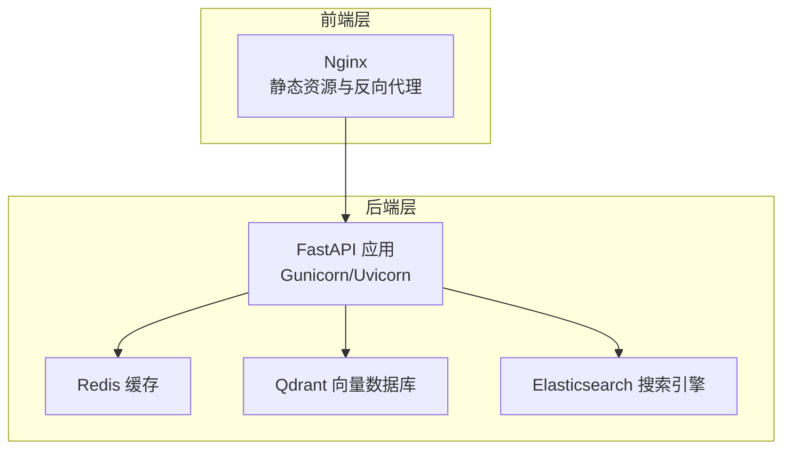
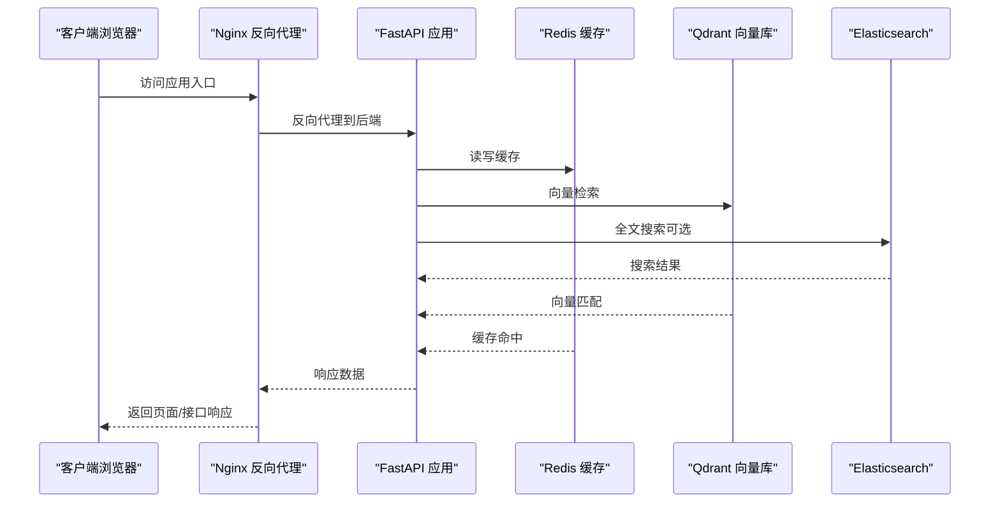
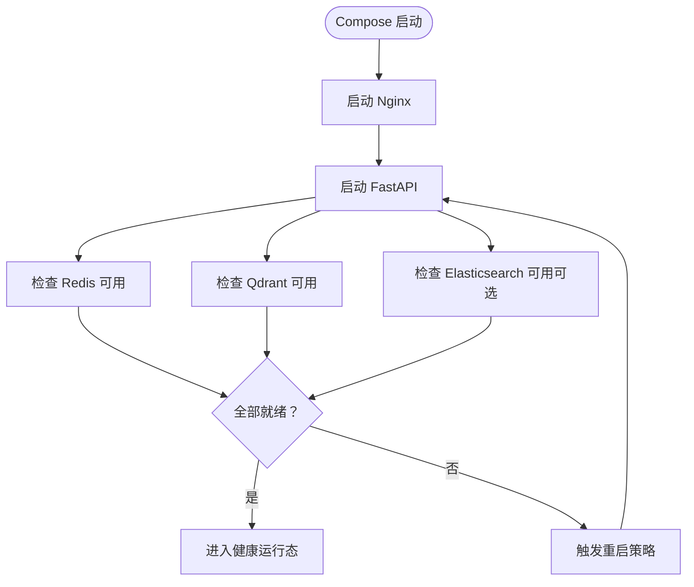

# 容器化部署

<cite>
**本文引用的文件**
- [docker-compose.yml](file://docker-compose.yml)
- [Dockerfile](file://Dockerfile)
- [backend/Dockerfile](file://backend/Dockerfile)
- [crew/Dockerfile](file://crew/Dockerfile)
- [frontend.Dockerfile](file://frontend.Dockerfile)
- [docker-entrypoint.sh](file://docker-entrypoint.sh)
- [nginx.conf](file://nginx.conf)
- [.dockerignore](file://.dockerignore)
- [backend/.dockerignore](file://backend/.dockerignore)
- [backend/app/main.py](file://backend/app/main.py)
- [backend/app/config.py](file://backend/app/config.py)
- [backend/app/cache/redis_client.py](file://backend/app/cache/redis_client.py)
- [backend/app/rag/vector_store.py](file://backend/app/rag/vector_store.py)
- [docs/deployment/docker-setup.md](file://docs/deployment/docker-setup.md)
</cite>

## 目录
1. [简介](#简介)
2. [项目结构](#项目结构)
3. [核心组件](#核心组件)
4. [架构总览](#架构总览)
5. [详细组件分析](#详细组件分析)
6. [依赖关系分析](#依赖关系分析)
7. [性能考虑](#性能考虑)
8. [故障排查指南](#故障排查指南)
9. [结论](#结论)
10. [附录](#附录)

## 简介
本文件面向 Aureon 系统的容器化部署，围绕 Docker Compose 服务编排展开，重点覆盖以下方面：
- 服务定义：Redis 缓存、FastAPI 应用、Qdrant 向量数据库、Elasticsearch 搜索引擎
- 服务间依赖关系、健康检查与重启策略
- 环境变量、卷挂载与端口映射最佳实践
- 本地开发与生产环境的差异化配置示例
- 容器网络、数据持久化与安全配置
- 镜像构建优化（多阶段构建、体积优化）
- 调试、日志与性能监控实践

## 项目结构
Aureon 采用前后端分离与后端微服务化的容器化布局：
- 前端静态资源由 Nginx 提供
- 后端 FastAPI 应用通过 Gunicorn/Uvicorn 承载业务逻辑
- 缓存使用 Redis
- 向量检索基于 Qdrant
- 搜索能力可选集成 Elasticsearch
- Docker Compose 统一编排所有服务

**图表来源**
- [docker-compose.yml](file://docker-compose.yml)
- [nginx.conf](file://nginx.conf)
- [backend/app/main.py](file://backend/app/main.py)

**章节来源**
- [docker-compose.yml](file://docker-compose.yml)
- [nginx.conf](file://nginx.conf)

## 核心组件
- Nginx：提供静态资源托管与反向代理，统一入口与 SSL 终止（如启用）。
- FastAPI 应用：业务主服务，负责路由、缓存、向量检索与搜索等核心功能。
- Redis：会话、速率限制、短期缓存等场景的高性能键值存储。
- Qdrant：向量相似度检索与语义搜索的核心存储。
- Elasticsearch：可选的全文检索与聚合分析能力。

**章节来源**
- [docker-compose.yml](file://docker-compose.yml)
- [backend/app/main.py](file://backend/app/main.py)
- [backend/app/cache/redis_client.py](file://backend/app/cache/redis_client.py)
- [backend/app/rag/vector_store.py](file://backend/app/rag/vector_store.py)

## 架构总览
下图展示容器间的交互路径与依赖顺序：

**图表来源**
- [docker-compose.yml](file://docker-compose.yml)
- [backend/app/main.py](file://backend/app/main.py)
- [backend/app/cache/redis_client.py](file://backend/app/cache/redis_client.py)
- [backend/app/rag/vector_store.py](file://backend/app/rag/vector_store.py)

## 详细组件分析

### Nginx 服务
- 角色：静态资源分发、HTTP(S) 终止、反向代理至 FastAPI。
- 关键点：
  - 使用 Nginx 配置文件集中管理路由规则与上游服务。
  - 端口映射与证书挂载（如启用 HTTPS）。
  - 日志输出便于审计与问题定位。

**章节来源**
- [nginx.conf](file://nginx.conf)
- [docker-compose.yml](file://docker-compose.yml)

### FastAPI 应用服务
- 角色：业务核心，提供 RAG、聊天、分析等接口。
- 关键点：
  - 运行时：Gunicorn/Uvicorn（由入口脚本或启动命令控制）。
  - 依赖服务：Redis、Qdrant、Elasticsearch（按需启用）。
  - 健康检查：建议在 Compose 中配置 HTTP/GET 健检端点。
  - 重启策略：生产环境建议设置为“始终”或“失败重启”，并配合健康检查。
  - 环境变量：数据库连接、缓存地址、向量库地址、搜索引擎开关等。

**章节来源**
- [docker-compose.yml](file://docker-compose.yml)
- [docker-entrypoint.sh](file://docker-entrypoint.sh)
- [backend/app/main.py](file://backend/app/main.py)
- [backend/app/config.py](file://backend/app/config.py)

### Redis 缓存服务
- 角色：会话、限流、短期缓存。
- 关键点：
  - 默认端口与无认证模式（开发环境）；生产环境建议启用密码与网络隔离。
  - 数据持久化：RDB/AOF 可按需开启。
  - 健康检查：可通过 ping 命令验证连通性。
  - 卷挂载：用于持久化缓存数据。

**章节来源**
- [docker-compose.yml](file://docker-compose.yml)
- [backend/app/cache/redis_client.py](file://backend/app/cache/redis_client.py)

### Qdrant 向量数据库服务
- 角色：向量索引与相似度检索。
- 关键点：
  - 默认端口与数据目录挂载。
  - 健康检查：访问 /health 接口。
  - 卷挂载：持久化向量数据与配置。
  - 生产建议：启用 TLS、访问控制与备份策略。

**章节来源**
- [docker-compose.yml](file://docker-compose.yml)
- [backend/app/rag/vector_store.py](file://backend/app/rag/vector_store.py)

### Elasticsearch 服务（可选）
- 角色：全文检索、聚合分析。
- 关键点：
  - 仅在需要全文检索能力时启用。
  - 端口映射与数据卷挂载。
  - 健康检查：访问 /_cluster/health。
  - 安全：生产环境启用用户认证与网络隔离。

**章节来源**
- [docker-compose.yml](file://docker-compose.yml)

### 镜像构建与优化
- 多阶段构建：前端与后端分别使用独立 Dockerfile，减少最终镜像体积。
- 层缓存优化：合理组织安装依赖与复制代码顺序，提升 CI 缓存命中率。
- 最小化运行时：使用精简基础镜像，移除不必要的包与调试工具。
- .dockerignore：排除构建无关文件，缩短构建时间并减小镜像体积。
- 前端镜像：基于 Nginx 发布静态资源，避免运行时依赖。
- 后端镜像：仅包含运行所需的 Python 包与配置。

**章节来源**
- [Dockerfile](file://Dockerfile)
- [backend/Dockerfile](file://backend/Dockerfile)
- [crew/Dockerfile](file://crew/Dockerfile)
- [frontend.Dockerfile](file://frontend.Dockerfile)
- [.dockerignore](file://.dockerignore)
- [backend/.dockerignore](file://backend/.dockerignore)

## 依赖关系分析
- 服务启动顺序：Nginx -> FastAPI -> Redis -> Qdrant -> Elasticsearch（可选）
- 依赖检测：FastAPI 在启动时对 Redis、Qdrant、Elasticsearch 进行可用性检查。
- 健康检查：每个服务提供健康端点，Compose 依据健康状态决定重启与调度。
- 重启策略：生产环境建议“始终”或“on-failure”，并结合最大重启次数。

**图表来源**
- [docker-compose.yml](file://docker-compose.yml)
- [backend/app/main.py](file://backend/app/main.py)

**章节来源**
- [docker-compose.yml](file://docker-compose.yml)

## 性能考虑
- 缓存策略：利用 Redis 缓存热点查询与中间结果，降低后端压力。
- 向量检索：合理设置 Qdrant 的分区与副本，平衡查询延迟与吞吐。
- 搜索引擎：Elasticsearch 仅在需要时启用，避免额外资源消耗。
- 并发与进程：根据 CPU 核心数配置 Gunicorn 工作进程与线程数。
- 网络与存储：使用 SSD 存储 Qdrant 和 Elasticsearch 数据目录，提升 I/O 性能。
- 资源限制：在 Compose 中为各服务设置内存与 CPU 限制，防止资源争抢。

## 故障排查指南
- 健康检查失败
  - 检查服务日志：使用容器日志查看错误堆栈。
  - 端口连通性：确认端口映射与防火墙规则。
  - 依赖服务状态：优先检查 Redis、Qdrant、Elasticsearch 是否正常。
- 缓存失效或异常
  - 校验 Redis 连接参数与密码配置。
  - 清理过期键空间，避免内存膨胀。
- 向量检索性能下降
  - 检查 Qdrant 分区与负载均衡配置。
  - 评估查询向量维度与过滤条件复杂度。
- 日志与监控
  - Nginx：查看访问与错误日志，定位请求瓶颈。
  - FastAPI：启用结构化日志，记录请求链路 ID。
  - Redis/Qdrant/Elasticsearch：关注慢查询与资源使用率。

**章节来源**
- [docker-compose.yml](file://docker-compose.yml)
- [backend/app/main.py](file://backend/app/main.py)

## 结论
通过 Docker Compose 对 Aureon 的核心组件进行统一编排，能够实现快速部署、弹性扩展与可观测性。建议在生产环境中强化安全配置（认证、TLS、网络隔离）、完善健康检查与重启策略，并结合缓存与向量检索的性能调优，以获得稳定高效的系统表现。

## 附录

### 环境变量与配置要点
- 数据库与缓存连接字符串
- 向量库与搜索引擎地址
- CORS 与跨域配置
- 日志级别与输出格式
- 功能开关（是否启用 Elasticsearch）

**章节来源**
- [backend/app/config.py](file://backend/app/config.py)
- [docker-compose.yml](file://docker-compose.yml)

### 卷挂载与端口映射最佳实践
- 卷挂载
  - Redis：持久化 RDB/AOF 文件
  - Qdrant：向量数据与配置目录
  - Elasticsearch：索引与日志目录
  - Nginx：静态资源与日志
- 端口映射
  - Nginx：对外暴露 80/443
  - FastAPI：内部暴露 8000（可选反向代理）
  - Redis：默认 6379
  - Qdrant：默认 6333/6334
  - Elasticsearch：默认 9200/9300

**章节来源**
- [docker-compose.yml](file://docker-compose.yml)

### 本地开发 vs 生产环境差异
- 开发环境
  - 简化依赖：仅启用 Nginx、FastAPI、Redis、Qdrant
  - 热重载：FastAPI 支持开发模式热更新
  - 日志：详细日志输出，便于调试
- 生产环境
  - 完整依赖：按需启用 Elasticsearch
  - 安全：启用认证、TLS、网络隔离
  - 监控：集成健康检查与告警
  - 资源：设置 CPU/内存限制与自动重启

**章节来源**
- [docker-compose.yml](file://docker-compose.yml)
- [docs/deployment/docker-setup.md](file://docs/deployment/docker-setup.md)

### 容器网络与数据持久化
- 网络
  - 使用自定义桥接网络，确保服务间 DNS 解析与通信
  - 将外部可访问端口映射到宿主机
- 数据持久化
  - 为 Redis、Qdrant、Elasticsearch 创建命名卷或绑定挂载
  - 定期备份重要数据目录

**章节来源**
- [docker-compose.yml](file://docker-compose.yml)

### 镜像构建优化清单
- 使用多阶段构建，分离构建与运行时环境
- 合理组织 Dockerfile 步骤，最大化层缓存
- 使用 .dockerignore 排除构建无关文件
- 选择轻量级基础镜像，减少镜像体积
- 清理包管理器缓存与临时文件

**章节来源**
- [Dockerfile](file://Dockerfile)
- [backend/Dockerfile](file://backend/Dockerfile)
- [crew/Dockerfile](file://crew/Dockerfile)
- [frontend.Dockerfile](file://frontend.Dockerfile)
- [.dockerignore](file://.dockerignore)
- [backend/.dockerignore](file://backend/.dockerignore)

### 调试、日志与性能监控实用指南
- 调试
  - 使用 docker compose logs 查看服务日志
  - 进入容器执行诊断命令（如 curl、redis-cli、qdrant-cli）
- 日志
  - Nginx：访问与错误日志
  - FastAPI：结构化 JSON 日志
  - Redis/Qdrant/Elasticsearch：系统与慢查询日志
- 性能监控
  - 使用容器资源监控工具（如 cAdvisor、Prometheus+Grafana）
  - 关注请求延迟、缓存命中率、向量检索耗时与搜索引擎查询时间

**章节来源**
- [docker-compose.yml](file://docker-compose.yml)
- [backend/app/main.py](file://backend/app/main.py)