# 生产环境配置

<cite>
**本文档引用的文件**
- [nginx.conf](file://nginx.conf)
- [Dockerfile](file://Dockerfile)
- [docker-compose.yml](file://docker-compose.yml)
- [docker-entrypoint.sh](file://docker-entrypoint.sh)
- [railway.json](file://railway.json)
- [backend/app/main.py](file://backend/app/main.py)
- [backend/app/config.py](file://backend/app/config.py)
- [backend/.env](file://backend/.env)
- [backend/requirements.txt](file://backend/requirements.txt)
- [serve-static.js](file://serve-static.js)
- [frontend.Dockerfile](file://frontend.Dockerfile)
- [package.json](file://package.json)
</cite>

## 目录
1. [简介](#简介)
2. [项目结构](#项目结构)
3. [核心组件](#核心组件)
4. [架构概览](#架构概览)
5. [详细组件分析](#详细组件分析)
6. [依赖关系分析](#依赖关系分析)
7. [性能考虑](#性能考虑)
8. [故障排除指南](#故障排除指南)
9. [结论](#结论)
10. [附录](#附录)

## 简介

Aureon 是一个基于 FastAPI 和 React 的智能问答系统，集成了 RAG（检索增强生成）、LangGraph 工作流、CrewAI 内容生成等先进功能。本文档提供了完整的生产环境配置指南，涵盖 Nginx 反向代理、环境变量管理、负载均衡、安全配置、性能调优等关键方面。

## 项目结构

Aureon 采用多阶段 Docker 构建策略，将前端构建和后端部署分离：

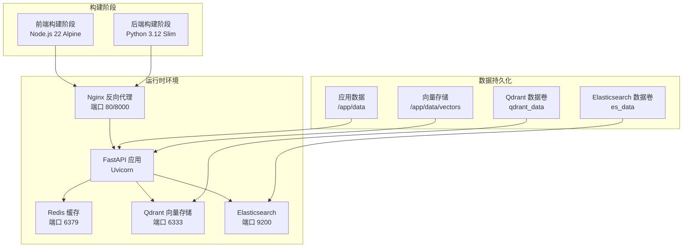
```mermaid
graph TB
subgraph "构建阶段"
FB[前端构建阶段<br/>Node.js 22 Alpine]
BB[后端构建阶段<br/>Python 3.12 Slim]
end
subgraph "运行时环境"
NGINX[Nginx 反向代理<br/>端口 80/8000]
FASTAPI[FastAPI 应用<br/>Uvicorn]
REDIS[Redis 缓存<br/>端口 6379]
QDRANT[Qdrant 向量存储<br/>端口 6333]
ES[Elasticsearch<br/>端口 9200]
end
subgraph "数据持久化"
DATA[应用数据<br/>/app/data]
VECTORS[向量存储<br/>/app/data/vectors]
QDRANT_VOL[Qdrant 数据卷<br/>qdrant_data]
ES_VOL[Elasticsearch 数据卷<br/>es_data]
end
FB --> NGINX
BB --> NGINX
NGINX --> FASTAPI
FASTAPI --> REDIS
FASTAPI --> QDRANT
FASTAPI --> ES
DATA --> FASTAPI
VECTORS --> FASTAPI
QDRANT_VOL --> QDRANT
ES_VOL --> ES
```

**图表来源**
- [Dockerfile:1-54](file://Dockerfile#L1-L54)
- [docker-compose.yml:1-64](file://docker-compose.yml#L1-L64)

**章节来源**
- [Dockerfile:1-54](file://Dockerfile#L1-L54)
- [docker-compose.yml:1-64](file://docker-compose.yml#L1-L64)

## 核心组件

### Nginx 反向代理配置

Nginx 作为反向代理服务器，负责静态资源服务、API 转发和 WebSocket 支持：

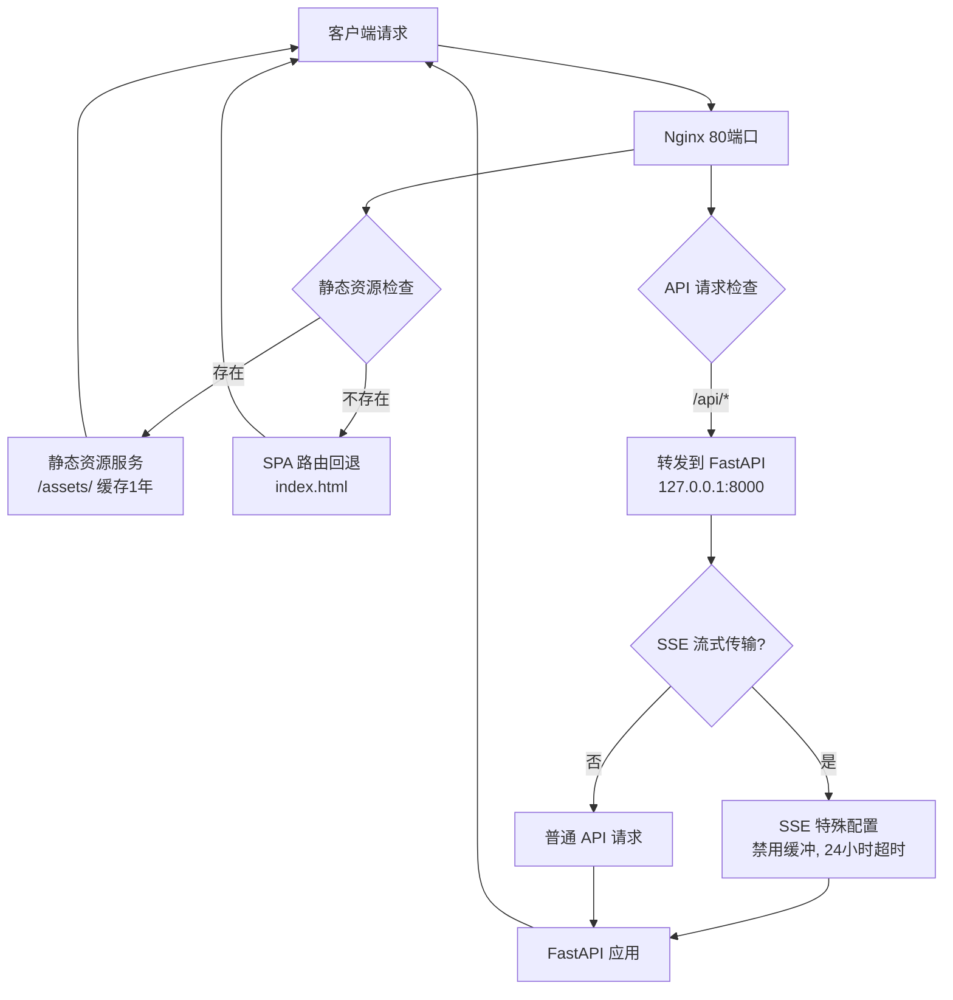
```mermaid
flowchart TD
Client[客户端请求] --> Nginx[Nginx 80端口]
Nginx --> StaticCheck{静态资源检查}
StaticCheck --> |存在| StaticServe[静态资源服务<br/>/assets/ 缓存1年]
StaticCheck --> |不存在| SPAFallback[SPA 路由回退<br/>index.html]
Nginx --> APIProxy{API 请求检查}
APIProxy --> |/api/*| APIForward[转发到 FastAPI<br/>127.0.0.1:8000]
APIForward --> SSECheck{SSE 流式传输?}
SSECheck --> |是| SSEConfig[SSE 特殊配置<br/>禁用缓冲, 24小时超时]
SSECheck --> |否| NormalAPI[普通 API 请求]
SSEConfig --> FastAPI[FastAPI 应用]
NormalAPI --> FastAPI
StaticServe --> Client
SPAFallback --> Client
FastAPI --> Client
```

**图表来源**
- [nginx.conf:17-30](file://nginx.conf#L17-L30)

### 环境变量管理系统

系统采用分层配置策略，支持多种部署环境：

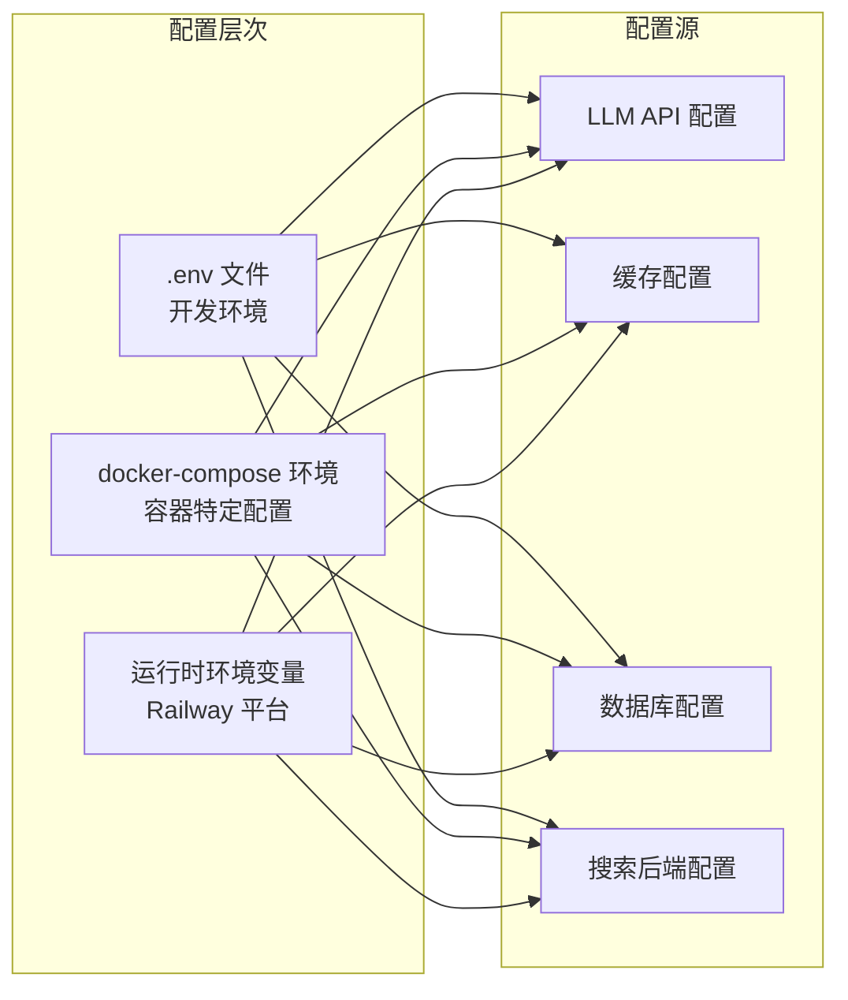
```mermaid
graph LR
subgraph "配置层次"
ENV_FILE[.env 文件<br/>开发环境]
DOCKER_ENV[docker-compose 环境<br/>容器特定配置]
RUNTIME_ENV[运行时环境变量<br/>Railway 平台]
end
subgraph "配置源"
LLM[LLM API 配置]
CACHE[缓存配置]
DB[数据库配置]
SEARCH[搜索后端配置]
end
ENV_FILE --> LLM
ENV_FILE --> CACHE
ENV_FILE --> DB
ENV_FILE --> SEARCH
DOCKER_ENV --> LLM
DOCKER_ENV --> CACHE
DOCKER_ENV --> DB
DOCKER_ENV --> SEARCH
RUNTIME_ENV --> LLM
RUNTIME_ENV --> CACHE
RUNTIME_ENV --> DB
RUNTIME_ENV --> SEARCH
```

**图表来源**
- [backend/app/config.py:4-62](file://backend/app/config.py#L4-L62)
- [backend/.env:1-13](file://backend/.env#L1-L13)

**章节来源**
- [nginx.conf:1-36](file://nginx.conf#L1-L36)
- [backend/app/config.py:1-90](file://backend/app/config.py#L1-L90)
- [backend/.env:1-13](file://backend/.env#L1-L13)

## 架构概览

Aureon 的生产架构采用微服务模式，包含多个独立的服务组件：

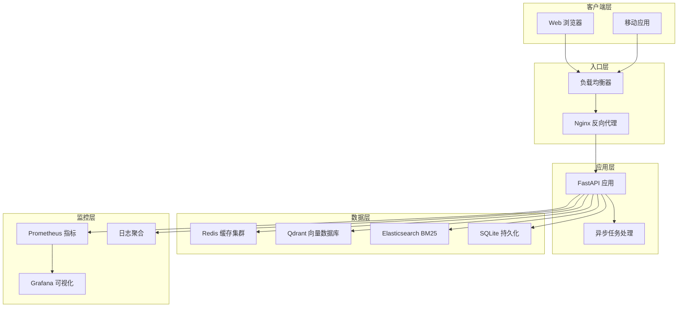
```mermaid
graph TB
subgraph "客户端层"
Browser[Web 浏览器]
Mobile[移动应用]
end
subgraph "入口层"
LB[负载均衡器]
Nginx[Nginx 反向代理]
end
subgraph "应用层"
App[FastAPI 应用]
Worker[异步任务处理]
end
subgraph "数据层"
Redis[Redis 缓存集群]
Qdrant[Qdrant 向量数据库]
ES[Elasticsearch BM25]
SQLite[SQLite 持久化]
end
subgraph "监控层"
Prometheus[Prometheus 指标]
Grafana[Grafana 可视化]
Logs[日志聚合]
end
Browser --> LB
Mobile --> LB
LB --> Nginx
Nginx --> App
App --> Redis
App --> Qdrant
App --> ES
App --> SQLite
App --> Worker
App --> Prometheus
Prometheus --> Grafana
App --> Logs
```

**图表来源**
- [docker-compose.yml:13-37](file://docker-compose.yml#L13-L37)
- [backend/app/main.py:80-81](file://backend/app/main.py#L80-L81)

## 详细组件分析

### Nginx 反向代理配置详解

#### SSL 证书配置
当前配置使用 HTTP 80 端口，生产环境中建议配置 SSL 证书：

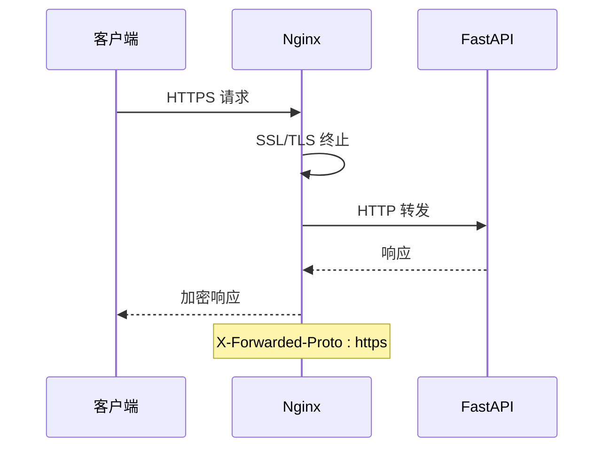
```mermaid
sequenceDiagram
participant Client as 客户端
participant Nginx as Nginx
participant FastAPI as FastAPI
Client->>Nginx : HTTPS 请求
Nginx->>Nginx : SSL/TLS 终止
Nginx->>FastAPI : HTTP 转发
FastAPI-->>Nginx : 响应
Nginx-->>Client : 加密响应
Note over Nginx : X-Forwarded-Proto : https
```

#### HTTP/HTTPS 重定向
建议添加 HTTP 到 HTTPS 的自动重定向：

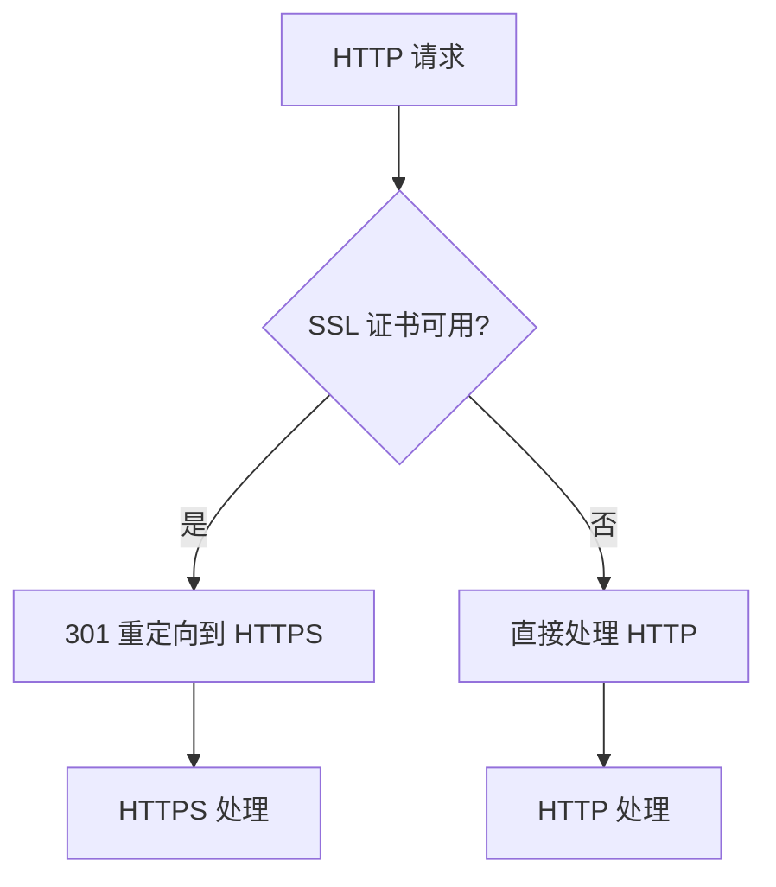
```mermaid
flowchart TD
HTTP[HTTP 请求] --> CheckSSL{SSL 证书可用?}
CheckSSL --> |是| Redirect[301 重定向到 HTTPS]
CheckSSL --> |否| HTTPDirect[直接处理 HTTP]
Redirect --> HTTPS[HTTPS 处理]
HTTPDirect --> HTTPProcess[HTTP 处理]
```

#### 静态资源服务优化
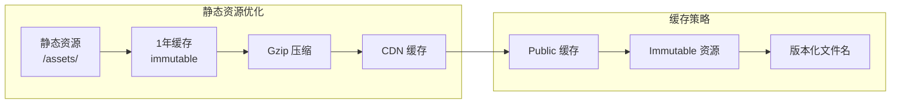
```mermaid
graph LR
subgraph "静态资源优化"
Assets[静态资源<br/>/assets/]
Cache[1年缓存<br/>immutable]
Gzip[Gzip 压缩]
CDN[CDN 缓存]
end
subgraph "缓存策略"
Public[Public 缓存]
Immutable[Immutable 资源]
Versioning[版本化文件名]
end
Assets --> Cache
Cache --> Gzip
Gzip --> CDN
CDN --> Public
Public --> Immutable
Immutable --> Versioning
```

**图表来源**
- [nginx.conf:12-15](file://nginx.conf#L12-L15)
- [nginx.conf:8-9](file://nginx.conf#L8-L9)

**章节来源**
- [nginx.conf:1-36](file://nginx.conf#L1-L36)

### 环境变量管理策略

#### 配置文件分离
系统采用多层配置管理：

| 配置层级 | 文件位置 | 用途 | 安全级别 |
|---------|----------|------|----------|
| 开发环境 | backend/.env | 本地开发配置 | 低 |
| 容器环境 | docker-compose.yml | Docker 部署配置 | 中 |
| 运行时环境 | Railway 平台 | 生产环境配置 | 高 |

#### 敏感信息保护
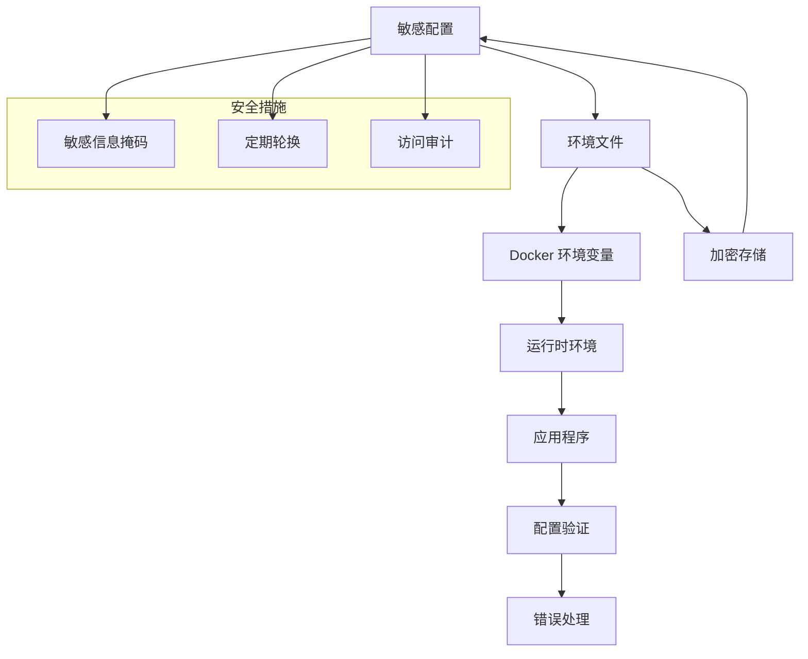
```mermaid
flowchart TD
Secret[敏感配置] --> EnvFile[环境文件]
EnvFile --> DockerEnv[Docker 环境变量]
DockerEnv --> RuntimeEnv[运行时环境]
RuntimeEnv --> App[应用程序]
App --> Validation[配置验证]
Validation --> Error[错误处理]
EnvFile --> Encryption[加密存储]
Encryption --> Secret
subgraph "安全措施"
Masking[敏感信息掩码]
Rotation[定期轮换]
Audit[访问审计]
end
Secret --> Masking
Secret --> Rotation
Secret --> Audit
```

**图表来源**
- [backend/app/config.py:62](file://backend/app/config.py#L62)
- [backend/.env:1-13](file://backend/.env#L1-L13)

**章节来源**
- [backend/app/config.py:1-90](file://backend/app/config.py#L1-L90)
- [backend/.env:1-13](file://backend/.env#L1-L13)

### 负载均衡配置

#### 健康检查端点
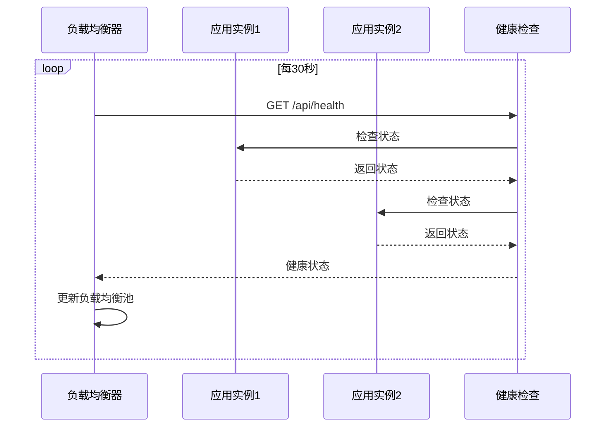
```mermaid
sequenceDiagram
participant LB as 负载均衡器
participant App1 as 应用实例1
participant App2 as 应用实例2
participant Health as 健康检查
loop 每30秒
LB->>Health : GET /api/health
Health->>App1 : 检查状态
App1-->>Health : 返回状态
Health->>App2 : 检查状态
App2-->>Health : 返回状态
Health-->>LB : 健康状态
LB->>LB : 更新负载均衡池
end
```

#### 自动扩缩容设置
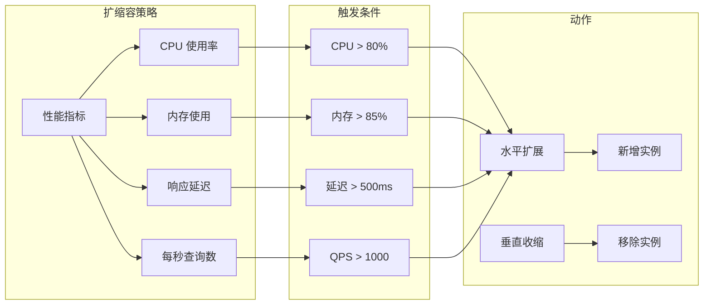
```mermaid
graph LR
subgraph "扩缩容策略"
Metrics[性能指标]
CPU[CPU 使用率]
Memory[内存使用]
Latency[响应延迟]
QPS[每秒查询数]
end
subgraph "触发条件"
CPULimit[CPU > 80%]
MemLimit[内存 > 85%]
LatLimit[延迟 > 500ms]
QPSLimit[QPS > 1000]
end
subgraph "动作"
ScaleUp[水平扩展]
ScaleDown[垂直收缩]
NewInstance[新增实例]
RemoveInstance[移除实例]
end
Metrics --> CPU
Metrics --> Memory
Metrics --> Latency
Metrics --> QPS
CPU --> CPULimit
Memory --> MemLimit
Latency --> LatLimit
QPS --> QPSLimit
CPULimit --> ScaleUp
MemLimit --> ScaleUp
LatLimit --> ScaleUp
QPSLimit --> ScaleUp
ScaleUp --> NewInstance
ScaleDown --> RemoveInstance
```

**图表来源**
- [railway.json:12-13](file://railway.json#L12-L13)
- [backend/app/main.py:340-347](file://backend/app/main.py#L340-L347)

**章节来源**
- [railway.json:1-16](file://railway.json#L1-L16)
- [backend/app/main.py:340-347](file://backend/app/main.py#L340-L347)

### 数据库连接池配置

#### Redis 缓存集群设置
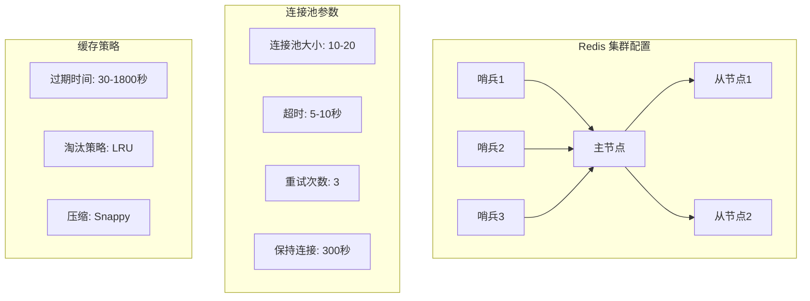
```mermaid
graph TB
subgraph "Redis 集群配置"
RedisMaster[主节点]
RedisSlave1[从节点1]
RedisSlave2[从节点2]
Sentinel1[哨兵1]
Sentinel2[哨兵2]
Sentinel3[哨兵3]
end
subgraph "连接池参数"
PoolSize[连接池大小: 10-20]
Timeout[超时: 5-10秒]
Retry[重试次数: 3]
KeepAlive[保持连接: 300秒]
end
subgraph "缓存策略"
TTL[过期时间: 30-1800秒]
Eviction[淘汰策略: LRU]
Compression[压缩: Snappy]
end
RedisMaster --> RedisSlave1
RedisMaster --> RedisSlave2
Sentinel1 --> RedisMaster
Sentinel2 --> RedisMaster
Sentinel3 --> RedisMaster
```

#### 向量数据库配置
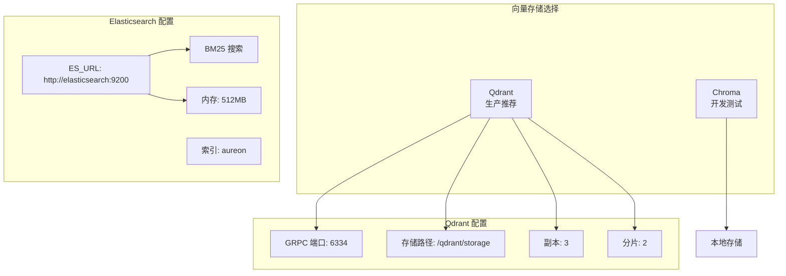
```mermaid
flowchart TD
subgraph "向量存储选择"
Qdrant[Qdrant<br/>生产推荐]
Chroma[Chroma<br/>开发测试]
end
subgraph "Qdrant 配置"
GRPC[GRPC 端口: 6334]
Storage[存储路径: /qdrant/storage]
Replication[副本: 3]
Sharding[分片: 2]
end
subgraph "Elasticsearch 配置"
ES_URL[ES_URL: http://elasticsearch:9200]
Index[索引: aureon]
BM25[BM25 搜索]
Memory[内存: 512MB]
end
Qdrant --> GRPC
Qdrant --> Storage
Qdrant --> Replication
Qdrant --> Sharding
Chroma --> LocalStorage[本地存储]
ES_URL --> BM25
ES_URL --> Memory
```

**图表来源**
- [docker-compose.yml:39-47](file://docker-compose.yml#L39-L47)
- [docker-compose.yml:49-59](file://docker-compose.yml#L49-L59)

**章节来源**
- [docker-compose.yml:1-64](file://docker-compose.yml#L1-L64)

### 外部服务集成方案

#### LLM 供应商集成
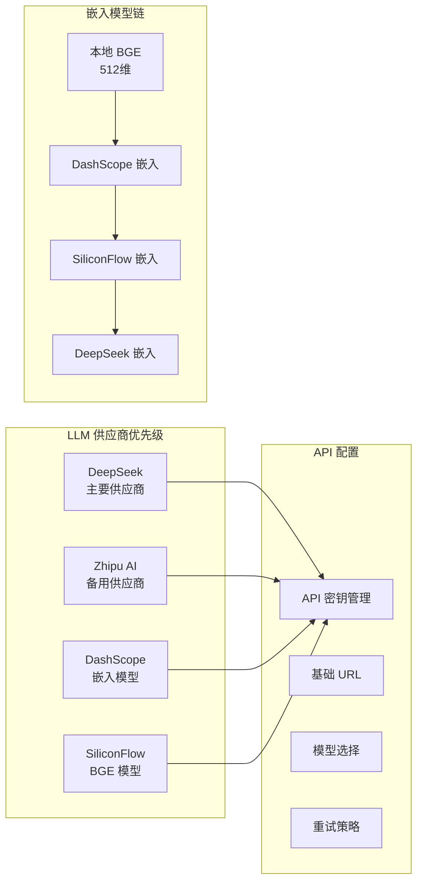
```mermaid
graph LR
subgraph "LLM 供应商优先级"
DeepSeek[DeepSeek<br/>主要供应商]
Zhipu[Zhipu AI<br/>备用供应商]
DashScope[DashScope<br/>嵌入模型]
SiliconFlow[SiliconFlow<br/>BGE 模型]
end
subgraph "API 配置"
APIKey[API 密钥管理]
BaseURL[基础 URL]
Model[模型选择]
Retry[重试策略]
end
subgraph "嵌入模型链"
LocalBGE[本地 BGE<br/>512维]
DashScopeEmb[DashScope 嵌入]
SiliconEmb[SiliconFlow 嵌入]
DeepSeekEmb[DeepSeek 嵌入]
end
DeepSeek --> APIKey
Zhipu --> APIKey
DashScope --> APIKey
SiliconFlow --> APIKey
LocalBGE --> DashScopeEmb
DashScopeEmb --> SiliconEmb
SiliconEmb --> DeepSeekEmb
```

**图表来源**
- [backend/app/config.py:7-34](file://backend/app/config.py#L7-L34)

**章节来源**
- [backend/app/config.py:1-90](file://backend/app/config.py#L1-L90)

### 安全配置

#### CORS 设置
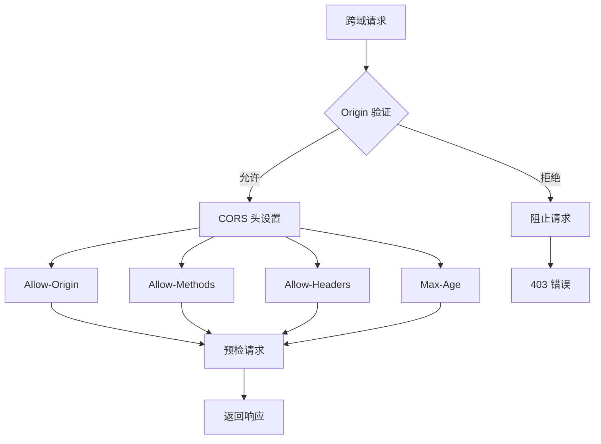
```mermaid
flowchart TD
Request[跨域请求] --> OriginCheck{Origin 验证}
OriginCheck --> |允许| HeaderSetup[CORS 头设置]
OriginCheck --> |拒绝| BlockRequest[阻止请求]
HeaderSetup --> AllowOrigins[Allow-Origin]
HeaderSetup --> AllowMethods[Allow-Methods]
HeaderSetup --> AllowHeaders[Allow-Headers]
HeaderSetup --> MaxAge[Max-Age]
AllowOrigins --> Preflight[预检请求]
AllowMethods --> Preflight
AllowHeaders --> Preflight
MaxAge --> Preflight
Preflight --> Response[返回响应]
BlockRequest --> ErrorResponse[403 错误]
```

#### CSRF 保护
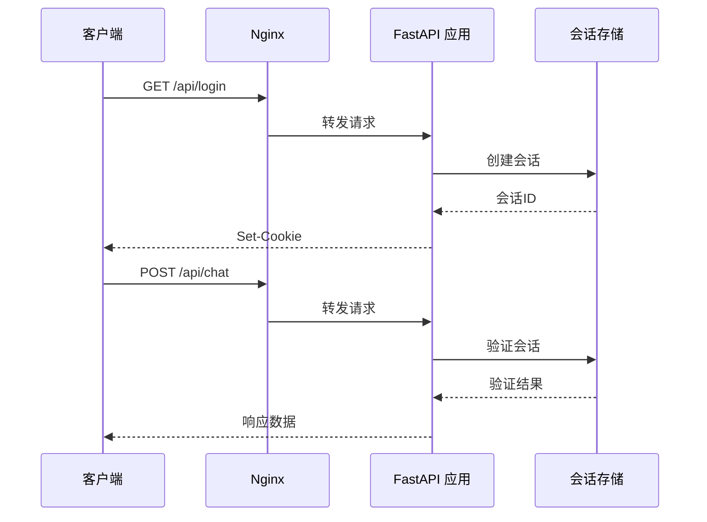
```mermaid
sequenceDiagram
participant Client as 客户端
participant Nginx as Nginx
participant App as FastAPI 应用
participant Session as 会话存储
Client->>Nginx : GET /api/login
Nginx->>App : 转发请求
App->>Session : 创建会话
Session-->>App : 会话ID
App-->>Client : Set-Cookie
Client->>Nginx : POST /api/chat
Nginx->>App : 转发请求
App->>Session : 验证会话
Session-->>App : 验证结果
App-->>Client : 响应数据
```

#### API 限流策略
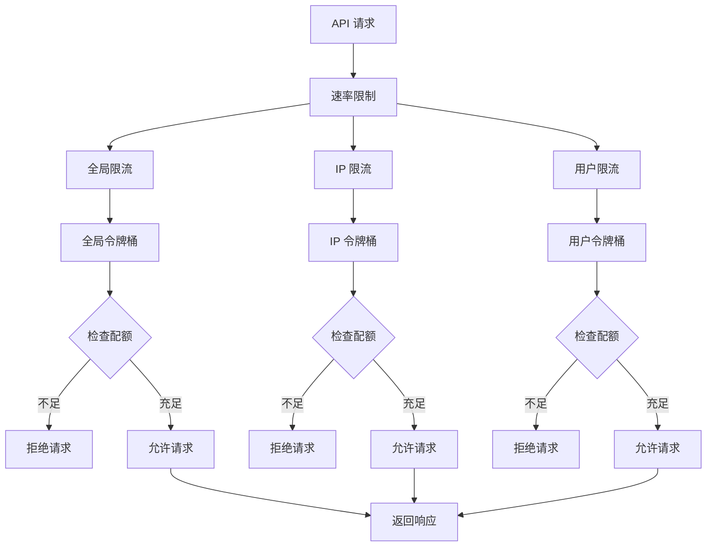
```mermaid
flowchart TD
Request[API 请求] --> RateLimit[速率限制]
RateLimit --> GlobalLimit[全局限流]
RateLimit --> PerIP[IP 限流]
RateLimit --> PerUser[用户限流]
GlobalLimit --> GlobalBucket[全局令牌桶]
PerIP --> IPBucket[IP 令牌桶]
PerUser --> UserBucket[用户令牌桶]
GlobalBucket --> CheckGlobal{检查配额}
IPBucket --> CheckIP{检查配额}
UserBucket --> CheckUser{检查配额}
CheckGlobal --> |不足| RejectGlobal[拒绝请求]
CheckGlobal --> |充足| AllowGlobal[允许请求]
CheckIP --> |不足| RejectIP[拒绝请求]
CheckIP --> |充足| AllowIP[允许请求]
CheckUser --> |不足| RejectUser[拒绝请求]
CheckUser --> |充足| AllowUser[允许请求]
AllowGlobal --> Response[返回响应]
AllowIP --> Response
AllowUser --> Response
```

**图表来源**
- [backend/app/main.py:65-78](file://backend/app/main.py#L65-L78)
- [backend/app/main.py:218-225](file://backend/app/main.py#L218-L225)

**章节来源**
- [backend/app/main.py:65-125](file://backend/app/main.py#L65-L125)

## 依赖关系分析

### Docker 镜像依赖

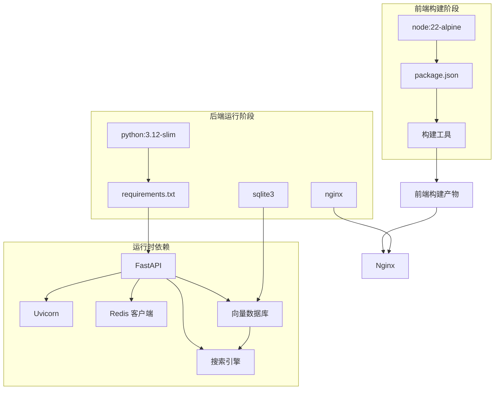
```mermaid
graph TB
subgraph "前端构建阶段"
NodeBase[node:22-alpine]
PackageJSON[package.json]
BuildTools[构建工具]
end
subgraph "后端运行阶段"
PythonBase[python:3.12-slim]
NginxBase[nginx]
SQLiteBase[sqlite3]
Requirements[requirements.txt]
end
subgraph "运行时依赖"
FastAPI[FastAPI]
Uvicorn[Uvicorn]
Redis[Redis 客户端]
VectorDB[向量数据库]
Search[搜索引擎]
end
NodeBase --> PackageJSON
PackageJSON --> BuildTools
BuildTools --> FrontendDist[前端构建产物]
PythonBase --> Requirements
Requirements --> FastAPI
NginxBase --> Nginx
SQLiteBase --> VectorDB
VectorDB --> Search
FrontendDist --> Nginx
FastAPI --> Uvicorn
FastAPI --> Redis
FastAPI --> VectorDB
FastAPI --> Search
```

**图表来源**
- [Dockerfile:1-54](file://Dockerfile#L1-L54)
- [backend/requirements.txt:1-57](file://backend/requirements.txt#L1-L57)

### 外部服务依赖

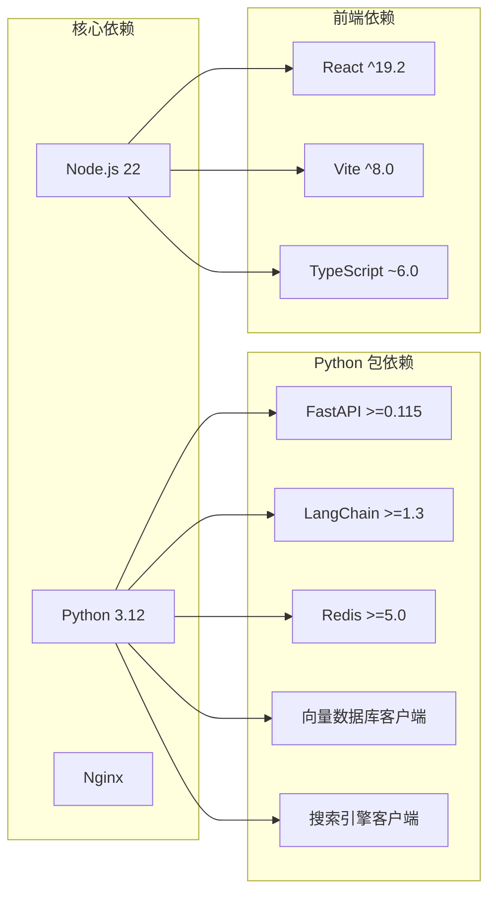
```mermaid
graph LR
subgraph "核心依赖"
Python[Python 3.12]
Node[Node.js 22]
Nginx[Nginx]
end
subgraph "Python 包依赖"
FastAPI[FastAPI >=0.115]
LangChain[LangChain >=1.3]
Redis[Redis >=5.0]
VectorDB[向量数据库客户端]
Search[搜索引擎客户端]
end
subgraph "前端依赖"
React[React ^19.2]
Vite[Vite ^8.0]
TypeScript[TypeScript ~6.0]
end
Python --> FastAPI
Python --> LangChain
Python --> Redis
Python --> VectorDB
Python --> Search
Node --> React
Node --> Vite
Node --> TypeScript
```

**图表来源**
- [backend/requirements.txt:4-57](file://backend/requirements.txt#L4-L57)
- [package.json:14-26](file://package.json#L14-L26)

**章节来源**
- [Dockerfile:1-54](file://Dockerfile#L1-L54)
- [backend/requirements.txt:1-57](file://backend/requirements.txt#L1-L57)
- [package.json:1-54](file://package.json#L1-L54)

## 性能考虑

### Nginx 性能调优参数


```mermaid
flowchart TD
subgraph "连接优化"
WorkerProcesses[worker_processes: auto]
WorkerConnections[worker_connections: 1024]
MultiAccept[multi_accept: on]
AcceptMutex[accept_mutex: on]
end
subgraph "缓存优化"
ClientBodyTemp[client_body_temp_path]
Sendfile[sendfile: on]
TCPNodelay[tcp_nodelay: on]
TCPKeepalive[tcp_keepalive_time: 600]
end
subgraph "压缩优化"
GzipStatic[gzip_static: on]
GzipBuffers[Gzip buffers]
GzipCompLevel[Gzip 压缩级别]
end
subgraph "超时优化"
KeepaliveTimeout[keepalive_timeout: 65]
SendTimeout[send_timeout: 10]
ClientBodyTimeout[client_body_timeout: 10]
end
WorkerProcesses --> WorkerConnections
WorkerConnections --> MultiAccept
MultiAccept --> AcceptMutex
ClientBodyTemp --> Sendfile
Sendfile --> TCPNodelay
TCPNodelay --> TCPKeepalive
GzipStatic --> GzipBuffers
GzipBuffers --> GzipCompLevel
KeepaliveTimeout --> SendTimeout
SendTimeout --> ClientBodyTimeout
```

### 应用性能监控

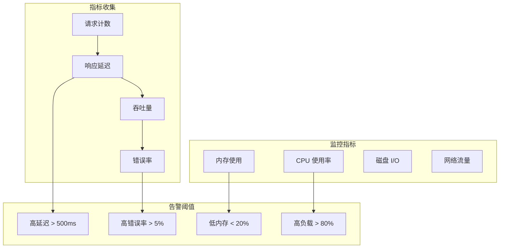
```mermaid
graph TB
subgraph "指标收集"
Requests[请求计数]
Latency[响应延迟]
Throughput[吞吐量]
ErrorRate[错误率]
end
subgraph "监控指标"
CPU[CPU 使用率]
Memory[内存使用]
DiskIO[磁盘 I/O]
Network[网络流量]
end
subgraph "告警阈值"
HighLatency[高延迟 > 500ms]
HighError[高错误率 > 5%]
LowMemory[低内存 < 20%]
HighLoad[高负载 > 80%]
end
Requests --> Latency
Latency --> Throughput
Throughput --> ErrorRate
CPU --> HighLoad
Memory --> LowMemory
Latency --> HighLatency
ErrorRate --> HighError
```

**章节来源**
- [nginx.conf:1-36](file://nginx.conf#L1-L36)
- [backend/app/main.py:80-81](file://backend/app/main.py#L80-L81)

## 故障排除指南

### 常见部署问题

#### 健康检查失败
```mermaid
flowchart TD
HealthFail[健康检查失败] --> CheckPort[检查端口映射]
CheckPort --> PortMap[80:80 映射]
PortMap --> CheckProcess[检查进程状态]
CheckProcess --> RestartProcess[重启进程]
RestartProcess --> VerifyHealth[验证健康状态]
HealthFail --> CheckModel[检查模型加载]
CheckModel --> ModelDownload[下载模型]
ModelDownload --> Warmup[预热模型]
Warmup --> VerifyHealth
HealthFail --> CheckDependencies[检查依赖]
CheckDependencies --> InstallDeps[安装缺失依赖]
InstallDeps --> VerifyHealth
```

#### 内存不足问题
```mermaid
flowchart TD
MemoryIssue[内存不足] --> CheckUsage[检查内存使用]
CheckUsage --> HighUsage[高内存使用]
HighUsage --> OptimizeConfig[优化配置]
OptimizeConfig --> ReducePool[减少连接池]
ReducePool --> IncreaseSwap[增加交换空间]
IncreaseSwap --> MonitorMetrics[监控指标]
MemoryIssue --> CheckLeak[检查内存泄漏]
CheckLeak --> FixCode[修复代码问题]
FixCode --> MonitorMetrics
```

#### API 限流问题
```mermaid
flowchart TD
RateLimit[API 限流] --> CheckLimits[检查限流配置]
CheckLimits --> GlobalLimit[全局限流]
CheckLimits --> IPLimit[IP 限流]
CheckLimits --> UserLimit[用户限流]
GlobalLimit --> AdjustGlobal[调整全局配置]
IPLimit --> AdjustIP[调整IP配置]
UserLimit --> AdjustUser[调整用户配置]
AdjustGlobal --> TestLimits[测试限流]
AdjustIP --> TestLimits
AdjustUser --> TestLimits
TestLimits --> MonitorMetrics[监控指标]
```

**章节来源**
- [docker-entrypoint.sh:1-15](file://docker-entrypoint.sh#L1-L15)
- [backend/app/main.py:65-71](file://backend/app/main.py#L65-L71)

### 运维检查清单

#### 部署前检查
- [ ] 环境变量配置完整
- [ ] SSL 证书准备就绪
- [ ] 数据库连接测试
- [ ] 缓存集群健康检查
- [ ] 外部服务可用性验证

#### 运行时监控
- [ ] 健康检查端点状态
- [ ] 性能指标监控
- [ ] 错误日志分析
- [ ] 资源使用情况
- [ ] 用户反馈收集

#### 故障恢复流程
- [ ] 自动重启配置
- [ ] 备份策略验证
- [ ] 灾难恢复计划
- [ ] 回滚机制测试
- [ ] 应急联系人

## 结论

Aureon 系统提供了完整的生产环境配置方案，涵盖了从基础设施到应用层的各个方面。通过合理的架构设计、安全配置和性能优化，可以确保系统在生产环境中的稳定运行。

关键优势包括：
- 多阶段 Docker 构建优化了镜像大小和启动时间
- 灵活的环境变量管理系统支持多种部署场景
- 全面的安全配置保护系统免受常见攻击
- 完善的监控和告警机制确保问题及时发现
- 可扩展的架构支持水平和垂直扩展

建议在实际部署时根据具体需求调整配置参数，并建立完善的监控和维护流程。

## 附录

### 配置文件参考

#### Nginx 配置模板
```nginx
# 基础配置
listen 80;
server_name your-domain.com;

# SSL 配置（生产环境）
# listen 443 ssl http2;
# ssl_certificate /path/to/certificate.pem;
# ssl_certificate_key /path/to/private.key;

# Gzip 压缩
gzip on;
gzip_types text/plain text/css application/json application/javascript text/xml application/xml application/xml+rss text/javascript;

# 静态资源缓存
location /assets/ {
    expires 1y;
    add_header Cache-Control "public, immutable";
}

# API 反向代理
location /api/ {
    proxy_pass http://127.0.0.1:8000;
    proxy_http_version 1.1;
    proxy_set_header Upgrade $http_upgrade;
    proxy_set_header Connection 'upgrade';
    proxy_set_header Host $host;
    proxy_cache_bypass $http_upgrade;
    proxy_set_header X-Real-IP $remote_addr;
    proxy_set_header X-Forwarded-For $proxy_add_x_forwarded_for;
    proxy_set_header X-Forwarded-Proto $scheme;
    proxy_buffering off;
    proxy_read_timeout 86400s;
}

# SPA 路由回退
location / {
    try_files $uri /index.html;
}
```

#### 环境变量配置示例
```bash
# LLM 配置
LLM_API_KEY=your_primary_api_key
LLM_MODEL=deepseek-v4-flash
LLM_BASE_URL=https://api.deepseek.com

# 嵌入模型配置
EMBEDDING_API_KEY=your_embedding_api_key
EMBEDDING_MODEL=text-embedding-v3

# 缓存配置
REDIS_URL=redis://redis:6379/0

# 向量存储配置
VECTOR_BACKEND=qdrant
QDRANT_URL=http://qdrant:6333

# 搜索配置
ES_URL=http://elasticsearch:9200
ES_INDEX=aureon

# CORS 配置
CORS_ORIGINS=http://localhost:5173,https://yourdomain.com
```

#### Docker Compose 配置示例
```yaml
version: '3.8'

services:
  app:
    build:
      context: .
      dockerfile: Dockerfile
    ports:
      - "80:80"
      - "443:443"
    env_file:
      - backend/.env
    environment:
      - REDIS_URL=redis://redis:6379/0
      - VECTOR_BACKEND=qdrant
      - QDRANT_URL=http://qdrant:6333
      - ES_URL=http://elasticsearch:9200
    depends_on:
      redis:
        condition: service_healthy
      qdrant:
        condition: service_started
      elasticsearch:
        condition: service_started
    restart: unless-stopped

  redis:
    image: redis:7-alpine
    healthcheck:
      test: ["CMD", "redis-cli", "ping"]
      interval: 5s
      timeout: 3s
      retries: 5
    restart: unless-stopped

  qdrant:
    image: qdrant/qdrant:latest
    ports:
      - "6333:6333"
    volumes:
      - qdrant_data:/qdrant/storage
    restart: unless-stopped

  elasticsearch:
    image: docker.elastic.co/elasticsearch/elasticsearch:8.12.0
    environment:
      - discovery.type=single-node
      - xpack.security.enabled=false
      - ES_JAVA_OPTS=-Xms512m -Xmx512m
    ports:
      - "9200:9200"
    volumes:
      - es_data:/usr/share/elasticsearch/data
    restart: unless-stopped

volumes:
  qdrant_data:
  es_data:
```