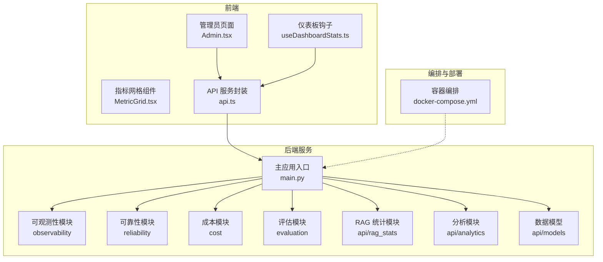
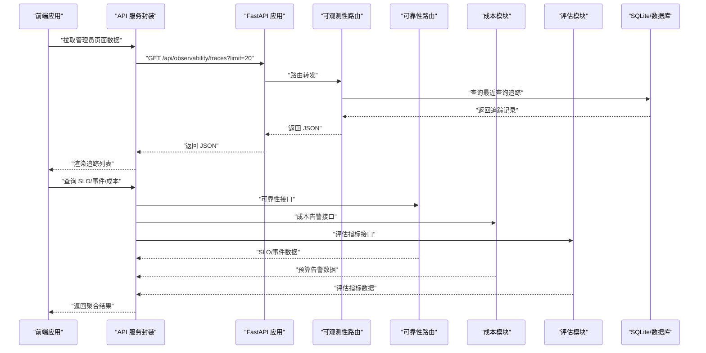
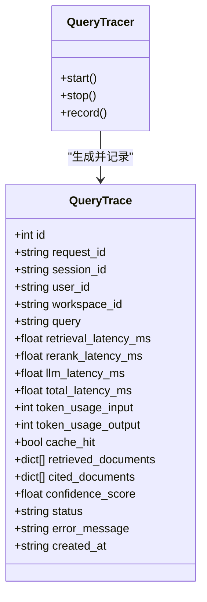
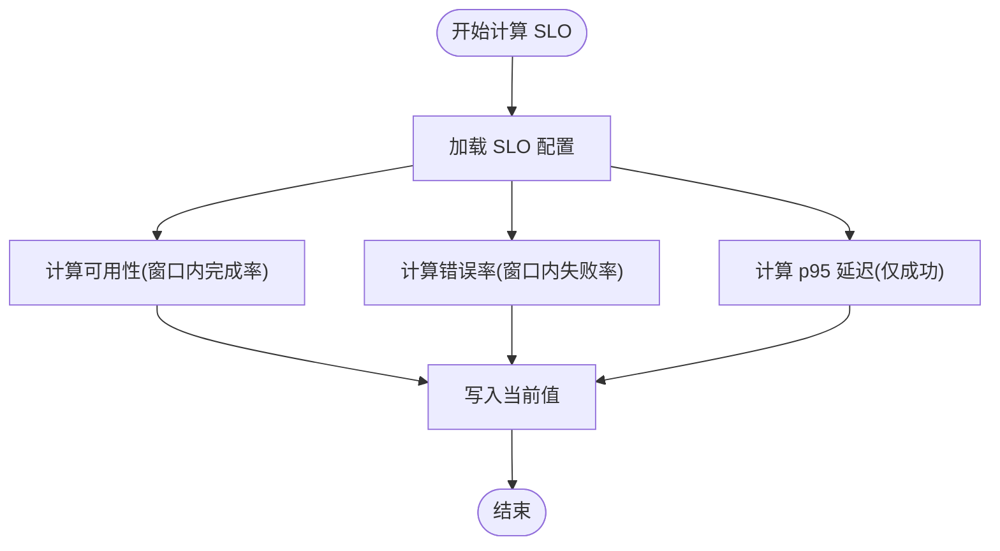
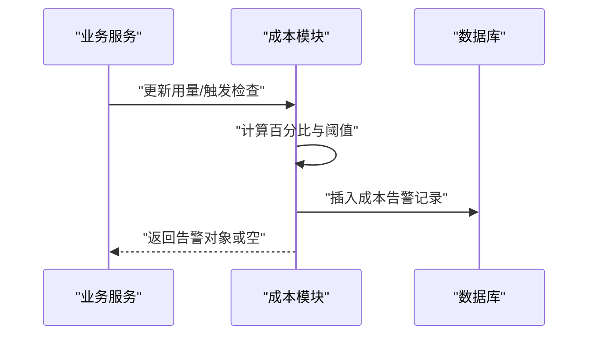
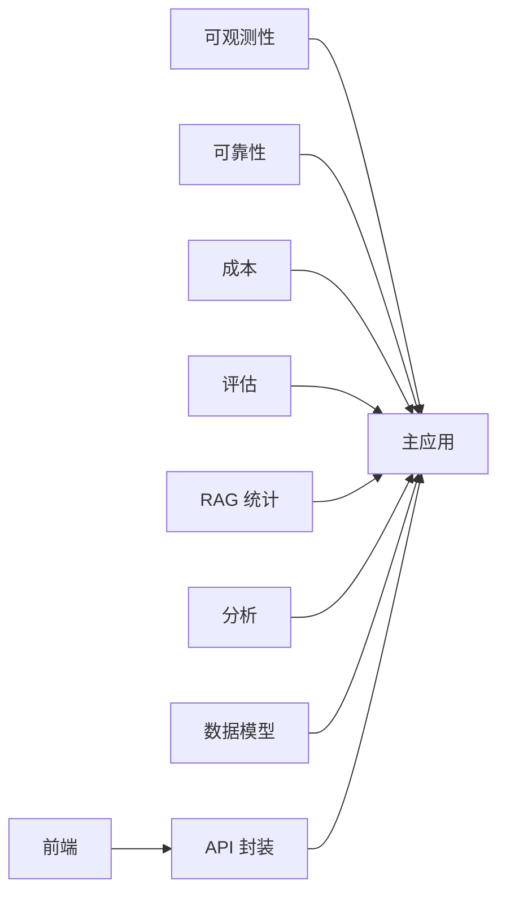

# 监控告警

<cite>
**本文引用的文件**
- [backend/app/observability/router.py](file://backend/app/observability/router.py)
- [backend/app/observability/__init__.py](file://backend/app/observability/__init__.py)
- [backend/tests/test_observability.py](file://backend/tests/test_observability.py)
- [backend/app/reliability/__init__.py](file://backend/app/reliability/__init__.py)
- [backend/app/reliability/router.py](file://backend/app/reliability/router.py)
- [backend/app/cost/__init__.py](file://backend/app/cost/__init__.py)
- [backend/app/evaluation/__init__.py](file://backend/app/evaluation/__init__.py)
- [backend/app/api/rag_stats.py](file://backend/app/api/rag_stats.py)
- [backend/app/api/analytics.py](file://backend/app/api/analytics.py)
- [backend/app/api/models.py](file://backend/app/api/models.py)
- [backend/app/main.py](file://backend/app/main.py)
- [src/pages/Admin.tsx](file://src/pages/Admin.tsx)
- [src/components/dashboard/MetricGrid.tsx](file://src/components/dashboard/MetricGrid.tsx)
- [src/hooks/useDashboardStats.ts](file://src/hooks/useDashboardStats.ts)
- [src/services/api.ts](file://src/services/api.ts)
- [docker-compose.yml](file://docker-compose.yml)
- [README.md](file://README.md)
</cite>

## 目录
1. [简介](#简介)
2. [项目结构](#项目结构)
3. [核心组件](#核心组件)
4. [架构总览](#架构总览)
5. [详细组件分析](#详细组件分析)
6. [依赖关系分析](#依赖关系分析)
7. [性能考量](#性能考量)
8. [故障排查指南](#故障排查指南)
9. [结论](#结论)
10. [附录](#附录)

## 简介
本文件面向运维与平台工程团队，系统化梳理 Aureon 系统在可观测性、性能监控、成本与可靠性管理、评估与分析等方面的监控告警方案。重点覆盖：
- 查询追踪与分布式追踪：基于请求级指标（延迟、缓存命中、引用文档等）的采集与查询接口
- 可靠性与 SLO：事件与工单、SLO 配置与计算
- 成本预算告警：按工作区维度的成本阈值检测与记录
- 评估与分析：RAG 质量与性能指标的存储与查询
- 前端可视化：仪表板与管理员页面的数据来源与展示
- 运维最佳实践：阈值建议、故障预警策略与容量规划支撑

## 项目结构
Aureon 的监控与可观测性能力主要分布在后端服务的可观测性层、可靠性层、成本层与评估分析层，并通过 FastAPI 路由暴露给前端与外部系统。

图表来源
- [backend/app/observability/router.py:1-22](file://backend/app/observability/router.py#L1-L22)
- [backend/app/reliability/router.py](file://backend/app/reliability/router.py)
- [backend/app/cost/__init__.py:99-102](file://backend/app/cost/__init__.py#L99-L102)
- [backend/app/evaluation/__init__.py:47-79](file://backend/app/evaluation/__init__.py#L47-L79)
- [backend/app/api/rag_stats.py:314-328](file://backend/app/api/rag_stats.py#L314-L328)
- [backend/app/api/analytics.py](file://backend/app/api/analytics.py)
- [backend/app/api/models.py](file://backend/app/api/models.py)
- [backend/app/main.py](file://backend/app/main.py)
- [src/pages/Admin.tsx:29-38](file://src/pages/Admin.tsx#L29-L38)
- [src/components/dashboard/MetricGrid.tsx:1-30](file://src/components/dashboard/MetricGrid.tsx#L1-L30)
- [src/hooks/useDashboardStats.ts](file://src/hooks/useDashboardStats.ts)
- [src/services/api.ts](file://src/services/api.ts)
- [docker-compose.yml](file://docker-compose.yml)

章节来源
- [README.md:26-31](file://README.md#L26-L31)
- [backend/app/main.py](file://backend/app/main.py)

## 核心组件
- 可观测性追踪与统计
  - 数据模型：请求级指标（检索、重排序、LLM 推理、总延迟、Token 使用、缓存命中、引用文档等）
  - 接口：查询最近追踪列表、获取统计摘要
- 可靠性与 SLO
  - 事件与工单：创建、关闭、列出开放事件
  - SLO：目标值、窗口期、启用状态、计算当前可用性/错误率/p95 延迟
- 成本预算告警
  - 预算阈值检测、告警记录入库
- 评估与分析
  - 评估指标存储与索引、最新指标查询
- 前端可视化
  - 管理员页面集成可观测性追踪列表
  - 仪表板组件与钩子用于展示关键指标

章节来源
- [backend/app/observability/__init__.py:12-33](file://backend/app/observability/__init__.py#L12-L33)
- [backend/app/observability/router.py:12-22](file://backend/app/observability/router.py#L12-L22)
- [backend/app/reliability/__init__.py:109-147](file://backend/app/reliability/__init__.py#L109-L147)
- [backend/app/reliability/__init__.py:350-385](file://backend/app/reliability/__init__.py#L350-L385)
- [backend/app/cost/__init__.py:99-102](file://backend/app/cost/__init__.py#L99-L102)
- [backend/app/cost/__init__.py:341-397](file://backend/app/cost/__init__.py#L341-L397)
- [backend/app/evaluation/__init__.py:47-79](file://backend/app/evaluation/__init__.py#L47-L79)
- [backend/app/evaluation/__init__.py:112-129](file://backend/app/evaluation/__init__.py#L112-L129)
- [src/pages/Admin.tsx:29-38](file://src/pages/Admin.tsx#L29-L38)
- [src/components/dashboard/MetricGrid.tsx:1-30](file://src/components/dashboard/MetricGrid.tsx#L1-L30)

## 架构总览
下图展示了从前端到后端可观测性接口、可靠性与成本模块的整体调用链路与数据流。

图表来源
- [src/pages/Admin.tsx:29-38](file://src/pages/Admin.tsx#L29-L38)
- [backend/app/observability/router.py:12-22](file://backend/app/observability/router.py#L12-L22)
- [backend/app/reliability/router.py](file://backend/app/reliability/router.py)
- [backend/app/cost/__init__.py:341-397](file://backend/app/cost/__init__.py#L341-L397)
- [backend/app/evaluation/__init__.py:112-129](file://backend/app/evaluation/__init__.py#L112-L129)

## 详细组件分析

### 可观测性追踪与统计
- 数据模型
  - 请求级指标字段：检索延迟、重排序延迟、LLM 延迟、总延迟、输入/输出 Token 数、缓存命中、引用文档、置信度、状态、错误信息、创建时间等
- 处理流程
  - 记录查询追踪：在查询处理链路中生成 QueryTrace 并持久化
  - 查询最近追踪：支持分页限制，便于前端快速加载
  - 统计摘要：提供总请求数、成功率、平均/分位延迟等指标
- 前端集成
  - 管理员页面同时拉取 SSO 提供商与最近追踪，用于审计与问题定位

图表来源
- [backend/app/observability/__init__.py:12-33](file://backend/app/observability/__init__.py#L12-L33)
- [backend/app/observability/__init__.py:35-36](file://backend/app/observability/__init__.py#L35-L36)

章节来源
- [backend/app/observability/__init__.py:12-33](file://backend/app/observability/__init__.py#L12-L33)
- [backend/app/observability/router.py:12-22](file://backend/app/observability/router.py#L12-L22)
- [backend/tests/test_observability.py:17-41](file://backend/tests/test_observability.py#L17-L41)
- [src/pages/Admin.tsx:29-38](file://src/pages/Admin.tsx#L29-L38)

### 可靠性与 SLO
- 事件与工单
  - 支持创建事件、解析事件、列出开放事件等操作，便于故障管理闭环
- SLO 配置与计算
  - 存储 SLO 配置（指标名、目标值、窗口天数、启用状态）
  - 计算当前可用性、错误率、p95 延迟等指标，支持按窗口期聚合

图表来源
- [backend/app/reliability/__init__.py:350-385](file://backend/app/reliability/__init__.py#L350-L385)

章节来源
- [backend/app/reliability/__init__.py:109-147](file://backend/app/reliability/__init__.py#L109-L147)
- [backend/app/reliability/__init__.py:350-385](file://backend/app/reliability/__init__.py#L350-L385)
- [backend/app/reliability/router.py](file://backend/app/reliability/router.py)

### 成本预算告警
- 功能概述
  - 检测工作区维度的使用是否超过阈值，生成告警并入库记录
  - 告警类型：warning、critical、exceeded
- 数据模型
  - 成本告警表包含工作区、告警类型、消息、当前用量、限额、百分比等字段

图表来源
- [backend/app/cost/__init__.py:341-397](file://backend/app/cost/__init__.py#L341-L397)
- [backend/app/cost/__init__.py:99-102](file://backend/app/cost/__init__.py#L99-L102)

章节来源
- [backend/app/cost/__init__.py:99-102](file://backend/app/cost/__init__.py#L99-L102)
- [backend/app/cost/__init__.py:341-397](file://backend/app/cost/__init__.py#L341-L397)

### 评估与分析
- 评估指标存储
  - 创建评估指标表与索引，支持按类型查询最新指标
- 分析接口
  - 提供分析数据查询接口，结合前端组件进行可视化展示

章节来源
- [backend/app/evaluation/__init__.py:47-79](file://backend/app/evaluation/__init__.py#L47-L79)
- [backend/app/evaluation/__init__.py:112-129](file://backend/app/evaluation/__init__.py#L112-L129)
- [backend/app/api/analytics.py](file://backend/app/api/analytics.py)

### 前端可视化与集成
- 管理员页面
  - 同时拉取 SSO 提供商与最近追踪，用于审计与问题定位
- 指标网格组件
  - 支持多列布局，用于展示关键指标卡片
- 仪表板钩子
  - 通过 API 服务封装统一访问后端接口

章节来源
- [src/pages/Admin.tsx:29-38](file://src/pages/Admin.tsx#L29-L38)
- [src/components/dashboard/MetricGrid.tsx:1-30](file://src/components/dashboard/MetricGrid.tsx#L1-L30)
- [src/hooks/useDashboardStats.ts](file://src/hooks/useDashboardStats.ts)
- [src/services/api.ts](file://src/services/api.ts)

## 依赖关系分析
- 组件耦合
  - 观测性模块与主应用通过路由解耦；可靠性、成本、评估模块均通过 FastAPI 路由对外暴露
  - 前端通过统一 API 封装访问后端接口，降低对具体路由的耦合
- 外部依赖
  - SQLite 作为本地存储，可观测性追踪、可靠性事件、SLO 配置、成本告警、评估指标均落库
- 潜在循环依赖
  - 当前模块以路由为边界，未见直接循环导入

图表来源
- [backend/app/main.py](file://backend/app/main.py)
- [backend/app/observability/router.py:1-22](file://backend/app/observability/router.py#L1-L22)
- [backend/app/reliability/router.py](file://backend/app/reliability/router.py)
- [backend/app/cost/__init__.py:99-102](file://backend/app/cost/__init__.py#L99-L102)
- [backend/app/evaluation/__init__.py:47-79](file://backend/app/evaluation/__init__.py#L47-L79)
- [backend/app/api/rag_stats.py:314-328](file://backend/app/api/rag_stats.py#L314-L328)
- [backend/app/api/analytics.py](file://backend/app/api/analytics.py)
- [backend/app/api/models.py](file://backend/app/api/models.py)
- [src/services/api.ts](file://src/services/api.ts)

## 性能考量
- 指标粒度与开销
  - 请求级追踪包含多个阶段延迟与 Token 使用，建议在生产环境按采样比例控制记录数量
- 查询性能
  - SLO 计算涉及窗口期聚合与排序，建议为时间字段与状态字段建立索引（已存在）
- 前端渲染
  - 管理员页面同时发起多个请求，建议增加并发控制与错误兜底，避免阻塞

章节来源
- [backend/app/reliability/__init__.py:149-151](file://backend/app/reliability/__init__.py#L149-L151)
- [src/pages/Admin.tsx:29-38](file://src/pages/Admin.tsx#L29-L38)

## 故障排查指南
- 可观测性接口
  - 确认接口返回包含追踪列表与计数；限制参数需在有效范围内
- 可靠性与 SLO
  - 检查 SLO 配置是否存在、窗口天数是否合理；确认计算逻辑按预期返回当前值
- 成本告警
  - 核对工作区用量与阈值配置；检查告警记录是否正确入库
- 评估指标
  - 确认评估指标表与索引存在；验证按类型查询最新指标的 SQL 正确性

章节来源
- [backend/tests/test_observability.py:17-41](file://backend/tests/test_observability.py#L17-L41)
- [backend/app/reliability/__init__.py:350-385](file://backend/app/reliability/__init__.py#L350-L385)
- [backend/app/cost/__init__.py:341-397](file://backend/app/cost/__init__.py#L341-L397)
- [backend/app/evaluation/__init__.py:112-129](file://backend/app/evaluation/__init__.py#L112-L129)

## 结论
Aureon 的监控告警体系以“可观测性追踪 + 可靠性与 SLO + 成本预算告警 + 评估与分析”为核心，配合前端仪表板与管理员页面实现端到端的监控闭环。建议在生产环境中结合采样策略、索引优化与告警分级，持续完善阈值与预警策略，支撑容量规划与稳定性保障。

## 附录

### 监控数据可视化与趋势分析
- 指标卡片与网格布局：用于展示关键指标概览
- 仪表板钩子：统一管理数据拉取与状态
- 管理员页面：整合审计与追踪列表，辅助故障定位

章节来源
- [src/components/dashboard/MetricGrid.tsx:1-30](file://src/components/dashboard/MetricGrid.tsx#L1-L30)
- [src/hooks/useDashboardStats.ts](file://src/hooks/useDashboardStats.ts)
- [src/pages/Admin.tsx:29-38](file://src/pages/Admin.tsx#L29-L38)

### 容量规划支持
- SLO 计算：基于窗口期的可用性与错误率趋势，识别 SLI 波动
- 成本告警：按工作区维度的预算阈值与使用占比，指导资源扩容与优化

章节来源
- [backend/app/reliability/__init__.py:350-385](file://backend/app/reliability/__init__.py#L350-L385)
- [backend/app/cost/__init__.py:341-397](file://backend/app/cost/__init__.py#L341-L397)

### 告警通知渠道配置（建议）
- 邮件：适用于非紧急通知与周报汇总
- Slack：适用于日常值班与快速沟通
- PagerDuty：适用于严重级别告警的自动派单与升级
- 配置要点：区分告警级别、抑制重复告警、设置升级策略与值班轮值

（本节为通用实践建议，不对应具体代码文件）

### 阈值设置与故障预警策略（建议）
- 可用性：SLO 目标 99.9%，窗口 30 天；超过阈值即触发预警
- 错误率：连续 5 分钟错误率超 1% 触发预警，超 5% 触发严重
- 延迟：p95 总延迟超过 2 秒预警，超过 10 秒严重
- 成本：使用率 80% 警告，90% 严重，100% 超出
- 缓慢回归：基于滚动窗口的趋势分析，提前发现性能退化

（本节为通用实践建议，不对应具体代码文件）