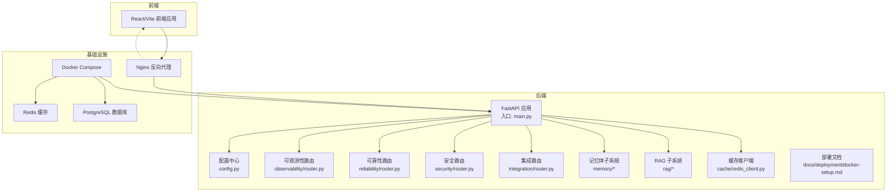
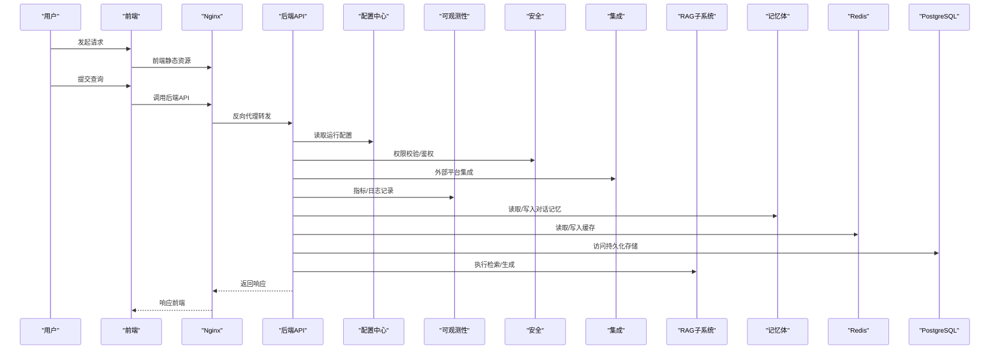
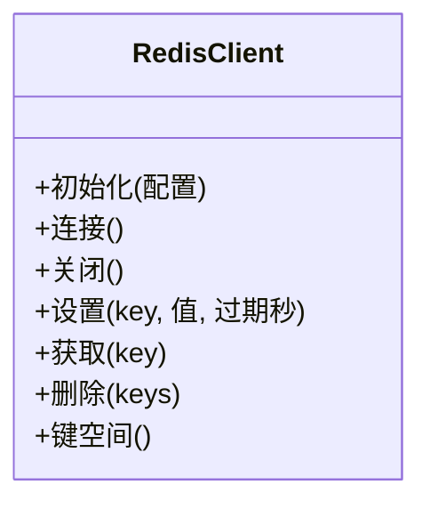
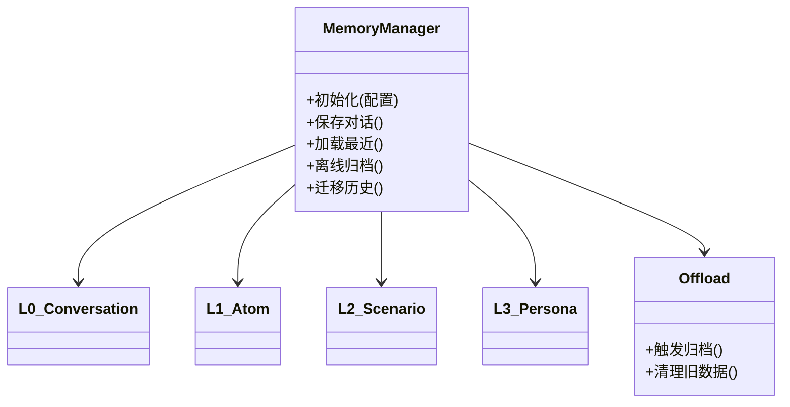
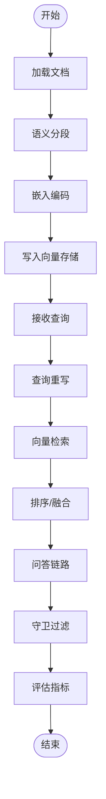
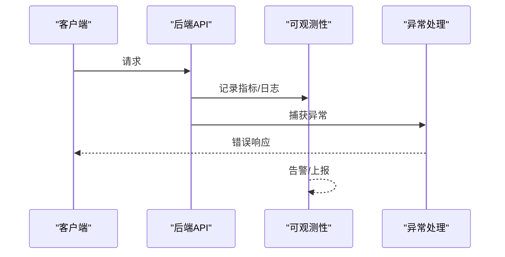
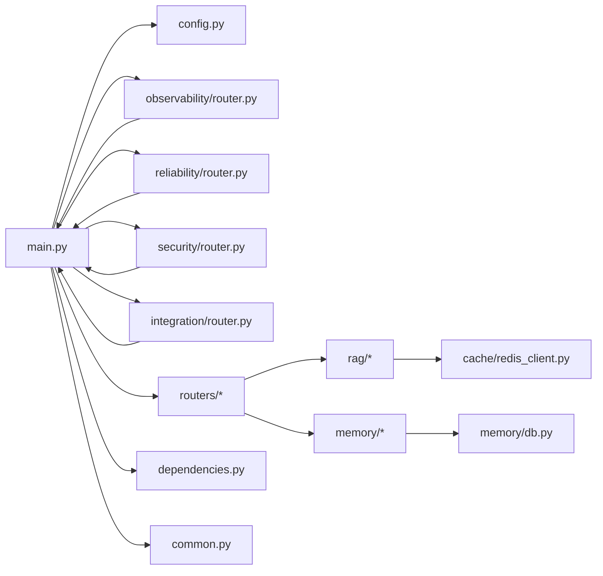

# 运维管理

<cite>
**本文引用的文件**
- [backend/app/main.py](file://backend/app/main.py)
- [backend/app/config.py](file://backend/app/config.py)
- [backend/app/cache/redis_client.py](file://backend/app/cache/redis_client.py)
- [backend/app/memory/db.py](file://backend/app/memory/db.py)
- [backend/app/rag/vector_store.py](file://backend/app/rag/vector_store.py)
- [backend/Dockerfile](file://backend/Dockerfile)
- [docker-compose.yml](file://docker-compose.yml)
- [nginx.conf](file://nginx.conf)
- [backend/requirements.txt](file://backend/requirements.txt)
- [backend/setup_venv.sh](file://backend/setup_venv.sh)
- [backend/setup_venv.bat](file://backend/setup_venv.bat)
- [docs/deployment/docker-setup.md](file://docs/deployment/docker-setup.md)
- [backend/app/observability/router.py](file://backend/app/observability/router.py)
- [backend/app/reliability/router.py](file://backend/app/reliability/router.py)
- [backend/app/security/router.py](file://backend/app/security/router.py)
- [backend/app/integration/router.py](file://backend/app/integration/router.py)
- [backend/app/exceptions.py](file://backend/app/exceptions.py)
- [backend/app/routers/chat.py](file://backend/app/routers/chat.py)
- [backend/app/routers/rag.py](file://backend/app/routers/rag.py)
- [backend/app/dependencies.py](file://backend/app/dependencies.py)
- [backend/app/common.py](file://backend/app/common.py)
- [backend/app/utils/lang_detect.py](file://backend/app/utils/lang_detect.py)
- [backend/app/crew/crew_setup.py](file://backend/app/crew/crew_setup.py)
- [backend/app/crew/main_events.py](file://backend/app/crew/main_events.py)
- [backend/app/crew/tasks.py](file://backend/app/crew/crew_setup.py)
- [backend/app/crew/agents.py](file://backend/app/crew/agents.py)
- [backend/app/crew/executor.py](file://backend/app/crew/executor.py)
- [backend/app/crew/llm.py](file://backend/app/crew/llm.py)
- [backend/app/langgraph/graph.py](file://backend/app/langgraph/graph.py)
- [backend/app/langgraph/state.py](file://backend/app/langgraph/state.py)
- [backend/app/langgraph/nodes/agent.py](file://backend/app/langgraph/nodes/agent.py)
- [backend/app/langgraph/nodes/generate.py](file://backend/app/langgraph/nodes/generate.py)
- [backend/app/langgraph/nodes/intent.py](file://backend/app/langgraph/nodes/intent.py)
- [backend/app/langgraph/nodes/rag.py](file://backend/app/langgraph/nodes/rag.py)
- [backend/app/langgraph/streaming.py](file://backend/app/langgraph/streaming.py)
- [backend/app/langgraph/mcp/client.py](file://backend/app/langgraph/mcp/client.py)
- [backend/app/langgraph/mcp/server.py](file://backend/app/langgraph/mcp/server.py)
- [backend/app/ai_platform/router.py](file://backend/app/ai_platform/router.py)
- [backend/app/cost/router.py](file://backend/app/cost/router.py)
- [backend/app/features/router.py](file://backend/app/features/router.py)
- [backend/app/knowledge/router.py](file://backend/app/knowledge/router.py)
- [backend/app/evaluation/router.py](file://backend/app/evaluation/router.py)
- [backend/app/api/analytics.py](file://backend/app/api/analytics.py)
- [backend/app/api/models.py](file://backend/app/api/models.py)
- [backend/app/api/rag_stats.py](file://backend/app/api/rag_stats.py)
- [backend/app/tools/calculator.py](file://backend/app/tools/calculator.py)
- [backend/app/tools/knowledge.py](file://backend/app/tools/knowledge.py)
- [backend/app/tools/read_ref.py](file://backend/app/tools/read_ref.py)
- [backend/app/tools/web_search.py](file://backend/app/tools/web_search.py)
- [backend/app/memory/manager.py](file://backend/app/memory/manager.py)
- [backend/app/memory/offload.py](file://backend/app/memory/offload.py)
- [backend/app/memory/l0_conversation.py](file://backend/app/memory/l0_conversation.py)
- [backend/app/memory/l1_atom.py](file://backend/app/memory/l1_atom.py)
- [backend/app/memory/l2_scenario.py](file://backend/app/memory/l2_scenario.py)
- [backend/app/memory/l3_persona.py](file://backend/app/memory/l3_persona.py)
- [backend/app/rag/loader.py](file://backend/app/rag/loader.py)
- [backend/app/rag/qa_chain.py](file://backend/app/rag/qa_chain.py)
- [backend/app/rag/query_rewriter.py](file://backend/app/rag/query_rewriter.py)
- [backend/app/rag/semantic_splitter.py](file://backend/app/rag/semantic_splitter.py)
- [backend/app/rag/test_data.py](file://backend/app/rag/test_data.py)
- [backend/app/rag/evaluator.py](file://backend/app/rag/evaluator.py)
- [backend/app/rag/guardrails.py](file://backend/app/rag/guardrails.py)
- [backend/app/rag/models.py](file://backend/app/rag/models.py)
- [backend/app/rag/test_data.py](file://backend/app/rag/test_data.py)
- [backend/app/rag/vector_store.py](file://backend/app/rag/vector_store.py)
- [backend/app/rag/evaluator.py](file://backend/app/rag/evaluator.py)
- [backend/app/rag/guardrails.py](file://backend/app/rag/guardrails.py)
- [backend/app/rag/models.py](file://backend/app/rag/models.py)
- [backend/app/rag/test_data.py](file://backend/app/rag/test_data.py)
- [backend/app/rag/vector_store.py](file://backend/app/rag/vector_store.py)
- [backend/app/rag/evaluator.py](file://backend/app/rag/evaluator.py)
- [backend/app/rag/guardrails.py](file://backend/app/rag/guardrails.py)
- [backend/app/rag/models.py](file://backend/app/rag/models.py)
- [backend/app/rag/test_data.py](file://backend/app/rag/test_data.py)
- [backend/app/rag/vector_store.py](file://backend/app/rag/vector_store.py)
- [backend/app/rag/evaluator.py](file://backend/app/rag/evaluator.py)
- [backend/app/rag/guardrails.py](file://backend/app/rag/guardrails.py)
- [backend/app/rag/models.py](file://backend/app/rag/models.py)
- [backend/app/rag/test_data.py](file://backend/app/rag/test_data.py)
- [backend/app/rag/vector_store.py](file://backend/app/rag/vector_store.py)
- [backend/app/rag/evaluator.py](file://backend/app/rag/evaluator.py)
- [backend/app/rag/guardrails.py](file://backend/app/rag/guardrails.py)
- [backend/app/rag/models.py](file://backend/app/rag/models.py)
- [backend/app/rag/test_data.py](file://backend/app/rag/test_data.py)
- [backend/app/rag/vector_store.py](file://backend/app/rag/vector_store.py)
- [backend/app/rag/evaluator.py](file://backend/app/rag/evaluator.py)
- [backend/app/rag/guardrails.py](file://backend/app/rag/guardrails.py)
- [backend/app/rag/models.py](file://backend/app/rag/models.py)
- [backend/app/rag/test_data.py](file://backend/app/rag/test_data.py)
- [backend/app/rag/vector_store.py](file://backend/app/rag/vector_store.py)
- [backend/app/rag/evaluator.py](file://backend/app/rag/evaluator.py)
- [backend/app/rag/guardrails.py](file://backend/app/rag/guardrails.py)
- [backend/app/rag/models.py](file://backend/app/rag/models.py)
- [backend/app/rag/test_data.py](file://backend/app/rag/test_data.py)
- [backend/app/rag/vector_store.py](file://......)
</cite>

## 目录
1. [简介](#简介)
2. [项目结构](#项目结构)
3. [核心组件](#核心组件)
4. [架构总览](#架构总览)
5. [详细组件分析](#详细组件分析)
6. [依赖关系分析](#依赖关系分析)
7. [性能考量](#性能考量)
8. [故障排除指南](#故障排除指南)
9. [结论](#结论)
10. [附录](#附录)

## 简介
本运维管理文档面向 Aureon 系统的生产与日常维护，覆盖系统维护流程（更新、补丁与升级）、备份与恢复、故障排除、日常运维任务、安全运维实践、灾难恢复与业务连续性保障，以及变更管理与风险控制指南。文档以代码库中的实际实现为依据，结合部署与配置文件，形成可执行的操作手册。

## 项目结构
Aureon 采用前后端分离架构：前端为 React/Vite 应用，后端为 Python FastAPI 应用，通过容器化与编排进行部署。后端模块围绕 RAG、缓存、内存、可观测性、可靠性、安全等维度组织；同时提供 Dockerfile、docker-compose.yml 与 Nginx 配置，支撑标准化部署与运行。

图表来源
- [backend/app/main.py](file://backend/app/main.py)
- [backend/app/config.py](file://backend/app/config.py)
- [backend/app/cache/redis_client.py](file://backend/app/cache/redis_client.py)
- [backend/app/memory/db.py](file://backend/app/memory/db.py)
- [backend/app/rag/vector_store.py](file://backend/app/rag/vector_store.py)
- [docker-compose.yml](file://docker-compose.yml)
- [nginx.conf](file://nginx.conf)
- [docs/deployment/docker-setup.md](file://docs/deployment/docker-setup.md)

章节来源
- [backend/app/main.py](file://backend/app/main.py)
- [backend/app/config.py](file://backend/app/config.py)
- [docker-compose.yml](file://docker-compose.yml)
- [nginx.conf](file://nginx.conf)
- [docs/deployment/docker-setup.md](file://docs/deployment/docker-setup.md)

## 核心组件
- 应用入口与路由：后端通过主程序注册各功能路由（聊天、RAG、可观测性、可靠性、安全、集成、AI 平台、成本、特性开关、知识库、评估等），统一对外提供 API。
- 配置中心：集中管理运行参数（数据库、缓存、模型、特征开关等），支持环境变量注入与默认值。
- 缓存层：基于 Redis 的客户端封装，提供连接、键空间管理与会话缓存能力。
- 记忆体子系统：多层级对话记忆（L0-L3）与离线归档，支持数据库持久化与离线迁移。
- 向量检索：向量存储抽象与加载器、分割器、重写器、问答链路、守卫与评估模块。
- 可观测性与可靠性：指标采集、健康检查、错误处理与降级策略。
- 安全与集成：鉴权、访问控制、外部平台集成与审计。
- 部署与编排：Dockerfile、docker-compose、Nginx 配置与部署文档。

章节来源
- [backend/app/main.py](file://backend/app/main.py)
- [backend/app/config.py](file://backend/app/config.py)
- [backend/app/cache/redis_client.py](file://backend/app/cache/redis_client.py)
- [backend/app/memory/db.py](file://backend/app/memory/db.py)
- [backend/app/rag/vector_store.py](file://backend/app/rag/vector_store.py)
- [backend/app/observability/router.py](file://backend/app/observability/router.py)
- [backend/app/reliability/router.py](file://backend/app/reliability/router.py)
- [backend/app/security/router.py](file://backend/app/security/router.py)
- [backend/app/integration/router.py](file://backend/app/integration/router.py)
- [docs/deployment/docker-setup.md](file://docs/deployment/docker-setup.md)

## 架构总览
下图展示从浏览器到后端服务、缓存与数据库的关键交互路径，以及可观测性与安全控制点。

图表来源
- [backend/app/main.py](file://backend/app/main.py)
- [backend/app/config.py](file://backend/app/config.py)
- [backend/app/cache/redis_client.py](file://backend/app/cache/redis_client.py)
- [backend/app/memory/db.py](file://backend/app/memory/db.py)
- [backend/app/rag/vector_store.py](file://backend/app/rag/vector_store.py)
- [backend/app/observability/router.py](file://backend/app/observability/router.py)
- [backend/app/security/router.py](file://backend/app/security/router.py)
- [backend/app/integration/router.py](file://backend/app/integration/router.py)
- [nginx.conf](file://nginx.conf)

## 详细组件分析

### 组件一：缓存与会话管理（Redis）
- 功能职责：提供统一的 Redis 客户端，封装连接、键空间管理、会话缓存与过期策略。
- 关键点：连接池配置、键命名规范、过期时间策略、异常处理与重试。
- 运维关注：监控连接数、命中率、内存占用；定期清理过期键；在高并发场景下调整连接池大小。

图表来源
- [backend/app/cache/redis_client.py](file://backend/app/cache/redis_client.py)

章节来源
- [backend/app/cache/redis_client.py](file://backend/app/cache/redis_client.py)

### 组件二：记忆体子系统（多层级对话记忆）
- 功能职责：L0-L3 多层级记忆建模，支持数据库持久化与离线归档；提供记忆管理与离线迁移能力。
- 关键点：层级关系、持久化策略、归档触发条件、迁移脚本与回滚策略。
- 运维关注：定期备份记忆表；监控归档任务；在升级时验证迁移脚本幂等性。

图表来源
- [backend/app/memory/manager.py](file://backend/app/memory/manager.py)
- [backend/app/memory/offload.py](file://backend/app/memory/offload.py)
- [backend/app/memory/l0_conversation.py](file://backend/app/memory/l0_conversation.py)
- [backend/app/memory/l1_atom.py](file://backend/app/memory/l1_atom.py)
- [backend/app/memory/l2_scenario.py](file://backend/app/memory/l2_scenario.py)
- [backend/app/memory/l3_persona.py](file://backend/app/memory/l3_persona.py)

章节来源
- [backend/app/memory/manager.py](file://backend/app/memory/manager.py)
- [backend/app/memory/offload.py](file://backend/app/memory/offload.py)
- [backend/app/memory/db.py](file://backend/app/memory/db.py)

### 组件三：RAG 子系统（向量检索与问答）
- 功能职责：文档加载、分段、嵌入、向量存储、查询重写、检索排序、问答链路、守卫与评估。
- 关键点：向量存储接口、索引重建策略、评估指标、查询优化与缓存协同。
- 运维关注：定期校验向量维度一致性；监控索引构建与查询延迟；对评估报告进行趋势分析。

图表来源
- [backend/app/rag/loader.py](file://backend/app/rag/loader.py)
- [backend/app/rag/semantic_splitter.py](file://backend/app/rag/semantic_splitter.py)
- [backend/app/rag/vector_store.py](file://backend/app/rag/vector_store.py)
- [backend/app/rag/query_rewriter.py](file://backend/app/rag/query_rewriter.py)
- [backend/app/rag/qa_chain.py](file://backend/app/rag/qa_chain.py)
- [backend/app/rag/guardrails.py](file://backend/app/rag/guardrails.py)
- [backend/app/rag/evaluator.py](file://backend/app/rag/evaluator.py)

章节来源
- [backend/app/rag/vector_store.py](file://backend/app/rag/vector_store.py)
- [backend/app/rag/loader.py](file://backend/app/rag/loader.py)
- [backend/app/rag/qa_chain.py](file://backend/app/rag/qa_chain.py)
- [backend/app/rag/evaluator.py](file://backend/app/rag/evaluator.py)

### 组件四：可观测性与可靠性
- 功能职责：指标采集、健康检查、错误处理与降级策略、日志聚合与告警。
- 关键点：统一异常处理、中间件注入、健康端点、降级开关。
- 运维关注：建立 SLI/SLO 指标；配置告警阈值；定期演练降级流程。

图表来源
- [backend/app/observability/router.py](file://backend/app/observability/router.py)
- [backend/app/reliability/router.py](file://backend/app/reliability/router.py)
- [backend/app/exceptions.py](file://backend/app/exceptions.py)

章节来源
- [backend/app/observability/router.py](file://backend/app/observability/router.py)
- [backend/app/reliability/router.py](file://backend/app/reliability/router.py)
- [backend/app/exceptions.py](file://backend/app/exceptions.py)

### 组件五：安全与集成
- 功能职责：鉴权、访问控制、外部平台集成、审计日志。
- 关键点：认证中间件、权限矩阵、外部 API 密钥管理、审计轨迹。
- 运维关注：定期轮换密钥；审查访问日志；实施最小权限原则。

章节来源
- [backend/app/security/router.py](file://backend/app/security/router.py)
- [backend/app/integration/router.py](file://backend/app/integration/router.py)

### 组件六：部署与编排
- 功能职责：容器镜像构建、服务编排、反向代理配置。
- 关键点：Dockerfile 最小化与分层优化；docker-compose 服务依赖；Nginx 路由与静态资源。
- 运维关注：镜像扫描与基线更新；编排模板版本化；灰度发布与回滚。

章节来源
- [backend/Dockerfile](file://backend/Dockerfile)
- [docker-compose.yml](file://docker-compose.yml)
- [nginx.conf](file://nginx.conf)
- [docs/deployment/docker-setup.md](file://docs/deployment/docker-setup.md)

## 依赖关系分析
后端模块之间存在清晰的分层与耦合关系：路由层负责对外暴露接口，依赖配置中心与中间件；核心业务（RAG、记忆体、缓存）通过依赖注入与工厂模式解耦；可观测性与可靠性作为横切关注点贯穿各模块。

图表来源
- [backend/app/main.py](file://backend/app/main.py)
- [backend/app/config.py](file://backend/app/config.py)
- [backend/app/cache/redis_client.py](file://backend/app/cache/redis_client.py)
- [backend/app/memory/db.py](file://backend/app/memory/db.py)
- [backend/app/rag/vector_store.py](file://backend/app/rag/vector_store.py)
- [backend/app/observability/router.py](file://backend/app/observability/router.py)
- [backend/app/reliability/router.py](file://backend/app/reliability/router.py)
- [backend/app/security/router.py](file://backend/app/security/router.py)
- [backend/app/integration/router.py](file://backend/app/integration/router.py)
- [backend/app/routers/chat.py](file://backend/app/routers/chat.py)
- [backend/app/routers/rag.py](file://backend/app/routers/rag.py)
- [backend/app/dependencies.py](file://backend/app/dependencies.py)
- [backend/app/common.py](file://backend/app/common.py)

章节来源
- [backend/app/main.py](file://backend/app/main.py)
- [backend/app/dependencies.py](file://backend/app/dependencies.py)
- [backend/app/common.py](file://backend/app/common.py)

## 性能考量
- 缓存策略：合理设置键过期时间与容量上限，监控命中率与内存使用；在热点数据上启用预热。
- 数据库优化：为记忆体与日志表建立合适索引；对高频查询字段进行优化；定期统计分析慢查询。
- 向量检索：控制嵌入维度与索引类型；对大规模数据分批入库与增量更新；查询时启用过滤与 TopK 控制。
- 反向代理：Nginx 层面启用压缩与缓存静态资源；限制请求大小与超时；开启健康检查与熔断。
- 异常与降级：在关键路径增加超时与熔断；对下游失败进行快速失败与降级返回。

## 故障排除指南
- 日志分析：统一输出结构化日志，按模块与级别分类；使用日志聚合平台进行检索与告警；定位异常堆栈与上下文。
- 性能诊断：结合指标面板观察 CPU、内存、QPS、P95/P99 延迟；识别瓶颈模块（缓存未命中、数据库慢查询、向量检索耗时）。
- 根因分析：采用“问题现象—影响范围—可能原因—验证步骤—修复方案”流程；对变更前后的指标对比分析。
- 常见问题定位：
  - 缓存不可用：检查连接状态、键空间与过期策略。
  - 记忆体异常：核对数据库连接、归档任务状态与迁移脚本。
  - 向量检索失败：确认嵌入维度、索引构建状态与查询重写逻辑。
  - API 健康检查失败：检查依赖服务（数据库、缓存、外部平台）可用性。

章节来源
- [backend/app/observability/router.py](file://backend/app/observability/router.py)
- [backend/app/reliability/router.py](file://backend/app/reliability/router.py)
- [backend/app/exceptions.py](file://backend/app/exceptions.py)

## 结论
Aureon 的运维体系以模块化设计为基础，通过配置中心、缓存、记忆体、RAG 与可观测性等关键组件协同，配合容器化与编排实现稳定交付。建议持续完善自动化巡检、备份恢复演练与变更评审流程，确保系统在演进中保持高可用与可维护性。

## 附录

### 日常运维任务清单
- 缓存清理：定期清理过期键与冷数据；监控容量与命中率。
- 索引重建：在数据结构变更或维度不一致时执行重建；灰度验证后再全量上线。
- 数据迁移：对记忆体与日志表进行迁移前备份；验证迁移脚本幂等性与回滚路径。
- 配置归档：对配置变更进行版本化管理与审批；回滚时快速恢复。

### 备份与恢复策略
- 数据库备份：对记忆体与日志表进行周期性全量与增量备份；验证恢复流程。
- 向量存储快照：在索引重建前后进行快照；保留多个版本用于回退。
- 配置文件归档：对 config.py 与部署配置进行版本化归档；变更审批与回滚。

### 安全运维实践
- 漏洞扫描：定期扫描容器镜像与依赖库；修复高危漏洞并验证补丁有效性。
- 权限审计：审查最小权限原则；定期轮换密钥与访问令牌。
- 合规检查：遵循数据保护与隐私政策；记录审计轨迹并定期复核。

### 灾难恢复与业务连续性
- 灾备演练：制定 RTO/RPO 目标；定期进行跨环境演练。
- 紧急响应：建立值班与升级通道；明确故障分级与处置时限。
- 变更管理：变更前评估风险与回退预案；灰度发布与监控验证。

### 操作手册与最佳实践
- 更新与升级：先在测试环境验证；使用容器镜像版本标签；回滚策略与数据兼容性检查。
- 补丁管理：建立补丁清单与验证清单；对关键依赖进行安全基线扫描。
- 风险控制：变更评审与双人复核；自动化巡检与阈值告警；定期演练与复盘。