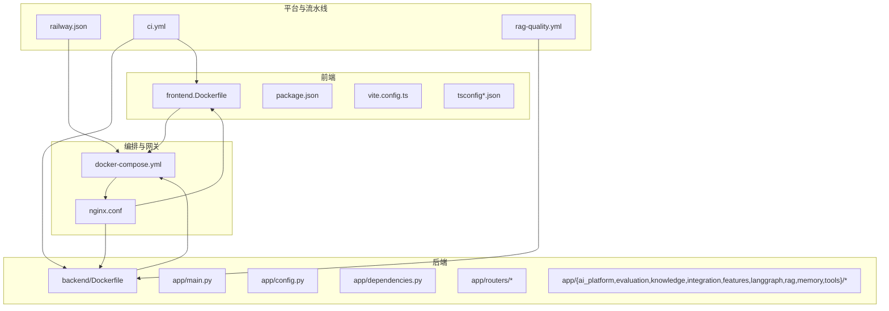
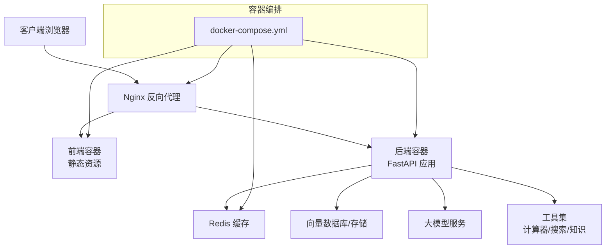
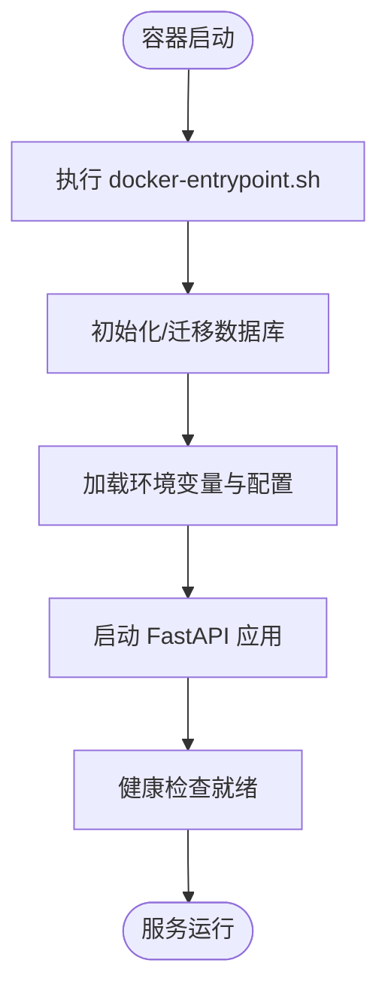
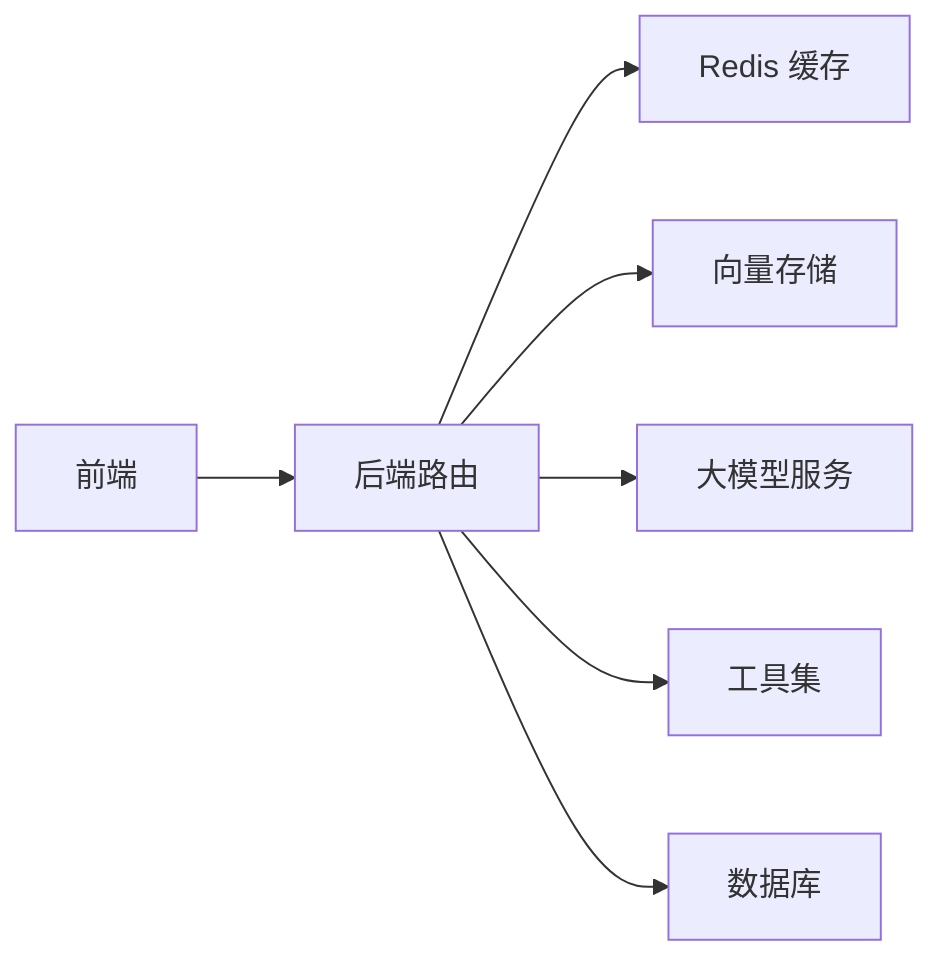

# 部署与运维

<cite>
**本文引用的文件**
- [Dockerfile（根）](file://Dockerfile)
- [Dockerfile（后端）](file://backend/Dockerfile)
- [Dockerfile（crew）](file://crew/Dockerfile)
- [docker-compose.yml](file://docker-compose.yml)
- [nginx.conf](file://nginx.conf)
- [railway.json](file://railway.json)
- [docker-entrypoint.sh](file://docker-entrypoint.sh)
- [.dockerignore（根）](file://.dockerignore)
- [.dockerignore（后端）](file://backend/.dockerignore)
- [requirements.txt（后端）](file://backend/requirements.txt)
- [setup_venv.sh（后端）](file://backend/setup_venv.sh)
- [setup_venv.bat（后端）](file://backend/setup_venv.bat)
- [main.py（后端入口）](file://backend/app/main.py)
- [config.py（后端配置）](file://backend/app/config.py)
- [dependencies.py（后端依赖）](file://backend/app/dependencies.py)
- [cache/redis_client.py（后端缓存）](file://backend/app/cache/redis_client.py)
- [observability/router.py（后端可观测性）](file://backend/app/observability/router.py)
- [evaluation/router.py（后端评估）](file://backend/app/evaluation/router.py)
- [security/router.py（后端安全）](file://backend/app/security/router.py)
- [reliability/router.py（后端可靠性）](file://backend/app/reliability/router.py)
- [ai_platform/router.py（后端AI平台）](file://backend/app/ai_platform/router.py)
- [integration/router.py（后端集成）](file://backend/app/integration/router.py)
- [knowledge/router.py（后端知识库）](file://backend/app/knowledge/router.py)
- [features/router.py（后端功能开关）](file://backend/app/features/router.py)
- [langgraph/graph.py（后端LangGraph）](file://backend/app/langgraph/graph.py)
- [langgraph/state.py（后端LangGraph状态）](file://backend/app/langgraph/state.py)
- [langgraph/streaming.py（后端LangGraph流式输出）](file://backend/app/langgraph/streaming.py)
- [rag/vector_store.py（后端RAG向量存储）](file://backend/app/rag/vector_store.py)
- [rag/loader.py（后端RAG加载器）](file://backend/app/rag/loader.py)
- [rag/models.py（后端RAG模型）](file://backend/app/rag/models.py)
- [rag/qa_chain.py（后端RAG问答链）](file://backend/app/rag/qa_chain.py)
- [memory/db.py（后端记忆数据库）](file://backend/app/memory/db.py)
- [memory/manager.py（后端记忆管理）](file://backend/app/memory/manager.py)
- [tools/calculator.py（后端工具）](file://backend/app/tools/calculator.py)
- [tools/web_search.py（后端工具）](file://backend/app/tools/web_search.py)
- [tools/read_ref.py（后端工具）](file://backend/app/tools/read_ref.py)
- [tools/knowledge.py（后端工具）](file://backend/app/tools/knowledge.py)
- [routers/chat.py（后端聊天路由）](file://backend/app/routers/chat.py)
- [routers/rag.py（后端RAG路由）](file://backend/app/routers/rag.py)
- [frontend.Dockerfile](file://frontend.Dockerfile)
- [package.json](file://package.json)
- [vite.config.ts](file://vite.config.ts)
- [tsconfig.json](file://tsconfig.json)
- [tsconfig.app.json](file://tsconfig.app.json)
- [tsconfig.node.json](file://tsconfig.node.json)
- [.github/workflows/ci.yml](file://.github/workflows/ci.yml)
- [.github/workflows/rag-quality.yml](file://.github/workflows/rag-quality.yml)
- [docs/deployment/docker-setup.md](file://docs/deployment/docker-setup.md)
- [docs/architecture/system-overview.md](file://docs/architecture/system-overview.md)
- [docs/rag-evaluation/reports/rag-eval-report-2026-06-05-1759.md](file://docs/rag-evaluation/reports/rag-eval-report-2026-06-05-1759.md)
</cite>

## 目录
1. [简介](#简介)
2. [项目结构](#项目结构)
3. [核心组件](#核心组件)
4. [架构总览](#架构总览)
5. [详细组件分析](#详细组件分析)
6. [依赖分析](#依赖分析)
7. [性能考量](#性能考量)
8. [故障排除指南](#故障排除指南)
9. [结论](#结论)
10. [附录](#附录)

## 简介
本文件面向运维与开发团队，提供 Aureon 系统的部署与运维全栈指南。内容覆盖容器化部署（Docker）、编排（docker-compose）、反向代理（Nginx）、环境变量与依赖管理、可观测性与监控、日志与性能调优、备份与高可用、CI/CD 流水线以及扩展与成本优化策略。文档以仓库中现有文件为依据，结合系统架构与模块职责，给出可操作的实践建议。

## 项目结构
Aureon 采用前后端分离与多服务容器化架构：前端通过独立 Dockerfile 构建，后端与 crew 子系统分别构建镜像；通过 docker-compose 统一编排；Nginx 提供反向代理与静态资源服务；Railway JSON 描述平台部署参数；GitHub Actions 提供 CI 能力。

图表来源
- [docker-compose.yml](file://docker-compose.yml)
- [frontend.Dockerfile](file://frontend.Dockerfile)
- [backend/Dockerfile](file://backend/Dockerfile)
- [nginx.conf](file://nginx.conf)
- [railway.json](file://railway.json)
- [.github/workflows/ci.yml](file://.github/workflows/ci.yml)
- [.github/workflows/rag-quality.yml](file://.github/workflows/rag-quality.yml)

章节来源
- [docker-compose.yml](file://docker-compose.yml)
- [frontend.Dockerfile](file://frontend.Dockerfile)
- [backend/Dockerfile](file://backend/Dockerfile)
- [nginx.conf](file://nginx.conf)
- [railway.json](file://railway.json)
- [.github/workflows/ci.yml](file://.github/workflows/ci.yml)
- [.github/workflows/rag-quality.yml](file://.github/workflows/rag-quality.yml)

## 核心组件
- 前端应用：基于 Vite + TypeScript，使用独立 Dockerfile 构建，暴露静态资源并由 Nginx 提供服务。
- 后端服务：FastAPI 应用，模块化组织（路由、RAG、LangGraph、记忆、工具等），通过 docker-entrypoint.sh 初始化与启动。
- 编排与网关：docker-compose 统一编排前端、后端与 Redis；Nginx 作为反向代理与静态资源服务器。
- 平台部署：railway.json 描述平台部署参数，便于在 Railway 等平台一键部署。
- CI/CD：GitHub Actions 提供代码质量与测试流水线，支持 RAG 专项评估。

章节来源
- [frontend.Dockerfile](file://frontend.Dockerfile)
- [backend/Dockerfile](file://backend/Dockerfile)
- [docker-compose.yml](file://docker-compose.yml)
- [nginx.conf](file://nginx.conf)
- [railway.json](file://railway.json)
- [.github/workflows/ci.yml](file://.github/workflows/ci.yml)
- [.github/workflows/rag-quality.yml](file://.github/workflows/rag-quality.yml)

## 架构总览
下图展示从客户端到后端服务、缓存与外部依赖的整体交互路径，体现容器化与反向代理的关键节点。

图表来源
- [docker-compose.yml](file://docker-compose.yml)
- [nginx.conf](file://nginx.conf)
- [backend/app/cache/redis_client.py](file://backend/app/cache/redis_client.py)
- [backend/app/rag/vector_store.py](file://backend/app/rag/vector_store.py)
- [backend/app/tools/calculator.py](file://backend/app/tools/calculator.py)
- [backend/app/tools/web_search.py](file://backend/app/tools/web_search.py)

## 详细组件分析

### Docker 容器化与镜像构建
- 多镜像策略：前端与后端分别构建，crew 子系统独立镜像，便于按需扩展与更新。
- 构建上下文与忽略规则：根目录与后端目录均提供 .dockerignore，避免无关文件进入镜像，减少体积与构建时间。
- 入口脚本：docker-entrypoint.sh 在容器启动时执行初始化逻辑（如数据库迁移、权限准备等），确保服务就绪。
- 环境隔离：后端提供虚拟环境脚本（setup_venv.sh/bat），便于本地开发与容器内运行一致性。

图表来源
- [docker-entrypoint.sh](file://docker-entrypoint.sh)
- [backend/Dockerfile](file://backend/Dockerfile)
- [backend/setup_venv.sh](file://backend/setup_venv.sh)
- [backend/setup_venv.bat](file://backend/setup_venv.bat)

章节来源
- [Dockerfile（根）](file://Dockerfile)
- [Dockerfile（后端）](file://backend/Dockerfile)
- [Dockerfile（crew）](file://crew/Dockerfile)
- [.dockerignore（根）](file://.dockerignore)
- [.dockerignore（后端）](file://backend/.dockerignore)
- [docker-entrypoint.sh](file://docker-entrypoint.sh)
- [backend/setup_venv.sh](file://backend/setup_venv.sh)
- [backend/setup_venv.bat](file://backend/setup_venv.bat)

### docker-compose 编排与服务编排
- 服务定义：包含前端、后端、Redis、可能的数据库与工具服务，统一网络与卷管理。
- 端口映射：Nginx 暴露 80/443，后端暴露 API 端口，前端静态资源由 Nginx 提供。
- 依赖关系：后端服务依赖 Redis 与向量存储；Nginx 作为统一入口。
- 环境变量：通过 env 文件或直接注入，确保各服务配置一致。

章节来源
- [docker-compose.yml](file://docker-compose.yml)

### Nginx 反向代理与 SSL
- 反代配置：将静态资源请求转发至前端容器，API 请求转发至后端容器。
- SSL 证书：建议在 Nginx 层启用 TLS，并通过 Let’s Encrypt 自动续期；证书与密钥路径需与实际部署环境匹配。
- 负载均衡：在 Nginx 层对后端实例进行轮询或基于会话亲和的负载均衡，提升可用性与吞吐。
- 缓存与压缩：开启静态资源缓存与 Gzip/Brotli 压缩，降低带宽与延迟。

章节来源
- [nginx.conf](file://nginx.conf)

### 环境变量与依赖管理
- 环境变量：后端通过 config.py 读取关键配置（数据库、缓存、LLM 接入、安全参数等）。建议区分 dev/stage/prod，使用不同 env 文件。
- 依赖管理：后端 requirements.txt 管理 Python 依赖；前端 package.json 管理 Node 依赖。容器内使用虚拟环境隔离 Python 运行时。
- 依赖注入：dependencies.py 提供共享依赖（如数据库连接、缓存客户端），确保模块解耦与可测试性。

章节来源
- [backend/app/config.py](file://backend/app/config.py)
- [backend/app/dependencies.py](file://backend/app/dependencies.py)
- [backend/requirements.txt](file://backend/requirements.txt)
- [package.json](file://package.json)

### 后端模块与可观测性
- 模块化路由：后端按功能拆分路由（AI 平台、评估、知识库、集成、功能开关等），便于独立演进与治理。
- 可观测性：observability/router.py 提供指标与日志接口；结合外部监控系统（如 Prometheus/Grafana）实现可视化。
- 安全与可靠性：security/router.py 与 reliability/router.py 分别处理鉴权与降级策略，保障生产稳定。

章节来源
- [backend/app/observability/router.py](file://backend/app/observability/router.py)
- [backend/app/security/router.py](file://backend/app/security/router.py)
- [backend/app/reliability/router.py](file://backend/app/reliability/router.py)
- [backend/app/ai_platform/router.py](file://backend/app/ai_platform/router.py)
- [backend/app/evaluation/router.py](file://backend/app/evaluation/router.py)
- [backend/app/knowledge/router.py](file://backend/app/knowledge/router.py)
- [backend/app/integration/router.py](file://backend/app/integration/router.py)
- [backend/app/features/router.py](file://backend/app/features/router.py)

### LangGraph 工作流与流式输出
- 图结构：graph.py 定义工作流节点与边；state.py 管理状态；streaming.py 支持流式响应，提升用户体验。
- 扩展点：nodes 下的 agent/generate/intent/rag 节点可按业务场景替换或扩展。

章节来源
- [backend/app/langgraph/graph.py](file://backend/app/langgraph/graph.py)
- [backend/app/langgraph/state.py](file://backend/app/langgraph/state.py)
- [backend/app/langgraph/streaming.py](file://backend/app/langgraph/streaming.py)

### RAG 与记忆系统
- 向量存储：vector_store.py 封装向量库接入；loader.py 负责数据加载；models.py 定义检索与嵌入模型；qa_chain.py 实现问答链路。
- 记忆系统：memory/db.py 与 manager.py 提供多层级记忆持久化与管理，支持对话历史与上下文增强。
- 工具集：tools/calculator.py、web_search.py、read_ref.py、knowledge.py 提供外部能力扩展。

章节来源
- [backend/app/rag/vector_store.py](file://backend/app/rag/vector_store.py)
- [backend/app/rag/loader.py](file://backend/app/rag/loader.py)
- [backend/app/rag/models.py](file://backend/app/rag/models.py)
- [backend/app/rag/qa_chain.py](file://backend/app/rag/qa_chain.py)
- [backend/app/memory/db.py](file://backend/app/memory/db.py)
- [backend/app/memory/manager.py](file://backend/app/memory/manager.py)
- [backend/app/tools/calculator.py](file://backend/app/tools/calculator.py)
- [backend/app/tools/web_search.py](file://backend/app/tools/web_search.py)
- [backend/app/tools/read_ref.py](file://backend/app/tools/read_ref.py)
- [backend/app/tools/knowledge.py](file://backend/app/tools/knowledge.py)

### 前端构建与配置
- 构建工具：Vite 配置于 vite.config.ts；TypeScript 类型配置于 tsconfig*.json。
- 包管理：package.json 管理依赖与脚本；frontend.Dockerfile 将构建产物交由 Nginx 提供。

章节来源
- [frontend.Dockerfile](file://frontend.Dockerfile)
- [vite.config.ts](file://vite.config.ts)
- [tsconfig.json](file://tsconfig.json)
- [tsconfig.app.json](file://tsconfig.app.json)
- [tsconfig.node.json](file://tsconfig.node.json)
- [package.json](file://package.json)

### CI/CD 流水线
- 通用 CI：.github/workflows/ci.yml 覆盖代码质量与测试流程。
- RAG 专项：.github/workflows/rag-quality.yml 针对 RAG 质量评估提供专门流水线。
- 发布策略：建议结合标签与分支策略，自动构建镜像并推送至镜像仓库，再由编排文件拉起新版本。

章节来源
- [.github/workflows/ci.yml](file://.github/workflows/ci.yml)
- [.github/workflows/rag-quality.yml](file://.github/workflows/rag-quality.yml)

## 依赖分析
- 组件耦合：后端通过 dependencies.py 注入共享依赖，降低模块间耦合；路由层仅依赖抽象接口，便于替换实现。
- 外部依赖：Redis 用于缓存与会话；向量存储用于 RAG；LLM 服务用于生成；工具集扩展外部能力。
- 数据流：前端通过 API 路由与后端交互；后端通过缓存与向量存储加速查询；LangGraph 节点串联形成工作流。

图表来源
- [backend/app/dependencies.py](file://backend/app/dependencies.py)
- [backend/app/cache/redis_client.py](file://backend/app/cache/redis_client.py)
- [backend/app/rag/vector_store.py](file://backend/app/rag/vector_store.py)
- [backend/app/tools/calculator.py](file://backend/app/tools/calculator.py)
- [backend/app/tools/web_search.py](file://backend/app/tools/web_search.py)

章节来源
- [backend/app/dependencies.py](file://backend/app/dependencies.py)
- [backend/app/cache/redis_client.py](file://backend/app/cache/redis_client.py)
- [backend/app/rag/vector_store.py](file://backend/app/rag/vector_store.py)
- [backend/app/tools/calculator.py](file://backend/app/tools/calculator.py)
- [backend/app/tools/web_search.py](file://backend/app/tools/web_search.py)

## 性能考量
- 缓存策略：利用 Redis 缓存热点查询与中间结果；合理设置过期时间与淘汰策略。
- 向量化与检索：优化嵌入模型与索引参数，控制向量维度与相似度阈值；批量写入与增量更新平衡。
- 流式输出：LangGraph streaming 提升响应速度；前端按需渲染，避免阻塞主线程。
- 反向代理优化：Nginx 开启静态资源缓存与压缩；合理设置超时与并发限制。
- 监控与告警：结合可观测性路由导出指标，设置 CPU/内存/延迟/错误率阈值告警。

## 故障排除指南
- 健康检查失败：检查 docker-entrypoint.sh 是否成功完成初始化；查看后端日志定位异常。
- 缓存不可用：确认 Redis 连接参数与网络连通性；验证密码与访问白名单。
- 向量检索异常：核对向量存储地址与认证信息；检查模型服务可用性与限流。
- 反代 502/504：检查后端容器日志与资源占用；确认 Nginx upstream 配置与超时设置。
- CI 失败：查看流水线日志定位测试或构建失败步骤；优先修复基础镜像与依赖版本。

章节来源
- [docker-entrypoint.sh](file://docker-entrypoint.sh)
- [backend/app/cache/redis_client.py](file://backend/app/cache/redis_client.py)
- [backend/app/rag/vector_store.py](file://backend/app/rag/vector_store.py)
- [nginx.conf](file://nginx.conf)
- [.github/workflows/ci.yml](file://.github/workflows/ci.yml)

## 结论
Aureon 的部署与运维以容器化为核心，结合 docker-compose 编排与 Nginx 反代，形成清晰的前后端分离架构。通过模块化的后端设计、完善的可观测性与 CI/CD 流水线，能够支撑生产环境的稳定性与可扩展性。建议在生产中强化 SSL/TLS、缓存与负载均衡策略，并建立完善的监控告警与备份恢复机制。

## 附录

### 生产部署清单
- 环境变量：数据库、缓存、LLM、安全密钥、日志级别等。
- 证书与域名：Nginx SSL 证书与域名解析。
- 资源规划：CPU/内存/存储配额与水平扩展阈值。
- 备份策略：数据库与向量存储快照、配置与日志归档。
- 灾难恢复：多副本与异地容灾演练、回滚策略。

### 高可用与扩展性
- 多实例：后端与前端均支持横向扩展，结合 Nginx 负载均衡。
- 缓存与存储：Redis 与向量存储建议主从或托管方案，具备故障切换能力。
- CDN 与静态资源：前端静态资源走 CDN，降低边缘延迟。

### 成本优化
- 镜像瘦身：使用多阶段构建与 .dockerignore，减少镜像体积。
- 资源调度：根据流量峰谷调整副本数与实例规格。
- 监控与审计：通过日志与指标驱动容量规划，避免过度预留。