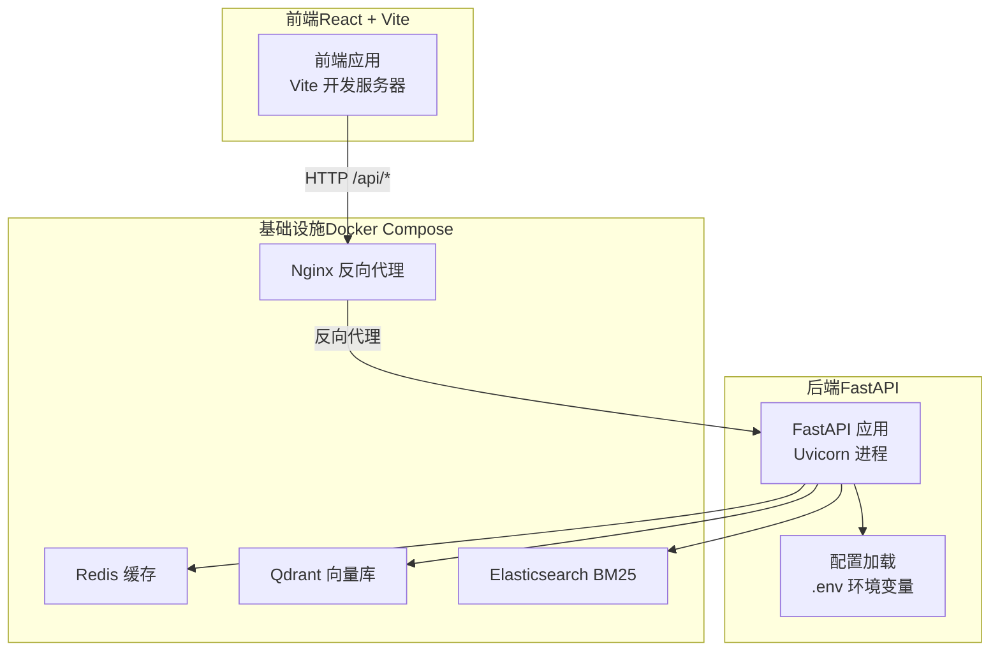
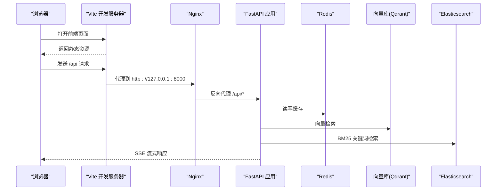
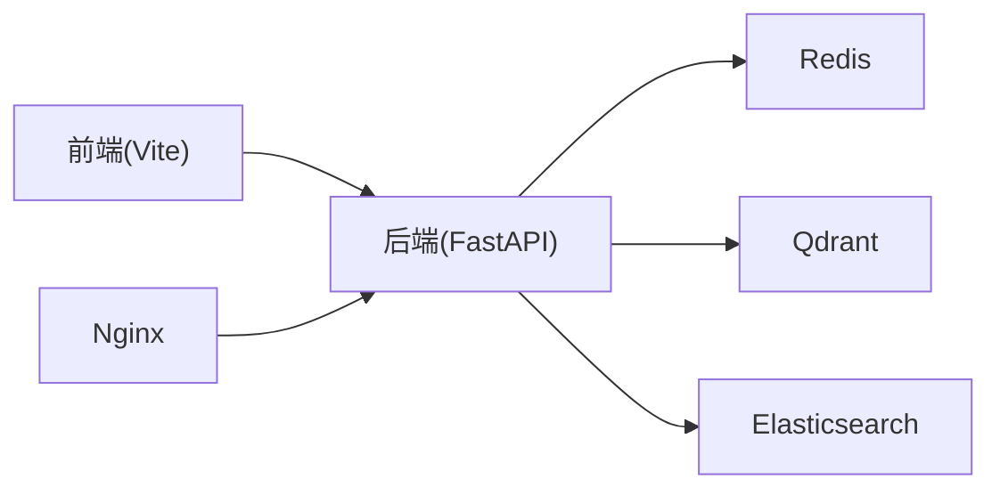

# 快速开始

<cite>
**本文引用的文件**
- [README.md](file://README.md)
- [package.json](file://package.json)
- [vite.config.ts](file://vite.config.ts)
- [backend/requirements.txt](file://backend/requirements.txt)
- [backend/Dockerfile](file://backend/Dockerfile)
- [backend/app/main.py](file://backend/app/main.py)
- [backend/app/config.py](file://backend/app/config.py)
- [docker-compose.yml](file://docker-compose.yml)
- [frontend.Dockerfile](file://frontend.Dockerfile)
- [nginx.conf](file://nginx.conf)
- [docs/deployment/docker-setup.md](file://docs/deployment/docker-setup.md)
- [USER_GUIDE.md](file://USER_GUIDE.md)
</cite>

## 目录
1. [简介](#简介)
2. [项目结构](#项目结构)
3. [核心组件](#核心组件)
4. [架构总览](#架构总览)
5. [详细组件分析](#详细组件分析)
6. [依赖关系分析](#依赖关系分析)
7. [性能注意事项](#性能注意事项)
8. [故障排除指南](#故障排除指南)
9. [结论](#结论)
10. [附录](#附录)

## 简介
本指南面向首次接触 Aureon 企业级 AI 知识库平台的新用户，帮助你在 Windows、macOS、Linux 上快速完成环境准备、本地开发与容器化部署，并提供常见问题的排查步骤。Aureon 采用前后端分离架构：前端基于 React + Vite，后端基于 FastAPI，结合 LangGraph、RAG、缓存与可观测性等能力，提供企业级检索增强生成（RAG）与智能问答体验。

## 项目结构
- 前端位于仓库根目录，使用 Vite + React + TypeScript 构建，开发服务器默认监听本地端口。
- 后端位于 backend 目录，使用 FastAPI 提供 API，开发模式下通过 Uvicorn 启动。
- 容器化使用 docker-compose 编排，包含应用、Redis、Qdrant、Elasticsearch 等服务。
- 文档与部署指南位于 docs/deployment/docker-setup.md；用户使用手册位于 USER_GUIDE.md。

图表来源
- [vite.config.ts:16-21](file://vite.config.ts#L16-L21)
- [nginx.conf:17-30](file://nginx.conf#L17-L30)
- [backend/app/main.py:364-371](file://backend/app/main.py#L364-L371)
- [docker-compose.yml:1-64](file://docker-compose.yml#L1-L64)

章节来源
- [README.md:51-63](file://README.md#L51-L63)
- [package.json:6-13](file://package.json#L6-L13)
- [vite.config.ts:16-21](file://vite.config.ts#L16-L21)
- [docker-compose.yml:1-64](file://docker-compose.yml#L1-L64)

## 核心组件
- 前端开发环境：通过 npm scripts 启动 Vite 开发服务器，默认代理 /api 到后端。
- 后端开发环境：通过 pip 安装依赖，使用 Uvicorn 启动 FastAPI 应用。
- 容器化部署：使用 docker-compose 编排，包含 Redis、Qdrant、Elasticsearch、后端应用与 Nginx。
- 配置系统：后端通过 pydantic-settings 从 .env 文件加载多厂商 LLM、嵌入模型、缓存与检索后端等配置。

章节来源
- [README.md:51-63](file://README.md#L51-L63)
- [package.json:6-13](file://package.json#L6-L13)
- [backend/requirements.txt:1-57](file://backend/requirements.txt#L1-L57)
- [backend/app/config.py:4-65](file://backend/app/config.py#L4-L65)
- [docker-compose.yml:1-64](file://docker-compose.yml#L1-L64)

## 架构总览
Aureon 的请求在前端以浏览器发起，经 Nginx 反向代理转发至后端 FastAPI；后端根据路由选择 RAG、聊天、分析、可观测性等功能模块，内部集成 LangGraph 工作流、缓存与向量/关键词检索，并通过 SSE 向前端推送流式响应。

图表来源
- [vite.config.ts:16-21](file://vite.config.ts#L16-L21)
- [nginx.conf:17-30](file://nginx.conf#L17-L30)
- [backend/app/main.py:350-371](file://backend/app/main.py#L350-L371)

## 详细组件分析

### 前端开发环境（Vite + React）
- 启动命令：在项目根目录执行 npm install && npm run dev。
- 开发服务器：默认监听本地地址，可通过配置调整 host 与端口。
- API 代理：开发环境下将 /api 前缀代理到后端 8000 端口，便于联调。
- 构建与预览：提供 build 与 preview 脚本，用于生产构建与本地预览。

章节来源
- [package.json:6-13](file://package.json#L6-L13)
- [vite.config.ts:16-21](file://vite.config.ts#L16-L21)

### 后端开发环境（FastAPI + Uvicorn）
- 依赖安装：在 backend 目录执行 pip install -r requirements.txt。
- 启动方式：使用 uvicorn app.main:app --reload --port 8000。
- 配置加载：从 .env 文件读取 LLM、嵌入模型、缓存与检索后端等参数。
- 路由组织：后端按功能模块挂载多个子路由，包含聊天、RAG、分析、可观测性、安全、成本治理、可靠性、知识管理、AI 平台与集成等。

章节来源
- [backend/requirements.txt:1-57](file://backend/requirements.txt#L1-L57)
- [backend/app/main.py:350-371](file://backend/app/main.py#L350-L371)
- [backend/app/config.py:4-65](file://backend/app/config.py#L4-L65)

### 容器化部署（Docker Compose）
- 服务编排：包含 redis、app、qdrant、elasticsearch 四个服务，以及持久化卷。
- 环境变量：通过 env_file 与 environment 字段注入，如 REDIS_URL、VECTOR_BACKEND、BM25_BACKEND、QDRANT_URL、ES_URL。
- 端口映射：前端 Nginx 默认 80 端口对外暴露，后端 API 通过 Nginx 代理。
- 后端镜像：使用 backend/Dockerfile 构建，预装依赖并预热嵌入模型，暴露 8000 端口。
- 前端镜像：使用 frontend.Dockerfile 构建，基于 node:22 构建产物，使用 nginx:stable 提供静态服务。

章节来源
- [docker-compose.yml:1-64](file://docker-compose.yml#L1-L64)
- [backend/Dockerfile:1-29](file://backend/Dockerfile#L1-L29)
- [frontend.Dockerfile:1-28](file://frontend.Dockerfile#L1-L28)
- [nginx.conf:17-30](file://nginx.conf#L17-L30)

### 配置系统（.env 与 Settings）
- LLM 与嵌入：支持多厂商与多模型组合，包含主备 LLM、嵌入模型与维度控制。
- 检索后端：可选 chroma 或 qdrant 作为向量库，可选 memory 或 elasticsearch 作为 BM25 后端。
- 缓存与日志：Redis URL、Prometheus 指标端点、结构化日志等。
- 其他：博客同步开关、会话上限、LangChain 集成参数等。

章节来源
- [backend/app/config.py:4-65](file://backend/app/config.py#L4-L65)

## 依赖关系分析
- 前端对后端的依赖：通过 /api 前缀的 HTTP 请求与 SSE 事件流进行交互。
- 后端对基础设施的依赖：Redis 用于缓存，Qdrant/Elasticsearch 用于向量与 BM25 检索。
- 容器编排：docker-compose 统一管理各服务生命周期与网络。

图表来源
- [vite.config.ts:16-21](file://vite.config.ts#L16-L21)
- [nginx.conf:17-30](file://nginx.conf#L17-L30)
- [docker-compose.yml:1-64](file://docker-compose.yml#L1-L64)

章节来源
- [vite.config.ts:16-21](file://vite.config.ts#L16-L21)
- [nginx.conf:17-30](file://nginx.conf#L17-L30)
- [docker-compose.yml:1-64](file://docker-compose.yml#L1-L64)

## 性能注意事项
- 嵌入模型预热：后端镜像中已预下载嵌入模型，减少首次检索冷启动时间。
- 索引预热：启动时后台线程构建 BM25 索引并检查向量索引状态，必要时通过 API 方式重建，避免本地模型导致内存压力。
- SSE 流式响应：Nginx 禁用代理缓冲，保证前端实时接收事件流。
- 构建优化：Vite 构建按依赖拆分 vendor 分块，提升缓存命中率与加载速度。

章节来源
- [backend/Dockerfile:16-18](file://backend/Dockerfile#L16-L18)
- [backend/app/main.py:127-164](file://backend/app/main.py#L127-L164)
- [nginx.conf:28-29](file://nginx.conf#L28-L29)
- [vite.config.ts:24-42](file://vite.config.ts#L24-L42)

## 故障排除指南
- 前端页面空白
  - 确认前端开发服务器正常运行且未报错。
  - 尝试刷新页面，确认 /api 代理是否正确指向后端。
- 发送消息无响应
  - 确认后端进程在运行，检查 .env 中 LLM_API_KEY 是否有效。
  - 若网络受限，尝试切换模型或更换 LLM 提供商。
- 后端报模块缺失
  - 在 backend 目录重新执行 pip install -r requirements.txt。
- 端口被占用
  - 后端默认 8000，前端默认 5173；若冲突，可在启动命令中指定新端口。
- Docker 启动异常
  - 确认 Docker 与 Docker Compose 版本满足要求，先复制并编辑 backend/.env 示例文件，再执行 docker-compose up -d。
  - 查看各服务健康检查与日志，确认 Redis、Qdrant、Elasticsearch 可用。

章节来源
- [USER_GUIDE.md:164-193](file://USER_GUIDE.md#L164-L193)
- [docs/deployment/docker-setup.md:3-26](file://docs/deployment/docker-setup.md#L3-L26)

## 结论
通过本指南，你可以在本地快速完成 Aureon 的环境准备与启动，理解前后端与基础设施的交互关系，并掌握容器化部署的基本流程。遇到问题时，可依据故障排除章节逐步定位与解决。

## 附录

### 快速开始步骤（三类方式）
- 本地双端开发
  - 前端：在项目根目录执行 npm install && npm run dev。
  - 后端：在 backend 目录执行 pip install -r requirements.txt && uvicorn app.main:app --reload --port 8000。
- Docker Compose 容器化
  - 在项目根目录执行 docker-compose up -d，访问 http://localhost 查看前端，后端 API 通过 Nginx 代理到 8000 端口。
- 生产部署参考
  - 参考 docs/deployment/docker-setup.md 的环境变量与生产清单，结合 nginx.conf 的代理与缓存策略。

章节来源
- [README.md:51-63](file://README.md#L51-L63)
- [docs/deployment/docker-setup.md:9-26](file://docs/deployment/docker-setup.md#L9-L26)

### 环境变量与端口对照
- 后端 API：默认 8000（可变更），通过 Nginx 暴露为 80。
- 前端开发：默认 5173（Vite），通过 npm run dev 启动。
- 缓存：Redis 默认 6379。
- 检索：Qdrant 默认 6333，Elasticsearch 默认 9200。
- Nginx：默认 80，代理 /api 到后端 8000。

章节来源
- [docker-compose.yml:17-59](file://docker-compose.yml#L17-L59)
- [vite.config.ts:16-21](file://vite.config.ts#L16-L21)
- [nginx.conf:17-30](file://nginx.conf#L17-L30)