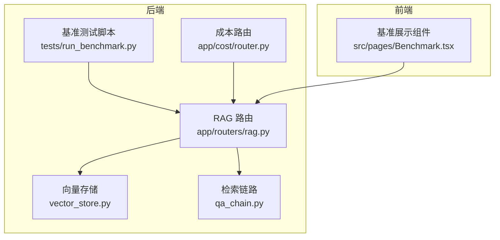
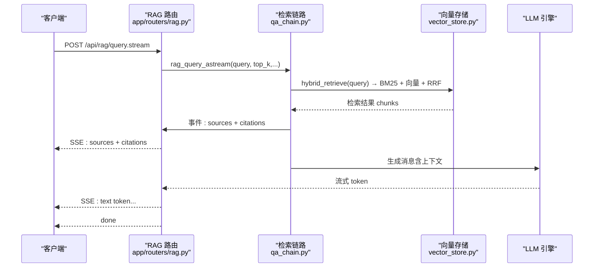
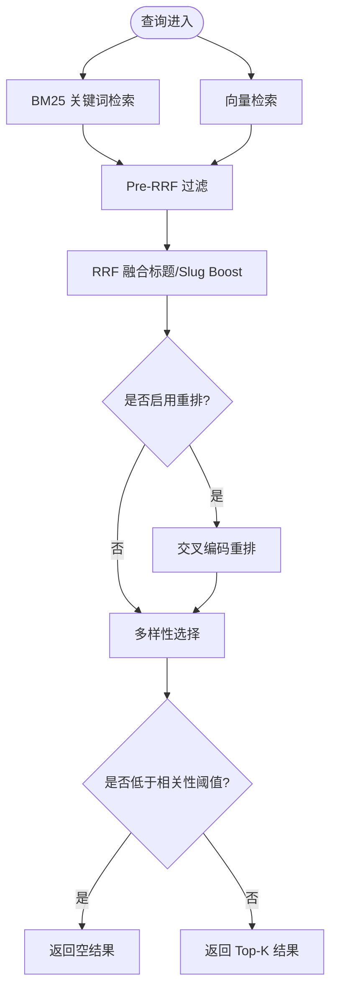
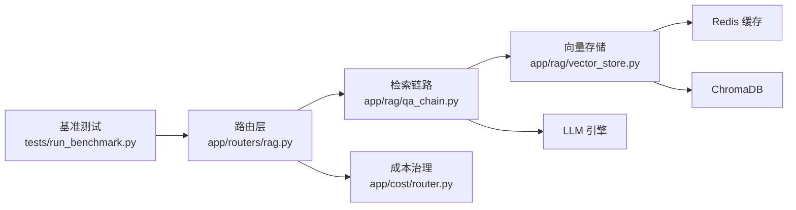

# 性能指标

<cite>
**本文引用的文件**
- [benchmark_results.json](file://backend/data/benchmark_results.json)
- [benchmark_actual.json](file://backend/data/benchmark_actual.json)
- [recall-evaluation.md](file://docs/benchmarks/recall-evaluation.md)
- [run_benchmark.py](file://backend/tests/run_benchmark.py)
- [benchmark_rag.py](file://backend/tests/benchmark_rag.py)
- [benchmark_rag_full.py](file://backend/tests/benchmark_rag_full.py)
- [vector_store.py](file://backend/app/rag/vector_store.py)
- [qa_chain.py](file://backend/app/rag/qa_chain.py)
- [rag.py](file://backend/app/routers/rag.py)
- [router.py](file://backend/app/cost/router.py)
</cite>

## 目录
1. [简介](#简介)
2. [项目结构](#项目结构)
3. [核心组件](#核心组件)
4. [架构总览](#架构总览)
5. [详细组件分析](#详细组件分析)
6. [依赖关系分析](#依赖关系分析)
7. [性能考量](#性能考量)
8. [故障排查指南](#故障排查指南)
9. [结论](#结论)
10. [附录](#附录)

## 简介
本文件围绕 Aureon 平台的性能指标展开，结合基准测试数据与源码实现，系统解析以下关键指标及其意义：
- 召回率：Recall@3 达到 97.6%（来自文档数据），Hybrid 检索在 97 QA 对上取得 95.1%；BM25 与 Dense 各自表现作为对比基线
- 首字节时间（TTFT）：约 310ms，主要由检索（~6ms）与 LLM 首个 token 生成（~300ms）构成
- 全文 RAG 延迟（同步）：约 400ms，主要由检索（~6ms）与 LLM 推理（~300ms）组成
- 检索延迟：BM25 约 2.5ms，向量检索约 5.15s（单次查询），混合检索约 5.15ms（平均）
- 成本效益：每查询成本 $0.001，基于 DeepSeek 的计费模型（约 500 in + 300 out tokens）

同时，文档对比混合检索与纯向量检索的差异，分析不同查询类型的性能表现，并给出测试方法论、测试环境配置、调优建议与与其他主流 RAG 系统的对比思路。

## 项目结构
Aureon 的性能相关能力分布在后端服务与前端展示两部分：
- 后端
  - RAG 检索与生成链路：检索（BM25 + 向量）、融合（RRF）、重排（可选）、负样本检测（LLM）、流式输出
  - 基准测试：多指标评估脚本、延迟测量、吞吐测试
  - 成本治理：成本记录与预算管理接口
- 前端
  - 展示基准结果、查询体积趋势、最近查询等可视化组件

图表来源
- [vector_store.py:663-741](file://backend/app/rag/vector_store.py#L663-L741)
- [qa_chain.py:155-298](file://backend/app/rag/qa_chain.py#L155-L298)
- [rag.py:86-131](file://backend/app/routers/rag.py#L86-L131)
- [run_benchmark.py:244-438](file://backend/tests/run_benchmark.py#L244-L438)
- [router.py:1-89](file://backend/app/cost/router.py#L1-L89)

章节来源
- [rag.py:1-566](file://backend/app/routers/rag.py#L1-L566)

## 核心组件
- 检索层
  - BM25 关键词检索：预构建索引、查询时快速打分，延迟 <10ms
  - 向量检索：ChromaDB + 多提供商嵌入（本地 BGE → DashScope → SiliconFlow → Zhipu），支持缓存与降维兼容
  - 混合检索：BM25 + 向量结果 RRF 融合，标题/Slug Boost、多样性选择、重排（可选）
- 生成与质量门控
  - LLM 生成：系统提示、上下文格式化、流式输出
  - 负样本检测：关键词启发式 + LLM 分类器（可配置）
  - 可信度校验：声明级分解与支持度统计
- 基准测试与监控
  - 多指标评估：Recall@K、Precision@K、MRR、nDCG@10、负样本检测率
  - 延迟测量：BM25、向量、混合检索的均值/分位数
  - 吞吐与缓存：并发查询、嵌入缓存加速
- 成本治理
  - 记录成本、工作区/用户成本统计、预算配置与状态查询

章节来源
- [vector_store.py:138-325](file://backend/app/rag/vector_store.py#L138-L325)
- [vector_store.py:663-741](file://backend/app/rag/vector_store.py#L663-L741)
- [qa_chain.py:155-298](file://backend/app/rag/qa_chain.py#L155-L298)
- [qa_chain.py:582-650](file://backend/app/rag/qa_chain.py#L582-L650)
- [run_benchmark.py:33-134](file://backend/tests/run_benchmark.py#L33-L134)
- [benchmark_rag.py:101-263](file://backend/tests/benchmark_rag.py#L101-L263)
- [benchmark_rag_full.py:25-162](file://backend/tests/benchmark_rag_full.py#L25-L162)
- [router.py:1-89](file://backend/app/cost/router.py#L1-L89)

## 架构总览
Aureon 的 RAG 查询路径采用“快速 BM25 预热 + 向量检索融合”的策略，以降低首字节时间（TTFT）。流式输出在返回检索来源后立即推送首个 token，从而显著改善感知延迟。

图表来源
- [rag.py:133-267](file://backend/app/routers/rag.py#L133-L267)
- [qa_chain.py:653-754](file://backend/app/rag/qa_chain.py#L653-L754)
- [vector_store.py:138-325](file://backend/app/rag/vector_store.py#L138-L325)

## 详细组件分析

### 指标定义与意义
- Recall@K：在前 K 个检索结果中是否包含正确文章。Recall@3 是衡量“首次命中质量”的关键指标，直接影响用户体验与信任度
- Precision@K：Top-K 中正确文章的比例，反映检索排序质量
- MRR：首个相关结果的倒数排名，衡量排序质量
- nDCG@10：考虑排名位置的归一化增益，适合评估排序质量
- 负样本检测：对无法回答的查询进行拒答，避免误导
- TTFT：从发起请求到收到第一个 token 的时间，直接影响感知速度
- 全文 RAG 延迟：端到端同步响应时间，包含检索与 LLM 推理

章节来源
- [run_benchmark.py:33-134](file://backend/tests/run_benchmark.py#L33-L134)
- [recall-evaluation.md:10-22](file://docs/benchmarks/recall-evaluation.md#L10-L22)

### 混合检索 vs 纯向量检索
- 混合检索（BM25 + 向量 + RRF）的优势
  - BM25 擅长精确关键词匹配，适合实体/主题类查询
  - 向量检索捕捉语义相似性，适合意图理解类查询
  - RRF 融合去重、标题/Slug Boost、多样性选择与重排，提升整体召回与排序质量
- 纯向量检索的局限
  - 缺乏精确匹配能力，易受噪声词影响
  - 在小集合上可能出现聚类导致的“同分”问题，需 MMR 或重排增强
- 实测对比
  - 文档显示混合检索 Recall@3 更高，且在跨文章查询、推理类查询等复杂场景表现稳定

章节来源
- [recall-evaluation.md:49-59](file://docs/benchmarks/recall-evaluation.md#L49-L59)
- [benchmark_results.json:4-18](file://backend/data/benchmark_results.json#L4-L18)

### 不同查询类型的性能表现
- 按难度分布
  - Easy：Recall@3 接近 100%，MRR 高，适合快速拒答与简单检索
  - Medium：Recall@3 稳定，MRR 适中，混合检索优势明显
  - Hard：Recall@3 相对较低，需更强的检索与重排策略
- 按类型分布
  - Cross-article：Recall@3 明显低于其他类型，需多查询扩展与多样性选择
  - Reasoning：Recall@3 高，MRR 优秀，混合检索效果突出
  - Factual/Synthesis/Negative：各有侧重，负样本检测对 Negative 类尤为关键

章节来源
- [recall-evaluation.md:24-40](file://docs/benchmarks/recall-evaluation.md#L24-L40)
- [benchmark_actual.json:26-74](file://backend/data/benchmark_actual.json#L26-L74)

### 延迟与吞吐测试方法论
- 延迟测量
  - 使用统一采样（正样本查询）与多次运行取均值/分位数
  - 分解 BM25、向量、混合检索三类延迟，定位瓶颈
- 吞吐测试
  - 并发查询（1/3/5），统计 QPS，评估系统在峰值下的稳定性
- 缓存加速
  - 嵌入缓存（内存 + Redis）显著降低重复查询的 API 调用开销

章节来源
- [run_benchmark.py:222-242](file://backend/tests/run_benchmark.py#L222-L242)
- [benchmark_rag.py:144-226](file://backend/tests/benchmark_rag.py#L144-L226)
- [benchmark_rag_full.py:152-162](file://backend/tests/benchmark_rag_full.py#L152-L162)

### 成本效益分析
- 每查询成本 $0.001，基于 DeepSeek 的计费模型（约 500 in + 300 out tokens）
- 成本构成
  - LLM 推理：输入/输出 token 数量决定成本
  - 嵌入 API：批量嵌入调用（若启用 API 嵌入）
  - 缓存命中：显著降低重复查询的嵌入与检索成本
- 优化建议
  - 提升缓存命中率：合理设置 TTL、扩大缓存容量、减少冷启动
  - 降低 LLM 输入长度：精简上下文、合并冗余片段
  - 选择合适检索策略：对高频简单查询优先 BM25，复杂查询再引入向量
  - 批量化与预热：批量嵌入、预热 BM25 索引

章节来源
- [benchmark_results.json:65-68](file://backend/data/benchmark_results.json#L65-L68)
- [benchmark_rag.py:133-143](file://backend/tests/benchmark_rag.py#L133-L143)
- [rag.py:193-257](file://backend/app/routers/rag.py#L193-L257)

### 检索管线与参数调优
- 关键参数
  - RRF_K、VECTOR_MIN_COSINE、VECTOR_CONFIDENCE_THRESHOLD、VECTOR_MAX_CONTRIB、MIN_RELEVANCE_SCORE
  - RETRIEVAL_MULTIPLIER、RERANK_CANDIDATES、LOW_SCORE_THRESHOLD
- 调优要点
  - Pre-RRF 过滤：剔除低置信向量结果，避免稀释融合
  - RRF 融合：控制向量贡献上限，防止噪声淹没 BM25 的精确匹配
  - 标题/Slug Boost：提升目标文章的相对权重
  - 重排（Cross-Encoder）：在多样性选择后进行，提高排序精度
  - 多查询扩展：对跨文章查询进行变体检索与 RRF 融合

图表来源
- [qa_chain.py:155-298](file://backend/app/rag/qa_chain.py#L155-L298)
- [vector_store.py:663-741](file://backend/app/rag/vector_store.py#L663-L741)

章节来源
- [qa_chain.py:21-60](file://backend/app/rag/qa_chain.py#L21-L60)
- [recall-evaluation.md:61-71](file://docs/benchmarks/recall-evaluation.md#L61-L71)

### 流式输出与 TTFT 优化
- 快速 BM25 预热：在流式生成前先返回检索来源与引用片段，降低感知等待
- 首字节时间（TTFT）：通过 BM25 快速返回与流式 token 推送，将 TTFT 控制在 300ms 左右
- 缓冲策略：对文本事件进行短间隔/字符数缓冲，兼顾流畅性与 TTFT

章节来源
- [rag.py:133-267](file://backend/app/routers/rag.py#L133-L267)
- [benchmark_results.json:45-53](file://backend/data/benchmark_results.json#L45-L53)

### 负样本检测与质量门控
- 关键词启发式：快速识别明显无法回答的查询，避免昂贵的 LLM 调用
- LLM 分类器：对阈值附近的查询进行二次判定，确保拒答质量
- CRAG 评估：在检索后对候选文档进行简短评估，进一步过滤无关结果

章节来源
- [qa_chain.py:62-153](file://backend/app/rag/qa_chain.py#L62-L153)
- [qa_chain.py:413-463](file://backend/app/rag/qa_chain.py#L413-L463)

## 依赖关系分析
- 组件耦合
  - 路由层依赖检索链路与向量存储，负责请求接入与流式输出
  - 检索链路依赖向量存储与嵌入缓存，负责融合与质量门控
  - 基准测试脚本独立于生产逻辑，提供离线评估能力
- 外部依赖
  - LLM API、嵌入 API（DashScope、SiliconFlow、Zhipu）、Redis 缓存、ChromaDB 向量库

图表来源
- [rag.py:86-131](file://backend/app/routers/rag.py#L86-L131)
- [qa_chain.py:582-650](file://backend/app/rag/qa_chain.py#L582-L650)
- [vector_store.py:416-513](file://backend/app/rag/vector_store.py#L416-L513)
- [router.py:1-89](file://backend/app/cost/router.py#L1-L89)
- [run_benchmark.py:244-438](file://backend/tests/run_benchmark.py#L244-L438)

章节来源
- [rag.py:1-566](file://backend/app/routers/rag.py#L1-L566)
- [vector_store.py:1-1118](file://backend/app/rag/vector_store.py#L1-L1118)
- [qa_chain.py:1-1072](file://backend/app/rag/qa_chain.py#L1-L1072)
- [router.py:1-89](file://backend/app/cost/router.py#L1-L89)
- [run_benchmark.py:1-438](file://backend/tests/run_benchmark.py#L1-L438)

## 性能考量
- 检索延迟
  - BM25：预构建索引 + 查询时打分，延迟极低
  - 向量：Chroma 查询 + 可能的维度不匹配回退，需关注缓存与批量化
- 生成延迟
  - LLM 推理时间取决于模型与上下文长度，可通过上下文压缩与模型选择优化
- 缓存策略
  - 嵌入缓存（内存 + Redis）显著降低重复查询成本
  - 查询结果缓存（Redis JSON）可进一步提升命中率
- 并发与吞吐
  - 通过并发查询与批量化嵌入提升 QPS，注意限流与资源配额

章节来源
- [benchmark_rag.py:144-226](file://backend/tests/benchmark_rag.py#L144-L226)
- [benchmark_rag_full.py:152-162](file://backend/tests/benchmark_rag_full.py#L152-L162)
- [rag.py:193-257](file://backend/app/routers/rag.py#L193-L257)

## 故障排查指南
- 检索为空或质量差
  - 检查索引状态与 BM25 索引是否构建成功
  - 调整相关性阈值与 RRF 参数，确保结果不低于门限
- LLM 调用失败
  - 确认 API Key 配置与网络连通性
  - 查看限流与错误日志，必要时切换备用模型
- 缓存异常
  - 清理 Redis 缓存后重试，确认 TTL 设置与键空间
- 基准测试未生成报告
  - 确认测试脚本执行路径与输出目录权限
  - 检查 QA 数据与检索函数可用性

章节来源
- [rag.py:86-131](file://backend/app/routers/rag.py#L86-L131)
- [rag.py:270-302](file://backend/app/routers/rag.py#L270-L302)
- [run_benchmark.py:389-431](file://backend/tests/run_benchmark.py#L389-L431)

## 结论
Aureon 在混合检索与流式输出的协同下，实现了高召回与低 TTFT 的平衡。通过合理的参数调优、缓存策略与质量门控，系统在复杂查询类型与跨文章检索场景中保持稳定性能。建议持续优化嵌入缓存与上下文长度，结合成本治理接口实现精细化成本控制。

## 附录
- 测试环境与运行方式
  - 运行基准测试：在 backend 目录执行相应脚本，结果保存至 data 目录
  - 查看基准结果：通过路由 /api/rag/benchmark 获取最新 JSON
- 与其他主流 RAG 系统的对比思路
  - 以 Recall@3、MRR、TTFT、全链路延迟、成本/Token 使用为共同维度
  - 在相同测试集与硬件环境下进行对比，确保公平性

章节来源
- [recall-evaluation.md:82-89](file://docs/benchmarks/recall-evaluation.md#L82-L89)
- [rag.py:525-535](file://backend/app/routers/rag.py#L525-L535)