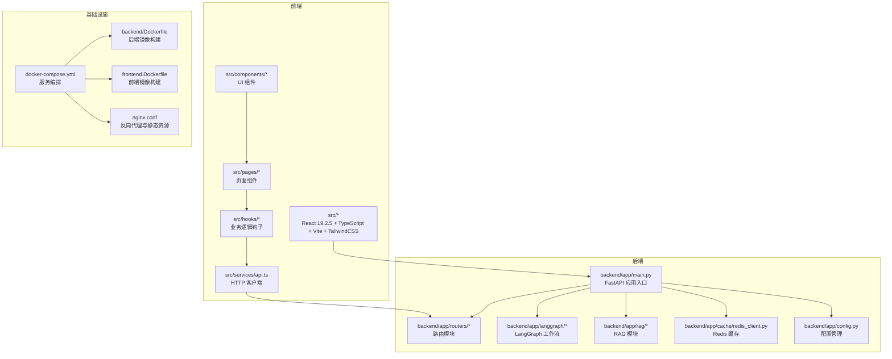
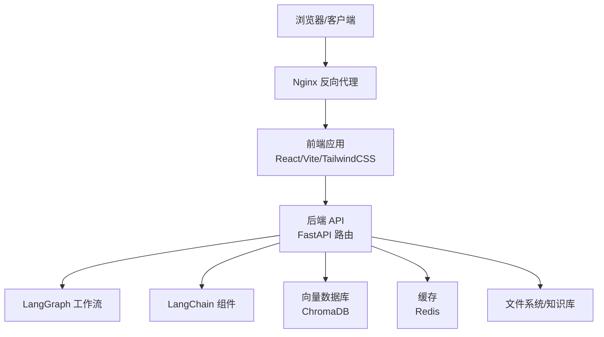
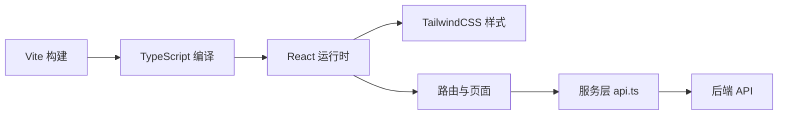
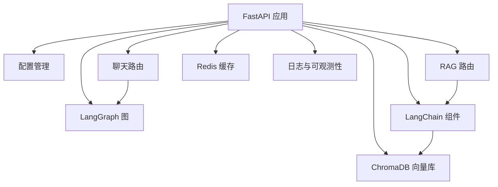
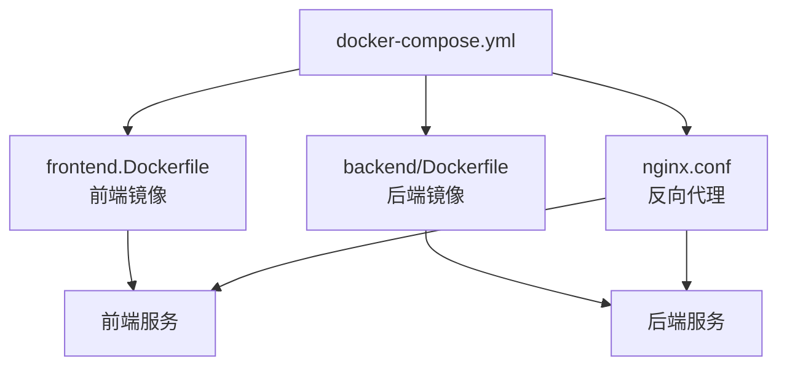
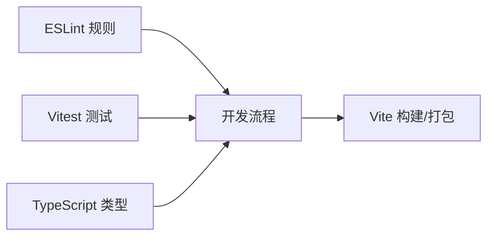
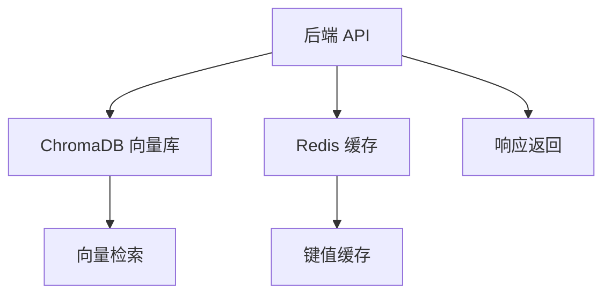
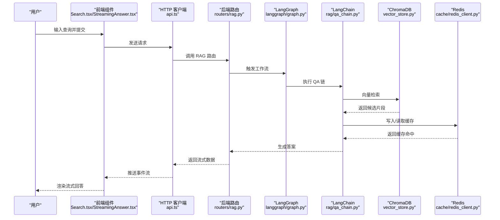
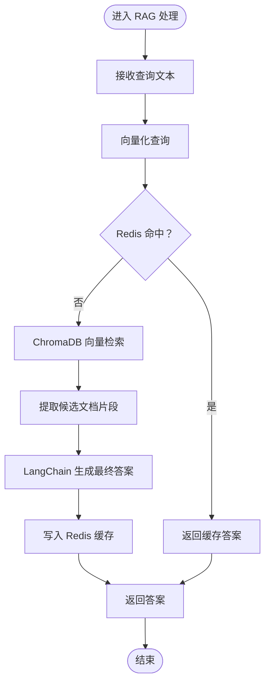
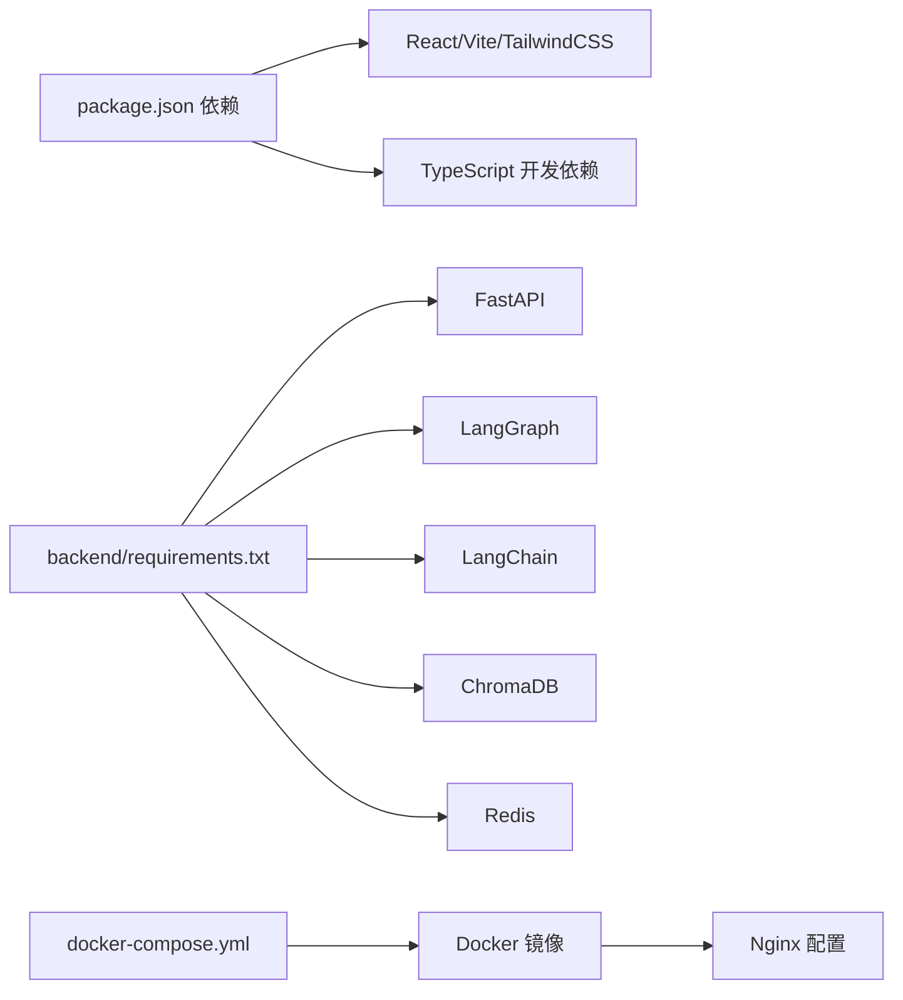

# 技术栈

<cite>
**本文引用的文件**
- [package.json](file://package.json)
- [vite.config.ts](file://vite.config.ts)
- [tsconfig.app.json](file://tsconfig.app.json)
- [tsconfig.node.json](file://tsconfig.node.json)
- [eslint.config.js](file://eslint.config.js)
- [vitest.config.ts](file://vitest.config.ts)
- [nginx.conf](file://nginx.conf)
- [backend/Dockerfile](file://backend/Dockerfile)
- [frontend.Dockerfile](file://frontend.Dockerfile)
- [docker-compose.yml](file://docker-compose.yml)
- [backend/requirements.txt](file://backend/requirements.txt)
- [backend/app/main.py](file://backend/app/main.py)
- [backend/app/config.py](file://backend/app/config.py)
- [backend/app/cache/redis_client.py](file://backend/app/cache/redis_client.py)
- [backend/app/langgraph/graph.py](file://backend/app/langgraph/graph.py)
- [backend/app/rag/vector_store.py](file://backend/app/rag/vector_store.py)
- [backend/app/routers/chat.py](file://backend/app/routers/chat.py)
- [backend/app/routers/rag.py](file://backend/app/routers/rag.py)
- [src/services/api.ts](file://src/services/api.ts)
- [src/hooks/useChat.ts](file://src/hooks/useChat.ts)
- [src/hooks/useDocuments.ts](file://src/hooks/useDocuments.ts)
- [src/pages/Search.tsx](file://src/pages/Search.tsx)
- [src/components/search/StreamingAnswer.tsx](file://src/components/search/StreamingAnswer.tsx)
- [src/components/documents/DocumentUpload.tsx](file://src/components/documents/DocumentUpload.tsx)
- [src/components/ui/Button.tsx](file://src/components/ui/Button.tsx)
- [src/index.css](file://src/index.css)
- [src/styles/design-tokens.css](file://src/styles/design-tokens.css)
- [docs/deployment/docker-setup.md](file://docs/deployment/docker-setup.md)
- [docs/architecture/system-overview.md](file://docs/architecture/system-overview.md)
</cite>

## 目录
1. 引言
2. 项目结构
3. 核心组件
4. 架构总览
5. 详细组件分析
6. 依赖关系分析
7. 性能考量
8. 故障排查指南
9. 结论
10. 附录

## 引言
本文件系统性梳理 Aureon 平台的技术栈与架构决策，覆盖前端（React 19.2.5、Vite 5.0、TypeScript、TailwindCSS）、后端（Python 3.11、FastAPI 0.115、LangGraph、LangChain 1.3、ChromaDB 0.5、Redis 5.0）、容器化（Docker、docker-compose）、开发工具链（ESLint、Vitest、Nginx），并说明开发与生产环境的配置差异及版本兼容性。

## 项目结构
Aureon 采用前后端分离架构：前端位于 src 目录，使用 Vite 构建；后端位于 backend 目录，基于 FastAPI 提供 API；顶层通过 docker-compose 统一编排；文档位于 docs 目录，涵盖部署与架构概览。

图表来源
- [docker-compose.yml](file://docker-compose.yml)
- [backend/app/main.py](file://backend/app/main.py)
- [backend/app/routers/chat.py](file://backend/app/routers/chat.py)
- [backend/app/routers/rag.py](file://backend/app/routers/rag.py)
- [backend/app/langgraph/graph.py](file://backend/app/langgraph/graph.py)
- [backend/app/rag/vector_store.py](file://backend/app/rag/vector_store.py)
- [backend/app/cache/redis_client.py](file://backend/app/cache/redis_client.py)
- [backend/app/config.py](file://backend/app/config.py)
- [backend/Dockerfile](file://backend/Dockerfile)
- [frontend.Dockerfile](file://frontend.Dockerfile)
- [nginx.conf](file://nginx.conf)

章节来源
- [docker-compose.yml](file://docker-compose.yml)
- [backend/app/main.py](file://backend/app/main.py)
- [backend/app/config.py](file://backend/app/config.py)

## 核心组件
- 前端技术栈：React 19.2.5、Vite 5.0、TypeScript、TailwindCSS。用于构建交互式搜索与仪表盘界面，支持国际化、实时流式回答与文档上传。
- 后端技术栈：Python 3.11、FastAPI 0.115、LangGraph、LangChain 1.3、ChromaDB 0.5、Redis 5.0。提供 RAG、对话、知识管理与可观测性等能力。
- 容器化：Docker 与 docker-compose 实现前后端镜像构建与服务编排，Nginx 提供静态资源与反向代理。
- 开发工具链：ESLint、Vitest、TypeScript 编译与类型检查，保障代码质量与测试覆盖率。

章节来源
- [package.json](file://package.json)
- [vite.config.ts](file://vite.config.ts)
- [tsconfig.app.json](file://tsconfig.app.json)
- [tsconfig.node.json](file://tsconfig.node.json)
- [eslint.config.js](file://eslint.config.js)
- [vitest.config.ts](file://vitest.config.ts)
- [backend/requirements.txt](file://backend/requirements.txt)
- [backend/app/main.py](file://backend/app/main.py)

## 架构总览
Aureon 的整体架构围绕“前端 React + 后端 FastAPI + LangGraph/LangChain + ChromaDB + Redis”的组合展开。前端通过 HTTP 客户端调用后端路由，后端通过 LangGraph 管理多智能体工作流，结合 LangChain 进行检索增强生成（RAG），向量存储由 ChromaDB 提供，缓存层使用 Redis。docker-compose 将各服务编排为可部署的整体。

图表来源
- [nginx.conf](file://nginx.conf)
- [src/services/api.ts](file://src/services/api.ts)
- [backend/app/routers/chat.py](file://backend/app/routers/chat.py)
- [backend/app/routers/rag.py](file://backend/app/routers/rag.py)
- [backend/app/langgraph/graph.py](file://backend/app/langgraph/graph.py)
- [backend/app/rag/vector_store.py](file://backend/app/rag/vector_store.py)
- [backend/app/cache/redis_client.py](file://backend/app/cache/redis_client.py)

## 详细组件分析

### 前端技术栈与配置
- React 19.2.5：页面与组件体系，包括聊天窗口、搜索栏、流式回答、文档上传、仪表盘等。
- Vite 5.0：快速开发与构建工具，提供热更新与优化打包。
- TypeScript：类型安全与工程化保障，配合 tsconfig 配置实现严格模式与路径别名。
- TailwindCSS：原子化样式框架，结合设计令牌与主题变量实现一致的视觉语言。

图表来源
- [vite.config.ts](file://vite.config.ts)
- [tsconfig.app.json](file://tsconfig.app.json)
- [tsconfig.node.json](file://tsconfig.node.json)
- [src/services/api.ts](file://src/services/api.ts)
- [src/pages/Search.tsx](file://src/pages/Search.tsx)
- [src/components/search/StreamingAnswer.tsx](file://src/components/search/StreamingAnswer.tsx)
- [src/components/documents/DocumentUpload.tsx](file://src/components/documents/DocumentUpload.tsx)
- [src/index.css](file://src/index.css)
- [src/styles/design-tokens.css](file://src/styles/design-tokens.css)

章节来源
- [package.json](file://package.json)
- [vite.config.ts](file://vite.config.ts)
- [tsconfig.app.json](file://tsconfig.app.json)
- [tsconfig.node.json](file://tsconfig.node.json)
- [src/services/api.ts](file://src/services/api.ts)
- [src/index.css](file://src/index.css)
- [src/styles/design-tokens.css](file://src/styles/design-tokens.css)

### 后端技术栈与配置
- Python 3.11：运行时环境，确保与第三方库兼容性。
- FastAPI 0.115：高性能异步 Web 框架，提供自动 OpenAPI 文档与类型校验。
- LangGraph：用于定义状态图与节点，协调多智能体协作。
- LangChain 1.3：提供链式调用、提示工程与检索模块。
- ChromaDB 0.5：嵌入向量存储，支撑 RAG 查询与相似度检索。
- Redis 5.0：会话与缓存，加速查询与降低后端压力。

图表来源
- [backend/app/main.py](file://backend/app/main.py)
- [backend/app/config.py](file://backend/app/config.py)
- [backend/app/routers/chat.py](file://backend/app/routers/chat.py)
- [backend/app/routers/rag.py](file://backend/app/routers/rag.py)
- [backend/app/langgraph/graph.py](file://backend/app/langgraph/graph.py)
- [backend/app/rag/vector_store.py](file://backend/app/rag/vector_store.py)
- [backend/app/cache/redis_client.py](file://backend/app/cache/redis_client.py)

章节来源
- [backend/requirements.txt](file://backend/requirements.txt)
- [backend/app/main.py](file://backend/app/main.py)
- [backend/app/config.py](file://backend/app/config.py)
- [backend/app/cache/redis_client.py](file://backend/app/cache/redis_client.py)
- [backend/app/rag/vector_store.py](file://backend/app/rag/vector_store.py)
- [backend/app/routers/chat.py](file://backend/app/routers/chat.py)
- [backend/app/routers/rag.py](file://backend/app/routers/rag.py)

### 容器化与编排
- Docker：分别构建前端与后端镜像，隔离运行环境。
- docker-compose：统一编排前端、后端、Nginx、数据库与缓存服务，支持开发与生产部署。
- Nginx：提供静态资源服务与反向代理，转发到前端或后端。

图表来源
- [docker-compose.yml](file://docker-compose.yml)
- [frontend.Dockerfile](file://frontend.Dockerfile)
- [backend/Dockerfile](file://backend/Dockerfile)
- [nginx.conf](file://nginx.conf)

章节来源
- [docker-compose.yml](file://docker-compose.yml)
- [frontend.Dockerfile](file://frontend.Dockerfile)
- [backend/Dockerfile](file://backend/Dockerfile)
- [nginx.conf](file://nginx.conf)

### 开发工具链
- ESLint：统一代码风格与静态检查规则，减少潜在问题。
- Vitest：单元与集成测试框架，提升代码可靠性。
- TypeScript：在开发阶段捕获类型错误，提高可维护性。

图表来源
- [eslint.config.js](file://eslint.config.js)
- [vitest.config.ts](file://vitest.config.ts)
- [tsconfig.app.json](file://tsconfig.app.json)
- [vite.config.ts](file://vite.config.ts)

章节来源
- [eslint.config.js](file://eslint.config.js)
- [vitest.config.ts](file://vitest.config.ts)
- [tsconfig.app.json](file://tsconfig.app.json)
- [vite.config.ts](file://vite.config.ts)

### 数据库与缓存集成方案
- ChromaDB：作为向量数据库，提供嵌入维度的相似度检索，支撑 RAG 查询重写与语义分割后的文档检索。
- Redis：作为缓存与会话存储，加速常见查询与跨请求的状态共享。

图表来源
- [backend/app/rag/vector_store.py](file://backend/app/rag/vector_store.py)
- [backend/app/cache/redis_client.py](file://backend/app/cache/redis_client.py)
- [backend/app/routers/rag.py](file://backend/app/routers/rag.py)

章节来源
- [backend/app/rag/vector_store.py](file://backend/app/rag/vector_store.py)
- [backend/app/cache/redis_client.py](file://backend/app/cache/redis_client.py)
- [backend/app/routers/rag.py](file://backend/app/routers/rag.py)

### 前后端交互序列
以下序列展示前端发起搜索请求到后端处理并返回流式结果的完整流程。

图表来源
- [src/pages/Search.tsx](file://src/pages/Search.tsx)
- [src/components/search/StreamingAnswer.tsx](file://src/components/search/StreamingAnswer.tsx)
- [src/services/api.ts](file://src/services/api.ts)
- [backend/app/routers/rag.py](file://backend/app/routers/rag.py)
- [backend/app/langgraph/graph.py](file://backend/app/langgraph/graph.py)
- [backend/app/rag/vector_store.py](file://backend/app/rag/vector_store.py)
- [backend/app/cache/redis_client.py](file://backend/app/cache/redis_client.py)

章节来源
- [src/services/api.ts](file://src/services/api.ts)
- [src/hooks/useChat.ts](file://src/hooks/useChat.ts)
- [backend/app/routers/rag.py](file://backend/app/routers/rag.py)
- [backend/app/langgraph/graph.py](file://backend/app/langgraph/graph.py)
- [backend/app/rag/vector_store.py](file://backend/app/rag/vector_store.py)
- [backend/app/cache/redis_client.py](file://backend/app/cache/redis_client.py)

### 复杂逻辑流程（RAG 检索与缓存）
以下流程展示后端在执行 RAG 时的检索与缓存策略。

图表来源
- [backend/app/rag/vector_store.py](file://backend/app/rag/vector_store.py)
- [backend/app/cache/redis_client.py](file://backend/app/cache/redis_client.py)
- [backend/app/routers/rag.py](file://backend/app/routers/rag.py)

章节来源
- [backend/app/rag/vector_store.py](file://backend/app/rag/vector_store.py)
- [backend/app/cache/redis_client.py](file://backend/app/cache/redis_client.py)
- [backend/app/routers/rag.py](file://backend/app/routers/rag.py)

## 依赖关系分析
- 前端依赖：React 生态、Vite 构建、TailwindCSS 样式、TypeScript 类型系统。
- 后端依赖：FastAPI、LangGraph、LangChain、ChromaDB、Redis、Python 标准库与常用工具。
- 容器与编排：Docker 镜像构建、docker-compose 服务编排、Nginx 反向代理。

图表来源
- [package.json](file://package.json)
- [backend/requirements.txt](file://backend/requirements.txt)
- [docker-compose.yml](file://docker-compose.yml)
- [nginx.conf](file://nginx.conf)

章节来源
- [package.json](file://package.json)
- [backend/requirements.txt](file://backend/requirements.txt)
- [docker-compose.yml](file://docker-compose.yml)
- [nginx.conf](file://nginx.conf)

## 性能考量
- 前端：Vite 的按需打包与 Tree-shaking 减少体积；TailwindCSS 原子类避免重复样式；TypeScript 类型检查在构建期发现性能隐患。
- 后端：LangGraph 工作流拆分职责，LangChain 链式调用减少重复逻辑；ChromaDB 向量检索与 Redis 缓存降低延迟。
- 容器化：多阶段构建减小镜像体积；Nginx 提升静态资源加载效率；docker-compose 合理分配资源与网络。

## 故障排查指南
- 前端
  - 构建失败：检查 Vite 配置与 TypeScript 编译选项，确认包依赖安装完成。
  - 样式异常：核对 TailwindCSS 配置与设计令牌是否正确引入。
  - 请求失败：确认 API 地址与路由映射，检查跨域与鉴权设置。
- 后端
  - 依赖缺失：核对 requirements.txt 版本，确保 Python 3.11 环境与虚拟环境激活。
  - 向量检索失败：检查 ChromaDB 连接与集合是否存在；确认嵌入模型与维度匹配。
  - 缓存不可用：验证 Redis 连接参数与持久化策略。
- 容器化
  - 镜像构建失败：检查 Dockerfile 与 .dockerignore；确认网络与缓存权限。
  - 服务无法启动：查看 docker-compose 日志，核对端口占用与卷挂载。

章节来源
- [vite.config.ts](file://vite.config.ts)
- [tsconfig.app.json](file://tsconfig.app.json)
- [backend/requirements.txt](file://backend/requirements.txt)
- [backend/app/rag/vector_store.py](file://backend/app/rag/vector_store.py)
- [backend/app/cache/redis_client.py](file://backend/app/cache/redis_client.py)
- [docker-compose.yml](file://docker-compose.yml)

## 结论
Aureon 的技术栈以现代、高效与可扩展为核心目标：前端提供流畅的用户体验，后端以 LangGraph/LangChain 与 ChromaDB/Redis 构建强大的 RAG 能力，容器化与 Nginx 提升部署与运维效率。开发工具链保障代码质量与测试覆盖。版本选择兼顾稳定性与前沿特性，并通过 docker-compose 在开发与生产环境间保持一致性。

## 附录
- 开发与生产环境差异
  - 端口与域名：开发使用本地端口，生产通过 Nginx 暴露 HTTPS。
  - 缓存策略：生产启用 Redis 持久化与备份；开发使用内存缓存。
  - 日志级别：生产开启结构化日志与采样；开发输出详细调试信息。
  - 静态资源：生产启用压缩与缓存头；开发使用源映射便于调试。
- 参考文档
  - 部署指南：参阅 docs/deployment/docker-setup.md
  - 架构概览：参阅 docs/architecture/system-overview.md

章节来源
- [docs/deployment/docker-setup.md](file://docs/deployment/docker-setup.md)
- [docs/architecture/system-overview.md](file://docs/architecture/system-overview.md)