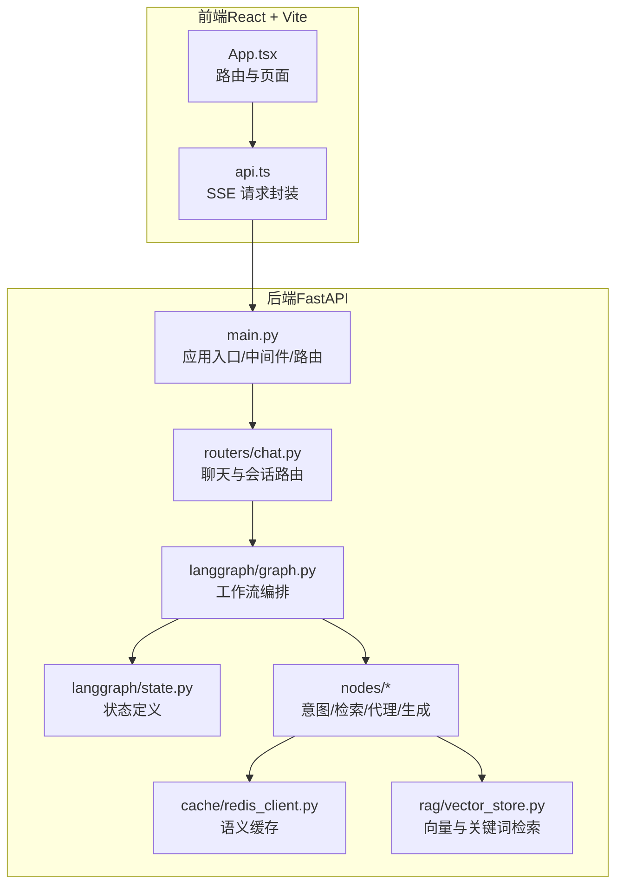
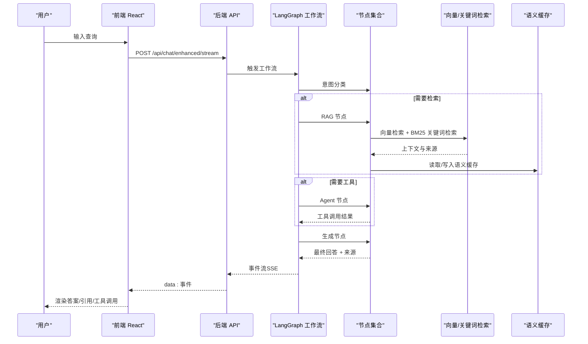
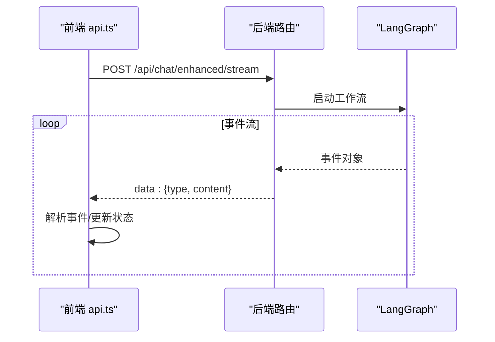
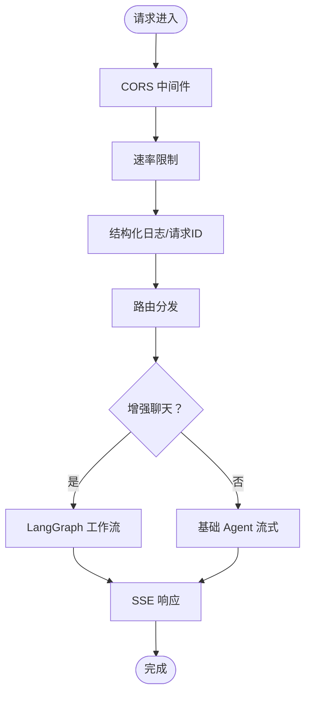
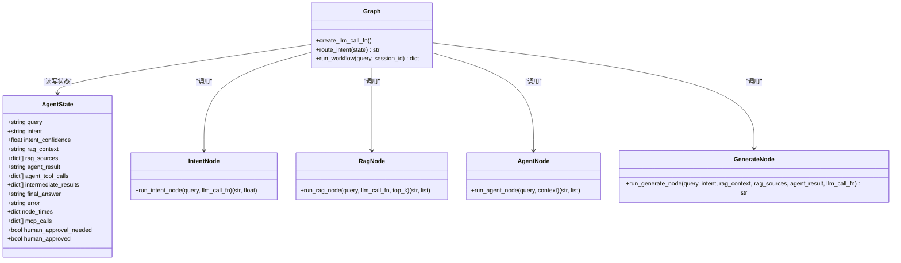
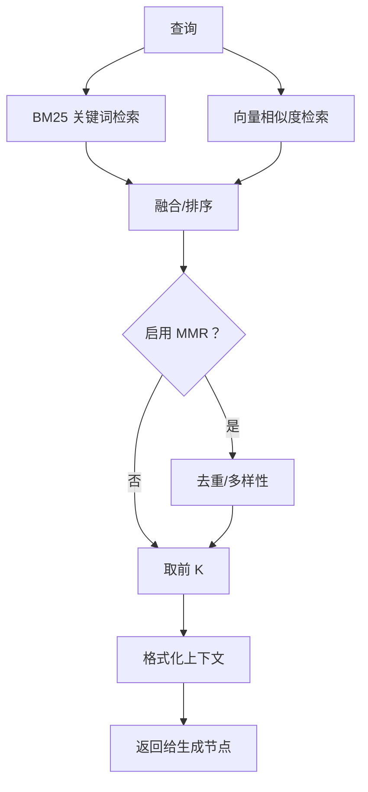
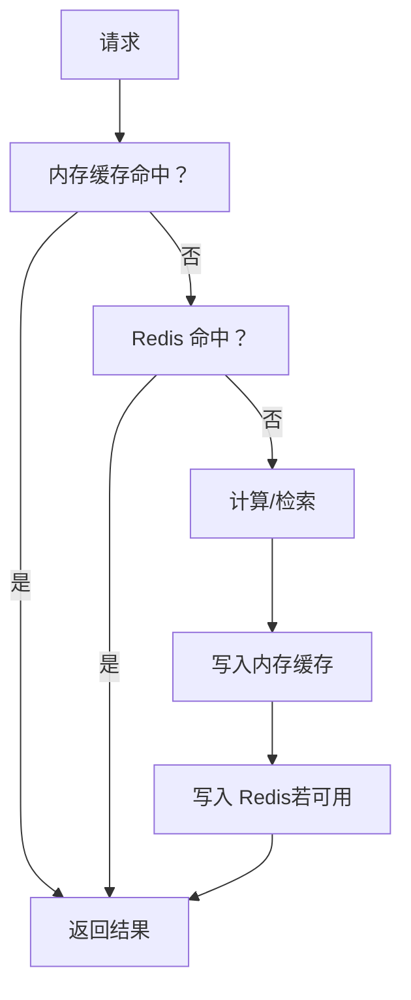
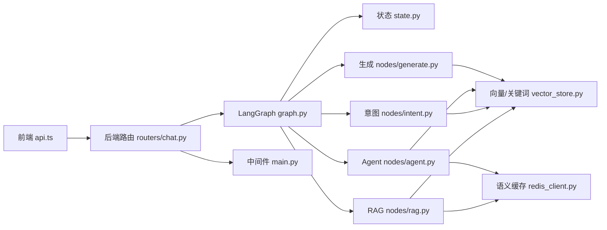

# 架构概览

<cite>
**本文档引用的文件**
- [README.md](file://README.md)
- [TECH_DESIGN.md](file://TECH_DESIGN.md)
- [docs/architecture/system-overview.md](file://docs/architecture/system-overview.md)
- [backend/app/main.py](file://backend/app/main.py)
- [backend/app/routers/chat.py](file://backend/app/routers/chat.py)
- [backend/app/langgraph/graph.py](file://backend/app/langgraph/graph.py)
- [backend/app/langgraph/state.py](file://backend/app/langgraph/state.py)
- [backend/app/langgraph/nodes/intent.py](file://backend/app/langgraph/nodes/intent.py)
- [backend/app/langgraph/nodes/rag.py](file://backend/app/langgraph/nodes/rag.py)
- [backend/app/langgraph/nodes/agent.py](file://backend/app/langgraph/nodes/agent.py)
- [backend/app/langgraph/nodes/generate.py](file://backend/app/langgraph/nodes/generate.py)
- [backend/app/cache/redis_client.py](file://backend/app/cache/redis_client.py)
- [backend/app/rag/vector_store.py](file://backend/app/rag/vector_store.py)
- [src/App.tsx](file://src/App.tsx)
- [src/services/api.ts](file://src/services/api.ts)
</cite>

## 目录
1. [引言](#引言)
2. [项目结构](#项目结构)
3. [核心组件](#核心组件)
4. [架构总览](#架构总览)
5. [详细组件分析](#详细组件分析)
6. [依赖关系分析](#依赖关系分析)
7. [性能考量](#性能考量)
8. [故障排查指南](#故障排查指南)
9. [结论](#结论)
10. [附录](#附录)

## 引言
本文件面向 Aureon 平台的架构概览与实现细节，围绕“用户请求从 Web UI 到后端服务”的完整数据流展开，重点阐释前端 React 应用与后端 FastAPI 服务的交互机制、LangGraph 工作流编排在系统中的核心作用（意图分类器、混合检索、LLM 生成、缓存层与 SSE 流式响应）、组件间的依赖关系与通信协议，并讨论系统的可扩展性设计、微服务化原则、安全架构、缓存策略与监控体系等横切关注点。

## 项目结构
Aureon 采用前后端分离架构：前端使用 React + Vite，后端使用 FastAPI，LangGraph 负责工作流编排；RAG 子系统包含向量检索、BM25 关键词检索、重排序与缓存；缓存层支持 Redis 与内存双栈；SSE 提供流式响应；可观测性通过中间件与指标端点实现。

图表来源
- [src/App.tsx:1-122](file://src/App.tsx#L1-L122)
- [src/services/api.ts:1-157](file://src/services/api.ts#L1-L157)
- [backend/app/main.py:1-371](file://backend/app/main.py#L1-L371)
- [backend/app/routers/chat.py:1-107](file://backend/app/routers/chat.py#L1-L107)
- [backend/app/langgraph/graph.py:1-163](file://backend/app/langgraph/graph.py#L1-L163)
- [backend/app/langgraph/state.py:1-47](file://backend/app/langgraph/state.py#L1-L47)
- [backend/app/cache/redis_client.py:1-161](file://backend/app/cache/redis_client.py#L1-L161)
- [backend/app/rag/vector_store.py:1-800](file://backend/app/rag/vector_store.py#L1-L800)

章节来源
- [README.md:40-49](file://README.md#L40-L49)
- [docs/architecture/system-overview.md:3-12](file://docs/architecture/system-overview.md#L3-L12)

## 核心组件
- 前端 React 应用：负责页面路由、UI 组件与 SSE 事件消费，通过 api.ts 封装与后端交互。
- FastAPI 后端：统一入口 main.py 注册中间件、异常处理器、健康检查与各业务路由；聊天路由在 routers/chat.py 中实现基础与增强两种 SSE 流式对话。
- LangGraph 工作流：在 graph.py 中定义状态与节点，按意图路由执行 RAG/Agent/生成，支持并行与条件分支。
- RAG 检索：vector_store.py 实现向量检索（ChromaDB + 多提供商嵌入）、BM25 关键词检索、MMR 重排序与上下文格式化。
- 缓存层：redis_client.py 提供语义缓存（精确匹配），降级为内存缓存，优雅处理不可用场景。
- 安全与可观测：main.py 中间件注入安全头、速率限制、结构化日志与 Prometheus 指标端点。

章节来源
- [src/App.tsx:1-122](file://src/App.tsx#L1-L122)
- [src/services/api.ts:1-157](file://src/services/api.ts#L1-L157)
- [backend/app/main.py:1-371](file://backend/app/main.py#L1-L371)
- [backend/app/routers/chat.py:1-107](file://backend/app/routers/chat.py#L1-L107)
- [backend/app/langgraph/graph.py:1-163](file://backend/app/langgraph/graph.py#L1-L163)
- [backend/app/rag/vector_store.py:1-800](file://backend/app/rag/vector_store.py#L1-L800)
- [backend/app/cache/redis_client.py:1-161](file://backend/app/cache/redis_client.py#L1-L161)

## 架构总览
Aureon 的整体数据流自上而下如下：
- 用户在前端页面提交查询，通过 api.ts 发起 SSE 请求。
- 后端 main.py 注册路由与中间件，routers/chat.py 提供 /api/chat/stream 与 /api/chat/enhanced/stream。
- 增强模式下，后端调用 LangGraph 工作流，按意图路由执行节点：意图分类 → 检索（RAG）/代理（Agent）→ 生成（LLM）→ 产出最终答案与来源。
- 检索阶段结合向量相似度与 BM25 关键词检索，必要时进行 MMR 重排序；生成阶段整合上下文与工具结果，按语言注入指令。
- 缓存层在检索与嵌入阶段提供语义缓存与嵌入缓存，提升命中率与吞吐。
- SSE 将事件流式推送到前端，前端渲染进度、工具调用与引用来源。

图表来源
- [backend/app/routers/chat.py:66-93](file://backend/app/routers/chat.py#L66-L93)
- [backend/app/langgraph/graph.py:43-146](file://backend/app/langgraph/graph.py#L43-L146)
- [backend/app/langgraph/nodes/intent.py:47-76](file://backend/app/langgraph/nodes/intent.py#L47-L76)
- [backend/app/langgraph/nodes/rag.py:11-27](file://backend/app/langgraph/nodes/rag.py#L11-L27)
- [backend/app/langgraph/nodes/agent.py:13-32](file://backend/app/langgraph/nodes/agent.py#L13-L32)
- [backend/app/langgraph/nodes/generate.py:34-89](file://backend/app/langgraph/nodes/generate.py#L34-L89)
- [backend/app/rag/vector_store.py:663-741](file://backend/app/rag/vector_store.py#L663-L741)
- [backend/app/cache/redis_client.py:106-145](file://backend/app/cache/redis_client.py#L106-L145)

章节来源
- [TECH_DESIGN.md:24-58](file://TECH_DESIGN.md#L24-L58)
- [docs/architecture/system-overview.md:30-40](file://docs/architecture/system-overview.md#L30-L40)

## 详细组件分析

### 前端交互与状态管理
- 路由与页面：App.tsx 使用 React Router 实现页面级懒加载与导航。
- SSE 请求封装：api.ts 对基础与增强聊天接口进行封装，解析 data: 行，维护背压控制，处理中断与错误。
- 事件协议：SSE 事件类型覆盖会话标识、文本增量、工具开始/结束、来源、意图、路由、完成与错误。

图表来源
- [src/App.tsx:1-122](file://src/App.tsx#L1-L122)
- [src/services/api.ts:28-156](file://src/services/api.ts#L28-L156)
- [backend/app/routers/chat.py:66-93](file://backend/app/routers/chat.py#L66-L93)

章节来源
- [src/App.tsx:1-122](file://src/App.tsx#L1-L122)
- [src/services/api.ts:1-157](file://src/services/api.ts#L1-L157)

### 后端路由与中间件
- 中间件：CORS、速率限制、结构化日志、安全头注入、Prometheus 指标端点。
- 路由：聊天增强流式接口在 routers/chat.py 中实现；main.py 注册各功能路由与静态资源挂载。
- 健康检查：返回索引状态、模型与工具可用性等。

图表来源
- [backend/app/main.py:73-124](file://backend/app/main.py#L73-L124)
- [backend/app/main.py:340-347](file://backend/app/main.py#L340-L347)
- [backend/app/routers/chat.py:46-93](file://backend/app/routers/chat.py#L46-L93)

章节来源
- [backend/app/main.py:1-371](file://backend/app/main.py#L1-L371)
- [backend/app/routers/chat.py:1-107](file://backend/app/routers/chat.py#L1-L107)

### LangGraph 工作流编排
- 状态定义：state.py 定义工作流全局状态，包含意图、RAG 结果、Agent 结果、中间结果、耗时与 MCP 调用记录等。
- 节点与路由：graph.py 中按意图进行条件路由，支持并行执行 RAG 与 Agent；生成节点汇总上下文与工具结果，输出最终回答。
- 意图分类：nodes/intent.py 使用关键词规则快速判定意图，避免 LLM 调用开销。
- 检索节点：nodes/rag.py 调用 RAG 查询，返回答案与来源。
- 代理节点：nodes/agent.py 创建工具化 Agent，执行工具调用。
- 生成节点：nodes/generate.py 根据语言注入指令，拼装最终回答。

图表来源
- [backend/app/langgraph/state.py:6-47](file://backend/app/langgraph/state.py#L6-L47)
- [backend/app/langgraph/graph.py:20-146](file://backend/app/langgraph/graph.py#L20-L146)
- [backend/app/langgraph/nodes/intent.py:47-76](file://backend/app/langgraph/nodes/intent.py#L47-L76)
- [backend/app/langgraph/nodes/rag.py:11-27](file://backend/app/langgraph/nodes/rag.py#L11-L27)
- [backend/app/langgraph/nodes/agent.py:13-32](file://backend/app/langgraph/nodes/agent.py#L13-L32)
- [backend/app/langgraph/nodes/generate.py:34-89](file://backend/app/langgraph/nodes/generate.py#L34-L89)

章节来源
- [backend/app/langgraph/graph.py:1-163](file://backend/app/langgraph/graph.py#L1-L163)
- [backend/app/langgraph/state.py:1-47](file://backend/app/langgraph/state.py#L1-L47)
- [backend/app/langgraph/nodes/intent.py:1-76](file://backend/app/langgraph/nodes/intent.py#L1-L76)
- [backend/app/langgraph/nodes/rag.py:1-27](file://backend/app/langgraph/nodes/rag.py#L1-L27)
- [backend/app/langgraph/nodes/agent.py:1-32](file://backend/app/langgraph/nodes/agent.py#L1-L32)
- [backend/app/langgraph/nodes/generate.py:1-89](file://backend/app/langgraph/nodes/generate.py#L1-L89)

### RAG 检索与重排序
- 向量检索：vector_store.py 使用 ChromaDB 作为持久化向量库，支持多提供商嵌入（本地 BGE、DashScope、SiliconFlow、Zhipu），自动降级与维度兼容处理。
- BM25 关键词检索：预构建文档级分词与 IDF，查询时快速打分，支持语言过滤与最小阈值过滤。
- MMR 重排序：在向量检索基础上，优先唯一来源并填充高分项，提升多样性。
- 上下文格式化：优先父级文本，去重合并，便于生成节点拼装引用。

图表来源
- [backend/app/rag/vector_store.py:176-325](file://backend/app/rag/vector_store.py#L176-L325)
- [backend/app/rag/vector_store.py:416-513](file://backend/app/rag/vector_store.py#L416-L513)
- [backend/app/rag/vector_store.py:663-741](file://backend/app/rag/vector_store.py#L663-L741)
- [backend/app/rag/vector_store.py:764-786](file://backend/app/rag/vector_store.py#L764-L786)

章节来源
- [backend/app/rag/vector_store.py:1-800](file://backend/app/rag/vector_store.py#L1-L800)

### 缓存策略与降级
- 语义缓存：redis_client.py 提供精确查询命中缓存，支持内存降级缓存；在 Redis 不可用时自动回退，保证服务连续性。
- 嵌入缓存：向量检索链路中对嵌入结果进行内存与 Redis 双层缓存，减少重复计算与外部 API 调用。
- 版本化：缓存键带版本号，逻辑变更时可主动失效旧缓存。

图表来源
- [backend/app/cache/redis_client.py:106-145](file://backend/app/cache/redis_client.py#L106-L145)
- [backend/app/rag/vector_store.py:436-513](file://backend/app/rag/vector_store.py#L436-L513)

章节来源
- [backend/app/cache/redis_client.py:1-161](file://backend/app/cache/redis_client.py#L1-L161)
- [backend/app/rag/vector_store.py:1-800](file://backend/app/rag/vector_store.py#L1-L800)

### 安全架构与合规
- CORS 限制：仅允许开发环境默认地址。
- 速率限制：SlowAPI 限流保护。
- 安全头：X-Content-Type-Options、X-Frame-Options、X-XSS-Protection、Referrer-Policy。
- 异常结构化：统一异常处理器返回结构化 JSON。
- 前端密钥隔离：API Key 仅存在于后端环境变量，前端不携带。

章节来源
- [backend/app/main.py:73-124](file://backend/app/main.py#L73-L124)
- [backend/app/main.py:88-98](file://backend/app/main.py#L88-L98)
- [TECH_DESIGN.md:100-106](file://TECH_DESIGN.md#L100-L106)

### 监控与可观测性
- 结构化日志：structlog 输出请求完成事件，包含方法、路径、状态码与耗时。
- 指标端点：Prometheus 指标通过 /metrics 暴露。
- 健康检查：/api/health 返回索引状态、模型与工具可用性。

章节来源
- [backend/app/main.py:48-124](file://backend/app/main.py#L48-L124)
- [backend/app/main.py:340-347](file://backend/app/main.py#L340-L347)

## 依赖关系分析
- 前端依赖后端路由与 SSE 事件协议；路由与页面懒加载降低首屏负载。
- 后端依赖 LangGraph 工作流与节点模块；节点依赖 RAG 检索与缓存模块。
- RAG 检索依赖向量存储与嵌入提供方；缓存模块依赖 Redis 与内存缓存。
- 中间件与异常处理贯穿整个请求生命周期，确保一致的安全与可观测性。

图表来源
- [src/services/api.ts:1-157](file://src/services/api.ts#L1-L157)
- [backend/app/routers/chat.py:1-107](file://backend/app/routers/chat.py#L1-L107)
- [backend/app/langgraph/graph.py:1-163](file://backend/app/langgraph/graph.py#L1-L163)
- [backend/app/langgraph/state.py:1-47](file://backend/app/langgraph/state.py#L1-L47)
- [backend/app/langgraph/nodes/intent.py:1-76](file://backend/app/langgraph/nodes/intent.py#L1-L76)
- [backend/app/langgraph/nodes/rag.py:1-27](file://backend/app/langgraph/nodes/rag.py#L1-L27)
- [backend/app/langgraph/nodes/agent.py:1-32](file://backend/app/langgraph/nodes/agent.py#L1-L32)
- [backend/app/langgraph/nodes/generate.py:1-89](file://backend/app/langgraph/nodes/generate.py#L1-L89)
- [backend/app/rag/vector_store.py:1-800](file://backend/app/rag/vector_store.py#L1-L800)
- [backend/app/cache/redis_client.py:1-161](file://backend/app/cache/redis_client.py#L1-L161)
- [backend/app/main.py:1-371](file://backend/app/main.py#L1-L371)

章节来源
- [backend/app/main.py:1-371](file://backend/app/main.py#L1-L371)
- [backend/app/routers/chat.py:1-107](file://backend/app/routers/chat.py#L1-L107)
- [backend/app/langgraph/graph.py:1-163](file://backend/app/langgraph/graph.py#L1-L163)

## 性能考量
- 流式响应：SSE 降低首 token 延迟，前端背压控制避免 UI 卡顿。
- 检索优化：BM25 关键词检索无嵌入计算，毫秒级；向量检索配合 MMR 提升多样性与质量。
- 缓存策略：语义缓存与嵌入缓存显著减少重复计算与外部 API 调用。
- 并行执行：混合意图下 RAG 与 Agent 节点并行，缩短端到端延迟。
- 启动预热：后台线程预热 BM25 与索引重建，避免首次请求抖动。

章节来源
- [docs/architecture/system-overview.md:30-40](file://docs/architecture/system-overview.md#L30-L40)
- [backend/app/main.py:127-165](file://backend/app/main.py#L127-L165)
- [backend/app/cache/redis_client.py:106-145](file://backend/app/cache/redis_client.py#L106-L145)
- [backend/app/rag/vector_store.py:176-325](file://backend/app/rag/vector_store.py#L176-L325)

## 故障排查指南
- SSE 连接异常：检查后端健康端点与 CORS 配置；确认前端请求 URL 与信号中断处理。
- LangGraph 工作流错误：查看工作流日志与异常处理器返回的结构化错误体；核对意图分类与节点执行时间。
- 缓存不可用：Redis 不可用时会自动降级至内存缓存；检查连接超时与重试策略。
- 检索失败：确认向量库初始化、嵌入维度兼容与语言过滤设置；必要时重建索引。
- 安全相关：确认安全头注入与速率限制配置，排查跨域与 API Key 配置。

章节来源
- [src/services/api.ts:88-94](file://src/services/api.ts#L88-L94)
- [backend/app/main.py:88-98](file://backend/app/main.py#L88-L98)
- [backend/app/cache/redis_client.py:67-98](file://backend/app/cache/redis_client.py#L67-L98)
- [backend/app/rag/vector_store.py:686-718](file://backend/app/rag/vector_store.py#L686-L718)

## 结论
Aureon 通过 React 前端与 FastAPI 后端的清晰边界、LangGraph 工作流的意图驱动编排、RAG 检索与缓存的协同优化，以及 SSE 的流式体验，实现了低延迟、可扩展的企业级 AI 知识平台。安全与可观测性贯穿系统设计，微服务化原则体现在模块化路由与可插拔的节点体系中，便于后续演进与治理。

## 附录
- 快速启动与部署：参见 README 与文档目录中的部署与架构文档链接。
- 技术栈与性能指标：参见 README 与技术设计文档。

章节来源
- [README.md:51-63](file://README.md#L51-L63)
- [docs/architecture/system-overview.md:41-51](file://docs/architecture/system-overview.md#L41-L51)
- [TECH_DESIGN.md:1-120](file://TECH_DESIGN.md#L1-L120)