# RAG 检索增强生成系统

<cite>
**本文引用的文件**
- [backend/app/rag/__init__.py](file://backend/app/rag/__init__.py)
- [backend/app/rag/loader.py](file://backend/app/rag/loader.py)
- [backend/app/rag/models.py](file://backend/app/rag/models.py)
- [backend/app/rag/qa_chain.py](file://backend/app/rag/qa_chain.py)
- [backend/app/rag/query_rewriter.py](file://backend/app/rag/query_rewriter.py)
- [backend/app/rag/vector_store.py](file://backend/app/rag/vector_store.py)
- [backend/app/rag/guardrails.py](file://backend/app/rag/guardrails.py)
- [backend/app/rag/evaluator.py](file://backend/app/rag/evaluator.py)
- [backend/app/rag/test_data.py](file://backend/app/rag/test_data.py)
- [backend/app/langgraph/nodes/rag.py](file://backend/app/langgraph/nodes/rag.py)
- [backend/app/routers/rag.py](file://backend/app/routers/rag.py)
- [backend/app/api/rag_stats.py](file://backend/app/api/rag_stats.py)
- [backend/app/config.py](file://backend/app/config.py)
- [backend/app/main.py](file://backend/app/main.py)
- [src/services/rag.ts](file://src/services/rag.ts)
- [src/components/search/SearchBar.tsx](file://src/components/search/SearchBar.tsx)
- [src/components/search/StreamingAnswer.tsx](file://src/components/search/StreamingAnswer.tsx)
- [src/pages/Search.tsx](file://src/pages/Search.tsx)
- [docs/rag-design.md](file://docs/rag-design.md)
- [docs/superpowers/specs/2026-06-02-rag-quality-p1-design.md](file://docs/superpowers/specs/2026-06-02-rag-quality-p1-design.md)
- [docs/superpowers/plans/2026-05-31-cross-article-query.md](file://docs/superpowers/plans/2026-05-31-cross-article-query.md)
- [tests/test_multi_query_retrieve.py](file://tests/test_multi_query_retrieve.py)
- [tests/test_rag_quality.py](file://tests/test_ragna_quality.py)
- [tests/benchmark_rag.py](file://tests/benchmark_rag.py)
- [tests/benchmark_rag_full.py](file://tests/benchmark_rag_full.py)
</cite>

## 目录
1. [简介](#简介)
2. [项目结构](#项目结构)
3. [核心组件](#核心组件)
4. [架构总览](#架构总览)
5. [详细组件分析](#详细组件分析)
6. [依赖关系分析](#依赖关系分析)
7. [性能考量](#性能考量)
8. [故障排查指南](#故障排查指南)
9. [结论](#结论)
10. [附录](#附录)

## 简介
本技术文档面向 RAG（检索增强生成）系统的开发者与运维人员，系统性阐述混合检索机制（BM25 关键词检索与语义向量检索的融合）、Reciprocal Rank Fusion（RRF）融合算法、多查询扩展、MMR 多样性优化、交叉编码器重排序、相关性门控、负样本检测与事实一致性验证等关键能力。文档结合后端 Python 实现与前端交互层，提供可操作的配置参数说明与性能优化建议，并通过图示与流程展示系统的关键数据流与处理逻辑。

## 项目结构
RAG 子系统主要由后端 Python 包与前端 React 组件构成，核心模块分布如下：
- 后端 RAG 包：负责加载、向量化、检索、融合排序、质量评估与守卫（Guardrails）
- 前端服务与组件：负责用户查询输入、调用后端接口、展示答案与引用
- 文档与测试：包含设计文档、计划文档、单元与基准测试

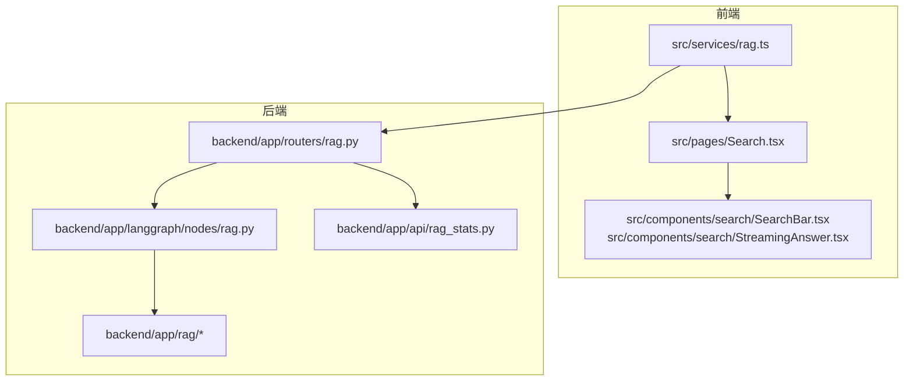

图表来源
- [backend/app/routers/rag.py](file://backend/app/routers/rag.py)
- [backend/app/langgraph/nodes/rag.py](file://backend/app/langgraph/nodes/rag.py)
- [backend/app/rag/__init__.py](file://backend/app/rag/__init__.py)
- [src/services/rag.ts](file://src/services/rag.ts)
- [src/pages/Search.tsx](file://src/pages/Search.tsx)

章节来源
- [backend/app/main.py](file://backend/app/main.py)
- [backend/app/config.py](file://backend/app/config.py)

## 核心组件
- 数据加载与预处理：从知识库加载文档，进行分块与向量化准备
- 查询改写与多查询扩展：识别跨文章查询，生成多个变体以提升召回
- 向量检索与 BM25 检索：分别构建语义与关键词索引，支持混合检索
- 融合排序（RRF）：对不同来源检索结果进行统一排序
- 多样性优化（MMR）：在候选集合中选择多样且相关的片段
- 交叉编码器重排序：使用细粒度交叉编码模型进一步提升排序精度
- 相关性门控与负样本检测：过滤低相关或错误片段
- 守卫（Guardrails）与事实一致性验证：确保回答安全与事实正确
- 质量评估与统计：收集检索与回答指标，支撑持续优化

章节来源
- [backend/app/rag/loader.py](file://backend/app/rag/loader.py)
- [backend/app/rag/query_rewriter.py](file://backend/app/rag/query_rewriter.py)
- [backend/app/rag/vector_store.py](file://backend/app/rag/vector_store.py)
- [backend/app/rag/qa_chain.py](file://backend/app/rag/qa_chain.py)
- [backend/app/rag/guardrails.py](file://backend/app/rag/guardrails.py)
- [backend/app/rag/evaluator.py](file://backend/app/rag/evaluator.py)
- [backend/app/api/rag_stats.py](file://backend/app/api/rag_stats.py)

## 架构总览
下图展示了从前端到后端 RAG 流程的整体架构，包括查询路由、LangGraph 执行节点、检索与融合、重排序与守卫等关键环节。

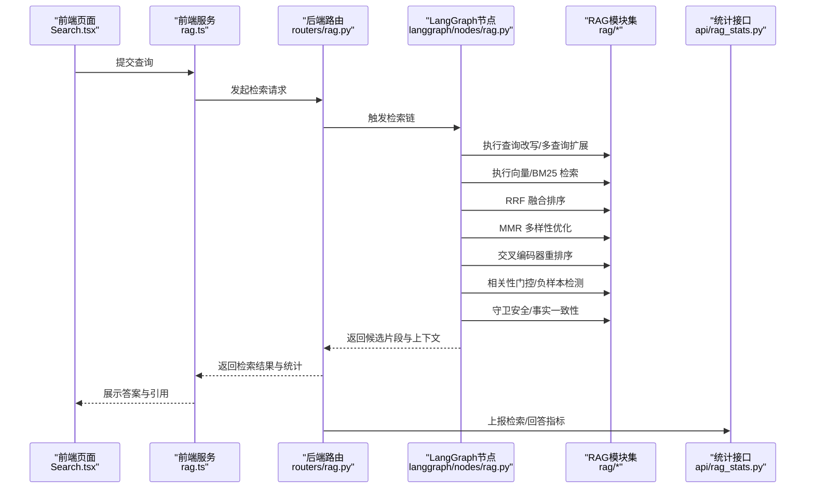

图表来源
- [src/pages/Search.tsx](file://src/pages/Search.tsx)
- [src/services/rag.ts](file://src/services/rag.ts)
- [backend/app/routers/rag.py](file://backend/app/routers/rag.py)
- [backend/app/langgraph/nodes/rag.py](file://backend/app/langgraph/nodes/rag.py)
- [backend/app/rag/__init__.py](file://backend/app/rag/__init__.py)
- [backend/app/api/rag_stats.py](file://backend/app/api/rag_stats.py)

## 详细组件分析

### 查询改写与多查询扩展
- 目标：识别跨文章查询，自动生成相关变体以提升召回
- 关键点：
  - 识别“跨文章”意图（如对比、迁移、迁移路径等）
  - 基于模板或 LLM 动态生成多个查询变体
  - 并行执行多查询检索，扩大召回范围
- 配置参数（示例）：
  - 变体数量上限
  - 变体生成提示词模板
  - 是否启用跨文章检测
- 单元测试参考：[tests/test_multi_query_retrieve.py](file://tests/test_multi_query_retrieve.py)

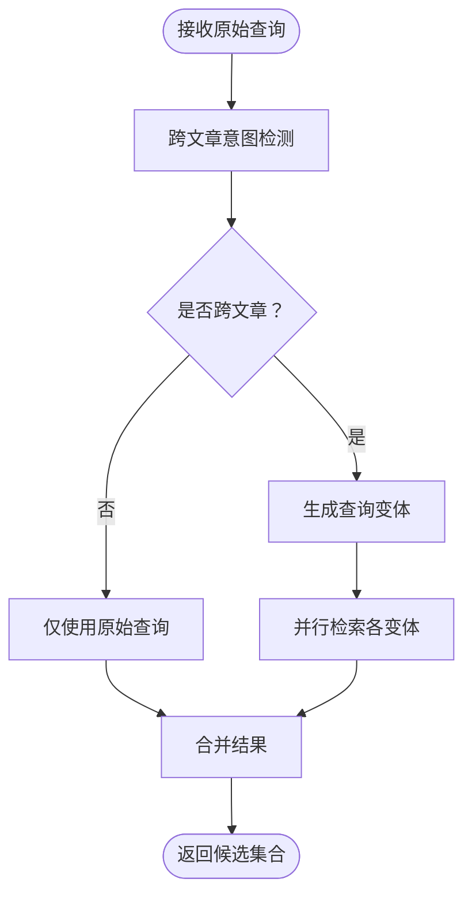

图表来源
- [backend/app/rag/query_rewriter.py](file://backend/app/rag/query_rewriter.py)
- [tests/test_multi_query_retrieve.py](file://tests/test_multi_query_retrieve.py)

章节来源
- [backend/app/rag/query_rewriter.py](file://backend/app/rag/query_rewriter.py)
- [tests/test_multi_query_retrieve.py](file://tests/test_multi_query_retrieve.py)

### 向量检索与 BM25 检索
- 目标：分别建立语义向量索引与 BM25 关键词索引，支持混合检索
- 关键点：
  - 向量检索：基于嵌入模型与向量存储（FAISS/本地向量库）
  - BM25 检索：基于分词与 TF-IDF 权重，适合关键词匹配
  - 可配置相似度阈值与 top-k 数量
- 配置参数（示例）：
  - 向量维度
  - 向量索引路径
  - BM25 k1、b 参数
  - top-k 与召回阈值

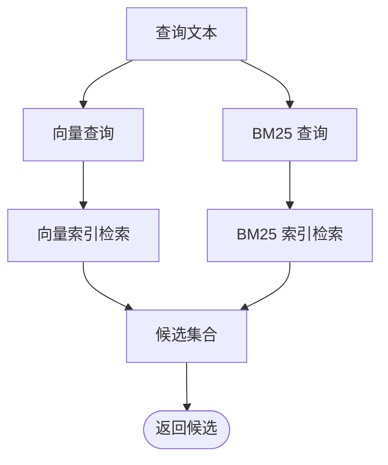

图表来源
- [backend/app/rag/vector_store.py](file://backend/app/rag/vector_store.py)
- [backend/app/rag/loader.py](file://backend/app/rag/loader.py)

章节来源
- [backend/app/rag/vector_store.py](file://backend/app/rag/vector_store.py)
- [backend/app/rag/loader.py](file://backend/app/rag/loader.py)

### Reciprocal Rank Fusion（RRF）融合算法
- 目标：将来自不同检索源（向量、BM25）的结果进行统一排序
- 关键点：
  - 使用 Reciprocal Rank Fusion 公式对各源排名进行融合
  - 可调节融合参数 k（k=60 为常用经验值）
  - 对融合后的结果进行截断与去重
- 配置参数（示例）：
  - 融合参数 k
  - 截断长度 top_k
- 单元测试参考：[tests/test_rag_quality.py](file://tests/test_rag_quality.py)

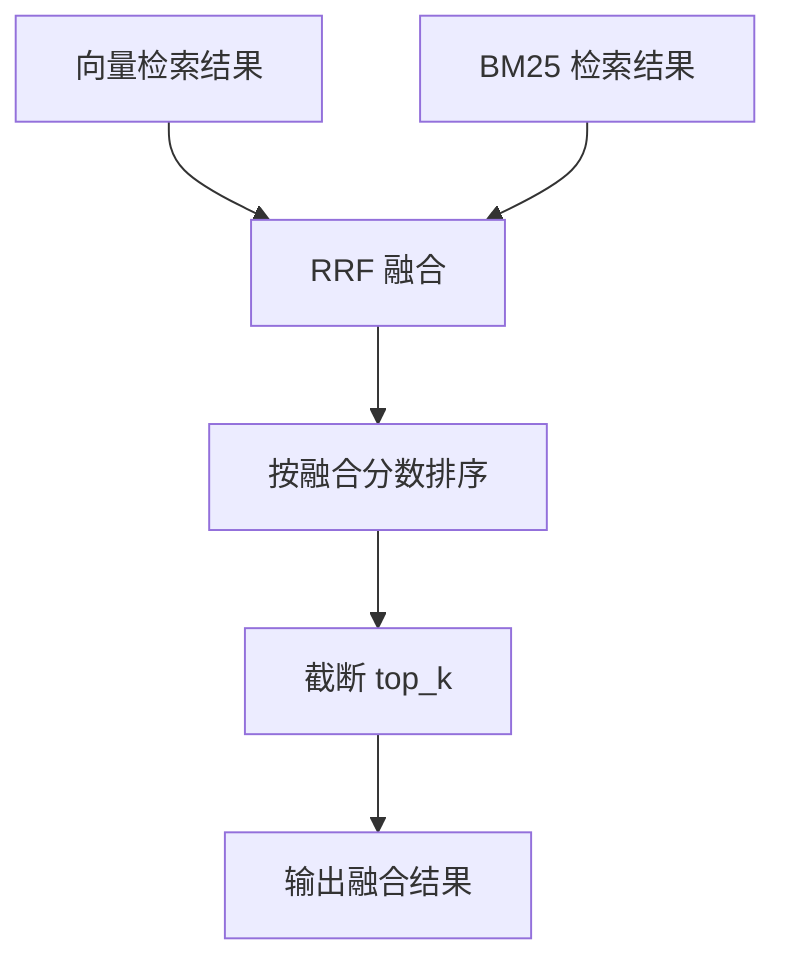

图表来源
- [backend/app/rag/qa_chain.py](file://backend/app/rag/qa_chain.py)
- [tests/test_rag_quality.py](file://tests/test_rag_quality.py)

章节来源
- [backend/app/rag/qa_chain.py](file://backend/app/rag/qa_chain.py)
- [tests/test_rag_quality.py](file://tests/test_rag_quality.py)

### MMR 多样性优化
- 目标：在候选集合中选择既相关又多样化的片段，避免高度重复
- 关键点：
  - 基于余弦相似度计算片段间相似度
  - 通过多样性权重与相关性权重平衡
  - 迭代选择最优片段直至达到数量上限
- 配置参数（示例）：
  - 多样性权重 alpha
  - 选择数量上限
- 单元测试参考：[tests/test_rag_quality.py](file://tests/test_rag_quality.py)

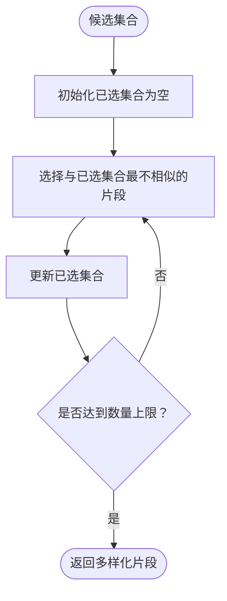

图表来源
- [backend/app/rag/qa_chain.py](file://backend/app/rag/qa_chain.py)
- [tests/test_rag_quality.py](file://tests/test_rag_quality.py)

章节来源
- [backend/app/rag/qa_chain.py](file://backend/app/rag/qa_chain.py)
- [tests/test_rag_quality.py](file://tests/test_rag_quality.py)

### 交叉编码器重排序
- 目标：对候选片段进行细粒度相关性重排，提升排序精度
- 关键点：
  - 使用交叉编码模型对查询与每个候选片段进行成对打分
  - 对高分片段保留，低分片段剔除
  - 可配置最小相关性阈值
- 配置参数（示例）：
  - 交叉编码器模型名称
  - 最小相关性阈值
  - 重排序 top_k

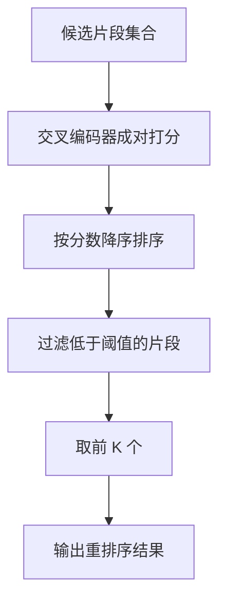

图表来源
- [backend/app/rag/qa_chain.py](file://backend/app/rag/qa_chain.py)

章节来源
- [backend/app/rag/qa_chain.py](file://backend/app/rag/qa_chain.py)

### 相关性门控与负样本检测
- 目标：过滤低相关或错误片段，保障回答质量
- 关键点：
  - 基于阈值的门控过滤
  - 负样本检测（如与问题矛盾或无关片段）
  - 可配置门控阈值与检测策略
- 配置参数（示例）：
  - 相关性阈值
  - 负样本检测开关
- 单元测试参考：[tests/test_rag_quality.py](file://tests/test_rag_quality.py)

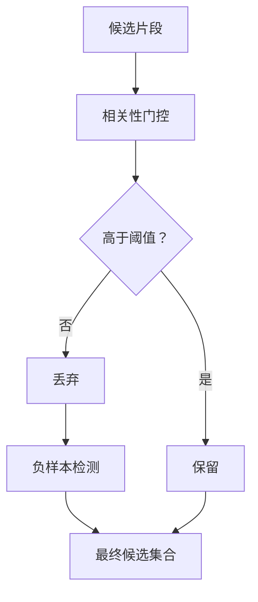

图表来源
- [backend/app/rag/qa_chain.py](file://backend/app/rag/qa_chain.py)
- [tests/test_rag_quality.py](file://tests/test_rag_quality.py)

章节来源
- [backend/app/rag/qa_chain.py](file://backend/app/rag/qa_chain.py)
- [tests/test_rag_quality.py](file://tests/test_rag_quality.py)

### 守卫（Guardrails）与事实一致性验证
- 目标：确保回答安全、合规且事实一致
- 关键点：
  - 安全性守卫：敏感话题过滤、合规内容校验
  - 事实一致性：基于检索片段的事实核验，避免幻觉
  - 可配置守卫规则与一致性阈值
- 配置参数（示例）：
  - 守卫规则集合
  - 一致性验证阈值
- 单元测试参考：[tests/test_guardrails.py](file://tests/test_guardrails.py)

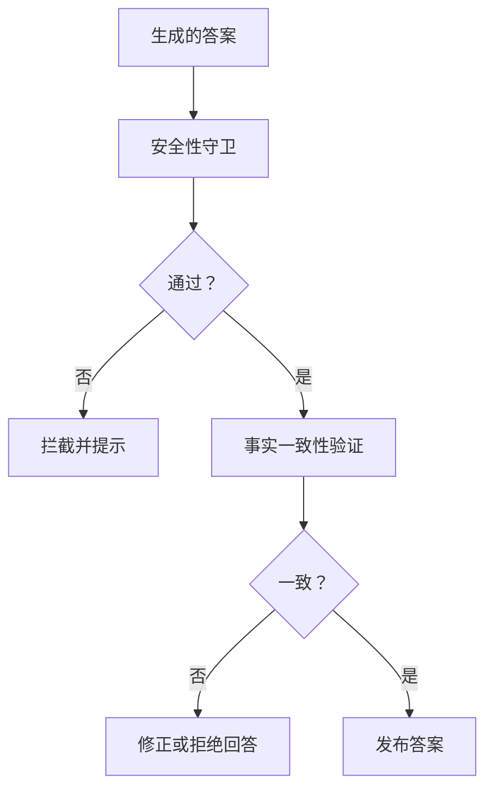

图表来源
- [backend/app/rag/guardrails.py](file://backend/app/rag/guardrails.py)
- [tests/test_guardrails.py](file://tests/test_guardrails.py)

章节来源
- [backend/app/rag/guardrails.py](file://backend/app/rag/guardrails.py)
- [tests/test_guardrails.py](file://tests/test_guardrails.py)

### 质量评估与统计
- 目标：收集检索与回答指标，支撑持续优化
- 关键点：
  - 指标：命中率、准确率、平均倒数排名、多样性评分
  - 接口：/api/rag/stats
  - 支持基准测试与端到端评测
- 单元测试参考：[tests/benchmark_rag.py](file://tests/benchmark_rag.py)、[tests/benchmark_rag_full.py](file://tests/benchmark_rag_full.py)

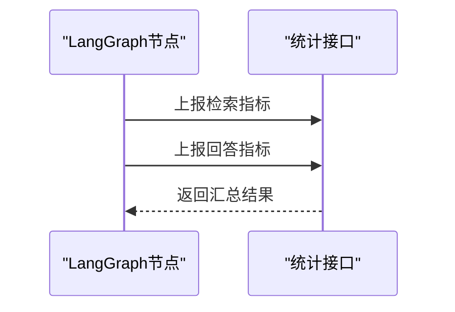

图表来源
- [backend/app/api/rag_stats.py](file://backend/app/api/rag_stats.py)
- [tests/benchmark_rag.py](file://tests/benchmark_rag.py)
- [tests/benchmark_rag_full.py](file://tests/benchmark_rag_full.py)

章节来源
- [backend/app/api/rag_stats.py](file://backend/app/api/rag_stats.py)
- [tests/benchmark_rag.py](file://tests/benchmark_rag.py)
- [tests/benchmark_rag_full.py](file://tests/benchmark_rag_full.py)

## 依赖关系分析
- 后端路由与 LangGraph 节点：路由层负责请求接入与响应封装，LangGraph 节点编排检索链
- RAG 模块：loader、vector_store、qa_chain、guardrails、evaluator 等模块协同工作
- 前端服务：通过服务层调用后端接口，页面组件负责渲染与交互

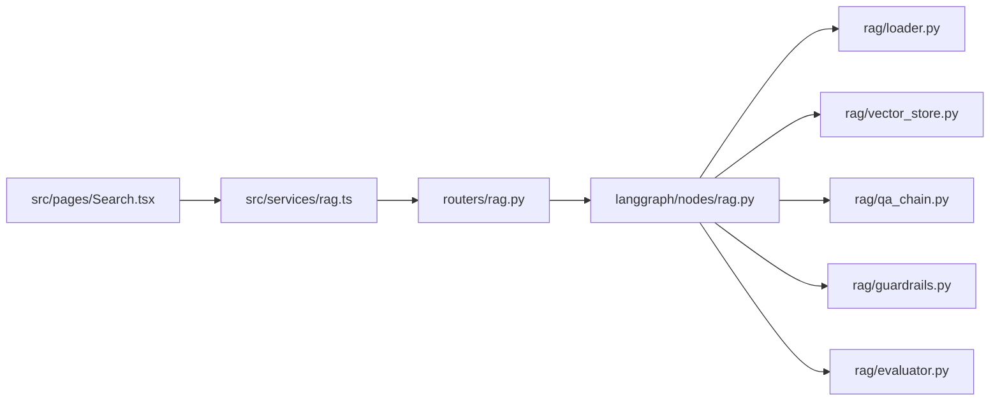

图表来源
- [backend/app/routers/rag.py](file://backend/app/routers/rag.py)
- [backend/app/langgraph/nodes/rag.py](file://backend/app/langgraph/nodes/rag.py)
- [backend/app/rag/loader.py](file://backend/app/rag/loader.py)
- [backend/app/rag/vector_store.py](file://backend/app/rag/vector_store.py)
- [backend/app/rag/qa_chain.py](file://backend/app/rag/qa_chain.py)
- [backend/app/rag/guardrails.py](file://backend/app/rag/guardrails.py)
- [backend/app/rag/evaluator.py](file://backend/app/rag/evaluator.py)
- [src/services/rag.ts](file://src/services/rag.ts)
- [src/pages/Search.tsx](file://src/pages/Search.tsx)

章节来源
- [backend/app/routers/rag.py](file://backend/app/routers/rag.py)
- [backend/app/langgraph/nodes/rag.py](file://backend/app/langgraph/nodes/rag.py)
- [src/services/rag.ts](file://src/services/rag.ts)
- [src/pages/Search.tsx](file://src/pages/Search.tsx)

## 性能考量
- 检索性能
  - 向量检索：合理设置 top-k 与索引参数，避免过度扫描
  - BM25 检索：优化分词与索引构建，减少无效匹配
  - RRF 融合：控制候选规模，降低后续排序开销
- 排序与重排
  - MMR 多样性：通过合理的 alpha 与迭代策略平衡相关性与多样性
  - 交叉编码器：批量推理与缓存策略可显著降低延迟
- 守卫与评估
  - 将守卫前置，尽早过滤低质量片段
  - 指标上报与监控闭环，持续优化阈值与策略
- 前端体验
  - 流式输出与引用高亮，提升用户感知性能
  - 缓存与去抖动，减少重复请求

## 故障排查指南
- 常见问题
  - 检索结果为空：检查索引构建、查询改写与阈值设置
  - 回答不相关：调整 RRF 融合参数、MMR 多样性权重或交叉编码器阈值
  - 幻觉或不一致：加强守卫规则与事实一致性验证
  - 性能瓶颈：优化向量索引、批处理与缓存策略
- 排查步骤
  - 查看检索统计接口指标，定位阶段瓶颈
  - 对比多查询扩展前后效果，确认变体生成质量
  - 使用单元测试与基准测试复现问题
- 相关测试参考
  - [tests/test_multi_query_retrieve.py](file://tests/test_multi_query_retrieve.py)
  - [tests/test_rag_quality.py](file://tests/test_rag_quality.py)
  - [tests/benchmark_rag.py](file://tests/benchmark_rag.py)
  - [tests/benchmark_rag_full.py](file://tests/benchmark_rag_full.py)

章节来源
- [tests/test_multi_query_retrieve.py](file://tests/test_multi_query_retrieve.py)
- [tests/test_rag_quality.py](file://tests/test_rag_quality.py)
- [tests/benchmark_rag.py](file://tests/benchmark_rag.py)
- [tests/benchmark_rag_full.py](file://tests/benchmark_rag_full.py)

## 结论
本系统通过“查询改写 + 多查询扩展 + 向量/BM25 混合检索 + RRF 融合 + MMR 多样性 + 交叉编码器重排序 + 相关性门控 + 守卫与事实一致性”的完整链路，实现了高质量、可解释、可优化的 RAG 检索增强生成能力。配合完善的统计与评测体系，能够持续迭代与优化检索策略与性能。

## 附录
- 设计文档与计划
  - [docs/rag-design.md](file://docs/rag-design.md)
  - [docs/superpowers/specs/2026-06-02-rag-quality-p1-design.md](file://docs/superpowers/specs/2026-06-02-rag-quality-p1-design.md)
  - [docs/superpowers/plans/2026-05-31-cross-article-query.md](file://docs/superpowers/plans/2026-05-31-cross-article-query.md)
- 测试数据与用例
  - [backend/app/rag/test_data.py](file://backend/app/rag/test_data.py)
- 配置与入口
  - [backend/app/config.py](file://backend/app/config.py)
  - [backend/app/main.py](file://backend/app/main.py)