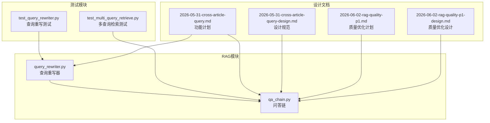
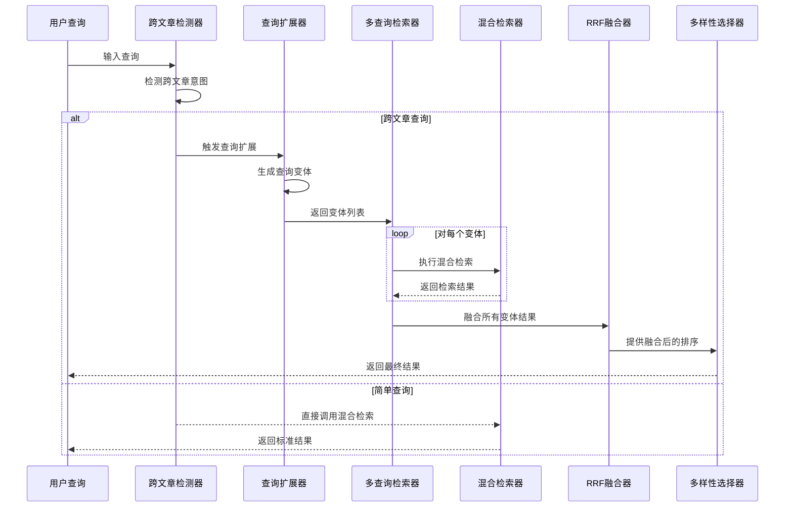
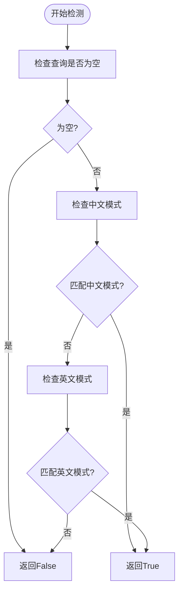
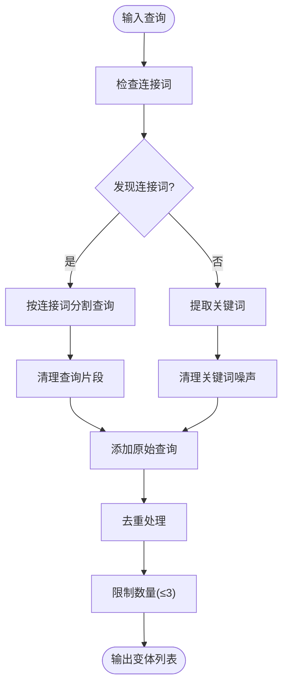
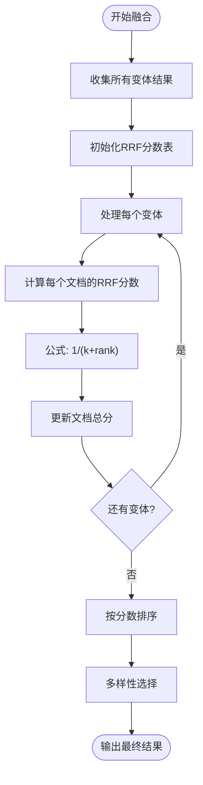
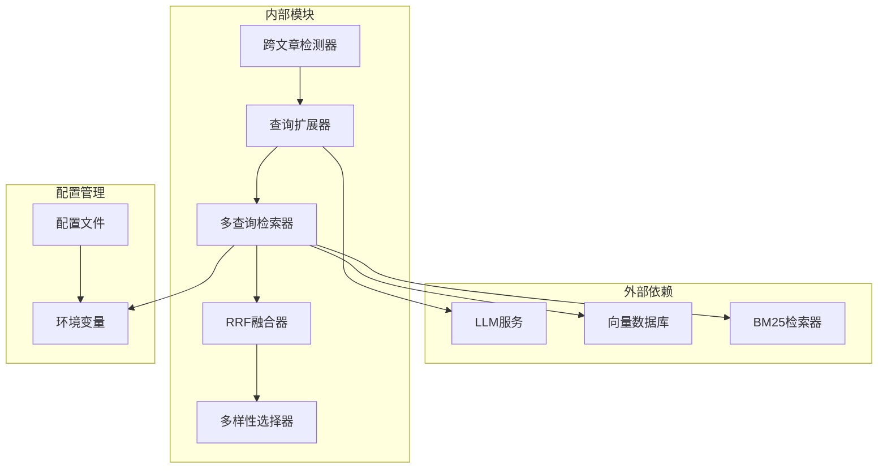

# 多查询扩展机制

<cite>
**本文档引用的文件**
- [query_rewriter.py](file://backend/app/rag/query_rewriter.py)
- [qa_chain.py](file://backend/app/rag/qa_chain.py)
- [test_query_rewriter.py](file://backend/tests/test_query_rewriter.py)
- [test_multi_query_retrieve.py](file://backend/tests/test_multi_query_retrieve.py)
- [2026-05-31-cross-article-query.md](file://docs/superpowers/plans/2026-05-31-cross-article-query.md)
- [2026-05-31-cross-article-query-design.md](file://docs/superpowers/specs/2026-05-31-cross-article-query-design.md)
- [2026-06-02-rag-quality-p1.md](file://docs/superpowers/plans/2026-06-02-rag-quality-p1.md)
- [2026-06-02-rag-quality-p1-design.md](file://docs/superpowers/specs/2026-06-02-rag-quality-p1-design.md)
- [recall-evaluation.md](file://docs/benchmarks/recall-evaluation.md)
- [rag-enterprise-analysis.md](file://docs/rag-enterprise-analysis.md)
</cite>

## 目录
1. [简介](#简介)
2. [项目结构](#项目结构)
3. [核心组件](#核心组件)
4. [架构概览](#架构概览)
5. [详细组件分析](#详细组件分析)
6. [依赖关系分析](#依赖关系分析)
7. [性能考虑](#性能考虑)
8. [故障排除指南](#故障排除指南)
9. [结论](#结论)
10. [附录](#附录)

## 简介

多查询扩展机制是本项目RAG系统中的一个关键增强功能，专门用于处理跨文章查询场景。该机制能够智能识别比较、对比、总结等类型的查询，并通过查询变体生成和多查询检索技术来提升检索质量和答案准确性。

该系统采用零成本的规则驱动方法进行跨文章意图检测，结合基于规则的查询扩展策略，实现了高效的多查询检索。通过递归秩次融合（RRF）算法对多个查询变体的结果进行融合，并采用多样性选择机制确保结果的丰富性和代表性。

## 项目结构

多查询扩展机制主要分布在以下文件中：

**图表来源**
- [query_rewriter.py:1-45](file://backend/app/rag/query_rewriter.py#L1-L45)
- [qa_chain.py:300-410](file://backend/app/rag/qa_chain.py#L300-L410)

**章节来源**
- [query_rewriter.py:1-45](file://backend/app/rag/query_rewriter.py#L1-L45)
- [qa_chain.py:300-410](file://backend/app/rag/qa_chain.py#L300-L410)

## 核心组件

多查询扩展机制包含以下核心组件：

### 1. 跨文章查询检测器
- **功能**：识别比较、对比、总结等跨文章查询意图
- **实现**：基于双语关键词匹配的零LLM成本检测
- **支持语言**：中文和英文
- **检测模式**：关键词模式匹配

### 2. 查询变体生成器
- **功能**：生成查询变体以覆盖不同的检索角度
- **策略**：基于规则的关键词提取和语义改写
- **数量控制**：最多3个变体，自动去重
- **质量保证**：保持原始查询意图不变

### 3. 多查询检索器
- **功能**：执行多查询检索并融合结果
- **算法**：递归秩次融合（RRF）
- **多样性**：按文章去重的选择机制
- **性能**：与简单查询路径零开销切换

### 4. 配置管理系统
- **功能**：动态控制多查询扩展行为
- **参数**：环境变量配置
- **回滚**：完全禁用功能的能力

**章节来源**
- [query_rewriter.py:152-237](file://backend/app/rag/query_rewriter.py#L152-L237)
- [qa_chain.py:300-410](file://backend/app/rag/qa_chain.py#L300-L410)

## 架构概览

多查询扩展机制的整体架构如下：

**图表来源**
- [qa_chain.py:300-410](file://backend/app/rag/qa_chain.py#L300-L410)
- [query_rewriter.py:175-221](file://backend/app/rag/query_rewriter.py#L175-L221)

## 详细组件分析

### 跨文章查询检测算法

#### 检测策略
系统采用基于关键词的零成本检测方法，通过预定义的关键词模式来识别跨文章查询意图：

**图表来源**
- [query_rewriter.py:152-172](file://backend/app/rag/query_rewriter.py#L152-L172)

#### 关键词模式配置
系统维护了针对不同语言的关键词模式：

| 语言 | 关键词类型 | 示例模式 |
|------|------------|----------|
| 中文 | 比较类 | 比较、对比、区别、差异 |
| 中文 | 总结类 | 共同点、相同、相似、类似 |
| 中文 | 跨文档类 | 两篇、多篇、哪些文章、所有文章 |
| 英文 | 比较类 | compare、comparison、difference |
| 英文 | 总结类 | common、commonalities、similarities |
| 英文 | 跨文档类 | across articles、all documents |

**章节来源**
- [query_rewriter.py:132-145](file://backend/app/rag/query_rewriter.py#L132-L145)

### 查询变体生成规则

#### 生成策略
查询变体生成采用多阶段策略，确保生成的变体既相关又多样化：

**图表来源**
- [query_rewriter.py:175-221](file://backend/app/rag/query_rewriter.py#L175-L221)

#### 连接词处理
系统支持多种语言的连接词标记：

| 语言 | 连接词类型 | 示例标记 |
|------|------------|----------|
| 中文 | 并列连词 | 和、与、以及 |
| 英文 | 并列连词 | and |
| 英文 | 对比连词 | vs、versus、compared to |
| 英文 | 比较连词 | compared with |

#### 关键词清理规则
为提高查询质量，系统实施了多层次的关键词清理：

**中文噪声词清理**：
- 助词：的、是什么、有哪些、方面
- 功能词：实现、性能、用法

**英文噪声词清理**：
- 冠词：the、a、an
- 介词：in、of、for、about
- 介词短语：regarding、in terms of

**章节来源**
- [query_rewriter.py:186-237](file://backend/app/rag/query_rewriter.py#L186-L237)

### 多查询检索实现

#### RRF融合算法
递归秩次融合（Reciprocal Rank Fusion）是多查询检索的核心算法：

**图表来源**
- [qa_chain.py:401-422](file://backend/app/rag/qa_chain.py#L401-L422)

#### RRF参数配置
- **k值**：默认200，可通过环境变量RRF_K调整
- **融合权重**：根据文档在各变体中的排名计算
- **稳定性**：较大的k值能更好地放大BM25的优势

#### 多样性选择机制
系统采用两阶段的多样性选择策略：

**第一阶段**：按文章去重
- 确保每个结果来自不同的文章
- 优先选择高质量的文档片段

**第二阶段**：填充剩余空间
- 当文章去重不足时，填充剩余位置
- 基于RRF分数进行排序

**章节来源**
- [qa_chain.py:424-442](file://backend/app/rag/qa_chain.py#L424-L442)

### 查询重写器（LLM增强版本）

除了基于规则的查询扩展外，系统还提供了基于LLM的查询重写能力：

#### 重写策略
- **语言规范化**：将口语化表达转换为书面语
- **指代消解**：扩展缩写和指代不明的内容
- **角度扩展**：生成2-3个不同角度的查询变体
- **意图保持**：严格保持原始查询的核心意图

#### 错误处理
系统实现了完善的错误处理机制：
- LLM服务不可用时自动回退到原始查询
- JSON解析失败时提供安全的默认行为
- 缺失关键字段时进行数据补全

**章节来源**
- [query_rewriter.py:25-43](file://backend/app/rag/query_rewriter.py#L25-L43)

## 依赖关系分析

多查询扩展机制的依赖关系如下：

**图表来源**
- [qa_chain.py:20-23](file://backend/app/rag/qa_chain.py#L20-L23)
- [query_rewriter.py:25-43](file://backend/app/rag/query_rewriter.py#L25-L43)

### 组件耦合度分析
- **低耦合设计**：各组件职责明确，接口清晰
- **可替换性**：查询扩展器支持规则和LLM两种实现
- **可配置性**：通过环境变量控制行为
- **向后兼容**：简单查询路径保持原有行为

**章节来源**
- [qa_chain.py:322-382](file://backend/app/rag/qa_chain.py#L322-L382)

## 性能考虑

### 性能基准
系统在性能方面进行了精心设计，确保零开销的简单查询路径：

| 组件 | 简单查询 | 跨文章查询 | 开销分析 |
|------|----------|------------|----------|
| 意图检测 | <1ms | <1ms | 基于字符串匹配 |
| 查询扩展 | 0ms | <1ms | 规则驱动 |
| 检索 | ~4ms | ~5ms | 并行BM25+向量 |
| RRF融合 | ~0.2ms | ~0.5ms | 数学运算 |
| **总计** | **~4ms** | **~6-8ms** | **简单查询零开销** |

### 性能优化策略

#### 1. 查询扩展优化
- **零LLM成本**：规则驱动的查询扩展
- **批量处理**：多个变体并行检索
- **结果缓存**：重复查询的缓存机制

#### 2. 检索优化
- **并行执行**：变体检索并行处理
- **结果截断**：每个变体使用top_k*2提高融合质量
- **早期终止**：空结果时快速返回

#### 3. 内存优化
- **流式处理**：避免大量中间结果存储
- **增量融合**：实时更新RRF分数
- **去重机制**：内存友好的去重策略

### 配置参数对性能的影响

#### 关键配置参数
| 参数名 | 默认值 | 影响范围 | 性能影响 |
|--------|--------|----------|----------|
| RRF_K | 200 | RRF融合 | k越大，BM25优势越明显 |
| MULTI_QUERY_ENABLED | true | 功能开关 | 控制是否启用多查询 |
| VECTOR_MAX_CONTRIB | 3 | 向量贡献 | 控制向量参与融合的数量 |
| VECTOR_CONFIDENCE_THRESHOLD | 0.60 | 向量质量 | 控制向量结果质量 |

**章节来源**
- [qa_chain.py:20-53](file://backend/app/rag/qa_chain.py#L20-L53)
- [2026-06-02-rag-quality-p1-design.md:68-72](file://docs/superpowers/specs/2026-06-02-rag-quality-p1-design.md#L68-L72)

## 故障排除指南

### 常见问题及解决方案

#### 1. 多查询功能未生效
**症状**：查询没有触发多查询扩展
**排查步骤**：
1. 检查MULTI_QUERY_ENABLED环境变量
2. 验证查询是否包含跨文章关键词
3. 确认hybrid_retrieve调用路径

**解决方案**：
- 设置MULTI_QUERY_ENABLED=true
- 使用包含"比较"、"对比"等关键词的查询
- 检查日志中的功能启用状态

#### 2. 查询扩展结果质量差
**症状**：生成的查询变体不够相关
**排查步骤**：
1. 检查关键词模式配置
2. 验证连接词分割逻辑
3. 确认去重和数量限制

**解决方案**：
- 调整关键词模式
- 优化连接词处理规则
- 增加变体数量限制

#### 3. RRF融合效果不佳
**症状**：融合后的结果排序不合理
**排查步骤**：
1. 检查RRF_K参数设置
2. 验证变体结果质量
3. 确认多样性选择逻辑

**解决方案**：
- 调整RRF_K值（建议100-300）
- 优化变体生成质量
- 调整多样性选择阈值

### 性能监控指标

#### 关键性能指标
- **延迟**：简单查询<4ms，跨文章查询<8ms
- **召回率**：Recall@3≥80%
- **精度**：Precision@3≥55%
- **吞吐量**：支持高并发查询

#### 监控建议
- 定期检查查询延迟分布
- 监控多查询启用率
- 跟踪结果质量指标变化

**章节来源**
- [test_multi_query_retrieve.py:280-354](file://backend/tests/test_multi_query_retrieve.py#L280-L354)

## 结论

多查询扩展机制为本项目的RAG系统带来了显著的功能增强。通过智能的跨文章查询检测、高效的查询变体生成和强大的RRF融合算法，系统能够在保持简单查询性能的同时，大幅提升跨文章查询的质量。

### 主要优势
1. **零成本检测**：基于规则的跨文章意图检测
2. **高效扩展**：规则驱动的查询变体生成
3. **稳定融合**：成熟的RRF融合算法
4. **多样选择**：确保结果的丰富性
5. **灵活配置**：支持运行时参数调整

### 技术创新
- **双语支持**：同时支持中文和英文查询
- **渐进式增强**：简单查询零开销，复杂查询智能增强
- **可回滚设计**：完全禁用功能不影响系统稳定性
- **性能优化**：精心设计的性能基准和优化策略

该机制为构建更智能、更准确的问答系统奠定了坚实基础，为后续的功能扩展和性能优化提供了良好的技术框架。

## 附录

### 配置选项参考

#### 环境变量配置
| 变量名 | 类型 | 默认值 | 描述 |
|--------|------|--------|------|
| MULTI_QUERY_ENABLED | 布尔值 | true | 是否启用多查询扩展 |
| RRF_K | 整数 | 200 | RRF融合参数k值 |
| VECTOR_MAX_CONTRIB | 整数 | 3 | 向量参与RRF的最大数量 |
| VECTOR_CONFIDENCE_THRESHOLD | 浮点数 | 0.60 | 向量结果的置信度阈值 |

#### 代码示例路径
- 跨文章查询检测：[query_rewriter.py:152-172](file://backend/app/rag/query_rewriter.py#L152-L172)
- 查询变体生成：[query_rewriter.py:175-221](file://backend/app/rag/query_rewriter.py#L175-L221)
- 多查询检索实现：[qa_chain.py:300-410](file://backend/app/rag/qa_chain.py#L300-L410)
- RRF融合算法：[qa_chain.py:401-422](file://backend/app/rag/qa_chain.py#L401-L422)