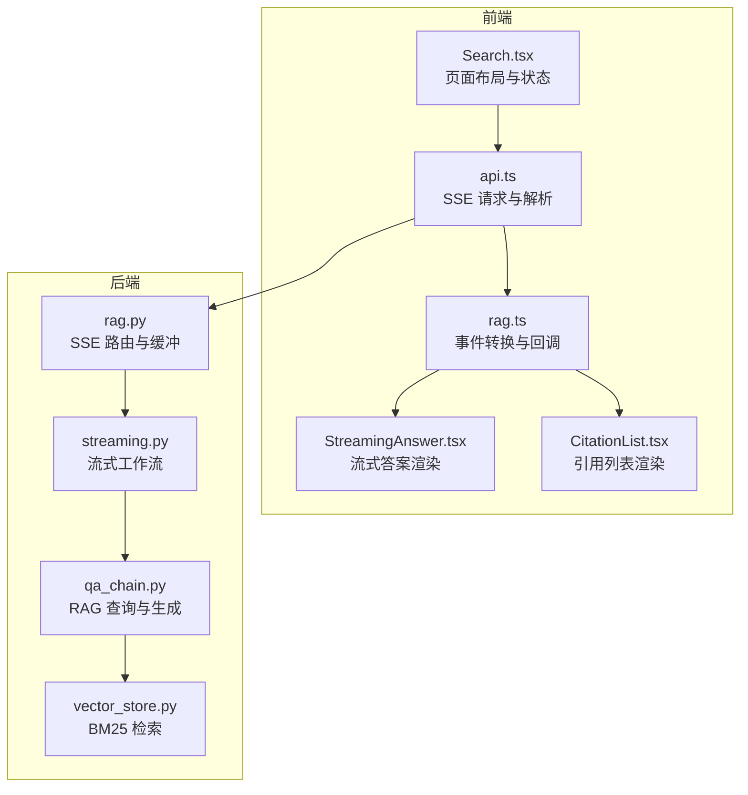
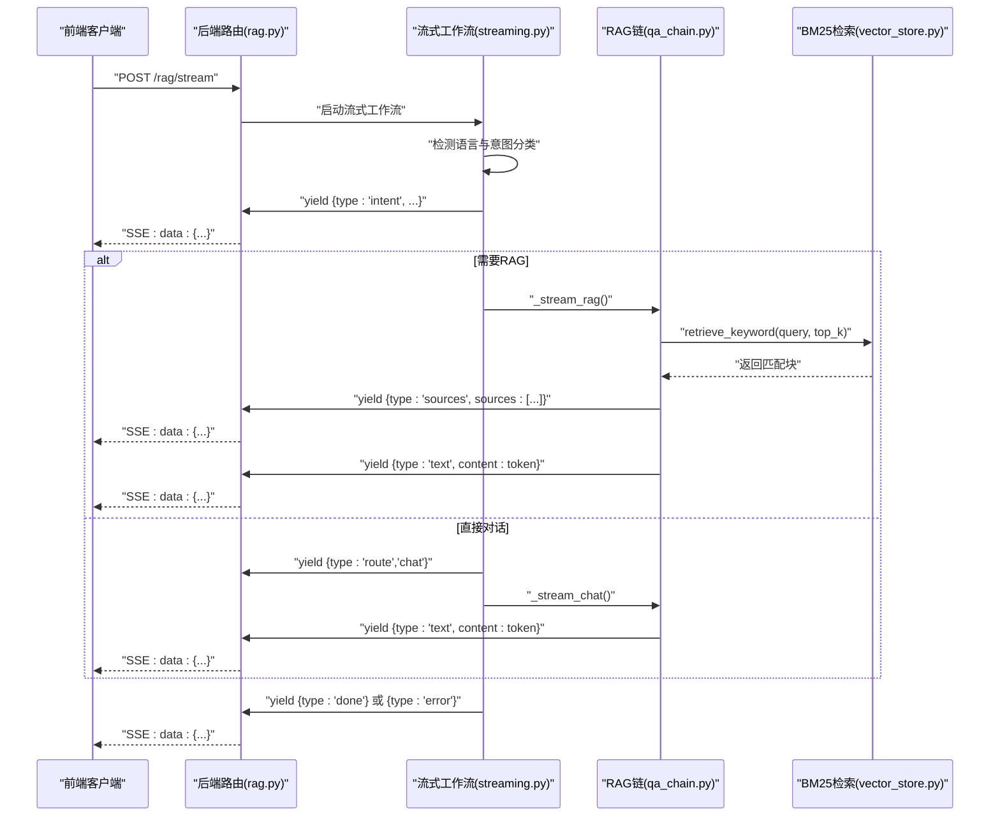
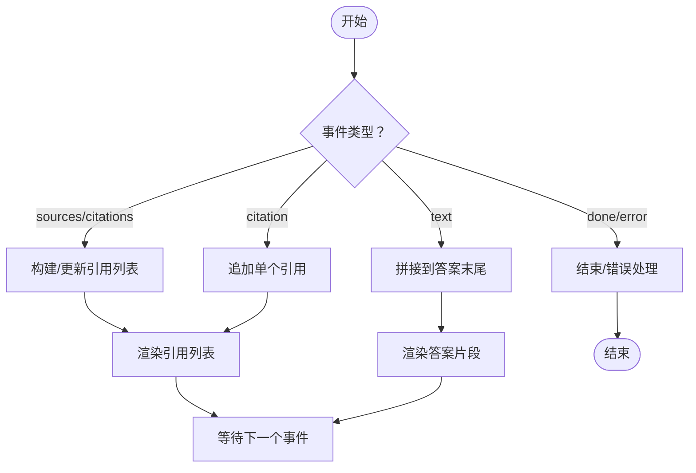
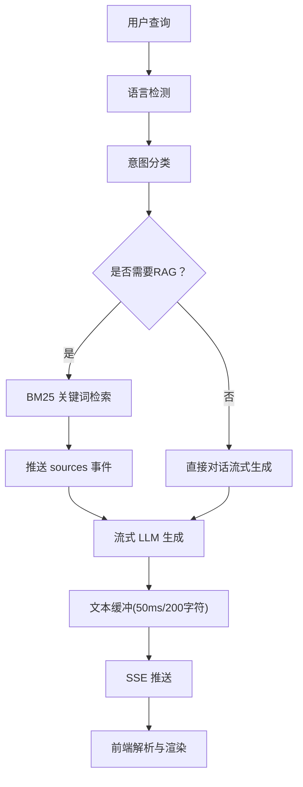
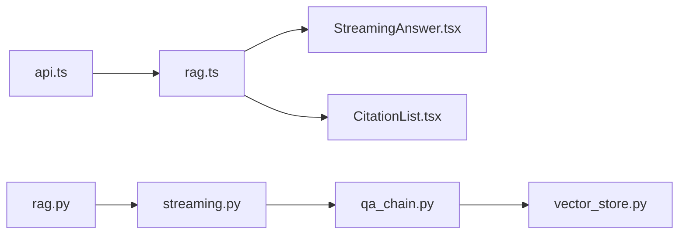

# 流式响应系统

<cite>
**本文档引用的文件**
- [api.ts](file://src/services/api.ts)
- [rag.ts](file://src/services/rag.ts)
- [StreamingAnswer.tsx](file://src/components/search/StreamingAnswer.tsx)
- [CitationList.tsx](file://src/components/search/CitationList.tsx)
- [Search.tsx](file://src/pages/Search.tsx)
- [streaming.py](file://backend/app/langgraph/streaming.py)
- [rag.py](file://backend/app/routers/rag.py)
- [qa_chain.py](file://backend/app/rag/qa_chain.py)
- [vector_store.py](file://backend/app/rag/vector_store.py)
- [test_streaming_workflow.py](file://backend/tests/test_streaming_workflow.py)
- [test_langgraph.py](file://backend/tests/test_langgraph.py)
</cite>

## 目录
1. [引言](#引言)
2. [项目结构](#项目结构)
3. [核心组件](#核心组件)
4. [架构总览](#架构总览)
5. [详细组件分析](#详细组件分析)
6. [依赖关系分析](#依赖关系分析)
7. [性能考虑](#性能考虑)
8. [故障排除指南](#故障排除指南)
9. [结论](#结论)
10. [附录](#附录)

## 引言
本技术文档围绕流式响应系统展开，重点阐述基于 SSE（Server-Sent Events）的实时数据传输机制、事件类型与消息格式规范、渐进式引用展示的实现原理，以及 BM25 快速检索与流式 LLM 令牌生成的协同优化策略。同时提供配置参数与前端集成指南，涵盖错误处理与连接恢复机制，帮助开发者快速理解并高效集成该系统。

## 项目结构
系统由前端 React 应用与后端 Python FastAPI 服务组成，前后端通过 SSE 协议进行流式通信。前端负责解析事件、渲染内容与引用列表；后端负责意图分类、RAG 检索、上下文格式化与流式 LLM 生成，并通过 SSE 输出标准化事件。

**图表来源**
- [api.ts:36-156](file://src/services/api.ts#L36-L156)
- [rag.ts:45-90](file://src/services/rag.ts#L45-L90)
- [StreamingAnswer.tsx:18-34](file://src/components/search/StreamingAnswer.tsx#L18-L34)
- [CitationList.tsx:13-37](file://src/components/search/CitationList.tsx#L13-L37)
- [Search.tsx:114-136](file://src/pages/Search.tsx#L114-L136)
- [streaming.py:15-60](file://backend/app/langgraph/streaming.py#L15-L60)
- [rag.py:142-175](file://backend/app/routers/rag.py#L142-L175)
- [qa_chain.py:653-666](file://backend/app/rag/qa_chain.py#L653-L666)
- [vector_store.py:203-235](file://backend/app/rag/vector_store.py#L203-L235)

**章节来源**
- [api.ts:36-156](file://src/services/api.ts#L36-L156)
- [Search.tsx:114-136](file://src/pages/Search.tsx#L114-L136)

## 核心组件
- 前端 SSE 客户端：负责建立 SSE 连接、解析 data 行、分发事件到渲染层与引用管理。
- 事件转换器：将后端事件映射为前端可消费的数据结构，支持 sources、citations、citation 等类型。
- 渲染组件：流式答案渲染与渐进式引用列表展示。
- 后端流式工作流：意图分类、RAG 检索、上下文格式化与流式 LLM 生成。
- SSE 路由与缓冲：统一输出标准化事件，控制首字节延迟与文本缓冲节奏。
- BM25 检索：基于关键词的快速检索，支撑极低 TTFT 的检索阶段。

**章节来源**
- [api.ts:36-156](file://src/services/api.ts#L36-L156)
- [rag.ts:45-90](file://src/services/rag.ts#L45-L90)
- [StreamingAnswer.tsx:18-34](file://src/components/search/StreamingAnswer.tsx#L18-L34)
- [CitationList.tsx:13-37](file://src/components/search/CitationList.tsx#L13-L37)
- [streaming.py:15-60](file://backend/app/langgraph/streaming.py#L15-L60)
- [rag.py:142-175](file://backend/app/routers/rag.py#L142-L175)
- [vector_store.py:203-235](file://backend/app/rag/vector_store.py#L203-L235)

## 架构总览
系统采用“前端 SSE 客户端 + 后端流式工作流”的解耦设计。后端按顺序产出标准化事件：intent、route、sources/citations、text、done/error，前端逐条消费并更新界面状态。

**图表来源**
- [rag.py:142-175](file://backend/app/routers/rag.py#L142-L175)
- [streaming.py:15-60](file://backend/app/langgraph/streaming.py#L15-L60)
- [qa_chain.py:653-666](file://backend/app/rag/qa_chain.py#L653-L666)
- [vector_store.py:203-235](file://backend/app/rag/vector_store.py#L203-L235)
- [api.ts:36-156](file://src/services/api.ts#L36-L156)

## 详细组件分析

### SSE 事件类型与消息格式规范
后端统一输出以下事件类型，前端按类型解析并更新界面：
- intent：包含意图与置信度，用于路由决策。
- route：指示后续路径（chat/rag/mixed）。
- sources/citations：一次性返回所有引用来源，包含标题、片段、评分等元信息。
- citation：单个引用来源的增量推送（可选）。
- text：流式 LLM 生成的令牌片段。
- done：会话结束信号。
- error：错误信息（已清洗，不暴露内部细节）。

前端解析规则：
- 从响应体读取字节流，按行解析，仅处理以 "data:" 开头的行。
- 将 data 后的内容解析为 JSON 对象，触发 onEvent 回调。
- 使用 pendingEvents 控制背压，避免 UI 渲染过载。

**章节来源**
- [api.ts:36-156](file://src/services/api.ts#L36-L156)
- [streaming.py:34-59](file://backend/app/langgraph/streaming.py#L34-L59)
- [rag.py:142-175](file://backend/app/routers/rag.py#L142-L175)

### 渐进式引用展示实现原理
- sources 事件：一次性推送全部引用，前端将其转换为 Citation 列表，供右侧栏展示。
- citation 事件：按来源逐个推送，前端将其合并到 Citation 列表中，实现“逐步显示引用来源”。
- 文本渲染：前端使用 Markdown 渲染引擎，将引用编号高亮显示，配合流式光标动画提示正在生成。

**图表来源**
- [rag.ts:45-90](file://src/services/rag.ts#L45-L90)
- [CitationList.tsx:13-37](file://src/components/search/CitationList.tsx#L13-L37)
- [StreamingAnswer.tsx:18-34](file://src/components/search/StreamingAnswer.tsx#L18-L34)

**章节来源**
- [rag.ts:45-90](file://src/services/rag.ts#L45-L90)
- [CitationList.tsx:13-37](file://src/components/search/CitationList.tsx#L13-L37)
- [StreamingAnswer.tsx:18-34](file://src/components/search/StreamingAnswer.tsx#L18-L34)

### 流式响应的性能优化策略
- BM25 快速检索：在检索阶段使用 BM25 关键词匹配，毫秒级 TTFT，显著降低首字节延迟。
- 文本缓冲策略：SSE 路由对 text 事件进行 50ms/200 字符的缓冲，首条文本立即刷新，保证流畅体验。
- 背压控制：前端维护 pendingEvents 计数，超过阈值时主动让出执行权，避免 UI 卡顿。
- 错误清洗：后端对异常信息进行清洗，避免泄露敏感信息，确保用户体验与安全。

**图表来源**
- [rag.py:142-175](file://backend/app/routers/rag.py#L142-L175)
- [vector_store.py:203-235](file://backend/app/rag/vector_store.py#L203-L235)
- [api.ts:57-94](file://src/services/api.ts#L57-L94)

**章节来源**
- [rag.py:142-175](file://backend/app/routers/rag.py#L142-L175)
- [vector_store.py:203-235](file://backend/app/rag/vector_store.py#L203-L235)
- [api.ts:57-94](file://src/services/api.ts#L57-L94)

### 配置参数与前端集成指南
- SSE 请求参数
  - 方法：POST
  - 路径：/rag/stream
  - 请求体：{ message, session_id }
  - 响应：SSE 流，逐行以 "data:" 开头的 JSON
- 前端集成步骤
  - 创建 AbortController 以支持取消请求
  - 使用 fetch 获取 ReadableStream 并获取 Reader
  - 解码字节流，按行解析，过滤 "data:" 行
  - 将事件分发给 onEvent 回调，驱动 UI 更新
  - 设置背压阈值，避免 UI 渲染过载
- 错误处理与连接恢复
  - 捕获 AbortError，优雅退出
  - 其他错误统一转为用户友好提示
  - 可在 UI 层实现自动重试与断线提示

**章节来源**
- [api.ts:36-156](file://src/services/api.ts#L36-L156)

### 后端路由与事件缓冲
- 路由层负责将流式生成器包装为 SSE，统一输出标准化事件
- 文本事件采用 50ms/200 字符缓冲策略，首条事件立即刷新，兼顾 TTFT 与吞吐
- 非文本事件（如 sources）会先刷新待缓冲文本，再透传

**章节来源**
- [rag.py:142-175](file://backend/app/routers/rag.py#L142-L175)

### 流式工作流与意图路由
- 工作流根据语言检测与意图分类决定路径
- RAG 路径：检索 → 上下文格式化 → 流式生成
- Chat 路径：直接流式生成
- 错误处理：捕获异常并输出清洗后的错误事件，最后发送 done

**章节来源**
- [streaming.py:15-60](file://backend/app/langgraph/streaming.py#L15-L60)

### RAG 查询与生成
- 当检索不到相关块时，直接返回“无相关内容”提示
- 生成阶段将上下文与查询结合，调用 LLM 进行回答
- 返回 sources 列表，包含标题、片段、评分等

**章节来源**
- [qa_chain.py:622-666](file://backend/app/rag/qa_chain.py#L622-L666)

### BM25 检索实现
- 构建词项频率与逆文档频率，计算 BM25+ 得分
- 使用 k1=1.2, b=0.75, δ=0.05 的参数，防止长文档被惩罚
- 通过上游分词与停用词过滤提升检索质量

**章节来源**
- [vector_store.py:203-235](file://backend/app/rag/vector_store.py#L203-L235)

## 依赖关系分析
- 前端依赖
  - api.ts 依赖 fetch 与 ReadableStream，负责 SSE 连接与解析
  - rag.ts 将后端事件转换为前端数据结构
  - StreamingAnswer.tsx 与 CitationList.tsx 负责渲染
- 后端依赖
  - streaming.py 依赖意图分类、RAG 链与语言检测
  - rag.py 提供 SSE 路由与事件缓冲
  - qa_chain.py 调用向量存储与 LLM
  - vector_store.py 提供 BM25 检索

**图表来源**
- [api.ts:36-156](file://src/services/api.ts#L36-L156)
- [rag.ts:45-90](file://src/services/rag.ts#L45-L90)
- [streaming.py:15-60](file://backend/app/langgraph/streaming.py#L15-L60)
- [rag.py:142-175](file://backend/app/routers/rag.py#L142-L175)
- [qa_chain.py:653-666](file://backend/app/rag/qa_chain.py#L653-L666)
- [vector_store.py:203-235](file://backend/app/rag/vector_store.py#L203-L235)

**章节来源**
- [api.ts:36-156](file://src/services/api.ts#L36-L156)
- [rag.ts:45-90](file://src/services/rag.ts#L45-L90)
- [streaming.py:15-60](file://backend/app/langgraph/streaming.py#L15-L60)
- [rag.py:142-175](file://backend/app/routers/rag.py#L142-L175)
- [qa_chain.py:653-666](file://backend/app/rag/qa_chain.py#L653-L666)
- [vector_store.py:203-235](file://backend/app/rag/vector_store.py#L203-L235)

## 性能考虑
- 检索阶段采用 BM25，TTFT 低于 10ms，显著降低感知延迟
- 文本事件缓冲策略在 50ms/200 字符之间平衡首字节与吞吐
- 前端背压控制避免 UI 渲染阻塞，保持交互流畅
- 建议在生产环境启用连接池与合理的超时设置，减少重复握手开销

## 故障排除指南
- SSE 连接失败
  - 检查后端路由是否正确返回 200 且 Content-Type 为 text/event-stream
  - 确认前端未提前 abort 请求
- 事件解析异常
  - 确保每行以 "data:" 开头，JSON 格式正确
  - 检查后端是否正确输出标准化事件
- 引用列表为空
  - 确认检索阶段返回了匹配块
  - 检查前端事件转换逻辑是否正确映射 sources/citations
- 错误信息显示敏感
  - 后端已清洗错误信息，前端无需二次处理
- 断线重连
  - 前端可基于 done/error 事件触发重试与提示

**章节来源**
- [api.ts:88-94](file://src/services/api.ts#L88-L94)
- [streaming.py:49-58](file://backend/app/langgraph/streaming.py#L49-L58)
- [test_streaming_workflow.py:113-125](file://backend/tests/test_streaming_workflow.py#L113-L125)
- [test_langgraph.py:116-131](file://backend/tests/test_langgraph.py#L116-L131)

## 结论
该流式响应系统通过 SSE 实现前后端解耦，借助 BM25 快速检索与文本缓冲策略，实现了低 TTFT 与高吞吐的用户体验。前端以事件驱动的方式渐进式展示答案与引用，后端提供标准化事件与错误清洗，整体具备良好的可扩展性与稳定性。

## 附录
- 事件类型对照
  - intent：意图与置信度
  - route：路由选择（chat/rag/mixed）
  - sources/citations：引用来源集合
  - citation：单个引用来源
  - text：流式文本片段
  - done/error：结束或错误