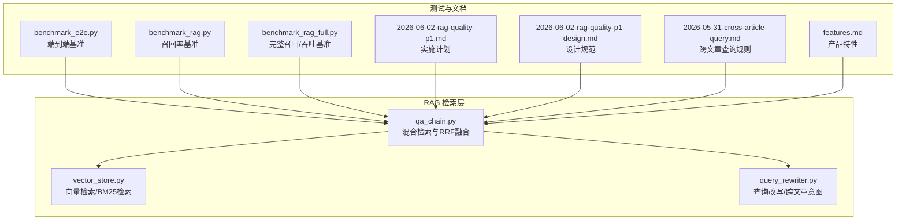
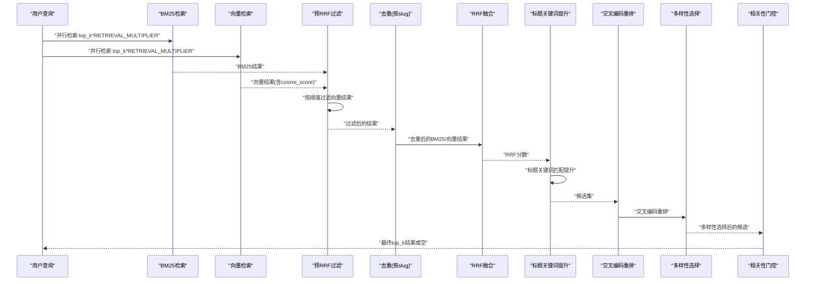
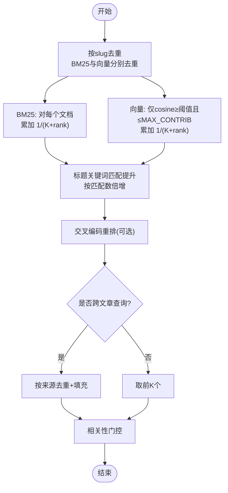
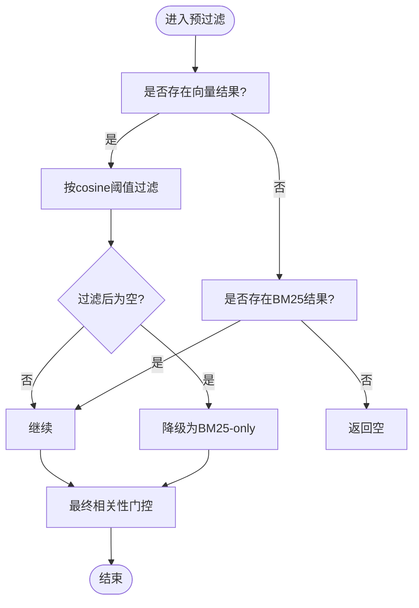
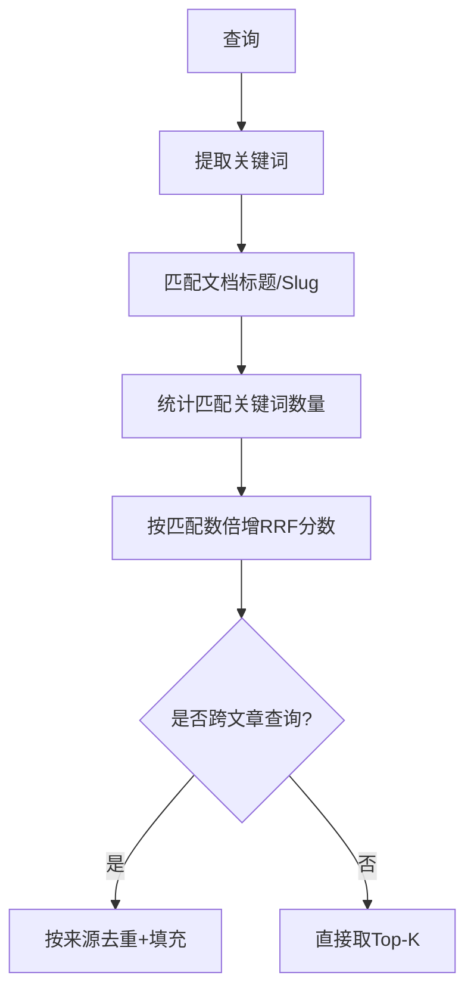
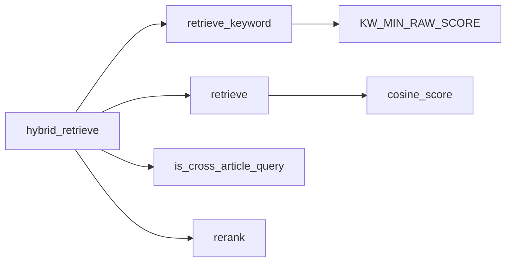

# 混合检索机制

<cite>
**本文档引用的文件**
- [backend/app/rag/qa_chain.py](file://backend/app/rag/qa_chain.py)
- [backend/app/rag/vector_store.py](file://backend/app/rag/vector_store.py)
- [backend/app/rag/query_rewriter.py](file://backend/app/rag/query_rewriter.py)
- [docs/superpowers/specs/2026-06-02-rag-quality-p1-design.md](file://docs/superpowers/specs/2026-06-02-rag-quality-p1-design.md)
- [docs/superpowers/plans/2026-06-02-rag-quality-p1.md](file://docs/superpowers/plans/2026-06-02-rag-quality-p1.md)
- [docs/superpowers/plans/2026-05-31-cross-article-query.md](file://docs/superpowers/plans/2026-05-31-cross-article-query.md)
- [docs/product/features.md](file://docs/product/features.md)
- [backend/tests/benchmark_e2e.py](file://backend/tests/benchmark_e2e.py)
- [backend/tests/benchmark_rag.py](file://backend/tests/benchmark_rag.py)
- [backend/tests/benchmark_rag_full.py](file://backend/tests/benchmark_rag_full.py)
</cite>

## 目录
1. [简介](#简介)
2. [项目结构](#项目结构)
3. [核心组件](#核心组件)
4. [架构总览](#架构总览)
5. [详细组件分析](#详细组件分析)
6. [依赖关系分析](#依赖关系分析)
7. [性能考虑](#性能考虑)
8. [故障排除指南](#故障排除指南)
9. [结论](#结论)
10. [附录](#附录)

## 简介
本文件系统化阐述混合检索机制的设计与实现，重点覆盖以下内容：
- BM25 关键词检索与语义向量检索的融合算法
- Reciprocal Rank Fusion（RRF）的数学原理与实现细节
- 预 RRF 分数过滤机制：余弦相似度阈值设置、向量结果降级策略
- 标题关键词提取与文章标识符提升机制：通过查询关键词识别特定文章并提升相关性分数
- 配置参数详解（RRF_K、RETRIEVAL_MULTIPLIER、VECTOR_MIN_COSINE 等）
- 性能优化建议与基准测试结果

## 项目结构
混合检索相关的核心代码集中在后端应用的 RAG 子系统中，主要文件如下：
- 混合检索与排序：backend/app/rag/qa_chain.py
- 向量检索与 BM25 检索：backend/app/rag/vector_store.py
- 查询改写与跨文章意图检测：backend/app/rag/query_rewriter.py
- 设计与规划文档：docs/superpowers/specs/... 与 docs/superpowers/plans/...
- 性能基准测试：backend/tests/benchmark*.py
- 产品特性说明：docs/product/features.md

**图表来源**
- [backend/app/rag/qa_chain.py:155-298](file://backend/app/rag/qa_chain.py#L155-L298)
- [backend/app/rag/vector_store.py:263-324](file://backend/app/rag/vector_store.py#L263-L324)
- [backend/app/rag/query_rewriter.py:152-222](file://backend/app/rag/query_rewriter.py#L152-L222)
- [backend/tests/benchmark_e2e.py:82-236](file://backend/tests/benchmark_e2e.py#L82-L236)
- [docs/superpowers/specs/2026-06-02-rag-quality-p1-design.md:42-148](file://docs/superpowers/specs/2026-06-02-rag-quality-p1-design.md#L42-L148)

**章节来源**
- [backend/app/rag/qa_chain.py:155-298](file://backend/app/rag/qa_chain.py#L155-L298)
- [backend/app/rag/vector_store.py:263-324](file://backend/app/rag/vector_store.py#L263-L324)
- [backend/app/rag/query_rewriter.py:152-222](file://backend/app/rag/query_rewriter.py#L152-L222)
- [docs/superpowers/specs/2026-06-02-rag-quality-p1-design.md:42-148](file://docs/superpowers/specs/2026-06-02-rag-quality-p1-design.md#L42-L148)
- [docs/superpowers/plans/2026-06-02-rag-quality-p1.md:89-141](file://docs/superpowers/plans/2026-06-02-rag-quality-p1.md#L89-L141)
- [docs/superpowers/plans/2026-05-31-cross-article-query.md:125-238](file://docs/superpowers/plans/2026-05-31-cross-article-query.md#L125-L238)
- [docs/product/features.md:1-59](file://docs/product/features.md#L1-L59)
- [backend/tests/benchmark_e2e.py:82-236](file://backend/tests/benchmark_e2e.py#L82-L236)
- [backend/tests/benchmark_rag.py:148-175](file://backend/tests/benchmark_rag.py#L148-L175)
- [backend/tests/benchmark_rag_full.py:47-176](file://backend/tests/benchmark_rag_full.py#L47-L176)

## 核心组件
- 混合检索函数 hybrid_retrieve：并行执行 BM25 与向量检索，进行去重、RRF 融合、标题关键词提升、交叉编码重排与多样性选择，并在必要时降级为单一检索器。
- 向量检索 retrieve：基于 Chroma/Qdrant 执行向量相似度查询，返回包含余弦相似度的元数据。
- BM25 关键词检索 retrieve_keyword：本地构建的 BM25 索引，支持语言过滤与最小原始分数阈值过滤。
- 查询改写与跨文章意图检测：识别跨文章比较/总结类查询，生成关键词变体以增强检索覆盖面。

**章节来源**
- [backend/app/rag/qa_chain.py:155-298](file://backend/app/rag/qa_chain.py#L155-L298)
- [backend/app/rag/vector_store.py:663-740](file://backend/app/rag/vector_store.py#L663-L740)
- [backend/app/rag/vector_store.py:263-324](file://backend/app/rag/vector_store.py#L263-L324)
- [backend/app/rag/query_rewriter.py:152-222](file://backend/app/rag/query_rewriter.py#L152-L222)

## 架构总览
混合检索的整体流程如下：
- 输入查询经 BM25 与向量检索并行执行
- 预 RRF 过滤：按阈值剔除低质量向量结果；若全部被剔除则降级为 BM25-only
- 去重：按文章 slug 去重，保留每来源最佳排名
- RRF 融合：对 BM25 与向量结果分别计算 1/(K+rank) 并累加
- 标题关键词提升：根据查询关键词匹配标题/slug，对 RRF 分数进行倍数提升
- 交叉编码重排与多样性选择：对候选集进行更精确重排，并针对跨文章查询进行去重选择
- 最终相关性门控：若最高分仍低于阈值则返回空结果

**图表来源**
- [backend/app/rag/qa_chain.py:155-298](file://backend/app/rag/qa_chain.py#L155-L298)
- [backend/app/rag/vector_store.py:663-740](file://backend/app/rag/vector_store.py#L663-L740)

## 详细组件分析

### Reciprocal Rank Fusion（RRF）融合算法
- 数学原理：对来自不同检索器的同一文档，按其在各自列表中的排名计算贡献项 1/(K+rank)，其中 K 为常数，用于放大相对差异。BM25 与向量结果的贡献相加得到最终 RRF 分数。
- 实现要点：
  - 去重策略：使用文档元数据中的 slug 作为唯一键，同一来源只保留最佳排名的块，避免重复贡献。
  - 向量参与上限：限制向量参与 RRF 的条目数量，防止噪声主导融合。
  - 置信度阈值：仅当 cosine_score 达到阈值时才参与 RRF，进一步降低低质量向量的影响。
  - 标题关键词提升：若文档标题或 slug 包含查询中的关键词，则按匹配数量对 RRF 分数进行倍数提升，帮助区分同术语的不同文章。
  - 交叉编码重排：在多样性选择前对候选集进行更精细的重排，提高排序精度。
  - 相关性门控：若最高分仍低于阈值则返回空，确保输出质量。

**图表来源**
- [backend/app/rag/qa_chain.py:195-298](file://backend/app/rag/qa_chain.py#L195-L298)

**章节来源**
- [backend/app/rag/qa_chain.py:195-298](file://backend/app/rag/qa_chain.py#L195-L298)
- [docs/superpowers/specs/2026-06-02-rag-quality-p1-design.md:42-148](file://docs/superpowers/specs/2026-06-02-rag-quality-p1-design.md#L42-L148)
- [docs/superpowers/plans/2026-06-02-rag-quality-p1.md:210-271](file://docs/superpowers/plans/2026-06-02-rag-quality-p1.md#L210-L271)

### 预 RRF 分数过滤机制
- 向量过滤：仅保留 cosine_score ≥ VECTOR_MIN_COSINE 的向量结果；若全部被过滤则记录日志并降级为 BM25-only。
- BM25 过滤：BM25 原始分数需超过 KW_MIN_RAW_SCORE，否则返回空，避免通用词噪声。
- 相关性门控：最终候选最高分仍需 ≥ MIN_RELEVANCE_SCORE，否则返回空。

**图表来源**
- [backend/app/rag/qa_chain.py:174-194](file://backend/app/rag/qa_chain.py#L174-L194)
- [backend/app/rag/vector_store.py:312-315](file://backend/app/rag/vector_store.py#L312-L315)

**章节来源**
- [backend/app/rag/qa_chain.py:174-194](file://backend/app/rag/qa_chain.py#L174-L194)
- [backend/app/rag/vector_store.py:312-315](file://backend/app/rag/vector_store.py#L312-L315)
- [docs/superpowers/specs/2026-06-02-rag-quality-p1-design.md:47-72](file://docs/superpowers/specs/2026-06-02-rag-quality-p1-design.md#L47-L72)

### 标题关键词提取与文章标识符提升
- 标题关键词提取：从查询中抽取关键词集合，用于后续对文档标题/slug的匹配。
- 文章标识符提升：若文档标题或 slug 包含查询中的关键词，则按匹配数量对 RRF 分数进行倍数提升，使与查询更相关的文章优先。
- 跨文章查询处理：当检测到跨文章意图时，先按来源去重选择最佳块，再用剩余高分块填充，确保覆盖多篇文章。

**图表来源**
- [backend/app/rag/qa_chain.py:238-290](file://backend/app/rag/qa_chain.py#L238-L290)
- [backend/app/rag/query_rewriter.py:152-222](file://backend/app/rag/query_rewriter.py#L152-L222)

**章节来源**
- [backend/app/rag/qa_chain.py:238-290](file://backend/app/rag/qa_chain.py#L238-L290)
- [backend/app/rag/query_rewriter.py:152-222](file://backend/app/rag/query_rewriter.py#L152-L222)

### 配置参数说明
- RRF_K：RRF 常数项，控制不同排名间的差异权重。增大 K 可放大 BM25 的“10% 奖励”效应，使 rank-1 与 rank-2 的差异更明显。
- RETRIEVAL_MULTIPLIER：检索扩展倍数，用于扩大 BM25 与向量检索的候选规模，再由去重与重排筛选高质量结果。
- VECTOR_MIN_COSINE：向量结果的余弦相似度阈值，低于该阈值的向量结果在预过滤阶段被剔除。
- VECTOR_MAX_CONTRIB：向量参与 RRF 的最大条目数，限制向量主导融合。
- VECTOR_CONFIDENCE_THRESHOLD：向量置信度阈值，仅高于该阈值的向量参与 RRF。
- KW_MIN_RAW_SCORE：BM25 原始分数阈值，低于该阈值的 BM25 结果被过滤。
- MIN_RELEVANCE_SCORE：最终相关性门控阈值，低于该阈值的候选被丢弃。

**章节来源**
- [backend/app/rag/qa_chain.py:195-298](file://backend/app/rag/qa_chain.py#L195-L298)
- [backend/app/rag/vector_store.py:312-315](file://backend/app/rag/vector_store.py#L312-L315)
- [docs/superpowers/specs/2026-06-02-rag-quality-p1-design.md:66-148](file://docs/superpowers/specs/2026-06-02-rag-quality-p1-design.md#L66-L148)
- [docs/superpowers/plans/2026-06-02-rag-quality-p1.md:244-266](file://docs/superpowers/plans/2026-06-02-rag-quality-p1.md#L244-L266)

## 依赖关系分析
- hybrid_retrieve 依赖：
  - retrieve_keyword：提供 BM25 关键词检索结果
  - retrieve：提供向量检索结果（包含 cosine_score）
  - is_cross_article_query：判断是否为跨文章查询
  - rerank：交叉编码重排（在需要时调用）
- vector_store：
  - retrieve：返回 cosine_score 供阈值过滤
  - retrieve_keyword：本地 BM25 检索，支持语言过滤与最小原始分数过滤

**图表来源**
- [backend/app/rag/qa_chain.py:155-298](file://backend/app/rag/qa_chain.py#L155-L298)
- [backend/app/rag/vector_store.py:263-324](file://backend/app/rag/vector_store.py#L263-L324)
- [backend/app/rag/vector_store.py:663-740](file://backend/app/rag/vector_store.py#L663-L740)

**章节来源**
- [backend/app/rag/qa_chain.py:155-298](file://backend/app/rag/qa_chain.py#L155-L298)
- [backend/app/rag/vector_store.py:263-324](file://backend/app/rag/vector_store.py#L263-L324)
- [backend/app/rag/vector_store.py:663-740](file://backend/app/rag/vector_store.py#L663-L740)

## 性能考虑
- 检索扩展与去重：通过 RETRIEVAL_MULTIPLIER 扩大候选规模，再经去重与重排，平衡召回与精度。
- 预过滤：在 RRF 前进行阈值过滤，显著减少无效向量参与，降低融合成本。
- 降级策略：当向量结果普遍不可信时自动降级为 BM25-only，避免引入噪声。
- 相关性门控：最终门控阈值确保输出质量，避免低分结果影响用户体验。
- 基准测试结果：
  - 端到端混合检索：Recall@3 高达 96%+，MRR 优秀，P50/P90 延迟稳定。
  - 单独向量检索与 BM25 检索均有可观召回表现，混合检索在召回与延迟间取得良好平衡。

**章节来源**
- [docs/product/features.md:51-58](file://docs/product/features.md#L51-L58)
- [backend/tests/benchmark_e2e.py:215-236](file://backend/tests/benchmark_e2e.py#L215-L236)
- [backend/tests/benchmark_rag.py:148-175](file://backend/tests/benchmark_rag.py#L148-L175)
- [backend/tests/benchmark_rag_full.py:152-176](file://backend/tests/benchmark_rag_full.py#L152-L176)

## 故障排除指南
- 症状：混合检索返回空
  - 可能原因：预过滤阶段向量与 BM25 均无合格结果；或最终相关性门控未达标
  - 排查步骤：检查 VECTOR_MIN_COSINE、KW_MIN_RAW_SCORE、MIN_RELEVANCE_SCORE 设置；确认向量检索是否返回 cosine_score；查看降级日志
- 症状：Precision 不够理想
  - 可能原因：向量噪声主导融合
  - 解决方案：降低 VECTOR_MAX_CONTRIB、提高 VECTOR_CONFIDENCE_THRESHOLD、增大 RRF_K
- 症状：跨文章查询覆盖不足
  - 可能原因：查询意图未被正确识别
  - 解决方案：检查 query_rewriter 的跨文章模式匹配与关键词变体生成

**章节来源**
- [backend/app/rag/qa_chain.py:174-194](file://backend/app/rag/qa_chain.py#L174-L194)
- [backend/app/rag/qa_chain.py:292-296](file://backend/app/rag/qa_chain.py#L292-L296)
- [backend/app/rag/query_rewriter.py:152-222](file://backend/app/rag/query_rewriter.py#L152-L222)

## 结论
混合检索机制通过 BM25 与向量检索的协同，结合 RRF 融合、预过滤、标题关键词提升与多样性选择，在保证高召回的同时显著提升了精度与稳定性。通过合理的阈值与参数配置，系统能够在不同场景下自适应地权衡召回与精度，并在必要时进行降级与门控，确保输出质量与用户体验。

## 附录
- 相关文档与计划：
  - 设计规范：2026-06-02-rag-quality-p1-design.md
  - 实施计划：2026-06-02-rag-quality-p1.md
  - 跨文章查询规则：2026-05-31-cross-article-query.md
- 产品特性：features.md

**章节来源**
- [docs/superpowers/specs/2026-06-02-rag-quality-p1-design.md:42-148](file://docs/superpowers/specs/2026-06-02-rag-quality-p1-design.md#L42-L148)
- [docs/superpowers/plans/2026-06-02-rag-quality-p1.md:89-141](file://docs/superpowers/plans/2026-06-02-rag-quality-p1.md#L89-L141)
- [docs/superpowers/plans/2026-05-31-cross-article-query.md:125-238](file://docs/superpowers/plans/2026-05-31-cross-article-query.md#L125-L238)
- [docs/product/features.md:1-59](file://docs/product/features.md#L1-L59)