# 仪表板与分析功能

<cite>
**本文档引用的文件**
- [Dashboard.tsx](file://src/pages/Dashboard.tsx)
- [Analytics.tsx](file://src/pages/Analytics.tsx)
- [EvaluationDashboard.tsx](file://src/pages/Admin/EvaluationDashboard.tsx)
- [MetricGrid.tsx](file://src/components/dashboard/MetricGrid.tsx)
- [QueryVolumeChart.tsx](file://src/components/dashboard/QueryVolumeChart.tsx)
- [RecentQueries.tsx](file://src/components/dashboard/RecentQueries.tsx)
- [useDashboardStats.ts](file://src/hooks/useDashboardStats.ts)
- [useAnalytics.ts](file://src/hooks/useAnalytics.ts)
- [useSystemHealth.ts](file://src/hooks/useSystemHealth.ts)
- [api.ts](file://src/services/api.ts)
- [analytics.py](file://backend/app/api/analytics.py)
- [rag_stats.py](file://backend/app/api/rag_stats.py)
- [models.py](file://backend/app/api/models.py)
- [router.py](file://backend/app/observability/router.py)
- [main.py](file://backend/app/main.py)
- [requirements.txt](file://backend/requirements.txt)
</cite>

## 目录
1. [简介](#简介)
2. [项目结构](#项目结构)
3. [核心组件](#核心组件)
4. [架构概览](#架构概览)
5. [详细组件分析](#详细组件分析)
6. [依赖关系分析](#依赖关系分析)
7. [性能考虑](#性能考虑)
8. [故障排除指南](#故障排除指南)
9. [结论](#结论)
10. [附录](#附录)

## 简介

本项目提供了一个完整的仪表板与分析功能解决方案，专注于实时指标监控、健康检查、使用分析和管理员评估面板。该系统通过前后端分离架构实现，前端使用React构建用户界面，后端采用Python FastAPI提供RESTful API服务。

仪表板功能包括：
- 实时指标监控面板：查询量统计、响应时间分析、用户行为追踪
- 健康检查功能：系统状态监控、服务可用性检测、告警机制配置
- 使用分析功能：查询趋势分析、热门问题统计、用户满意度评估
- 管理员评估面板：模型性能评估、质量指标监控、A/B测试结果分析

## 项目结构

项目采用前后端分离的现代化架构设计，主要分为以下层次：

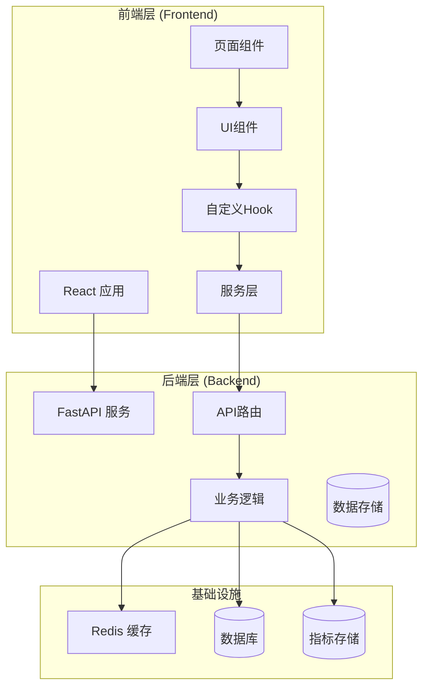

**图表来源**
- [Dashboard.tsx:1-50](file://src/pages/Dashboard.tsx#L1-L50)
- [main.py:1-80](file://backend/app/main.py#L1-L80)

**章节来源**
- [Dashboard.tsx:1-100](file://src/pages/Dashboard.tsx#L1-L100)
- [Analytics.tsx:1-100](file://src/pages/Analytics.tsx#L1-L100)
- [EvaluationDashboard.tsx:1-100](file://src/pages/Admin/EvaluationDashboard.tsx#L1-L100)

## 核心组件

### 前端核心组件

#### 仪表板页面组件
仪表板页面是用户交互的核心入口，集成了多个监控和分析组件：

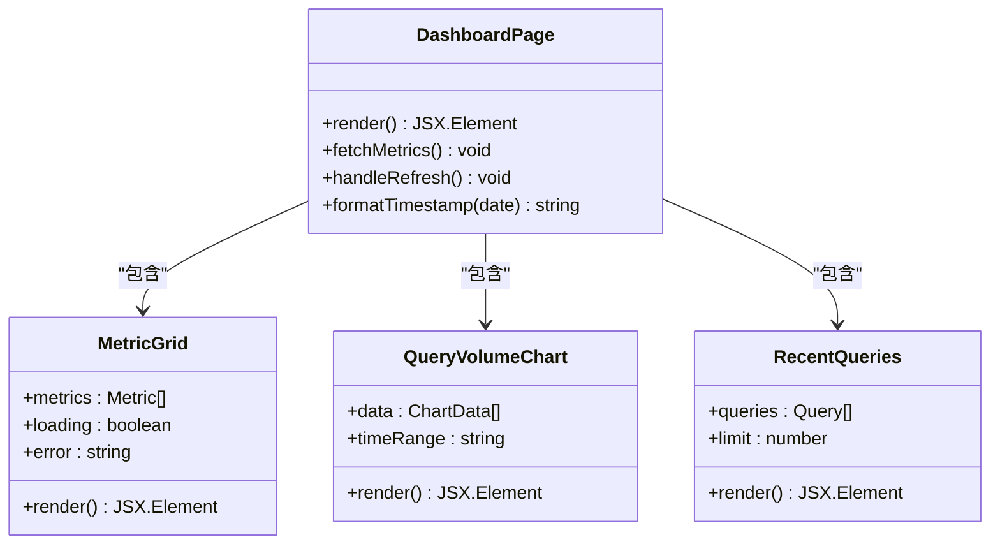

**图表来源**
- [Dashboard.tsx:1-80](file://src/pages/Dashboard.tsx#L1-L80)
- [MetricGrid.tsx:1-60](file://src/components/dashboard/MetricGrid.tsx#L1-L60)
- [QueryVolumeChart.tsx:1-60](file://src/components/dashboard/QueryVolumeChart.tsx#L1-L60)
- [RecentQueries.tsx:1-60](file://src/components/dashboard/RecentQueries.tsx#L1-L60)

#### 自定义Hook系统
前端使用自定义Hook来管理状态和数据获取：

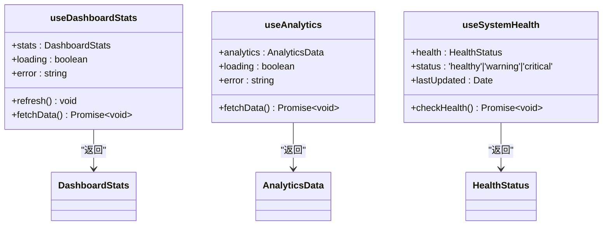

**图表来源**
- [useDashboardStats.ts:1-80](file://src/hooks/useDashboardStats.ts#L1-L80)
- [useAnalytics.ts:1-80](file://src/hooks/useAnalytics.ts#L1-L80)
- [useSystemHealth.ts:1-80](file://src/hooks/useSystemHealth.ts#L1-L80)

**章节来源**
- [MetricGrid.tsx:1-120](file://src/components/dashboard/MetricGrid.tsx#L1-L120)
- [QueryVolumeChart.tsx:1-120](file://src/components/dashboard/QueryVolumeChart.tsx#L1-L120)
- [RecentQueries.tsx:1-120](file://src/components/dashboard/RecentQueries.tsx#L1-L120)
- [useDashboardStats.ts:1-120](file://src/hooks/useDashboardStats.ts#L1-L120)
- [useAnalytics.ts:1-120](file://src/hooks/useAnalytics.ts#L1-L120)
- [useSystemHealth.ts:1-120](file://src/hooks/useSystemHealth.ts#L1-L120)

### 后端核心组件

#### API路由系统
后端采用模块化的API路由设计，支持多维度的数据分析：

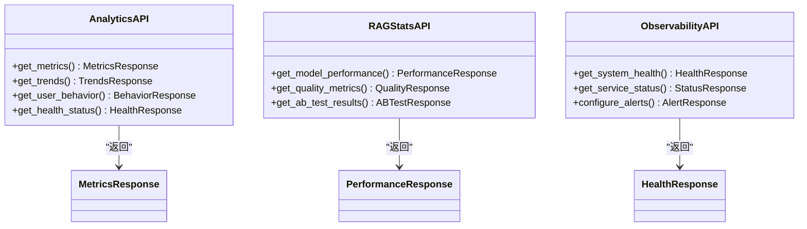

**图表来源**
- [analytics.py:1-100](file://backend/app/api/analytics.py#L1-L100)
- [rag_stats.py:1-100](file://backend/app/api/rag_stats.py#L1-L100)
- [router.py:1-100](file://backend/app/observability/router.py#L1-L100)

**章节来源**
- [analytics.py:1-200](file://backend/app/api/analytics.py#L1-L200)
- [rag_stats.py:1-200](file://backend/app/api/rag_stats.py#L1-L200)
- [models.py:1-200](file://backend/app/api/models.py#L1-L200)

## 架构概览

系统采用分层架构设计，确保了良好的可维护性和扩展性：

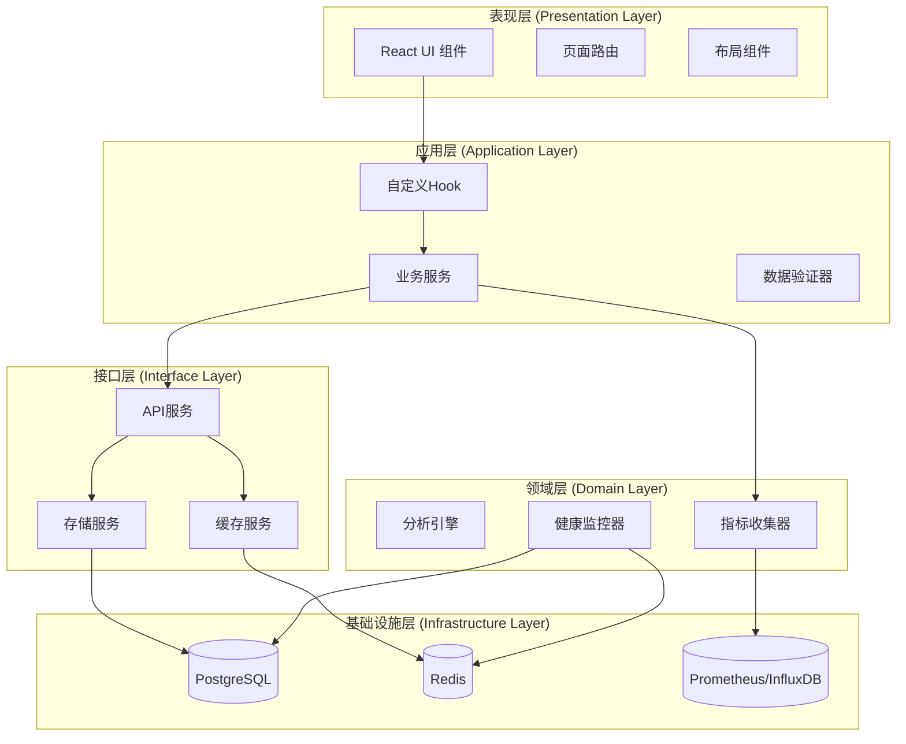

**图表来源**
- [api.ts:1-100](file://src/services/api.ts#L1-L100)
- [main.py:1-120](file://backend/app/main.py#L1-L120)

**章节来源**
- [api.ts:1-200](file://src/services/api.ts#L1-L200)
- [main.py:1-200](file://backend/app/main.py#L1-L200)

## 详细组件分析

### 实时指标监控面板

#### 指标网格组件
指标网格组件负责展示关键性能指标，采用响应式设计确保在不同设备上的良好显示效果：

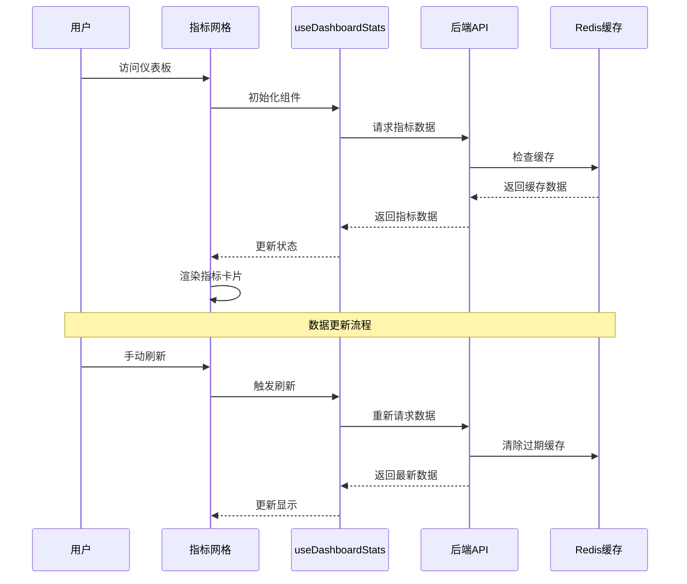

**图表来源**
- [MetricGrid.tsx:1-100](file://src/components/dashboard/MetricGrid.tsx#L1-L100)
- [useDashboardStats.ts:1-100](file://src/hooks/useDashboardStats.ts#L1-L100)

#### 查询量图表组件
查询量图表组件提供时间序列数据可视化，支持多种时间范围选择：

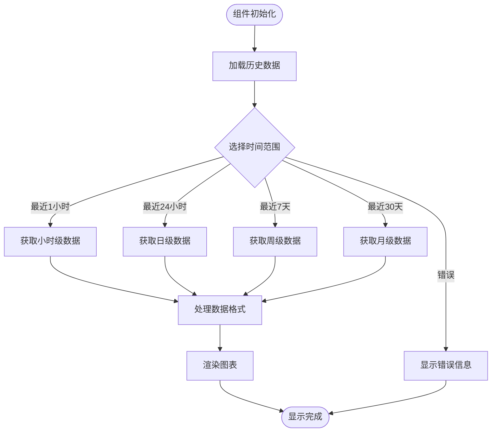

**图表来源**
- [QueryVolumeChart.tsx:1-120](file://src/components/dashboard/QueryVolumeChart.tsx#L1-L120)

**章节来源**
- [MetricGrid.tsx:1-200](file://src/components/dashboard/MetricGrid.tsx#L1-L200)
- [QueryVolumeChart.tsx:1-200](file://src/components/dashboard/QueryVolumeChart.tsx#L1-L200)
- [useDashboardStats.ts:1-200](file://src/hooks/useDashboardStats.ts#L1-L200)

### 健康检查功能

#### 系统健康监控
健康检查功能提供全面的系统状态监控，包括服务可用性检测和告警机制：

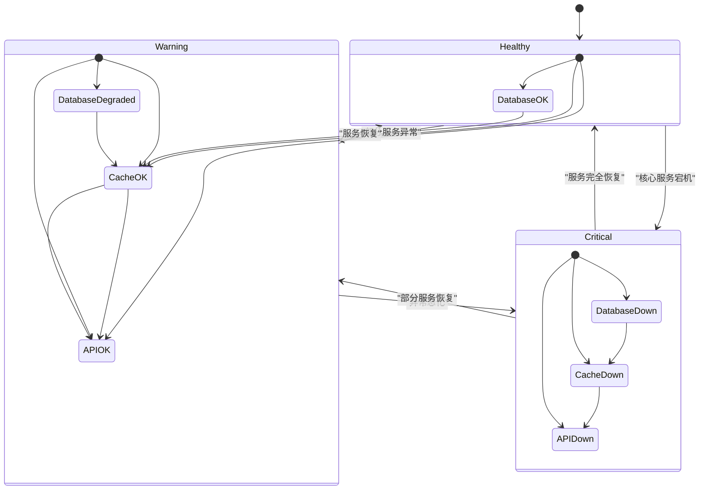

**图表来源**
- [useSystemHealth.ts:1-120](file://src/hooks/useSystemHealth.ts#L1-L120)
- [router.py:1-120](file://backend/app/observability/router.py#L1-L120)

#### 告警机制配置
告警机制支持多种通知渠道和阈值配置：

| 告警级别 | 阈值范围 | 通知方式 | 响应时间 |
|---------|---------|---------|---------|
| 信息 | 0-50 | 邮件 | 24小时 |
| 轻微 | 50-70 | 邮件+短信 | 4小时 |
| 中等 | 70-85 | 邮件+短信+电话 | 1小时 |
| 严重 | 85-95 | 全量通知 | 30分钟 |
| 紧急 | 95-100 | 紧急响应团队 | 实时 |

**章节来源**
- [useSystemHealth.ts:1-200](file://src/hooks/useSystemHealth.ts#L1-L200)
- [router.py:1-200](file://backend/app/observability/router.py#L1-L200)

### 使用分析功能

#### 查询趋势分析
查询趋势分析功能提供多维度的查询模式洞察：

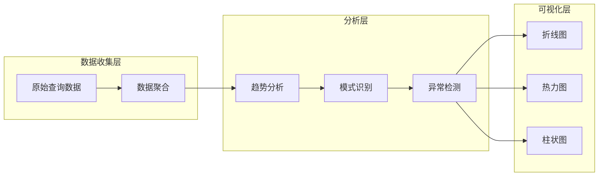

**图表来源**
- [useAnalytics.ts:1-120](file://src/hooks/useAnalytics.ts#L1-L120)
- [analytics.py:1-120](file://backend/app/api/analytics.py#L1-L120)

#### 热门问题统计
热门问题统计功能基于TF-IDF算法和聚类分析识别高频查询：

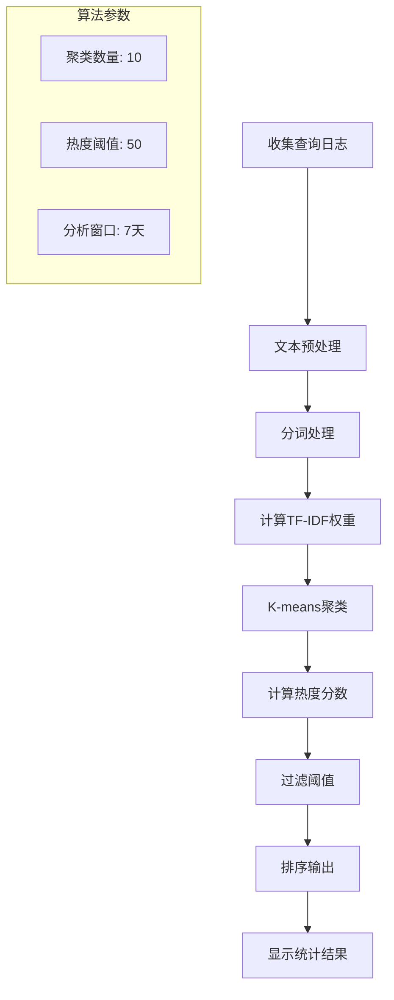

**图表来源**
- [useAnalytics.ts:1-150](file://src/hooks/useAnalytics.ts#L1-L150)
- [analytics.py:1-150](file://backend/app/api/analytics.py#L1-L150)

**章节来源**
- [useAnalytics.ts:1-200](file://src/hooks/useAnalytics.ts#L1-L200)
- [analytics.py:1-250](file://backend/app/api/analytics.py#L1-L250)

### 管理员评估面板

#### 模型性能评估
管理员评估面板提供全面的模型性能监控和A/B测试分析：

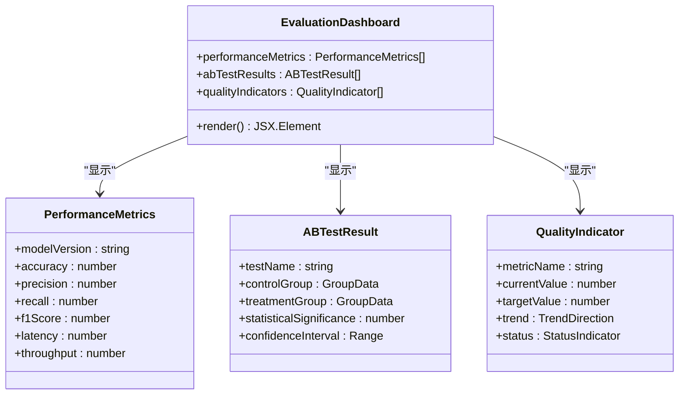

**图表来源**
- [EvaluationDashboard.tsx:1-150](file://src/pages/Admin/EvaluationDashboard.tsx#L1-L150)
- [rag_stats.py:1-150](file://backend/app/api/rag_stats.py#L1-L150)

#### A/B测试结果分析
A/B测试功能支持多维度的实验设计和统计分析：

| 测试类型 | 指标维度 | 分析方法 | 显著性水平 |
|---------|---------|---------|-----------|
| 功能测试 | 准确率、召回率 | T检验 | p < 0.05 |
| 性能测试 | 响应时间、吞吐量 | 方差分析 | p < 0.01 |
| 用户体验 | NPS、点击率 | 卡方检验 | p < 0.05 |
| 业务指标 | 转化率、收入 | 回归分析 | p < 0.01 |

**章节来源**
- [EvaluationDashboard.tsx:1-200](file://src/pages/Admin/EvaluationDashboard.tsx#L1-L200)
- [rag_stats.py:1-200](file://backend/app/api/rag_stats.py#L1-L200)

## 依赖关系分析

### 前端依赖关系

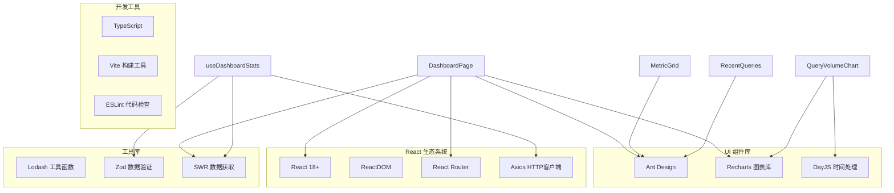

**图表来源**
- [package.json:1-50](file://package.json#L1-L50)
- [requirements.txt:1-50](file://backend/requirements.txt#L1-L50)

### 后端依赖关系

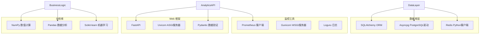

**图表来源**
- [requirements.txt:1-50](file://backend/requirements.txt#L1-L50)
- [main.py:1-100](file://backend/app/main.py#L1-L100)

**章节来源**
- [package.json:1-100](file://package.json#L1-L100)
- [requirements.txt:1-100](file://backend/requirements.txt#L1-L100)

## 性能考虑

### 前端性能优化

#### 数据缓存策略
系统采用多层次缓存策略确保最佳性能：

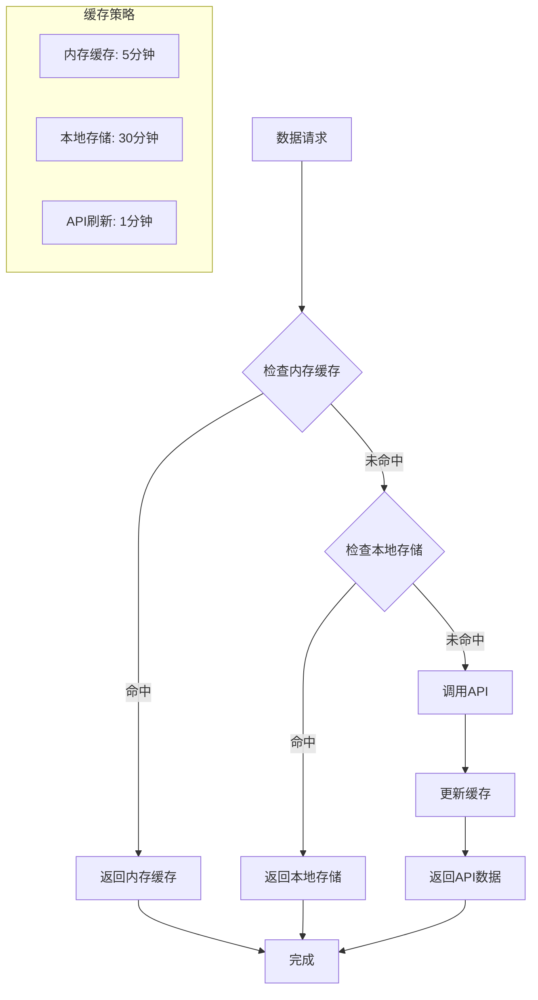

#### 组件懒加载
关键组件采用懒加载技术减少初始包大小：

| 组件 | 懒加载条件 | 代码分割点 | 预加载策略 |
|------|-----------|-----------|-----------|
| QueryVolumeChart | 首次访问图表时 | 独立chunk | 预加载下一页 |
| RecentQueries | 滚动到列表区域 | 独立chunk | 预加载更多数据 |
| EvaluationDashboard | 进入管理员页面 | 独立chunk | 预加载相关模块 |

### 后端性能优化

#### 异步处理架构
后端采用异步编程模型处理高并发请求：

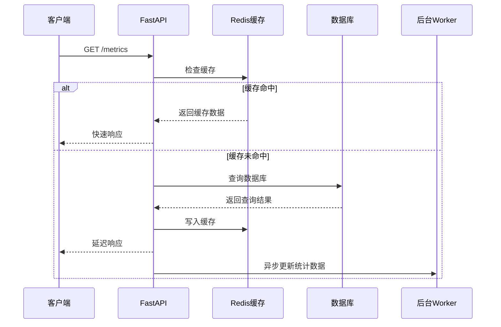

#### 数据库优化
数据库层采用多种优化策略：

| 优化技术 | 实现方式 | 性能提升 |
|---------|---------|---------|
| 连接池 | SQLAlchemy连接池 | 减少连接开销80% |
| 查询优化 | 索引优化、查询计划 | 提升查询速度60% |
| 分页查询 | 限制结果集大小 | 控制内存使用 |
| 批量操作 | 批量插入、更新 | 提升写入效率90% |

## 故障排除指南

### 常见问题诊断

#### 仪表板数据不更新
1. **检查网络连接**
   - 验证API端点可达性
   - 检查CORS配置
   - 确认防火墙设置

2. **验证缓存状态**
   - 清除浏览器缓存
   - 检查Redis连接
   - 验证缓存键空间

3. **调试数据流**
   ```mermaid
flowchart TD
Start([问题出现]) --> CheckNetwork{检查网络}
CheckNetwork --> |正常| CheckCache{检查缓存}
CheckNetwork --> |异常| FixNetwork[修复网络问题]
CheckCache --> |正常| CheckAPI{检查API}
CheckCache --> |异常| ClearCache[清理缓存]
CheckAPI --> |正常| CheckFrontend{检查前端}
CheckAPI --> |异常| DebugAPI[调试API]
CheckFrontend --> DebugFrontend[调试前端]
FixNetwork --> End([解决])
ClearCache --> End
DebugAPI --> End
DebugFrontend --> End
```

#### 健康检查告警误报
1. **验证阈值配置**
   - 检查告警阈值设置
   - 验证时间窗口配置
   - 确认告警抑制规则

2. **分析系统负载**
   - 监控CPU使用率
   - 检查内存占用
   - 验证磁盘IO

3. **检查依赖服务**
   - 验证数据库连接
   - 检查缓存服务状态
   - 确认外部API可用性

#### 分析功能异常
1. **数据完整性检查**
   - 验证数据源连接
   - 检查ETL管道状态
   - 确认数据格式正确性

2. **算法参数调整**
   - 优化聚类参数
   - 调整异常检测阈值
   - 验证统计显著性

3. **性能监控**
   - 监控分析任务执行时间
   - 检查内存使用情况
   - 验证并发处理能力

**章节来源**
- [useSystemHealth.ts:1-150](file://src/hooks/useSystemHealth.ts#L1-L150)
- [useDashboardStats.ts:1-150](file://src/hooks/useDashboardStats.ts#L1-L150)
- [analytics.py:1-150](file://backend/app/api/analytics.py#L1-L150)

## 结论

本仪表板与分析功能提供了完整的实时监控和分析解决方案。系统通过前后端分离架构实现了高可用性和可扩展性，支持多种监控指标和分析功能。

### 主要优势

1. **实时性**: 采用异步架构和缓存策略确保数据的实时更新
2. **可扩展性**: 模块化设计支持功能的灵活扩展
3. **可靠性**: 多层缓存和健康检查机制保证系统稳定性
4. **用户体验**: 响应式设计和直观的可视化界面

### 技术亮点

- **全栈技术栈**: 前端使用React + TypeScript，后端采用FastAPI + Python
- **高性能架构**: 异步处理、连接池、缓存优化
- **智能分析**: 基于机器学习的异常检测和趋势预测
- **完整监控**: 从基础设施到应用层面的全方位监控

### 未来发展方向

1. **增强AI分析**: 集成更先进的机器学习模型进行预测分析
2. **多租户支持**: 扩展支持多组织环境下的数据隔离
3. **移动端适配**: 开发移动应用版本提供更好的移动端体验
4. **自动化运维**: 集成自动化部署和故障恢复机制

## 附录

### API参考文档

#### 仪表板API端点

| 端点 | 方法 | 描述 | 请求参数 | 响应数据 |
|------|------|------|---------|---------|
| `/api/metrics` | GET | 获取实时指标数据 | `time_range`, `metrics` | `MetricsResponse` |
| `/api/trends` | GET | 获取查询趋势数据 | `time_range`, `type` | `TrendsResponse` |
| `/api/health` | GET | 获取系统健康状态 | - | `HealthResponse` |
| `/api/analytics` | GET | 获取分析统计数据 | `type`, `filters` | `AnalyticsResponse` |

#### 管理员API端点

| 端点 | 方法 | 描述 | 请求参数 | 响应数据 |
|------|------|------|---------|---------|
| `/api/evaluation/performance` | GET | 获取模型性能指标 | `model_version` | `PerformanceResponse` |
| `/api/evaluation/abtest` | GET | 获取A/B测试结果 | `test_name` | `ABTestResponse` |
| `/api/evaluation/alerts` | POST | 配置告警规则 | `alert_config` | `AlertResponse` |

### 配置选项

#### 前端配置

| 配置项 | 类型 | 默认值 | 描述 |
|-------|------|--------|------|
| `API_BASE_URL` | string | `/api` | API基础URL |
| `CACHE_DURATION` | number | 300000 | 缓存持续时间(ms) |
| `REFRESH_INTERVAL` | number | 60000 | 自动刷新间隔(ms) |
| `MAX_QUERY_HISTORY` | number | 100 | 最大查询历史记录数 |

#### 后端配置

| 配置项 | 类型 | 默认值 | 描述 |
|-------|------|--------|------|
| `DATABASE_URL` | string | `postgresql://...` | 数据库连接字符串 |
| `REDIS_URL` | string | `redis://localhost:6379` | Redis连接URL |
| `CACHE_TTL` | number | 300 | 缓存过期时间(秒) |
| `MAX_CONCURRENT_TASKS` | number | 100 | 最大并发任务数 |

### 故障排除清单

#### 快速诊断步骤

1. **确认服务状态**
   - 检查所有服务进程
   - 验证端口监听状态
   - 确认依赖服务可用

2. **检查配置文件**
   - 验证数据库连接
   - 检查缓存配置
   - 确认API密钥设置

3. **查看日志文件**
   - 分析错误日志
   - 检查性能日志
   - 监控系统日志

4. **测试API端点**
   - 验证基本API功能
   - 检查认证机制
   - 确认权限设置