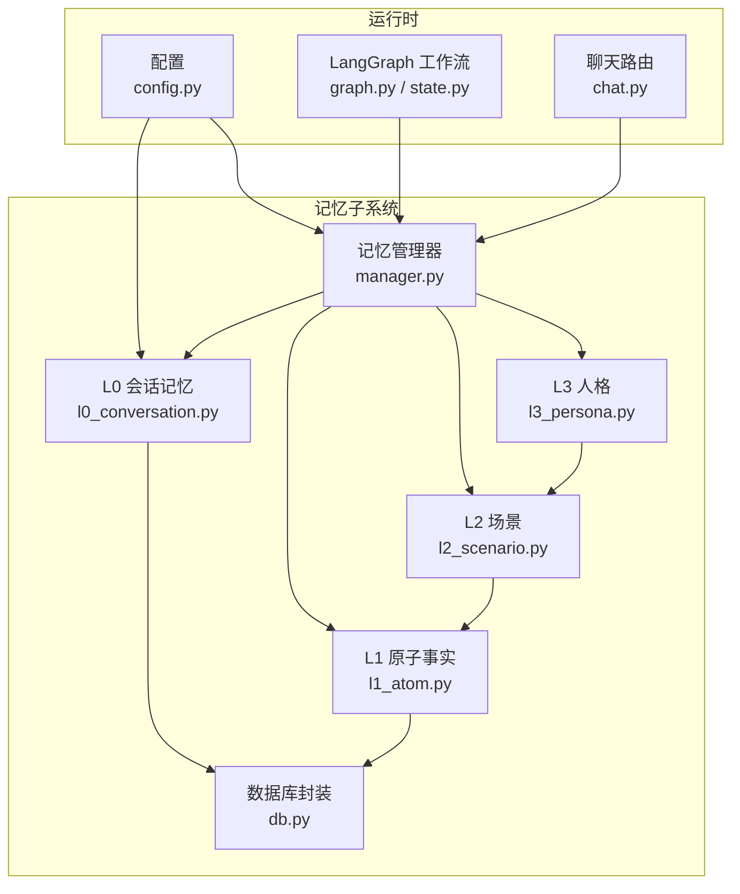
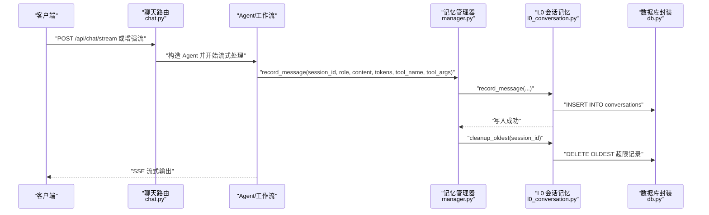
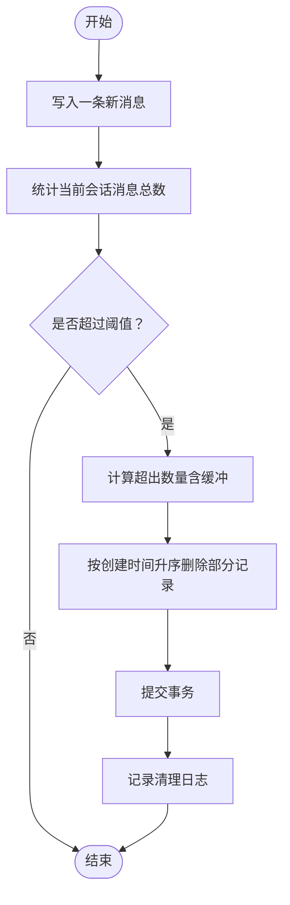
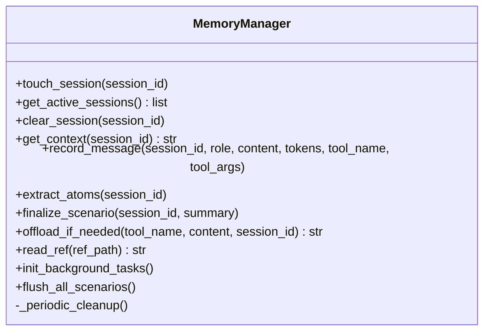
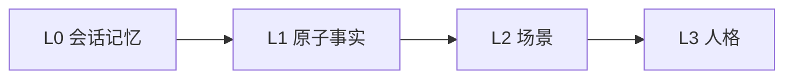
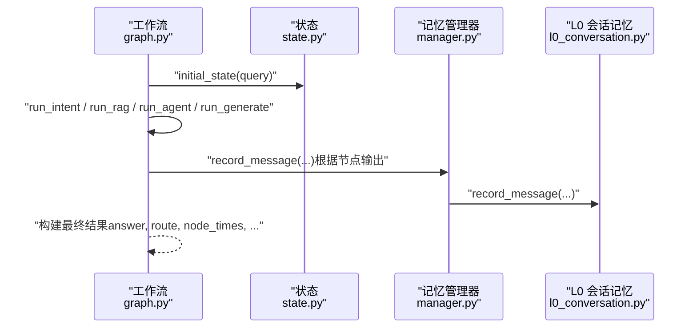
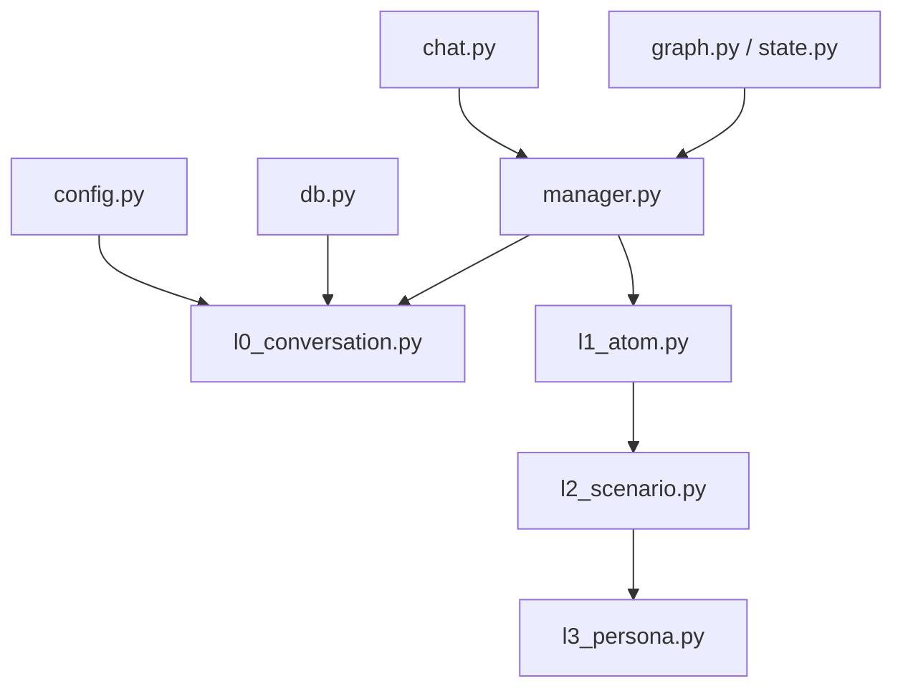

# L0 会话记忆

<cite>
**本文引用的文件**
- [l0_conversation.py](file://backend/app/memory/l0_conversation.py)
- [manager.py](file://backend/app/memory/manager.py)
- [db.py](file://backend/app/memory/db.py)
- [l1_atom.py](file://backend/app/memory/l1_atom.py)
- [l2_scenario.py](file://backend/app/memory/l2_scenario.py)
- [l3_persona.py](file://backend/app/memory/l3_persona.py)
- [config.py](file://backend/app/config.py)
- [graph.py](file://backend/app/langgraph/graph.py)
- [state.py](file://backend/app/langgraph/state.py)
- [chat.py](file://backend/app/routers/chat.py)
- [test_memory.py](file://backend/tests/test_memory.py)
</cite>

## 目录
1. [引言](#引言)
2. [项目结构](#项目结构)
3. [核心组件](#核心组件)
4. [架构总览](#架构总览)
5. [详细组件分析](#详细组件分析)
6. [依赖分析](#依赖分析)
7. [性能考虑](#性能考虑)
8. [故障排查指南](#故障排查指南)
9. [结论](#结论)
10. [附录](#附录)

## 引言
本文件面向“L0 会话记忆”这一最基础的记忆层级，系统性阐述其设计理念与实现细节。L0 会话记忆负责捕获与存储用户的实时对话内容，包括用户消息、AI 回复、工具调用等不同角色的消息，并通过统一的清理策略维持会话规模的可控性。同时，L0 记忆与上层 L1 原子事实、L2 场景与 L3 人格形成递进式协作，支撑更高级别的上下文构建与长期记忆沉淀。

## 项目结构
围绕 L0 会话记忆的相关模块分布如下：
- 存储层：SQLite 数据库封装与表结构初始化
- L0 层：消息记录、读取、按时间清理
- 管理器：会话生命周期管理、跨层级联动
- 上层记忆：原子事实抽取、场景化总结、人格沉淀
- 配置：会话最大消息数等参数
- LangGraph 工作流：在多节点执行中复用会话状态
- API 路由：对外提供聊天接口，驱动会话记忆写入与清理

图表来源
- [db.py:15-63](file://backend/app/memory/db.py#L15-L63)
- [l0_conversation.py:8-65](file://backend/app/memory/l0_conversation.py#L8-L65)
- [manager.py:20-130](file://backend/app/memory/manager.py#L20-L130)
- [l1_atom.py:9-98](file://backend/app/memory/l1_atom.py#L9-L98)
- [l2_scenario.py:18-94](file://backend/app/memory/l2_scenario.py#L18-L94)
- [l3_persona.py:11-44](file://backend/app/memory/l3_persona.py#L11-L44)
- [config.py:48-49](file://backend/app/config.py#L48-L49)
- [graph.py:43-163](file://backend/app/langgraph/graph.py#L43-L163)
- [state.py:6-47](file://backend/app/langgraph/state.py#L6-L47)
- [chat.py:46-107](file://backend/app/routers/chat.py#L46-L107)

章节来源
- [db.py:15-63](file://backend/app/memory/db.py#L15-L63)
- [l0_conversation.py:8-65](file://backend/app/memory/l0_conversation.py#L8-L65)
- [manager.py:20-130](file://backend/app/memory/manager.py#L20-L130)
- [config.py:48-49](file://backend/app/config.py#L48-L49)
- [chat.py:46-107](file://backend/app/routers/chat.py#L46-L107)

## 核心组件
- L0 会话记忆（消息记录与清理）
  - 记录消息：支持角色、内容、token 数量、工具名与参数
  - 获取会话：按时间倒序返回最近 N 条消息
  - 清理策略：超过阈值时删除最早的消息
- 记忆管理器（会话生命周期与跨层级联动）
  - 触活会话：每次消息写入后更新活跃时间
  - 自动终结：空闲超时自动终结当前会话
  - 跨层级：写入 L0 后触发 L1 原子抽取、L2 场景与 L3 人格更新
- 数据库封装（线程安全连接与表初始化）
  - 线程本地连接、WAL 模式、busy_timeout
  - 初始化 conversations、atoms 表及索引
- 上层记忆（L1/L2/L3）
  - L1：原子事实保存与全文检索
  - L2：场景化总结文件生成与清理
  - L3：基于场景的人格摘要文件生成
- 配置（会话上限）
  - session_max_messages 控制 L0 清理阈值
- LangGraph 工作流（状态与路由）
  - 在多节点执行中复用会话状态，驱动记忆写入与清理
- API 路由（对外接口）
  - 提供聊天流式接口，内部委托记忆管理器完成会话写入与清理

章节来源
- [l0_conversation.py:8-65](file://backend/app/memory/l0_conversation.py#L8-L65)
- [manager.py:20-130](file://backend/app/memory/manager.py#L20-L130)
- [db.py:15-63](file://backend/app/memory/db.py#L15-L63)
- [l1_atom.py:9-98](file://backend/app/memory/l1_atom.py#L9-L98)
- [l2_scenario.py:18-94](file://backend/app/memory/l2_scenario.py#L18-L94)
- [l3_persona.py:11-44](file://backend/app/memory/l3_persona.py#L11-L44)
- [config.py:48-49](file://backend/app/config.py#L48-L49)
- [graph.py:43-163](file://backend/app/langgraph/graph.py#L43-L163)
- [state.py:6-47](file://backend/app/langgraph/state.py#L6-L47)
- [chat.py:46-107](file://backend/app/routers/chat.py#L46-L107)

## 架构总览
L0 会话记忆是整个记忆体系的“数据入口”。所有用户与系统的交互以消息形式进入 L0；随后由管理器协调上层记忆进行抽取与沉淀；在 LangGraph 工作流中，会话状态贯穿各节点，确保上下文一致性。

图表来源
- [chat.py:46-93](file://backend/app/routers/chat.py#L46-L93)
- [manager.py:54-58](file://backend/app/memory/manager.py#L54-L58)
- [l0_conversation.py:8-25](file://backend/app/memory/l0_conversation.py#L8-L25)
- [l0_conversation.py:47-65](file://backend/app/memory/l0_conversation.py#L47-L65)
- [db.py:15-32](file://backend/app/memory/db.py#L15-L32)

## 详细组件分析

### L0 会话记忆：消息记录与清理
- 设计理念
  - 最小可用：仅记录会话标识、角色、内容、token、工具信息与时间戳
  - 实时性：每条消息即时落库，保证会话可追溯
  - 可控性：通过清理策略限制会话长度，避免无限增长
- 关键函数
  - 记录消息：写入 conversations 表
  - 获取会话：按 created_at 倒序返回最近 N 条
  - 按时间清理：删除最早的部分记录，保留一定冗余缓冲
- 存储结构
  - 表：conversations（自增主键、会话标识、角色、内容、token、工具名/参数、时间戳）
  - 索引：按 session_id 建立索引，加速查询与清理
- 生命周期控制
  - 写入即清理：每次写入后立即检查并清理过量消息
  - 缓冲策略：删除数量略高于阈值，避免频繁触发清理

图表来源
- [l0_conversation.py:47-65](file://backend/app/memory/l0_conversation.py#L47-L65)
- [db.py:35-61](file://backend/app/memory/db.py#L35-L61)

章节来源
- [l0_conversation.py:8-65](file://backend/app/memory/l0_conversation.py#L8-L65)
- [db.py:35-61](file://backend/app/memory/db.py#L35-L61)

### 记忆管理器：会话生命周期与跨层级联动
- 会话生命周期
  - 触活：每次消息写入后更新最后活跃时间
  - 列表：提供活跃会话清单
  - 清除：手动删除或自动终结后移除
- 跨层级联动
  - 写入 L0 后触发清理
  - 定期检查空闲会话并自动终结
  - 将关键信息抽取到 L1 原子事实
  - 结束时生成 L2 场景与更新 L3 人格
- 背景任务
  - 周期性清理：检测空闲超时的会话并终结
  - 重启保护：异常取消后自动重启任务

图表来源
- [manager.py:20-130](file://backend/app/memory/manager.py#L20-L130)

章节来源
- [manager.py:20-130](file://backend/app/memory/manager.py#L20-L130)

### 数据库封装：线程安全与表初始化
- 连接模型
  - 线程本地连接：每个线程独立连接，避免跨线程共享
  - WAL 模式：允许多连接并发读取
  - busy_timeout：缓解写入竞争
- 表与索引
  - conversations：会话消息表
  - atoms：原子事实表（L1）
  - 索引：按 session_id 建立索引
- 初始化脚本
  - 创建表与索引
  - 保证数据库可用性

章节来源
- [db.py:15-63](file://backend/app/memory/db.py#L15-L63)

### 上层记忆：L1/L2/L3 的协作关系
- L1 原子事实
  - 从最近用户消息中抽取三元组（主体、谓语、客体），并持久化
  - 支持 FTS5 全文检索与回退方案
- L2 场景
  - 会话结束后生成 Markdown 场景文件，包含摘要与关键事实
  - 限制文件数量，定期清理旧文件
- L3 人格
  - 基于近期场景与原子事实生成人格摘要文件
  - 限制大小，避免过大

图表来源
- [l1_atom.py:9-98](file://backend/app/memory/l1_atom.py#L9-L98)
- [l2_scenario.py:35-66](file://backend/app/memory/l2_scenario.py#L35-L66)
- [l3_persona.py:11-44](file://backend/app/memory/l3_persona.py#L11-L44)

章节来源
- [l1_atom.py:9-98](file://backend/app/memory/l1_atom.py#L9-L98)
- [l2_scenario.py:35-94](file://backend/app/memory/l2_scenario.py#L35-L94)
- [l3_persona.py:11-44](file://backend/app/memory/l3_persona.py#L11-L44)

### 配置：会话最大消息数
- 参数来源：配置项 session_max_messages
- 使用位置：L0 清理阈值默认值
- 影响范围：决定清理触发频率与删除数量

章节来源
- [config.py:48-49](file://backend/app/config.py#L48-L49)
- [l0_conversation.py:49](file://backend/app/memory/l0_conversation.py#L49)

### LangGraph 工作流中的作用
- 状态与路由
  - 定义 AgentState 类型，承载查询、意图、中间结果、耗时等
  - 基于意图进行条件路由（RAG/Agent/Chat/Mixed）
- 与记忆的协作
  - 在各节点执行前后，结合会话 ID 写入/读取上下文
  - 通过记忆管理器统一触发生命周期与清理逻辑
- 流式输出
  - 将最终答案与节点耗时等信息打包返回

图表来源
- [graph.py:43-163](file://backend/app/langgraph/graph.py#L43-L163)
- [state.py:29-47](file://backend/app/langgraph/state.py#L29-L47)
- [manager.py:54-58](file://backend/app/memory/manager.py#L54-L58)
- [l0_conversation.py:8-25](file://backend/app/memory/l0_conversation.py#L8-L25)

章节来源
- [graph.py:43-163](file://backend/app/langgraph/graph.py#L43-L163)
- [state.py:6-47](file://backend/app/langgraph/state.py#L6-L47)
- [manager.py:54-58](file://backend/app/memory/manager.py#L54-L58)

### API 路由：对外接口与会话记忆
- 接口职责
  - /api/chat/stream：基础聊天流式接口
  - /api/chat/enhanced/stream：增强聊天（LangGraph 意图路由）
  - /api/sessions：列出活跃会话
  - /api/sessions/{session_id}：删除指定会话（终结并清理）
- 与记忆的集成
  - 调用记忆管理器完成消息写入与清理
  - 在删除会话时触发场景终结与会话清除

章节来源
- [chat.py:46-107](file://backend/app/routers/chat.py#L46-L107)
- [manager.py:95-103](file://backend/app/memory/manager.py#L95-L103)

## 依赖分析
- 组件耦合
  - L0 依赖数据库封装（db.py）进行连接与建表
  - 管理器聚合 L0、L1、L2、L3，形成记忆闭环
  - 配置影响 L0 清理阈值与全局行为
  - LangGraph 工作流通过管理器访问 L0/L1
  - API 路由通过管理器接入记忆系统
- 外部依赖
  - FastAPI（路由）
  - SQLite（本地存储）
  - Structlog（日志）

图表来源
- [config.py:48-49](file://backend/app/config.py#L48-L49)
- [l0_conversation.py:8-25](file://backend/app/memory/l0_conversation.py#L8-L25)
- [db.py:15-32](file://backend/app/memory/db.py#L15-L32)
- [manager.py:20-130](file://backend/app/memory/manager.py#L20-L130)
- [l1_atom.py:9-98](file://backend/app/memory/l1_atom.py#L9-L98)
- [l2_scenario.py:35-94](file://backend/app/memory/l2_scenario.py#L35-L94)
- [l3_persona.py:11-44](file://backend/app/memory/l3_persona.py#L11-L44)
- [chat.py:46-107](file://backend/app/routers/chat.py#L46-L107)
- [graph.py:43-163](file://backend/app/langgraph/graph.py#L43-L163)
- [state.py:6-47](file://backend/app/langgraph/state.py#L6-L47)

章节来源
- [config.py:48-49](file://backend/app/config.py#L48-L49)
- [l0_conversation.py:8-65](file://backend/app/memory/l0_conversation.py#L8-L65)
- [manager.py:20-130](file://backend/app/memory/manager.py#L20-L130)
- [chat.py:46-107](file://backend/app/routers/chat.py#L46-L107)
- [graph.py:43-163](file://backend/app/langgraph/graph.py#L43-L163)

## 性能考虑
- 数据库层面
  - 线程本地连接避免锁争用
  - WAL 模式提升并发读取能力
  - busy_timeout 减少写入阻塞
  - 为 session_id 建立索引，优化查询与清理
- 清理策略
  - 删除数量略高于阈值，减少频繁触发
  - 时间排序删除，避免扫描全表
- 写入路径
  - 单条消息写入 + 即时清理，降低峰值占用
- 上层检索
  - L1 使用 FTS5 全文检索，失败时回退 LIKE 查询

## 故障排查指南
- 写入失败
  - 检查数据库连接与 WAL 模式是否生效
  - 确认 busy_timeout 设置是否合理
- 清理未生效
  - 核对 session_max_messages 配置
  - 查看清理日志确认删除数量与会话标识
- FTS5 初始化失败
  - L1 会在失败时回退到 LIKE 查询
  - 检查 SQLite 版本与权限
- 会话未终结
  - 确认后台任务是否启动
  - 检查空闲超时阈值与日志

章节来源
- [db.py:15-32](file://backend/app/memory/db.py#L15-L32)
- [l0_conversation.py:47-65](file://backend/app/memory/l0_conversation.py#L47-L65)
- [l1_atom.py:9-41](file://backend/app/memory/l1_atom.py#L9-L41)
- [manager.py:88-127](file://backend/app/memory/manager.py#L88-L127)

## 结论
L0 会话记忆以最小实现承载了实时对话的完整生命周期：从消息写入、会话读取到按时间的有序清理。它通过与记忆管理器的紧密协作，将基础会话扩展为可被上层 L1/L2/L3 深化利用的知识资源。在 LangGraph 工作流中，L0 记忆与状态机共同确保了多节点执行下的上下文一致性与可追踪性。配合合理的清理策略与数据库优化，L0 能在高并发场景下保持稳定与高效。

## 附录
- 使用示例（代码片段路径）
  - 记录消息：[l0_conversation.py:8-25](file://backend/app/memory/l0_conversation.py#L8-L25)
  - 获取会话历史：[l0_conversation.py:27-35](file://backend/app/memory/l0_conversation.py#L27-L35)
  - 获取单条消息：[l0_conversation.py:38-44](file://backend/app/memory/l0_conversation.py#L38-L44)
  - 清理最旧消息：[l0_conversation.py:47-65](file://backend/app/memory/l0_conversation.py#L47-L65)
  - 写入并清理（管理器）：[manager.py:54-58](file://backend/app/memory/manager.py#L54-L58)
  - 数据库初始化：[db.py:35-61](file://backend/app/memory/db.py#L35-L61)
  - 配置会话上限：[config.py:48-49](file://backend/app/config.py#L48-L49)
  - LangGraph 工作流入口：[graph.py:43-163](file://backend/app/langgraph/graph.py#L43-L163)
  - API 路由示例：[chat.py:46-93](file://backend/app/routers/chat.py#L46-L93)
  - 测试用例参考：[test_memory.py:14-23](file://backend/tests/test_memory.py#L14-L23)