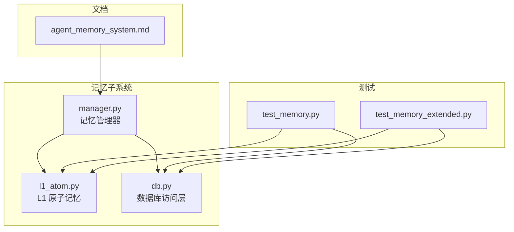
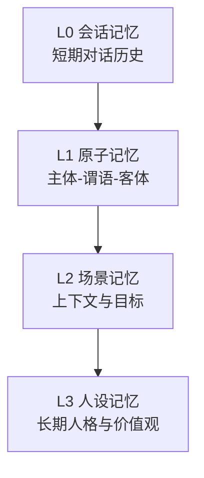
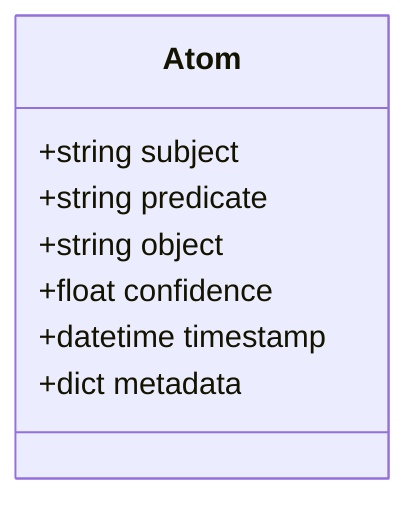
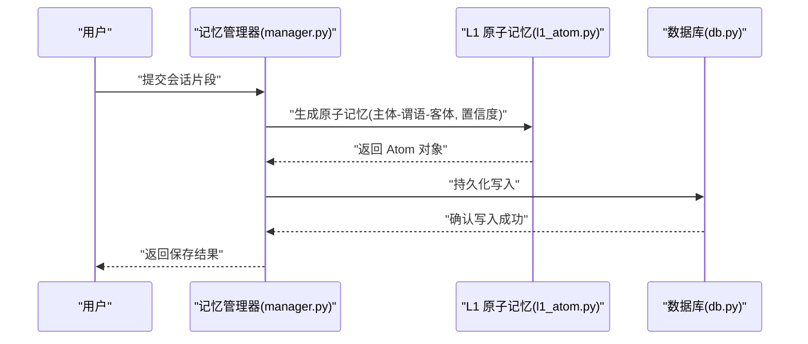
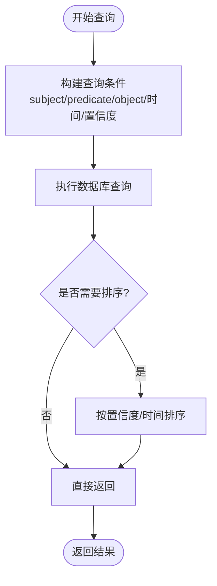

# L1 原子记忆

<cite>
**本文引用的文件**
- [l1_atom.py](file://backend/app/memory/l1_atom.py)
- [manager.py](file://backend/app/memory/manager.py)
- [db.py](file://backend/app/memory/db.py)
- [test_memory.py](file://backend/tests/test_memory.py)
- [test_memory_extended.py](file://backend/tests/test_memory_extended.py)
- [agent_memory_system.md](file://backend/data/articles/agent-memory-system.md)
</cite>

## 目录
1. [简介](#简介)
2. [项目结构](#项目结构)
3. [核心组件](#核心组件)
4. [架构总览](#架构总览)
5. [详细组件分析](#详细组件分析)
6. [依赖关系分析](#依赖关系分析)
7. [性能考虑](#性能考虑)
8. [故障排除指南](#故障排除指南)
9. [结论](#结论)
10. [附录](#附录)

## 简介
本文件系统性阐述 L1 原子记忆在 Aureon 项目中的设计理念与实现细节。L1 原子记忆以“主体-谓语-客体”三元组为核心数据结构，用于从会话中抽取并存储关键事实信息（如用户偏好、行为模式、陈述事实等），支持置信度评估与持久化存储，并为后续 L2 场景记忆与 L3 人设记忆提供基础。本文将从数据模型、抽取与存储流程、检索机制、代码示例路径与知识图谱集成等方面展开。

## 项目结构
L1 原子记忆位于后端应用的记忆子系统中，主要文件包括：
- l1_atom.py：定义原子记忆的数据模型与基本操作接口
- manager.py：记忆管理器，协调不同层级记忆（L0-L3）以及与数据库交互
- db.py：数据库访问层，封装 SQLite/本地存储的读写逻辑
- test_memory.py 与 test_memory_extended.py：验证原子记忆的保存、查询与更新行为
- agent_memory_system.md：关于智能体记忆系统的背景文章，有助于理解设计动机



**图表来源**
- [manager.py](file://backend/app/memory/manager.py)
- [l1_atom.py](file://backend/app/memory/l1_atom.py)
- [db.py](file://backend/app/memory/db.py)
- [test_memory.py](file://backend/tests/test_memory.py)
- [test_memory_extended.py](file://backend/tests/test_memory_extended.py)
- [agent_memory_system.md](file://backend/data/articles/agent-memory-system.md)

**章节来源**
- [manager.py](file://backend/app/memory/manager.py)
- [l1_atom.py](file://backend/app/memory/l1_atom.py)
- [db.py](file://backend/app/memory/db.py)
- [test_memory.py](file://backend/tests/test_memory.py)
- [test_memory_extended.py](file://backend/tests/test_memory_extended.py)
- [agent_memory_system.md](file://backend/data/articles/agent-memory-system.md)

## 核心组件
- L1 原子记忆数据模型：以三元组形式表达知识，包含 subject（主体）、predicate（谓语）、object（客体），并带有置信度 confidence、时间戳 timestamp、可选元数据 metadata 等字段。该模型用于稳定地表示事实与偏好等信息。
- 记忆管理器：负责将对话内容转化为原子记忆，调用数据库层进行持久化，同时提供查询与更新能力。
- 数据库访问层：抽象底层存储，确保原子记忆的可靠写入与检索。
- 测试用例：覆盖保存、查询、更新与一致性校验，保障功能正确性。

**章节来源**
- [l1_atom.py](file://backend/app/memory/l1_atom.py)
- [manager.py](file://backend/app/memory/manager.py)
- [db.py](file://backend/app/memory/db.py)
- [test_memory.py](file://backend/tests/test_memory.py)
- [test_memory_extended.py](file://backend/tests/test_memory_extended.py)

## 架构总览
L1 原子记忆在整体记忆体系中的位置如下：
- L0：会话级对话历史（短期）
- L1：原子记忆（事实与偏好等稳定知识）
- L2：场景记忆（上下文与目标）
- L3：人设记忆（长期人格与价值观）



[此图为概念性架构示意，无需图表来源]

## 详细组件分析

### L1 原子记忆数据模型
- 字段说明
  - subject：三元组主体，通常代表实体（如用户、产品、服务等）
  - predicate：三元组谓语，描述关系或属性（如“偏好”、“购买过”、“评价为”等）
  - object：三元组客体，关系指向的对象（如具体数值、类别、文本等）
  - confidence：置信度，量化抽取结果的可信程度（范围 0~1）
  - timestamp：记录时间戳，便于排序与过期控制
  - metadata：附加元数据，可用于标注来源、标签等
- 设计原则
  - 结构化三元组确保知识可解析、可组合
  - 置信度驱动后续决策（如是否写入、何时更新）
  - 时间戳支持时效性与去重



**图表来源**
- [l1_atom.py](file://backend/app/memory/l1_atom.py)

**章节来源**
- [l1_atom.py](file://backend/app/memory/l1_atom.py)

### 抽取与存储流程
- 输入：会话消息（用户输入、系统输出、工具结果等）
- 处理：通过记忆管理器调用 LLM 或规则引擎，将非结构化信息映射为三元组
- 输出：原子记忆对象，写入数据库



**图表来源**
- [manager.py](file://backend/app/memory/manager.py)
- [l1_atom.py](file://backend/app/memory/l1_atom.py)
- [db.py](file://backend/app/memory/db.py)

**章节来源**
- [manager.py](file://backend/app/memory/manager.py)
- [l1_atom.py](file://backend/app/memory/l1_atom.py)
- [db.py](file://backend/app/memory/db.py)

### 检索机制
- 支持按 subject/predicate/object 的精确匹配与模糊匹配
- 支持按时间范围过滤与按置信度阈值筛选
- 支持多条件组合查询，返回有序结果集（按置信度/时间排序）



**图表来源**
- [db.py](file://backend/app/memory/db.py)
- [manager.py](file://backend/app/memory/manager.py)

**章节来源**
- [db.py](file://backend/app/memory/db.py)
- [manager.py](file://backend/app/memory/manager.py)

### 代码示例路径（保存、查询、更新）
以下为关键操作的代码示例路径，便于定位实现细节：
- 保存原子记忆
  - [保存入口](file://backend/app/memory/manager.py)
  - [Atom 定义](file://backend/app/memory/l1_atom.py)
  - [持久化写入](file://backend/app/memory/db.py)
- 查询原子记忆
  - [查询接口](file://backend/app/memory/manager.py)
  - [数据库查询实现](file://backend/app/memory/db.py)
- 更新原子记忆
  - [更新入口](file://backend/app/memory/manager.py)
  - [冲突处理与合并策略](file://backend/app/memory/l1_atom.py)
  - [写入实现](file://backend/app/memory/db.py)
- 测试用例参考
  - [基础测试](file://backend/tests/test_memory.py)
  - [扩展测试](file://backend/tests/test_memory_extended.py)

**章节来源**
- [manager.py](file://backend/app/memory/manager.py)
- [l1_atom.py](file://backend/app/memory/l1_atom.py)
- [db.py](file://backend/app/memory/db.py)
- [test_memory.py](file://backend/tests/test_memory.py)
- [test_memory_extended.py](file://backend/tests/test_memory_extended.py)

### 在知识图谱构建中的作用
- 原子记忆是知识图谱的基本单元，每个三元组对应一条边或节点属性
- 可通过 subject/predicate/object 构建实体与关系网络
- 置信度可作为边权重或节点可信度，辅助推理与检索
- 与 L2/L3 记忆协同，形成从事实到场景再到人设的层次化知识结构

**章节来源**
- [l1_atom.py](file://backend/app/memory/l1_atom.py)
- [agent_memory_system.md](file://backend/data/articles/agent-memory-system.md)

## 依赖关系分析
- 组件耦合
  - manager.py 依赖 l1_atom.py 的数据模型与业务逻辑
  - manager.py 依赖 db.py 进行持久化
  - 测试用例依赖 manager.py 与 db.py 验证行为
- 外部依赖
  - 数据库层抽象，便于替换存储后端
  - LLM/规则引擎用于知识抽取（在 manager.py 中调用）

```mermaid
graph LR
L1["l1_atom.py"] <- --> M["manager.py"]
DB["db.py"] <- --> M
T1["test_memory.py"] --> M
T2["test_memory_extended.py"] --> M
T1 --> DB
T2 --> DB
```

**图表来源**
- [manager.py](file://backend/app/memory/manager.py)
- [l1_atom.py](file://backend/app/memory/l1_atom.py)
- [db.py](file://backend/app/memory/db.py)
- [test_memory.py](file://backend/tests/test_memory.py)
- [test_memory_extended.py](file://backend/tests/test_memory_extended.py)

**章节来源**
- [manager.py](file://backend/app/memory/manager.py)
- [l1_atom.py](file://backend/app/memory/l1_atom.py)
- [db.py](file://backend/app/memory/db.py)
- [test_memory.py](file://backend/tests/test_memory.py)
- [test_memory_extended.py](file://backend/tests/test_memory_extended.py)

## 性能考虑
- 存储优化
  - 使用索引覆盖常用查询字段（subject/predicate/object/timestamp）
  - 分页查询与批量写入，避免大事务阻塞
- 查询优化
  - 合理设置置信度阈值与时间窗口，减少扫描范围
  - 对高频查询建立二级缓存（可选）
- 写入策略
  - 批量写入与去重合并，降低写放大
  - 异步写入与背压控制，保证系统稳定性

[本节为通用性能建议，无需章节来源]

## 故障排除指南
- 保存失败
  - 检查数据库连接状态与权限
  - 核对 Atom 字段完整性与类型
- 查询无结果
  - 确认查询条件是否过于严格（如置信度阈值过高）
  - 检查时间范围与字段匹配
- 数据不一致
  - 查看测试用例中的断言与期望行为
  - 对比基础测试与扩展测试的差异点

**章节来源**
- [test_memory.py](file://backend/tests/test_memory.py)
- [test_memory_extended.py](file://backend/tests/test_memory_extended.py)
- [db.py](file://backend/app/memory/db.py)

## 结论
L1 原子记忆通过标准化的三元组模型与置信度机制，实现了从会话中稳定抽取事实与偏好的能力。它在知识抽取、存储与检索方面提供了清晰的接口，并为更高层的记忆（L2/L3）与知识图谱构建奠定了坚实基础。配合完善的测试与可扩展的存储后端，L1 原子记忆能够满足复杂应用场景下的长期知识管理需求。

## 附录
- 相关文档
  - [智能体记忆系统设计](file://backend/data/articles/agent-memory-system.md)
- 测试参考
  - [基础记忆测试](file://backend/tests/test_memory.py)
  - [扩展记忆测试](file://backend/tests/test_memory_extended.py)

**章节来源**
- [agent_memory_system.md](file://backend/data/articles/agent-memory-system.md)
- [test_memory.py](file://backend/tests/test_memory.py)
- [test_memory_extended.py](file://backend/tests/test_memory_extended.py)