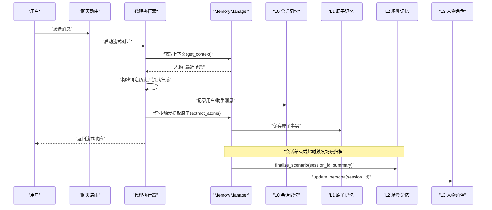
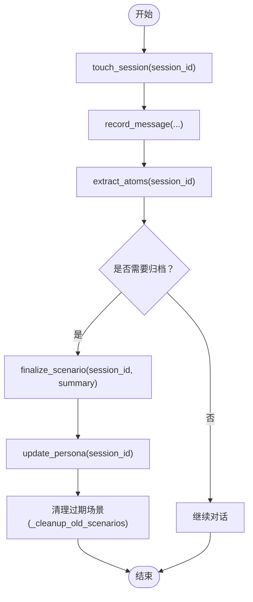
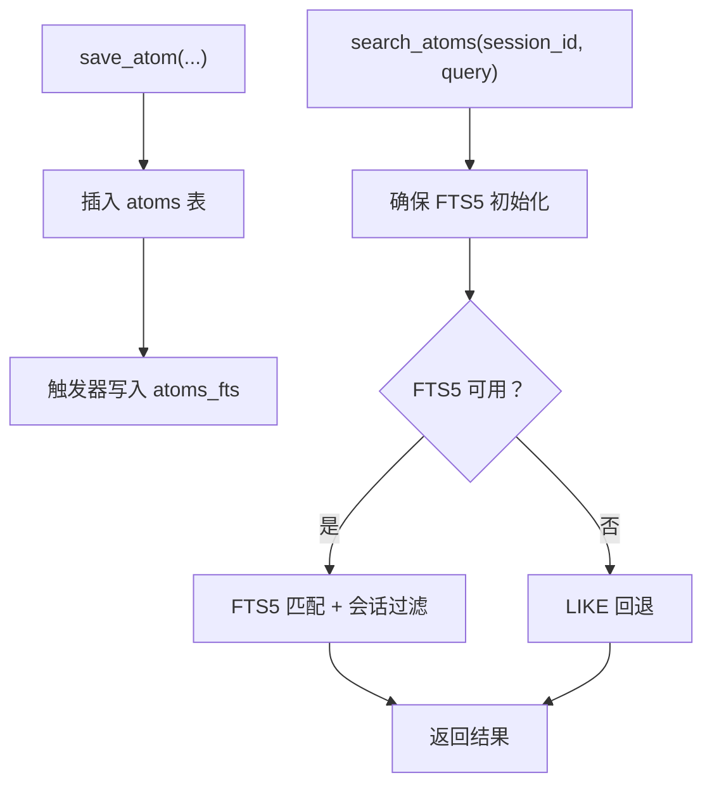
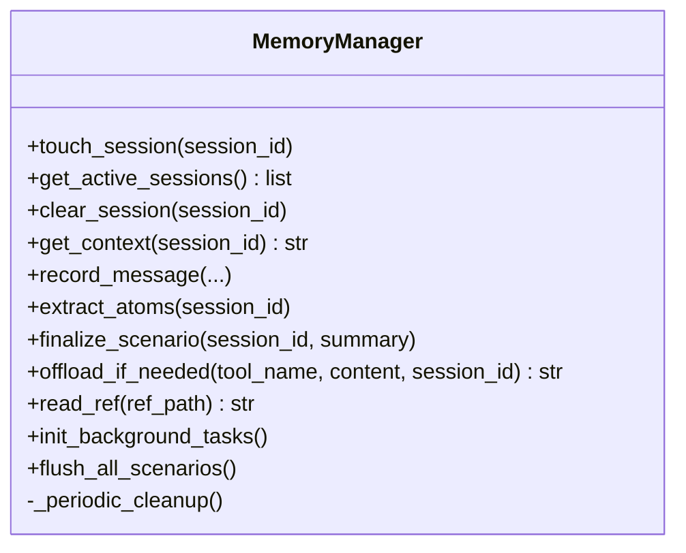
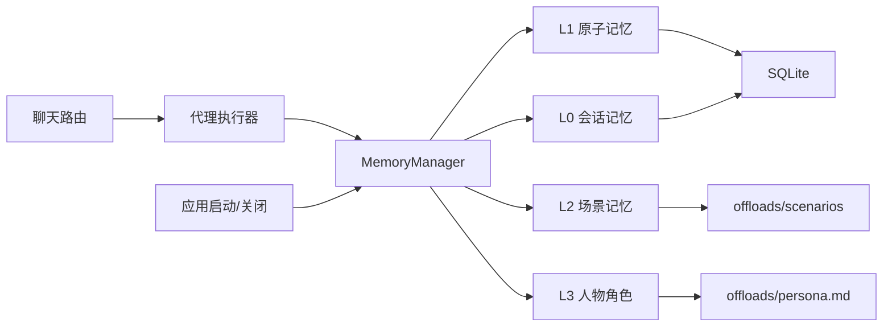

# L2 场景记忆

<cite>
**本文引用的文件**
- [l2_scenario.py](file://backend/app/memory/l2_scenario.py)
- [l1_atom.py](file://backend/app/memory/l1_atom.py)
- [manager.py](file://backend/app/memory/manager.py)
- [l0_conversation.py](file://backend/app/memory/l0_conversation.py)
- [db.py](file://backend/app/memory/db.py)
- [l3_persona.py](file://backend/app/memory/l3_persona.py)
- [offload.py](file://backend/app/memory/offload.py)
- [test_memory.py](file://backend/tests/test_memory.py)
- [config.py](file://backend/app/config.py)
- [main.py](file://backend/app/main.py)
- [chat.py](file://backend/app/routers/chat.py)
- [executor.py](file://backend/app/agent/executor.py)
- [sess_l2_20260529.md](file://offloads/scenarios/sess_l2_20260529.md)
- [persona.md](file://offloads/persona.md)
</cite>

## 目录
1. [引言](#引言)
2. [项目结构](#项目结构)
3. [核心组件](#核心组件)
4. [架构总览](#架构总览)
5. [详细组件分析](#详细组件分析)
6. [依赖分析](#依赖分析)
7. [性能考虑](#性能考虑)
8. [故障排查指南](#故障排查指南)
9. [结论](#结论)
10. [附录](#附录)

## 引言
本文件围绕 L2 场景记忆展开，系统性阐述其在对话上下文中对“情境建模”的设计与实现。L2 场景记忆的核心目标是将相关的原子记忆（L1）组织为可读、可检索、可复用的“场景”，并将其沉淀为离线 Markdown 文件，用于后续对话提供背景信息。同时，L2 场景与人物角色记忆（L3）协同，持续提炼人物画像与近期活动摘要，形成更稳定的长期上下文。

## 项目结构
L2 场景记忆位于后端内存子系统中，与 L0 会话记忆、L1 原子记忆、L3 人物角色记忆共同构成多层级记忆体系。其关键文件与职责如下：
- l2_scenario.py：负责场景的创建、总结、归档与清理
- l1_atom.py：负责原子事实的持久化与检索
- l0_conversation.py：负责会话消息的记录与清理
- manager.py：统一编排会话生命周期、提取原子记忆、触发场景归档与人物画像更新
- l3_persona.py：基于最近场景与原子事实生成人物角色摘要
- offload.py：长文本离线存储与引用读取
- db.py：SQLite 初始化与连接管理
- 配置与路由：config.py 提供会话与离线阈值；main.py、chat.py、executor.py 将记忆系统集成到对话流中

```mermaid
graph TB
subgraph "内存层"
L0["L0 会话记忆<br/>记录对话消息"]
L1["L1 原子记忆<br/>保存三元组事实"]
L2["L2 场景记忆<br/>生成场景文件"]
L3["L3 人物角色记忆<br/>生成人物摘要"]
DB["SQLite 数据库<br/>表: conversations, atoms"]
OFF["离线存储<br/>refs 与 scenarios 目录"]
end
subgraph "应用层"
MAN["MemoryManager<br/>会话生命周期与编排"]
EXE["stream_agent_with_memory<br/>对话流集成"]
CHAT["聊天路由<br/>/api/chat/stream 等"]
MAIN["启动与关闭<br/>后台任务与清理"]
end
L0 --> MAN
L1 --> MAN
MAN --> L2
MAN --> L3
L2 --> OFF
L3 --> OFF
DB <-- L0
DB <-- L1
EXE --> MAN
CHAT --> EXE
MAIN --> MAN
```

图表来源
- [manager.py:20-130](file://backend/app/memory/manager.py#L20-L130)
- [l2_scenario.py:35-94](file://backend/app/memory/l2_scenario.py#L35-L94)
- [l1_atom.py:43-98](file://backend/app/memory/l1_atom.py#L43-L98)
- [l0_conversation.py:8-65](file://backend/app/memory/l0_conversation.py#L8-L65)
- [db.py:35-63](file://backend/app/memory/db.py#L35-L63)
- [offload.py:11-53](file://backend/app/memory/offload.py#L11-L53)
- [executor.py:64-123](file://backend/app/agent/executor.py#L64-L123)
- [chat.py:46-107](file://backend/app/routers/chat.py#L46-L107)
- [main.py:171-211](file://backend/app/main.py#L171-L211)

章节来源
- [manager.py:20-130](file://backend/app/memory/manager.py#L20-L130)
- [l2_scenario.py:18-94](file://backend/app/memory/l2_scenario.py#L18-L94)
- [l1_atom.py:9-98](file://backend/app/memory/l1_atom.py#L9-L98)
- [l0_conversation.py:8-65](file://backend/app/memory/l0_conversation.py#L8-L65)
- [db.py:35-63](file://backend/app/memory/db.py#L35-L63)
- [offload.py:11-53](file://backend/app/memory/offload.py#L11-L53)
- [executor.py:64-123](file://backend/app/agent/executor.py#L64-L123)
- [chat.py:46-107](file://backend/app/routers/chat.py#L46-L107)
- [main.py:171-211](file://backend/app/main.py#L171-L211)

## 核心组件
- L2 场景记忆（l2_scenario.py）
  - 场景文件命名与目录：按会话 ID 与日期生成 Markdown 文件，存放于 offloads/scenarios
  - 场景内容：包含会话标识、日期、摘要与关键事实（L1 原子记忆前若干条）
  - 归档与清理：自动保留最近 N 个场景，超出数量则删除最旧文件，并清空缓存
  - 列表缓存：对场景文件列表进行短期缓存，避免频繁 IO
- L1 原子记忆（l1_atom.py）
  - 三元组结构：subject、predicate、object，附加 confidence 与 source_ref
  - 全文索引：通过 FTS5 虚表与触发器实现高效检索与回退策略
  - 查询接口：支持按会话检索与关键词匹配
- L0 会话记忆（l0_conversation.py）
  - 记录每轮对话消息，含角色、内容、token 数与工具调用信息
  - 消息清理：超过阈值时删除最早的消息，维持会话长度
- MemoryManager（manager.py）
  - 会话生命周期：touch_session、get_active_sessions、clear_session
  - 上下文拼接：整合 L3 人物与最近 L2 场景
  - 原子提取：从最新用户消息抽取 L1 原子
  - 场景归档：finalize_scenario 同步触发 L3 更新
  - 后台任务：周期检查不活跃会话并自动归档
- L3 人物角色记忆（l3_persona.py）
  - 基于最近场景摘要与关键事实生成人物画像
  - 写入 offloads/persona.md，限制最大大小
- 离线存储（offload.py）
  - 当内容超过阈值时写入 offloads/refs 下的独立文件，并返回引用
  - 读取时进行路径遍历保护

章节来源
- [l2_scenario.py:18-94](file://backend/app/memory/l2_scenario.py#L18-L94)
- [l1_atom.py:9-98](file://backend/app/memory/l1_atom.py#L9-L98)
- [l0_conversation.py:8-65](file://backend/app/memory/l0_conversation.py#L8-L65)
- [manager.py:20-130](file://backend/app/memory/manager.py#L20-L130)
- [l3_persona.py:11-44](file://backend/app/memory/l3_persona.py#L11-L44)
- [offload.py:11-53](file://backend/app/memory/offload.py#L11-L53)

## 架构总览
L2 场景记忆在对话流中的位置与交互如下：
- 用户输入经路由进入聊天处理器，交由代理执行器驱动
- 执行器在开始时向代理注入“记忆上下文”（来自 MemoryManager.get_context）
- 代理生成回复后，执行器记录用户与助手消息至 L0，并异步触发 L1 原子提取
- MemoryManager 在每次消息记录后维护会话活跃度；在合适时机触发 L2 场景归档，并联动 L3 人物更新
- 场景文件与人物文件落盘，供后续对话复用



图表来源
- [chat.py:46-107](file://backend/app/routers/chat.py#L46-L107)
- [executor.py:64-123](file://backend/app/agent/executor.py#L64-L123)
- [manager.py:42-127](file://backend/app/memory/manager.py#L42-L127)
- [l0_conversation.py:8-65](file://backend/app/memory/l0_conversation.py#L8-L65)
- [l1_atom.py:43-98](file://backend/app/memory/l1_atom.py#L43-L98)
- [l2_scenario.py:35-94](file://backend/app/memory/l2_scenario.py#L35-L94)
- [l3_persona.py:11-44](file://backend/app/memory/l3_persona.py#L11-L44)

## 详细组件分析

### L2 场景记忆：创建、更新、总结与归档
- 创建与保存
  - 依据会话 ID 与当前日期生成文件名，内容包含摘要与关键事实（L1 原子）
  - 关键实现参考：[l2_scenario.py:35-66]
- 查询最近场景
  - 支持按会话 ID 获取上下文时读取最近 N 个场景
  - 关键实现参考：[l2_scenario.py:68-77]
- 清理与缓存
  - 仅保留最近 MAX_SCENARIOS 个场景，超出则删除最旧文件并清空缓存
  - 列表缓存 TTL 为 60 秒，避免频繁扫描目录
  - 关键实现参考：[l2_scenario.py:18-32]、[l2_scenario.py:80-94]
- 生命周期管理
  - 主动归档：MemoryManager.finalize_scenario 触发
  - 自动归档：后台任务检测不活跃会话并归档
  - 关键实现参考：[manager.py:74-127]



图表来源
- [manager.py:27-127](file://backend/app/memory/manager.py#L27-L127)
- [l2_scenario.py:35-94](file://backend/app/memory/l2_scenario.py#L35-L94)
- [l3_persona.py:11-44](file://backend/app/memory/l3_persona.py#L11-L44)

章节来源
- [l2_scenario.py:18-94](file://backend/app/memory/l2_scenario.py#L18-L94)
- [manager.py:74-127](file://backend/app/memory/manager.py#L74-L127)

### L1 原子记忆：三元组建模与检索
- 存储结构
  - 字段：session_id、subject、predicate、object、source_ref、confidence、created_at
  - 索引：按 session_id 建立普通索引；FTS5 虚表与触发器实现全文检索
  - 关键实现参考：[db.py:39-61]、[l1_atom.py:9-41]
- 检索策略
  - 优先使用 FTS5 匹配安全转义后的短语；失败时回退到 LIKE 模糊匹配
  - 关键实现参考：[l1_atom.py:63-87]
- 使用示例（测试）
  - 保存原子与按关键词搜索
  - 关键参考：[test_memory.py:29-34]



图表来源
- [l1_atom.py:43-98](file://backend/app/memory/l1_atom.py#L43-L98)
- [db.py:39-61](file://backend/app/memory/db.py#L39-L61)

章节来源
- [l1_atom.py:9-98](file://backend/app/memory/l1_atom.py#L9-L98)
- [db.py:35-63](file://backend/app/memory/db.py#L35-L63)
- [test_memory.py:29-34](file://backend/tests/test_memory.py#L29-L34)

### L0 会话记忆：消息记录与清理
- 记录消息
  - 字段：session_id、role、content、tokens、tool_name、tool_args
  - 关键实现参考：[l0_conversation.py:8-25]
- 获取与清理
  - 最近 N 条消息；超过阈值删除最早消息，阈值来自配置
  - 关键实现参考：[l0_conversation.py:27-65]、[config.py:48-49]

章节来源
- [l0_conversation.py:8-65](file://backend/app/memory/l0_conversation.py#L8-L65)
- [config.py:48-49](file://backend/app/config.py#L48-L49)

### MemoryManager：会话生命周期与上下文拼接
- 会话活跃度
  - touch_session 记录创建与最后活跃时间
  - get_active_sessions 返回活跃会话列表
  - 关键实现参考：[manager.py:27-38]
- 上下文拼接
  - get_context：合并 L3 人物与最近 L2 场景
  - 关键实现参考：[manager.py:42-50]
- 原子提取
  - 从最近用户消息抽取 L1 原子，设定较低置信度
  - 关键实现参考：[manager.py:60-71]
- 场景归档与人物更新
  - finalize_scenario 同步触发 L3 更新
  - 关键实现参考：[manager.py:74-77]
- 后台清理
  - 周期检查不活跃会话并自动归档
  - 关键实现参考：[manager.py:104-127]



图表来源
- [manager.py:20-130](file://backend/app/memory/manager.py#L20-L130)

章节来源
- [manager.py:20-130](file://backend/app/memory/manager.py#L20-L130)

### L3 人物角色记忆：与场景记忆的协作
- 生成策略
  - 从最近场景中抽取摘要与关键事实，拼接为人物近期活动
  - 写入 offloads/persona.md，限制最大大小
  - 关键实现参考：[l3_persona.py:11-44]
- 协作关系
  - 场景归档后同步更新人物角色，使长期上下文随场景演进
  - 关键实现参考：[manager.py:74-77]

章节来源
- [l3_persona.py:11-44](file://backend/app/memory/l3_persona.py#L11-L44)
- [manager.py:74-77](file://backend/app/memory/manager.py#L74-L77)

### 对话上下文中的作用与示例
- 注入上下文
  - 代理执行器在开始对话时调用 MemoryManager.get_context，将人物与场景注入系统提示
  - 关键实现参考：[executor.py:84-87]
- 示例（测试）
  - 场景归档后应产生对应 Markdown 文件
  - 关键参考：[test_memory.py:49-56]

章节来源
- [executor.py:64-123](file://backend/app/agent/executor.py#L64-L123)
- [test_memory.py:49-56](file://backend/tests/test_memory.py#L49-L56)

## 依赖分析
- 组件耦合
  - MemoryManager 是中枢，向上游提供上下文，向下游触发 L1/L2/L3 操作
  - L2 场景依赖 L1 原子与配置（最大场景数、目录）
  - L3 人物依赖 L2 场景与 L1 原子
  - 离线存储为长文本与场景文件提供落盘能力
- 外部依赖
  - SQLite（WAL 模式）、FTS5 虚表与触发器
  - 配置项：session_max_messages、offload_max_chars



图表来源
- [manager.py:20-130](file://backend/app/memory/manager.py#L20-L130)
- [l2_scenario.py:9-15](file://backend/app/memory/l2_scenario.py#L9-L15)
- [l3_persona.py:7-8](file://backend/app/memory/l3_persona.py#L7-L8)
- [db.py:35-63](file://backend/app/memory/db.py#L35-L63)
- [executor.py:64-123](file://backend/app/agent/executor.py#L64-L123)
- [chat.py:46-107](file://backend/app/routers/chat.py#L46-L107)
- [main.py:171-211](file://backend/app/main.py#L171-L211)

章节来源
- [manager.py:20-130](file://backend/app/memory/manager.py#L20-L130)
- [l2_scenario.py:9-15](file://backend/app/memory/l2_scenario.py#L9-L15)
- [l3_persona.py:7-8](file://backend/app/memory/l3_persona.py#L7-L8)
- [db.py:35-63](file://backend/app/memory/db.py#L35-L63)
- [executor.py:64-123](file://backend/app/agent/executor.py#L64-L123)
- [chat.py:46-107](file://backend/app/routers/chat.py#L46-L107)
- [main.py:171-211](file://backend/app/main.py#L171-L211)

## 性能考虑
- SQLite 连接模型
  - 线程本地连接 + WAL 模式 + busy_timeout，提升并发读取与写入稳定性
  - 关键实现参考：[db.py:15-32]
- FTS5 索引
  - 为原子检索提供高性能全文匹配；失败时回退 LIKE，保证可用性
  - 关键实现参考：[l1_atom.py:9-41]、[l1_atom.py:63-87]
- 缓存与清理
  - 场景文件列表缓存（TTL=60s），减少目录扫描开销
  - 最大场景数控制，避免磁盘膨胀
  - 关键实现参考：[l2_scenario.py:18-32]、[l2_scenario.py:80-94]
- 后台任务
  - 周期性检查不活跃会话，避免资源泄漏
  - 关键实现参考：[manager.py:104-127]

## 故障排查指南
- 场景文件未生成
  - 检查 finalize_scenario 是否被调用（主动或自动）
  - 确认 offloads/scenarios 目录可写
  - 参考：[l2_scenario.py:35-66]
- 场景过多导致磁盘占用过高
  - 检查 MAX_SCENARIOS 设置与清理逻辑
  - 参考：[l2_scenario.py:10]、[l2_scenario.py:80-94]
- 人物文件未更新
  - 确认场景归档后是否调用 update_persona
  - 参考：[manager.py:74-77]、[l3_persona.py:11-44]
- 原子检索异常
  - 检查 FTS5 初始化状态与触发器
  - 若回退到 LIKE，确认 LIKE 查询逻辑
  - 参考：[l1_atom.py:9-41]、[l1_atom.py:63-87]
- 长文本未离线
  - 检查 offload_max_chars 阈值与 offload_if_needed 返回值
  - 参考：[offload.py:11-37]、[config.py:48]

章节来源
- [l2_scenario.py:35-94](file://backend/app/memory/l2_scenario.py#L35-L94)
- [manager.py:74-77](file://backend/app/memory/manager.py#L74-L77)
- [l3_persona.py:11-44](file://backend/app/memory/l3_persona.py#L11-L44)
- [l1_atom.py:9-98](file://backend/app/memory/l1_atom.py#L9-L98)
- [offload.py:11-53](file://backend/app/memory/offload.py#L11-L53)
- [config.py:48](file://backend/app/config.py#L48)

## 结论
L2 场景记忆通过将原子事实组织为可读场景，并以离线文件形式沉淀，有效提升了对话上下文的可解释性与可复用性。配合 MemoryManager 的生命周期管理与 L3 人物角色的记忆增强，系统实现了从短期对话到长期人物画像的渐进式上下文演化。该设计兼顾性能与可靠性，适合在生产环境中稳定运行。

## 附录
- 场景文件示例
  - [sess_l2_20260529.md](file://offloads/scenarios/sess_l2_20260529.md)
- 人物文件示例
  - [persona.md](file://offloads/persona.md)
- 集成点参考
  - 应用启动与关闭：[main.py:171-211]
  - 聊天路由：[chat.py:46-107]
  - 代理执行器：[executor.py:64-123]
  - 测试用例：[test_memory.py:49-56]