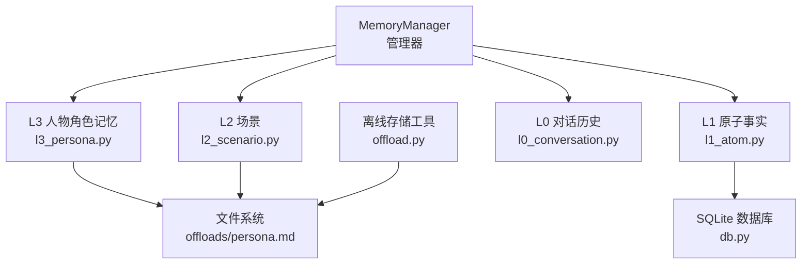
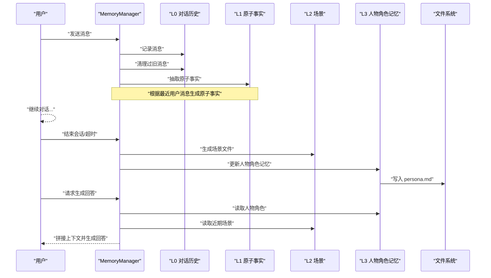
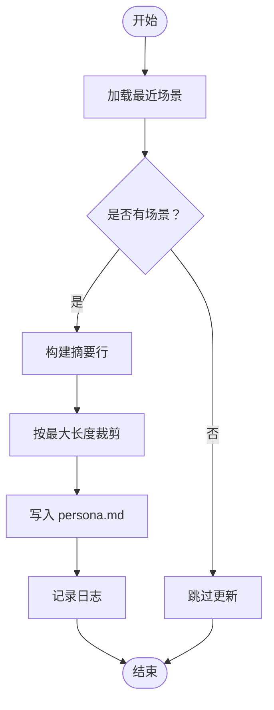
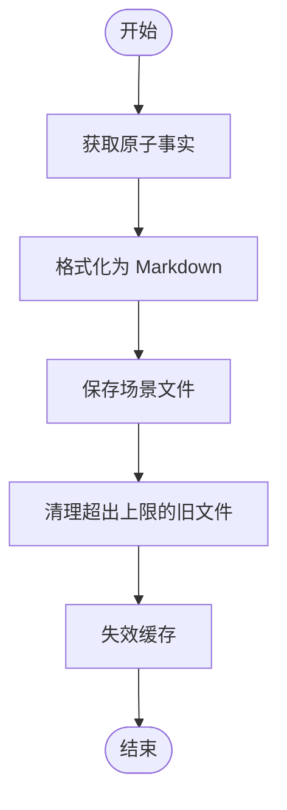
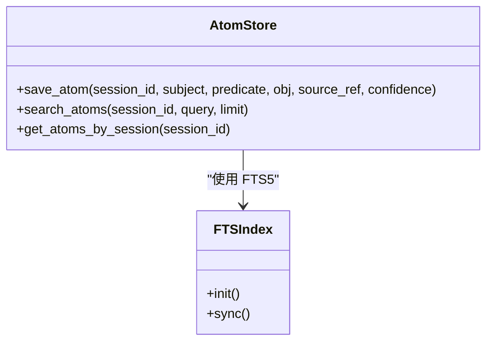
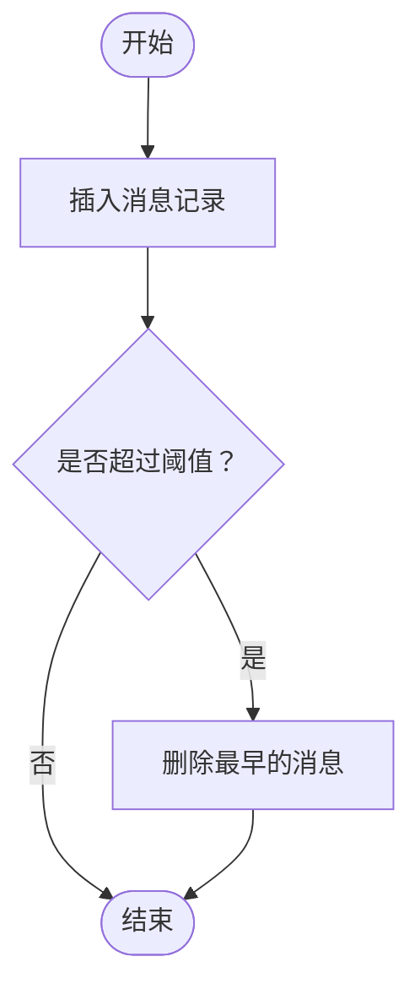
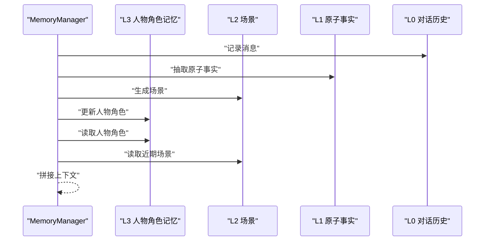
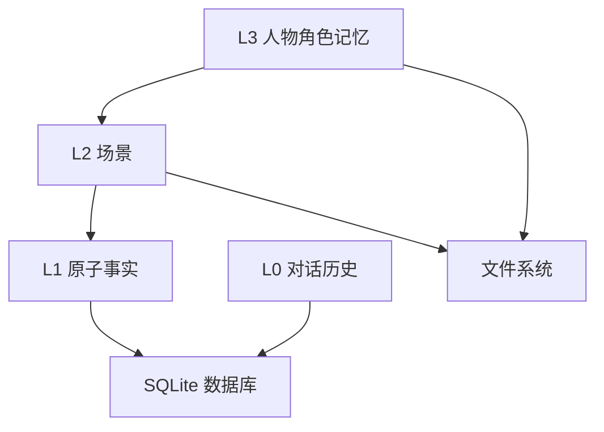

# L3 人物角色记忆

<cite>
**本文引用的文件**
- [backend/app/memory/l3_persona.py](file://backend/app/memory/l3_persona.py)
- [backend/app/memory/l2_scenario.py](file://backend/app/memory/l2_scenario.py)
- [backend/app/memory/l1_atom.py](file://backend/app/memory/l1_atom.py)
- [backend/app/memory/l0_conversation.py](file://backend/app/memory/l0_conversation.py)
- [backend/app/memory/db.py](file://backend/app/memory/db.py)
- [backend/app/memory/offload.py](file://backend/app/memory/offload.py)
- [backend/app/memory/manager.py](file://backend/app/memory/manager.py)
- [offloads/persona.md](file://offloads/persona.md)
</cite>

## 目录
1. [引言](#引言)
2. [项目结构](#项目结构)
3. [核心组件](#核心组件)
4. [架构总览](#架构总览)
5. [详细组件分析](#详细组件分析)
6. [依赖关系分析](#依赖关系分析)
7. [性能考量](#性能考量)
8. [故障排查指南](#故障排查指南)
9. [结论](#结论)
10. [附录](#附录)

## 引言
本技术文档围绕 L3 人物角色记忆（L3 Persona）展开，系统阐述其作为长期身份与个性建模的设计理念与实现机制。L3 记忆以“最近活动摘要”为核心，从 L2 场景与 L1 原子事实中抽取关键片段，形成稳定的、可持久化的角色描述，并在对话上下文中被检索与注入，从而影响 AI 的回答风格与行为模式。

该设计强调以下要点：
- 角色定义：通过近期场景与原子事实提炼出“最近活动”，作为角色记忆的主体内容。
- 个性特征与行为模式：由场景与原子事实的语义聚合体现，随对话演进逐步稳定。
- 情感状态：当前实现聚焦于“最近活动”的事实性摘要，未直接建模情感状态；可在后续扩展中引入情感向量或情感标签。
- 存储结构：L3 以纯文本 Markdown 文件形式持久化；L1/L2/L0 分层分别对应原子事实、场景与对话历史；数据库用于结构化存储与检索。
- 对话应用：在生成阶段将 L3 与近期场景拼接为上下文，指导模型输出风格与行为一致性。
- 动态交互：L3 由 L2 场景与 L1 原子事实驱动更新，形成从短期到长期的记忆闭环。

## 项目结构
L3 人物角色记忆位于后端内存模块中，与 L0 对话、L1 原子事实、L2 场景及数据库共同构成分层记忆体系。下图展示了与 L3 直接相关的文件与它们之间的调用关系。

图表来源
- [backend/app/memory/manager.py:42-50](file://backend/app/memory/manager.py#L42-L50)
- [backend/app/memory/l3_persona.py:11-43](file://backend/app/memory/l3_persona.py#L11-L43)
- [backend/app/memory/l2_scenario.py:35-66](file://backend/app/memory/l2_scenario.py#L35-L66)
- [backend/app/memory/l1_atom.py:43-97](file://backend/app/memory/l1_atom.py#L43-L97)
- [backend/app/memory/l0_conversation.py:8-35](file://backend/app/memory/l0_conversation.py#L8-L35)
- [backend/app/memory/db.py:35-62](file://backend/app/memory/db.py#L35-L62)
- [backend/app/memory/offload.py:11-37](file://backend/app/memory/offload.py#L11-L37)
- [offloads/persona.md:1-5](file://offloads/persona.md#L1-L5)

章节来源
- [backend/app/memory/manager.py:1-130](file://backend/app/memory/manager.py#L1-L130)
- [backend/app/memory/l3_persona.py:1-44](file://backend/app/memory/l3_persona.py#L1-L44)
- [backend/app/memory/l2_scenario.py:1-94](file://backend/app/memory/l2_scenario.py#L1-L94)
- [backend/app/memory/l1_atom.py:1-98](file://backend/app/memory/l1_atom.py#L1-L98)
- [backend/app/memory/l0_conversation.py:1-65](file://backend/app/memory/l0_conversation.py#L1-L65)
- [backend/app/memory/db.py:1-63](file://backend/app/memory/db.py#L1-L63)
- [backend/app/memory/offload.py:1-53](file://backend/app/memory/offload.py#L1-L53)
- [offloads/persona.md:1-5](file://offloads/persona.md#L1-L5)

## 核心组件
- L3 人物角色记忆（l3_persona.py）
  - 职责：从近期场景中抽取“最近活动”摘要，写入 offloads/persona.md；提供读取接口。
  - 关键流程：读取最近 N 个场景，解析标题与条目，拼接为简洁摘要，限制最大长度并落盘。
- L2 场景（l2_scenario.py）
  - 职责：将 L1 原子事实汇总为场景 Markdown，包含摘要与关键事实列表；维护场景文件数量上限。
- L1 原子事实（l1_atom.py）
  - 职责：以三元组（主体-谓语-客体）记录事实，支持基于 FTS5 的全文检索与按置信度排序。
- L0 对话历史（l0_conversation.py）
  - 职责：记录用户与系统消息，支持清理过旧消息，控制会话长度。
- 数据库（db.py）
  - 职责：提供线程本地连接、WAL 模式与索引，支撑 L0/L1 表的读写。
- 离线存储工具（offload.py）
  - 职责：对超长内容进行离线落盘并返回引用摘要，避免上下文溢出。
- 内存管理器（manager.py）
  - 职责：统一调度 L0/L1/L2/L3 的生命周期与上下文拼接；周期性清理不活跃会话；触发 L3 更新。

章节来源
- [backend/app/memory/l3_persona.py:11-43](file://backend/app/memory/l3_persona.py#L11-L43)
- [backend/app/memory/l2_scenario.py:35-77](file://backend/app/memory/l2_scenario.py#L35-L77)
- [backend/app/memory/l1_atom.py:43-97](file://backend/app/memory/l1_atom.py#L43-L97)
- [backend/app/memory/l0_conversation.py:8-64](file://backend/app/memory/l0_conversation.py#L8-L64)
- [backend/app/memory/db.py:15-62](file://backend/app/memory/db.py#L15-L62)
- [backend/app/memory/offload.py:11-52](file://backend/app/memory/offload.py#L11-L52)
- [backend/app/memory/manager.py:20-127](file://backend/app/memory/manager.py#L20-L127)

## 架构总览
L3 人物角色记忆的运行时架构如下：对话消息进入 L0，随后抽取 L1 原子事实；当场景终结时生成 L2 场景；L3 人物角色记忆从 L2 场景中抽取“最近活动”摘要并持久化；在生成阶段，MemoryManager 将 L3 与近期 L2 场景拼接为上下文。

图表来源
- [backend/app/memory/manager.py:54-77](file://backend/app/memory/manager.py#L54-L77)
- [backend/app/memory/l3_persona.py:11-43](file://backend/app/memory/l3_persona.py#L11-L43)
- [backend/app/memory/l2_scenario.py:35-66](file://backend/app/memory/l2_scenario.py#L35-L66)
- [backend/app/memory/l1_atom.py:60-70](file://backend/app/memory/l1_atom.py#L60-L70)
- [backend/app/memory/l0_conversation.py:16-24](file://backend/app/memory/l0_conversation.py#L16-L24)
- [offloads/persona.md:1-5](file://offloads/persona.md#L1-L5)

## 详细组件分析

### L3 人物角色记忆（l3_persona.py）
- 设计理念
  - 以“最近活动”为角色核心，避免过度抽象导致的漂移；通过场景片段的归纳与裁剪，保持稳定性与可读性。
  - 使用固定路径与大小限制，确保 L3 可靠持久化且不会膨胀。
- 数据流与处理逻辑
  - 输入：最近 N 个场景（由 L2 提供）。
  - 处理：过滤标题与条目，去噪与截断，拼接为简洁摘要。
  - 输出：写入 offloads/persona.md；提供读取接口。
- 错误处理
  - 文件写入异常会被捕获并记录错误日志；若无可用场景则跳过更新。
- 性能与复杂度
  - 时间复杂度近似 O(S)，S 为场景文本长度；空间复杂度受 PERSONA_MAX_SIZE 限制。
- 代码片段路径
  - [更新函数入口:11-37](file://backend/app/memory/l3_persona.py#L11-L37)
  - [读取函数入口:39-43](file://backend/app/memory/l3_persona.py#L39-L43)

图表来源
- [backend/app/memory/l3_persona.py:11-37](file://backend/app/memory/l3_persona.py#L11-L37)

章节来源
- [backend/app/memory/l3_persona.py:1-44](file://backend/app/memory/l3_persona.py#L1-L44)
- [offloads/persona.md:1-5](file://offloads/persona.md#L1-L5)

### L2 场景（l2_scenario.py）
- 设计理念
  - 将原子事实汇总为结构化场景，便于 L3 抽取“最近活动”；同时保留关键事实列表，增强可追溯性。
- 数据流与处理逻辑
  - 输入：原子事实集合（来自 L1）。
  - 处理：格式化为 Markdown，包含摘要与前若干关键事实。
  - 输出：保存至 offloads/scenarios/<session_id>_<date>.md；维护最多 MAX_SCENARIOS 个文件。
- 错误处理
  - 文件写入失败记录错误；清理旧文件后失效缓存。
- 性能与复杂度
  - 时间复杂度近似 O(A)，A 为原子事实数量；缓存目录列表 TTL 降低频繁 IO。
- 代码片段路径
  - [生成场景:35-66](file://backend/app/memory/l2_scenario.py#L35-L66)
  - [读取最近场景:68-77](file://backend/app/memory/l2_scenario.py#L68-L77)
  - [清理旧场景:80-94](file://backend/app/memory/l2_scenario.py#L80-L94)

图表来源
- [backend/app/memory/l2_scenario.py:35-94](file://backend/app/memory/l2_scenario.py#L35-L94)

章节来源
- [backend/app/memory/l2_scenario.py:1-94](file://backend/app/memory/l2_scenario.py#L1-L94)

### L1 原子事实（l1_atom.py）
- 设计理念
  - 以三元组结构存储事实，支持基于 FTS5 的全文检索与触发器同步；提供按置信度排序的查询能力。
- 数据流与处理逻辑
  - 写入：插入 atoms 表，自动同步到 atoms_fts 虚表。
  - 查询：优先使用 FTS5 匹配，失败回退到 LIKE；按置信度降序返回。
  - 扫描：按时间顺序返回某会话的所有原子事实。
- 错误处理
  - FTS5 初始化失败时记录警告并回退到 LIKE；其余异常记录错误日志。
- 性能与复杂度
  - 插入/删除/更新：O(1)；FTS5 查询：近似 O(log N + k)；LIKE 回退：O(N)。
- 代码片段路径
  - [初始化 FTS5:9-41](file://backend/app/memory/l1_atom.py#L9-L41)
  - [保存原子事实:43-60](file://backend/app/memory/l1_atom.py#L43-L60)
  - [搜索原子事实:63-87](file://backend/app/memory/l1_atom.py#L63-L87)
  - [按会话获取原子事实:90-97](file://backend/app/memory/l1_atom.py#L90-L97)

图表来源
- [backend/app/memory/l1_atom.py:9-41](file://backend/app/memory/l1_atom.py#L9-L41)
- [backend/app/memory/l1_atom.py:43-97](file://backend/app/memory/l1_atom.py#L43-L97)

章节来源
- [backend/app/memory/l1_atom.py:1-98](file://backend/app/memory/l1_atom.py#L1-L98)
- [backend/app/memory/db.py:35-62](file://backend/app/memory/db.py#L35-L62)

### L0 对话历史（l0_conversation.py）
- 设计理念
  - 记录每轮对话的元数据（角色、令牌数、工具名等），并支持清理过旧消息，控制会话长度。
- 数据流与处理逻辑
  - 写入：插入 conversations 表。
  - 读取：按时间倒序返回最近 N 条消息。
  - 清理：超过阈值时删除最早的消息。
- 错误处理
  - 删除失败记录日志。
- 代码片段路径
  - [记录消息:8-24](file://backend/app/memory/l0_conversation.py#L8-L24)
  - [读取对话:27-35](file://backend/app/memory/l0_conversation.py#L27-L35)
  - [清理过旧消息:47-64](file://backend/app/memory/l0_conversation.py#L47-L64)

图表来源
- [backend/app/memory/l0_conversation.py:8-64](file://backend/app/memory/l0_conversation.py#L8-L64)

章节来源
- [backend/app/memory/l0_conversation.py:1-65](file://backend/app/memory/l0_conversation.py#L1-L65)

### 数据库（db.py）
- 设计理念
  - 采用线程本地连接与 WAL 模式，提升并发读取性能；初始化 atoms 与 conversations 表及必要索引。
- 代码片段路径
  - [获取连接:15-32](file://backend/app/memory/db.py#L15-L32)
  - [初始化表与索引:35-62](file://backend/app/memory/db.py#L35-L62)

章节来源
- [backend/app/memory/db.py:1-63](file://backend/app/memory/db.py#L1-L63)

### 离线存储工具（offload.py）
- 设计理念
  - 当内容超过阈值时离线落盘，返回包含预览与引用的摘要行，避免上下文溢出。
- 代码片段路径
  - [离线落盘:11-37](file://backend/app/memory/offload.py#L11-L37)
  - [读取引用:40-52](file://backend/app/memory/offload.py#L40-L52)

章节来源
- [backend/app/memory/offload.py:1-53](file://backend/app/memory/offload.py#L1-L53)

### 内存管理器（manager.py）
- 设计理念
  - 统一管理会话生命周期、上下文拼接与后台清理任务；在场景终结时触发 L3 更新。
- 上下文拼接逻辑
  - 优先拼接 L3 人物角色，再拼接近期 L2 场景，形成稳定而可解释的上下文。
- 后台清理
  - 周期检查不活跃会话并自动终结，防止资源泄漏。
- 代码片段路径
  - [获取上下文:42-50](file://backend/app/memory/manager.py#L42-L50)
  - [记录消息与抽取原子事实:54-71](file://backend/app/memory/manager.py#L54-L71)
  - [终结场景并更新 L3:74-76](file://backend/app/memory/manager.py#L74-L76)
  - [后台清理任务:104-127](file://backend/app/memory/manager.py#L104-L127)

图表来源
- [backend/app/memory/manager.py:42-76](file://backend/app/memory/manager.py#L42-L76)

章节来源
- [backend/app/memory/manager.py:1-130](file://backend/app/memory/manager.py#L1-L130)

## 依赖关系分析
- 组件耦合
  - L3 依赖 L2 的场景内容；L2 依赖 L1 的原子事实；L1/L0 共享数据库；MemoryManager 协调各层交互。
- 外部依赖
  - 文件系统：用于 persona.md 与场景文件的持久化。
  - SQLite：提供结构化存储与全文检索能力。
- 潜在循环依赖
  - 当前模块间为单向依赖，未发现循环导入。
- 接口契约
  - L3 仅暴露读写 persona.md 的简单接口；L2/L1/L0 通过数据库与文件系统提供稳定契约。

图表来源
- [backend/app/memory/l3_persona.py:11-43](file://backend/app/memory/l3_persona.py#L11-L43)
- [backend/app/memory/l2_scenario.py:35-66](file://backend/app/memory/l2_scenario.py#L35-L66)
- [backend/app/memory/l1_atom.py:43-97](file://backend/app/memory/l1_atom.py#L43-L97)
- [backend/app/memory/l0_conversation.py:8-35](file://backend/app/memory/l0_conversation.py#L8-L35)
- [backend/app/memory/db.py:35-62](file://backend/app/memory/db.py#L35-L62)

章节来源
- [backend/app/memory/l3_persona.py:1-44](file://backend/app/memory/l3_persona.py#L1-L44)
- [backend/app/memory/l2_scenario.py:1-94](file://backend/app/memory/l2_scenario.py#L1-L94)
- [backend/app/memory/l1_atom.py:1-98](file://backend/app/memory/l1_atom.py#L1-L98)
- [backend/app/memory/l0_conversation.py:1-65](file://backend/app/memory/l0_conversation.py#L1-L65)
- [backend/app/memory/db.py:1-63](file://backend/app/memory/db.py#L1-L63)

## 性能考量
- L1 原子事实检索
  - 优先使用 FTS5；若失败回退到 LIKE，建议在高负载场景下确保 FTS5 初始化成功。
- L2 场景文件数量
  - 通过 MAX_SCENARIOS 控制文件数量，避免磁盘膨胀；清理后失效缓存，保证后续读取正确性。
- L3 写入大小限制
  - PERSONA_MAX_SIZE 防止 L3 过大；超出时按字节裁剪，可能破坏字符边界，需注意编码兼容性。
- L0 清理策略
  - 在阈值外批量删除，减少碎片；建议结合会话长度与令牌预算综合配置。
- 并发与锁
  - 数据库使用线程本地连接与 WAL 模式；busy_timeout 处理写竞争；FTS5 初始化加锁避免重复。

## 故障排查指南
- L3 更新失败
  - 症状：日志出现“L3 persona update failed”。
  - 排查：确认 offloads/persona.md 所在目录权限；检查 PERSONA_MAX_SIZE 是否过小导致裁剪异常。
  - 参考路径：[更新逻辑:31-36](file://backend/app/memory/l3_persona.py#L31-L36)
- L2 场景保存失败
  - 症状：日志出现“L2 save failed”。
  - 排查：检查 offloads/scenarios 目录权限与磁盘空间；确认原子事实数量与格式。
  - 参考路径：[场景保存:59-63](file://backend/app/memory/l2_scenario.py#L59-L63)
- FTS5 初始化失败
  - 症状：日志出现“FTS5 init failed (non-fatal, fallback to LIKE)”。
  - 排查：确认 SQLite 版本支持 FTS5；检查触发器创建权限；必要时手动重建表结构。
  - 参考路径：[FTS5 初始化:9-41](file://backend/app/memory/l1_atom.py#L9-L41)
- L0 清理无效
  - 症状：会话消息持续增长。
  - 排查：确认 settings.session_max_messages 配置；检查清理阈值与 excess 计算。
  - 参考路径：[清理逻辑:47-64](file://backend/app/memory/l0_conversation.py#L47-L64)
- 后台清理任务异常
  - 症状：日志出现“Periodic cleanup error”或任务重启。
  - 排查：检查 asyncio 事件循环状态；确认 _INACTIVE_TIMEOUT 与 _CLEANUP_INTERVAL 设置。
  - 参考路径：[后台清理:104-127](file://backend/app/memory/manager.py#L104-L127)

章节来源
- [backend/app/memory/l3_persona.py:31-36](file://backend/app/memory/l3_persona.py#L31-L36)
- [backend/app/memory/l2_scenario.py:59-63](file://backend/app/memory/l2_scenario.py#L59-L63)
- [backend/app/memory/l1_atom.py:9-41](file://backend/app/memory/l1_atom.py#L9-L41)
- [backend/app/memory/l0_conversation.py:47-64](file://backend/app/memory/l0_conversation.py#L47-L64)
- [backend/app/memory/manager.py:104-127](file://backend/app/memory/manager.py#L104-L127)

## 结论
L3 人物角色记忆通过从 L2 场景与 L1 原子事实中抽取“最近活动”，形成稳定、可解释且可持久化的角色摘要。它与 L0 对话、L1 原子事实、L2 场景以及数据库协同工作，在会话终结时自动更新并在生成阶段注入上下文，从而影响 AI 的回答风格与行为模式。当前实现聚焦事实性摘要，情感状态尚未直接建模；未来可在 L2 场景中引入情感标签或向量，进一步丰富角色表达。

## 附录
- 代码示例（路径指引）
  - 创建角色：通过终结场景触发 L3 更新（参考路径：[终结场景:74-76](file://backend/app/memory/manager.py#L74-L76)）
  - 更新角色：调用 L3 更新函数（参考路径：[更新函数:11-37](file://backend/app/memory/l3_persona.py#L11-L37)）
  - 查询角色：读取 persona.md（参考路径：[读取函数:39-43](file://backend/app/memory/l3_persona.py#L39-L43)）
  - 应用角色：在生成阶段拼接 L3 与近期场景（参考路径：[上下文拼接:42-50](file://backend/app/memory/manager.py#L42-L50)）
  - 与场景记忆的交互：L2 场景生成与读取（参考路径：[场景生成:35-66](file://backend/app/memory/l2_scenario.py#L35-L66)，[场景读取:68-77](file://backend/app/memory/l2_scenario.py#L68-L77)）