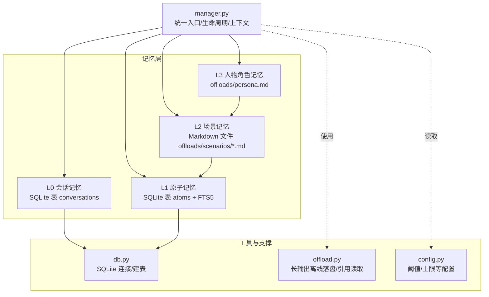
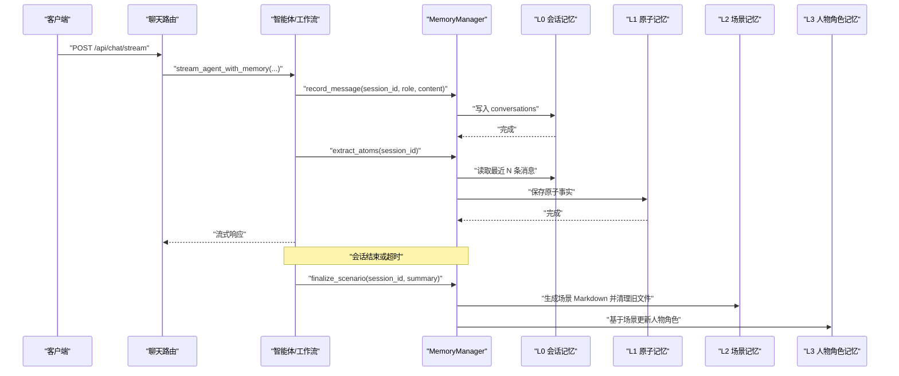
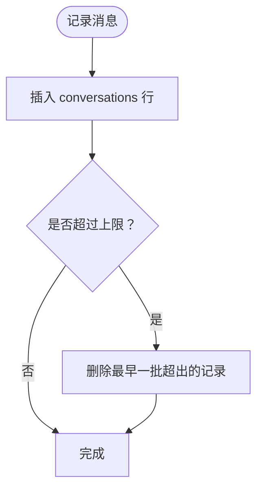
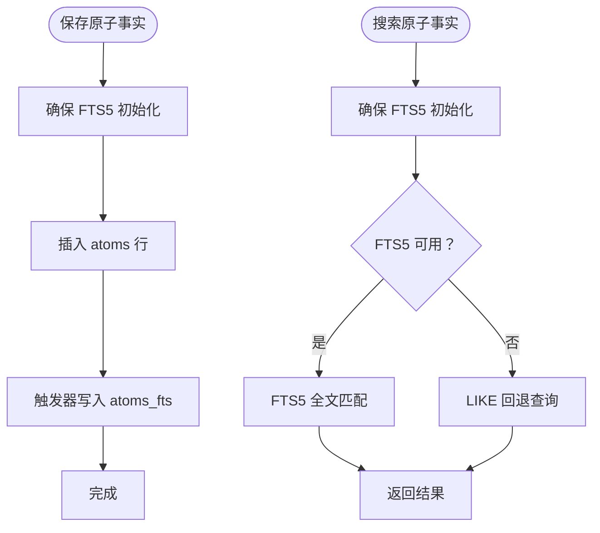
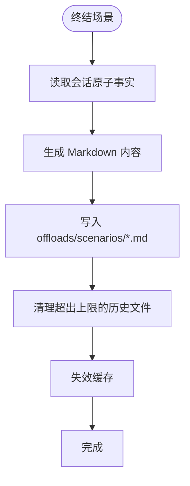
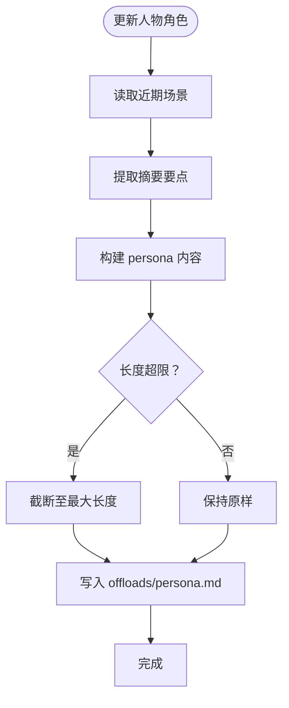
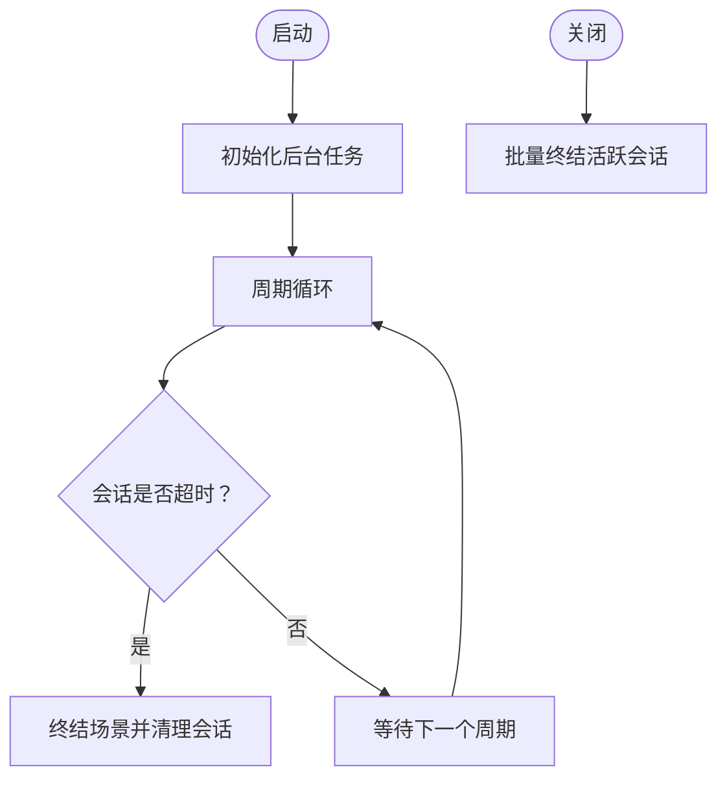
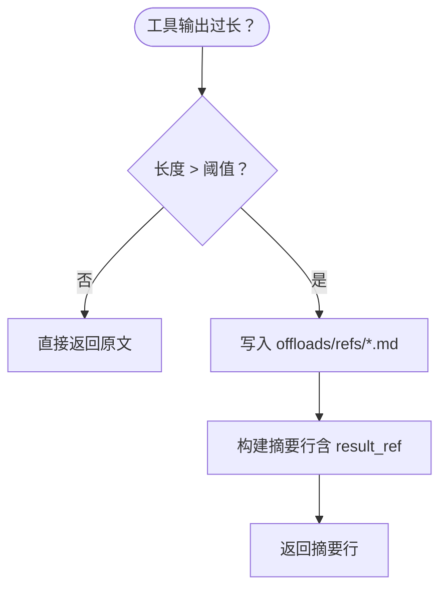
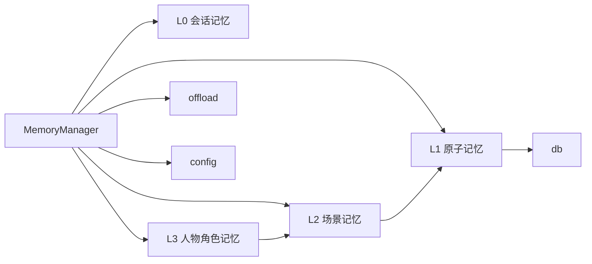

# 多层级记忆管理系统

<cite>
**本文引用的文件**
- [backend/app/memory/manager.py](file://backend/app/memory/manager.py)
- [backend/app/memory/l0_conversation.py](file://backend/app/memory/l0_conversation.py)
- [backend/app/memory/l1_atom.py](file://backend/app/memory/l1_atom.py)
- [backend/app/memory/l2_scenario.py](file://backend/app/memory/l2_scenario.py)
- [backend/app/memory/l3_persona.py](file://backend/app/memory/l3_persona.py)
- [backend/app/memory/offload.py](file://backend/app/memory/offload.py)
- [backend/app/memory/db.py](file://backend/app/memory/db.py)
- [backend/app/config.py](file://backend/app/config.py)
- [backend/app/main.py](file://backend/app/main.py)
- [backend/app/routers/chat.py](file://backend/app/routers/chat.py)
- [backend/data/articles/agent-memory-system.md](file://backend/data/articles/agent-memory-system.md)
- [backend/tests/test_memory.py](file://backend/tests/test_memory.py)
</cite>

## 目录
1. [引言](#引言)
2. [项目结构](#项目结构)
3. [核心组件](#核心组件)
4. [架构总览](#架构总览)
5. [详细组件分析](#详细组件分析)
6. [依赖关系分析](#依赖关系分析)
7. [性能考虑](#性能考虑)
8. [故障排查指南](#故障排查指南)
9. [结论](#结论)
10. [附录](#附录)

## 引言
本文件面向“多层级记忆管理系统”的架构与实现，围绕 L0 会话记忆、L1 原子记忆、L2 场景记忆、L3 人物角色记忆四层设计，系统阐述其数据结构、存储机制、生命周期管理与持久化策略；解释层级间的继承关系与数据流转过程；说明检索机制与上下文选择策略；并给出性能优化建议与实际使用场景及配置示例，帮助开发者高效利用多层级记忆提升 AI 交互体验。

## 项目结构
后端采用分层模块组织，记忆系统位于 backend/app/memory 下，包含：
- L0 会话记忆：SQLite 表 conversations，记录原始对话
- L1 原子记忆：SQLite 表 atoms + FTS5 全文索引，记录三元组事实
- L2 场景记忆：Markdown 文件 offloads/scenarios，按会话归档
- L3 人物角色记忆：内存级文本片段，写入 offloads/persona.md
- offload：长输出离线落盘与引用读取
- db：SQLite 连接池与表初始化
- manager：统一入口，协调各层生命周期与上下文拼装

图表来源
- [backend/app/memory/manager.py:20-129](file://backend/app/memory/manager.py#L20-L129)
- [backend/app/memory/l0_conversation.py:8-64](file://backend/app/memory/l0_conversation.py#L8-L64)
- [backend/app/memory/l1_atom.py:43-97](file://backend/app/memory/l1_atom.py#L43-L97)
- [backend/app/memory/l2_scenario.py:35-93](file://backend/app/memory/l2_scenario.py#L35-L93)
- [backend/app/memory/l3_persona.py:11-43](file://backend/app/memory/l3_persona.py#L11-L43)
- [backend/app/memory/offload.py:11-52](file://backend/app/memory/offload.py#L11-L52)
- [backend/app/memory/db.py:35-62](file://backend/app/memory/db.py#L35-L62)
- [backend/app/config.py:48-49](file://backend/app/config.py#L48-L49)

章节来源
- [backend/app/memory/manager.py:1-130](file://backend/app/memory/manager.py#L1-L130)
- [backend/app/memory/db.py:1-63](file://backend/app/memory/db.py#L1-L63)
- [backend/app/config.py:1-90](file://backend/app/config.py#L1-L90)

## 核心组件
- MemoryManager（统一入口）
  - 维护活跃会话字典，记录最近活跃时间
  - 提供记录消息、提取原子事实、终结场景、上下文拼装、离线落盘与读取等能力
  - 启动后台任务定期检查不活跃会话并自动终结
- L0 会话记忆（conversation）
  - 记录用户/助手消息，带 tokens、工具名与参数
  - 支持滑动窗口清理，避免无限增长
- L1 原子记忆（atom）
  - 三元组（主语-谓词-宾语），带置信度与来源引用
  - 延迟初始化 FTS5 虚表与触发器，支持全文检索与回退 LIKE 查询
- L2 场景记忆（scenario）
  - 会话结束时生成 Markdown 文档，汇总关键事实
  - 缓存最近文件列表，限制保留数量
- L3 人物角色记忆（persona）
  - 基于近期场景摘要生成人物角色描述，写入固定路径
  - 限制最大大小，防止膨胀
- offload
  - 当内容超过阈值时离线落盘，返回简要摘要行与引用
  - 读取时进行路径遍历保护
- db
  - 线程本地连接 + WAL 模式 + busy_timeout，保证并发读与写竞争下的稳定性
  - 初始化 conversations、atoms 表与索引
- config
  - 提供 offload_max_chars、session_max_messages 等关键阈值

章节来源
- [backend/app/memory/manager.py:20-129](file://backend/app/memory/manager.py#L20-L129)
- [backend/app/memory/l0_conversation.py:8-64](file://backend/app/memory/l0_conversation.py#L8-L64)
- [backend/app/memory/l1_atom.py:9-97](file://backend/app/memory/l1_atom.py#L9-L97)
- [backend/app/memory/l2_scenario.py:18-93](file://backend/app/memory/l2_scenario.py#L18-L93)
- [backend/app/memory/l3_persona.py:11-43](file://backend/app/memory/l3_persona.py#L11-L43)
- [backend/app/memory/offload.py:11-52](file://backend/app/memory/offload.py#L11-L52)
- [backend/app/memory/db.py:15-62](file://backend/app/memory/db.py#L15-L62)
- [backend/app/config.py:48-49](file://backend/app/config.py#L48-L49)

## 架构总览
下图展示从请求到记忆层的典型调用链路，以及各层之间的数据流向与依赖关系。

图表来源
- [backend/app/routers/chat.py:46-63](file://backend/app/routers/chat.py#L46-L63)
- [backend/app/memory/manager.py:54-77](file://backend/app/memory/manager.py#L54-L77)
- [backend/app/memory/l0_conversation.py:8-24](file://backend/app/memory/l0_conversation.py#L8-L24)
- [backend/app/memory/l1_atom.py:43-60](file://backend/app/memory/l1_atom.py#L43-L60)
- [backend/app/memory/l2_scenario.py:35-65](file://backend/app/memory/l2_scenario.py#L35-L65)
- [backend/app/memory/l3_persona.py:11-36](file://backend/app/memory/l3_persona.py#L11-L36)

## 详细组件分析

### L0 会话记忆（短期对话）
- 数据结构
  - 表：conversations（自增 id、会话标识、角色、内容、tokens、工具名/参数、时间戳）
  - 索引：按 session_id 建立索引
- 生命周期
  - 每条消息写入后，执行一次“最老消息清理”，确保不超过配置上限
- 存储与持久化
  - 单机 SQLite，线程本地连接，WAL 模式支持并发读
- 性能与优化
  - 通过滑动窗口控制存储规模，避免无限增长
  - 仅保留最近 N 条，降低查询成本

图表来源
- [backend/app/memory/l0_conversation.py:8-24](file://backend/app/memory/l0_conversation.py#L8-L24)
- [backend/app/memory/l0_conversation.py:47-64](file://backend/app/memory/l0_conversation.py#L47-L64)
- [backend/app/memory/db.py:39-48](file://backend/app/memory/db.py#L39-L48)

章节来源
- [backend/app/memory/l0_conversation.py:1-65](file://backend/app/memory/l0_conversation.py#L1-L65)
- [backend/app/memory/db.py:1-63](file://backend/app/memory/db.py#L1-L63)
- [backend/app/config.py](file://backend/app/config.py#L49)

### L1 原子记忆（中期事实）
- 数据结构
  - 表：atoms（自增 id、会话标识、主语、谓词、宾语、来源引用、置信度、时间戳）
  - FTS5 虚表 atoms_fts + 触发器，实现自动同步与全文检索
- 检索机制
  - 优先使用 FTS5 匹配，失败时回退 LIKE 查询
  - 对输入进行安全转义，避免特殊字符影响
- 生命周期
  - 由 L0 消息抽取生成，随会话推进不断累积
- 性能与优化
  - FTS5 + 触发器实现近实时索引，减少显式维护开销
  - 回退策略保障在异常情况下仍可检索

图表来源
- [backend/app/memory/l1_atom.py:9-41](file://backend/app/memory/l1_atom.py#L9-L41)
- [backend/app/memory/l1_atom.py:43-60](file://backend/app/memory/l1_atom.py#L43-L60)
- [backend/app/memory/l1_atom.py:63-87](file://backend/app/memory/l1_atom.py#L63-L87)

章节来源
- [backend/app/memory/l1_atom.py:1-98](file://backend/app/memory/l1_atom.py#L1-L98)
- [backend/app/memory/db.py:49-58](file://backend/app/memory/db.py#L49-L58)

### L2 场景记忆（中期聚合）
- 数据结构
  - 文件：offloads/scenarios/<session_id>_<date>.md
  - 内容：会话摘要 + 关键事实（L1 前若干条）
- 生命周期
  - 会话结束时生成；定期清理超出上限的历史文件
  - 列表缓存（带 TTL），避免频繁 IO
- 上下文拼装
  - 作为 L3 人物角色的记忆来源之一

图表来源
- [backend/app/memory/l2_scenario.py:35-65](file://backend/app/memory/l2_scenario.py#L35-L65)
- [backend/app/memory/l2_scenario.py:18-32](file://backend/app/memory/l2_scenario.py#L18-L32)
- [backend/app/memory/l2_scenario.py:80-93](file://backend/app/memory/l2_scenario.py#L80-L93)

章节来源
- [backend/app/memory/l2_scenario.py:1-94](file://backend/app/memory/l2_scenario.py#L1-L94)

### L3 人物角色记忆（长期画像）
- 数据结构
  - 文件：offloads/persona.md
  - 内容：近期场景摘要提炼出的用户画像要点
- 生命周期
  - 基于近期场景与原子事实增量更新
  - 写入前进行大小截断，防止膨胀
- 上下文拼装
  - 作为系统提示的一部分参与后续对话

图表来源
- [backend/app/memory/l3_persona.py:11-36](file://backend/app/memory/l3_persona.py#L11-L36)
- [backend/app/memory/l3_persona.py:39-43](file://backend/app/memory/l3_persona.py#L39-L43)

章节来源
- [backend/app/memory/l3_persona.py:1-44](file://backend/app/memory/l3_persona.py#L1-L44)

### 上下文拼装与检索策略
- 上下文拼装
  - 顺序：L3 人物角色 → 最近 L2 场景 → L0 会话（由具体实现决定）
  - 在 MemoryManager.get_context 中组合
- 检索选择
  - L1：对当前会话的事实进行快速检索（如意图识别、实体抽取）
  - L2：跨会话聚合检索（如历史模式匹配）
  - L3：全局风格/偏好检索（如语气、技术栈偏好）

章节来源
- [backend/app/memory/manager.py:42-50](file://backend/app/memory/manager.py#L42-L50)
- [backend/data/articles/agent-memory-system.md:12-39](file://backend/data/articles/agent-memory-system.md#L12-L39)

### 生命周期与后台任务
- 会话活跃度跟踪：每次消息记录都会刷新最后活跃时间
- 自动终结：超过不活跃阈值（分钟级）自动终结场景并清理会话
- 启动/关闭：应用启动时初始化后台任务；关闭时批量终结所有活跃会话

图表来源
- [backend/app/memory/manager.py:88-127](file://backend/app/memory/manager.py#L88-L127)
- [backend/app/main.py:171-211](file://backend/app/main.py#L171-L211)

章节来源
- [backend/app/memory/manager.py:27-127](file://backend/app/memory/manager.py#L27-L127)
- [backend/app/main.py:171-211](file://backend/app/main.py#L171-L211)

### 离线落盘与引用读取
- offload_if_needed：当内容长度超过阈值时，写入 offloads/refs/<file>，返回包含 result_ref 的摘要行
- read_ref：安全读取离线文件，防止路径穿越

图表来源
- [backend/app/memory/offload.py:11-37](file://backend/app/memory/offload.py#L11-L37)
- [backend/app/memory/offload.py:40-52](file://backend/app/memory/offload.py#L40-L52)

章节来源
- [backend/app/memory/offload.py:1-53](file://backend/app/memory/offload.py#L1-L53)
- [backend/app/config.py](file://backend/app/config.py#L48)

## 依赖关系分析
- 组件耦合
  - MemoryManager 作为门面，向上游路由暴露接口，向下游各层解耦
  - L1 依赖 db（atoms 表与 FTS5）、L2 依赖 L1、L3 依赖 L2
  - offload 与 config 独立存在，被其他模块复用
- 外部依赖
  - SQLite（内置）
  - Python 标准库（pathlib、threading、time 等）
- 循环依赖
  - 无循环依赖，层次清晰

图表来源
- [backend/app/memory/manager.py:6-11](file://backend/app/memory/manager.py#L6-L11)
- [backend/app/memory/l1_atom.py](file://backend/app/memory/l1_atom.py#L2)
- [backend/app/memory/l2_scenario.py](file://backend/app/memory/l2_scenario.py#L5)
- [backend/app/memory/l3_persona.py](file://backend/app/memory/l3_persona.py#L3)
- [backend/app/memory/offload.py](file://backend/app/memory/offload.py#L4)
- [backend/app/memory/db.py:1-6](file://backend/app/memory/db.py#L1-L6)
- [backend/app/config.py:1-10](file://backend/app/config.py#L1-L10)

章节来源
- [backend/app/memory/manager.py:1-130](file://backend/app/memory/manager.py#L1-L130)
- [backend/app/memory/l1_atom.py:1-98](file://backend/app/memory/l1_atom.py#L1-L98)
- [backend/app/memory/l2_scenario.py:1-94](file://backend/app/memory/l2_scenario.py#L1-L94)
- [backend/app/memory/l3_persona.py:1-44](file://backend/app/memory/l3_persona.py#L1-L44)
- [backend/app/memory/offload.py:1-53](file://backend/app/memory/offload.py#L1-L53)
- [backend/app/memory/db.py:1-63](file://backend/app/memory/db.py#L1-L63)
- [backend/app/config.py:1-90](file://backend/app/config.py#L1-L90)

## 性能考虑
- 存储规模控制
  - L0：通过滑动窗口清理，避免无限增长
  - L2：限制保留文件数量，定期清理旧文件
  - L3：限制最大长度，防止膨胀
- 并发与锁
  - SQLite 使用线程本地连接 + WAL 模式 + busy_timeout，提升并发读取与写入稳定性
- 检索效率
  - L1 使用 FTS5 + 触发器，近实时索引；失败时回退 LIKE，保证可用性
- 后台任务
  - 不活跃会话自动终结，释放资源
- I/O 优化
  - L2 场景文件列表缓存（TTL），减少目录扫描

章节来源
- [backend/app/memory/l0_conversation.py:47-64](file://backend/app/memory/l0_conversation.py#L47-L64)
- [backend/app/memory/l2_scenario.py:18-32](file://backend/app/memory/l2_scenario.py#L18-L32)
- [backend/app/memory/l3_persona.py:28-29](file://backend/app/memory/l3_persona.py#L28-L29)
- [backend/app/memory/db.py:15-32](file://backend/app/memory/db.py#L15-L32)
- [backend/app/memory/l1_atom.py:63-87](file://backend/app/memory/l1_atom.py#L63-L87)
- [backend/app/memory/manager.py:104-127](file://backend/app/memory/manager.py#L104-L127)

## 故障排查指南
- L1 FTS5 初始化失败
  - 现象：FTS5 初始化警告，检索回退到 LIKE
  - 排查：确认 SQLite 版本支持 FTS5；检查权限与磁盘空间
- L2 场景文件写入失败
  - 现象：日志报错，文件未生成
  - 排查：检查 offloads/scenarios 目录权限与磁盘空间
- L3 人物角色写入失败
  - 现象：日志报错，文件未更新
  - 排查：检查 offloads/persona.md 所在目录权限
- offload 路径穿越保护
  - 现象：读取返回错误提示
  - 排查：确认引用路径在允许范围内
- 后台任务异常重启
  - 现象：日志显示任务被取消并重启
  - 排查：检查事件循环状态与异常堆栈

章节来源
- [backend/app/memory/l1_atom.py:39-40](file://backend/app/memory/l1_atom.py#L39-L40)
- [backend/app/memory/l2_scenario.py:62-63](file://backend/app/memory/l2_scenario.py#L62-L63)
- [backend/app/memory/l3_persona.py:35-36](file://backend/app/memory/l3_persona.py#L35-L36)
- [backend/app/memory/offload.py:43-45](file://backend/app/memory/offload.py#L43-L45)
- [backend/app/memory/manager.py:121-123](file://backend/app/memory/manager.py#L121-L123)

## 结论
该多层级记忆系统以 L0-L3 分层设计实现从短期对话到长期画像的完整记忆闭环：L0 保证上下文连续性，L1 提升检索效率，L2 聚合跨会话模式，L3 形成个性化风格。通过 SQLite+WAL、FTS5、滑动窗口与后台清理等手段，在单机环境下实现了高可用与高性能。结合 offload 机制与合理的阈值配置，可在大模型交互中显著提升稳定性与用户体验。

## 附录

### 使用场景与配置示例
- 场景一：对话增强（RAG + 记忆）
  - 流程：路由接收请求 → 创建智能体 → 流式输出 → 记录消息 → 抽取原子事实 → 组装上下文
  - 关键点：启用 MemoryManager.record_message 与 extract_atoms；在上下文中拼装 L3/L2
- 场景二：会话超时自动终结
  - 流程：后台任务检测不活跃会话 → 自动终结场景 → 清理会话
  - 关键点：调整不活跃阈值与清理间隔
- 场景三：工具输出过大
  - 流程：工具输出过长 → offload 离线落盘 → 返回摘要行 → 需要时读取引用
  - 关键点：设置 offload_max_chars；在工具调用后统一处理

章节来源
- [backend/app/routers/chat.py:46-63](file://backend/app/routers/chat.py#L46-L63)
- [backend/app/memory/manager.py:54-77](file://backend/app/memory/manager.py#L54-L77)
- [backend/app/memory/offload.py:11-37](file://backend/app/memory/offload.py#L11-L37)
- [backend/app/config.py](file://backend/app/config.py#L48)

### 配置项参考
- offload_max_chars：长输出离线阈值
- session_max_messages：会话消息上限
- 其他相关配置：见配置文件

章节来源
- [backend/app/config.py:48-49](file://backend/app/config.py#L48-L49)

### 测试要点
- L0：记录与检索、清理逻辑
- L1：保存与搜索、FTS5 初始化与回退
- L2：场景生成、文件清理、缓存失效
- L3：人物角色更新与读取
- offload：短内容不离线、长内容离线与引用读取

章节来源
- [backend/tests/test_memory.py:14-62](file://backend/tests/test_memory.py#L14-L62)