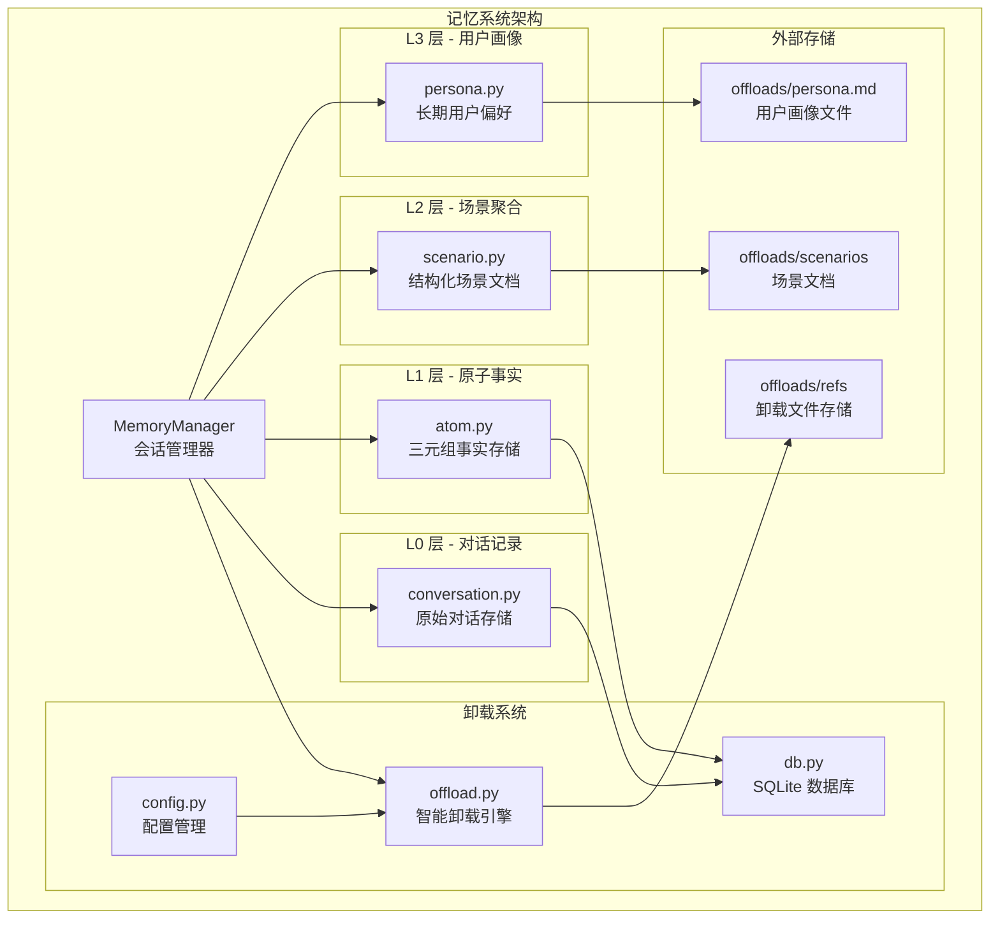
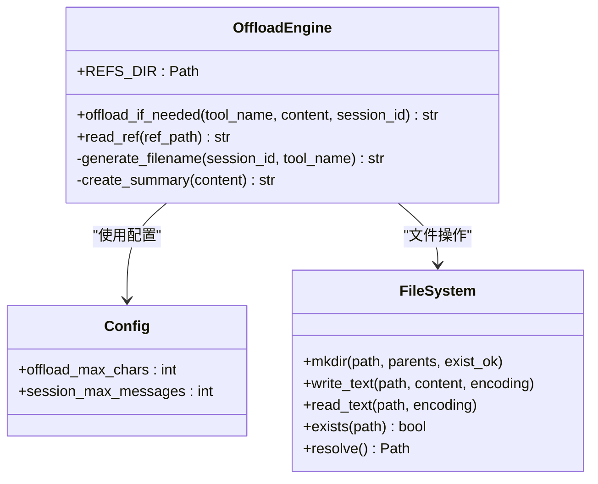
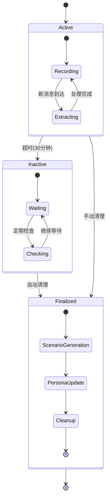
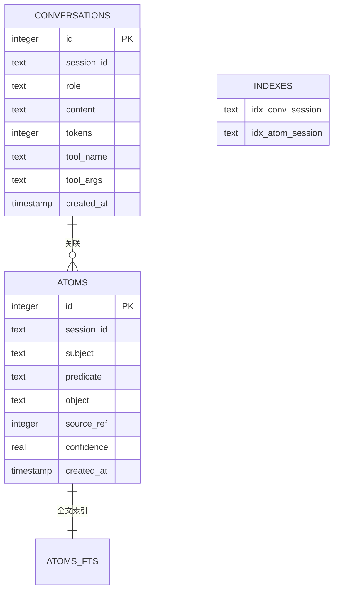
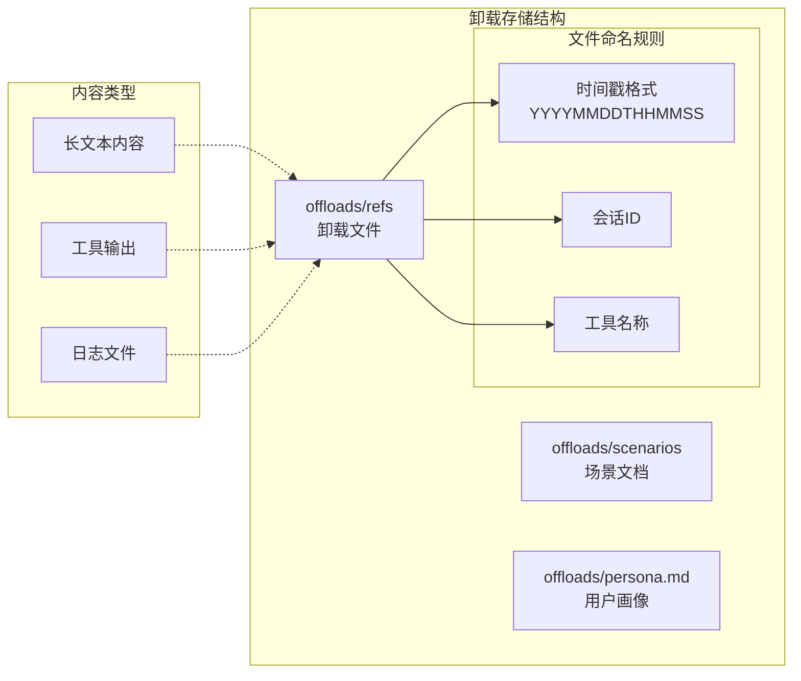
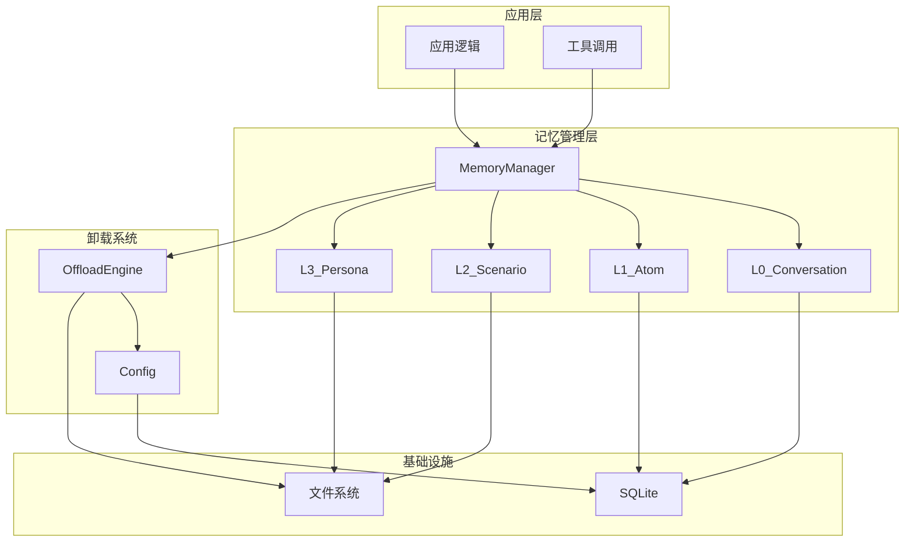

# 记忆卸载系统

<cite>
**本文档引用的文件**
- [offload.py](file://backend/app/memory/offload.py)
- [manager.py](file://backend/app/memory/manager.py)
- [l0_conversation.py](file://backend/app/memory/l0_conversation.py)
- [l1_atom.py](file://backend/app/memory/l1_atom.py)
- [l2_scenario.py](file://backend/app/memory/l2_scenario.py)
- [l3_persona.py](file://backend/app/memory/l3_persona.py)
- [db.py](file://backend/app/memory/db.py)
- [config.py](file://backend/app/config.py)
- [test_memory.py](file://backend/tests/test_memory.py)
- [test_memory_extended.py](file://backend/tests/test_memory_extended.py)
- [test_manager.py](file://backend/tests/test_manager.py)
- [agent-memory-system.md](file://backend/data/articles/agent-memory-system.md)
</cite>

## 目录
1. [简介](#简介)
2. [项目结构](#项目结构)
3. [核心组件](#核心组件)
4. [架构概览](#架构概览)
5. [详细组件分析](#详细组件分析)
6. [依赖关系分析](#依赖关系分析)
7. [性能考虑](#性能考虑)
8. [故障排除指南](#故障排除指南)
9. [结论](#结论)

## 简介

记忆卸载系统是 Aureon AI Agent 平台的核心组件，专门设计用于处理超出内存限制的大规模记忆数据。该系统通过智能的外部存储机制、引用管理和数据访问优化，实现了高效的内存优化和数据持久化。

系统采用四层记忆架构，从短期对话记录到长期用户画像，每一层都有特定的存储策略和访问模式。记忆卸载作为第四层的重要组成部分，负责处理工具调用产生的大量输出内容，通过阈值检测、自动卸载和引用管理，确保系统在处理大规模数据时仍能保持高性能。

## 项目结构

记忆卸载系统位于后端应用的 memory 模块中，采用模块化设计，每个功能模块都有明确的职责分工：



**图表来源**
- [manager.py:20-130](file://backend/app/memory/manager.py#L20-L130)
- [offload.py:1-53](file://backend/app/memory/offload.py#L1-L53)
- [db.py:1-63](file://backend/app/memory/db.py#L1-L63)

**章节来源**
- [manager.py:1-130](file://backend/app/memory/manager.py#L1-L130)
- [offload.py:1-53](file://backend/app/memory/offload.py#L1-L53)
- [db.py:1-63](file://backend/app/memory/db.py#L1-L63)

## 核心组件

记忆卸载系统由以下核心组件构成：

### 1. 卸载引擎 (Offload Engine)
负责检测内容大小并执行智能卸载操作，包含阈值检查、文件创建和引用生成功能。

### 2. 会话管理器 (Memory Manager)
协调各个记忆层次的操作，管理会话生命周期，处理后台清理任务。

### 3. 数据持久化层
基于 SQLite 的轻量级数据库，支持多线程连接和并发读取。

### 4. 外部存储系统
专门的文件系统存储，用于存放超过阈值的大型内容。

**章节来源**
- [offload.py:11-37](file://backend/app/memory/offload.py#L11-L37)
- [manager.py:20-130](file://backend/app/memory/manager.py#L20-L130)
- [db.py:15-32](file://backend/app/memory/db.py#L15-L32)

## 架构概览

记忆卸载系统采用分层架构设计，每层都有特定的职责和优化策略：

```mermaid
sequenceDiagram
participant Tool as 工具调用
participant MM as 会话管理器
participant OFF as 卸载引擎
participant FS as 文件系统
participant DB as SQLite数据库
Tool->>MM : 调用工具并产生输出
MM->>OFF : offload_if_needed(工具名, 输出内容, 会话ID)
OFF->>OFF : 检查内容长度是否超过阈值
alt 内容过长
OFF->>FS : 创建卸载文件
FS-->>OFF : 返回文件路径
OFF->>OFF : 生成预览摘要
OFF-->>MM : 返回引用行(包含result_ref)
MM-->>Tool : 返回简化的响应
else 内容正常
OFF-->>MM : 返回原始内容
MM-->>Tool : 直接返回内容
end
Note over Tool,DB : 后续需要完整内容时
Tool->>MM : read_ref(文件路径)
MM->>OFF : read_ref(文件路径)
OFF->>FS : 读取文件内容
FS-->>OFF : 返回文件内容
OFF-->>MM : 返回文件内容
MM-->>Tool : 提供完整数据
```

**图表来源**
- [offload.py:11-37](file://backend/app/memory/offload.py#L11-L37)
- [offload.py:40-52](file://backend/app/memory/offload.py#L40-L52)
- [manager.py:80-84](file://backend/app/memory/manager.py#L80-L84)

系统的核心设计理念是"按需加载"和"智能卸载"：

1. **智能阈值检测**: 基于配置的字符数阈值判断是否需要卸载
2. **自动文件管理**: 自动生成带时间戳的唯一文件名
3. **安全引用机制**: 使用相对路径和路径遍历保护
4. **延迟加载策略**: 只在需要时才读取大型文件内容

## 详细组件分析

### 卸载引擎 (Offload Engine)

卸载引擎是记忆卸载系统的核心组件，负责处理所有卸载相关操作：



**图表来源**
- [offload.py:8](file://backend/app/memory/offload.py#L8)
- [offload.py:11-37](file://backend/app/memory/offload.py#L11-L37)
- [offload.py:40-52](file://backend/app/memory/offload.py#L40-L52)

#### 关键特性

1. **阈值驱动的卸载**: 当内容长度超过 `settings.offload_max_chars` 时自动触发卸载
2. **安全的文件命名**: 使用 `session_id_tool_name_timestamp.md` 格式确保唯一性
3. **智能摘要生成**: 生成不超过200字符的预览摘要
4. **路径遍历防护**: 严格验证文件路径安全性

**章节来源**
- [offload.py:11-37](file://backend/app/memory/offload.py#L11-L37)
- [offload.py:40-52](file://backend/app/memory/offload.py#L40-L52)

### 会话管理器 (Memory Manager)

会话管理器协调整个记忆系统的操作，管理会话生命周期和后台任务：



**图表来源**
- [manager.py:16](file://backend/app/memory/manager.py#L16)
- [manager.py:104-127](file://backend/app/memory/manager.py#L104-L127)

#### 核心功能

1. **会话生命周期管理**: 跟踪会话活跃状态，自动超时清理
2. **原子提取**: 从对话中提取关键信息形成原子事实
3. **场景聚合**: 将原子事实组织成结构化场景文档
4. **用户画像更新**: 基于场景生成长期用户偏好描述

**章节来源**
- [manager.py:27-38](file://backend/app/memory/manager.py#L27-L38)
- [manager.py:60-71](file://backend/app/memory/manager.py#L60-L71)
- [manager.py:74-77](file://backend/app/memory/manager.py#L74-L77)

### 数据持久化层

系统使用 SQLite 作为主要数据存储，支持多线程并发访问：



**图表来源**
- [db.py:38-61](file://backend/app/memory/db.py#L38-L61)

#### 设计特点

1. **线程安全**: 每个线程拥有独立的数据库连接
2. **并发优化**: 启用 WAL 模式支持并发读取
3. **自动初始化**: 连接时自动创建必要的表和索引
4. **全文搜索**: L1 层支持 FTS5 全文搜索引擎

**章节来源**
- [db.py:15-32](file://backend/app/memory/db.py#L15-L32)
- [db.py:35-62](file://backend/app/memory/db.py#L35-L62)

### 外部存储系统

系统使用专门的文件系统存储超过阈值的内容，采用分层目录结构：



**图表来源**
- [offload.py:8](file://backend/app/memory/offload.py#L8)
- [l2_scenario.py:9](file://backend/app/memory/l2_scenario.py#L9)
- [l3_persona.py:7](file://backend/app/memory/l3_persona.py#L7)

#### 存储策略

1. **目录隔离**: 不同类型的卸载内容存储在不同目录
2. **时间管理**: 自动清理超出保留期限的文件
3. **大小限制**: L3 层用户画像最大 2KB
4. **场景缓存**: L2 层场景文件列表缓存提高访问性能

**章节来源**
- [l2_scenario.py:18-33](file://backend/app/memory/l2_scenario.py#L18-L33)
- [l3_persona.py:28-36](file://backend/app/memory/l3_persona.py#L28-L36)

## 依赖关系分析

记忆卸载系统各组件之间的依赖关系如下：



**图表来源**
- [manager.py:6-11](file://backend/app/memory/manager.py#L6-L11)
- [offload.py:4](file://backend/app/memory/offload.py#L4)
- [db.py:5-6](file://backend/app/memory/db.py#L5-L6)

### 关键依赖点

1. **配置依赖**: 所有组件都依赖全局配置设置
2. **数据库依赖**: L0 和 L1 层直接依赖 SQLite 数据库
3. **文件系统依赖**: 卸载功能依赖文件系统存储
4. **会话管理依赖**: 各层记忆都依赖会话管理器的状态

**章节来源**
- [manager.py:1-13](file://backend/app/memory/manager.py#L1-L13)
- [offload.py:1-6](file://backend/app/memory/offload.py#L1-L6)

## 性能考虑

记忆卸载系统在设计时充分考虑了性能优化：

### 内存优化策略

1. **智能阈值控制**: 默认 1000 字符阈值平衡内存使用和功能完整性
2. **延迟加载机制**: 只在需要时才读取大型文件内容
3. **会话超时清理**: 30 分钟不活跃自动清理，释放内存资源

### I/O 性能优化

1. **文件缓存**: L2 层场景文件列表缓存 60 秒
2. **批量清理**: 定期清理过期文件，避免磁盘空间膨胀
3. **异步处理**: 后台任务独立运行，不影响主线程性能

### 数据库性能优化

1. **WAL 模式**: 支持并发读取，提高数据库吞吐量
2. **连接池**: 线程本地连接，避免跨线程竞争
3. **索引优化**: 为常用查询字段建立索引

**章节来源**
- [config.py:48-49](file://backend/app/config.py#L48-L49)
- [manager.py:16-17](file://backend/app/memory/manager.py#L16-L17)
- [l2_scenario.py:12-15](file://backend/app/memory/l2_scenario.py#L12-L15)
- [db.py:29-30](file://backend/app/memory/db.py#L29-L30)

## 故障排除指南

### 常见问题及解决方案

#### 卸载文件无法读取

**问题症状**: `read_ref` 返回错误信息

**可能原因**:
1. 路径遍历攻击尝试
2. 文件不存在或权限不足
3. 编码问题导致读取失败

**解决步骤**:
1. 检查文件路径是否在允许范围内
2. 验证文件是否存在且可读
3. 确认文件编码为 UTF-8

#### 内存使用过高

**问题症状**: 应用内存持续增长

**可能原因**:
1. 会话清理任务未启动
2. 卸载阈值设置过低
3. 大量长文本内容未被卸载

**解决步骤**:
1. 确认后台清理任务已启动
2. 调整 `offload_max_chars` 配置
3. 检查工具输出是否过大

#### 数据库连接问题

**问题症状**: SQLite 操作失败

**可能原因**:
1. 数据库文件损坏
2. 权限不足
3. 并发访问冲突

**解决步骤**:
1. 检查数据库文件权限
2. 重启应用重新初始化连接
3. 检查磁盘空间是否充足

**章节来源**
- [offload.py:40-52](file://backend/app/memory/offload.py#L40-L52)
- [manager.py:104-127](file://backend/app/memory/manager.py#L104-L127)
- [db.py:25-32](file://backend/app/memory/db.py#L25-L32)

## 结论

记忆卸载系统通过智能的阈值检测、安全的文件管理和高效的引用机制，成功解决了大规模记忆数据的内存优化问题。系统的设计充分考虑了性能、安全性和可维护性，在保证功能完整性的同时实现了高效的资源利用。

### 主要优势

1. **智能卸载**: 自动识别和处理超大内容，无需人工干预
2. **安全可靠**: 严格的路径验证和错误处理机制
3. **性能优异**: 延迟加载和缓存策略确保高响应速度
4. **易于扩展**: 模块化设计便于添加新的卸载策略

### 应用场景

该系统特别适用于需要处理大量对话历史、工具输出和用户交互数据的 AI 应用，能够有效支持：

- 大规模客服机器人
- 智能助手应用
- 数据分析工具
- 内容创作平台

通过合理的配置和监控，记忆卸载系统能够在各种生产环境中稳定运行，为用户提供流畅的交互体验。