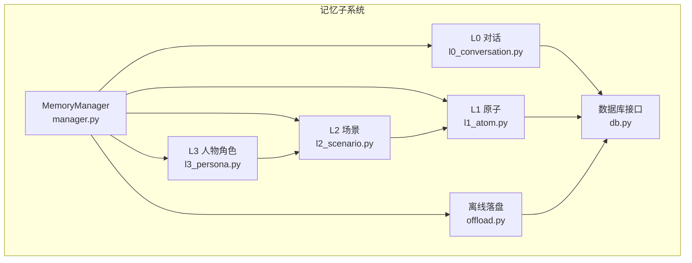
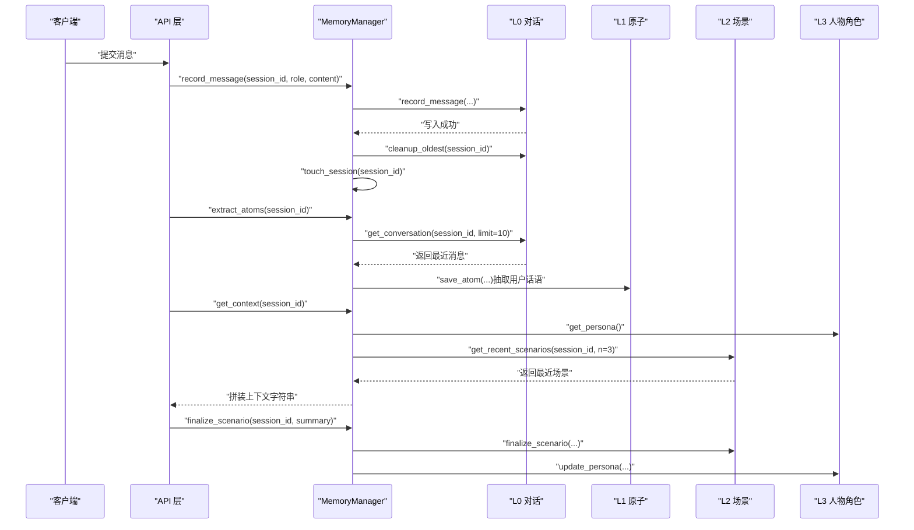
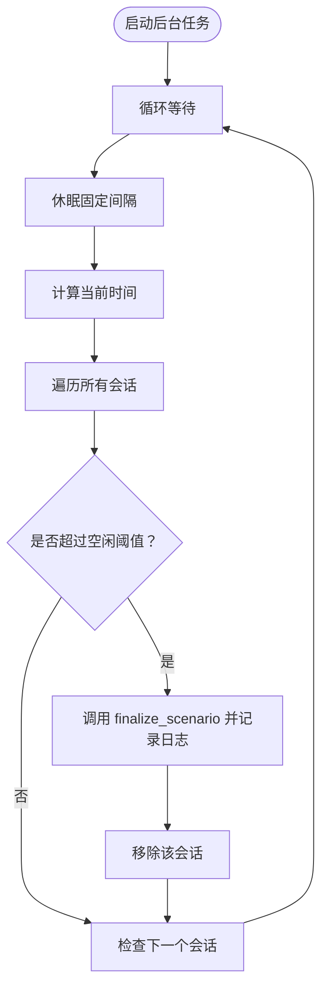
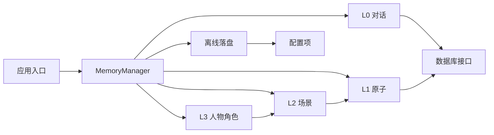

# 记忆管理器

<cite>
**本文引用的文件**
- [backend/app/memory/manager.py](file://backend/app/memory/manager.py)
- [backend/app/memory/l0_conversation.py](file://backend/app/memory/l0_conversation.py)
- [backend/app/memory/l1_atom.py](file://backend/app/memory/l1_atom.py)
- [backend/app/memory/l2_scenario.py](file://backend/app/memory/l2_scenario.py)
- [backend/app/memory/l3_persona.py](file://backend/app/memory/l3_persona.py)
- [backend/app/memory/offload.py](file://backend/app/memory/offload.py)
- [backend/app/memory/db.py](file://backend/app/memory/db.py)
- [backend/app/config.py](file://backend/app/config.py)
- [backend/app/main.py](file://backend/app/main.py)
- [backend/tests/test_manager.py](file://backend/tests/test_manager.py)
</cite>

## 目录
1. [简介](#简介)
2. [项目结构](#项目结构)
3. [核心组件](#核心组件)
4. [架构总览](#架构总览)
5. [详细组件分析](#详细组件分析)
6. [依赖分析](#依赖分析)
7. [性能考虑](#性能考虑)
8. [故障排查指南](#故障排查指南)
9. [结论](#结论)
10. [附录：代码示例路径](#附录代码示例路径)

## 简介
本文件面向“记忆管理器”的技术文档，聚焦其作为多层级记忆协调中心的设计与实现。记忆管理器负责：
- 会话生命周期管理：创建、活跃跟踪、自动清理与最终化
- 多层级记忆协作：L0 对话、L1 原子事实、L2 场景、L3 人物角色的协同与数据流转
- 后台任务调度：周期性清理、会话超时检测、资源回收
- 资源清理机制：对话上限清理、场景文件归档与裁剪、人物角色文件更新

记忆管理器通过统一入口协调各层级模块，确保上下文生成、记忆提取与持久化的一致性，并在应用启动与关闭阶段完成必要的初始化与收尾。

## 项目结构
记忆管理器相关代码集中于后端模块 backend/app/memory 下，包含：
- manager.py：记忆管理器主体类与后台任务
- l0_conversation.py：L0 对话层（消息写入、读取、清理）
- l1_atom.py：L1 原子事实层（事实存储、全文检索、会话聚合）
- l2_scenario.py：L2 场景层（场景文件生成、最近场景读取、过期清理）
- l3_persona.py：L3 人物角色层（基于场景摘要生成与裁剪）
- offload.py：大文本离线落盘与引用读取
- db.py：SQLite 连接与表初始化
- config.py：配置项（如会话最大消息数、离线阈值等）

图表来源
- [backend/app/memory/manager.py:20-129](file://backend/app/memory/manager.py#L20-L129)
- [backend/app/memory/l0_conversation.py:8-65](file://backend/app/memory/l0_conversation.py#L8-L65)
- [backend/app/memory/l1_atom.py:43-98](file://backend/app/memory/l1_atom.py#L43-L98)
- [backend/app/memory/l2_scenario.py:35-94](file://backend/app/memory/l2_scenario.py#L35-L94)
- [backend/app/memory/l3_persona.py:11-44](file://backend/app/memory/l3_persona.py#L11-L44)
- [backend/app/memory/offload.py:11-53](file://backend/app/memory/offload.py#L11-L53)
- [backend/app/memory/db.py:15-63](file://backend/app/memory/db.py#L15-L63)

章节来源
- [backend/app/memory/manager.py:1-130](file://backend/app/memory/manager.py#L1-L130)
- [backend/app/memory/l0_conversation.py:1-65](file://backend/app/memory/l0_conversation.py#L1-L65)
- [backend/app/memory/l1_atom.py:1-98](file://backend/app/memory/l1_atom.py#L1-L98)
- [backend/app/memory/l2_scenario.py:1-94](file://backend/app/memory/l2_scenario.py#L1-L94)
- [backend/app/memory/l3_persona.py:1-44](file://backend/app/memory/l3_persona.py#L1-L44)
- [backend/app/memory/offload.py:1-53](file://backend/app/memory/offload.py#L1-L53)
- [backend/app/memory/db.py:1-63](file://backend/app/memory/db.py#L1-L63)
- [backend/app/config.py:48-49](file://backend/app/config.py#L48-L49)

## 核心组件
- MemoryManager：协调 L0-L3 的核心类，提供会话生命周期管理、上下文拼装、记忆提取、离线落盘与后台任务调度。
- L0 对话层：负责将每条消息持久化到 SQLite 表 conversations，并按配置进行上限清理。
- L1 原子层：将用户话语抽取为原子事实（subject/predicate/object），支持 FTS5 全文检索与回溯查询。
- L2 场景层：将会话中的原子事实汇总为 Markdown 场景文件，保留最近若干份并清理旧文件。
- L3 人物角色层：从最近场景中提炼摘要，生成人物角色文件，限制大小并缓存更新。
- 离线落盘：当工具输出超过阈值时，自动落盘并返回引用摘要；支持安全读取引用文件。
- 数据库接口：为各层提供线程本地连接、WAL 模式与索引，保证并发与一致性。

章节来源
- [backend/app/memory/manager.py:20-129](file://backend/app/memory/manager.py#L20-L129)
- [backend/app/memory/l0_conversation.py:8-65](file://backend/app/memory/l0_conversation.py#L8-L65)
- [backend/app/memory/l1_atom.py:9-98](file://backend/app/memory/l1_atom.py#L9-L98)
- [backend/app/memory/l2_scenario.py:18-94](file://backend/app/memory/l2_scenario.py#L18-L94)
- [backend/app/memory/l3_persona.py:11-44](file://backend/app/memory/l3_persona.py#L11-L44)
- [backend/app/memory/offload.py:11-53](file://backend/app/memory/offload.py#L11-L53)
- [backend/app/memory/db.py:15-63](file://backend/app/memory/db.py#L15-L63)

## 架构总览
记忆管理器在系统中的定位是“协调中心”，贯穿请求处理链路：
- 请求进入后，记录 L0 对话并触活会话
- 触发记忆提取流程，将最新用户消息转化为 L1 原子事实
- 在合适时机（如会话结束或超时）生成 L2 场景与 L3 人物角色
- 对超长内容进行离线落盘，避免内存压力
- 应用启动时初始化后台清理任务，关闭时批量刷新未完结场景

图表来源
- [backend/app/memory/manager.py:54-77](file://backend/app/memory/manager.py#L54-L77)
- [backend/app/memory/l0_conversation.py:27-35](file://backend/app/memory/l0_conversation.py#L27-L35)
- [backend/app/memory/l1_atom.py:43-60](file://backend/app/memory/l1_atom.py#L43-L60)
- [backend/app/memory/l2_scenario.py:35-66](file://backend/app/memory/l2_scenario.py#L35-L66)
- [backend/app/memory/l3_persona.py:39-43](file://backend/app/memory/l3_persona.py#L39-L43)

## 详细组件分析

### MemoryManager 类
职责与行为
- 会话生命周期管理：touch_session、get_active_sessions、clear_session
- 上下文拼装：get_context 组合 L3 人物角色与最近 L2 场景
- 记忆提取：extract_atoms 将最近用户消息抽取为 L1 原子事实
- 场景与人物角色：finalize_scenario 调用 L2/L3 完成最终化与更新
- 离线落盘：offload_if_needed、read_ref
- 后台任务：init_background_tasks 启动周期清理；flush_all_scenarios 关闭时批量刷新

内部状态
- _sessions：维护每个 session_id 的创建与最后活跃时间
- _scenario_task：后台清理任务句柄

关键流程图：周期清理任务

图表来源
- [backend/app/memory/manager.py:104-127](file://backend/app/memory/manager.py#L104-L127)

章节来源
- [backend/app/memory/manager.py:20-129](file://backend/app/memory/manager.py#L20-L129)

### L0 对话层（Conversations）
职责与行为
- 写入消息：record_message 将角色、内容、令牌数、工具名与参数持久化
- 读取对话：get_conversation 支持按会话 ID 与上限读取
- 清理策略：cleanup_oldest 基于配置的最大消息数删除最旧记录

复杂度与性能
- 写入与清理为 O(1) 插入与 O(k) 删除（k 为待删数量）
- 查询按会话索引，时间复杂度 O(log n + k)，其中 n 为该会话消息总数，k 为返回条数

章节来源
- [backend/app/memory/l0_conversation.py:8-65](file://backend/app/memory/l0_conversation.py#L8-L65)
- [backend/app/memory/db.py:35-63](file://backend/app/memory/db.py#L35-L63)
- [backend/app/config.py:48-49](file://backend/app/config.py#L48-L49)

### L1 原子层（Atoms）
职责与行为
- 初始化：_ensure_fts 创建 FTS5 虚表与触发器，失败时降级为 LIKE 查询
- 存储：save_atom 将三元组写入 atoms 表
- 检索：search_atoms 使用 FTS5 匹配，失败时回退 LIKE
- 聚合：get_atoms_by_session 返回某会话全部原子事实

复杂度与性能
- FTS5 匹配通常优于 LIKE，但需注意特殊字符转义
- 触发器保证 FTS 与原子表同步，写入开销略增

章节来源
- [backend/app/memory/l1_atom.py:9-98](file://backend/app/memory/l1_atom.py#L9-L98)
- [backend/app/memory/db.py:35-63](file://backend/app/memory/db.py#L35-L63)

### L2 场景层（Scenarios）
职责与行为
- 生成：finalize_scenario 将最近原子事实写入 Markdown 文件，含摘要与关键事实
- 读取：get_recent_scenarios 返回最近 N 份场景内容
- 清理：_cleanup_old_scenarios 仅保留最近 MAX_SCENARIOS 份并失效缓存

复杂度与性能
- 列表与排序受场景文件数量影响，缓存 TTL 降低频繁 IO
- 文件写入与删除为 O(1) 操作

章节来源
- [backend/app/memory/l2_scenario.py:18-94](file://backend/app/memory/l2_scenario.py#L18-L94)
- [backend/app/memory/l1_atom.py:90-98](file://backend/app/memory/l1_atom.py#L90-L98)

### L3 人物角色层（Persona）
职责与行为
- 更新：update_persona 从最近场景摘要提炼要点，生成人物角色文件，限制最大大小
- 读取：get_persona 返回当前人物角色内容

复杂度与性能
- 文本截断与编码处理为 O(n) 操作，n 为字符数

章节来源
- [backend/app/memory/l3_persona.py:11-44](file://backend/app/memory/l3_persona.py#L11-L44)
- [backend/app/memory/l2_scenario.py:68-77](file://backend/app/memory/l2_scenario.py#L68-L77)

### 离线落盘（Offload）
职责与行为
- 落盘：offload_if_needed 当内容长度超过阈值时写入文件并返回摘要行
- 读取：read_ref 安全读取引用文件，防止路径穿越

复杂度与性能
- 写入与读取为 O(n) 文本操作，n 为字符数
- 通过摘要行减少上下文携带量

章节来源
- [backend/app/memory/offload.py:11-53](file://backend/app/memory/offload.py#L11-L53)
- [backend/app/config.py:48-49](file://backend/app/config.py#L48-L49)

### 数据库接口（db.py）
职责与行为
- 线程本地连接：每个线程独立连接，避免跨线程共享
- WAL 模式：允许多读并发
- 表初始化：创建 conversations 与 atoms 表及索引

复杂度与性能
- 连接建立为惰性初始化，WAL 提升并发读性能

章节来源
- [backend/app/memory/db.py:15-63](file://backend/app/memory/db.py#L15-L63)

## 依赖分析
- MemoryManager 依赖 L0/L1/L2/L3/offload 模块与其公共接口
- L0/L1 依赖 db 获取连接并访问 SQLite
- L2 依赖 L1 的原子事实聚合
- L3 依赖 L2 的场景读取
- offload 依赖配置项决定阈值
- main.py 在启动时初始化后台任务，在关闭时刷新场景

图表来源
- [backend/app/memory/manager.py:6-11](file://backend/app/memory/manager.py#L6-L11)
- [backend/app/memory/l0_conversation.py:2-3](file://backend/app/memory/l0_conversation.py#L2-L3)
- [backend/app/memory/l1_atom.py](file://backend/app/memory/l1_atom.py#L2)
- [backend/app/memory/l2_scenario.py](file://backend/app/memory/l2_scenario.py#L5)
- [backend/app/memory/l3_persona.py](file://backend/app/memory/l3_persona.py#L3)
- [backend/app/memory/offload.py](file://backend/app/memory/offload.py#L4)
- [backend/app/config.py:48-49](file://backend/app/config.py#L48-L49)
- [backend/app/main.py:199-209](file://backend/app/main.py#L199-L209)

章节来源
- [backend/app/memory/manager.py:6-11](file://backend/app/memory/manager.py#L6-L11)
- [backend/app/main.py:199-209](file://backend/app/main.py#L199-L209)

## 性能考虑
- 线程本地连接与 WAL 模式提升并发读取吞吐
- L0 清理采用“超出阈值后批量删除”，避免逐条扫描
- L1 FTS5 优先匹配，失败回退 LIKE，兼顾准确性与可用性
- L2 场景文件缓存与定期失效，降低目录扫描成本
- 离线落盘阈值可配置，平衡上下文质量与内存占用
- 后台清理任务周期性运行，避免长时间运行导致内存泄漏

## 故障排查指南
常见问题与定位建议
- 会话未清理：确认后台任务是否启动，检查日志中“Background scenario cleanup task started”与“Auto-finalizing inactive session ...”
- 场景文件未生成：检查 L2 目录权限与磁盘空间，确认 finalize_scenario 是否被调用
- 人物角色未更新：检查 L3 文件是否存在与大小限制，确认最近场景是否可用
- L1 搜索异常：确认 FTS5 初始化是否成功，必要时允许回退到 LIKE
- 离线落盘失败：检查 offloads/refs 目录权限与磁盘空间，查看摘要行是否正确生成
- 启动/关闭异常：确认 main.py 中 init_background_tasks 与 flush_all_scenarios 是否被调用

章节来源
- [backend/app/memory/manager.py:88-127](file://backend/app/memory/manager.py#L88-L127)
- [backend/app/memory/l2_scenario.py:35-66](file://backend/app/memory/l2_scenario.py#L35-L66)
- [backend/app/memory/l3_persona.py:11-36](file://backend/app/memory/l3_persona.py#L11-L36)
- [backend/app/memory/l1_atom.py:9-41](file://backend/app/memory/l1_atom.py#L9-L41)
- [backend/app/memory/offload.py:11-37](file://backend/app/memory/offload.py#L11-L37)
- [backend/app/main.py:199-209](file://backend/app/main.py#L199-L209)

## 结论
记忆管理器通过统一协调 L0-L3 四层记忆，实现了从消息记录、原子抽取、场景沉淀到人物角色生成的完整闭环。配合后台清理与离线落盘机制，既保障了上下文质量与响应性能，又有效控制了资源占用。在系统启动与关闭阶段的关键钩子确保了会话的完整性和一致性。

## 附录：代码示例路径
以下为具体使用场景的代码示例路径（不直接展示代码内容）：
- 初始化与启动
  - [应用入口启动后台任务](file://backend/app/main.py#L199)
  - [应用关闭时刷新场景](file://backend/app/main.py#L209)
- 会话管理
  - [记录消息并触活会话:54-58](file://backend/app/memory/manager.py#L54-L58)
  - [获取活跃会话列表:33-34](file://backend/app/memory/manager.py#L33-L34)
  - [清除指定会话:36-38](file://backend/app/memory/manager.py#L36-L38)
- 记忆提取
  - [抽取原子事实:60-71](file://backend/app/memory/manager.py#L60-L71)
  - [读取最近对话:27-35](file://backend/app/memory/l0_conversation.py#L27-L35)
  - [保存原子事实:43-60](file://backend/app/memory/l1_atom.py#L43-L60)
- 上下文拼装
  - [组合人物角色与场景:42-50](file://backend/app/memory/manager.py#L42-L50)
  - [读取最近场景:68-77](file://backend/app/memory/l2_scenario.py#L68-L77)
  - [读取人物角色:39-43](file://backend/app/memory/l3_persona.py#L39-L43)
- 场景与人物角色
  - [最终化场景与更新人物角色:74-77](file://backend/app/memory/manager.py#L74-L77)
  - [生成场景文件:35-66](file://backend/app/memory/l2_scenario.py#L35-L66)
  - [更新人物角色:11-36](file://backend/app/memory/l3_persona.py#L11-L36)
- 离线落盘
  - [按阈值落盘并返回摘要:11-37](file://backend/app/memory/offload.py#L11-L37)
  - [安全读取引用文件:40-53](file://backend/app/memory/offload.py#L40-L53)
- 数据库与配置
  - [获取线程本地连接与初始化表:15-63](file://backend/app/memory/db.py#L15-L63)
  - [会话最大消息数与离线阈值:48-49](file://backend/app/config.py#L48-L49)
- 测试参考
  - [会话生命周期与上下文拼装测试:10-76](file://backend/tests/test_manager.py#L10-L76)
  - [场景最终化与批量刷新测试:41-58](file://backend/tests/test_manager.py#L41-L58)
  - [离线落盘与读取测试:78-91](file://backend/tests/test_manager.py#L78-L91)