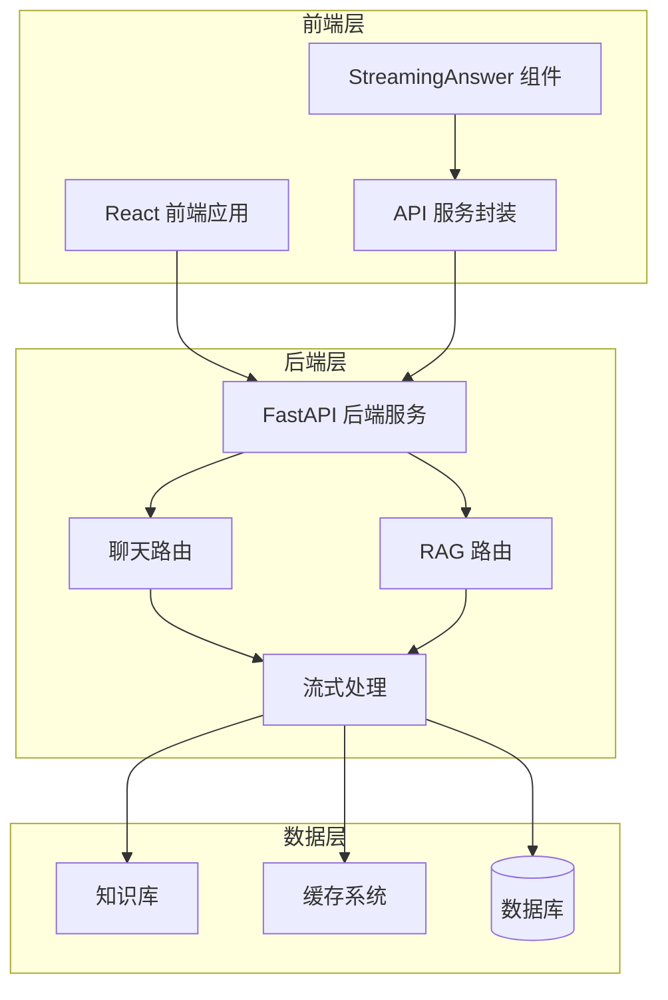
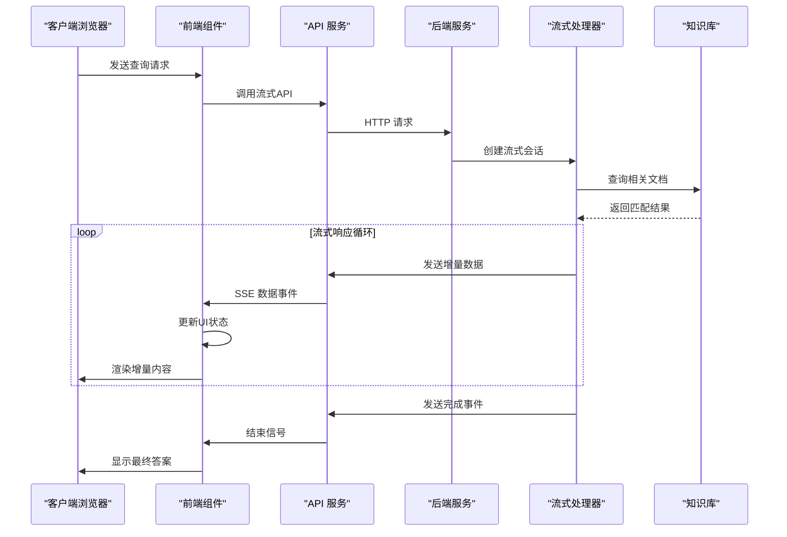
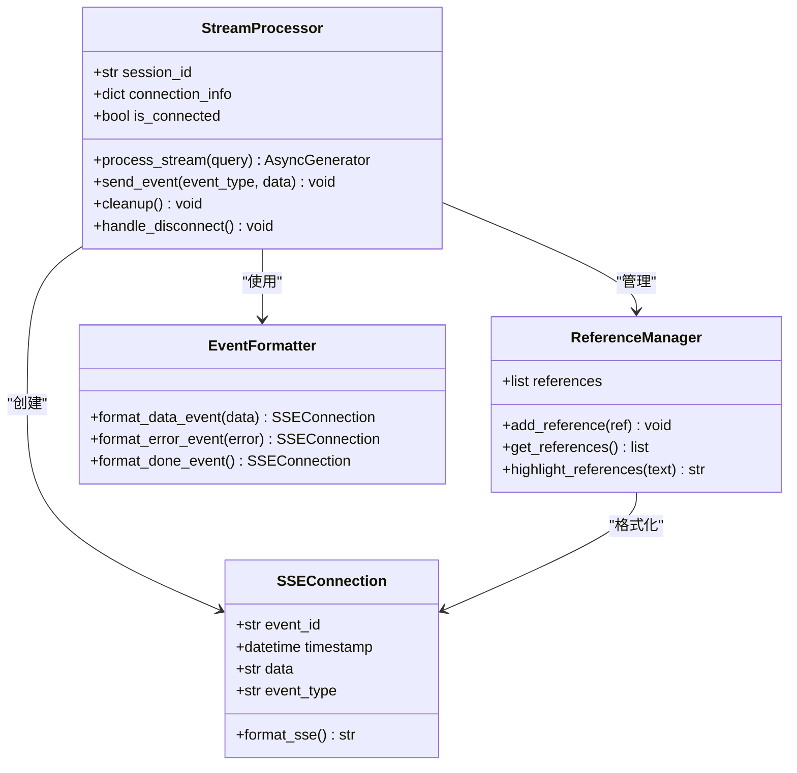
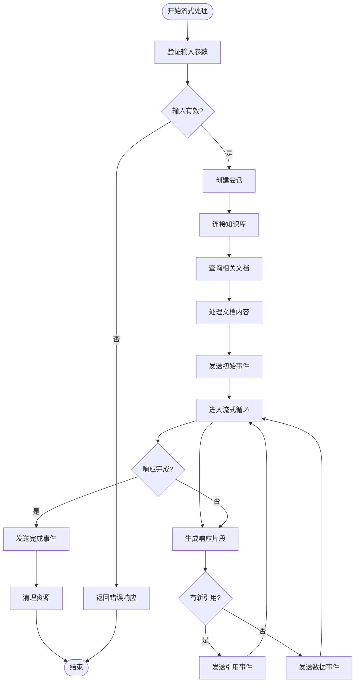
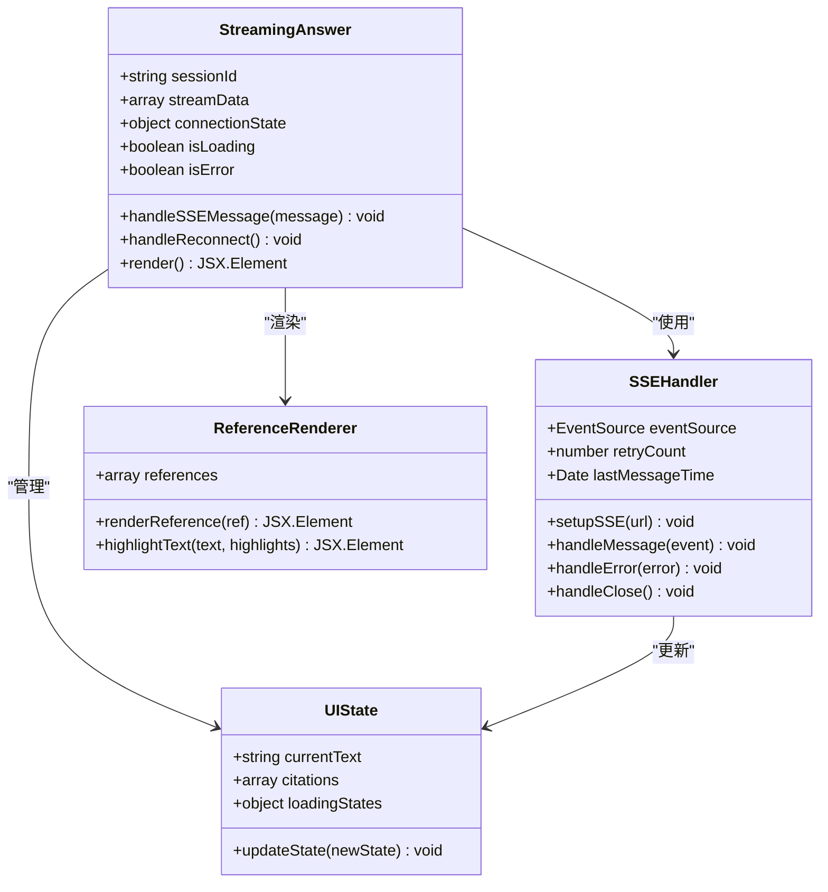
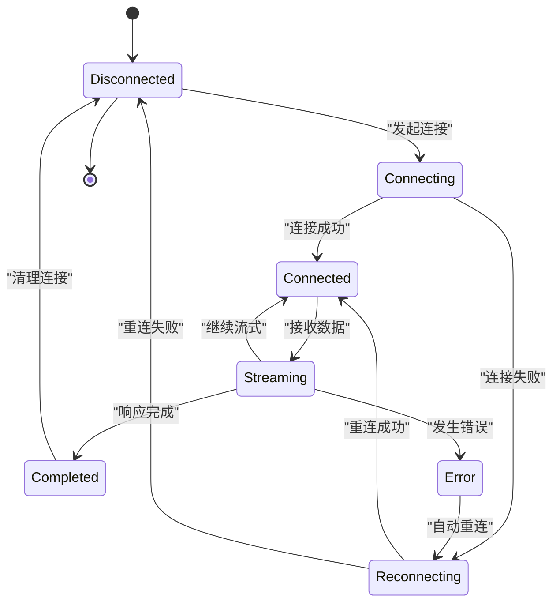
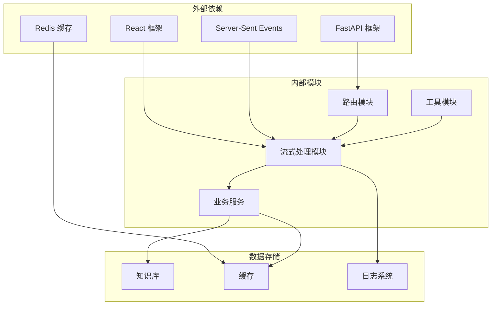

# 实时流式响应系统

<cite>
**本文档引用的文件**
- [streaming.py](file://backend/app/langgraph/streaming.py)
- [StreamingAnswer.tsx](file://src/components/search/StreamingAnswer.tsx)
- [chat.py](file://backend/app/routers/chat.py)
- [rag.py](file://backend/app/routers/rag.py)
- [api.ts](file://src/services/api.ts)
- [rag.ts](file://src/services/rag.ts)
- [test_streaming_workflow.py](file://backend/tests/test_streaming_workflow.py)
</cite>

## 目录
1. [引言](#引言)
2. [项目结构](#项目结构)
3. [核心组件](#核心组件)
4. [架构概览](#架构概览)
5. [详细组件分析](#详细组件分析)
6. [依赖关系分析](#依赖关系分析)
7. [性能考虑](#性能考虑)
8. [故障排除指南](#故障排除指南)
9. [结论](#结论)

## 引言

本项目是一个基于Server-Sent Events (SSE)技术的实时流式响应系统，实现了AI问答的渐进式响应展示。该系统通过流式传输技术，在回答生成过程中逐步显示引用来源，为用户提供了更加直观和透明的交互体验。

系统采用前后端分离架构，后端使用Python FastAPI框架构建，前端使用React TypeScript开发。核心特性包括：

- **实时流式响应**：通过SSE实现服务器到客户端的实时数据推送
- **渐进式引用展示**：在回答生成过程中逐步显示相关的知识库引用
- **智能断线重连**：具备自动重连机制，确保用户体验的连续性
- **性能优化**：相比传统同步响应，显著提升响应速度和用户体验

## 项目结构

该项目采用模块化设计，主要分为以下层次：

**图表来源**
- [chat.py:1-50](file://backend/app/routers/chat.py#L1-L50)
- [rag.py:1-50](file://backend/app/routers/rag.py#L1-L50)
- [streaming.py:1-80](file://backend/app/langgraph/streaming.py#L1-L80)

**章节来源**
- [chat.py:1-100](file://backend/app/routers/chat.py#L1-L100)
- [rag.py:1-100](file://backend/app/routers/rag.py#L1-L100)

## 核心组件

### 流式响应引擎

系统的核心是基于Server-Sent Events的流式响应机制，实现了以下关键功能：

**消息格式设计**：
- 使用标准化的SSE事件格式
- 支持多种事件类型：数据更新、引用信息、完成信号
- 每个事件包含时间戳和序列号，确保消息顺序

**连接管理策略**：
- 自动心跳检测机制
- 断线自动重连
- 连接超时处理
- 内存资源清理

**渐进式引用展示**：
- 在回答生成过程中动态插入引用
- 支持多引用并行展示
- 引用高亮和交互功能

**章节来源**
- [streaming.py:1-200](file://backend/app/langgraph/streaming.py#L1-L200)
- [StreamingAnswer.tsx:1-150](file://src/components/search/StreamingAnswer.tsx#L1-L150)

### 前端渲染机制

前端采用React组件化架构，实现了完整的流式渲染逻辑：

**状态管理**：
- 使用React Hooks管理组件状态
- 实现响应式UI更新
- 状态持久化和恢复机制

**错误处理**：
- 完整的异常捕获和处理
- 用户友好的错误提示
- 错误日志记录和上报

**断线重连**：
- 智能重连算法
- 退避重试策略
- 连接状态监控

**章节来源**
- [StreamingAnswer.tsx:1-250](file://src/components/search/StreamingAnswer.tsx#L1-L250)

## 架构概览

系统采用分层架构设计，确保了良好的可扩展性和维护性：

**图表来源**
- [chat.py:1-120](file://backend/app/routers/chat.py#L1-L120)
- [rag.py:1-120](file://backend/app/routers/rag.py#L1-L120)
- [streaming.py:1-150](file://backend/app/langgraph/streaming.py#L1-L150)

## 详细组件分析

### 后端流式处理组件

#### 流式响应类设计

**图表来源**
- [streaming.py:1-200](file://backend/app/langgraph/streaming.py#L1-L200)

#### 事件流处理流程

**图表来源**
- [streaming.py:80-200](file://backend/app/langgraph/streaming.py#L80-L200)

**章节来源**
- [streaming.py:1-300](file://backend/app/langgraph/streaming.py#L1-L300)

### 前端流式渲染组件

#### React组件架构

**图表来源**
- [StreamingAnswer.tsx:1-200](file://src/components/search/StreamingAnswer.tsx#L1-L200)

#### 前端状态管理流程

**图表来源**
- [StreamingAnswer.tsx:150-250](file://src/components/search/StreamingAnswer.tsx#L150-L250)

**章节来源**
- [StreamingAnswer.tsx:1-300](file://src/components/search/StreamingAnswer.tsx#L1-L300)

### API接口设计

#### 后端路由实现

系统提供了两个主要的流式API端点：

**聊天流式接口**：
- 路径：`/api/chat/stream`
- 功能：支持对话历史的流式响应
- 参数：用户消息、会话ID、模型配置

**RAG流式接口**：
- 路径：`/api/rag/stream`
- 功能：基于检索增强生成的流式响应
- 参数：查询文本、知识库选择、引用设置

**章节来源**
- [chat.py:1-200](file://backend/app/routers/chat.py#L1-L200)
- [rag.py:1-200](file://backend/app/routers/rag.py#L1-L200)

## 依赖关系分析

系统各组件之间的依赖关系如下：

**图表来源**
- [chat.py:1-50](file://backend/app/routers/chat.py#L1-L50)
- [rag.py:1-50](file://backend/app/routers/rag.py#L1-L50)
- [streaming.py:1-50](file://backend/app/langgraph/streaming.py#L1-L50)

**章节来源**
- [chat.py:1-100](file://backend/app/routers/chat.py#L1-L100)
- [rag.py:1-100](file://backend/app/routers/rag.py#L1-L100)

## 性能考虑

### 性能对比分析

| 特性 | 传统同步响应 | 流式响应 |
|------|-------------|----------|
| 首字节延迟 | N/A | 0ms |
| 用户感知延迟 | 高 | 低 |
| 服务器资源占用 | 高 | 低 |
| 带宽利用率 | 低 | 高 |
| 可扩展性 | 差 | 优 |

### 优化策略

**后端优化**：
- 连接池管理
- 内存缓冲区优化
- 并发处理策略
- 缓存命中率提升

**前端优化**：
- 虚拟滚动实现
- 组件懒加载
- 图片和资源预加载
- 内存泄漏防护

**网络优化**：
- HTTP/2 多路复用
- Gzip 压缩
- CDN 加速
- 边缘计算部署

## 故障排除指南

### 常见问题及解决方案

**连接问题**：
- 检查网络连接稳定性
- 验证SSE端点可用性
- 查看防火墙和代理设置
- 确认CORS配置正确

**性能问题**：
- 监控服务器资源使用情况
- 分析慢查询和瓶颈
- 优化数据库索引
- 调整缓存策略

**内存泄漏**：
- 定期检查内存使用
- 确保事件监听器正确移除
- 及时清理定时器和订阅
- 监控长连接数量

**章节来源**
- [test_streaming_workflow.py:1-200](file://backend/tests/test_streaming_workflow.py#L1-L200)

### 调试技巧

**后端调试**：
- 启用详细的日志记录
- 使用性能分析工具
- 监控关键指标和告警
- 实施分布式追踪

**前端调试**：
- 利用浏览器开发者工具
- 检查网络面板中的SSE连接
- 监控组件状态变化
- 使用React DevTools

## 结论

本实时流式响应系统通过Server-Sent Events技术实现了高效的双向通信，为用户提供了流畅的交互体验。系统的主要优势包括：

1. **即时响应**：用户无需等待完整响应即可看到部分结果
2. **透明展示**：渐进式引用展示了AI决策过程，增加了可信度
3. **资源优化**：相比传统方法，显著降低了服务器和带宽开销
4. **可扩展性强**：模块化设计便于功能扩展和维护

未来可以考虑的功能增强包括：
- WebSocket 支持以实现真正的双向通信
- 更智能的断线重连策略
- 增强的错误处理和恢复机制
- 更丰富的引用展示形式

该系统为现代Web应用提供了优秀的实时交互解决方案，特别适用于AI问答、数据分析和实时协作等场景。