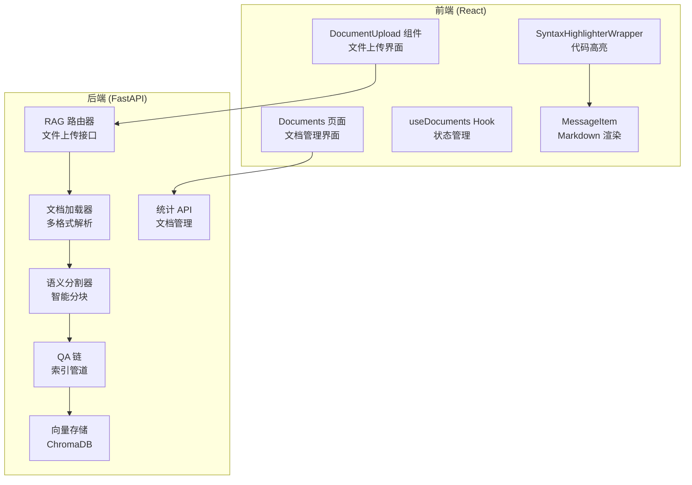
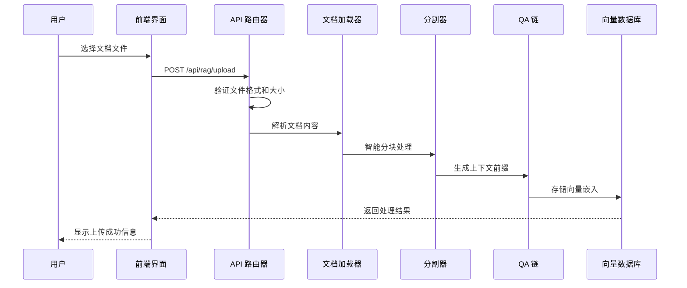
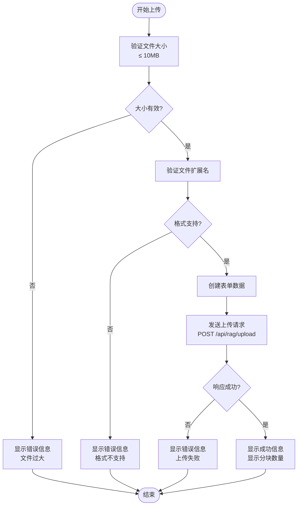
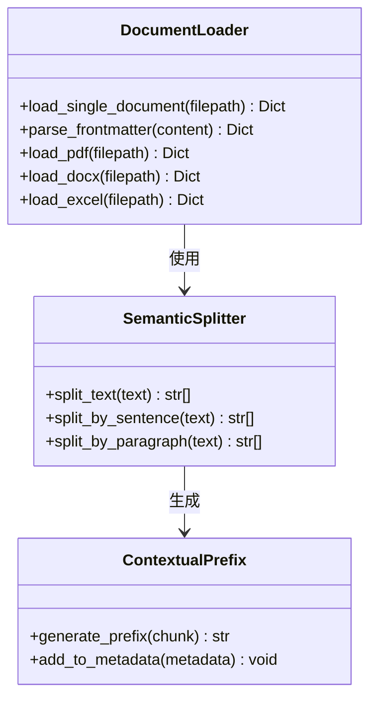
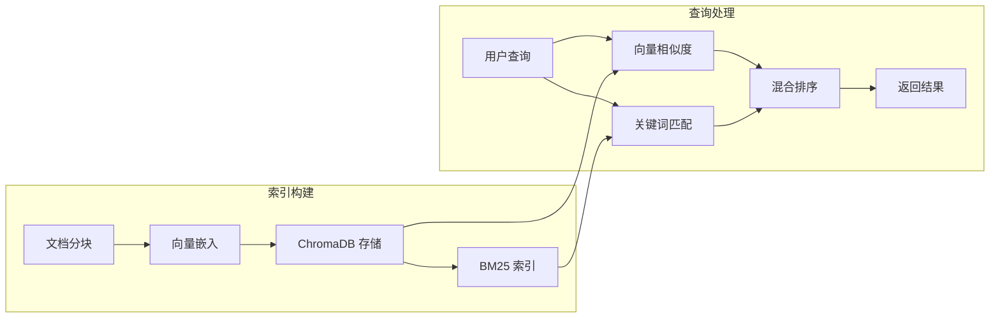
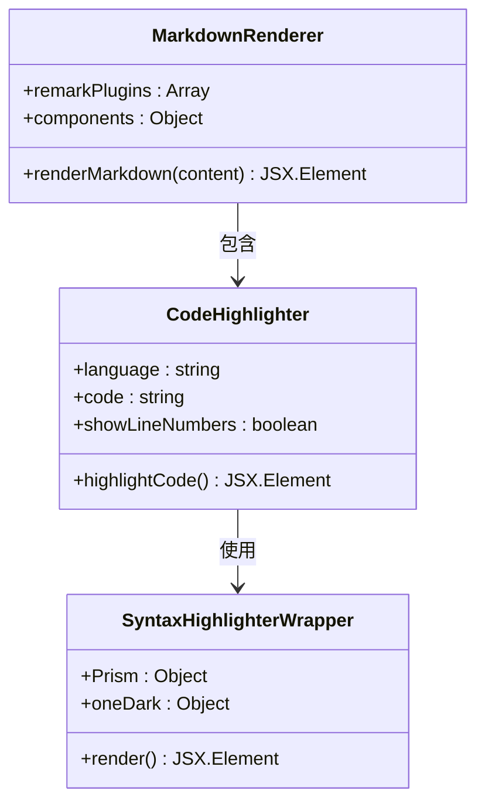
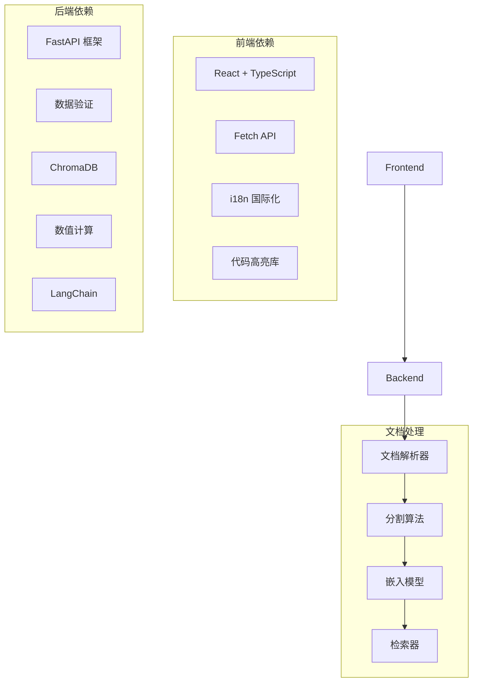

# 文档管理功能

<cite>
**本文档引用的文件**
- [DocumentUpload.tsx](file://src/components/documents/DocumentUpload.tsx)
- [Documents.tsx](file://src/pages/Documents.tsx)
- [useDocuments.ts](file://src/hooks/useDocuments.ts)
- [SyntaxHighlighterWrapper.tsx](file://src/components/SyntaxHighlighterWrapper.tsx)
- [MessageItem.tsx](file://src/components/MessageItem.tsx)
- [rag.py](file://backend/app/routers/rag.py)
- [loader.py](file://backend/app/rag/loader.py)
- [semantic_splitter.py](file://backend/app/rag/semantic_splitter.py)
- [vector_store.py](file://backend/app/rag/vector_store.py)
- [qa_chain.py](file://backend/app/rag/qa_chain.py)
- [rag_stats.py](file://backend/app/api/rag_stats.py)
- [2026-06-01-multi-format-docs.md](file://docs/superpowers/plans/2026-06-01-multi-format-docs.md)
- [benchmark_rag.py](file://backend/tests/benchmark_rag.py)
</cite>

## 目录
1. [简介](#简介)
2. [项目结构](#项目结构)
3. [核心组件](#核心组件)
4. [架构概览](#架构概览)
5. [详细组件分析](#详细组件分析)
6. [依赖关系分析](#依赖关系分析)
7. [性能考虑](#性能考虑)
8. [故障排除指南](#故障排除指南)
9. [结论](#结论)
10. [附录](#附录)

## 简介

文档管理功能是 Aureon 系统的核心组成部分，提供了完整的文档上传、索引、检索和管理能力。该系统支持多种文档格式，包括 Markdown、文本文件以及 PDF、DOCX、XLSX 等富文档格式，实现了从文档上传到智能检索的完整工作流程。

系统采用前后端分离架构，前端使用 React 和 TypeScript 构建用户界面，后端基于 Python FastAPI 提供 RESTful API 服务。整个文档处理流程包括文件验证、内容解析、智能分块、向量化存储和高效检索等关键环节。

## 项目结构

文档管理功能分布在前端和后端两个主要部分：

**图表来源**
- [DocumentUpload.tsx:1-231](file://src/components/documents/DocumentUpload.tsx#L1-L231)
- [Documents.tsx:116-170](file://src/pages/Documents.tsx#L116-L170)
- [rag.py:338-378](file://backend/app/routers/rag.py#L338-L378)

**章节来源**
- [DocumentUpload.tsx:1-231](file://src/components/documents/DocumentUpload.tsx#L1-L231)
- [Documents.tsx:116-170](file://src/pages/Documents.tsx#L116-L170)
- [rag.py:338-378](file://backend/app/routers/rag.py#L338-L378)

## 核心组件

### 文件上传组件

文件上传组件提供了直观的拖拽上传界面，支持多种文档格式的上传。组件包含完整的错误处理和状态管理机制。

**支持的文件格式：**
- Markdown (.md)
- 纯文本 (.txt)
- PDF (.pdf)
- Word 文档 (.docx)
- Excel 电子表格 (.xlsx, .xls)

**文件大小限制：** 10MB

**上传状态管理：**
- 空闲状态 (idle)
- 上传中状态 (uploading)
- 成功状态 (success)
- 错误状态 (error)

### 文档管理页面

文档管理页面提供了完整的文档列表展示、搜索过滤和批量操作功能。页面支持响应式设计，适配不同屏幕尺寸。

**主要功能：**
- 实时搜索和过滤
- 文档状态显示
- 批量操作支持
- 分页浏览

### 向量存储系统

系统集成了 ChromaDB 向量数据库，支持高效的语义搜索和相似度检索。向量存储具有自动索引和缓存机制，确保快速的查询响应。

**存储特性：**
- 持久化存储
- 自动索引构建
- 内存缓存优化
- 支持增量更新

**章节来源**
- [DocumentUpload.tsx:16-17](file://src/components/documents/DocumentUpload.tsx#L16-L17)
- [Documents.tsx:116-170](file://src/pages/Documents.tsx#L116-L170)
- [vector_store.py:599-622](file://backend/app/rag/vector_store.py#L599-L622)

## 架构概览

文档管理系统的整体架构采用分层设计，从前端用户界面到后端数据处理形成完整的数据流。

**图表来源**
- [DocumentUpload.tsx:54-84](file://src/components/documents/DocumentUpload.tsx#L54-L84)
- [rag.py:338-378](file://backend/app/routers/rag.py#L338-L378)
- [loader.py:74-109](file://backend/app/rag/loader.py#L74-L109)
- [qa_chain.py:972-1071](file://backend/app/rag/qa_chain.py#L972-L1071)

系统架构的关键特点：

1. **异步处理机制**：支持并发文件上传和处理
2. **智能分块策略**：根据内容语义进行智能分割
3. **向量化存储**：将文档转换为向量表示
4. **高效检索**：支持语义相似度搜索

## 详细组件分析

### 文件上传流程

文件上传流程是文档管理的核心环节，涉及多个验证步骤和错误处理机制。

**图表来源**
- [DocumentUpload.tsx:33-84](file://src/components/documents/DocumentUpload.tsx#L33-L84)
- [rag.py:373-378](file://backend/app/routers/rag.py#L373-L378)

**上传流程特点：**
- 前端和后端双重验证
- 实时进度反馈
- 完善的错误处理
- 支持拖拽上传

### 文档解析与分块策略

系统支持多种文档格式的智能解析和分块处理。

**图表来源**
- [loader.py:74-109](file://backend/app/rag/loader.py#L74-L109)
- [semantic_splitter.py](file://backend/app/rag/semantic_splitter.py)
- [qa_chain.py:942-970](file://backend/app/rag/qa_chain.py#L942-L970)

**解析流程：**
1. **格式检测**：自动识别文档类型
2. **内容提取**：解析文档正文和元数据
3. **智能分块**：根据语义进行内容分割
4. **上下文增强**：添加相关性前缀

### 向量存储与检索

向量存储系统提供了高效的语义搜索能力，支持大规模文档的快速检索。

**图表来源**
- [vector_store.py:203-227](file://backend/app/rag/vector_store.py#L203-L227)
- [vector_store.py:599-622](file://backend/app/rag/vector_store.py#L599-L622)

**存储特性：**
- 支持多种向量数据库后端
- 自动索引构建和维护
- 内存和磁盘双重缓存
- 增量更新支持

### 文档预览与渲染

系统提供了丰富的文档预览功能，支持 Markdown 渲染、代码高亮和图片显示。

**图表来源**
- [MessageItem.tsx:77-110](file://src/components/MessageItem.tsx#L77-L110)
- [SyntaxHighlighterWrapper.tsx:1-26](file://src/components/SyntaxHighlighterWrapper.tsx#L1-L26)

**渲染功能：**
- Markdown 语法支持 (GFM)
- 代码块语法高亮
- 行号显示
- 主题切换

**章节来源**
- [DocumentUpload.tsx:33-84](file://src/components/documents/DocumentUpload.tsx#L33-L84)
- [loader.py:74-109](file://backend/app/rag/loader.py#L74-L109)
- [vector_store.py:203-227](file://backend/app/rag/vector_store.py#L203-L227)
- [MessageItem.tsx:77-110](file://src/components/MessageItem.tsx#L77-L110)

## 依赖关系分析

文档管理功能的依赖关系体现了清晰的分层架构和模块化设计。

**图表来源**
- [DocumentUpload.tsx:1-231](file://src/components/documents/DocumentUpload.tsx#L1-L231)
- [rag.py:338-378](file://backend/app/routers/rag.py#L338-L378)

**关键依赖：**
- **前端**：React 生态系统，现代化的开发工具链
- **后端**：Python 生态系统，专业的机器学习库
- **存储**：ChromaDB 向量数据库，高性能存储方案
- **算法**：先进的自然语言处理和机器学习算法

**章节来源**
- [DocumentUpload.tsx:1-231](file://src/components/documents/DocumentUpload.tsx#L1-L231)
- [rag.py:338-378](file://backend/app/routers/rag.py#L338-L378)

## 性能考虑

文档管理系统在设计时充分考虑了性能优化，采用了多种技术和策略来提升用户体验。

### 并发处理机制

系统支持多文件并发上传和处理，通过合理的资源管理和队列控制确保系统稳定性。

**并发策略：**
- 上传队列管理
- 资源使用监控
- 超时控制机制
- 错误重试策略

### 缓存优化

系统实现了多层次的缓存策略，包括内存缓存、磁盘缓存和网络缓存，显著提升了响应速度。

**缓存层次：**
- 向量嵌入缓存
- 文档元数据缓存
- 检索结果缓存
- 前端组件缓存

### 存储优化

向量存储采用高效的索引结构和压缩算法，平衡了存储空间和查询性能。

**存储优化：**
- 向量压缩技术
- 索引分区策略
- 内存映射文件
- 增量索引更新

### 检索优化

系统集成了多种检索算法，包括向量相似度搜索、关键词匹配和混合排序，提供最优的查询体验。

**检索优化：**
- 多算法融合
- 排序算法优化
- 结果去重
- 相关性评分

**章节来源**
- [benchmark_rag.py:116-150](file://backend/tests/benchmark_rag.py#L116-L150)
- [vector_store.py:203-227](file://backend/app/rag/vector_store.py#L203-L227)

## 故障排除指南

文档管理系统提供了完善的错误处理和故障排除机制。

### 常见问题及解决方案

**文件上传失败：**
- 检查文件格式是否在支持列表中
- 确认文件大小不超过 10MB 限制
- 验证网络连接稳定性
- 查看浏览器控制台错误信息

**文档解析错误：**
- 确认文档编码格式正确
- 检查文档完整性
- 尝试重新上传
- 联系技术支持

**检索结果异常：**
- 清除浏览器缓存
- 检查索引状态
- 重新构建索引
- 调整查询参数

### 调试工具

系统提供了多种调试工具和日志记录功能，便于问题诊断和性能分析。

**调试功能：**
- 详细的错误日志
- 性能指标监控
- 请求追踪
- 内存使用分析

**章节来源**
- [DocumentUpload.tsx:76-82](file://src/components/documents/DocumentUpload.tsx#L76-L82)
- [rag.py:360-367](file://backend/app/routers/rag.py#L360-L367)

## 结论

文档管理功能是一个功能完整、架构清晰、性能优异的知识库管理解决方案。系统通过前后端分离的设计，结合先进的向量检索技术和智能文档处理算法，为用户提供了高效、便捷的文档管理体验。

**主要优势：**
- 支持多种文档格式，满足不同需求
- 智能分块和向量化处理，提升检索质量
- 高效的并发处理机制，保证系统性能
- 完善的错误处理和故障排除机制
- 友好的用户界面和交互体验

**未来发展方向：**
- 进一步优化大文件处理能力
- 增强多语言支持
- 扩展更多文档格式支持
- 提升移动端用户体验

## 附录

### 最佳实践建议

**文档组织建议：**
- 建议使用有意义的文件名和目录结构
- 保持文档内容的结构化和标准化
- 定期清理和归档不再使用的文档
- 建立文档版本管理机制

**性能优化建议：**
- 合理规划文档大小和数量
- 使用合适的分块策略
- 定期维护和重建索引
- 监控系统资源使用情况

**安全注意事项：**
- 定期备份重要文档
- 控制访问权限和权限范围
- 定期更新系统和依赖
- 监控异常访问行为

### 技术规格

**系统要求：**
- 前端：现代浏览器支持
- 后端：Python 3.8+
- 存储：根据文档数量和大小配置
- 网络：稳定的互联网连接

**性能基准：**
- 单次上传最大支持 10MB
- 向量检索延迟：< 100ms
- 并发处理能力：支持多文件同时上传
- 索引构建时间：根据文档数量线性增长