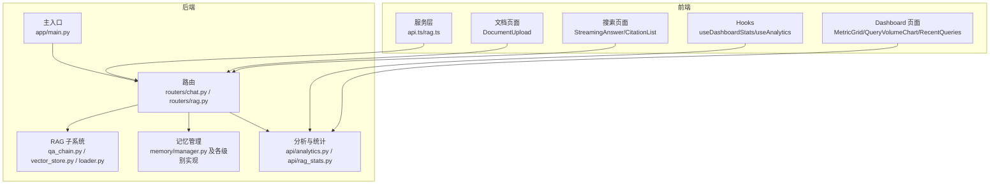
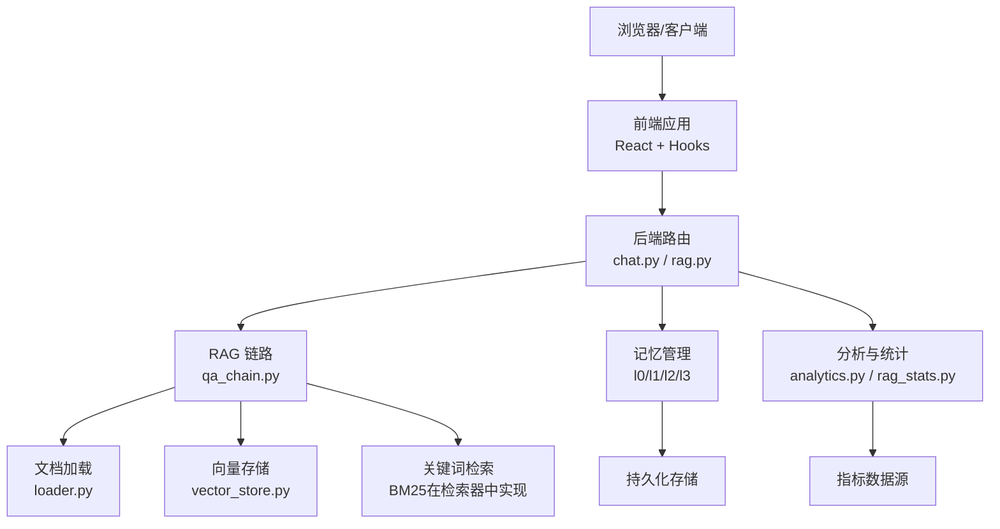
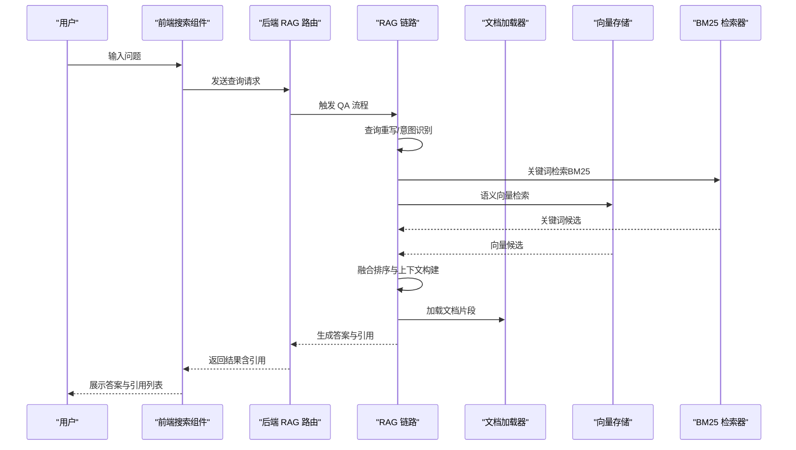
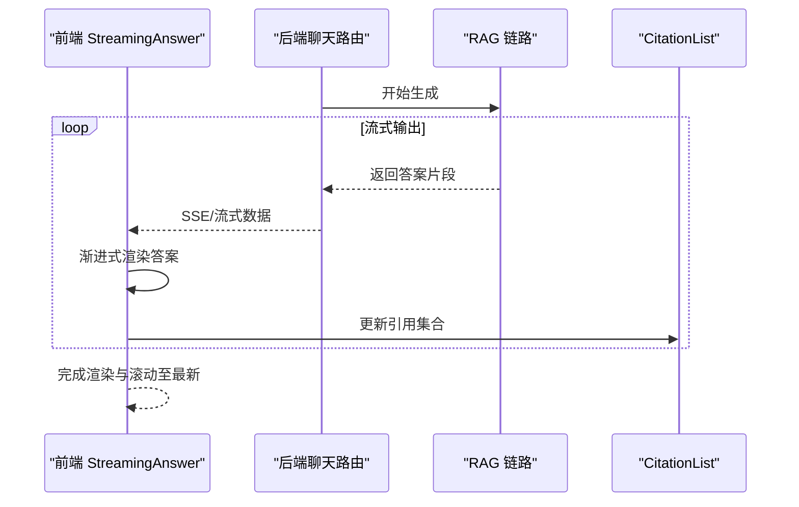
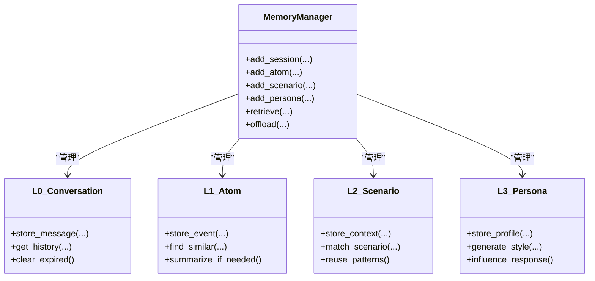
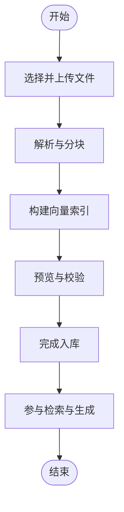
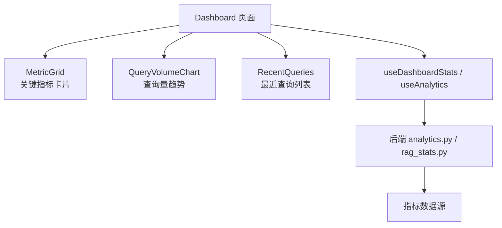
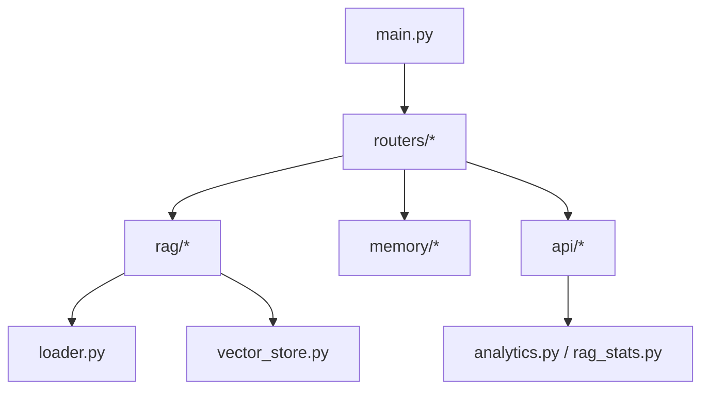

# 核心特性

<cite>
**本文档引用的文件**
- [backend/app/main.py](file://backend/app/main.py)
- [backend/app/routers/chat.py](file://backend/app/routers/chat.py)
- [backend/app/routers/rag.py](file://backend/app/routers/rag.py)
- [backend/app/rag/qa_chain.py](file://backend/app/rag/qa_chain.py)
- [backend/app/rag/vector_store.py](file://backend/app/rag/vector_store.py)
- [backend/app/rag/loader.py](file://backend/app/rag/loader.py)
- [backend/app/memory/manager.py](file://backend/app/memory/manager.py)
- [backend/app/memory/l0_conversation.py](file://backend/app/memory/l0_conversation.py)
- [backend/app/memory/l1_atom.py](file://backend/app/memory/l1_atom.py)
- [backend/app/memory/l2_scenario.py](file://backend/app/memory/l2_scenario.py)
- [backend/app/memory/l3_persona.py](file://backend/app/memory/l3_persona.py)
- [backend/app/api/analytics.py](file://backend/app/api/analytics.py)
- [backend/app/api/rag_stats.py](file://backend/app/api/rag_stats.py)
- [src/pages/Dashboard.tsx](file://src/pages/Dashboard.tsx)
- [src/components/dashboard/MetricGrid.tsx](file://src/components/dashboard/MetricGrid.tsx)
- [src/components/dashboard/QueryVolumeChart.tsx](file://src/components/dashboard/QueryVolumeChart.tsx)
- [src/components/dashboard/RecentQueries.tsx](file://src/components/dashboard/RecentQueries.tsx)
- [src/services/rag.ts](file://src/services/rag.ts)
- [src/components/search/StreamingAnswer.tsx](file://src/components/search/StreamingAnswer.tsx)
- [src/components/search/CitationList.tsx](file://src/components/search/CitationList.tsx)
- [src/components/documents/DocumentUpload.tsx](file://src/components/documents/DocumentUpload.tsx)
- [src/hooks/useDashboardStats.ts](file://src/hooks/useDashboardStats.ts)
- [src/hooks/useAnalytics.ts](file://src/hooks/useAnalytics.ts)
- [docs/product/features.md](file://docs/product/features.md)
- [docs/rag-design.md](file://docs/rag-design.md)
- [docs/architecture/system-overview.md](file://docs/architecture/system-overview.md)
</cite>

## 目录
1. [简介](#简介)
2. [项目结构](#项目结构)
3. [核心组件](#核心组件)
4. [架构总览](#架构总览)
5. [详细组件分析](#详细组件分析)
6. [依赖关系分析](#依赖关系分析)
7. [性能考量](#性能考量)
8. [故障排除指南](#故障排除指南)
9. [结论](#结论)
10. [附录](#附录)

## 简介
本文件面向 Aureon 平台的核心能力进行系统化介绍，重点覆盖以下方面：
- 混合检索增强生成（RAG）系统：融合 BM25 关键词检索与语义向量检索的协同机制
- 实时流式响应与渐进式引用展示：前端与后端的协同实现
- 多层级记忆管理：L0 会话记忆、L1 原子记忆、L2 场景记忆、L3 人物角色记忆的设计理念与应用
- 文档管理全流程：从上传、解析、索引到预览展示
- 系统仪表板：实时指标监控、健康检查与使用分析
- 每个特性均给出典型使用场景与效果说明，帮助快速理解价值与优势

## 项目结构
Aureon 采用前后端分离架构，后端基于 Python（FastAPI），前端基于 React + TypeScript。核心模块分布如下：
- 后端核心：RAG、记忆管理、路由、API、分析与统计等
- 前端核心：仪表板、搜索与流式回答、文档上传与预览、Hooks 与服务层
- 文档资料：产品特性、RAG 设计、系统架构概览等

**图表来源**
- [backend/app/main.py](file://backend/app/main.py)
- [backend/app/routers/chat.py](file://backend/app/routers/chat.py)
- [backend/app/routers/rag.py](file://backend/app/routers/rag.py)
- [backend/app/rag/qa_chain.py](file://backend/app/rag/qa_chain.py)
- [backend/app/rag/vector_store.py](file://backend/app/rag/vector_store.py)
- [backend/app/rag/loader.py](file://backend/app/rag/loader.py)
- [backend/app/memory/manager.py](file://backend/app/memory/manager.py)
- [backend/app/api/analytics.py](file://backend/app/api/analytics.py)
- [backend/app/api/rag_stats.py](file://backend/app/api/rag_stats.py)
- [src/pages/Dashboard.tsx](file://src/pages/Dashboard.tsx)
- [src/components/dashboard/MetricGrid.tsx](file://src/components/dashboard/MetricGrid.tsx)
- [src/components/dashboard/QueryVolumeChart.tsx](file://src/components/dashboard/QueryVolumeChart.tsx)
- [src/components/dashboard/RecentQueries.tsx](file://src/components/dashboard/RecentQueries.tsx)
- [src/services/rag.ts](file://src/services/rag.ts)

**章节来源**
- [backend/app/main.py](file://backend/app/main.py)
- [docs/architecture/system-overview.md](file://docs/architecture/system-overview.md)

## 核心组件
本节概述平台的关键能力与职责边界：
- RAG 检索与生成链路：负责查询重写、关键词检索（BM25）、向量检索、融合排序与生成
- 记忆管理：按层级组织对话与知识，支持会话、原子事件、场景与角色记忆
- 文档管理：上传、解析、索引与预览
- 实时流式回答：后端逐步返回文本片段，前端渐进式渲染与引用展示
- 仪表板与分析：实时指标、查询量趋势、最近查询、RAG 质量统计

**章节来源**
- [backend/app/rag/qa_chain.py](file://backend/app/rag/qa_chain.py)
- [backend/app/memory/manager.py](file://backend/app/memory/manager.py)
- [src/components/search/StreamingAnswer.tsx](file://src/components/search/StreamingAnswer.tsx)
- [src/components/search/CitationList.tsx](file://src/components/search/CitationList.tsx)
- [src/components/documents/DocumentUpload.tsx](file://src/components/documents/DocumentUpload.tsx)
- [backend/app/api/analytics.py](file://backend/app/api/analytics.py)
- [backend/app/api/rag_stats.py](file://backend/app/api/rag_stats.py)

## 架构总览
下图展示了从前端到后端、再到存储与外部服务的整体交互：

**图表来源**
- [backend/app/routers/chat.py](file://backend/app/routers/chat.py)
- [backend/app/routers/rag.py](file://backend/app/routers/rag.py)
- [backend/app/rag/qa_chain.py](file://backend/app/rag/qa_chain.py)
- [backend/app/rag/loader.py](file://backend/app/rag/loader.py)
- [backend/app/rag/vector_store.py](file://backend/app/rag/vector_store.py)
- [backend/app/memory/manager.py](file://backend/app/memory/manager.py)
- [backend/app/api/analytics.py](file://backend/app/api/analytics.py)
- [backend/app/api/rag_stats.py](file://backend/app/api/rag_stats.py)

## 详细组件分析

### 混合检索增强生成（RAG）系统
混合检索通过“关键词检索（BM25）+ 语义向量检索”的融合策略，提升召回质量与相关性。整体流程如下：

- 关键点说明
  - 查询重写与意图识别：提升复杂问题的可检索性
  - BM25 关键词检索：对关键词强相关的文档快速召回
  - 语义向量检索：捕捉语义相似性，弥补关键词不足
  - 融合排序：综合两者结果，输出高质量上下文
  - 文档加载：根据检索结果加载原文片段用于生成

**图表来源**
- [backend/app/routers/rag.py](file://backend/app/routers/rag.py)
- [backend/app/rag/qa_chain.py](file://backend/app/rag/qa_chain.py)
- [backend/app/rag/vector_store.py](file://backend/app/rag/vector_store.py)
- [backend/app/rag/loader.py](file://backend/app/rag/loader.py)

**章节来源**
- [backend/app/rag/qa_chain.py](file://backend/app/rag/qa_chain.py)
- [backend/app/rag/vector_store.py](file://backend/app/rag/vector_store.py)
- [backend/app/rag/loader.py](file://backend/app/rag/loader.py)
- [docs/rag-design.md](file://docs/rag-design.md)

#### 使用场景与效果
- 技术问答：结合关键词与语义，准确定位技术文章中的解决方案
- 跨文档交叉查询：利用融合检索跨越多篇文章找到关联信息
- 复杂业务问题：通过查询重写与多模态检索，提高长尾问题命中率

### 实时流式响应与渐进式引用展示
系统支持后端逐步返回答案片段，前端以流式方式渲染，并同步展示引用列表，提升交互体验与可信度。

- 关键点说明
  - 后端流式输出：逐段生成并推送，降低首字延迟
  - 前端渐进式渲染：边到边显示，同时维护引用列表的增量更新
  - 引用展示：在答案中高亮引用位置，支持点击跳转与预览

**图表来源**
- [backend/app/routers/chat.py](file://backend/app/routers/chat.py)
- [src/components/search/StreamingAnswer.tsx](file://src/components/search/StreamingAnswer.tsx)
- [src/components/search/CitationList.tsx](file://src/components/search/CitationList.tsx)

**章节来源**
- [backend/app/routers/chat.py](file://backend/app/routers/chat.py)
- [src/components/search/StreamingAnswer.tsx](file://src/components/search/StreamingAnswer.tsx)
- [src/components/search/CitationList.tsx](file://src/components/search/CitationList.tsx)

#### 使用场景与效果
- 长回答生成：用户可边看边读，显著改善阅读体验
- 引用透明化：即时展示引用来源，增强回答可信度
- 低延迟体验：首字延迟低，交互更流畅

### 多层级记忆管理系统
Aureon 的记忆体系按层级组织，覆盖从短期对话到长期角色建模的全生命周期。

- 设计理念
  - L0：短期会话记忆，维持上下文连贯性
  - L1：原子记忆，记录独立事件或知识点，便于复用
  - L2：场景记忆，抽象常见情境模式，加速推理
  - L3：人物角色记忆，刻画个性与风格，提升个性化与一致性
- 应用场景
  - 连续对话：L0 保持上下文，避免重复输入
  - 知识复用：L1 将经验沉淀为可检索的知识单元
  - 模式迁移：L2 将“问题-解决”模式迁移到新场景
  - 个性化回复：L3 根据角色特征调整语言风格与偏好

**图表来源**
- [backend/app/memory/manager.py](file://backend/app/memory/manager.py)
- [backend/app/memory/l0_conversation.py](file://backend/app/memory/l0_conversation.py)
- [backend/app/memory/l1_atom.py](file://backend/app/memory/l1_atom.py)
- [backend/app/memory/l2_scenario.py](file://backend/app/memory/l2_scenario.py)
- [backend/app/memory/l3_persona.py](file://backend/app/memory/l3_persona.py)

**章节来源**
- [backend/app/memory/manager.py](file://backend/app/memory/manager.py)
- [backend/app/memory/l0_conversation.py](file://backend/app/memory/l0_conversation.py)
- [backend/app/memory/l1_atom.py](file://backend/app/memory/l1_atom.py)
- [backend/app/memory/l2_scenario.py](file://backend/app/memory/l2_scenario.py)
- [backend/app/memory/l3_persona.py](file://backend/app/memory/l3_persona.py)
- [docs/product/features.md](file://docs/product/features.md)

### 文档管理功能全流程
从上传到自动索引再到预览展示，形成闭环的文档生命周期管理。

- 关键点说明
  - 解析与分块：按文档类型与长度进行智能切分
  - 向量索引：嵌入模型编码并存入向量库
  - 预览与校验：确认分块质量与元数据
  - 入库与检索：文档进入知识库，参与后续检索

**图表来源**
- [backend/app/routers/rag.py](file://backend/app/routers/rag.py)
- [backend/app/rag/loader.py](file://backend/app/rag/loader.py)
- [backend/app/rag/vector_store.py](file://backend/app/rag/vector_store.py)
- [src/components/documents/DocumentUpload.tsx](file://src/components/documents/DocumentUpload.tsx)

**章节来源**
- [backend/app/routers/rag.py](file://backend/app/routers/rag.py)
- [backend/app/rag/loader.py](file://backend/app/rag/loader.py)
- [backend/app/rag/vector_store.py](file://backend/app/rag/vector_store.py)
- [src/components/documents/DocumentUpload.tsx](file://src/components/documents/DocumentUpload.tsx)

#### 使用场景与效果
- 快速导入企业知识库：支持多格式文档，自动完成索引
- 即时预览校验：上传后可快速核对分块与元数据
- 持续增量更新：新增文档无缝接入检索

### 系统仪表板与实时监控
仪表板提供实时指标、查询趋势与最近查询等可视化能力，支撑运营与质量分析。

- 关键点说明
  - 指标卡片：展示 QPS、响应时间、错误率等核心指标
  - 查询趋势：按时间维度展示查询量变化
  - 最近查询：快速回溯与复现问题
  - 分析接口：提供历史与聚合数据，支持深度分析

**图表来源**
- [src/pages/Dashboard.tsx](file://src/pages/Dashboard.tsx)
- [src/components/dashboard/MetricGrid.tsx](file://src/components/dashboard/MetricGrid.tsx)
- [src/components/dashboard/QueryVolumeChart.tsx](file://src/components/dashboard/QueryVolumeChart.tsx)
- [src/components/dashboard/RecentQueries.tsx](file://src/components/dashboard/RecentQueries.tsx)
- [src/hooks/useDashboardStats.ts](file://src/hooks/useDashboardStats.ts)
- [src/hooks/useAnalytics.ts](file://src/hooks/useAnalytics.ts)
- [backend/app/api/analytics.py](file://backend/app/api/analytics.py)
- [backend/app/api/rag_stats.py](file://backend/app/api/rag_stats.py)

**章节来源**
- [src/pages/Dashboard.tsx](file://src/pages/Dashboard.tsx)
- [src/components/dashboard/MetricGrid.tsx](file://src/components/dashboard/MetricGrid.tsx)
- [src/components/dashboard/QueryVolumeChart.tsx](file://src/components/dashboard/QueryVolumeChart.tsx)
- [src/components/dashboard/RecentQueries.tsx](file://src/components/dashboard/RecentQueries.tsx)
- [src/hooks/useDashboardStats.ts](file://src/hooks/useDashboardStats.ts)
- [src/hooks/useAnalytics.ts](file://src/hooks/useAnalytics.ts)
- [backend/app/api/analytics.py](file://backend/app/api/analytics.py)
- [backend/app/api/rag_stats.py](file://backend/app/api/rag_stats.py)

#### 使用场景与效果
- 运营监控：实时掌握系统负载与性能
- 质量评估：通过 RAG 统计与趋势分析优化检索质量
- 故障定位：结合最近查询与指标异常快速定位问题

## 依赖关系分析
后端模块之间的耦合与协作如下：

- 耦合与内聚
  - 路由层作为统一入口，职责清晰，内聚良好
  - RAG 子系统内部模块职责明确，依赖方向单一
  - 记忆管理与分析模块通过路由间接被前端调用
- 潜在风险
  - 检索融合策略与向量/关键词权重需持续调优
  - 记忆层级的写入与查询性能需关注

**图表来源**
- [backend/app/main.py](file://backend/app/main.py)
- [backend/app/routers/chat.py](file://backend/app/routers/chat.py)
- [backend/app/routers/rag.py](file://backend/app/routers/rag.py)
- [backend/app/rag/qa_chain.py](file://backend/app/rag/qa_chain.py)
- [backend/app/rag/vector_store.py](file://backend/app/rag/vector_store.py)
- [backend/app/rag/loader.py](file://backend/app/rag/loader.py)
- [backend/app/memory/manager.py](file://backend/app/memory/manager.py)
- [backend/app/api/analytics.py](file://backend/app/api/analytics.py)
- [backend/app/api/rag_stats.py](file://backend/app/api/rag_stats.py)

**章节来源**
- [backend/app/main.py](file://backend/app/main.py)
- [backend/app/routers/chat.py](file://backend/app/routers/chat.py)
- [backend/app/routers/rag.py](file://backend/app/routers/rag.py)
- [backend/app/rag/qa_chain.py](file://backend/app/rag/qa_chain.py)
- [backend/app/rag/vector_store.py](file://backend/app/rag/vector_store.py)
- [backend/app/rag/loader.py](file://backend/app/rag/loader.py)
- [backend/app/memory/manager.py](file://backend/app/memory/manager.py)
- [backend/app/api/analytics.py](file://backend/app/api/analytics.py)
- [backend/app/api/rag_stats.py](file://backend/app/api/rag_stats.py)

## 性能考量
- 检索融合
  - 关键词检索（BM25）适合快速召回，向量检索适合细粒度匹配；合理设置融合权重与阈值，平衡速度与精度
- 流式输出
  - 后端应尽量减少阻塞操作，确保 SSE/流式传输稳定；前端应具备断线重连与缓冲策略
- 记忆管理
  - L0 会话记忆建议设置过期清理；L1/L2/L3 记忆应定期归档与压缩，避免内存膨胀
- 文档处理
  - 解析与分块策略需考虑大文件与多格式兼容性；向量索引批量写入与并发控制需优化
- 仪表板
  - 指标聚合与缓存策略需避免热点查询导致的延迟

## 故障排除指南
- 检索无结果或结果不相关
  - 检查查询重写是否生效、关键词与向量检索权重配置、分块长度与质量
- 流式回答卡顿或中断
  - 排查后端生成链路阻塞、网络传输稳定性、前端 SSE 处理逻辑
- 记忆未生效
  - 确认记忆写入成功、层级配置正确、过期策略未提前清理
- 文档上传失败或索引异常
  - 校验文件格式、解析器配置、向量模型可用性与索引写入状态
- 仪表板数据缺失
  - 检查分析接口可用性、指标采集任务、缓存与数据库连接

**章节来源**
- [backend/app/rag/qa_chain.py](file://backend/app/rag/qa_chain.py)
- [backend/app/routers/chat.py](file://backend/app/routers/chat.py)
- [backend/app/memory/manager.py](file://backend/app/memory/manager.py)
- [backend/app/rag/loader.py](file://backend/app/rag/loader.py)
- [backend/app/api/analytics.py](file://backend/app/api/analytics.py)

## 结论
Aureon 通过混合检索、流式生成、多层级记忆与全链路文档管理，构建了高效、可解释且可扩展的知识增强系统。仪表板与分析能力进一步保障了系统的可观测性与持续优化。建议在生产环境中持续优化检索融合策略、完善流式传输与断点恢复、加强记忆与文档的生命周期治理，并结合仪表板进行数据驱动的质量改进。

## 附录
- 更多产品特性与设计说明可参考：
  - [docs/product/features.md](file://docs/product/features.md)
  - [docs/rag-design.md](file://docs/rag-design.md)
  - [docs/architecture/system-overview.md](file://docs/architecture/system-overview.md)