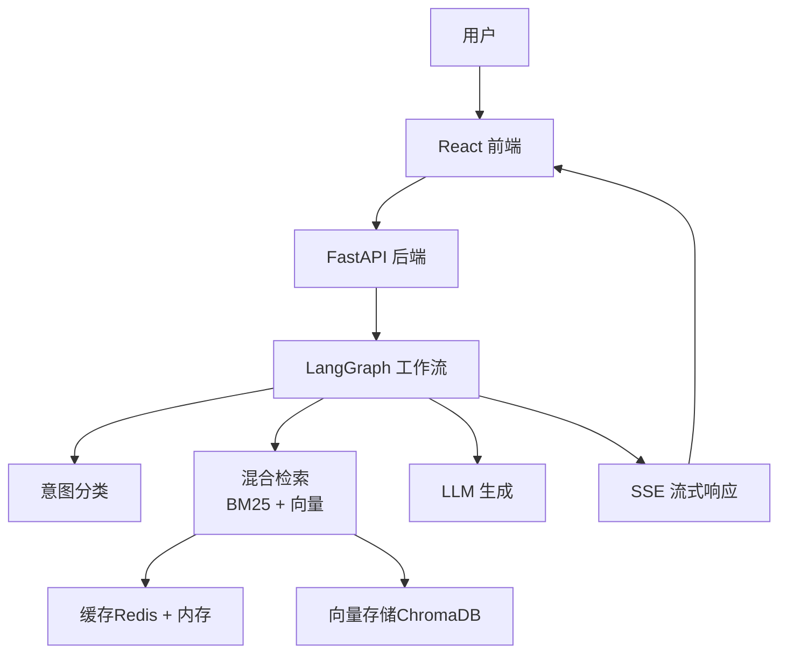
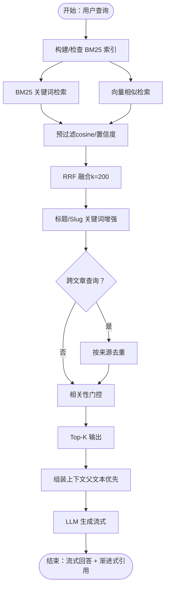
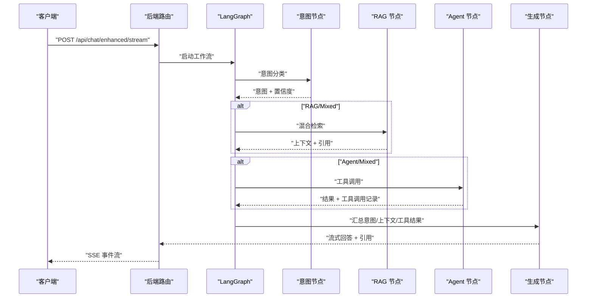
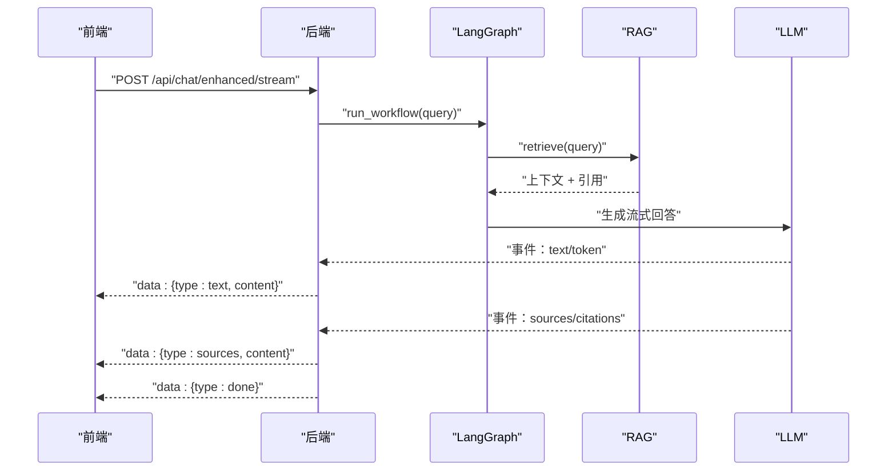
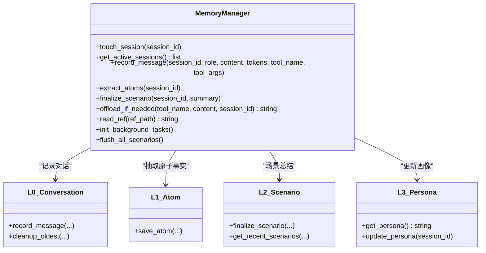
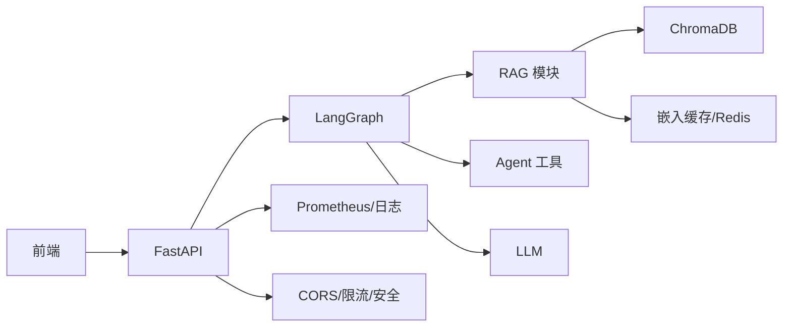

# 项目概述

<cite>
**本文档引用的文件**
- [README.md](file://README.md)
- [TECH_DESIGN.md](file://TECH_DESIGN.md)
- [USER_GUIDE.md](file://USER_GUIDE.md)
- [backend/app/main.py](file://backend/app/main.py)
- [backend/app/routers/chat.py](file://backend/app/routers/chat.py)
- [backend/app/rag/vector_store.py](file://backend/app/rag/vector_store.py)
- [backend/app/langgraph/graph.py](file://backend/app/langgraph/graph.py)
- [backend/app/memory/manager.py](file://backend/app/memory/manager.py)
- [docs/architecture/system-overview.md](file://docs/architecture/system-overview.md)
- [docs/benchmarks/recall-evaluation.md](file://docs/benchmarks/recall-evaluation.md)
- [src/App.tsx](file://src/App.tsx)
- [src/components/search/StreamingAnswer.tsx](file://src/components/search/StreamingAnswer.tsx)
- [src/services/rag.ts](file://src/services/rag.ts)
</cite>

## 目录
1. [简介](#简介)
2. [项目结构](#项目结构)
3. [核心组件](#核心组件)
4. [架构总览](#架构总览)
5. [详细组件分析](#详细组件分析)
6. [依赖关系分析](#依赖关系分析)
7. [性能考量](#性能考量)
8. [故障排查指南](#故障排查指南)
9. [结论](#结论)
10. [附录](#附录)

## 简介
Aureon 是面向企业的 AI 知识库平台，提供生产级的企业搜索与知识智能能力。系统以混合检索增强生成（Hybrid RAG）为核心，融合 BM25 关键词检索与语义向量检索，实现高召回与低延迟的检索效果；通过 LangGraph 工作流编排实现意图识别、RAG 检索、工具调用与 LLM 生成的协同；前端采用 React + Vite 提供实时流式响应与渐进式引用展示，支持多层级记忆管理与可观测性、安全、成本治理等企业级特性。

- 核心目标
  - 为企业用户提供“即搜即得”的知识问答体验，强调低延迟、高准确与可解释性。
  - 通过混合检索与多层记忆，提升复杂问题与跨文档推理的稳定性。
  - 以可观测性、安全与成本治理保障企业级部署的可靠性与可控性。

- 主要特性
  - 企业级 AI 搜索：流式回答与渐进式引用展示
  - 混合检索：BM25 关键词 + 密集向量双通道融合
  - 文档管理：上传、自动索引、预览与源文件管理
  - 实时仪表盘：系统健康、用量与性能指标
  - 观测性与安全：查询追踪、性能监控、PII 检测、SSO、限流
  - 成本治理：工作区维度的成本跟踪与预算管理
  - 知识智能：版本控制与导出
  - AI 平台：多 LLM 路由、置信度评分与会话记忆

- 性能指标（来自仓库）
  - 混合检索召回率@3：97.6%
  - 流式首字时间（TTFT）：约 310ms
  - 完整 RAG 延迟：约 400ms
  - 检索延迟：约 10ms
  - 单次查询成本：约 $0.001

**章节来源**
- [README.md:12-39](file://README.md#L12-L39)

## 项目结构
项目采用前后端分离架构，前端基于 React/Vite，后端基于 FastAPI，LangGraph 负责工作流编排，RAG 模块负责混合检索与向量存储，内存模块提供多层级记忆与场景化总结，可观测性与安全模块贯穿各企业级能力。

```mermaid
graph TB
subgraph "前端React + Vite"
FE_App["App.tsx<br/>路由与布局"]
FE_Search["Search 页面<br/>流式答案与引用"]
FE_Services["服务层<br/>SSE/RAG 流式接口"]
end
subgraph "后端FastAPI"
BE_Main["main.py<br/>应用入口与中间件"]
BE_Routers["routers/chat.py<br/>聊天与增强聊天流"]
BE_LangGraph["langgraph/graph.py<br/>工作流编排"]
BE_RAG["rag/vector_store.py<br/>混合检索与向量存储"]
BE_Memory["memory/manager.py<br/>多层级记忆管理"]
end
FE_App --> FE_Services
FE_Services --> BE_Routers
BE_Routers --> BE_LangGraph
BE_LangGraph --> BE_RAG
BE_Routers --> BE_Memory
BE_Main --> BE_Routers
BE_Main --> BE_LangGraph
BE_Main --> BE_RAG
BE_Main --> BE_Memory
```

**图表来源**
- [src/App.tsx:1-122](file://src/App.tsx#L1-L122)
- [backend/app/main.py:1-371](file://backend/app/main.py#L1-L371)
- [backend/app/routers/chat.py:1-107](file://backend/app/routers/chat.py#L1-L107)
- [backend/app/langgraph/graph.py:1-163](file://backend/app/langgraph/graph.py#L1-L163)
- [backend/app/rag/vector_store.py:1-800](file://backend/app/rag/vector_store.py#L1-L800)
- [backend/app/memory/manager.py:1-130](file://backend/app/memory/manager.py#L1-L130)

**章节来源**
- [docs/architecture/system-overview.md:1-51](file://docs/architecture/system-overview.md#L1-L51)
- [TECH_DESIGN.md:24-58](file://TECH_DESIGN.md#L24-L58)

## 核心组件
- 前端组件
  - 路由与布局：App.tsx 提供导航与页面懒加载
  - 搜索与流式展示：StreamingAnswer.tsx 渲染流式文本与渐进式引用
  - SSE 接口封装：rag.ts 解析后端事件流，拆分 token 与引用增量

- 后端组件
  - 应用入口：main.py 配置 CORS、限流、Prometheus 指标、静态资源挂载与后台任务
  - 路由层：chat.py 提供基础聊天流与增强聊天流（LangGraph 集成）
  - LangGraph 工作流：graph.py 定义意图分类、RAG/Agent 节点与生成节点的编排
  - RAG 模块：vector_store.py 实现 BM25 关键词检索、向量检索、MMR 重排与上下文格式化
  - 记忆管理：manager.py 提供 L0-L3 多层级记忆与场景化总结的生命周期管理

**章节来源**
- [src/App.tsx:1-122](file://src/App.tsx#L1-L122)
- [src/components/search/StreamingAnswer.tsx:1-35](file://src/components/search/StreamingAnswer.tsx#L1-L35)
- [src/services/rag.ts:1-156](file://src/services/rag.ts#L1-L156)
- [backend/app/main.py:1-371](file://backend/app/main.py#L1-L371)
- [backend/app/routers/chat.py:1-107](file://backend/app/routers/chat.py#L1-L107)
- [backend/app/langgraph/graph.py:1-163](file://backend/app/langgraph/graph.py#L1-L163)
- [backend/app/rag/vector_store.py:1-800](file://backend/app/rag/vector_store.py#L1-L800)
- [backend/app/memory/manager.py:1-130](file://backend/app/memory/manager.py#L1-L130)

## 架构总览
系统采用“前端 React → 后端 FastAPI → LangGraph 编排”的三层架构，结合混合检索（BM25 + 向量）、缓存与 SSE 流式传输，形成端到端的低延迟、高可解释性的 RAG 管线。

**图表来源**
- [docs/architecture/system-overview.md:5-12](file://docs/architecture/system-overview.md#L5-L12)
- [backend/app/main.py:68-82](file://backend/app/main.py#L68-L82)
- [backend/app/routers/chat.py:46-93](file://backend/app/routers/chat.py#L46-L93)
- [backend/app/langgraph/graph.py:43-146](file://backend/app/langgraph/graph.py#L43-L146)
- [backend/app/rag/vector_store.py:109-128](file://backend/app/rag/vector_store.py#L109-L128)

## 详细组件分析

### 混合检索增强生成（RAG）系统
- 检索策略
  - BM25 关键词检索：基于 jieba 分词与 IDF 的快速关键词匹配，查询延迟小于 10ms
  - 向量检索：ChromaDB 存储，支持本地 BGE 模型与多提供商嵌入 API（DashScope、SiliconFlow、Zhipu），支持 MMR 多样性重排
  - 融合机制：预过滤 + RRF 融合 + 标题/Slug 关键词增强 + 多样性选取 + 置信度门控，最终输出 Top-K 结果

- 上下文组装与生成
  - 将父-子块（Parent-Child）上下文去重拼接，优先使用父文本提升可解释性
  - 通过 LangGraph 工作流将检索结果注入提示词，结合意图与工具调用生成最终答案

**图表来源**
- [backend/app/rag/vector_store.py:176-325](file://backend/app/rag/vector_store.py#L176-L325)
- [backend/app/rag/vector_store.py:663-741](file://backend/app/rag/vector_store.py#L663-L741)
- [backend/app/rag/vector_store.py:764-786](file://backend/app/rag/vector_store.py#L764-L786)

**章节来源**
- [docs/benchmarks/recall-evaluation.md:49-59](file://docs/benchmarks/recall-evaluation.md#L49-L59)
- [docs/benchmarks/recall-evaluation.md:61-71](file://docs/benchmarks/recall-evaluation.md#L61-L71)
- [backend/app/rag/vector_store.py:176-325](file://backend/app/rag/vector_store.py#L176-L325)
- [backend/app/rag/vector_store.py:663-741](file://backend/app/rag/vector_store.py#L663-L741)

### LangGraph 工作流编排
- 节点与路由
  - 意图分类：根据查询判断走 RAG、Agent、Chat 或 Mixed
  - RAG 节点：执行混合检索并返回上下文与引用
  - Agent 节点：执行工具调用（计算器、联网搜索、外存读取等）
  - 生成节点：将意图、RAG/Agent 结果合并生成最终回答
- 并行执行：Mixed 意图下 RAG 与 Agent 并行执行，缩短端到端延迟

**图表来源**
- [backend/app/routers/chat.py:66-93](file://backend/app/routers/chat.py#L66-L93)
- [backend/app/langgraph/graph.py:43-146](file://backend/app/langgraph/graph.py#L43-L146)

**章节来源**
- [backend/app/langgraph/graph.py:32-41](file://backend/app/langgraph/graph.py#L32-L41)
- [backend/app/langgraph/graph.py:78-104](file://backend/app/langgraph/graph.py#L78-L104)

### 实时流式响应与渐进式引用展示
- 前端解析
  - 通过 rag.ts 的 SSE 解析器，将后端事件流中的“text/token”与“sources/citations”拆分为文本片段与引用增量
  - StreamingAnswer.tsx 支持 Markdown 渲染与打字动画，逐步呈现引用编号与链接
- 后端事件协议
  - 事件类型包含 session、text、tool_start、tool_end、done、error 等，确保前端可感知工具调用与错误状态

**图表来源**
- [src/services/rag.ts:95-156](file://src/services/rag.ts#L95-L156)
- [src/components/search/StreamingAnswer.tsx:18-34](file://src/components/search/StreamingAnswer.tsx#L18-L34)
- [backend/app/routers/chat.py:66-93](file://backend/app/routers/chat.py#L66-L93)

**章节来源**
- [TECH_DESIGN.md:72-80](file://TECH_DESIGN.md#L72-L80)
- [USER_GUIDE.md:100-112](file://USER_GUIDE.md#L100-L112)

### 多层级记忆管理
- 层级定义
  - L0：原始对话（SQLite）用于调试回溯
  - L1：原子事实（SQLite）用于精确事实抽取
  - L2：场景总结（文件系统）用于主题总结
  - L3：用户画像（文件系统）用于长期记忆
- 生命周期
  - 会话活跃：记录消息、提取原子事实、定期场景总结
  - 会话结束：自动归档场景并更新画像
  - 后台清理：超时自动归档与清理

**图表来源**
- [backend/app/memory/manager.py:20-130](file://backend/app/memory/manager.py#L20-L130)

**章节来源**
- [TECH_DESIGN.md:82-89](file://TECH_DESIGN.md#L82-L89)
- [USER_GUIDE.md:149-159](file://USER_GUIDE.md#L149-L159)

### 安全与可观测性
- 安全
  - API Key 仅存在于后端 .env，前端不携带密钥
  - 计算器工具白名单与路径校验，防止路径穿越
  - CORS 限制为本地开发域名
- 可观测性
  - Prometheus 指标暴露 /metrics
  - 请求日志包含耗时与安全头
  - 查询追踪表记录成功率、缓存命中与延迟统计

**章节来源**
- [TECH_DESIGN.md:100-106](file://TECH_DESIGN.md#L100-L106)
- [backend/app/main.py:80-124](file://backend/app/main.py#L80-L124)

## 依赖关系分析
- 组件耦合
  - 前端通过 SSE 与后端解耦，事件协议标准化，便于扩展
  - LangGraph 作为编排中枢，与 RAG、Agent、LLM 解耦，支持并行执行
  - RAG 模块与向量存储、缓存独立，便于替换与扩展
- 外部依赖
  - 向量存储：ChromaDB（可替换为 Qdrant）
  - 嵌入模型：本地 BGE + 多提供商 API
  - 缓存：Redis + 内存缓存
  - LLM：GLM-4-Flash / GPT-4o-mini（可通过环境变量切换）

**图表来源**
- [backend/app/main.py:68-82](file://backend/app/main.py#L68-L82)
- [backend/app/rag/vector_store.py:109-128](file://backend/app/rag/vector_store.py#L109-L128)

**章节来源**
- [docs/architecture/system-overview.md:41-51](file://docs/architecture/system-overview.md#L41-L51)

## 性能考量
- 指标概览（来自 README 与基准报告）
  - 混合检索召回率@3：97.6%
  - 流式首字时间（TTFT）：约 310ms
  - 完整 RAG 延迟：约 400ms
  - 检索延迟：约 10ms
  - 单次查询成本：约 $0.001
- 基准测试
  - 测试数据集：97 对 QA，覆盖 40 篇文章，含事实、推理、合成、跨文章与负样本
  - 指标：Recall@3（混合 93.9%、BM25 93.9%、Dense 86.6%）、MRR 0.894、P50/P99 延迟（BM25 2.4ms、向量 1.8ms、混合 4.4ms）
- 成本效益
  - 单次查询成本约 $0.001，适合大规模企业部署
  - 通过缓存与预分词等优化显著降低 TTFT 与检索延迟

**章节来源**
- [README.md:12-21](file://README.md#L12-L21)
- [docs/benchmarks/recall-evaluation.md:3-22](file://docs/benchmarks/recall-evaluation.md#L3-L22)
- [docs/benchmarks/recall-evaluation.md:41-48](file://docs/benchmarks/recall-evaluation.md#L41-L48)

## 故障排查指南
- 前端页面空白
  - 确认前端开发服务器正常运行，查看终端输出
- 发送消息无响应
  - 检查后端是否运行、LLM API Key 是否有效、网络是否可达
- 模块导入错误（ModuleNotFoundError）
  - 在 backend 目录执行 pip 安装依赖
- 端口占用
  - 后端默认 8000，前端默认 5173；如被占用可调整端口

**章节来源**
- [USER_GUIDE.md:164-193](file://USER_GUIDE.md#L164-L193)

## 结论
Aureon 通过混合检索与 LangGraph 工作流编排，实现了企业级 AI 知识库平台的高召回、低延迟与强可解释性。前端流式渲染与渐进式引用提升了用户体验，多层级记忆与可观测性、安全、成本治理等企业级能力保障了生产的稳定与可控。结合持续的性能优化与基准评估，Aureon 适合在企业内部署为统一的知识服务平台。

## 附录
- 快速启动
  - 前端：进入项目根目录，安装依赖并运行开发服务器
  - 后端：进入 backend 目录，安装依赖并启动 Uvicorn
  - Docker：推荐使用 docker-compose 一键启动
- 文档与路线图
  - 架构、基准、部署与产品文档位于 docs 目录
  - 超级能力计划与规格说明位于 docs/superpowers

**章节来源**
- [README.md:51-63](file://README.md#L51-L63)
- [USER_GUIDE.md:17-61](file://USER_GUIDE.md#L17-L61)