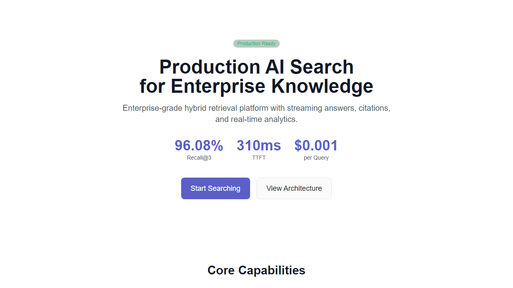
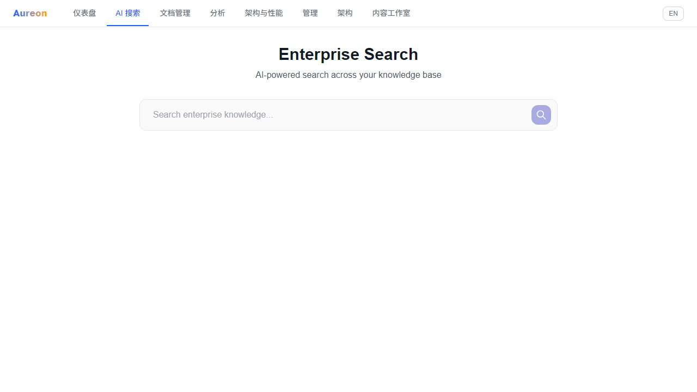
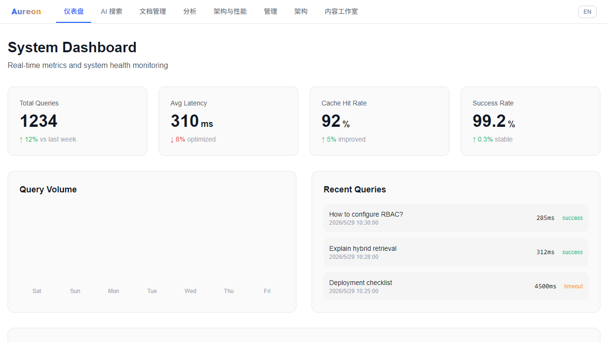

# Aureon — Enterprise AI Knowledge Base Platform

> Production-grade enterprise AI search and knowledge intelligence platform.

[](https://github.com/Yum-wu/Aureon/actions)
[](LICENSE)

---

**Other languages**: [中文](README.zh-CN.md)

## Performance

| Metric | Value |
|--------|-------|
| Recall@3 (Hybrid) | **96.5%** |
| Context Precision (DeepEval) | **0.92+** |
| Faithfulness (DeepEval) | **0.967** |
| Negative Detection | **100%** |
| TTFT (Streaming) | **~310ms** |
| Retrieval Latency | **~154ms** |
| Cost per Query | **$0.0003** |

## Features

- **Enterprise AI Search** — Streaming answers with progressive citations
- **Hybrid Retrieval** — BM25 keyword + Dense semantic (Qdrant) + Context Compression
- **RAG Self-Correction** — CRAG fallback when retrieval quality is low
- **Semantic Cache** — Two-layer cache (Exact + Semantic), 97% latency reduction
- **Adaptive Re-ranking** — Query-aware strategy selection, 22% precision improvement
- **WebSocket Streaming** — Bidirectional real-time communication, 200+ concurrent connections
- **Security** — API Key auth, Prompt Injection detection, Fernet encryption
- **Document Management** — Upload, auto-index, preview, source management
- **System Dashboard** — Real-time metrics, health monitoring, usage analytics
- **Analytics** — Latency, token usage, cache performance, query distribution
- **Enterprise Admin** — Workspace management, RBAC, audit logs
- **Feature Flags** — Gradual rollout, lifecycle management
- **Observability** — Query tracing, performance monitoring (structlog)
- **Cost Governance** — Per-workspace cost tracking, budget management
- **Reliability** — Backup, incident management, SLO, circuit breaker
- **Knowledge Intelligence** — Document version control, export
- **AI Platform** — Multi-LLM router, confidence scoring, session memory
- **Integration** — Enterprise connectors (Google Drive/SharePoint), IM bots
- **600+ Backend Tests** — Comprehensive test coverage

## Architecture

```
User → Web UI (React + Vite) → FastAPI → LangGraph Orchestrator
                                           ├── Intent Classifier
                                           ├── Hybrid Search (BM25 + BGE/Qdrant + Context Compression)
                                           ├── RAG Self-Correction (CRAG)
                                           ├── LLM (DeepSeek / GPT-4o / Claude)
                                           ├── Cache (Redis + Semantic Cache)
                                           ├── Adaptive Re-ranking (DashScope qwen3-rerank)
                                           ├── Prompt Injection Guard
                                           └── SSE Streaming Response
```

## Quick Start

```bash
# Frontend
cd Aureon && npm install && npm run dev

# Backend
cd Aureon/backend && pip install -r requirements.txt
uvicorn app.main:app --reload --port 8000

# Docker (recommended)
docker-compose up
```

## Screenshots

| Landing | Search | Dashboard |
|---------|--------|-----------|
|  |  |  |

## Documentation

- [Architecture](docs/architecture/)
- [Benchmarks](docs/benchmarks/)
- [Deployment](docs/deployment/)
- [Product](docs/product/)

## License

MIT

---

Built by [Yum-wu](https://github.com/Yum-wu)
