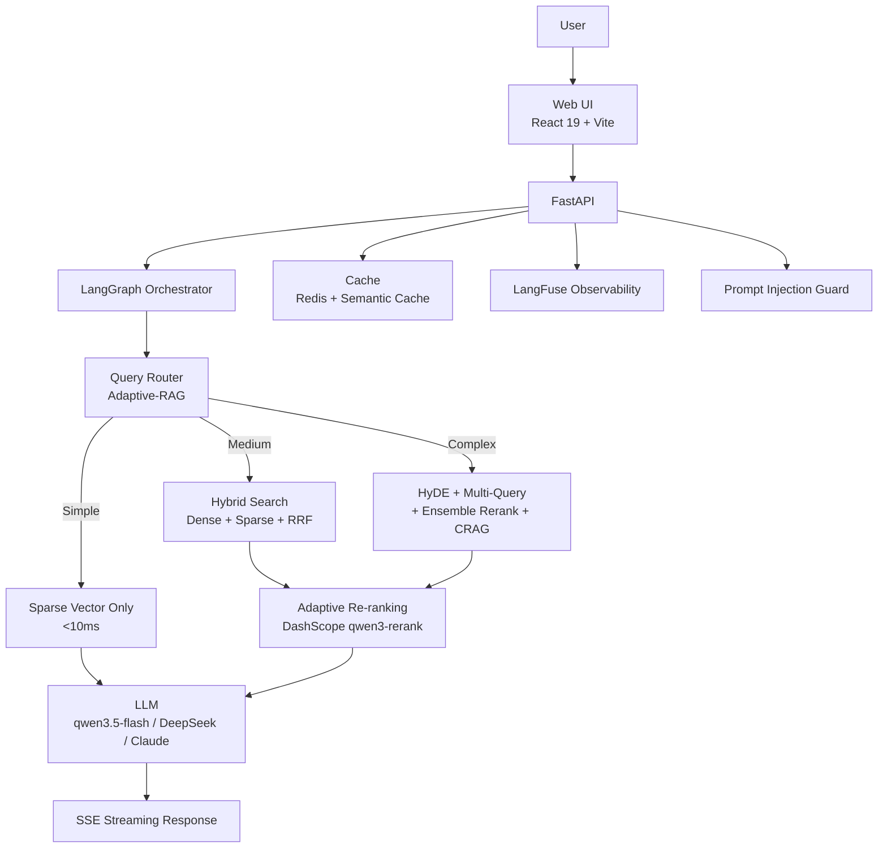

# Aureon

Build an enterprise AI search assistant for your documents in one day. Upload documents, search in natural language, and get precise answers with cited sources — in under a second. Secure, private, production-ready.

[](https://github.com/Yum-wu/Aureon/actions)
[](LICENSE)
[](https://www.python.org/)
[](https://fastapi.tiangolo.com/)
[](https://react.dev/)
[](https://qdrant.tech/)
[](https://www.docker.com/)
[](https://github.com/Yum-wu/Aureon/actions)

**Other languages**: [中文](README.zh-CN.md) | [Live Demo](https://aureon-production-659a.up.railway.app)

---

## Table of Contents

- [Why Aureon?](#why-aureon)
- [Features](#features)
- [Performance](#performance)
- [Architecture](#architecture)
- [Quick Start](#quick-start)
- [Usage](#usage)
- [Screenshots](#screenshots)
- [Security](#security)
- [Documentation](#documentation)
- [Changelog](#changelog)
- [Roadmap](#roadmap)
- [Contributing](#contributing)
- [Support](#support)
- [Maintainers](#maintainers)
- [License](#license)

## Why Aureon?

| | Traditional RAG | Pure Vector Search | **Aureon** |
|---|---|---|---|
| Recall@5 | ~84% | ~90% | **100%** |
| Query Routing | One-size-fits-all | One-size-fits-all | **Adaptive (Simple/Medium/Complex)** |
| Reranking | Static threshold | None | **Dynamic threshold by complexity** |
| Negative Detection | None | None | **92.3% accuracy** |
| TTFT P50 | ~2-5s | ~1-2s | **590ms** |
| Cost/Query | ~$0.01 | ~$0.005 | **$0.0003** |

Aureon combines **Adaptive-RAG query routing**, **Qdrant native sparse+dense hybrid search**, **lightweight CRAG**, and **dynamic reranking** to deliver enterprise-grade retrieval quality at a fraction of the cost.

## Features

- **Enterprise AI Search** — Streaming answers with progressive citations
- **Hybrid Retrieval** — Qdrant native sparse + dense search (RRF fusion), 100% MRR improvement
- **Adaptive Query Routing** — Adaptive-RAG strategy by complexity (Simple → Sparse only, Medium → Hybrid, Complex → HyDE + Multi-Query + CRAG)
- **Lightweight CRAG** — Embedding-based retrieval evaluation, ~50ms latency (vs LLM CRAG ~1s)
- **Dynamic Reranking** — Query-complexity-aware threshold (simple: 0.55, medium: 0.40, complex: 0.30)
- **Semantic Cache** — Two-layer cache (Exact + Semantic), 97% latency reduction
- **Negative Detection** — 92.3% accuracy on out-of-scope queries
- **Security** — JWT/RBAC, Fernet encryption, Prompt Injection detection, PII masking, Dev mode hard-block
- **Multi-tenant Isolation** — JWT-verified tenant_id via pure ASGI middleware
- **Document Management** — Upload, auto-index, preview, source management
- **LangFuse Observability** — Full pipeline tracing (LLM → Tool → Chain → RAG)
- **System Dashboard** — Real-time metrics, health monitoring, usage analytics
- **Enterprise Admin** — Workspace management, RBAC, audit logs
- **Feature Flags** — Gradual rollout, lifecycle management
- **Cost Governance** — Per-workspace cost tracking, budget management
- **1000+ Document Scale** — HNSW quantization + scalar quantization, 75% memory reduction
- **958 Backend Tests** — Comprehensive test coverage with DeepEval quality gates

## Performance

### RAG Quality (R19 Benchmark, 2026-06-17)

| Metric | Value | Target | Status |
|--------|-------|--------|--------|
| Faithfulness | **0.976** | >=0.70 | Pass |
| Answer Relevancy | **0.976** | >=0.75 | Pass |
| Hallucination | **0.067** | <=0.20 | Pass |
| Negative Detection | **92.3%** | >=80% | Pass |
| PII Leakage | **1.000** | >=0.90 | Pass |
| Toxicity | **1.000** | >=0.90 | Pass |
| MRR | **0.968** | >=0.85 | Pass |
| Context Precision | **94.4%** | >=70% | Pass |
| Recall@5 | **100.0%** | >=95% | Pass |

### Latency (50 queries, detailed benchmark)

| Metric | Value | Target |
|--------|-------|--------|
| TTFT P50 | **590ms** | <=2000ms |
| TTFT P95 | 1,677ms | - |
| TPOT | **55.7ms/tok** | <=100ms/tok |
| E2E P50 | **856ms** | <=5000ms |
| Cost per Query | **$0.0003** | - |

## Architecture



<details>
<summary>View text-based architecture</summary>

```
User → Web UI (React + Vite) → FastAPI → LangGraph Orchestrator
                                            ├── Query Router (Adaptive-RAG)
                                            ├── Hybrid Search (Sparse + Dense + RRF)
                                            ├── Lightweight CRAG (embedding-based)
                                            ├── LLM (qwen3.5-flash / DeepSeek / Claude)
                                            ├── Cache (Redis + Semantic Cache)
                                            ├── Adaptive Re-ranking (DashScope qwen3-rerank)
                                            ├── LangFuse Observability
                                            ├── Prompt Injection Guard
                                            └── SSE Streaming Response
```

</details>

## Quick Start

### Prerequisites

- **Python** 3.12+ ([.python-version](.python-version))
- **Node.js** 20+
- **Redis** (required for caching)
- **Qdrant** (Cloud or self-hosted, [free tier available](https://qdrant.tech/))
- **DashScope API Key** (for LLM + Embedding + Reranker, [get one here](https://dashscope.console.aliyun.com/))

### 1. Clone & Configure

```bash
git clone https://github.com/Yum-wu/Aureon.git
cd Aureon

# Copy environment template
cp backend/.env.example backend/.env
# Edit backend/.env with your API keys (see Environment Variables below)
```

### 2. Backend

```bash
cd backend
pip install -r requirements.txt
uvicorn app.main:app --reload --port 8000
```

### 3. Frontend

```bash
npm install && npm run dev
```

### 4. Docker (recommended for production)

```bash
docker-compose up
```

### Environment Variables

Key variables required in `backend/.env` (see [.env.example](backend/.env.example) for full list):

| Variable | Required | Description |
|----------|----------|-------------|
| `LLM_API_KEY` | Yes | DashScope API key for LLM |
| `DASHSCOPE_API_KEY` | Yes | DashScope API key for Embedding |
| `QDRANT_URL` | Yes | Qdrant instance URL |
| `QDRANT_API_KEY` | If remote | Qdrant API key |
| `REDIS_URL` | Yes | Redis connection URL |
| `API_AUTH_KEY` | Production | API authentication key |
| `JWT_SECRET` | SSO/RBAC | JWT signing secret |
| `VECTOR_BACKEND` | No | `qdrant` (default) or `chroma` |
| `SKIP_LOCAL_EMBED` | No | `true` to use API-only embedding (recommended for Docker) |

## Usage

### RAG Query

```bash
# Simple query
curl -X POST http://localhost:8000/api/rag/query \
  -H "Content-Type: application/json" \
  -d '{"query": "What is Aureon?"}'

# Streaming query with SSE
curl -X POST http://localhost:8000/api/rag/query/stream \
  -H "Content-Type: application/json" \
  -d '{"query": "Explain the adaptive RAG routing strategy"}'
```

### Chat with Agent

```bash
# Streaming chat with RAG enhancement
curl -X POST http://localhost:8000/api/chat/enhanced/stream \
  -H "Content-Type: application/json" \
  -H "X-API-Key: your_api_key" \
  -d '{"message": "How does the hybrid search work?", "session_id": "demo"}'
```

### Upload & Index Documents

```bash
# Upload a document for indexing
curl -X POST http://localhost:8000/api/rag/upload \
  -H "X-API-Key: your_api_key" \
  -F "file=@document.pdf"
```

### Health Check

```bash
curl http://localhost:8000/api/health
# {"status": "ok", ...}
```

## Screenshots

| Landing | Search |
|---------|--------|
|  |  |

## Security

Aureon implements multiple security layers:

- **Authentication**: API Key (`X-API-Key` header) + JWT/RBAC with Fernet-encrypted secrets
- **Multi-tenant Isolation**: JWT-verified `tenant_id` via pure ASGI middleware (no header trust)
- **Prompt Injection Detection**: Guardrails in `backend/app/rag/guardrails.py`
- **PII Masking**: Automatic detection and redaction of personally identifiable information
- **Dev Mode Hard-Block**: Production platforms reject `AUTH__ENVIRONMENT=dev` at startup + RBAC bypass
- **CORS Whitelist**: Explicit header allowlist (no `*`)
- **Container Security**: Non-root user (UID 1001), Trivy image scanning, pip-audit dependency scanning
- **Audit Logging**: `user_id` extracted from verified JWT only (never from client headers)

For vulnerability reporting, see [SECURITY.md](SECURITY.md).

## Documentation

- [CLAUDE.md](CLAUDE.md) — Project conventions, structure, API endpoints
- [CONTEXT.md](CONTEXT.md) — Domain terminology, RAG iteration history, MVP boundaries
- [SECURITY.md](SECURITY.md) — Vulnerability reporting

## Changelog

See [GitHub Releases](https://github.com/Yum-wu/Aureon/releases) for version history and release notes.

## Roadmap

- [ ] Multi-language document support (Japanese, Korean)
- [ ] GraphRAG integration for knowledge graph queries
- [ ] Real-time collaborative editing
- [ ] Mobile-responsive PWA
- [ ] Plugin system for custom tools and connectors

See [GitHub Discussions](https://github.com/Yum-wu/Aureon/discussions) for feature requests and progress.

## Contributing

Contributions are welcome! Please follow these steps:

1. **Fork** the repository
2. **Create** a feature branch (`git checkout -b feature/amazing-feature`)
3. **Commit** with conventional messages (`feat: add amazing feature`)
4. **Test** — Run `cd backend && python -m pytest tests/ -v` and `npm test -- --run`
5. **Lint** — Run `cd backend && python -m ruff check .` and `npx eslint .`
6. **Push** and open a **Pull Request**

Please ensure:
- All 958+ backend tests pass
- New code has type annotations (`def foo(x: int) -> str:`)
- Async-first (`async def` + `asyncio`)
- No bare `except` — at minimum `logger.exception()`
- Structured logging via `structlog.get_logger(__name__)`

See [CONTRIBUTING.md](CONTRIBUTING.md) for detailed guidelines (if available).

## Support

- **Bug Reports**: [GitHub Issues](https://github.com/Yum-wu/Aureon/issues)
- **Feature Requests**: [GitHub Discussions](https://github.com/Yum-wu/Aureon/discussions)
- **Security Vulnerabilities**: See [SECURITY.md](SECURITY.md)

## Maintainers

- [Yum-wu](https://github.com/Yum-wu) — Creator & Maintainer

## License

[MIT](LICENSE) (c) 2024-2026 Yum-wu
